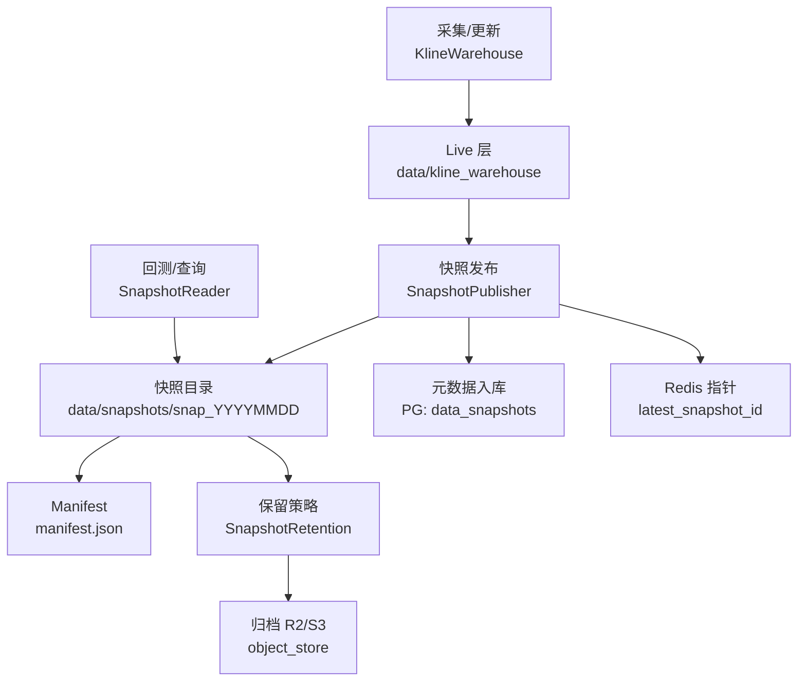
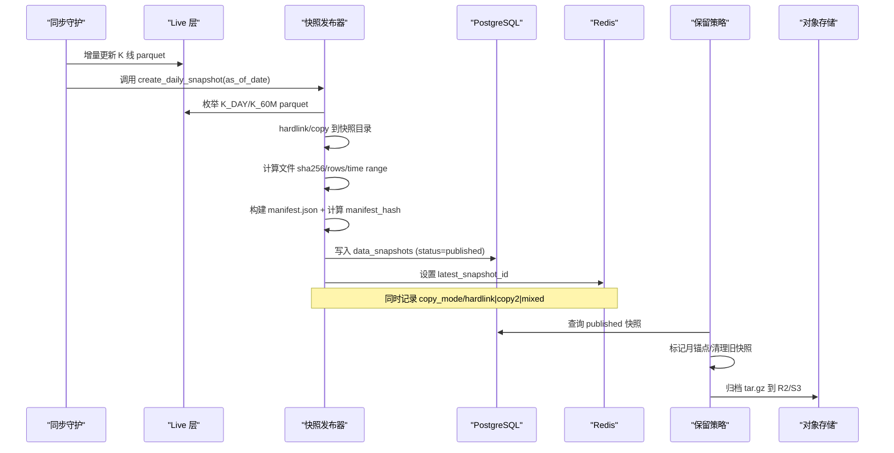
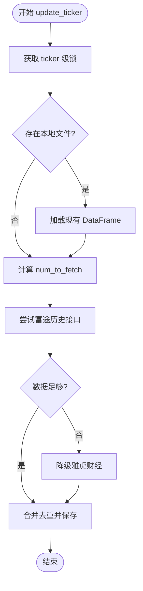
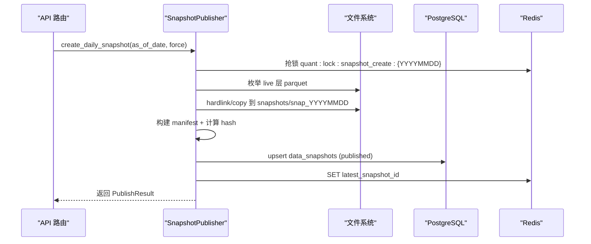
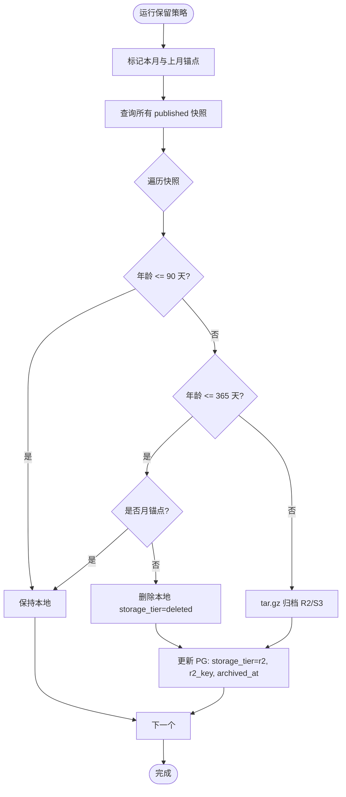
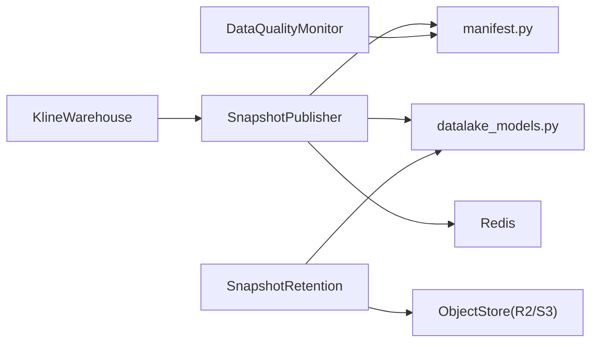

# 数据湖管理

<cite>
**本文引用的文件**
- [backend/core/datalake_models.py](file://backend/core/datalake_models.py)
- [backend/routers/datalake.py](file://backend/routers/datalake.py)
- [backend/services/datalake/snapshot_publisher.py](file://backend/services/datalake/snapshot_publisher.py)
- [backend/services/datalake/kline_warehouse.py](file://backend/services/datalake/kline_warehouse.py)
- [backend/services/datalake/object_store.py](file://backend/services/datalake/object_store.py)
- [backend/services/datalake/manifest.py](file://backend/services/datalake/manifest.py)
- [backend/services/datalake/snapshot_retention.py](file://backend/services/datalake/snapshot_retention.py)
- [backend/services/datalake/paths.py](file://backend/services/datalake/paths.py)
- [backend/services/data_quality/monitor.py](file://backend/services/data_quality/monitor.py)
- [docs/19. Parquet数据湖快照版本化设计.md](file://docs/19. Parquet数据湖快照版本化设计.md)
</cite>

## 目录
1. [简介](#简介)
2. [项目结构](#项目结构)
3. [核心组件](#核心组件)
4. [架构总览](#架构总览)
5. [详细组件分析](#详细组件分析)
6. [依赖关系分析](#依赖关系分析)
7. [性能考量](#性能考量)
8. [故障排查指南](#故障排查指南)
9. [结论](#结论)
10. [附录：操作示例与最佳实践](#附录操作示例与最佳实践)

## 简介
本文件面向数据工程师与分析师，系统化说明 Quant Agent 数据湖管理系统的设计与实践。系统以 Parquet 为存储格式，围绕 K 线仓库、元数据管理、版本控制、快照发布（增量更新、全量备份、生命周期管理）、对象存储（分片、压缩、访问控制）和数据治理（质量检查、血缘追踪、合规审计）展开，并提供与回测引擎、选股器、报表系统的集成方式与操作示例。

## 项目结构
数据湖相关能力集中在后端服务层，采用“可变 live 层 + 不可变快照层”的分层设计：
- Live 层：data/kline_warehouse，按周期分目录存放 parquet 文件，支持增量合并与快速读取。
- 快照层：data/snapshots，每个交易日生成只读快照包，包含 manifest.json、K 线文件副本（hardlink/copy2）以及 sidecars（如 universe）。
- 元数据：PostgreSQL 表 data_snapshots/backtest_reports；Redis 键用于最新快照指针与构建锁。
- 对象存储：S3/R2 兼容的冷归档后端，按 year/month 分区写入历史数据。
- 数据质量：实时校验 OHLCV、时间戳新鲜度、异常检测并暴露指标。

图表来源
- [backend/services/datalake/snapshot_publisher.py:91-250](file://backend/services/datalake/snapshot_publisher.py#L91-L250)
- [backend/services/datalake/kline_warehouse.py:16-174](file://backend/services/datalake/kline_warehouse.py#L16-L174)
- [backend/services/datalake/snapshot_retention.py:29-129](file://backend/services/datalake/snapshot_retention.py#L29-L129)
- [backend/services/datalake/object_store.py:32-165](file://backend/services/datalake/object_store.py#L32-L165)
- [backend/services/datalake/manifest.py:27-78](file://backend/services/datalake/manifest.py#L27-L78)

章节来源
- [backend/services/datalake/paths.py:1-43](file://backend/services/datalake/paths.py#L1-L43)
- [docs/19. Parquet数据湖快照版本化设计.md:55-124](file://docs/19. Parquet数据湖快照版本化设计.md#L55-L124)

## 核心组件
- K 线仓库（KlineWarehouse）：本地 Parquet 数仓，提供增量更新与极速读取，作为 live 层。
- 快照发布器（SnapshotPublisher）：从 live 层生成不可变快照，计算 manifest 哈希，写入 PG 与 Redis。
- 快照保留（SnapshotRetention）：执行 T1/T2/T3 保留策略，标记月锚点、删除旧快照、归档到 R2。
- 对象存储（S3ObjectStore）：基于 PyArrow 的 S3/R2 客户端，按 Hive 分区写入/读取冷数据。
- Manifest（manifest.py）：构建、校验与计算 manifest 哈希的纯函数集合。
- 数据质量监控（DataQualityMonitor）：字段完整性、价格异常、时间戳新鲜度等检查，输出指标与告警。
- 数据模型（datalake_models.py）：data_snapshots 与 backtest_reports 的 ORM 定义。
- API 路由（routers/datalake.py）：快照列表、最新快照、详情、重建与保留任务触发。

章节来源
- [backend/services/datalake/kline_warehouse.py:16-258](file://backend/services/datalake/kline_warehouse.py#L16-L258)
- [backend/services/datalake/snapshot_publisher.py:91-302](file://backend/services/datalake/snapshot_publisher.py#L91-L302)
- [backend/services/datalake/snapshot_retention.py:29-143](file://backend/services/datalake/snapshot_retention.py#L29-L143)
- [backend/services/datalake/object_store.py:32-177](file://backend/services/datalake/object_store.py#L32-L177)
- [backend/services/datalake/manifest.py:1-78](file://backend/services/datalake/manifest.py#L1-L78)
- [backend/services/data_quality/monitor.py:91-408](file://backend/services/data_quality/monitor.py#L91-L408)
- [backend/core/datalake_models.py:31-82](file://backend/core/datalake_models.py#L31-L82)
- [backend/routers/datalake.py:1-138](file://backend/routers/datalake.py#L1-L138)

## 架构总览
数据湖采用“live 可变 + snapshot 不可变”的双层架构，配合 manifest 指纹与 PG/Redis 元数据，确保回测可复现与审计可追溯。

图表来源
- [backend/services/datalake/kline_warehouse.py:175-258](file://backend/services/datalake/kline_warehouse.py#L175-L258)
- [backend/services/datalake/snapshot_publisher.py:119-250](file://backend/services/datalake/snapshot_publisher.py#L119-L250)
- [backend/services/datalake/snapshot_retention.py:61-129](file://backend/services/datalake/snapshot_retention.py#L61-L129)
- [backend/services/datalake/object_store.py:83-165](file://backend/services/datalake/object_store.py#L83-L165)

## 详细组件分析

### K 线仓库（Live 层）
- 存储布局：按周期分目录（K_DAY、K_60M），ticker 文件名规范化为 safe_ticker.parquet。
- 增量更新：优先富途拉取，不足时降级雅虎财经；去重策略 keep='last'，保证最新复权覆盖。
- 守护进程：每日凌晨定时同步，使用 Redis 分布式锁避免重复拉取；完成后触发快照发布与保留任务。
- 读取优化：异步线程池读取 parquet，排序后返回最近 N 条，适合回测高频读取。

图表来源
- [backend/services/datalake/kline_warehouse.py:55-174](file://backend/services/datalake/kline_warehouse.py#L55-L174)

章节来源
- [backend/services/datalake/kline_warehouse.py:16-258](file://backend/services/datalake/kline_warehouse.py#L16-L258)

### 快照发布机制
- 幂等与并发：同一日期已 published 则跳过；使用 Redis 锁防止重复构建。
- 质量门禁：默认放行，可注入自定义 gate；失败则 status=failed 并记录 quality_gate。
- 文件复制：优先 hardlink，跨文件系统自动降级 copy2；记录 copy_mode。
- Manifest 构建：files 清单含 path/sha256/rows/time_min/time_max；sidecars 包含 universe 摘要；计算 manifest_hash。
- 元数据持久化：写入 PG data_snapshots，设置 published_at；更新 Redis latest_snapshot_id。

图表来源
- [backend/routers/datalake.py:112-131](file://backend/routers/datalake.py#L112-L131)
- [backend/services/datalake/snapshot_publisher.py:119-250](file://backend/services/datalake/snapshot_publisher.py#L119-L250)

章节来源
- [backend/services/datalake/snapshot_publisher.py:91-302](file://backend/services/datalake/snapshot_publisher.py#L91-L302)
- [backend/routers/datalake.py:1-138](file://backend/routers/datalake.py#L1-L138)

### 元数据管理与版本控制
- 数据模型：
  - DataSnapshot：snapshot_id、as_of_date、status、manifest_hash、manifest_json、ticker_count、total_bytes、is_monthly_anchor、storage_tier、r2_key、时间戳。
  - BacktestReport：run_id、data_snapshot_id（FK）、manifest_hash、code_hash、params、random_seed、engine_version、data_mode、reproducible、metrics、equity_curve、trades、result_digest、symbol、notes、created_at。
- 版本控制原则：
  - manifest_hash 为数据指纹，BT-02 报告通过 code_hash + manifest_hash 实现可复现性。
  - 仅 published 快照可被回测默认引用；failed 快照不对外暴露。

章节来源
- [backend/core/datalake_models.py:31-82](file://backend/core/datalake_models.py#L31-L82)
- [docs/19. Parquet数据湖快照版本化设计.md:165-200](file://docs/19. Parquet数据湖快照版本化设计.md#L165-L200)

### 快照生命周期管理（保留策略）
- Tier 策略：
  - T1（0–90 天）：全保留。
  - T2（91–365 天）：仅保留月锚点，非锚点删除本地。
  - T3（>365 天）：tar.gz 归档至 R2/S3，删除本地；PG 记录 r2_key 与 archived_at。
- 月锚点：每月最后一个 published 日快照标记 is_monthly_anchor=true。
- 分布式锁：保留任务通过 Redis 锁串行执行。

图表来源
- [backend/services/datalake/snapshot_retention.py:61-129](file://backend/services/datalake/snapshot_retention.py#L61-L129)

章节来源
- [backend/services/datalake/snapshot_retention.py:29-143](file://backend/services/datalake/snapshot_retention.py#L29-L143)

### 对象存储方案（R2/S3 冷归档）
- 配置与环境变量：endpoint_url、bucket、access_key、secret_key、region、prefix。
- 分区布局：Hive 风格 {period}/{symbol_safe}/year=YYYY/month=MM/part-*.parquet。
- 写入逻辑：过滤超过一年的冷数据，转换为 PyArrow Table，write_to_dataset 直写远端。
- 读取逻辑：dataset.to_table().to_pandas()，按 days 过滤并排序。
- 未配置行为：优雅降级为 no-op，不抛异常、不写假数据。

章节来源
- [backend/services/datalake/object_store.py:32-177](file://backend/services/datalake/object_store.py#L32-L177)

### 数据治理规范
- 质量检查：
  - 字段完整性：OHLCV 必填字段非空。
  - 价格异常：零价/负价/跳变检测。
  - 时间戳新鲜度：延迟超阈值告警。
  - 成交量异常：负值检测。
  - OHLC 一致性：high < low 判定错误。
- 指标与告警：
  - 脏数据率、完整率、平均/最大延迟、过期计数、价格异常计数。
  - Prometheus 指标导出；可接入飞书/Telegram 告警回调。
- 血缘与审计：
  - manifest 记录 files、sidecars、quality_gate、source_sync_lock。
  - BT-02 报告绑定 data_snapshot_id 与 manifest_hash，支撑审计与复现实验。

章节来源
- [backend/services/data_quality/monitor.py:91-408](file://backend/services/data_quality/monitor.py#L91-L408)
- [backend/services/datalake/manifest.py:27-78](file://backend/services/datalake/manifest.py#L27-L78)
- [backend/core/datalake_models.py:53-82](file://backend/core/datalake_models.py#L53-L82)

## 依赖关系分析
- 模块耦合：
  - SnapshotPublisher 依赖 paths（路径与常量）、manifest（构建与哈希）、kline_warehouse（live 源）、redis_client（锁与指针）、datalake_models（PG 写入）。
  - SnapshotRetention 依赖 datalake_models、paths、可选 r2_uploader。
  - ObjectStore 依赖 pyarrow 的 S3FileSystem，环境变量驱动。
  - DataQualityMonitor 独立，通过 metrics 暴露指标，供看板与告警消费。
- 外部依赖：
  - PostgreSQL：元数据持久化。
  - Redis：分布式锁与最新快照指针。
  - R2/S3：冷归档存储。

图表来源
- [backend/services/datalake/snapshot_publisher.py:91-250](file://backend/services/datalake/snapshot_publisher.py#L91-L250)
- [backend/services/datalake/snapshot_retention.py:29-129](file://backend/services/datalake/snapshot_retention.py#L29-L129)
- [backend/services/datalake/object_store.py:32-165](file://backend/services/datalake/object_store.py#L32-L165)
- [backend/services/data_quality/monitor.py:91-408](file://backend/services/data_quality/monitor.py#L91-L408)

章节来源
- [backend/services/datalake/snapshot_publisher.py:91-302](file://backend/services/datalake/snapshot_publisher.py#L91-L302)
- [backend/services/datalake/snapshot_retention.py:29-143](file://backend/services/datalake/snapshot_retention.py#L29-L143)
- [backend/services/datalake/object_store.py:32-177](file://backend/services/datalake/object_store.py#L32-L177)
- [backend/services/data_quality/monitor.py:91-408](file://backend/services/data_quality/monitor.py#L91-L408)

## 性能考量
- 读取性能：Parquet 列式存储 + pyarrow 引擎，异步线程池避免阻塞事件循环；排序后 tail(num) 减少内存占用。
- 写入优化：hardlink 零拷贝创建快照；跨文件系统自动降级 copy2；manifest 记录 copy_mode。
- 存储成本：T1/T2/T3 保留策略结合月锚点与 R2 归档，显著降低长期存储成本。
- 并发控制：Redis 分布式锁避免重复构建与保留任务冲突。
- 质量门禁：脏数据率阈值控制，避免污染快照。

[本节为通用性能指导，无需特定文件来源]

## 故障排查指南
- 快照构建失败：
  - 检查 Redis 锁是否被占用；查看 quality_gate 结果；确认 live 层 parquet 是否存在且可读。
  - 参考日志关键字：snapshot_lock_redis_unavailable、universe_sidecar_failed、snapshot_published。
- 快照过旧：
  - 查询 latest_snapshot 的 age_days；若 stale_warning=true，需重新触发 rebuild 或修复上游同步。
- 保留任务未执行：
  - 检查 Redis 锁 key；确认 daemon 是否在预期时间窗口执行；查看 PG storage_tier 状态。
- 对象存储写入失败：
  - 校验环境变量配置；检查网络与权限；查看 error 日志中的 L3 写入失败信息。

章节来源
- [backend/routers/datalake.py:61-138](file://backend/routers/datalake.py#L61-L138)
- [backend/services/datalake/snapshot_publisher.py:136-250](file://backend/services/datalake/snapshot_publisher.py#L136-L250)
- [backend/services/datalake/snapshot_retention.py:132-143](file://backend/services/datalake/snapshot_retention.py#L132-L143)
- [backend/services/datalake/object_store.py:116-165](file://backend/services/datalake/object_store.py#L116-L165)

## 结论
Quant Agent 数据湖通过“live 可变 + snapshot 不可变”的架构，结合 manifest 指纹、PG/Redis 元数据与三级保留策略，实现了高可靠、可复现、可审计的数据版本化管理。对象存储冷归档与数据质量监控进一步提升了系统稳定性与成本效益。该体系为回测引擎、选股器与报表系统提供了稳定一致的数据基础。

[本节为总结性内容，无需特定文件来源]

## 附录：操作示例与最佳实践

- 数据导入流程（增量更新与快照发布）
  - 步骤：
    1) 启动 KlineWarehouse.daemon_sync_task，每日凌晨增量拉取 K 线。
    2) 成功后调用 SnapshotPublisher.create_daily_snapshot(as_of_date)。
    3) 验证 PG data_snapshots 中 status=published 与 Redis latest_snapshot_id。
  - 参考路径：
    - [backend/services/datalake/kline_warehouse.py:175-258](file://backend/services/datalake/kline_warehouse.py#L175-L258)
    - [backend/services/datalake/snapshot_publisher.py:119-250](file://backend/services/datalake/snapshot_publisher.py#L119-L250)

- 查询优化（回测读取快照）
  - 建议：
    - 使用 SnapshotReader 指定 data_snapshot_id（或 latest_published）。
    - 限制 num 参数，减少内存与 IO。
    - 利用 Parquet 列裁剪与 pyarrow 引擎。
  - 参考路径：
    - [docs/19. Parquet数据湖快照版本化设计.md:272-294](file://docs/19. Parquet数据湖快照版本化设计.md#L272-L294)

- 存储空间管理（保留策略）
  - 建议：
    - 定期执行保留任务（周日或月初），观察 T2/T3 清理效果。
    - 关注磁盘使用与 R2 归档大小，调整保留天数与阈值。
  - 参考路径：
    - [backend/services/datalake/snapshot_retention.py:61-129](file://backend/services/datalake/snapshot_retention.py#L61-L129)

- 与回测引擎集成
  - 在回测请求中传入 data_snapshot_id；默认 latest_published；报告绑定 manifest_hash 与 code_hash。
  - 参考路径：
    - [backend/core/datalake_models.py:53-82](file://backend/core/datalake_models.py#L53-L82)
    - [docs/19. Parquet数据湖快照版本化设计.md:244-319](file://docs/19. Parquet数据湖快照版本化设计.md#L244-L319)

- 与选股器集成
  - 使用快照侧的 universe sidecar 获取标的生命周期快照，避免幸存者偏差。
  - 参考路径：
    - [backend/services/datalake/snapshot_publisher.py:278-302](file://backend/services/datalake/snapshot_publisher.py#L278-L302)

- 与报表系统集成
  - 通过 datalake API 获取快照列表与详情，展示数据版本与质量门限。
  - 参考路径：
    - [backend/routers/datalake.py:61-138](file://backend/routers/datalake.py#L61-L138)

- 数据质量检查与告警
  - 启用 DataQualityMonitor，设置阈值与回调；监控脏数据率与延迟。
  - 参考路径：
    - [backend/services/data_quality/monitor.py:91-408](file://backend/services/data_quality/monitor.py#L91-L408)
