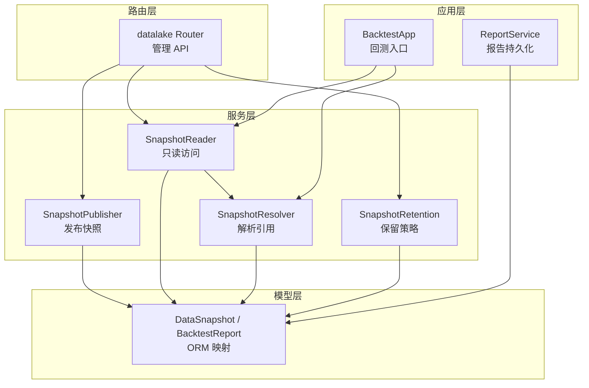
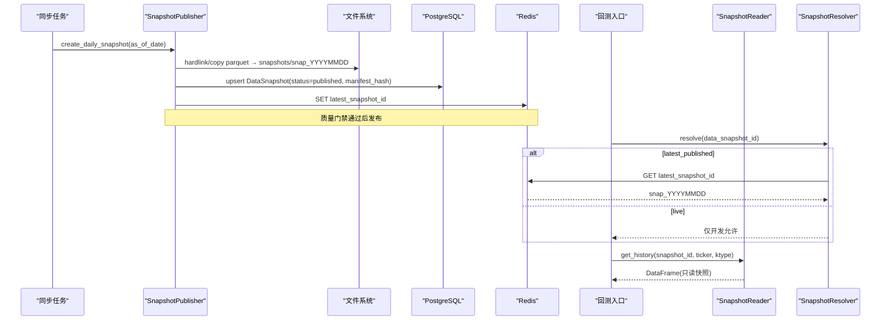
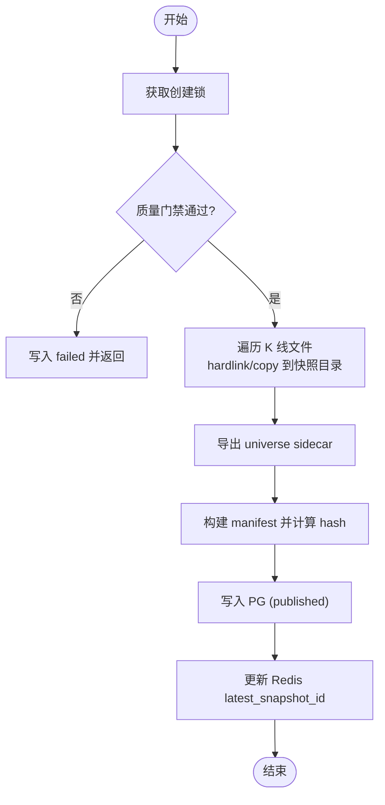
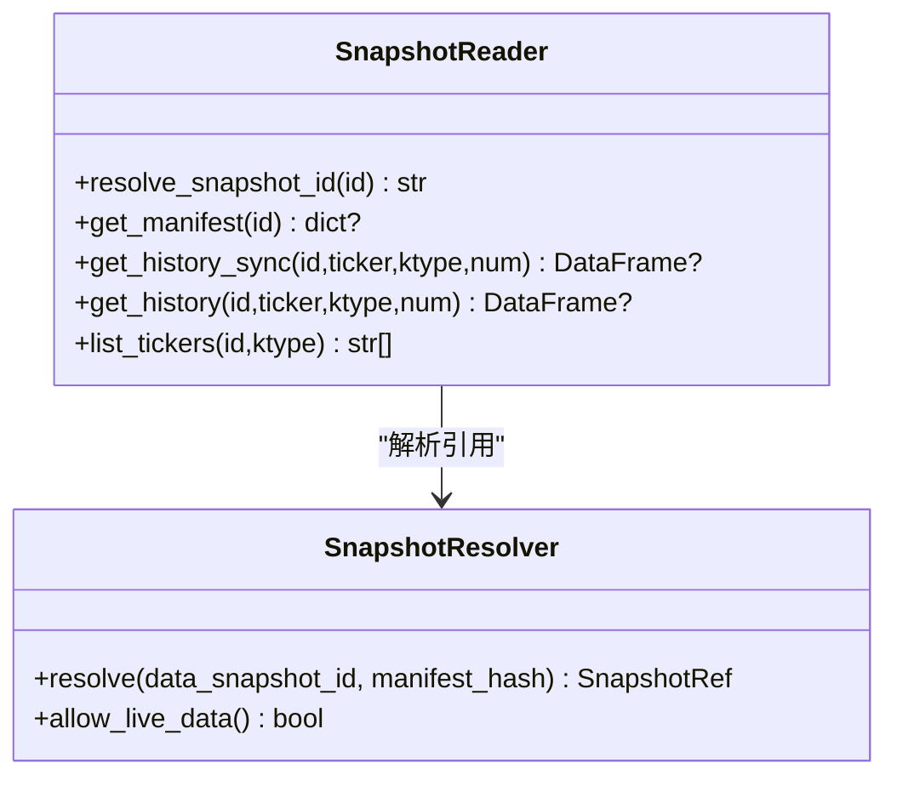
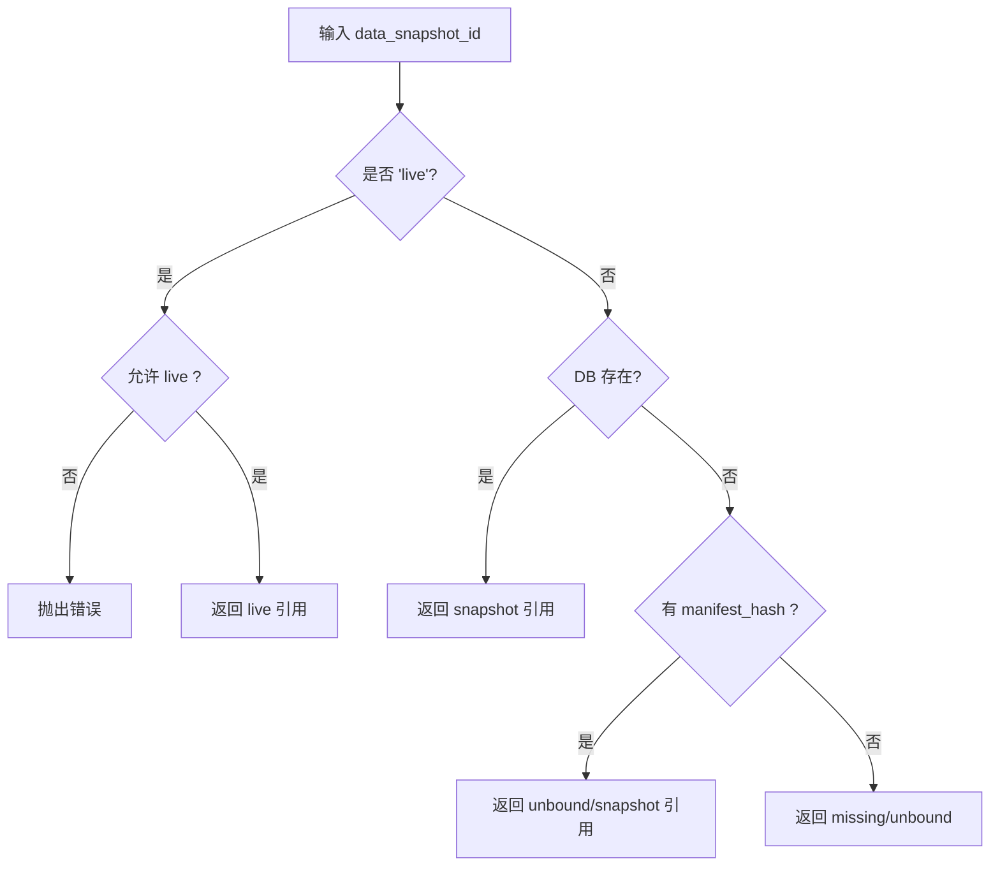
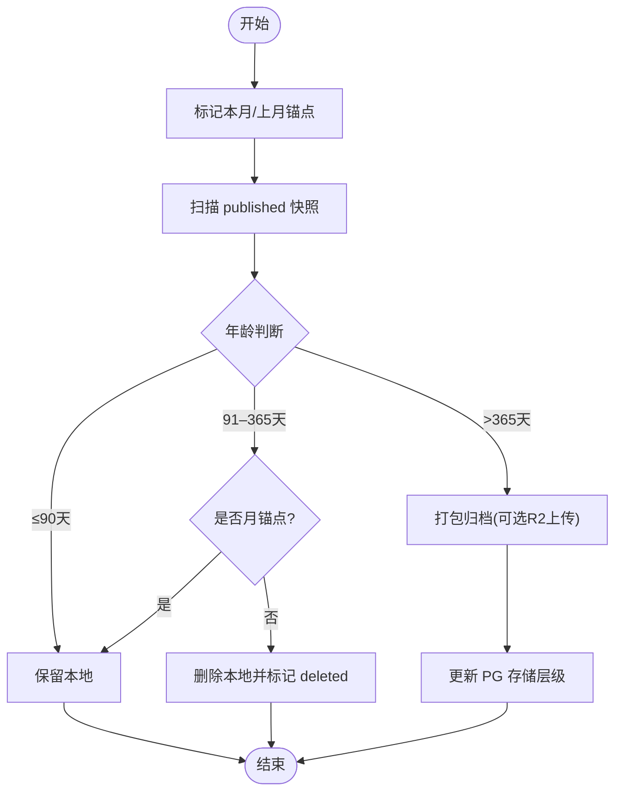
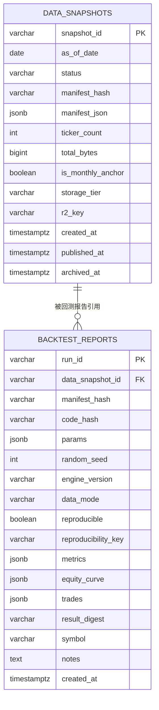
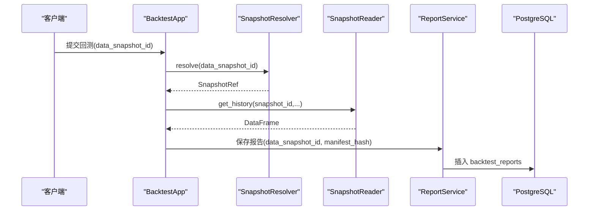
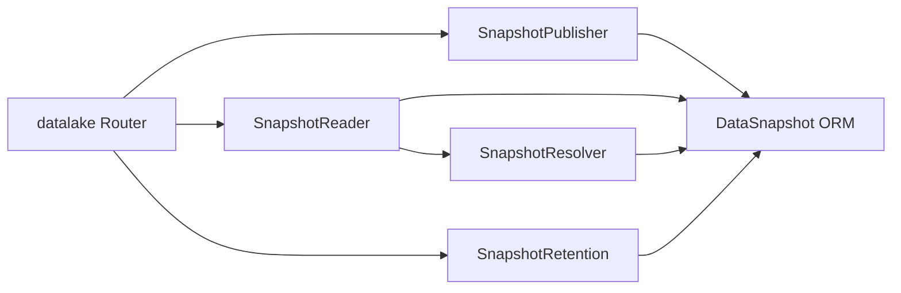

# 版本控制系统

<cite>
**本文引用的文件**
- [backend/services/datalake/snapshot_publisher.py](file://backend/services/datalake/snapshot_publisher.py)
- [backend/services/datalake/snapshot_reader.py](file://backend/services/datalake/snapshot_reader.py)
- [backend/services/datalake/snapshot_resolver.py](file://backend/services/datalake/snapshot_resolver.py)
- [backend/services/datalake/snapshot_retention.py](file://backend/services/datalake/snapshot_retention.py)
- [backend/core/datalake_models.py](file://backend/core/datalake_models.py)
- [backend/routers/datalake.py](file://backend/routers/datalake.py)
- [backend/app/backtest_app.py](file://backend/app/backtest_app.py)
- [backend/app/backtest/report_service.py](file://backend/app/backtest/report_service.py)
- [docs/19. Parquet数据湖快照版本化设计.md](file://docs/19. Parquet数据湖快照版本化设计.md)
</cite>

## 目录
1. [简介](#简介)
2. [项目结构](#项目结构)
3. [核心组件](#核心组件)
4. [架构总览](#架构总览)
5. [详细组件分析](#详细组件分析)
6. [依赖关系分析](#依赖关系分析)
7. [性能与存储优化](#性能与存储优化)
8. [故障排查指南](#故障排查指南)
9. [结论](#结论)
10. [附录：API 使用示例](#附录api-使用示例)

## 简介
本文件系统性地说明 Quant Agent 数据湖的版本控制能力，围绕“不可变快照 + 元数据索引 + 保留归档”的体系，实现回测可复现、历史可追溯、空间可治理。重点覆盖：
- 元数据管理机制：版本信息存储、变更追踪、依赖关系（manifest 与 sidecar）。
- 快照版本控制算法：版本号生成规则、版本树（发布态）与分支策略（live/snapshot/unbound）。
- 版本操作 API：创建版本、切换版本、比较差异、回滚。
- 版本保留策略：自动清理、空间优化、历史归档。
- 集成方式：与回测系统、报表系统的版本一致性保证。

## 项目结构
数据湖版本控制由服务层、模型层、路由层与应用层共同组成：
- 服务层：快照发布、读取、解析、保留策略。
- 模型层：PostgreSQL 表结构与 ORM 映射。
- 路由层：对外暴露的管理 API。
- 应用层：回测入口与报告持久化，绑定数据快照指纹。

图表来源
- [backend/services/datalake/snapshot_publisher.py:91-250](file://backend/services/datalake/snapshot_publisher.py#L91-L250)
- [backend/services/datalake/snapshot_reader.py:30-121](file://backend/services/datalake/snapshot_reader.py#L30-L121)
- [backend/services/datalake/snapshot_resolver.py:31-103](file://backend/services/datalake/snapshot_resolver.py#L31-L103)
- [backend/services/datalake/snapshot_retention.py:29-143](file://backend/services/datalake/snapshot_retention.py#L29-L143)
- [backend/core/datalake_models.py:31-82](file://backend/core/datalake_models.py#L31-L82)
- [backend/routers/datalake.py:61-138](file://backend/routers/datalake.py#L61-L138)
- [backend/app/backtest_app.py:65-279](file://backend/app/backtest_app.py#L65-L279)
- [backend/app/backtest/report_service.py:88-145](file://backend/app/backtest/report_service.py#L88-L145)

章节来源
- [docs/19. Parquet数据湖快照版本化设计.md:55-89](file://docs/19. Parquet数据湖快照版本化设计.md#L55-L89)

## 核心组件
- 快照发布器（SnapshotPublisher）：从 live 层生成不可变快照包，构建 manifest，写入 PG 并更新 Redis 指针。
- 快照读取器（SnapshotReader）：以 snapshot_id 为键只读访问快照 K 线；支持 latest_published 解析。
- 快照解析器（SnapshotResolver）：将 data_snapshot_id 解析为可绑定的 SnapshotRef（snapshot/live/unbound），并校验环境策略。
- 保留策略（SnapshotRetention）：按 T1/T2/T3 策略清理本地快照、标记月锚点、归档到远端或压缩包。
- 数据模型（DataSnapshot/BacktestReport）：持久化快照元数据与回测报告的版本绑定。
- 管理 API（datalake Router）：提供列表、详情、重建、保留执行等接口。

章节来源
- [backend/services/datalake/snapshot_publisher.py:91-250](file://backend/services/datalake/snapshot_publisher.py#L91-L250)
- [backend/services/datalake/snapshot_reader.py:30-121](file://backend/services/datalake/snapshot_reader.py#L30-L121)
- [backend/services/datalake/snapshot_resolver.py:31-103](file://backend/services/datalake/snapshot_resolver.py#L31-L103)
- [backend/services/datalake/snapshot_retention.py:29-143](file://backend/services/datalake/snapshot_retention.py#L29-L143)
- [backend/core/datalake_models.py:31-82](file://backend/core/datalake_models.py#L31-L82)
- [backend/routers/datalake.py:61-138](file://backend/routers/datalake.py#L61-L138)

## 架构总览
数据湖版本控制遵循“Live 可变、Snapshot 不可变”的原则，通过 manifest 作为数据指纹，结合 PG 元数据与 Redis 指针，形成稳定的版本引用链。

图表来源
- [backend/services/datalake/snapshot_publisher.py:119-250](file://backend/services/datalake/snapshot_publisher.py#L119-L250)
- [backend/services/datalake/snapshot_reader.py:42-114](file://backend/services/datalake/snapshot_reader.py#L42-L114)
- [backend/services/datalake/snapshot_resolver.py:44-95](file://backend/services/datalake/snapshot_resolver.py#L44-L95)
- [backend/app/backtest_app.py:240-279](file://backend/app/backtest_app.py#L240-L279)

## 详细组件分析

### 快照发布器（SnapshotPublisher）
职责：
- 锁定并发创建（Redis 锁）、质量门禁、硬链接/拷贝、sidecar 导出、manifest 构建与哈希、PG 写入、Redis 指针更新、指标上报。
- 幂等：已 published 的同日快照直接返回；失败态允许重建。

关键流程要点：
- 文件名到 ticker 的映射与时间范围提取用于 manifest 元数据。
- copy_mode 记录 hardlink/copy2/mixed，便于诊断。
- 质量门禁失败时写入 failed 状态并告警。

图表来源
- [backend/services/datalake/snapshot_publisher.py:119-250](file://backend/services/datalake/snapshot_publisher.py#L119-L250)

章节来源
- [backend/services/datalake/snapshot_publisher.py:91-302](file://backend/services/datalake/snapshot_publisher.py#L91-L302)

### 快照读取器（SnapshotReader）
职责：
- 解析 snapshot_id（latest_published → 具体 snap_id；live 仅在开发允许）。
- 只读读取快照 K 线，兼容不同命名约定。
- 提供 tickers 列表与 manifest 查询。

行为约束：
- V1 仅支持 storage_tier=local 的快照读取。
- 缺失文件或 live 模式返回 None，避免误读。

图表来源
- [backend/services/datalake/snapshot_reader.py:30-121](file://backend/services/datalake/snapshot_reader.py#L30-L121)
- [backend/services/datalake/snapshot_resolver.py:31-103](file://backend/services/datalake/snapshot_resolver.py#L31-L103)

章节来源
- [backend/services/datalake/snapshot_reader.py:30-121](file://backend/services/datalake/snapshot_reader.py#L30-L121)

### 快照解析器（SnapshotResolver）
职责：
- 将 data_snapshot_id 解析为 SnapshotRef（snapshot/live/unbound），并依据环境变量限制 live 使用。
- 无 DB 时支持显式 manifest_hash 构造 unbound/snapshot 引用，便于测试与预绑定。

策略：
- latest_published 优先查 Redis 指针，再回退到 PG。
- live 仅在 ENGINE_ALLOW_LIVE_DATA=true 时允许。

图表来源
- [backend/services/datalake/snapshot_resolver.py:44-95](file://backend/services/datalake/snapshot_resolver.py#L44-L95)

章节来源
- [backend/services/datalake/snapshot_resolver.py:31-103](file://backend/services/datalake/snapshot_resolver.py#L31-L103)

### 保留策略（SnapshotRetention）
职责：
- 标记月锚点（每月最后一个 published 快照）。
- 按 T1/T2/T3 策略删除本地快照、归档到 tar.gz 或 R2，并更新 PG 存储层级。
- 带 Redis 锁的任务入口，防止重复执行。

策略细节：
- T1（0–90 天）：全保留。
- T2（91–365 天）：仅保留月锚点，非锚点删除本地。
- T3（>365 天）：归档并删除本地；可选上传 R2。

图表来源
- [backend/services/datalake/snapshot_retention.py:41-143](file://backend/services/datalake/snapshot_retention.py#L41-L143)

章节来源
- [backend/services/datalake/snapshot_retention.py:29-143](file://backend/services/datalake/snapshot_retention.py#L29-L143)

### 数据模型（DataSnapshot / BacktestReport）
- DataSnapshot：快照元数据（ID、日期、状态、manifest_hash/json、规模统计、存储层级、归档键、时间戳）。
- BacktestReport：回测报告绑定 data_snapshot_id 与 manifest_hash，记录 code_hash、参数、随机种子、结果摘要等，支撑可复现性。

图表来源
- [backend/core/datalake_models.py:31-82](file://backend/core/datalake_models.py#L31-L82)

章节来源
- [backend/core/datalake_models.py:31-82](file://backend/core/datalake_models.py#L31-L82)

### 管理 API（datalake Router）
- 列表快照：支持按状态、存储层级过滤与分页。
- 最新快照：返回最近 published 快照及新鲜度警告。
- 快照详情：返回 manifest 与元数据。
- 重建快照：管理员触发补生成，复用发布流程。
- 运行保留策略：手动触发清理与归档。

章节来源
- [backend/routers/datalake.py:61-138](file://backend/routers/datalake.py#L61-L138)

### 与回测系统的集成
- 回测入口在请求中接受 data_snapshot_id（默认 latest_published），经解析后调用 SnapshotReader 读取快照数据。
- 报告服务将 data_snapshot_id 与 manifest_hash 持久化到 backtest_reports，确保代码与数据双指纹可复现。

图表来源
- [backend/app/backtest_app.py:240-279](file://backend/app/backtest_app.py#L240-L279)
- [backend/app/backtest/report_service.py:88-145](file://backend/app/backtest/report_service.py#L88-L145)

章节来源
- [backend/app/backtest_app.py:65-279](file://backend/app/backtest_app.py#L65-L279)
- [backend/app/backtest/report_service.py:88-145](file://backend/app/backtest/report_service.py#L88-L145)

## 依赖关系分析
- 发布器依赖路径常量、质量门禁函数、universe 导出器、PG 会话、Redis 客户端与指标模块。
- 读取器依赖解析器与路径工具，必要时回退到 PG 读取 manifest。
- 解析器依赖 PG 会话与环境变量，控制 live 权限。
- 保留策略依赖 PG 会话、文件系统、可选 R2 上传器与指标模块。
- 路由层聚合上述服务，提供统一 API。

图表来源
- [backend/routers/datalake.py:61-138](file://backend/routers/datalake.py#L61-L138)
- [backend/services/datalake/snapshot_publisher.py:91-250](file://backend/services/datalake/snapshot_publisher.py#L91-L250)
- [backend/services/datalake/snapshot_reader.py:30-121](file://backend/services/datalake/snapshot_reader.py#L30-L121)
- [backend/services/datalake/snapshot_resolver.py:31-103](file://backend/services/datalake/snapshot_resolver.py#L31-L103)
- [backend/services/datalake/snapshot_retention.py:29-143](file://backend/services/datalake/snapshot_retention.py#L29-L143)
- [backend/core/datalake_models.py:31-82](file://backend/core/datalake_models.py#L31-L82)

章节来源
- [backend/routers/datalake.py:61-138](file://backend/routers/datalake.py#L61-L138)

## 性能与存储优化
- 硬链接优先：同盘 hardlink 零拷贝，跨盘降级 copy2，manifest 记录 copy_mode。
- 增量磁盘占用：首次全量，后续 hardlink 显著降低增量成本；90 天全保留预算可控。
- 只读保护：发布后尽力设置为只读，避免误改。
- 缓存与指针：Redis 维护 latest_snapshot_id，减少 PG 查询压力。
- 归档压缩：T3 阶段打包 tar.gz 并可选上传 R2，释放本地空间。

[本节为通用指导，不直接分析具体文件]

## 故障排查指南
- 质量门禁失败：检查脏数据率阈值与数据来源，查看 failed 状态行与告警。
- 无 published 快照：确认同步任务是否完成、Redis 指针是否存在；必要时调用重建接口。
- live 数据禁止：生产环境需关闭 ENGINE_ALLOW_LIVE_DATA；否则解析器会拒绝。
- 快照文件缺失：核对 ticker 文件名与安全名映射；读取器会尝试备选路径。
- 保留任务未生效：检查 Redis 锁与定时任务调度；手动触发保留接口验证。

章节来源
- [backend/services/datalake/snapshot_publisher.py:147-156](file://backend/services/datalake/snapshot_publisher.py#L147-L156)
- [backend/services/datalake/snapshot_reader.py:87-102](file://backend/services/datalake/snapshot_reader.py#L87-L102)
- [backend/services/datalake/snapshot_resolver.py:59-67](file://backend/services/datalake/snapshot_resolver.py#L59-L67)
- [backend/routers/datalake.py:112-138](file://backend/routers/datalake.py#L112-L138)

## 结论
该版本控制系统以“不可变快照 + manifest 指纹 + 三级保留”为核心，实现了回测数据的稳定引用与可复现性保障。通过清晰的 API 与自动化流程，兼顾了运维效率与存储成本。未来可在 PIT sidecar、R2 按需恢复、跨节点一致性等方面持续演进。

[本节为总结，不直接分析具体文件]

## 附录：API 使用示例
以下示例基于 datalake Router 提供的接口，展示常见版本管理操作。

- 创建版本（重建快照）
  - 方法：POST
  - 路径：/api/v1/datalake/snapshots/rebuild
  - 请求体：{ "as_of_date": "YYYY-MM-DD", "force": false }
  - 说明：管理员触发补生成，复用发布流程；若已 published 且 force=false 则幂等返回。

- 切换版本（回测指定数据快照）
  - 方法：POST（回测入口）
  - 路径：/api/v1/backtest/run（示例）
  - 请求字段：data_snapshot_id = "snap_YYYYMMDD" | "latest_published" | "live"（仅开发）
  - 说明：默认 latest_published；解析器根据环境与 DB 决定最终数据源。

- 比较差异（manifest 对比）
  - 方法：GET
  - 路径：/api/v1/datalake/snapshots/{snapshot_id}
  - 说明：返回 manifest.json，包含文件清单、sha256、rows、time_min/time_max 等；可通过 manifest_hash 快速判定数据输入是否一致。

- 回滚操作（切换到历史快照）
  - 方法：POST（回测入口）
  - 路径：同上
  - 请求字段：data_snapshot_id = "snap_YYYYMMDD"
  - 说明：回测引擎以指定快照为准，报告持久化绑定 snapshot_id 与 manifest_hash。

- 查询版本历史
  - 方法：GET
  - 路径：/api/v1/datalake/snapshots
  - 查询参数：status、storage_tier、limit
  - 说明：支持按状态与存储层级过滤，返回列表供 UI 选择。

- 执行保留策略
  - 方法：POST
  - 路径：/api/v1/datalake/snapshots/retention/run
  - 说明：手动触发 T1/T2/T3 清理与归档，返回动作摘要。

章节来源
- [backend/routers/datalake.py:61-138](file://backend/routers/datalake.py#L61-L138)
- [backend/app/backtest_app.py:240-279](file://backend/app/backtest_app.py#L240-L279)
- [docs/19. Parquet数据湖快照版本化设计.md:404-413](file://docs/19. Parquet数据湖快照版本化设计.md#L404-L413)