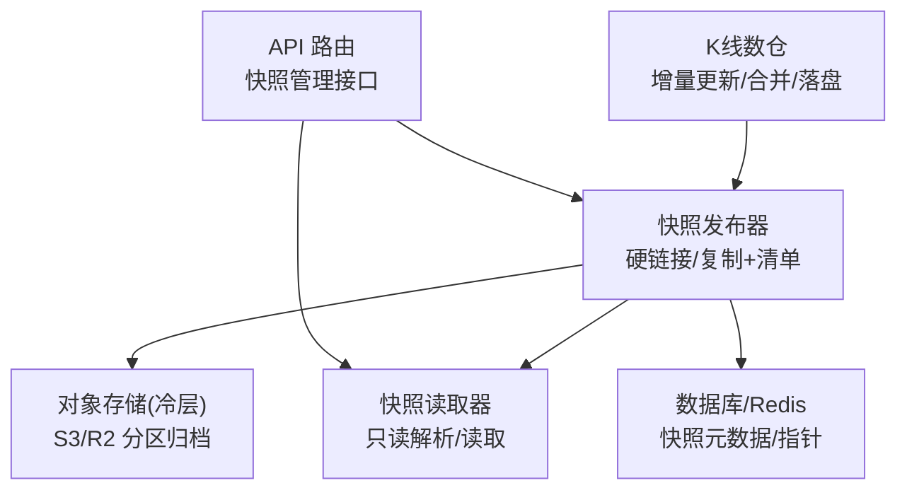
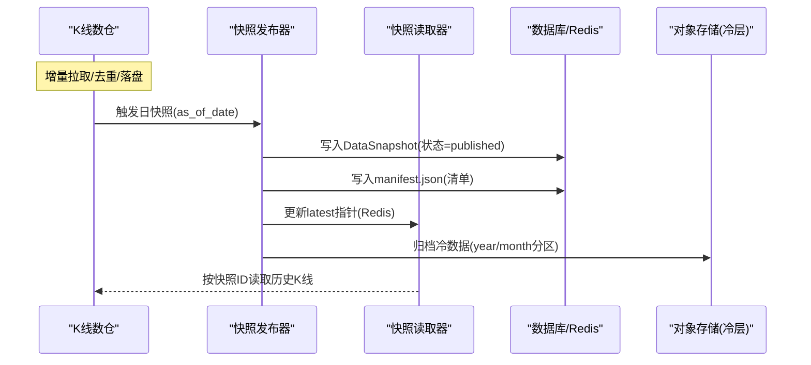
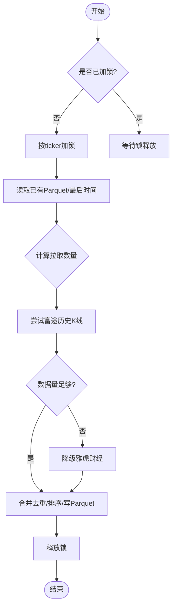
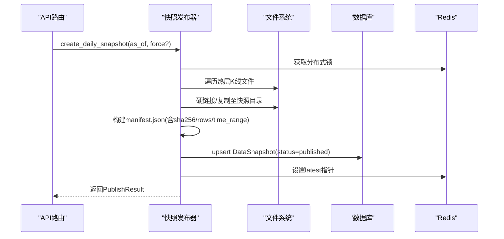
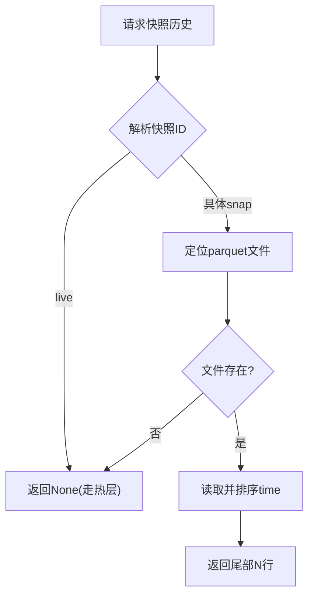
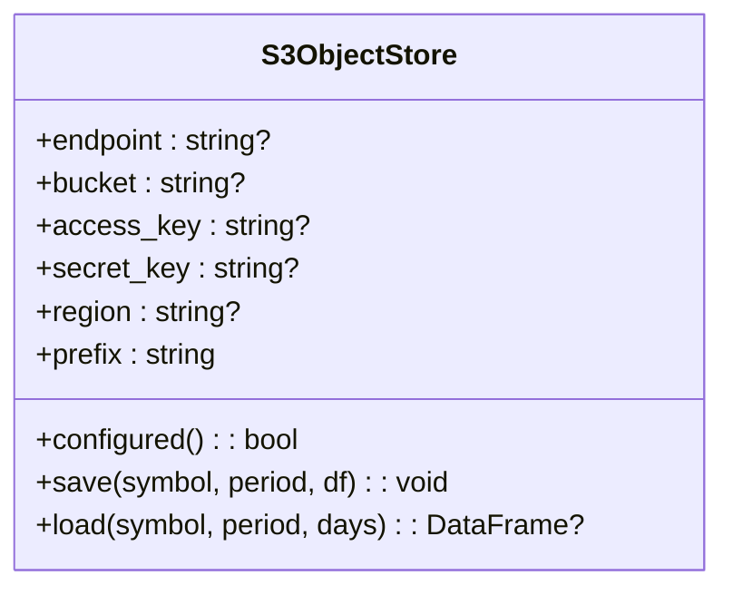
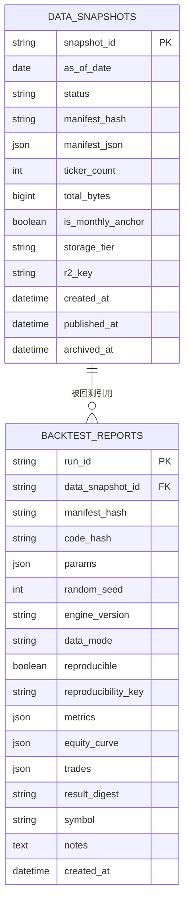
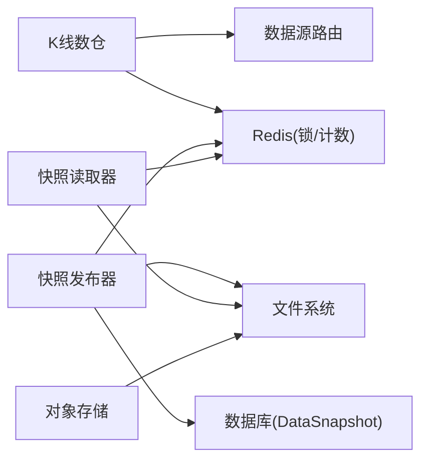

# 历史数据处理

<cite>
**本文引用的文件**
- [kline_warehouse.py](file://backend/services/datalake/kline_warehouse.py)
- [datalake_models.py](file://backend/core/datalake_models.py)
- [datalake.py](file://backend/routers/datalake.py)
- [object_store.py](file://backend/services/datalake/object_store.py)
- [snapshot_publisher.py](file://backend/services/datalake/snapshot_publisher.py)
- [snapshot_reader.py](file://backend/services/datalake/snapshot_reader.py)
</cite>

## 目录
1. [简介](#简介)
2. [项目结构](#项目结构)
3. [核心组件](#核心组件)
4. [架构总览](#架构总览)
5. [详细组件分析](#详细组件分析)
6. [依赖关系分析](#依赖关系分析)
7. [性能考虑](#性能考虑)
8. [故障排查指南](#故障排查指南)
9. [结论](#结论)
10. [附录：操作示例](#附录操作示例)

## 简介
本文件面向 Quant Agent 的历史数据处理系统，聚焦数据清洗、存储优化、版本控制与数据湖架构。内容涵盖：
- 数据清洗流程：原始数据验证、缺失值处理、异常值检测、数据标准化
- 数据存储优化：Parquet 列式存储、分区策略、压缩与索引、冷热分层
- 版本控制系统：快照管理、变更追踪、回滚机制、数据血缘
- 数据湖架构：对象存储、元数据管理、查询优化、缓存策略
- 实操示例：导入数据、执行质量检查、创建快照、查询历史
- 性能优化：批量处理、并行计算、内存管理与锁/限流保护

## 项目结构
围绕历史数据的采集、清洗、归档与快照发布，系统由以下关键模块组成：
- K线数仓（本地热层）：增量拉取、去重合并、Parquet 持久化
- 快照发布器：从热层生成不可变快照、构建清单、写入数据库与 Redis
- 快照读取器：按快照 ID 只读访问历史数据
- 对象存储（冷层）：基于 S3/R2 的 Hive 分区归档，支持远端读写
- API 路由：提供快照列表、最新快照、重建与保留策略等接口
- ORM 模型：快照元数据与回测报告持久化

图表来源
- [kline_warehouse.py:55-173](file://backend/services/datalake/kline_warehouse.py#L55-L173)
- [snapshot_publisher.py:119-250](file://backend/services/datalake/snapshot_publisher.py#L119-L250)
- [snapshot_reader.py:42-114](file://backend/services/datalake/snapshot_reader.py#L42-L114)
- [object_store.py:83-165](file://backend/services/datalake/object_store.py#L83-L165)
- [datalake.py:61-137](file://backend/routers/datalake.py#L61-L137)

章节来源
- [kline_warehouse.py:16-173](file://backend/services/datalake/kline_warehouse.py#L16-L173)
- [snapshot_publisher.py:91-250](file://backend/services/datalake/snapshot_publisher.py#L91-L250)
- [snapshot_reader.py:30-121](file://backend/services/datalake/snapshot_reader.py#L30-L121)
- [object_store.py:32-165](file://backend/services/datalake/object_store.py#L32-L165)
- [datalake.py:1-138](file://backend/routers/datalake.py#L1-L138)

## 核心组件
- K线数仓（本地热层）
  - 增量拉取：优先富途，不足时降级雅虎财经；按时间差计算拉取量并追加
  - 去重合并：以 time 为键去重，保留最新复权数据，排序后写 Parquet
  - 守护进程：定时全量资产增量同步，成功后触发日快照与保留策略
- 快照发布器
  - 幂等创建：按日期生成快照 ID，避免重复发布
  - 硬链接/复制：零拷贝或安全复制，记录 copy_mode
  - 清单构建：统计文件哈希、行数、时间范围，生成 manifest.json
  - 元数据落库：写入 DataSnapshot，设置 published_at，更新 Redis 最新指针
- 快照读取器
  - 解析快照 ID：支持 latest_published/live/unbound 语义
  - 只读读取：按 ticker/ktype 定位 parquet 并返回尾部 N 行
- 对象存储（冷层）
  - 配置优雅降级：未配置则跳过归档/读取
  - 分区写入：year/month Hive 分区，仅归档超过一年的冷数据
  - 分区读取：按 hive 分区过滤最近 N 天
- API 路由
  - 列出/获取快照、重建快照、执行保留策略
- ORM 模型
  - DataSnapshot：快照元数据、状态、清单指纹、规模指标
  - BacktestReport：回测可复现性绑定与结果持久化

章节来源
- [kline_warehouse.py:55-258](file://backend/services/datalake/kline_warehouse.py#L55-L258)
- [snapshot_publisher.py:91-302](file://backend/services/datalake/snapshot_publisher.py#L91-L302)
- [snapshot_reader.py:30-121](file://backend/services/datalake/snapshot_reader.py#L30-L121)
- [object_store.py:32-177](file://backend/services/datalake/object_store.py#L32-L177)
- [datalake_models.py:31-82](file://backend/core/datalake_models.py#L31-L82)
- [datalake.py:61-137](file://backend/routers/datalake.py#L61-L137)

## 架构总览
系统采用“热-温-冷”三层数据湖与“采集-清洗-快照-归档”流水线：
- 热层（本地 Parquet）：低延迟读取，支撑回测与在线服务
- 温层（快照目录）：不可变快照 + 清单，便于回溯与审计
- 冷层（对象存储）：Hive 分区长期归档，降低存储成本
- 元数据与缓存：PostgreSQL 持久化快照元数据，Redis 维护最新指针与分布式锁
- 质量门禁：在快照发布前执行质量检查，不通过则标记失败

图表来源
- [kline_warehouse.py:175-258](file://backend/services/datalake/kline_warehouse.py#L175-L258)
- [snapshot_publisher.py:119-250](file://backend/services/datalake/snapshot_publisher.py#L119-L250)
- [snapshot_reader.py:42-114](file://backend/services/datalake/snapshot_reader.py#L42-L114)
- [object_store.py:83-165](file://backend/services/datalake/object_store.py#L83-L165)

## 详细组件分析

### K线数仓（增量与合并）
- 增量算法：根据 last_date 计算 days_diff，附加冗余天数，限制单次拉取上限
- 数据源降级：富途配额不足或返回条数过少时，自动切换雅虎财经兜底
- 合并策略：以 time 为键去重，keep='last' 覆盖旧复权，排序后写 Parquet
- 并发与锁：按 ticker 使用 asyncio.Lock 防止并发写入冲突
- 守护任务：每日凌晨执行，结合 Redis 分布式锁避免集群重复拉取

图表来源
- [kline_warehouse.py:55-173](file://backend/services/datalake/kline_warehouse.py#L55-L173)

章节来源
- [kline_warehouse.py:55-173](file://backend/services/datalake/kline_warehouse.py#L55-L173)

### 快照发布器（不可变快照与清单）
- 幂等与互斥：按日期生成 snapshot_id，Redis 分布式锁防并发
- 质量门禁：默认放行，可注入自定义质量检查函数
- 文件链接：优先硬链接，失败回退 copy2，记录 copy_mode
- 清单构建：逐文件计算 sha256、行数、时间范围，汇总 ticker_count/total_bytes
- 元数据持久化：写入 DataSnapshot，设置 published_at，更新 Redis 最新指针

图表来源
- [snapshot_publisher.py:119-250](file://backend/services/datalake/snapshot_publisher.py#L119-L250)
- [datalake.py:112-131](file://backend/routers/datalake.py#L112-L131)

章节来源
- [snapshot_publisher.py:91-302](file://backend/services/datalake/snapshot_publisher.py#L91-L302)
- [datalake.py:61-137](file://backend/routers/datalake.py#L61-L137)

### 快照读取器（只读访问）
- 快照解析：支持 latest_published/live/unbound 语义，优先 Redis 指针
- 文件定位：按 ktype/ticker 映射到 parquet 路径，兼容文件名安全化
- 读取优化：PyArrow 引擎读取，按 time 排序后返回尾部 N 行

图表来源
- [snapshot_reader.py:42-114](file://backend/services/datalake/snapshot_reader.py#L42-L114)

章节来源
- [snapshot_reader.py:30-121](file://backend/services/datalake/snapshot_reader.py#L30-L121)

### 对象存储（冷层归档）
- 配置与降级：环境变量未配置时，save/load 均为空操作
- 分区布局：{prefix}/{period}/{symbol_safe}/year=YYYY/month=MM/part-*.parquet
- 冷数据筛选：仅归档超过一年的数据，减少重复写入
- 读写实现：PyArrow dataset 直接读写 S3/R2，支持 hive 分区

图表来源
- [object_store.py:32-177](file://backend/services/datalake/object_store.py#L32-L177)

章节来源
- [object_store.py:32-177](file://backend/services/datalake/object_store.py#L32-L177)

### 数据模型（元数据与回测绑定）
- DataSnapshot：快照标识、日期、状态、清单指纹、规模指标、存储层级、归档时间
- BacktestReport：回测运行 ID、关联快照、代码哈希、参数、随机种子、指标、交易明细、可复现键

图表来源
- [datalake_models.py:31-82](file://backend/core/datalake_models.py#L31-L82)

章节来源
- [datalake_models.py:31-82](file://backend/core/datalake_models.py#L31-L82)

## 依赖关系分析
- 组件耦合
  - K线数仓依赖数据源路由（富途/雅虎），并通过 Redis 分布式锁协调集群同步
  - 快照发布器依赖文件系统、数据库与 Redis，负责不可变快照与元数据一致性
  - 快照读取器依赖快照解析器与 Redis 指针，提供稳定只读视图
  - 对象存储依赖 PyArrow S3FileSystem，支持无中间格式的直写/直读
- 外部依赖
  - Pandas/PyArrow：高性能列式读写
  - SQLAlchemy：ORM 持久化
  - Redis：分布式锁与最新指针缓存
- 潜在循环依赖
  - 各模块通过明确接口调用，未见循环 import；必要时使用延迟导入避免启动期依赖

图表来源
- [kline_warehouse.py:55-173](file://backend/services/datalake/kline_warehouse.py#L55-L173)
- [snapshot_publisher.py:119-250](file://backend/services/datalake/snapshot_publisher.py#L119-L250)
- [snapshot_reader.py:42-114](file://backend/services/datalake/snapshot_reader.py#L42-L114)
- [object_store.py:83-165](file://backend/services/datalake/object_store.py#L83-L165)

章节来源
- [kline_warehouse.py:55-173](file://backend/services/datalake/kline_warehouse.py#L55-L173)
- [snapshot_publisher.py:119-250](file://backend/services/datalake/snapshot_publisher.py#L119-L250)
- [snapshot_reader.py:42-114](file://backend/services/datalake/snapshot_reader.py#L42-L114)
- [object_store.py:83-165](file://backend/services/datalake/object_store.py#L83-L165)

## 性能考虑
- 批量与并行
  - 增量拉取限制单次最大条数，避免超时与限流
  - 文件 I/O 放入线程池（asyncio.to_thread），避免阻塞事件循环
  - 守护任务错峰执行，配合分布式锁避免集群重复任务
- 内存管理
  - 仅加载必要列（如 time）进行统计，减少内存占用
  - 冷数据筛选后再写入对象存储，降低网络与序列化开销
- 存储优化
  - Parquet 列式格式 + PyArrow 引擎，显著提升读取速度
  - Hive 分区（year/month）提升查询裁剪能力
  - 硬链接优先，减少磁盘占用与复制时间
- 缓存与索引
  - Redis 缓存 latest 快照指针，加速查询解析
  - 数据库对常用字段建立索引（status/published_at/reproducibility_key）

[本节为通用性能建议，不直接分析具体文件]

## 故障排查指南
- 快照发布失败
  - 质量门禁未通过：检查质量门返回值与 dirty_rate 阈值
  - 分布式锁冲突：确认 Redis 可用性与锁过期时间
  - 文件链接失败：回退 copy2，关注磁盘空间与权限
- 数据源拉取失败
  - 富途配额耗尽或返回条数不足：自动降级雅虎财经
  - 网络/限流：增加重试与退避，观察日志中的降级提示
- 快照读取为空
  - 解析 latest 失败：检查 Redis 指针与数据库记录
  - 文件缺失：核对 ticker/ktype 映射与文件名安全化规则
- 对象存储写入/读取失败
  - 未配置环境变量：确认 endpoint/bucket/credentials
  - 分区不存在：检查 year/month 分区是否存在，或放宽 days 范围

章节来源
- [snapshot_publisher.py:119-250](file://backend/services/datalake/snapshot_publisher.py#L119-L250)
- [kline_warehouse.py:84-149](file://backend/services/datalake/kline_warehouse.py#L84-L149)
- [snapshot_reader.py:42-114](file://backend/services/datalake/snapshot_reader.py#L42-L114)
- [object_store.py:83-165](file://backend/services/datalake/object_store.py#L83-L165)

## 结论
该系统以 Parquet 为核心载体，构建了“热-温-冷”三层数据湖与不可变快照体系。通过增量拉取、去重合并、质量门禁、对象存储归档与元数据管理，实现了高可靠、可追溯、高性能的历史数据处理能力。API 层暴露了完整的快照管理能力，便于上层回测与研究场景复用。

[本节为总结性内容，不直接分析具体文件]

## 附录：操作示例
以下为常见操作的步骤说明（不涉及具体代码片段）：
- 数据导入（增量更新）
  - 调用 K线数仓的增量更新方法，传入 ticker 与 ktype
  - 系统优先从富途拉取，不足时降级雅虎财经
  - 合并去重后写入本地 Parquet
  - 参考路径：[kline_warehouse.py:55-173](file://backend/services/datalake/kline_warehouse.py#L55-L173)
- 执行数据质量检查
  - 在快照发布前执行质量门禁，可通过注入 quality_gate_fn 自定义检查逻辑
  - 若未通过，快照状态标记为 failed 并记录质量信息
  - 参考路径：[snapshot_publisher.py:119-157](file://backend/services/datalake/snapshot_publisher.py#L119-L157)
- 创建数据快照
  - 通过 API 触发重建或直接调用发布器，指定 as_of_date
  - 系统将热层文件链接/复制到快照目录，生成 manifest.json 并写入数据库
  - 参考路径：[datalake.py:112-131](file://backend/routers/datalake.py#L112-L131)、[snapshot_publisher.py:158-250](file://backend/services/datalake/snapshot_publisher.py#L158-L250)
- 查询历史数据
  - 使用快照读取器，传入 snapshot_id（可为 latest_published）、ticker、ktype、num
  - 系统解析快照 ID 并读取对应 parquet 文件，返回尾部 N 行
  - 参考路径：[snapshot_reader.py:42-114](file://backend/services/datalake/snapshot_reader.py#L42-L114)

章节来源
- [kline_warehouse.py:55-173](file://backend/services/datalake/kline_warehouse.py#L55-L173)
- [snapshot_publisher.py:119-250](file://backend/services/datalake/snapshot_publisher.py#L119-L250)
- [datalake.py:112-131](file://backend/routers/datalake.py#L112-L131)
- [snapshot_reader.py:42-114](file://backend/services/datalake/snapshot_reader.py#L42-L114)