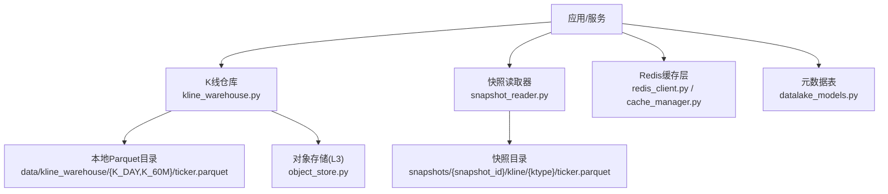
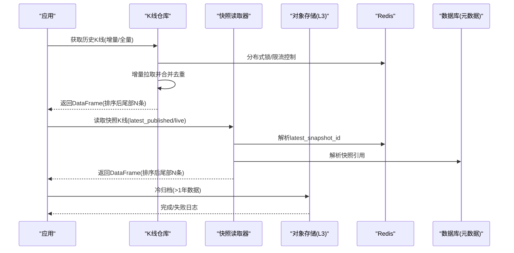
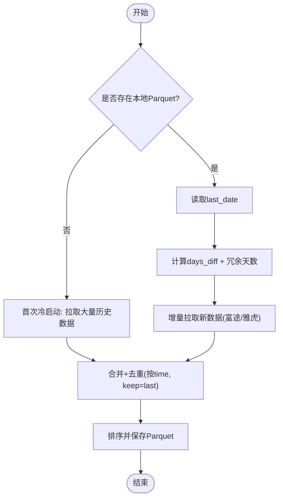
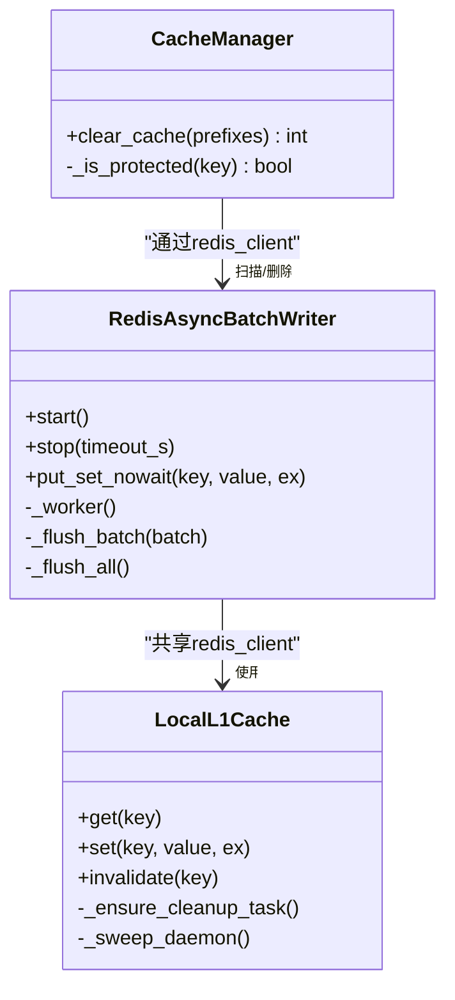
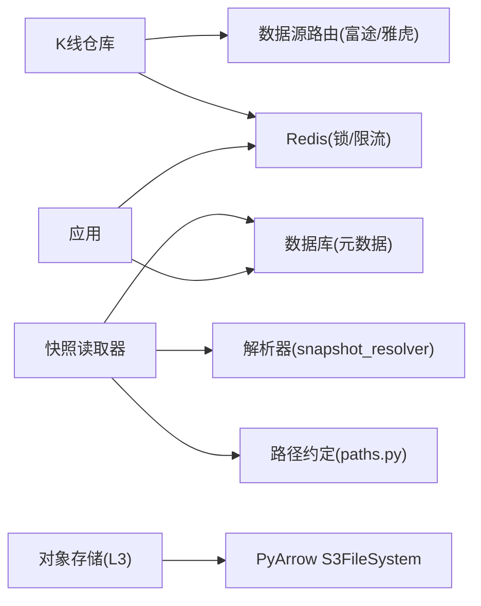

# 存储优化与索引

<cite>
**本文引用的文件**
- [backend/services/datalake/kline_warehouse.py](file://backend/services/datalake/kline_warehouse.py)
- [backend/services/datalake/paths.py](file://backend/services/datalake/paths.py)
- [backend/services/datalake/snapshot_reader.py](file://backend/services/datalake/snapshot_reader.py)
- [backend/services/datalake/object_store.py](file://backend/services/datalake/object_store.py)
- [backend/core/cache_manager.py](file://backend/core/cache_manager.py)
- [backend/core/redis_client.py](file://backend/core/redis_client.py)
- [backend/core/datalake_models.py](file://backend/core/datalake_models.py)
</cite>

## 目录
1. [简介](#简介)
2. [项目结构](#项目结构)
3. [核心组件](#核心组件)
4. [架构总览](#架构总览)
5. [详细组件分析](#详细组件分析)
6. [依赖关系分析](#依赖关系分析)
7. [性能考量](#性能考量)
8. [故障排查指南](#故障排查指南)
9. [结论](#结论)
10. [附录](#附录)

## 简介
本文件面向 Quant Agent 的存储优化与索引系统，围绕以下目标展开：
- 解释采用 Parquet 的原因（列式存储优势、压缩与读写性能对比）
- 说明分区策略设计（按 K 线周期分目录、按股票代码组织、时间范围分区）
- 阐述索引构建机制（时间索引、代码索引、复合索引策略）
- 描述缓存策略（Redis 缓存层、进程内 L1 缓存、预加载机制）
- 提供配置示例、查询优化建议、存储空间管理方法
- 给出性能监控指标与容量规划建议

## 项目结构
存储子系统由“热数据本地仓库”、“快照只读访问”、“冷归档对象存储”和“缓存层”四部分组成：
- 热数据：K 线本地仓库以 Parquet 文件形式按周期与标的组织，支持增量更新与线程池读取
- 快照：将指定日期的 K 线打包为不可变快照，供回测一致性与可复现性使用
- 冷归档：通过 PyArrow 直写 S3/R2 兼容的对象存储，按 year/month 分区
- 缓存：Redis 作为共享缓存与分布式锁；进程内 L1 缓存用于高频短效键

图表来源
- [backend/services/datalake/kline_warehouse.py:16-33](file://backend/services/datalake/kline_warehouse.py#L16-L33)
- [backend/services/datalake/snapshot_reader.py:30-121](file://backend/services/datalake/snapshot_reader.py#L30-L121)
- [backend/services/datalake/object_store.py:32-177](file://backend/services/datalake/object_store.py#L32-L177)
- [backend/core/redis_client.py:11-34](file://backend/core/redis_client.py#L11-L34)
- [backend/core/cache_manager.py:19-34](file://backend/core/cache_manager.py#L19-L34)
- [backend/core/datalake_models.py:31-50](file://backend/core/datalake_models.py#L31-L50)

章节来源
- [backend/services/datalake/kline_warehouse.py:16-33](file://backend/services/datalake/kline_warehouse.py#L16-L33)
- [backend/services/datalake/paths.py:10-18](file://backend/services/datalake/paths.py#L10-L18)
- [backend/services/datalake/snapshot_reader.py:30-121](file://backend/services/datalake/snapshot_reader.py#L30-L121)
- [backend/services/datalake/object_store.py:32-177](file://backend/services/datalake/object_store.py#L32-L177)
- [backend/core/redis_client.py:11-34](file://backend/core/redis_client.py#L11-L34)
- [backend/core/cache_manager.py:19-34](file://backend/core/cache_manager.py#L19-L34)
- [backend/core/datalake_models.py:31-50](file://backend/core/datalake_models.py#L31-L50)

## 核心组件
- K 线仓库（热层）：基于 Parquet 的本地数仓，按 K 线周期分目录、按股票代码生成文件名，支持增量合并与去重保存
- 快照读取器（温层）：从快照目录只读读取 K 线，支持 latest_published 解析与 live 模式区分
- 对象存储（冷层）：S3/R2 兼容对象存储，Hive 风格 year/month 分区，仅归档超过一年的冷数据
- Redis 缓存层：连接池、异步批量写入队列、进程内 L1 缓存、受保护前缀的缓存清理
- 元数据模型：数据快照与回测报告 ORM，记录 manifest_hash、状态、发布时间等

章节来源
- [backend/services/datalake/kline_warehouse.py:16-173](file://backend/services/datalake/kline_warehouse.py#L16-L173)
- [backend/services/datalake/snapshot_reader.py:30-121](file://backend/services/datalake/snapshot_reader.py#L30-L121)
- [backend/services/datalake/object_store.py:32-177](file://backend/services/datalake/object_store.py#L32-L177)
- [backend/core/redis_client.py:46-177](file://backend/core/redis_client.py#L46-L177)
- [backend/core/cache_manager.py:19-75](file://backend/core/cache_manager.py#L19-L75)
- [backend/core/datalake_models.py:31-82](file://backend/core/datalake_models.py#L31-L82)

## 架构总览
整体采用“热-温-冷”三层存储与“内存-Redis-磁盘”多级缓存体系：
- 热层：本地 Parquet 文件，按 K 线周期与标的组织，提供纳秒级读取
- 温层：快照目录，保证回测一致性，latest_published 通过 Redis/PG 解析
- 冷层：S3/R2 对象存储，Hive 分区，降低长期存储成本
- 缓存：Redis 作为共享缓存与分布式锁；进程内 L1 缓存减少热点键的网络开销
- 元数据：PostgreSQL 记录快照与回测报告的不可变指纹与发布状态

图表来源
- [backend/services/datalake/kline_warehouse.py:55-173](file://backend/services/datalake/kline_warehouse.py#L55-L173)
- [backend/services/datalake/snapshot_reader.py:42-121](file://backend/services/datalake/snapshot_reader.py#L42-L121)
- [backend/services/datalake/object_store.py:83-165](file://backend/services/datalake/object_store.py#L83-L165)
- [backend/core/redis_client.py:11-34](file://backend/core/redis_client.py#L11-L34)
- [backend/core/datalake_models.py:31-50](file://backend/core/datalake_models.py#L31-L50)

## 详细组件分析

### K 线仓库（热层）
- 分区策略：按 K 线周期创建子目录（如 K_DAY、K_60M），每个标的一个 parquet 文件
- 增量更新：根据 last_date 计算需要拉取的条数，优先富途，不足时降级雅虎财经，合并去重并按 time 排序保存
- 并发控制：按 ticker 加锁避免重复写入；守护进程每日凌晨错峰同步，使用 Redis 分布式锁防止集群重复执行
- 读取优化：使用 pyarrow 引擎读取，放入线程池避免阻塞事件循环；返回最近 N 条并排序

图表来源
- [backend/services/datalake/kline_warehouse.py:55-173](file://backend/services/datalake/kline_warehouse.py#L55-L173)

章节来源
- [backend/services/datalake/kline_warehouse.py:16-173](file://backend/services/datalake/kline_warehouse.py#L16-L173)

### 快照读取器（温层）
- 路径约定：快照根目录与 live 根目录通过环境变量配置；ticker 到文件名转换规则统一
- 解析逻辑：latest_published 优先从 Redis 获取，否则通过解析器查 PG；live/unbound 直接返回 None
- 读取流程：定位 kline/{ktype}/{ticker}.parquet，若缺失尝试兼容名；排序 time 并返回尾部 N 条
- 列表能力：列出某快照下某周期的所有标的

章节来源
- [backend/services/datalake/paths.py:10-43](file://backend/services/datalake/paths.py#L10-L43)
- [backend/services/datalake/snapshot_reader.py:30-121](file://backend/services/datalake/snapshot_reader.py#L30-L121)

### 对象存储（冷层）
- 分区布局：Hive 风格 {period}/{symbol_safe}/year=YYYY/month=MM/part-*.parquet
- 写入策略：仅归档超过一年的冷数据，使用 PyArrow 直写 S3/R2，避免中间格式转换
- 读取策略：按 hive 分区读取，过滤最近 N 天并排序 time
- 容错：未配置时优雅降级为 no-op，不抛异常

章节来源
- [backend/services/datalake/object_store.py:32-177](file://backend/services/datalake/object_store.py#L32-L177)

### 缓存层（Redis 与 L1）
- 连接池：全局 Redis 连接池，限制最大连接数，使用 RESP2 协议兼容
- 批量写入：异步队列 + Pipeline 批量发送，降低 RTT 与带宽占用；优雅停机确保数据落盘
- L1 缓存：进程内字典缓存热点键，带 TTL 与容量熔断；过期键后台定时清理
- 安全清理：按默认业务前缀清理缓存，交易态前缀受保护不被误删

图表来源
- [backend/core/redis_client.py:46-177](file://backend/core/redis_client.py#L46-L177)
- [backend/core/redis_client.py:184-252](file://backend/core/redis_client.py#L184-L252)
- [backend/core/cache_manager.py:19-75](file://backend/core/cache_manager.py#L19-L75)

章节来源
- [backend/core/redis_client.py:11-252](file://backend/core/redis_client.py#L11-L252)
- [backend/core/cache_manager.py:19-75](file://backend/core/cache_manager.py#L19-L75)

### 元数据与索引（数据库层）
- 数据快照表：记录 snapshot_id、as_of_date、status、manifest_hash、published_at 等，建立复合索引加速查询
- 回测报告表：绑定 data_snapshot_id、reproducibility_key、code_hash 等，便于复现与检索
- 索引策略：对常用查询字段建立单列与复合索引，提升快照解析与报告检索性能

章节来源
- [backend/core/datalake_models.py:31-82](file://backend/core/datalake_models.py#L31-L82)

## 依赖关系分析
- K 线仓库依赖数据源路由（富途/雅虎），并通过 Redis 进行分布式锁与限流
- 快照读取器依赖路径约定与解析器，结合 Redis/PG 解析 latest_published
- 对象存储依赖 PyArrow 的 S3FileSystem，按 Hive 分区写入/读取
- 缓存层依赖 Redis 连接池与批量写入队列，提供高吞吐写入与低延迟读取
- 元数据模型依赖 SQLAlchemy ORM，定义表结构与索引

图表来源
- [backend/services/datalake/kline_warehouse.py:86-120](file://backend/services/datalake/kline_warehouse.py#L86-L120)
- [backend/services/datalake/snapshot_reader.py:42-77](file://backend/services/datalake/snapshot_reader.py#L42-L77)
- [backend/services/datalake/object_store.py:55-76](file://backend/services/datalake/object_store.py#L55-L76)
- [backend/core/redis_client.py:11-34](file://backend/core/redis_client.py#L11-L34)
- [backend/core/datalake_models.py:31-82](file://backend/core/datalake_models.py#L31-L82)

章节来源
- [backend/services/datalake/kline_warehouse.py:86-120](file://backend/services/datalake/kline_warehouse.py#L86-L120)
- [backend/services/datalake/snapshot_reader.py:42-77](file://backend/services/datalake/snapshot_reader.py#L42-L77)
- [backend/services/datalake/object_store.py:55-76](file://backend/services/datalake/object_store.py#L55-L76)
- [backend/core/redis_client.py:11-34](file://backend/core/redis_client.py#L11-L34)
- [backend/core/datalake_models.py:31-82](file://backend/core/datalake_models.py#L31-L82)

## 性能考量
- 选择 Parquet 的原因
  - 列式存储：只读取需要的列，显著减少 I/O 与内存占用
  - 高效压缩：适合数值型金融数据，压缩比高且解压快
  - 读写性能：pyarrow 引擎在 C 层释放 GIL，配合 to_thread 避免阻塞事件循环
  - 对比 CSV：Parquet 在随机列访问、大表扫描、增量追加场景具备明显优势
- 分区策略
  - 热层：按 K 线周期分目录、按股票代码生成文件，便于快速定位
  - 温层：快照目录隔离，保证回测一致性
  - 冷层：Hive 风格 year/month 分区，降低查询扫描范围
- 索引策略
  - 时间索引：读取后按 time 排序，确保时序正确
  - 代码索引：文件名即标的标识，目录层级天然形成代码索引
  - 复合索引：数据库层对 published_at、status、reproducibility_key 等建立复合索引，加速快照解析与报告检索
- 缓存策略
  - Redis：连接池限制、批量写入队列、分布式锁
  - L1 缓存：进程内短效缓存，TTL 与容量熔断，后台清理过期键
  - 预加载：守护进程每日凌晨错峰同步，提前预热热门标的
- 监控指标建议
  - 读取延迟：P95/P99 延迟、QPS
  - 写入吞吐：每秒写入行数、批大小、Pipeline 成功率
  - 缓存命中率：L1/L2 命中率、失效次数
  - 存储用量：各层容量增长趋势、冷热数据比例
  - 错误率：网络超时、权限错误、序列化失败

[本节为通用指导，不直接分析具体文件]

## 故障排查指南
- 读取失败
  - 检查本地 Parquet 是否存在、是否损坏；确认 time 列类型与排序
  - 快照读取失败时，检查 latest_published 是否已解析到有效快照
- 写入失败
  - 检查 Redis 连接池是否耗尽、批量写入队列是否堆积
  - 对象存储未配置或权限不足时，会优雅降级；检查环境变量与凭证
- 缓存清理
  - 使用缓存清理工具按前缀清理，注意交易态前缀受保护不会被误删
- 元数据不一致
  - 检查 data_snapshots 与 backtest_reports 的状态与发布时间戳
  - 核对 manifest_hash 与数据指纹，确保不可变性

章节来源
- [backend/core/cache_manager.py:47-75](file://backend/core/cache_manager.py#L47-L75)
- [backend/core/redis_client.py:155-177](file://backend/core/redis_client.py#L155-L177)
- [backend/services/datalake/object_store.py:95-134](file://backend/services/datalake/object_store.py#L95-L134)
- [backend/core/datalake_models.py:31-82](file://backend/core/datalake_models.py#L31-L82)

## 结论
Quant Agent 的存储与索引系统通过“热-温-冷”三层存储与“内存-Redis-磁盘”多级缓存，实现了高吞吐、低延迟、可复现的数据访问。Parquet 的列式存储与高效压缩为 K 线数据提供了优异的读写性能；分区策略与索引设计进一步缩小了查询范围；缓存层保障了热点数据的极速访问；元数据模型确保了快照的一致性与可追溯性。在生产环境中，建议持续监控关键指标并动态调整分区与缓存参数，以实现最优的成本与性能平衡。

[本节为总结性内容，不直接分析具体文件]

## 附录

### 配置与优化示例
- 存储参数
  - 热层根目录：DATALAKE_LIVE_ROOT（默认 data/kline_warehouse）
  - 快照根目录：DATALAKE_SNAPSHOTS_ROOT（默认 data/snapshots）
  - 脏数据阈值：DATALAKE_DIRTY_RATE_MAX（默认 0.02）
  - 对象存储：KLINE_L3_ENDPOINT_URL、KLINE_L3_BUCKET、KLINE_L3_ACCESS_KEY、KLINE_L3_SECRET_KEY、KLINE_L3_REGION、KLINE_L3_PREFIX
- 查询优化
  - 读取时指定 num 限制返回行数，减少内存占用
  - 使用 latest_published 解析最新快照，避免硬编码快照 ID
  - 在数据库层利用复合索引查询 published_at 与 status
- 存储空间管理
  - 定期运行保留策略，清理过期快照
  - 冷归档仅写入超过一年的数据，降低热层压力
  - 监控各层容量增长，及时扩容或归档

章节来源
- [backend/services/datalake/paths.py:10-20](file://backend/services/datalake/paths.py#L10-L20)
- [backend/services/datalake/object_store.py:40-47](file://backend/services/datalake/object_store.py#L40-L47)
- [backend/services/datalake/snapshot_reader.py:42-77](file://backend/services/datalake/snapshot_reader.py#L42-L77)
- [backend/core/datalake_models.py:31-50](file://backend/core/datalake_models.py#L31-L50)