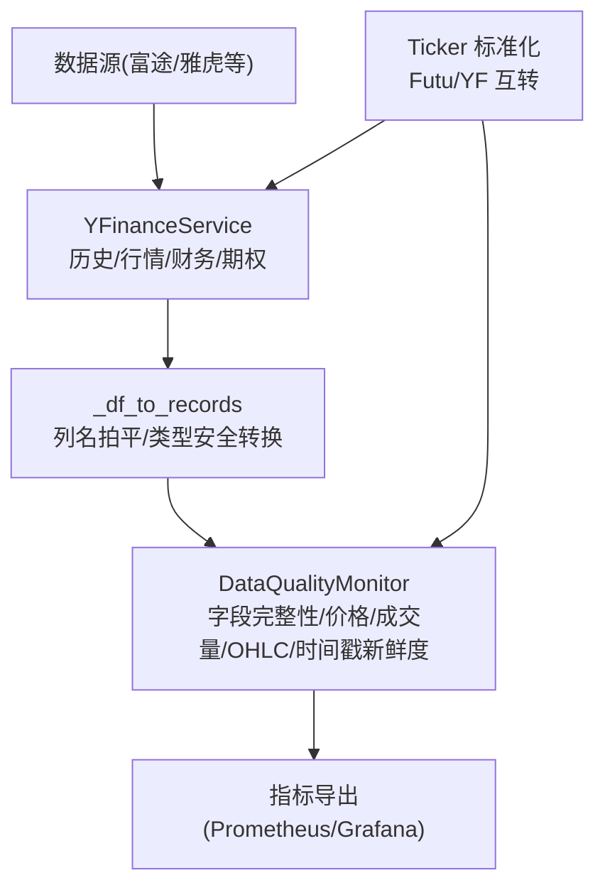
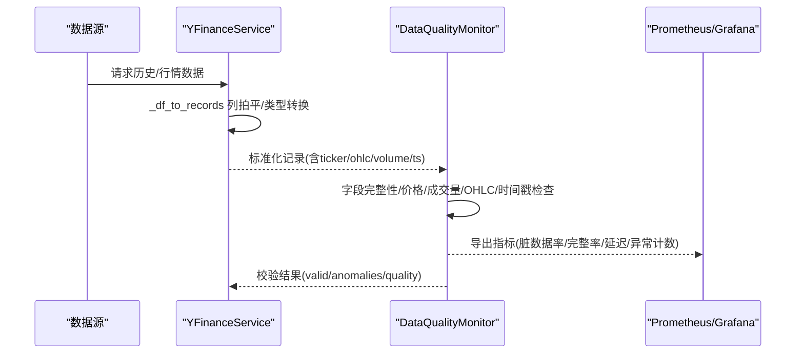
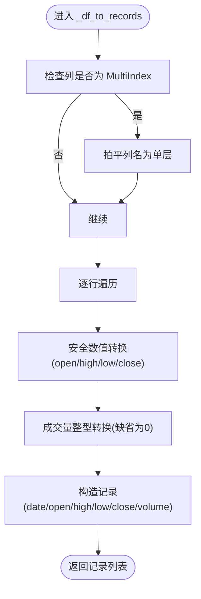
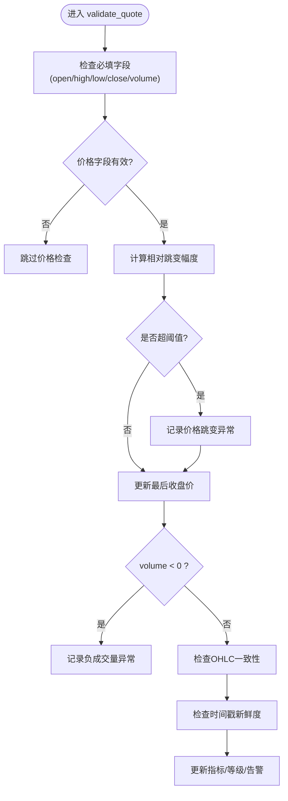
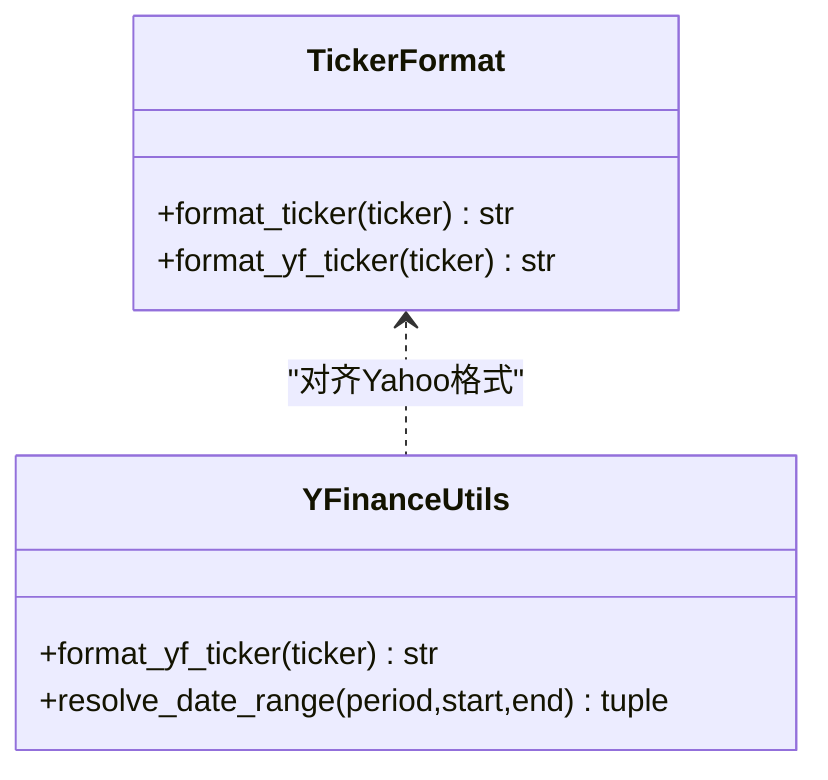
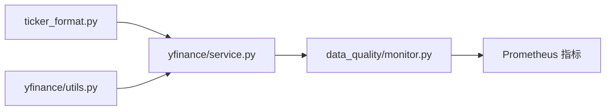

# 数据清洗与标准化

<cite>
**本文引用的文件**
- [backend/services/data_quality/monitor.py](file://backend/services/data_quality/monitor.py)
- [data_subservice/_internal/yfinance/service.py](file://data_subservice/_internal/yfinance/service.py)
- [data_subservice/_internal/yfinance/utils.py](file://data_subservice/_internal/yfinance/utils.py)
- [backend/core/ticker_format.py](file://backend/core/ticker_format.py)
</cite>

## 目录
1. [简介](#简介)
2. [项目结构](#项目结构)
3. [核心组件](#核心组件)
4. [架构总览](#架构总览)
5. [详细组件分析](#详细组件分析)
6. [依赖关系分析](#依赖关系分析)
7. [性能考量](#性能考量)
8. [故障排查指南](#故障排查指南)
9. [结论](#结论)
10. [附录](#附录)

## 简介
本模块聚焦于 Quant Agent 的数据清洗与标准化，覆盖从原始数据进入系统到产出标准化、可消费数据的全流程。内容包含：
- 原始数据验证：格式检查、必填字段校验、数据类型转换
- 缺失值处理策略：时间序列插值、前后填充、删除策略（概念性说明）
- 异常值检测机制：价格跳变、成交量异常、复权数据处理（结合现有实现与扩展建议）
- 数据标准化：股票代码格式化、时间戳统一、数值归一化（结合现有实现与扩展建议）
- 富途与雅虎财经不同数据格式的适配示例
- 错误处理机制与数据回滚策略（基于现有熔断、并发控制与日志告警的落地方案）

## 项目结构
与数据清洗和标准化直接相关的代码主要分布在以下位置：
- 数据质量监控与异常检测：backend/services/data_quality/monitor.py
- 雅虎财经数据源适配与基础清洗：data_subservice/_internal/yfinance/service.py、utils.py
- 股票代码标准化：backend/core/ticker_format.py、data_subservice/_internal/yfinance/utils.py

图表来源
- [data_subservice/_internal/yfinance/service.py:144-206](file://data_subservice/_internal/yfinance/service.py#L144-L206)
- [backend/services/data_quality/monitor.py:112-256](file://backend/services/data_quality/monitor.py#L112-L256)
- [backend/core/ticker_format.py:8-98](file://backend/core/ticker_format.py#L8-L98)
- [data_subservice/_internal/yfinance/utils.py:10-51](file://data_subservice/_internal/yfinance/utils.py#L10-L51)

章节来源
- [data_subservice/_internal/yfinance/service.py:144-206](file://data_subservice/_internal/yfinance/service.py#L144-L206)
- [backend/services/data_quality/monitor.py:112-256](file://backend/services/data_quality/monitor.py#L112-L256)
- [backend/core/ticker_format.py:8-98](file://backend/core/ticker_format.py#L8-L98)
- [data_subservice/_internal/yfinance/utils.py:10-51](file://data_subservice/_internal/yfinance/utils.py#L10-L51)

## 核心组件
- DataQualityMonitor：按数据源维度进行实时数据质量校验，统计脏数据率、完整率、延迟、异常计数，并支持告警回调与 Prometheus 指标导出。
- YFinanceService：对 yfinance 数据源的统一封装，提供历史、行情、资金流向、财务、期权链、技术指标等能力；内部完成 DataFrame 到记录的安全转换。
- Ticker 标准化：提供 Futu 与 Yahoo Finance 之间的代码格式转换，确保跨源一致性。

章节来源
- [backend/services/data_quality/monitor.py:26-89](file://backend/services/data_quality/monitor.py#L26-L89)
- [data_subservice/_internal/yfinance/service.py:36-121](file://data_subservice/_internal/yfinance/service.py#L36-L121)
- [backend/core/ticker_format.py:8-98](file://backend/core/ticker_format.py#L8-L98)

## 架构总览
数据从外部数据源进入后，先进行基础清洗（列名拍平、类型安全转换），再进入质量监控层进行完整性与异常检测，最后输出标准化记录并暴露质量指标。

图表来源
- [data_subservice/_internal/yfinance/service.py:180-206](file://data_subservice/_internal/yfinance/service.py#L180-L206)
- [backend/services/data_quality/monitor.py:112-256](file://backend/services/data_quality/monitor.py#L112-L256)
- [backend/services/data_quality/monitor.py:315-349](file://backend/services/data_quality/monitor.py#L315-L349)

## 详细组件分析

### 原始数据验证流程
- 数据格式检查：
  - 将多索引列拍平为单级列名，避免下游解析失败。
  - 对数值字段进行安全转换，空值转为 None，非数值或 NaN 不破坏流程。
- 必填字段验证：
  - 强制要求 OHLCV 五个字段存在且非空，否则记录缺失字段异常。
- 数据类型转换：
  - 日期字段统一为字符串；成交量转换为整数；价格字段转为浮点。

图表来源
- [data_subservice/_internal/yfinance/service.py:180-206](file://data_subservice/_internal/yfinance/service.py#L180-L206)

章节来源
- [data_subservice/_internal/yfinance/service.py:180-206](file://data_subservice/_internal/yfinance/service.py#L180-L206)

### 缺失值处理策略
- 时间序列插值：建议在 K 线级别对缺失的 OHLC 使用线性或前向插值，保持连续性。
- 前后填充：对短时段缺失可使用前向填充（ffill）或后向填充（bfill）。
- 删除策略：若缺失比例过高或关键时间段缺失，应标记并剔除该段数据，避免污染后续计算。
- 注意：上述策略为通用实践建议，当前仓库未提供具体实现；可在接入 DataQualityMonitor 后，依据脏数据率与缺失模式选择合适策略。

[本节为概念性说明，不直接分析具体文件]

### 异常值检测机制
- 价格跳变检测：
  - 维护每个 ticker 的最后收盘价，计算相邻价格变化百分比，超过阈值即判定为跳变。
- 成交量异常识别：
  - 检测负成交量，记录为严重异常。
- 复权数据处理：
  - 当前实现未显式区分复权与非复权；建议在数据源层统一输出“是否复权”标识，并在标准化阶段做归一化处理（例如统一为非复权或复权基准）。
- OHLC 一致性检查：
  - 校验 high >= low 等逻辑约束，违反则记录异常。
- 时间戳新鲜度：
  - 计算数据时间与当前时间的延迟，超过阈值视为过期数据。

图表来源
- [backend/services/data_quality/monitor.py:112-256](file://backend/services/data_quality/monitor.py#L112-L256)

章节来源
- [backend/services/data_quality/monitor.py:112-256](file://backend/services/data_quality/monitor.py#L112-L256)

### 数据标准化过程
- 股票代码格式化：
  - 支持 Futu 前缀格式与 Yahoo 后缀格式互转，涵盖美股、港股、A股、日股、新加坡、英国等市场。
  - 指数与加密货币符号有专门映射，保证跨源一致。
- 时间戳统一：
  - 历史数据中的日期字段统一为字符串；时间戳新鲜度通过延迟计算评估。
- 数值归一化：
  - 价格与成交量在基础层已做类型安全转换；归一化（如缩放）可在下游指标计算阶段按需实现。

图表来源
- [backend/core/ticker_format.py:8-98](file://backend/core/ticker_format.py#L8-L98)
- [data_subservice/_internal/yfinance/utils.py:10-51](file://data_subservice/_internal/yfinance/utils.py#L10-L51)

章节来源
- [backend/core/ticker_format.py:8-98](file://backend/core/ticker_format.py#L8-L98)
- [data_subservice/_internal/yfinance/utils.py:10-51](file://data_subservice/_internal/yfinance/utils.py#L10-L51)

### 富途与雅虎财经数据格式适配示例
- 富途（Futu）：
  - 股票代码通常以“US.”、“HK.”、“SH.”、“SZ.”等前缀表示市场。
  - 标准化时可通过 format_ticker 统一为 Futu 标准格式，便于上游路由与存储。
- 雅虎财经（YFinance）：
  - 股票代码常以“.HK”、“.SS”、“.SZ”、“.T”等后缀表示市场，指数使用“^”前缀。
  - 标准化时可通过 format_yf_ticker 转换为 Yahoo 兼容符号。
- 适配要点：
  - 在进入 YFinanceService 前，先用 format_yf_ticker 将输入 ticker 转为 Yahoo 格式。
  - 历史数据返回的记录中，日期字段统一为字符串，OHLCV 字段类型安全转换，缺失值以 None 或默认值处理。

章节来源
- [backend/core/ticker_format.py:8-98](file://backend/core/ticker_format.py#L8-L98)
- [data_subservice/_internal/yfinance/service.py:144-206](file://data_subservice/_internal/yfinance/service.py#L144-L206)
- [data_subservice/_internal/yfinance/utils.py:10-51](file://data_subservice/_internal/yfinance/utils.py#L10-L51)

### 数据质量检查与清洗规则执行
- 质量检查：
  - 字段完整性：OHLCV 必填字段缺失将被记录。
  - 价格异常：零价、负价、价格跳变均被记录。
  - 成交量异常：负成交量被记录。
  - OHLC 一致性：high < low 等逻辑错误被记录。
  - 时间戳新鲜度：延迟超过阈值被记录。
- 清洗规则执行：
  - 在 _df_to_records 中进行基础清洗（列拍平、类型转换）。
  - 在 validate_quote 中进行业务规则清洗（异常标记、质量等级更新）。
  - 指标导出用于可视化与告警。

章节来源
- [backend/services/data_quality/monitor.py:112-256](file://backend/services/data_quality/monitor.py#L112-L256)
- [data_subservice/_internal/yfinance/service.py:180-206](file://data_subservice/_internal/yfinance/service.py#L180-L206)

### 错误处理机制与数据回滚策略
- 错误分类：
  - 数据不可用（如“no data”、“not found”）不计入熔断，避免误杀节点健康。
  - 速率限制或网络错误计入熔断，触发降级。
- 并发控制：
  - 通过信号量限制同时进行的 yfinance 外部 IO 调用数，防止资源耗尽。
- 熔断保护：
  - 成功/失败记录由 circuit_breaker 管理，保障服务稳定性。
- 日志与告警：
  - 质量监控器在脏数据率或连续过期数据超阈值时触发告警回调。
- 数据回滚策略（建议）：
  - 在写入持久化前建立快照，若质量检查失败或下游处理异常，回滚至快照状态。
  - 对批量导入采用事务性写入，失败时整体回滚。
  - 对增量更新采用幂等键（如 ticker+timestamp），重复写入不会造成数据不一致。

章节来源
- [data_subservice/_internal/yfinance/service.py:68-88](file://data_subservice/_internal/yfinance/service.py#L68-L88)
- [data_subservice/_internal/yfinance/service.py:124-178](file://data_subservice/_internal/yfinance/service.py#L124-L178)
- [backend/services/data_quality/monitor.py:270-295](file://backend/services/data_quality/monitor.py#L270-L295)

## 依赖关系分析
- YFinanceService 依赖：
  - quote/history/search/technical/fund_flow/option_chain 等子模块。
  - utils.format_yf_ticker 与 resolve_date_range 进行参数与符号标准化。
- DataQualityMonitor 依赖：
  - 指标导出模块（Prometheus），用于可视化与告警。
- Ticker 标准化：
  - backend/core/ticker_format.py 提供 Futu 与 Yahoo 格式互转。

图表来源
- [backend/core/ticker_format.py:8-98](file://backend/core/ticker_format.py#L8-L98)
- [data_subservice/_internal/yfinance/service.py:18-33](file://data_subservice/_internal/yfinance/service.py#L18-L33)
- [backend/services/data_quality/monitor.py:315-349](file://backend/services/data_quality/monitor.py#L315-L349)

章节来源
- [backend/core/ticker_format.py:8-98](file://backend/core/ticker_format.py#L8-L98)
- [data_subservice/_internal/yfinance/service.py:18-33](file://data_subservice/_internal/yfinance/service.py#L18-L33)
- [backend/services/data_quality/monitor.py:315-349](file://backend/services/data_quality/monitor.py#L315-L349)

## 性能考量
- 并发控制：
  - 通过环境变量限制 yfinance 外部 IO 并发数，避免线程/连接无上限累积导致服务瘫痪。
- 数据清洗效率：
  - _df_to_records 对列拍平与安全转换进行优化，减少异常分支开销。
- 指标导出：
  - Prometheus 指标导出在异常情况下静默降级，不影响主流程。

章节来源
- [data_subservice/_internal/yfinance/service.py:44-55](file://data_subservice/_internal/yfinance/service.py#L44-L55)
- [data_subservice/_internal/yfinance/service.py:180-206](file://data_subservice/_internal/yfinance/service.py#L180-L206)
- [backend/services/data_quality/monitor.py:315-349](file://backend/services/data_quality/monitor.py#L315-L349)

## 故障排查指南
- 常见问题：
  - 数据不可用：检查 ticker 是否正确、市场是否交易、指数/商品符号是否匹配。
  - 速率限制：观察熔断记录与日志，适当降低并发或增加退避。
  - 脏数据率高：查看异常明细（缺失字段、价格异常、负成交量、时间戳过期），定位数据源问题。
- 排查步骤：
  - 确认 ticker 标准化是否正确（Futu/YF 互转）。
  - 检查历史数据返回的列名与类型是否符合预期。
  - 查看质量监控器的最近异常与指标趋势。
  - 根据告警信息调整阈值或修复数据源问题。

章节来源
- [data_subservice/_internal/yfinance/service.py:68-88](file://data_subservice/_internal/yfinance/service.py#L68-L88)
- [backend/services/data_quality/monitor.py:270-295](file://backend/services/data_quality/monitor.py#L270-L295)
- [backend/services/data_quality/monitor.py:352-370](file://backend/services/data_quality/monitor.py#L352-L370)

## 结论
本模块通过标准化的数据清洗与质量监控，实现了跨数据源的一致性与可靠性。YFinanceService 负责基础清洗与类型安全转换，DataQualityMonitor 负责业务规则校验与指标导出，Ticker 标准化确保跨源一致性。结合并发控制与熔断机制，系统在异常场景下具备较强的鲁棒性。未来可扩展缺失值插值、复权处理与数值归一化等高级清洗策略，进一步提升数据质量与分析准确性。

## 附录
- 配置项参考：
  - YF_MAX_CONCURRENCY：限制 yfinance 外部 IO 并发数。
  - 质量监控阈值：脏数据率、连续过期数据阈值等。
- 扩展建议：
  - 在数据入库前增加快照与事务性写入，支持回滚。
  - 引入复权标识与归一化流水线，统一价格口径。
  - 完善缺失值插值策略，提升时间序列连续性。

[本节为补充说明，不直接分析具体文件]