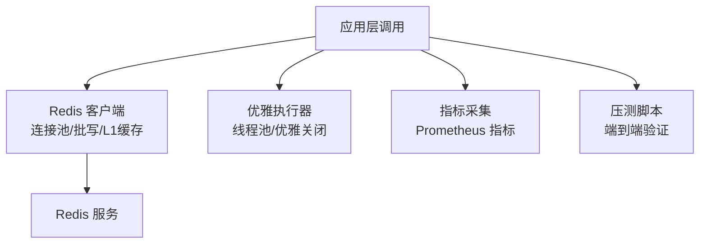
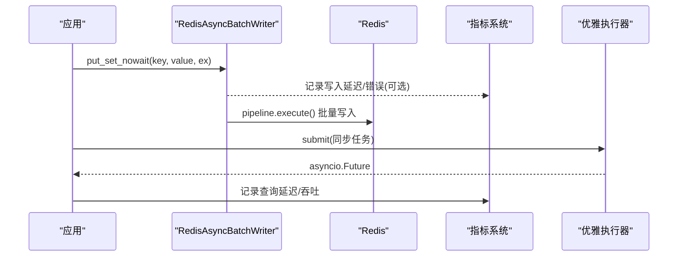
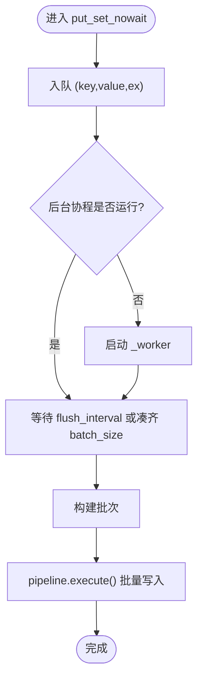
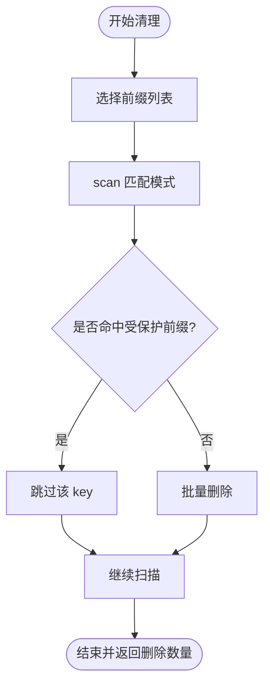
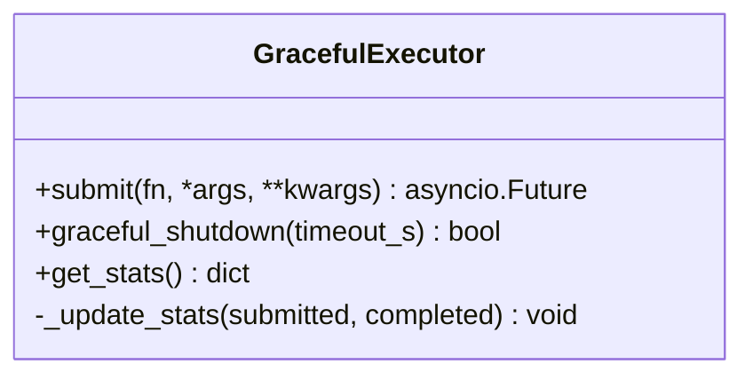
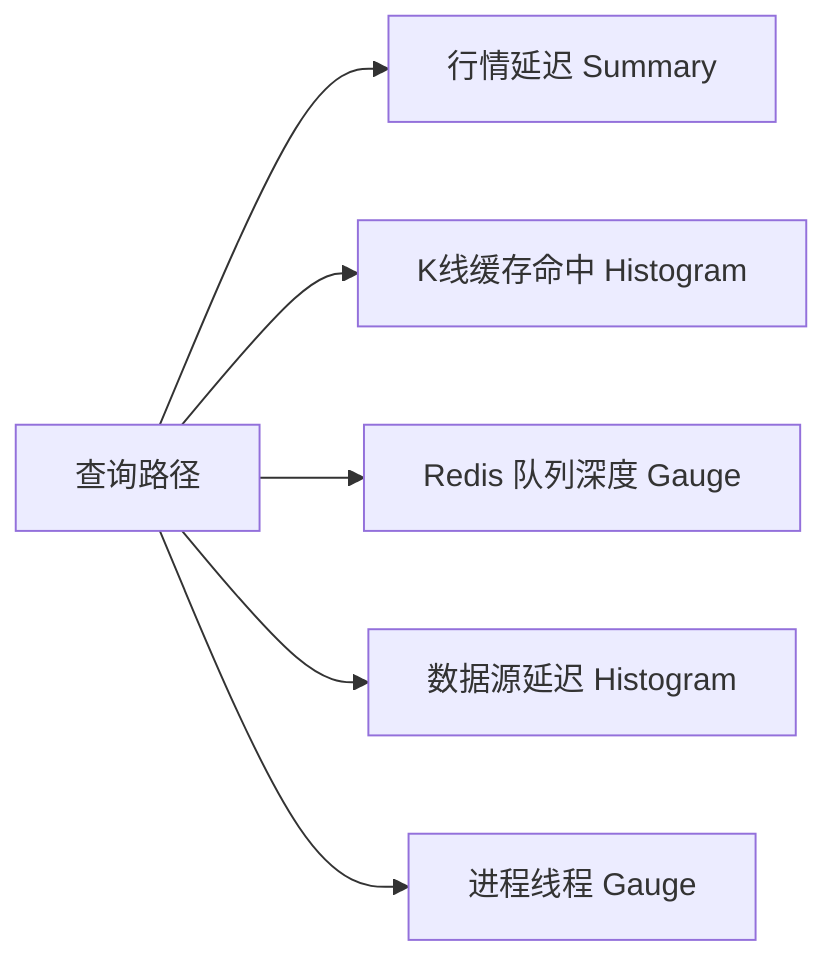
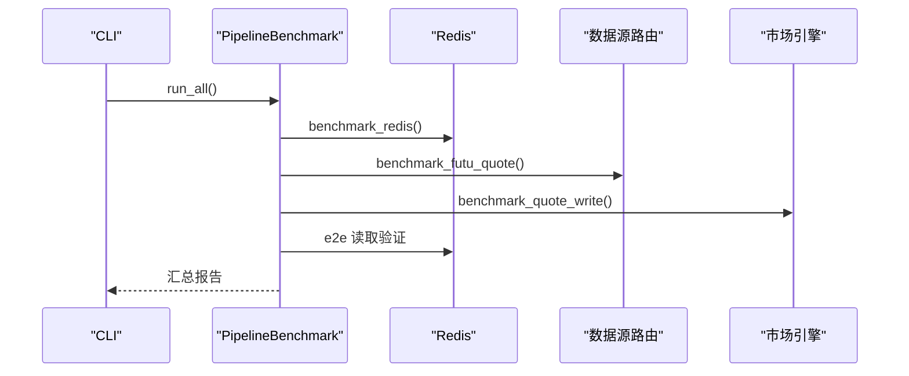
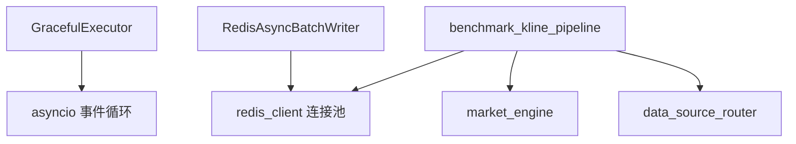

# 查询优化与性能

<cite>
**本文引用的文件**
- [backend/core/redis_client.py](file://backend/core/redis_client.py)
- [backend/core/cache_manager.py](file://backend/core/cache_manager.py)
- [backend/core/metrics.py](file://backend/core/metrics.py)
- [backend/core/graceful_executor.py](file://backend/core/graceful_executor.py)
- [backend/scripts/benchmark_kline_pipeline.py](file://backend/scripts/benchmark_kline_pipeline.py)
</cite>

## 目录
1. [简介](#简介)
2. [项目结构](#项目结构)
3. [核心组件](#核心组件)
4. [架构总览](#架构总览)
5. [详细组件分析](#详细组件分析)
6. [依赖关系分析](#依赖关系分析)
7. [性能考量](#性能考量)
8. [故障排查指南](#故障排查指南)
9. [结论](#结论)
10. [附录](#附录)

## 简介
本文件聚焦 Quant Agent 的查询优化与性能调优，围绕以下主题展开：
- 查询引擎优化：并行读取、流式处理、内存管理
- 缓存策略：多级缓存架构、缓存失效机制、热点数据预取
- 异步处理机制：线程池使用、协程优化、阻塞操作隔离
- 性能监控：查询延迟统计、吞吐量监控、资源使用分析
- 实战示例：批量查询优化、智能缓存配置、并发参数调优
- 基准测试方法与调优最佳实践

## 项目结构
与查询性能密切相关的后端模块集中在 backend/core 与 backend/scripts：
- Redis 客户端与批写器：提供连接池、异步批量写入、进程内 L1 缓存
- 缓存清理工具：统一业务缓存前缀清理，保护交易态数据
- 指标体系：Prometheus 指标定义，覆盖行情、K线、Redis、熔断、数据源等
- 优雅执行器：基于 ThreadPoolExecutor 的异步优雅关闭封装
- 压测脚本：端到端 K 线管道压测，覆盖 Redis、数据源、写入与全链路

图表来源
- [backend/core/redis_client.py:1-200](file://backend/core/redis_client.py#L1-L200)
- [backend/core/graceful_executor.py:1-204](file://backend/core/graceful_executor.py#L1-L204)
- [backend/core/metrics.py:1-641](file://backend/core/metrics.py#L1-L641)
- [backend/scripts/benchmark_kline_pipeline.py:1-368](file://backend/scripts/benchmark_kline_pipeline.py#L1-L368)

章节来源
- [backend/core/redis_client.py:1-200](file://backend/core/redis_client.py#L1-L200)
- [backend/core/graceful_executor.py:1-204](file://backend/core/graceful_executor.py#L1-L204)
- [backend/core/metrics.py:1-641](file://backend/core/metrics.py#L1-L641)
- [backend/scripts/benchmark_kline_pipeline.py:1-368](file://backend/scripts/benchmark_kline_pipeline.py#L1-L368)

## 核心组件
- Redis 异步批写与 L1 缓存：通过队列聚合高频 set 请求，使用 Pipeline 批量落盘；进程内短效缓存降低极高频读的网络开销。
- 统一缓存清理：按前缀扫描并删除业务缓存，同时保护交易态 key 不被误删。
- Prometheus 指标：覆盖行情延迟、K线缓存命中、Redis 队列深度、熔断状态、数据源可用性、线程水位等。
- 优雅执行器：将同步任务包装为异步 Future，支持超时等待与统计计数，保障优雅关闭。
- 压测工具：分阶段测量 Redis Stream、数据源获取、写入与端到端延迟，输出 P50/P95/P99 统计。

章节来源
- [backend/core/redis_client.py:1-200](file://backend/core/redis_client.py#L1-L200)
- [backend/core/cache_manager.py:1-75](file://backend/core/cache_manager.py#L1-L75)
- [backend/core/metrics.py:1-641](file://backend/core/metrics.py#L1-L641)
- [backend/core/graceful_executor.py:1-204](file://backend/core/graceful_executor.py#L1-L204)
- [backend/scripts/benchmark_kline_pipeline.py:1-368](file://backend/scripts/benchmark_kline_pipeline.py#L1-L368)

## 架构总览
下图展示查询路径中的关键优化点：应用侧通过批写器与本地缓存减少网络往返，指标埋点贯穿各阶段，压测脚本用于回归验证。

图表来源
- [backend/core/redis_client.py:46-177](file://backend/core/redis_client.py#L46-L177)
- [backend/core/graceful_executor.py:26-113](file://backend/core/graceful_executor.py#L26-L113)
- [backend/core/metrics.py:18-183](file://backend/core/metrics.py#L18-L183)

## 详细组件分析

### Redis 异步批写与 L1 缓存
- 设计要点
  - 连接池：统一配置最大连接数，避免无上限打满。
  - 异步批写：后台协程定时或达到阈值时触发 Pipeline 批量写入，显著降低 RTT 与带宽占用。
  - 优雅停机：停止时强制 flush 剩余数据，确保不丢数据。
  - L1 缓存：进程内短效缓存，针对极高频读取（如配置字典）降低 Redis 访问。
- 复杂度与性能
  - 批写时间复杂度 O(n)，空间复杂度受队列与 batch_size 限制。
  - Pipeline 批量可成倍降低网络往返，适合高吞吐场景。
- 错误处理
  - 捕获异常并记录日志，保证事件循环健壮性。
  - 优雅关闭时多次重试清空队列，最终报告未写入条数。

图表来源
- [backend/core/redis_client.py:46-177](file://backend/core/redis_client.py#L46-L177)

章节来源
- [backend/core/redis_client.py:1-200](file://backend/core/redis_client.py#L1-L200)

### 统一缓存清理与失效策略
- 设计要点
  - 默认清理的业务缓存前缀：K 线、通用缓存、新闻、宏观、insider 等。
  - 受保护前缀：OMS 活动订单、状态、持仓等交易态数据，绝不触碰。
  - 扫描策略：使用 scan 模式匹配，分批删除，避免阻塞。
- 失效机制
  - 通过前缀控制影响范围，结合 TTL（由上层写入时设置）实现过期失效。
  - 热点数据可通过 L1 缓存与批写器组合提升命中率与降低延迟。

图表来源
- [backend/core/cache_manager.py:19-75](file://backend/core/cache_manager.py#L19-L75)

章节来源
- [backend/core/cache_manager.py:1-75](file://backend/core/cache_manager.py#L1-L75)

### 优雅执行器（线程池与协程集成）
- 设计要点
  - 继承 ThreadPoolExecutor，重写 submit 返回 asyncio.Future，便于在异步上下文中统一管理。
  - 统计计数器：提交数、完成数、活跃任务数，便于监控与诊断。
  - 优雅关闭：支持超时等待，避免中断正在执行的任务。
- 适用场景
  - 将 CPU 密集或阻塞 I/O 任务放入线程池，避免阻塞事件循环。
  - 在生命周期结束时安全关闭，确保数据一致性。

图表来源
- [backend/core/graceful_executor.py:26-113](file://backend/core/graceful_executor.py#L26-L113)
- [backend/core/graceful_executor.py:114-187](file://backend/core/graceful_executor.py#L114-L187)

章节来源
- [backend/core/graceful_executor.py:1-204](file://backend/core/graceful_executor.py#L1-L204)

### 指标与监控
- 指标覆盖
  - 行情延迟 Summary、K线缓存命中 Histogram、Redis 队列深度 Gauge、熔断状态 Gauge。
  - 数据源延迟直方图、错误计数、限流计数、可用性状态。
  - 进程线程水位 Gauge，辅助定位线程耗尽问题。
- 使用方式
  - 在关键路径埋点记录延迟与错误，配合 Prometheus/Grafana 可视化。
  - 通过标签区分 source、symbol、tier 等维度，便于定位瓶颈。

图表来源
- [backend/core/metrics.py:18-183](file://backend/core/metrics.py#L18-L183)
- [backend/core/metrics.py:286-301](file://backend/core/metrics.py#L286-L301)
- [backend/core/metrics.py:595-619](file://backend/core/metrics.py#L595-L619)

章节来源
- [backend/core/metrics.py:1-641](file://backend/core/metrics.py#L1-L641)

### 端到端压测与基准方法
- 压测阶段
  - Redis Stream 写入/读取延迟
  - Futu 行情获取延迟
  - 行情写入 Redis 延迟
  - 端到端全链路延迟
- 统计指标
  - 计算 min/max/mean/median/p50/p90/p95/p99，评估是否达标（P99 < 50ms）。
- 使用方法
  - 命令行指定标的与迭代次数，可选择仅测试某一阶段。
  - 输出可读报告，便于回归对比。

图表来源
- [backend/scripts/benchmark_kline_pipeline.py:47-308](file://backend/scripts/benchmark_kline_pipeline.py#L47-L308)

章节来源
- [backend/scripts/benchmark_kline_pipeline.py:1-368](file://backend/scripts/benchmark_kline_pipeline.py#L1-L368)

## 依赖关系分析
- 组件耦合
  - 批写器依赖 Redis 客户端与连接池，优雅关闭依赖事件循环。
  - 指标模块独立，被各组件按需埋点。
  - 压测脚本依赖数据源路由与市场引擎进行端到端验证。
- 外部依赖
  - Redis 作为共享缓存与消息总线。
  - Prometheus 用于指标采集与可视化。

图表来源
- [backend/core/redis_client.py:1-35](file://backend/core/redis_client.py#L1-L35)
- [backend/core/graceful_executor.py:20-26](file://backend/core/graceful_executor.py#L20-L26)
- [backend/scripts/benchmark_kline_pipeline.py:129-220](file://backend/scripts/benchmark_kline_pipeline.py#L129-L220)

章节来源
- [backend/core/redis_client.py:1-200](file://backend/core/redis_client.py#L1-L200)
- [backend/core/graceful_executor.py:1-204](file://backend/core/graceful_executor.py#L1-L204)
- [backend/scripts/benchmark_kline_pipeline.py:1-368](file://backend/scripts/benchmark_kline_pipeline.py#L1-L368)

## 性能考量
- 并行读取
  - 通过数据源路由并行拉取多标的行情，结合 Redis Stream 广播，降低整体延迟。
  - 使用优雅执行器将阻塞任务放入线程池，避免阻塞事件循环。
- 流式处理
  - Redis Stream 作为消息通道，消费者以流式方式处理行情，提高吞吐与实时性。
- 内存管理
  - L1 缓存限制最大容量，定期清理，防止内存泄漏。
  - 批写队列大小与 flush_interval 需根据负载调优，平衡延迟与吞吐。
- 缓存策略
  - 多级缓存：L1 进程内缓存 + Redis 缓存 + Parquet/数据湖（由上层决定），热点数据优先命中 L1。
  - 失效机制：通过前缀清理与 TTL 控制，避免脏数据累积。
- 监控与告警
  - 利用 Summary/Histogram/Gauge/Counter 多维度观测延迟、吞吐、错误率与资源使用。
  - 关注线程水位与 Redis 队列深度，及时扩容或限流。

[本节为通用指导，不直接分析具体文件]

## 故障排查指南
- 常见问题
  - 高延迟：检查 Redis 连接池大小、批写队列长度、Pipeline 批量大小。
  - 数据丢失：确认优雅关闭流程是否成功 flush 队列，查看最终队列深度。
  - 线程耗尽：观察进程线程 Gauge，必要时调整线程池大小或任务粒度。
  - 缓存污染：使用统一缓存清理工具按前缀清理，注意保护交易态 key。
- 定位步骤
  - 通过指标面板查看延迟分布与错误计数，定位瓶颈阶段。
  - 使用压测脚本复现问题，逐步缩小范围至 Redis、数据源或写入链路。
  - 结合日志与指标，确认优雅关闭与异常处理是否生效。

章节来源
- [backend/core/redis_client.py:59-110](file://backend/core/redis_client.py#L59-L110)
- [backend/core/cache_manager.py:47-75](file://backend/core/cache_manager.py#L47-L75)
- [backend/core/metrics.py:595-619](file://backend/core/metrics.py#L595-L619)

## 结论
Quant Agent 的查询优化与性能调优围绕“低延迟、高吞吐、强一致”的目标，构建了以 Redis 为核心的多级缓存与流式处理体系，并通过优雅执行器与指标监控保障稳定性与可观测性。压测工具为持续优化提供了量化依据。建议在生产环境中结合负载特征调优批写参数、缓存容量与线程池规模，并持续跟踪指标变化，确保系统稳定高效运行。

[本节为总结性内容，不直接分析具体文件]

## 附录
- 批量查询优化示例
  - 使用 RedisAsyncBatchWriter 的 put_set_nowait 接口进行 Fire-and-Forget 写入，后台协程自动批量合并与 Pipeline 提交。
  - 合理设置 batch_size 与 flush_interval，平衡延迟与吞吐。
- 智能缓存配置示例
  - 对极高频读取（如配置字典）启用 LocalL1Cache，设置 default_ttl 与 max_size，降低 Redis 访问。
  - 通过统一缓存清理工具按前缀清理业务缓存，保护交易态数据。
- 并发参数调优示例
  - 调整 REDIS_MAX_CONNECTIONS 以匹配并发量，避免连接不足或过多。
  - 根据任务特性调整 GracefulExecutor 的 max_workers 与 max_wait_s，确保优雅关闭。
- 基准测试方法
  - 使用 benchmark_kline_pipeline 进行端到端压测，关注 P99 延迟与通过率。
  - 分阶段测试 Redis、数据源、写入与全链路，定位瓶颈环节。

章节来源
- [backend/core/redis_client.py:46-200](file://backend/core/redis_client.py#L46-L200)
- [backend/core/cache_manager.py:19-75](file://backend/core/cache_manager.py#L19-L75)
- [backend/core/graceful_executor.py:41-113](file://backend/core/graceful_executor.py#L41-L113)
- [backend/scripts/benchmark_kline_pipeline.py:47-308](file://backend/scripts/benchmark_kline_pipeline.py#L47-L308)
