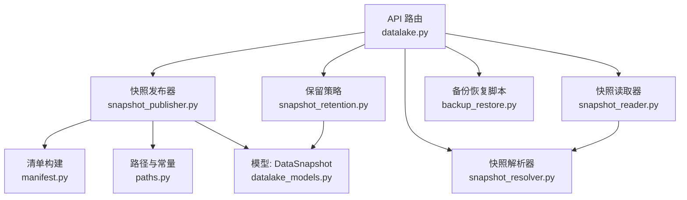
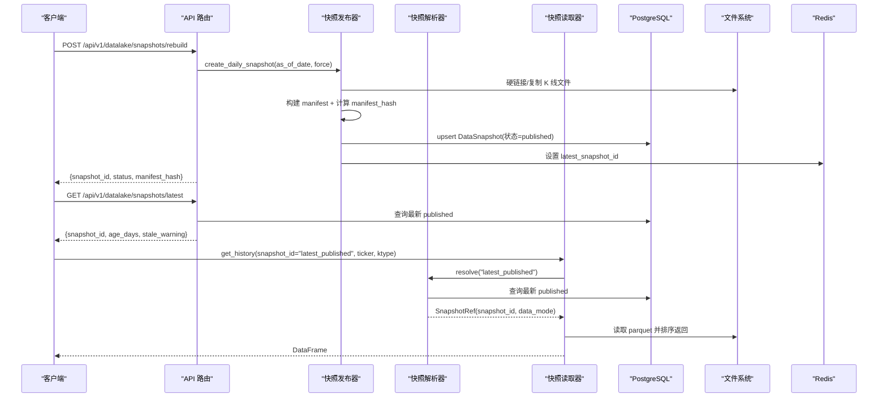
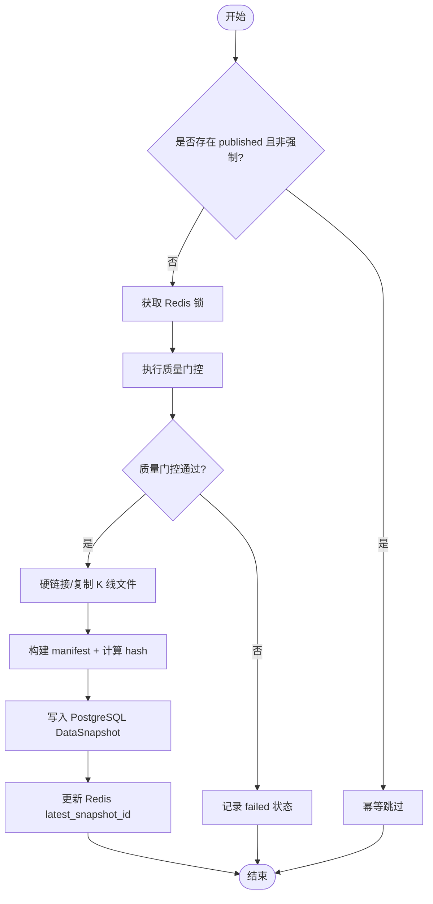
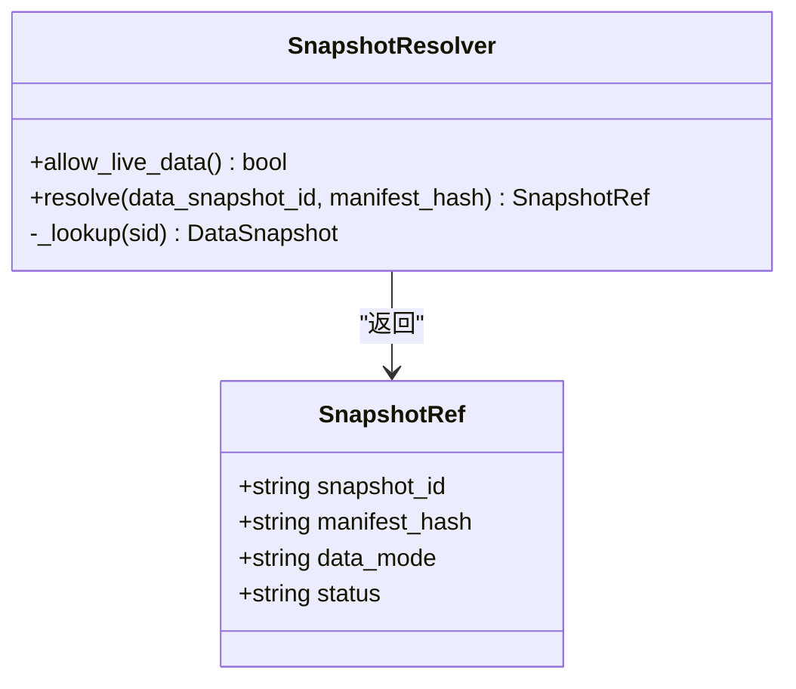
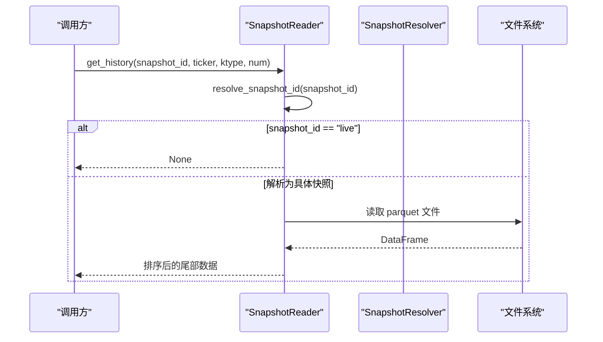
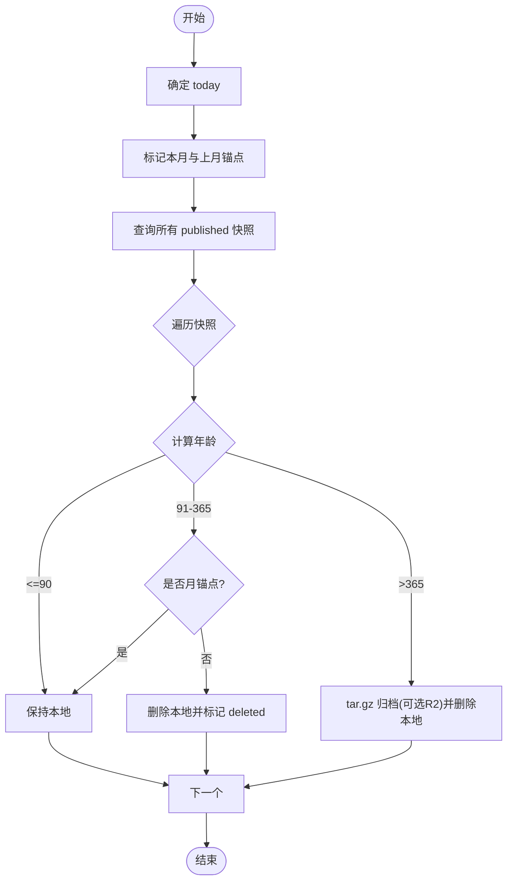
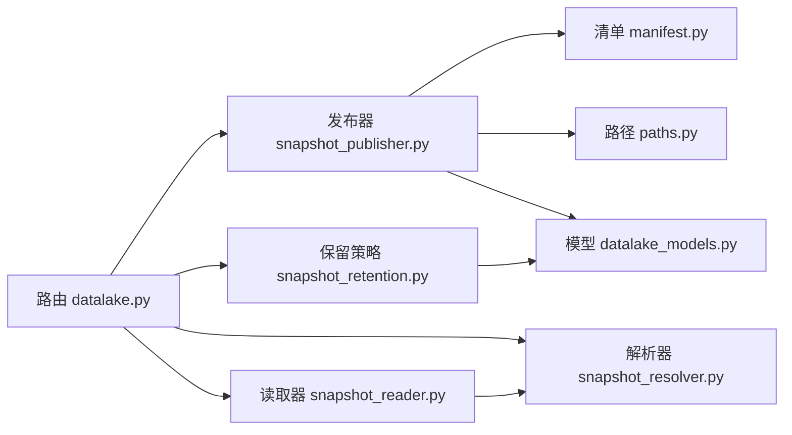

# 版本管理与快照

<cite>
**本文引用的文件**
- [backend/services/datalake/snapshot_publisher.py](file://backend/services/datalake/snapshot_publisher.py)
- [backend/services/datalake/snapshot_reader.py](file://backend/services/datalake/snapshot_reader.py)
- [backend/services/datalake/snapshot_resolver.py](file://backend/services/datalake/snapshot_resolver.py)
- [backend/services/datalake/snapshot_retention.py](file://backend/services/datalake/snapshot_retention.py)
- [backend/services/datalake/manifest.py](file://backend/services/datalake/manifest.py)
- [backend/services/datalake/paths.py](file://backend/services/datalake/paths.py)
- [backend/core/datalake_models.py](file://backend/core/datalake_models.py)
- [backend/routers/datalake.py](file://backend/routers/datalake.py)
- [backend/scripts/backup_restore.py](file://backend/scripts/backup_restore.py)
</cite>

## 目录
1. [简介](#简介)
2. [项目结构](#项目结构)
3. [核心组件](#核心组件)
4. [架构总览](#架构总览)
5. [详细组件分析](#详细组件分析)
6. [依赖关系分析](#依赖关系分析)
7. [性能考量](#性能考量)
8. [故障排查指南](#故障排查指南)
9. [结论](#结论)
10. [附录：使用示例与最佳实践](#附录使用示例与最佳实践)

## 简介
本文件面向 Quant Agent 的“版本管理与快照系统”，围绕数据湖（Parquet）日级快照的创建、解析、读取、保留策略与恢复能力，提供从架构到实现细节的系统性说明。重点覆盖：
- 快照管理机制：创建时机、元数据记录、版本标识生成
- 变更追踪：增量更新检测、差异计算、变更日志记录
- 回滚机制：历史版本恢复、数据一致性保证、事务支持
- 保留策略：时间窗口管理、空间清理、归档策略
- 完整性校验与故障恢复流程
- 具体操作示例：创建快照、查询版本历史、执行数据回滚、配置保留规则

## 项目结构
快照系统位于后端服务中，采用分层设计：
- 发布层：负责将 live 层 K 线数据以快照形式落盘并生成清单
- 解析与读取层：将逻辑引用（如 latest_published/live）解析为具体快照或实时数据
- 清单与路径：定义 manifest 结构与文件系统约定
- 持久化模型：PostgreSQL 表用于存储快照元数据与报告
- 路由层：对外暴露快照管理 API
- 保留策略：按时间窗口对快照进行本地删除与归档
- 备份恢复脚本：提供数据库与缓存的恢复演练工具

图表来源
- [backend/routers/datalake.py:61-138](file://backend/routers/datalake.py#L61-L138)
- [backend/services/datalake/snapshot_publisher.py:91-250](file://backend/services/datalake/snapshot_publisher.py#L91-L250)
- [backend/services/datalake/snapshot_resolver.py:31-103](file://backend/services/datalake/snapshot_resolver.py#L31-L103)
- [backend/services/datalake/snapshot_reader.py:30-121](file://backend/services/datalake/snapshot_reader.py#L30-L121)
- [backend/services/datalake/snapshot_retention.py:29-143](file://backend/services/datalake/snapshot_retention.py#L29-L143)
- [backend/services/datalake/manifest.py:16-78](file://backend/services/datalake/manifest.py#L16-L78)
- [backend/services/datalake/paths.py:1-43](file://backend/services/datalake/paths.py#L1-L43)
- [backend/core/datalake_models.py:31-82](file://backend/core/datalake_models.py#L31-L82)
- [backend/scripts/backup_restore.py:44-355](file://backend/scripts/backup_restore.py#L44-L355)

章节来源
- [backend/routers/datalake.py:61-138](file://backend/routers/datalake.py#L61-L138)
- [backend/services/datalake/paths.py:1-43](file://backend/services/datalake/paths.py#L1-L43)

## 核心组件
- 快照发布器（SnapshotPublisher）：从 live 层复制/硬链接 K 线 Parquet 文件，生成清单 manifest.json，写入 PostgreSQL 元数据，并更新 Redis 指针
- 快照解析器（SnapshotResolver）：将 latest_published/live/指定快照 ID 解析为可绑定的 SnapshotRef，含数据模式与状态
- 快照读取器（SnapshotReader）：基于解析结果只读访问快照目录中的 K 线数据，支持同步/异步读取
- 清单模块（manifest）：确定性 JSON 序列化与 manifest_hash 计算，保障数据指纹一致性与完整性校验
- 路径与常量（paths）：定义 live/snapshots 根路径、K 类型、Redis 键名、脏率阈值等
- 模型（DataSnapshot/BacktestReport）：PostgreSQL 表结构，承载快照元数据与回测可复现性绑定
- 保留策略（SnapshotRetention）：T1/T2/T3 时间窗口的本地删除与归档（tar.gz/R2），并标记月锚点
- 路由（datalake.py）：对外提供列表、最新、详情、重建、运行保留策略等 API
- 备份恢复脚本（backup_restore.py）：PostgreSQL/Redis 备份恢复与完整性验证

章节来源
- [backend/services/datalake/snapshot_publisher.py:91-250](file://backend/services/datalake/snapshot_publisher.py#L91-L250)
- [backend/services/datalake/snapshot_resolver.py:31-103](file://backend/services/datalake/snapshot_resolver.py#L31-L103)
- [backend/services/datalake/snapshot_reader.py:30-121](file://backend/services/datalake/snapshot_reader.py#L30-L121)
- [backend/services/datalake/manifest.py:16-78](file://backend/services/datalake/manifest.py#L16-L78)
- [backend/services/datalake/paths.py:1-43](file://backend/services/datalake/paths.py#L1-L43)
- [backend/core/datalake_models.py:31-82](file://backend/core/datalake_models.py#L31-L82)
- [backend/services/datalake/snapshot_retention.py:29-143](file://backend/services/datalake/snapshot_retention.py#L29-L143)
- [backend/routers/datalake.py:61-138](file://backend/routers/datalake.py#L61-L138)
- [backend/scripts/backup_restore.py:44-355](file://backend/scripts/backup_restore.py#L44-L355)

## 架构总览
快照生命周期包括：创建（发布）、解析（引用）、读取（只读）、保留（清理/归档）、恢复（RTO 目标）。

图表来源
- [backend/routers/datalake.py:112-138](file://backend/routers/datalake.py#L112-L138)
- [backend/services/datalake/snapshot_publisher.py:119-250](file://backend/services/datalake/snapshot_publisher.py#L119-L250)
- [backend/services/datalake/snapshot_resolver.py:44-103](file://backend/services/datalake/snapshot_resolver.py#L44-L103)
- [backend/services/datalake/snapshot_reader.py:42-121](file://backend/services/datalake/snapshot_reader.py#L42-L121)
- [backend/core/datalake_models.py:31-50](file://backend/core/datalake_models.py#L31-L50)
- [backend/services/datalake/paths.py:15-18](file://backend/services/datalake/paths.py#L15-L18)

## 详细组件分析

### 快照发布器（SnapshotPublisher）
职责与行为：
- 幂等创建：若已存在 published 且未强制重建，直接跳过
- 并发控制：通过 Redis 锁避免重复创建同一日期快照
- 质量门控：可注入质量检查函数，失败时记录 failed 状态
- 文件处理：优先硬链接，失败则 copy2；记录每个文件的 sha256、大小、行数、时间范围
- 清单生成：构建 manifest.json，包含 snapshot_id、as_of_date、files、sidecars、ktypes_included、quality_gate、engine_version、created_at、source_sync_lock 等
- 元数据持久化：upsert DataSnapshot，记录 manifest_hash、ticker_count、total_bytes、storage_tier、published_at
- 指针更新：成功后更新 Redis latest_snapshot_id，并删除 building 标志
- 指标上报：DATALAKE_SNAPSHOT_CREATED 计数

关键流程（流程图）：

图表来源
- [backend/services/datalake/snapshot_publisher.py:119-250](file://backend/services/datalake/snapshot_publisher.py#L119-L250)
- [backend/services/datalake/manifest.py:27-66](file://backend/services/datalake/manifest.py#L27-L66)
- [backend/services/datalake/paths.py:15-18](file://backend/services/datalake/paths.py#L15-L18)

章节来源
- [backend/services/datalake/snapshot_publisher.py:91-250](file://backend/services/datalake/snapshot_publisher.py#L91-L250)
- [backend/services/datalake/manifest.py:16-78](file://backend/services/datalake/manifest.py#L16-L78)
- [backend/services/datalake/paths.py:1-43](file://backend/services/datalake/paths.py#L1-L43)

### 快照解析器（SnapshotResolver）
职责与行为：
- 支持 latest_published/live/指定快照 ID
- live 仅在开发环境允许（环境变量 ENGINE_ALLOW_LIVE_DATA=true）
- 无 DB 或无 published 时，允许显式 manifest_hash 构造 unbound/snapshot 引用（测试/预绑定）
- 返回 SnapshotRef：包含 snapshot_id、manifest_hash、data_mode、status

类图：

图表来源
- [backend/services/datalake/snapshot_resolver.py:31-103](file://backend/services/datalake/snapshot_resolver.py#L31-L103)

章节来源
- [backend/services/datalake/snapshot_resolver.py:31-103](file://backend/services/datalake/snapshot_resolver.py#L31-L103)

### 快照读取器（SnapshotReader）
职责与行为：
- 解析 snapshot_id：latest_published → Redis/DB 解析；live → 返回 live
- 获取 manifest：优先读取 manifest.json，否则回退到 DB 行
- 读取历史 K 线：按 ticker/ktype 定位 parquet，排序后取尾部 N 条
- 列出 ticker：扫描快照目录下的 parquet 文件名并还原 ticker

序列图（读取历史）：

图表来源
- [backend/services/datalake/snapshot_reader.py:42-121](file://backend/services/datalake/snapshot_reader.py#L42-L121)
- [backend/services/datalake/snapshot_resolver.py:44-103](file://backend/services/datalake/snapshot_resolver.py#L44-L103)

章节来源
- [backend/services/datalake/snapshot_reader.py:30-121](file://backend/services/datalake/snapshot_reader.py#L30-L121)

### 清单与完整性校验（manifest）
- 确定性 JSON：sort_keys + 紧凑分隔符 + 日期 ISO 转换
- manifest_hash：对不含自身字段的内容计算 sha256
- validate_manifest：校验 manifest_hash 是否匹配内容（兼容 "sha256:" 前缀）

章节来源
- [backend/services/datalake/manifest.py:16-78](file://backend/services/datalake/manifest.py#L16-L78)

### 路径与常量（paths）
- LIVE_ROOT/SNAPSHOTS_ROOT：可通过环境变量覆盖
- KTYPES_V1：当前支持的 K 类型（K_DAY、K_60M）
- Redis 键：latest_snapshot_id、snapshot_building、create lock、retention lock
- DIRTY_RATE_MAX：脏率阈值
- 文件名与 ticker 互转：安全命名与还原

章节来源
- [backend/services/datalake/paths.py:1-43](file://backend/services/datalake/paths.py#L1-L43)

### 模型（DataSnapshot/BacktestReport）
- DataSnapshot：快照不可变元数据，含 status、manifest_hash、storage_tier、r2_key、is_monthly_anchor、时间戳等
- BacktestReport：回测可复现性绑定，含 code_hash、params、random_seed、engine_version、data_mode、reproducible、metrics 等

章节来源
- [backend/core/datalake_models.py:31-82](file://backend/core/datalake_models.py#L31-L82)

### 保留策略（SnapshotRetention）
- T1（0–90天）：全保留
- T2（91–365天）：仅保留月锚点，其他本地删除
- T3（>365天）：tar.gz 归档（可选上传至 R2），然后删除本地
- 月锚点：每月最后一个 published 快照标记为 is_monthly_anchor
- 带锁执行：Redis 锁防止并发运行

流程图（保留策略）：

图表来源
- [backend/services/datalake/snapshot_retention.py:61-143](file://backend/services/datalake/snapshot_retention.py#L61-L143)

章节来源
- [backend/services/datalake/snapshot_retention.py:29-143](file://backend/services/datalake/snapshot_retention.py#L29-L143)

### API 路由（datalake.py）
- GET /api/v1/datalake/snapshots：按状态/存储层级过滤，分页返回
- GET /api/v1/datalake/snapshots/latest：返回最新 published 快照及年龄、陈旧警告
- GET /api/v1/datalake/snapshots/{snapshot_id}：返回快照详情与 manifest
- POST /api/v1/datalake/snapshots/rebuild：重建指定日期快照（支持 force）
- POST /api/v1/datalake/snapshots/retention/run：手动触发保留策略

章节来源
- [backend/routers/datalake.py:61-138](file://backend/routers/datalake.py#L61-L138)

## 依赖关系分析
- 发布器依赖清单模块与路径模块，持久化依赖 DataSnapshot 模型，并发控制依赖 Redis
- 读取器依赖解析器与路径模块，读取依赖文件系统
- 解析器依赖 DataSnapshot 模型与环境变量
- 保留策略依赖 DataSnapshot 模型与文件系统，可选 R2 上传
- 路由层聚合上述服务，提供统一入口

图表来源
- [backend/routers/datalake.py:61-138](file://backend/routers/datalake.py#L61-L138)
- [backend/services/datalake/snapshot_publisher.py:91-250](file://backend/services/datalake/snapshot_publisher.py#L91-L250)
- [backend/services/datalake/snapshot_resolver.py:31-103](file://backend/services/datalake/snapshot_resolver.py#L31-L103)
- [backend/services/datalake/snapshot_reader.py:30-121](file://backend/services/datalake/snapshot_reader.py#L30-L121)
- [backend/services/datalake/snapshot_retention.py:29-143](file://backend/services/datalake/snapshot_retention.py#L29-L143)
- [backend/services/datalake/manifest.py:16-78](file://backend/services/datalake/manifest.py#L16-L78)
- [backend/services/datalake/paths.py:1-43](file://backend/services/datalake/paths.py#L1-L43)
- [backend/core/datalake_models.py:31-82](file://backend/core/datalake_models.py#L31-L82)

章节来源
- [backend/routers/datalake.py:61-138](file://backend/routers/datalake.py#L61-L138)

## 性能考量
- 硬链接优先：减少磁盘占用与 I/O，跨分区回退到 copy2
- 清单哈希：确定性 JSON 确保快速校验与一致性比对
- Redis 指针：latest_snapshot_id 加速解析，降低 DB 压力
- 质量门控：脏率阈值控制，避免低质量数据进入快照
- 保留策略：按月锚点与时间窗分级管理，平衡可用性与存储成本
- 并发控制：Redis 锁避免重复创建与保留任务冲突

[本节为通用指导，不直接分析具体文件]

## 故障排查指南
- 快照创建失败
  - 检查质量门控是否通过（dirty_rate_max 与 sources_checked）
  - 确认 Redis 锁是否被持有（REDIS_BUILDING_KEY）
  - 查看日志中的 quality_gate 与 lock_held 消息
- 无法解析 latest_published
  - 检查 Redis 键 quant:datalake:latest_snapshot_id 是否存在
  - 检查 PostgreSQL 中是否有 status=published 的记录
  - 若为 live 模式，确认环境变量 ENGINE_ALLOW_LIVE_DATA=true
- 读取快照数据为空
  - 确认 parquet 文件是否存在于快照目录
  - 检查 ticker 文件名与安全命名转换是否正确
- 保留策略未生效
  - 检查 Redis 锁 quant:lock:snapshot_retention 是否被占用
  - 确认快照年龄与存储层级是否符合预期
- 备份恢复
  - 使用 backup_restore.py 验证备份完整性
  - 根据 RTO 目标评估恢复耗时

章节来源
- [backend/services/datalake/snapshot_publisher.py:119-250](file://backend/services/datalake/snapshot_publisher.py#L119-L250)
- [backend/services/datalake/snapshot_reader.py:42-121](file://backend/services/datalake/snapshot_reader.py#L42-L121)
- [backend/services/datalake/snapshot_retention.py:132-143](file://backend/services/datalake/snapshot_retention.py#L132-L143)
- [backend/scripts/backup_restore.py:243-355](file://backend/scripts/backup_restore.py#L243-L355)

## 结论
Quant Agent 的版本管理与快照系统通过“发布—解析—读取—保留—恢复”的闭环，实现了数据湖的可追溯、可复现与可运维。清单哈希与质量门控保障了数据完整性与可用性；Redis 指针与并发锁提升了系统稳定性；保留策略在成本与可用性之间取得平衡；备份恢复脚本提供了灾难恢复能力。建议在生产环境中结合监控指标与定期演练，持续优化 RTO/RPO 目标。

[本节为总结，不直接分析具体文件]

## 附录：使用示例与最佳实践

- 创建数据快照
  - 调用 POST /api/v1/datalake/snapshots/rebuild，参数 as_of_date=YYYY-MM-DD，可选 force=true
  - 成功响应包含 snapshot_id、status、manifest_hash、copy_mode、message
  - 参考：[backend/routers/datalake.py:112-138](file://backend/routers/datalake.py#L112-L138)

- 查询版本历史
  - 调用 GET /api/v1/datalake/snapshots，可按 status/storage_tier 过滤，limit 默认 50
  - 调用 GET /api/v1/datalake/snapshots/latest 获取最新 published 快照及其年龄与陈旧警告
  - 参考：[backend/routers/datalake.py:61-98](file://backend/routers/datalake.py#L61-L98)

- 执行数据回滚
  - 通过 SnapshotReader.get_history 指定 snapshot_id 读取历史 K 线
  - 若需恢复到特定快照，使用解析器将 latest_published 解析为具体快照 ID
  - 参考：[backend/services/datalake/snapshot_reader.py:79-121](file://backend/services/datalake/snapshot_reader.py#L79-L121)
  - 参考：[backend/services/datalake/snapshot_resolver.py:44-103](file://backend/services/datalake/snapshot_resolver.py#L44-L103)

- 配置保留规则
  - 调整 T1/T2/T3 阈值与月锚点策略，必要时扩展 r2_uploader
  - 手动触发保留策略：POST /api/v1/datalake/snapshots/retention/run
  - 参考：[backend/services/datalake/snapshot_retention.py:61-143](file://backend/services/datalake/snapshot_retention.py#L61-L143)
  - 参考：[backend/routers/datalake.py:134-138](file://backend/routers/datalake.py#L134-L138)

- 快照完整性校验
  - 使用 validate_manifest 校验 manifest_hash 与内容一致
  - 参考：[backend/services/datalake/manifest.py:69-78](file://backend/services/datalake/manifest.py#L69-L78)

- 故障恢复流程
  - 使用 backup_restore.py 验证备份完整性，执行 pg/redis 恢复
  - 参考：[backend/scripts/backup_restore.py:243-355](file://backend/scripts/backup_restore.py#L243-L355)

章节来源
- [backend/routers/datalake.py:61-138](file://backend/routers/datalake.py#L61-L138)
- [backend/services/datalake/snapshot_reader.py:79-121](file://backend/services/datalake/snapshot_reader.py#L79-L121)
- [backend/services/datalake/snapshot_resolver.py:44-103](file://backend/services/datalake/snapshot_resolver.py#L44-L103)
- [backend/services/datalake/snapshot_retention.py:61-143](file://backend/services/datalake/snapshot_retention.py#L61-L143)
- [backend/services/datalake/manifest.py:69-78](file://backend/services/datalake/manifest.py#L69-L78)
- [backend/scripts/backup_restore.py:243-355](file://backend/scripts/backup_restore.py#L243-L355)
