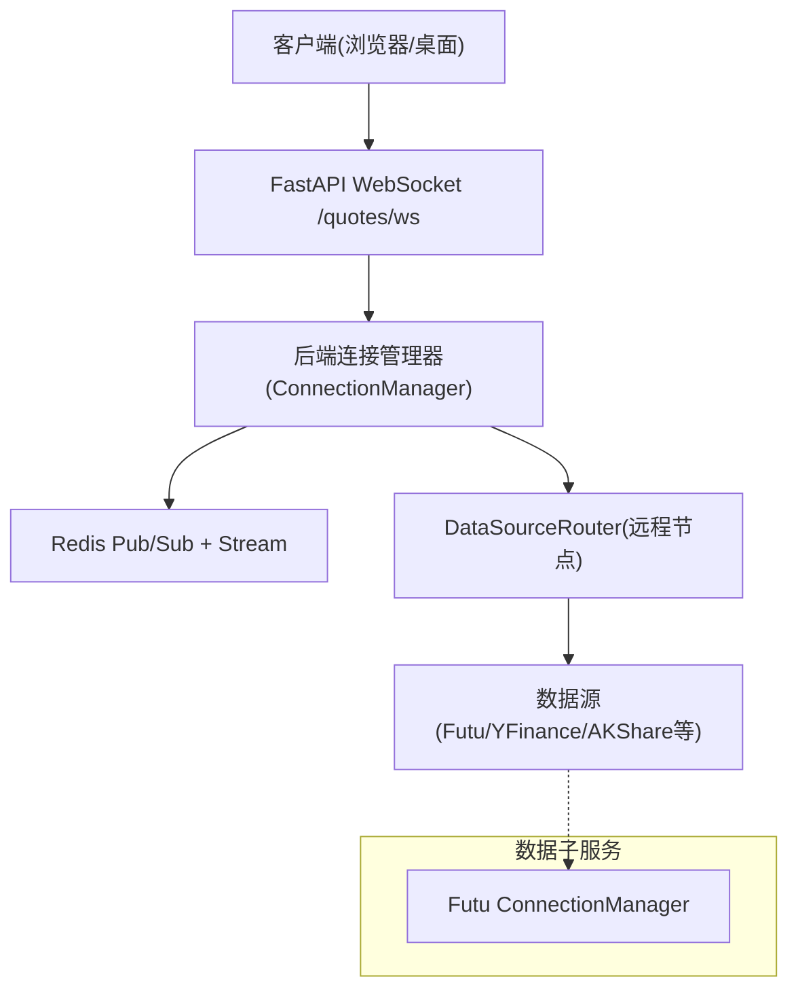
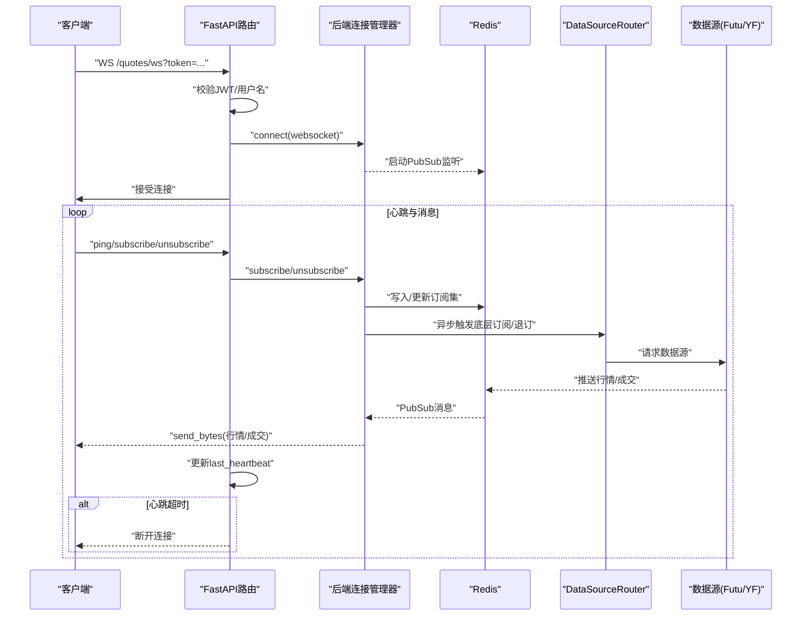
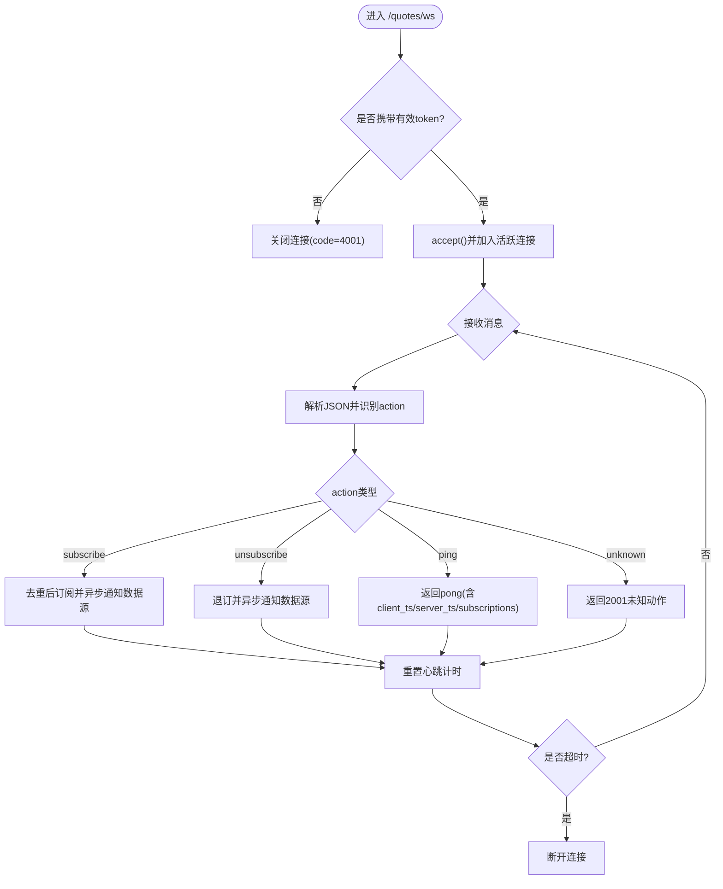
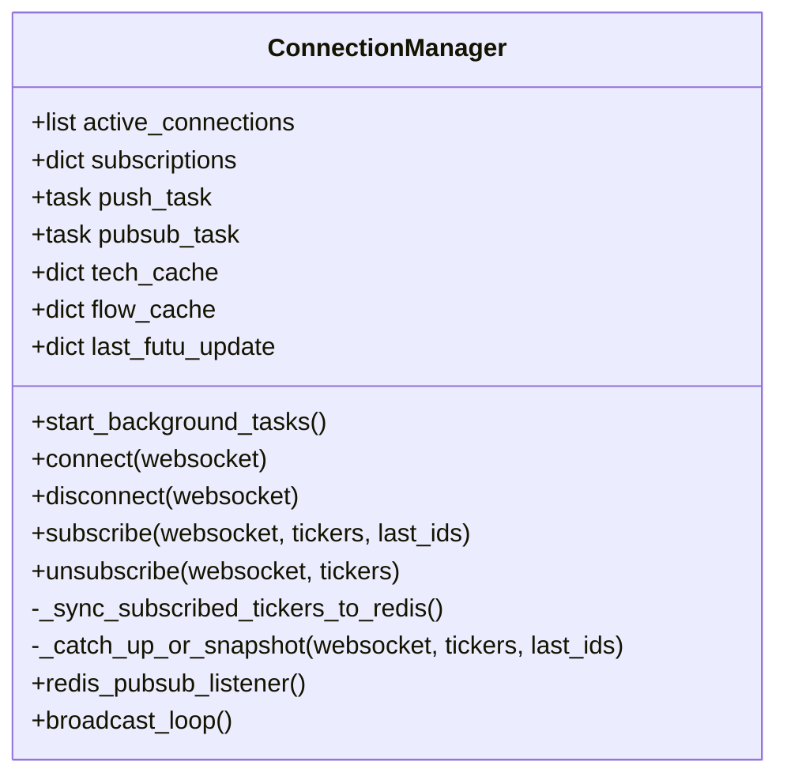
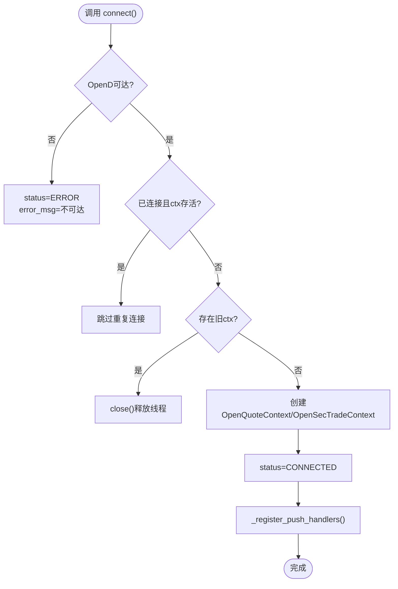
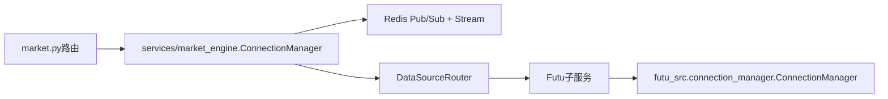

# WebSocket连接管理

<cite>
**本文引用的文件**
- [backend/routers/market.py](file://backend/routers/market.py)
- [backend/services/market_engine.py](file://backend/services/market_engine.py)
- [data_subservice/futu_src/connection_manager.py](file://data_subservice/futu_src/connection_manager.py)
- [backend/tests/test_market_websocket_auth.py](file://backend/tests/test_market_websocket_auth.py)
- [data_subservice/tests/test_connection_manager.py](file://data_subservice/tests/test_connection_manager.py)
</cite>

## 目录
1. [简介](#简介)
2. [项目结构](#项目结构)
3. [核心组件](#核心组件)
4. [架构总览](#架构总览)
5. [详细组件分析](#详细组件分析)
6. [依赖关系分析](#依赖关系分析)
7. [性能考量](#性能考量)
8. [故障排查指南](#故障排查指南)
9. [结论](#结论)
10. [附录](#附录)

## 简介
本文件面向Quant Agent的WebSocket连接管理系统，聚焦以下目标：
- 连接池与生命周期管理：连接复用、健康检查、断线恢复。
- 心跳检测机制：心跳间隔、超时处理、异常恢复策略。
- 断线重连策略：指数退避、最大重试次数、状态同步。
- 使用示例：建立连接、事件处理、自定义连接管理器。
- 监控与优化：连接数限制、内存优化、并发控制。

说明：本项目中“WebSocket”有两层含义
- 前端到后端（FastAPI）的WebSocket推送通道，负责鉴权、订阅/退订、心跳、消息分发。
- 后端到数据源（Futu OpenD）的长连接，由子服务中的ConnectionManager维护，提供行情与交易上下文。

## 项目结构
与WebSocket连接管理直接相关的代码主要分布在：
- 后端路由层：实现WebSocket端点、鉴权、心跳、订阅管理与消息广播。
- 后端引擎层：维护活跃连接、订阅集合、Redis总线监听与后台轮询。
- 数据子服务层：维护Futu OpenD连接上下文、连接探测、切换与关闭。

图表来源
- [backend/routers/market.py:73-226](file://backend/routers/market.py#L73-L226)
- [backend/services/market_engine.py:115-331](file://backend/services/market_engine.py#L115-L331)
- [data_subservice/futu_src/connection_manager.py:44-351](file://data_subservice/futu_src/connection_manager.py#L44-L351)

章节来源
- [backend/routers/market.py:73-226](file://backend/routers/market.py#L73-L226)
- [backend/services/market_engine.py:115-331](file://backend/services/market_engine.py#L115-L331)
- [data_subservice/futu_src/connection_manager.py:44-351](file://data_subservice/futu_src/connection_manager.py#L44-L351)

## 核心组件
- 后端WebSocket端点与鉴权：在路由层完成JWT校验、心跳计时、订阅去重、消息回送。
- 后端连接管理器：维护活跃连接、订阅集合、Redis监听、后台轮询与缓存清理。
- 数据子服务连接管理器：维护Futu OpenD行情/交易上下文，提供连接探测、切换、关闭与健康状态。

章节来源
- [backend/routers/market.py:73-226](file://backend/routers/market.py#L73-L226)
- [backend/services/market_engine.py:115-331](file://backend/services/market_engine.py#L115-L331)
- [data_subservice/futu_src/connection_manager.py:44-351](file://data_subservice/futu_src/connection_manager.py#L44-L351)

## 架构总览
下图展示了从客户端到数据源的完整链路，包括鉴权、订阅、心跳、Redis转发与底层数据源调用。

图表来源
- [backend/routers/market.py:73-226](file://backend/routers/market.py#L73-L226)
- [backend/services/market_engine.py:160-331](file://backend/services/market_engine.py#L160-L331)
- [backend/routers/market.py:129-161](file://backend/routers/market.py#L129-L161)

## 详细组件分析

### 后端WebSocket端点与心跳
- 鉴权：从查询参数读取JWT并解码，校验用户标识；失败返回不同错误码并关闭连接。
- 心跳：服务端维护last_heartbeat，超过阈值自动断开；支持ping/pong响应，附带服务器时间戳与订阅数量。
- 订阅：支持subscribe/unsubscribe，重复订阅会去重；对Futu标的异步触发底层订阅/退订。
- 消息格式：统一JSON信封，包含code/msg/data/ts。

图表来源
- [backend/routers/market.py:73-226](file://backend/routers/market.py#L73-L226)

章节来源
- [backend/routers/market.py:73-226](file://backend/routers/market.py#L73-L226)
- [backend/tests/test_market_websocket_auth.py:54-234](file://backend/tests/test_market_websocket_auth.py#L54-L234)

### 后端连接管理器（连接池、订阅、Redis总线）
- 连接池：维护active_connections与subscriptions；连接建立时注册背景任务（Redis监听与广播循环）。
- 订阅同步：将当前所有订阅标的集合写入Redis，供行情生产者动态跟随。
- Redis监听：监听quant:quotes:stream，按订阅过滤后向对应WebSocket发送二进制Protobuf帧。
- 追补与快照：新订阅时通过XRANGE追补错过的逐笔成交，或发送最新报价快照。
- 后台轮询：定时拉取技术指标与资金流，降级至YFinance，记录失败退避时间，防止风暴。

图表来源
- [backend/services/market_engine.py:115-331](file://backend/services/market_engine.py#L115-L331)
- [backend/services/market_engine.py:332-605](file://backend/services/market_engine.py#L332-L605)

章节来源
- [backend/services/market_engine.py:115-331](file://backend/services/market_engine.py#L115-L331)
- [backend/services/market_engine.py:332-605](file://backend/services/market_engine.py#L332-L605)

### 数据子服务Futu连接管理器（连接池、健康检查、切换）
- 连接生命周期：connect/close/get_quote_ctx/get_trade_context；线程安全锁避免并发建连。
- 健康检查：快速TCP探测OpenD可达性，不可达则置ERROR并拒绝创建上下文。
- 连接复用：仅在CONNECTED且ctx存活时跳过重复连接；重建前close旧ctx释放回调线程。
- 运行时切换：switch_host可动态更换目标地址并重新连接。
- 交易上下文保护：跨网络需RSA私钥或解锁密码，否则拒绝创建以避免线程泄漏。

图表来源
- [data_subservice/futu_src/connection_manager.py:79-159](file://data_subservice/futu_src/connection_manager.py#L79-L159)
- [data_subservice/futu_src/connection_manager.py:161-198](file://data_subservice/futu_src/connection_manager.py#L161-L198)
- [data_subservice/futu_src/connection_manager.py:217-279](file://data_subservice/futu_src/connection_manager.py#L217-L279)

章节来源
- [data_subservice/futu_src/connection_manager.py:44-351](file://data_subservice/futu_src/connection_manager.py#L44-L351)
- [data_subservice/tests/test_connection_manager.py:13-76](file://data_subservice/tests/test_connection_manager.py#L13-L76)

### 心跳检测机制
- 配置：心跳超时阈值在后端路由层定义（秒级），默认60秒。
- 实现：每次收到消息重置last_heartbeat；若超过阈值则主动断开连接。
- 异常恢复：客户端应实现ping/pong保活；服务端断开后由客户端重连。

章节来源
- [backend/routers/market.py:35-36](file://backend/routers/market.py#L35-L36)
- [backend/routers/market.py:101-226](file://backend/routers/market.py#L101-L226)

### 断线重连策略（建议与现状）
- 现状：后端路由层未内置指数退避与最大重试次数；心跳超时即断开，由客户端负责重连。
- 建议策略：
  - 指数退避：首次重连延迟1s，随后按2^n递增，上限为固定值（如60s）。
  - 最大重试次数：设置上限（如10次），超过后上报告警并停止尝试。
  - 连接状态同步：重连成功后立即重新发起订阅，确保与服务器订阅集一致。
  - 背压保护：慢客户端缓冲满时丢弃最旧消息或暂停推送。

[本节为通用建议，不直接分析具体文件]

### 使用示例
- 建立WebSocket连接：
  - 构造URL：ws://host/market/quotes/ws?token=<jwt>
  - 鉴权通过后，服务端接受连接并启动背景任务。
- 处理连接事件：
  - 订阅：发送{"action":"subscribe","tickers":["US.AAPL"]}
  - 退订：发送{"action":"unsubscribe","tickers":["US.AAPL"]}
  - 心跳：发送{"action":"ping","ts":<client_timestamp>}
- 自定义连接管理器：
  - 基于后端ConnectionManager扩展订阅策略与缓存清理。
  - 结合Redis订阅集实现多实例一致性。

章节来源
- [backend/routers/market.py:73-226](file://backend/routers/market.py#L73-L226)
- [backend/services/market_engine.py:174-251](file://backend/services/market_engine.py#L174-L251)

## 依赖关系分析
- 路由层依赖后端连接管理器进行连接与订阅管理。
- 后端连接管理器依赖Redis进行消息广播与订阅集同步。
- 数据子服务连接管理器依赖Futu SDK与系统配置（RSA私钥、解锁密码）以建立加密连接。

图表来源
- [backend/routers/market.py:73-226](file://backend/routers/market.py#L73-L226)
- [backend/services/market_engine.py:115-331](file://backend/services/market_engine.py#L115-L331)
- [data_subservice/futu_src/connection_manager.py:44-351](file://data_subservice/futu_src/connection_manager.py#L44-L351)

章节来源
- [backend/routers/market.py:73-226](file://backend/routers/market.py#L73-L226)
- [backend/services/market_engine.py:115-331](file://backend/services/market_engine.py#L115-L331)
- [data_subservice/futu_src/connection_manager.py:44-351](file://data_subservice/futu_src/connection_manager.py#L44-L351)

## 性能考量
- 连接数限制：通过WS_ACTIVE_CONNECTIONS指标监控活跃连接；可在网关层限制单IP连接数。
- 内存使用优化：
  - 定期清理tech_cache与flow_cache中不再需要的条目。
  - 使用Redis Stream maxlen限制历史消息数量。
  - 批量压缩发送（zlib）减少带宽占用。
- 并发控制：
  - 后台任务采用fire-and-forget并持有强引用防止GC回收。
  - YFinance兜底串行化请求，避免触发限流。
  - 订阅变更异步同步至Redis，避免阻塞主循环。

章节来源
- [backend/services/market_engine.py:147-158](file://backend/services/market_engine.py#L147-L158)
- [backend/services/market_engine.py:332-605](file://backend/services/market_engine.py#L332-L605)

## 故障排查指南
- 鉴权失败：
  - 无token：返回4001并关闭连接。
  - token无效/过期：返回4002并关闭连接。
  - payload缺少sub：返回4003并关闭连接。
- 消息处理异常：
  - 非JSON或未知action：返回2001并提示错误信息。
- 数据源不可用：
  - Futu OpenD不可达：子服务连接管理器置ERROR并拒绝创建上下文。
  - 交易上下文创建失败：跨网络未配置RSA私钥或解锁密码时抛出ConnectionError。
- 心跳超时：
  - 超过阈值自动断开，客户端需实现重连与订阅恢复。

章节来源
- [backend/tests/test_market_websocket_auth.py:54-234](file://backend/tests/test_market_websocket_auth.py#L54-L234)
- [data_subservice/futu_src/connection_manager.py:79-159](file://data_subservice/futu_src/connection_manager.py#L79-L159)
- [data_subservice/futu_src/connection_manager.py:217-279](file://data_subservice/futu_src/connection_manager.py#L217-L279)

## 结论
本系统的WebSocket连接管理分为两层：
- 前端到后端：通过JWT鉴权、心跳保活、订阅去重与Redis广播实现稳定推送。
- 后端到数据源：通过子服务的ConnectionManager维护Futu OpenD连接，具备健康检查、连接复用与切换能力。
建议在客户端侧实现指数退避重连与订阅同步，以提升整体鲁棒性与用户体验。

## 附录
- 关键环境变量：
  - SECRET_KEY：JWT签名密钥。
  - REDIS_HOST/REDIS_PORT/REDIS_PASSWORD：Redis连接配置。
  - FUTU_HOST/FUTU_PORT：Futu OpenD地址与端口。
  - FUTU_RSA_PRIVATE_KEY：跨网络连接所需的RSA私钥路径。
  - FUTU_PWD_UNLOCK/FUTU_TRD_UNLOCK_PWD/FUTU_TRADE_PWD：交易解锁密码。
- 指标与日志：
  - WS_ACTIVE_CONNECTIONS、WS_MESSAGES_SENT、WS_SUBSCRIPTIONS用于监控连接与消息量。
  - 日志中包含连接状态、错误信息与诊断堆栈，便于定位问题。
