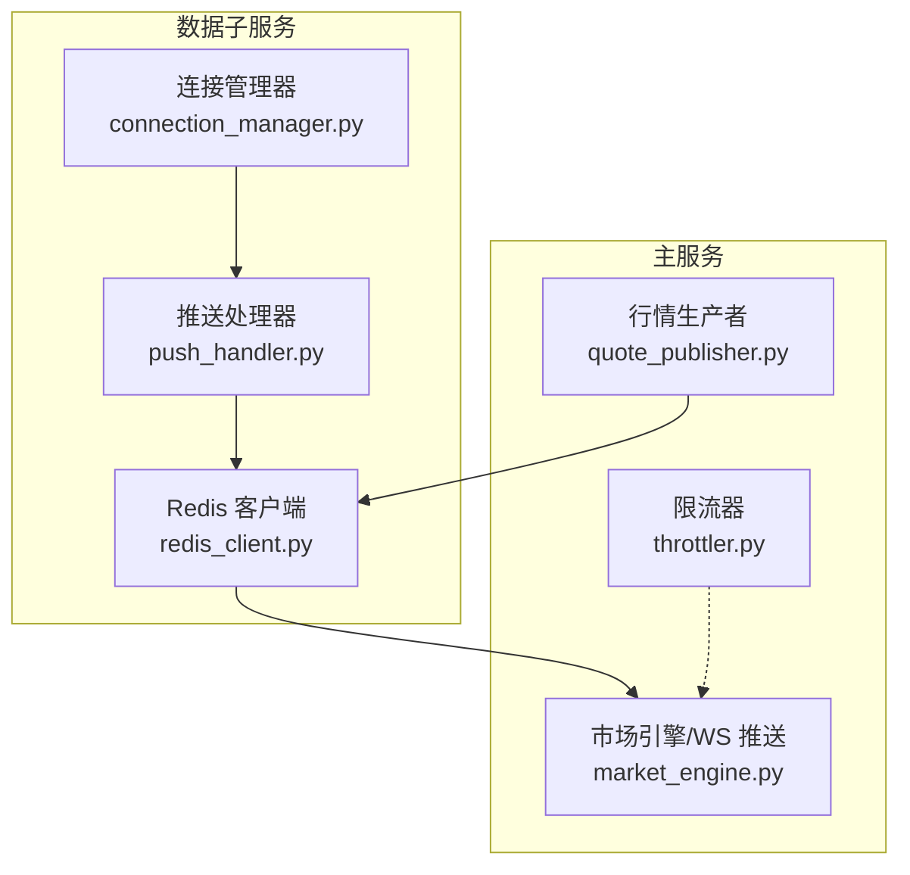
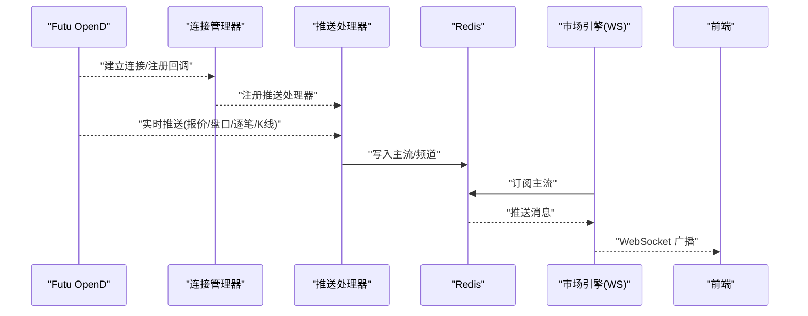
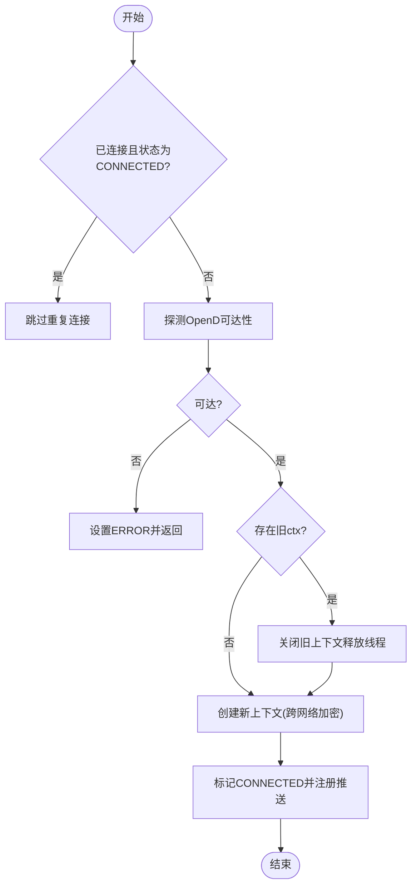
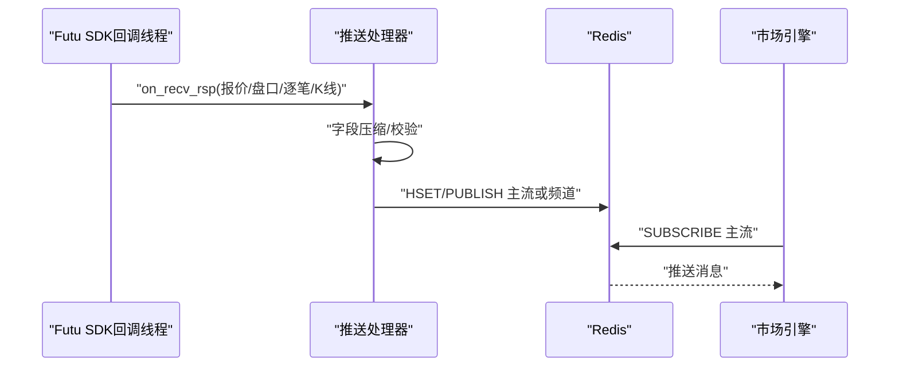
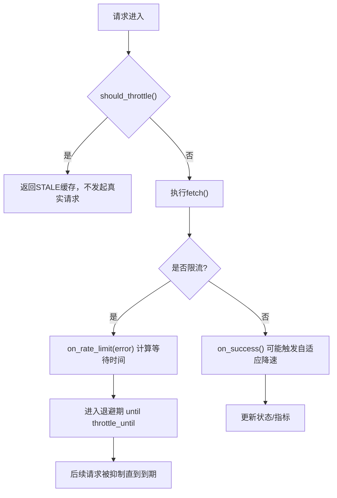
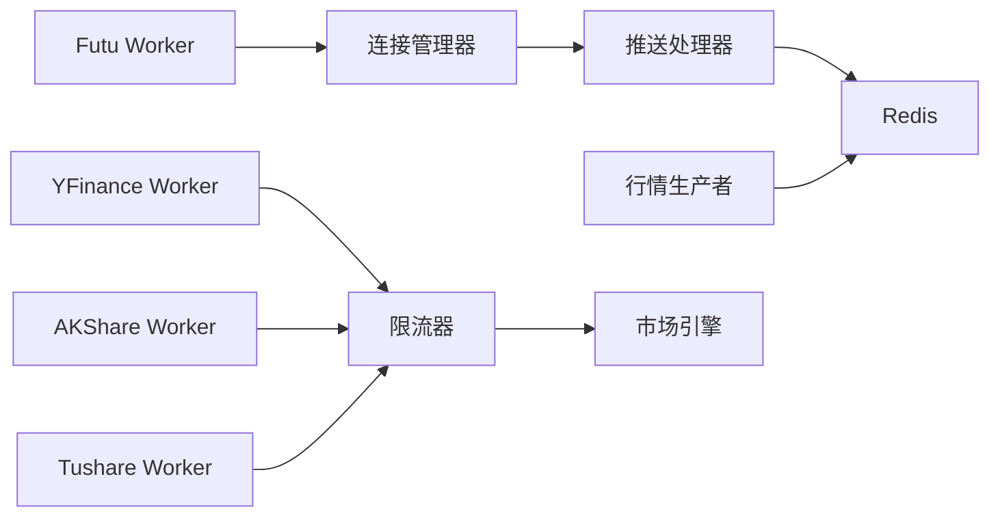

# 实时数据接入

<cite>
**本文引用的文件**
- [connection_manager.py](file://data_subservice/futu_src/connection_manager.py)
- [push_handler.py](file://data_subservice/futu_src/push_handler.py)
- [throttler.py](file://backend/services/datasource/throttler.py)
- [quote_publisher.py](file://backend/workers/collectors/quote_publisher.py)
- [futu_worker.py](file://data_subservice/futu_worker.py)
- [yfinance_worker.py](file://data_subservice/yfinance_worker.py)
- [akshare_worker.py](file://data_subservice/akshare_worker.py)
- [tushare_worker.py](file://data_subservice/tushare_worker.py)
- [market_engine.py](file://backend/services/market_engine.py)
- [redis_client.py](file://data_subservice/_internal/redis_client.py)
</cite>

## 目录
1. [简介](#简介)
2. [项目结构](#项目结构)
3. [核心组件](#核心组件)
4. [架构总览](#架构总览)
5. [详细组件分析](#详细组件分析)
6. [依赖关系分析](#依赖关系分析)
7. [性能考量](#性能考量)
8. [故障排查指南](#故障排查指南)
9. [结论](#结论)
10. [附录](#附录)

## 简介
本文件面向 Quant Agent 的实时数据接入系统，聚焦以下目标：
- WebSocket 连接管理机制：连接池、心跳检测、断线重连策略
- 数据推送流程：行情订阅、Level 2 盘口、资金流向等实时推送
- 数据采集 Worker：Futu OpenD 集成、YFinance 实时数据、Tushare/AKShare 采集
- 限流控制机制：API 配额管理、并发控制、速率限制
- 示例与最佳实践：实现实时订阅、处理消息、自定义采集器
- 错误处理策略：网络异常、数据格式错误、服务不可用

## 项目结构
实时数据接入由“子服务（data_subservice）+ 主服务（backend）”协同完成：
- data_subservice：负责与外部数据源建立长连接（如 Futu OpenD），将实时数据写入 Redis Pub/Sub，供主服务消费
- backend：提供业务编排、WebSocket 推送、采集器注册与调度、限流与熔断等能力

**图示来源**
- [connection_manager.py:44-198](file://data_subservice/futu_src/connection_manager.py#L44-L198)
- [push_handler.py:58-98](file://data_subservice/futu_src/push_handler.py#L58-L98)
- [redis_client.py](file://data_subservice/_internal/redis_client.py)
- [market_engine.py](file://backend/services/market_engine.py)
- [quote_publisher.py:65-77](file://backend/workers/collectors/quote_publisher.py#L65-L77)
- [throttler.py:124-198](file://backend/services/datasource/throttler.py#L124-L198)

**章节来源**
- [connection_manager.py:44-198](file://data_subservice/futu_src/connection_manager.py#L44-L198)
- [push_handler.py:58-98](file://data_subservice/futu_src/push_handler.py#L58-L98)
- [quote_publisher.py:65-77](file://backend/workers/collectors/quote_publisher.py#L65-L77)
- [throttler.py:124-198](file://backend/services/datasource/throttler.py#L124-L198)

## 核心组件
- 连接管理器（ConnectionManager）：管理 Futu OpenD 行情/交易上下文、连接状态、推送回调注册、运行时切换目标
- 推送处理器（PushHandler）：将 Futu 实时推送桥接到 Redis Pub/Sub，统一序列化 Protobuf 并分发到主流或频道
- 行情生产者（QuotePublisher）：轮询标的报价与 Level 2 盘口，编码后发布到 Redis 主流
- 限流器（RateLimitThrottler）：按策略退避，抑制请求，统计指标并告警
- Worker 编排：Futu/YFinance/AKShare/Tushare 等采集 Worker 在子服务中常驻运行

**章节来源**
- [connection_manager.py:44-198](file://data_subservice/futu_src/connection_manager.py#L44-L198)
- [push_handler.py:140-432](file://data_subservice/futu_src/push_handler.py#L140-L432)
- [quote_publisher.py:65-77](file://backend/workers/collectors/quote_publisher.py#L65-L77)
- [throttler.py:124-198](file://backend/services/datasource/throttler.py#L124-L198)

## 架构总览
整体数据流：
- Futu OpenD 通过 TCP 推送触发 SDK 回调 → PushHandler 转换并写入 Redis → 主服务 market_engine 订阅主流 → 前端 WebSocket 消费
- 行情生产者周期性拉取报价与盘口 → 写入 Redis → 同上路径
- 其他数据源（YFinance/AKShare/Tushare）以 Worker 形式采集，经限流器保护后入库或入队

**图示来源**
- [connection_manager.py:154-198](file://data_subservice/futu_src/connection_manager.py#L154-L198)
- [push_handler.py:58-98](file://data_subservice/futu_src/push_handler.py#L58-L98)
- [push_handler.py:140-432](file://data_subservice/futu_src/push_handler.py#L140-L432)

## 详细组件分析

### 连接管理器（Futu OpenD 连接池与重连）
- 连接生命周期：connect/close/switch_host；线程安全锁防止并发建连
- 健康探测：快速探测 OpenD 可达性，避免 SDK 内部重试风暴
- 线程泄漏防护：重建前关闭旧上下文，强制 daemon 线程，避免回调线程累积
- 跨网络加密：根据 host 判断是否启用 is_encrypt，配合 RSA 私钥配置
- 推送模式：连接成功后注册所有推送处理器，支持开关 FUTU_PUSH_ENABLED

**图示来源**
- [connection_manager.py:79-198](file://data_subservice/futu_src/connection_manager.py#L79-L198)

**章节来源**
- [connection_manager.py:44-198](file://data_subservice/futu_src/connection_manager.py#L44-L198)

### 推送处理器（行情/盘口/逐笔/K线/经纪商队列）
- 报价推送：压缩字段、Protobuf 序列化，写入 quant:quotes:latest 并发布到 quant:quotes:stream
- 盘口深度：读取最新报价，合并 bids/asks 后重新发布到主流，保证前端 Level 2 渲染一致性
- 逐笔成交：按 ticker 分频道发布
- K线推送：同时发布历史频道与统一量化频道
- 事件循环桥接：从 SDK 同步回调线程安全调度协程到主事件循环

**图示来源**
- [push_handler.py:58-98](file://data_subservice/futu_src/push_handler.py#L58-L98)
- [push_handler.py:140-432](file://data_subservice/futu_src/push_handler.py#L140-L432)

**章节来源**
- [push_handler.py:58-98](file://data_subservice/futu_src/push_handler.py#L58-L98)
- [push_handler.py:140-432](file://data_subservice/futu_src/push_handler.py#L140-L432)

### 行情生产者（轮询 + 发布）
- 标的池来源：环境变量、watchlist 文件、默认池，去重保序
- 守护进程：周期性轮询报价与 Level 2 盘口，编码后发布到 Redis 主流
- 与前端订阅联动：结合动态订阅表，确保推送范围与前端一致

**章节来源**
- [quote_publisher.py:32-77](file://backend/workers/collectors/quote_publisher.py#L32-L77)

### 数据采集 Worker（Futu/YFinance/AKShare/Tushare）
- Futu Worker：基于连接管理器与推送处理器，启动子服务进程，维持与 OpenD 的长连接与推送
- YFinance Worker：拉取实时/历史数据，受限流器保护
- AKShare/Tushare Worker：定时或按需采集，遵循限流与错误重试策略

**章节来源**
- [futu_worker.py](file://data_subservice/futu_worker.py)
- [yfinance_worker.py](file://data_subservice/yfinance_worker.py)
- [akshare_worker.py](file://data_subservice/akshare_worker.py)
- [tushare_worker.py](file://data_subservice/tushare_worker.py)

### 限流控制机制（配额、并发、速率）
- 退避策略：none/linear/exponential/adaptive，支持服务端 Retry-After 优先
- 硬失败隔离：IP封禁/配额耗尽采用固定窗口抑制，不污染连续限流计数
- 自适应恢复：连续成功达到阈值逐步降低间隔，直至归零恢复
- 可观测性：Prometheus 指标记录限流次数、剩余时间、估计/有效 RPM

**图示来源**
- [throttler.py:205-298](file://backend/services/datasource/throttler.py#L205-L298)
- [throttler.py:314-397](file://backend/services/datasource/throttler.py#L314-L397)
- [throttler.py:402-451](file://backend/services/datasource/throttler.py#L402-L451)

**章节来源**
- [throttler.py:124-198](file://backend/services/datasource/throttler.py#L124-L198)
- [throttler.py:205-298](file://backend/services/datasource/throttler.py#L205-L298)
- [throttler.py:314-397](file://backend/services/datasource/throttler.py#L314-L397)
- [throttler.py:402-451](file://backend/services/datasource/throttler.py#L402-L451)

## 依赖关系分析
- connection_manager 依赖 futu SDK 与 Redis（通过 push_handler）
- push_handler 依赖 Redis 客户端与 Protobuf 模型
- quote_publisher 依赖 Redis 与上游数据源接口
- throttler 依赖 Prometheus 指标模块（可选）与日志
- worker 编排依赖各自数据源库与限流器

**图示来源**
- [connection_manager.py:44-198](file://data_subservice/futu_src/connection_manager.py#L44-L198)
- [push_handler.py:58-98](file://data_subservice/futu_src/push_handler.py#L58-L98)
- [quote_publisher.py:65-77](file://backend/workers/collectors/quote_publisher.py#L65-L77)
- [throttler.py:124-198](file://backend/services/datasource/throttler.py#L124-L198)

**章节来源**
- [connection_manager.py:44-198](file://data_subservice/futu_src/connection_manager.py#L44-L198)
- [push_handler.py:58-98](file://data_subservice/futu_src/push_handler.py#L58-L98)
- [quote_publisher.py:65-77](file://backend/workers/collectors/quote_publisher.py#L65-L77)
- [throttler.py:124-198](file://backend/services/datasource/throttler.py#L124-L198)

## 性能考量
- 连接复用与线程安全：避免重复建连导致回调线程泄漏
- 推送批量化与压缩：减少 Redis 写入与网络开销
- 自适应限流：在高负载下自动降速，保护上游与服务稳定性
- 事件循环桥接：避免阻塞 SDK 回调线程，提升吞吐
- 监控与指标：通过 Prometheus 观察限流、延迟、RPM 等关键指标

[本节为通用指导，无需特定文件引用]

## 故障排查指南
- 连接失败/不可达：检查 OpenD 可达性与端口配置；查看连接管理器状态与错误信息
- 推送未生效：确认推送模式开关、事件循环设置、Redis 通道订阅是否正常
- 盘口空白：验证行情生产者守护进程是否启动、标的池配置是否正确
- 限流频繁：检查限流器状态、错误类别、Retry-After；调整退避策略参数
- Worker 异常：查看各 Worker 日志，确认依赖库安装与环境变量配置

**章节来源**
- [connection_manager.py:79-198](file://data_subservice/futu_src/connection_manager.py#L79-L198)
- [push_handler.py:140-432](file://data_subservice/futu_src/push_handler.py#L140-L432)
- [quote_publisher.py:65-77](file://backend/workers/collectors/quote_publisher.py#L65-L77)
- [throttler.py:205-298](file://backend/services/datasource/throttler.py#L205-L298)

## 结论
本系统通过连接管理器与推送处理器实现了高可靠、低延迟的实时数据接入；行情生产者补齐了轮询场景；限流器保障了对上游的稳定访问。建议在生产环境开启监控与告警，合理配置限流策略与推送标的池，持续优化性能与稳定性。

[本节为总结，无需特定文件引用]

## 附录

### 示例：实现实时数据订阅与处理
- 订阅 Futu 实时报价与盘口：
  - 使用连接管理器建立连接并注册推送处理器
  - 通过 Redis 主流订阅 quant:quotes:stream，解析 Protobuf 消息
- 处理 WebSocket 消息：
  - 在主服务 market_engine 中订阅 Redis 主流，转发至前端 WebSocket
- 自定义采集器：
  - 参考现有 Worker 结构，封装数据源调用与限流逻辑
  - 将结果写入 Redis 或数据库，供上层消费

**章节来源**
- [connection_manager.py:154-198](file://data_subservice/futu_src/connection_manager.py#L154-L198)
- [push_handler.py:58-98](file://data_subservice/futu_src/push_handler.py#L58-L98)
- [market_engine.py](file://backend/services/market_engine.py)
- [throttler.py:205-298](file://backend/services/datasource/throttler.py#L205-L298)
