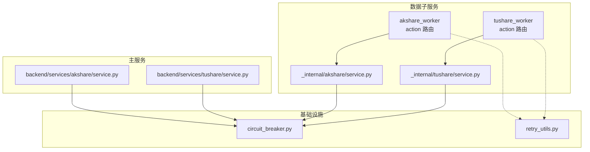
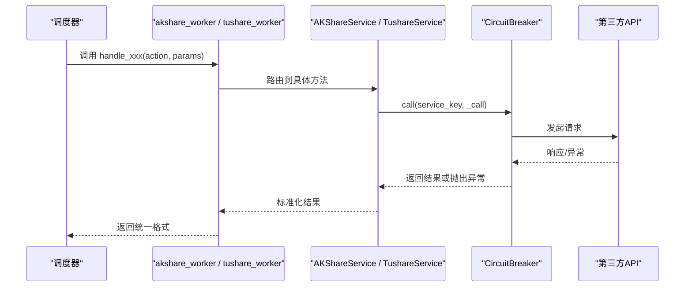
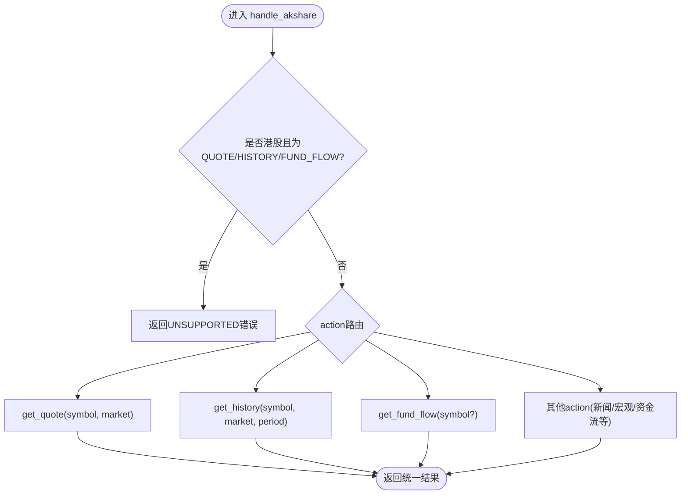
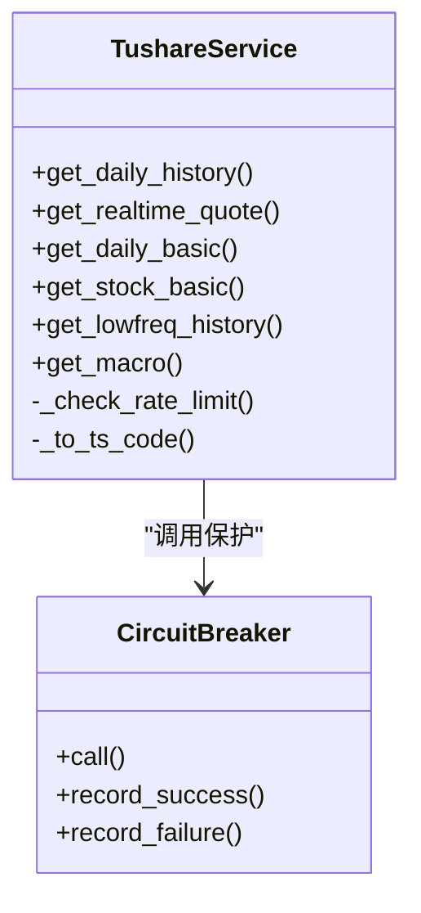
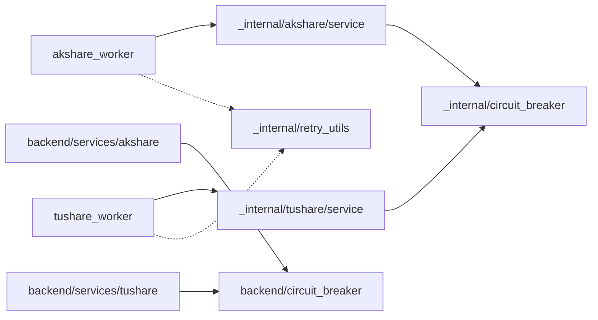

# AKShare/Tushare数据Worker

<cite>
**本文引用的文件**
- [data_subservice/akshare_worker.py](file://data_subservice/akshare_worker.py)
- [data_subservice/tushare_worker.py](file://data_subservice/tushare_worker.py)
- [data_subservice/_internal/akshare/service.py](file://data_subservice/_internal/akshare/service.py)
- [data_subservice/_internal/tushare/service.py](file://data_subservice/_internal/tushare/service.py)
- [backend/services/akshare/service.py](file://backend/services/akshare/service.py)
- [backend/services/tushare/service.py](file://backend/services/tushare/service.py)
- [backend/core/circuit_breaker.py](file://backend/core/circuit_breaker.py)
- [data_subservice/_internal/circuit_breaker.py](file://data_subservice/_internal/circuit_breaker.py)
- [backend/core/retry_utils.py](file://backend/core/retry_utils.py)
- [data_subservice/_internal/retry_utils.py](file://data_subservice/_internal/retry_utils.py)
</cite>

## 目录
1. [简介](#简介)
2. [项目结构](#项目结构)
3. [核心组件](#核心组件)
4. [架构总览](#架构总览)
5. [详细组件分析](#详细组件分析)
6. [依赖关系分析](#依赖关系分析)
7. [性能与限流](#性能与限流)
8. [故障排查指南](#故障排查指南)
9. [结论](#结论)
10. [附录](#附录)

## 简介
本文件面向 Quant Agent 的 AKShare 与 Tushare 数据 Worker，聚焦 A股、港股、美股的统一采集接口实现与适配层设计。文档说明：
- 统一入口：通过 data_subservice 下的 akshare_worker 与 tushare_worker 暴露 action-based 接口，屏蔽底层数据源差异。
- 适配层：AKShareService 与 TushareService 分别封装各自数据源能力，完成字段映射、错误分类、熔断与重试。
- 调度与更新：结合定时任务（外部调度器）与增量/批量策略，支撑历史数据回填与实时增量更新。
- 质量与可观测性：内置数据质量校验点、监控指标与日志记录方案，便于问题定位与容量规划。

## 项目结构
- data_subservice 提供物理解耦的数据源子服务，包含 akshare_worker、tushare_worker 及 _internal 实现的轻量服务。
- backend 提供主服务侧的 AKShare/Tushare 服务封装、熔断器、重试工具等基础设施。
- 子服务通过统一的 action 路由分发到具体数据源方法；主服务通过缓存、熔断与降级兜底提升稳定性。

图表来源
- [data_subservice/akshare_worker.py:1-69](file://data_subservice/akshare_worker.py#L1-L69)
- [data_subservice/tushare_worker.py:1-69](file://data_subservice/tushare_worker.py#L1-L69)
- [data_subservice/_internal/akshare/service.py:1-256](file://data_subservice/_internal/akshare/service.py#L1-L256)
- [data_subservice/_internal/tushare/service.py:1-322](file://data_subservice/_internal/tushare/service.py#L1-L322)
- [backend/services/akshare/service.py:1-114](file://backend/services/akshare/service.py#L1-L114)
- [backend/services/tushare/service.py:1-586](file://backend/services/tushare/service.py#L1-L586)
- [backend/core/circuit_breaker.py:1-379](file://backend/core/circuit_breaker.py#L1-L379)
- [backend/core/retry_utils.py:1-58](file://backend/core/retry_utils.py#L1-L58)

章节来源
- [data_subservice/akshare_worker.py:1-69](file://data_subservice/akshare_worker.py#L1-L69)
- [data_subservice/tushare_worker.py:1-69](file://data_subservice/tushare_worker.py#L1-L69)

## 核心组件
- AKShare Worker：统一处理 QUOTE/HISTORY/FUND_FLOW/SOUTHBOUND/HSGT_HOLDERS/NEWS/MARGIN_A_SHARE/SECTOR_FLOW_* 等 action，并针对港股进行明确不支持的快速失败，引导上层走其他数据源。
- Tushare Worker：统一处理 FINANCIALS/HOLDER/MONEYFLOW/STOCK_HISTORY/STOCK_QUOTE/FUNDAMENTAL/STOCK_LIST/LOWFREQ_HISTORY/MACRO 等 action，补齐审计发现的能力缺口。
- AKShareService（子服务）：封装 A股/港股/美股行情、资金流向、宏观日历、新闻等能力，使用熔断器保护下游调用。
- TushareService（子服务）：封装 A股日线/低频行情、基本面、资金流、宏观数据等能力，具备令牌桶限速与降级策略。
- 熔断器与重试：主服务与子服务均提供熔断器实现；全局重试装饰器用于网络异常与限流的指数退避重试。

章节来源
- [data_subservice/_internal/akshare/service.py:1-256](file://data_subservice/_internal/akshare/service.py#L1-L256)
- [data_subservice/_internal/tushare/service.py:1-322](file://data_subservice/_internal/tushare/service.py#L1-L322)
- [backend/core/circuit_breaker.py:1-379](file://backend/core/circuit_breaker.py#L1-L379)
- [backend/core/retry_utils.py:1-58](file://backend/core/retry_utils.py#L1-L58)

## 架构总览
统一采集流程：
- 外部调度器触发 worker 进程，传入 action 与参数。
- worker 将请求路由至对应 Service 方法。
- Service 通过熔断器执行底层 API 调用，捕获异常并记录成功/失败。
- 返回标准化结果（含 source、data、error、category 等），供上层消费或写入数据湖。

图表来源
- [data_subservice/akshare_worker.py:1-69](file://data_subservice/akshare_worker.py#L1-L69)
- [data_subservice/tushare_worker.py:1-69](file://data_subservice/tushare_worker.py#L1-L69)
- [data_subservice/_internal/akshare/service.py:1-256](file://data_subservice/_internal/akshare/service.py#L1-L256)
- [data_subservice/_internal/tushare/service.py:1-322](file://data_subservice/_internal/tushare/service.py#L1-L322)
- [backend/core/circuit_breaker.py:1-379](file://backend/core/circuit_breaker.py#L1-L379)

## 详细组件分析

### AKShare Worker 与适配层
- 统一入口：handle_akshare 根据 action 分发到 get_quote/get_history/get_fund_flow 等方法。
- 市场识别与快速失败：对港股 QUOTE/HISTORY/FUND_FLOW 直接返回 UNSUPPORTED，避免空数据被误判为成功。
- 熔断与降级：所有调用经 circuit_breaker.call 包裹，失败时记录失败并返回结构化错误。
- 数据格式转换：历史数据以 DataFrame 转 records 返回；资金流、南向/北向、行业资金流等按领域模型组织。

图表来源
- [data_subservice/akshare_worker.py:1-69](file://data_subservice/akshare_worker.py#L1-L69)
- [data_subservice/_internal/akshare/service.py:1-256](file://data_subservice/_internal/akshare/service.py#L1-L256)

章节来源
- [data_subservice/akshare_worker.py:1-69](file://data_subservice/akshare_worker.py#L1-L69)
- [data_subservice/_internal/akshare/service.py:1-256](file://data_subservice/_internal/akshare/service.py#L1-L256)

### Tushare Worker 与适配层
- 统一入口：handle_tushare 支持财务、股东人数、资金流、历史行情、实时行情、基本面、股票列表、低频历史、宏观等 action。
- 令牌桶限速：按接口分组（默认 200次/分，财务类 80次/分）限制调用频率，避免触发上游 429。
- 降级策略：实时行情不可用时回退到 daily 最新快照；无权限时返回空数据而非假数。
- 数据格式转换：将 DataFrame 转为标准 OHLCV 或指标记录，确保上层一致消费。

图表来源
- [data_subservice/_internal/tushare/service.py:1-322](file://data_subservice/_internal/tushare/service.py#L1-L322)
- [backend/core/circuit_breaker.py:1-379](file://backend/core/circuit_breaker.py#L1-L379)

章节来源
- [data_subservice/tushare_worker.py:1-69](file://data_subservice/tushare_worker.py#L1-L69)
- [data_subservice/_internal/tushare/service.py:1-322](file://data_subservice/_internal/tushare/service.py#L1-L322)

### 主服务侧 AKShare/Tushare 服务
- AKShare 主服务：负责 Redis 缓存、熔断状态维护与降级兜底；支持 direct/cache 模式，cache 模式下仅读北京 VPS 中继写入的缓存。
- Tushare 主服务：A股主源，封装 pro_bar/daily/rt_k/daily_basic/moneyflow_hsgt 等接口，具备健康探测与 token 管理。

章节来源
- [backend/services/akshare/service.py:1-114](file://backend/services/akshare/service.py#L1-L114)
- [backend/services/tushare/service.py:1-586](file://backend/services/tushare/service.py#L1-L586)

## 依赖关系分析
- Worker 与服务解耦：worker 仅做 action 路由，业务逻辑下沉至 _internal Service，降低耦合度。
- 熔断器复用：子服务与主服务共享相同的状态机语义（closed/open/half_open），但子服务使用 no-op 指标桩，避免上报主集群。
- 重试机制：全局重试装饰器在子服务中独立实现，保证零 backend 依赖。

图表来源
- [data_subservice/_internal/akshare/service.py:1-256](file://data_subservice/_internal/akshare/service.py#L1-L256)
- [data_subservice/_internal/tushare/service.py:1-322](file://data_subservice/_internal/tushare/service.py#L1-L322)
- [data_subservice/_internal/circuit_breaker.py:1-296](file://data_subservice/_internal/circuit_breaker.py#L1-L296)
- [backend/services/akshare/service.py:1-114](file://backend/services/akshare/service.py#L1-L114)
- [backend/services/tushare/service.py:1-586](file://backend/services/tushare/service.py#L1-L586)
- [backend/core/circuit_breaker.py:1-379](file://backend/core/circuit_breaker.py#L1-L379)
- [data_subservice/_internal/retry_utils.py:1-66](file://data_subservice/_internal/retry_utils.py#L1-L66)

章节来源
- [data_subservice/_internal/circuit_breaker.py:1-296](file://data_subservice/_internal/circuit_breaker.py#L1-L296)
- [backend/core/circuit_breaker.py:1-379](file://backend/core/circuit_breaker.py#L1-L379)

## 性能与限流
- 令牌桶限速（Tushare）：按接口分组限制每分钟调用次数，财务类接口单独限速，避免 429。
- 熔断器保护：连续失败达到阈值后进入 OPEN 状态，冷却时间后可半开探测恢复。
- 重试策略：网络异常与限流错误采用指数退避+随机抖动，最多重试 3 次。
- 降级与兜底：实时行情不可用回退到日频快照；AKShare 港股不支持时快速失败，避免无效调用。

章节来源
- [backend/services/tushare/service.py:1-586](file://backend/services/tushare/service.py#L1-L586)
- [backend/core/retry_utils.py:1-58](file://backend/core/retry_utils.py#L1-L58)
- [data_subservice/_internal/retry_utils.py:1-66](file://data_subservice/_internal/retry_utils.py#L1-L66)

## 故障排查指南
- 常见错误分类：
  - 限流/封禁：429/403/Too Many Requests/Forbidden，触发重试与熔断计数跳过。
  - 网络异常：超时、连接失败，触发重试。
  - 不支持市场：港股在 AKShare/Tushare 某些 action 下返回 UNSUPPORTED，应切换数据源。
- 排查步骤：
  - 检查 worker 日志中的 action 与错误信息。
  - 查看熔断器状态快照，确认是否处于 open/half_open。
  - 核对环境变量配置（如 TUSHARE_TOKEN、AKSHARE_MODE）。
  - 验证上游接口可用性（代理、IP 白名单、积分权限）。

章节来源
- [backend/core/retry_utils.py:1-58](file://backend/core/retry_utils.py#L1-L58)
- [backend/core/circuit_breaker.py:1-379](file://backend/core/circuit_breaker.py#L1-L379)
- [data_subservice/_internal/circuit_breaker.py:1-296](file://data_subservice/_internal/circuit_breaker.py#L1-L296)

## 结论
- 通过 worker 的 action 路由与 _internal Service 的适配层，实现了 A股/港股/美股的统一采集入口。
- 熔断器与重试机制保障了高可用与容错能力；令牌桶限速避免了上游限流。
- 主服务侧的缓存与降级策略进一步提升了稳定性与性能。
- 建议在生产环境启用监控指标与日志聚合，配合定时任务实现历史回填与实时增量更新。

## 附录

### 统一采集接口示例（action-based）
- AKShare：
  - QUOTE：获取 A/港/美 行情快照。
  - HISTORY：获取历史 K 线（支持 period）。
  - FUND_FLOW：个股或全市场资金流。
  - SOUTHBOUND/HSGT_HOLDERS/NEWS/MARGIN_A_SHARE/SECTOR_FLOW_*：资金与新闻相关能力。
- Tushare：
  - STOCK_HISTORY/STOCK_QUOTE：A股历史与实时快照。
  - FUNDAMENTAL：daily_basic 或财务三大报表。
  - STOCK_LIST/LOWFREQ_HISTORY/MACRO：基础数据、低频行情、宏观指标。

章节来源
- [data_subservice/akshare_worker.py:1-69](file://data_subservice/akshare_worker.py#L1-L69)
- [data_subservice/tushare_worker.py:1-69](file://data_subservice/tushare_worker.py#L1-L69)

### 定时任务与增量更新策略
- 历史数据批量回填：
  - 按标的与周期（日/周/月）分批拉取，控制并发与限速。
  - 使用 Tushare 低频接口（weekly/monthly）与 AKShare 历史接口组合覆盖不同市场。
- 实时增量更新：
  - 交易时段内周期性调用 QUOTE/HISTORY 增量拉取，落库前进行去重与排序。
  - 非交易时段停止高频调用，减少资源消耗。
- 调度建议：
  - 使用系统级 cron 或任务队列（如 Celery/RQ）编排任务。
  - 结合熔断器状态与重试策略，失败任务自动重试与告警。

[本节为概念性内容，不直接引用具体代码文件]

### 数据质量校验与优化建议
- 数据完整性：检查必填字段（日期、OHLC、成交量）是否存在与合理范围。
- 一致性校验：对比多源数据（如 AKShare vs Tushare）关键指标差异。
- 性能优化：
  - 合并请求：批量拉取同标的多周期数据。
  - 缓存命中：主服务 cache 模式优先读取 Redis 缓存。
  - 降采样：非关键路径使用低频数据替代高频数据。

[本节为概念性内容，不直接引用具体代码文件]

### 监控指标与日志记录方案
- 指标：
  - 熔断器状态与转换（closed/open/half_open）。
  - 各 action 成功率、延迟分布、重试次数。
  - 上游限流与封禁事件计数。
- 日志：
  - 统一记录 action、symbol、market、耗时、错误类别。
  - 关键路径打点（熔断触发、降级、重试）。
- 可视化：
  - 接入 Prometheus/Grafana 展示面板，设置告警规则。

[本节为概念性内容，不直接引用具体代码文件]