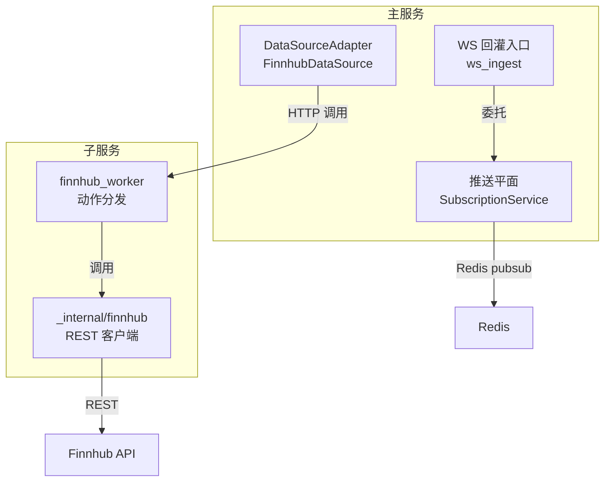
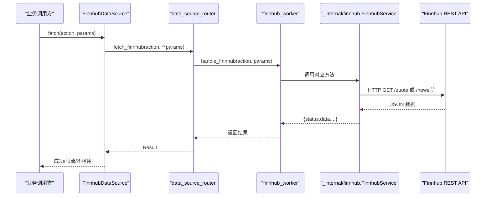
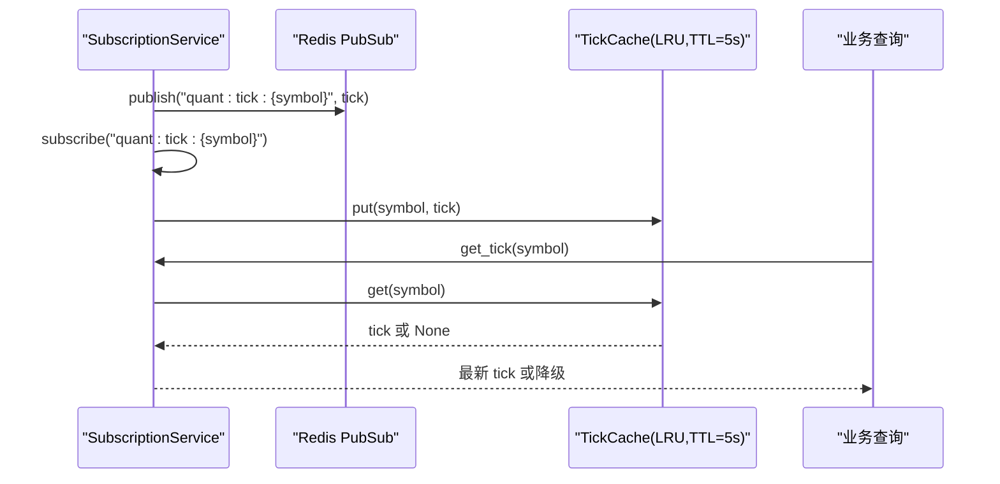
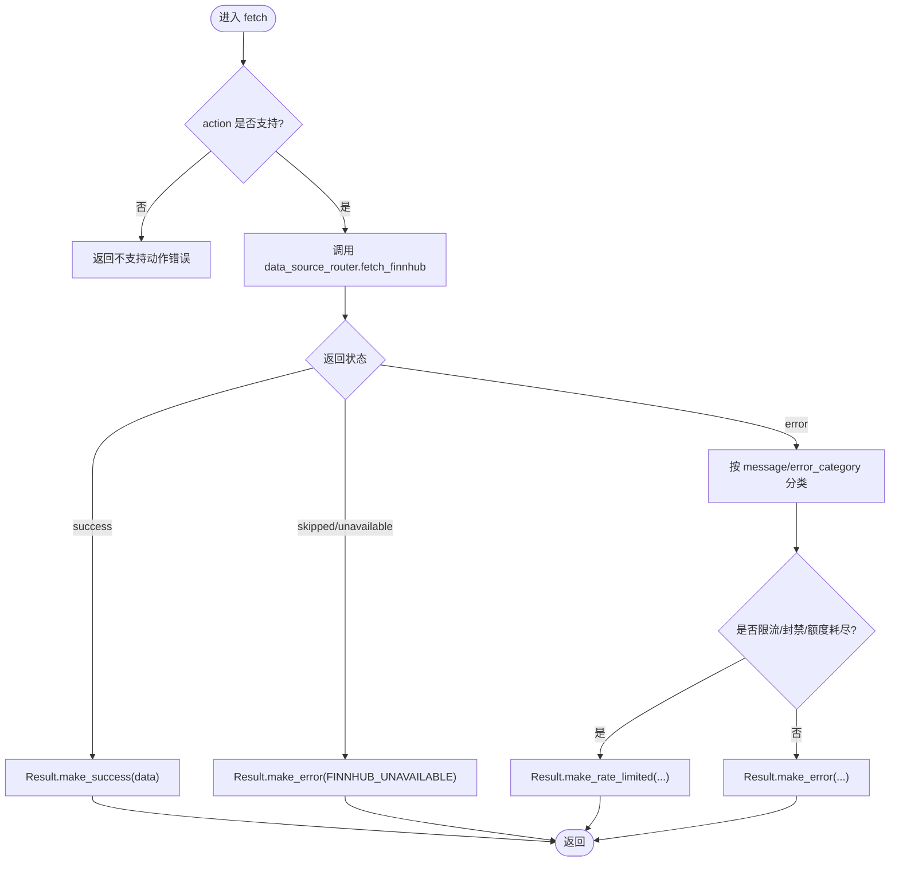
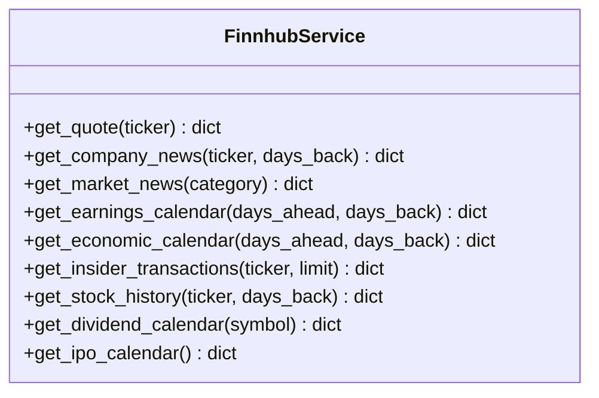
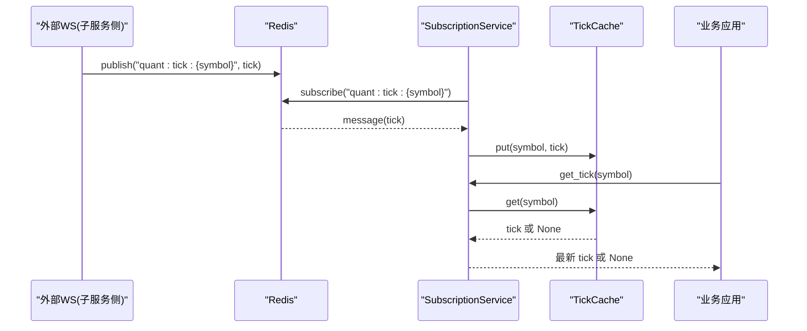
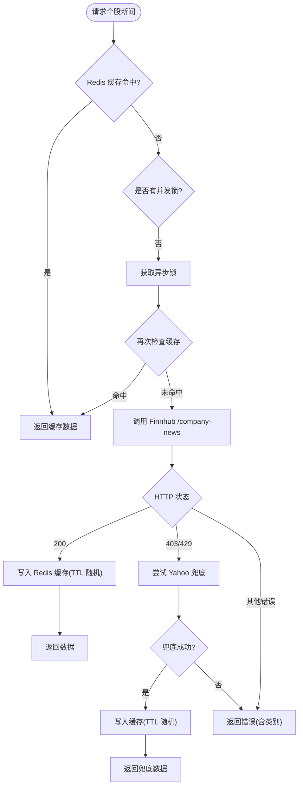
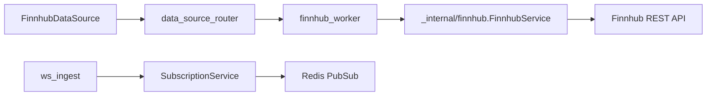

# Finnhub数据Worker

<cite>
**本文引用的文件**
- [backend/services/finnhub/service.py](file://backend/services/finnhub/service.py)
- [data_subservice/_internal/finnhub/__init__.py](file://data_subservice/_internal/finnhub/__init__.py)
- [data_subservice/finnhub_worker.py](file://data_subservice/finnhub_worker.py)
- [backend/services/datasource/adapters/finnhub.py](file://backend/services/datasource/adapters/finnhub.py)
- [backend/services/datasource/subscription.py](file://backend/services/datasource/subscription.py)
- [backend/services/finnhub/ws_ingest.py](file://backend/services/finnhub/ws_ingest.py)
- [backend/workers/collectors/finnhub.py](file://backend/workers/collectors/finnhub.py)
</cite>

## 目录
1. [简介](#简介)
2. [项目结构](#项目结构)
3. [核心组件](#核心组件)
4. [架构总览](#架构总览)
5. [详细组件分析](#详细组件分析)
6. [依赖关系分析](#依赖关系分析)
7. [性能与限流](#性能与限流)
8. [故障排查指南](#故障排查指南)
9. [结论](#结论)
10. [附录：使用示例](#附录使用示例)

## 简介
本文件为 Quant Agent 的 Finnhub 数据 Worker 提供完整技术文档，覆盖 REST 数据接入（新闻、市场、搜索等）、WebSocket 实时推送机制、认证与限流策略（含重试与错误码处理）、数据去重与缓存策略，以及典型调用示例。Finnhub 数据在系统中采用“主服务 + 子服务”的物理隔离架构：REST 能力下沉至 data_subservice 的 Finnhub 实现，主服务通过 DataSourceRouter 远程调用；实时 tick 由子服务经 Redis pubsub 推送，主服务订阅并写入进程内 LRU 缓存供快速读取。

## 项目结构
- 子服务叶子节点：data_subservice/finnhub_worker.py 负责动作分发，将 action 映射到 _internal/finnhub 的具体方法。
- 子服务底层实现：data_subservice/_internal/finnhub/__init__.py 提供 FinnhubService 的 REST 客户端，统一封装 token、symbol 归一化、错误分类。
- 主服务适配器：backend/services/datasource/adapters/finnhub.py 将 Finnhub 适配为 DataSourceInterface，统一结果语义与限流类别。
- 主服务历史实现（兼容）：backend/services/finnhub/service.py 保留富缓存与降级逻辑（如 Yahoo 兜底），用于历史或特定场景。
- 实时推送平面：backend/services/datasource/subscription.py 提供 TickCache、SubscriptionService，统一 Redis pubsub 回灌与进程内缓存。
- WS 回灌入口：backend/services/finnhub/ws_ingest.py 作为向后兼容薄代理，委托给 subscription_service。
- 守护进程工厂：backend/workers/collectors/finnhub.py 仅在 master 节点启动全局 market daemon。

图表来源
- [backend/services/datasource/adapters/finnhub.py:95-156](file://backend/services/datasource/adapters/finnhub.py#L95-L156)
- [data_subservice/finnhub_worker.py:14-46](file://data_subservice/finnhub_worker.py#L14-L46)
- [data_subservice/_internal/finnhub/__init__.py:50-148](file://data_subservice/_internal/finnhub/__init__.py#L50-L148)
- [backend/services/datasource/subscription.py:257-422](file://backend/services/datasource/subscription.py#L257-L422)
- [backend/services/finnhub/ws_ingest.py:58-75](file://backend/services/finnhub/ws_ingest.py#L58-L75)

章节来源
- [data_subservice/finnhub_worker.py:1-51](file://data_subservice/finnhub_worker.py#L1-L51)
- [data_subservice/_internal/finnhub/__init__.py:1-149](file://data_subservice/_internal/finnhub/__init__.py#L1-L149)
- [backend/services/datasource/adapters/finnhub.py:1-170](file://backend/services/datasource/adapters/finnhub.py#L1-L170)
- [backend/services/datasource/subscription.py:1-422](file://backend/services/datasource/subscription.py#L1-L422)
- [backend/services/finnhub/ws_ingest.py:1-75](file://backend/services/finnhub/ws_ingest.py#L1-L75)
- [backend/workers/collectors/finnhub.py:1-20](file://backend/workers/collectors/finnhub.py#L1-L20)

## 核心组件
- FinnhubDataSource（主服务适配器）
  - 暴露 capabilities：quote、earnings、company_news、market_news、economic_calendar、insider_trading、stock_history。
  - 所有 fetch 请求经 data_source_router.fetch_finnhub 远程调用子服务，避免主服务直连外部 WS。
  - 对返回结果进行语义化转换，区分 rate_limit、ip_blocked、quota_exhausted 等错误类别。
- FinnhubService（子服务 REST 客户端）
  - 统一 symbol 归一化（美股 US.AAPL→AAPL，港股 HK.00700→HK:0700）。
  - 提供 get_quote、get_company_news、get_market_news、get_earnings_calendar、get_economic_calendar、get_insider_transactions、get_stock_history、get_dividend_calendar、get_ipo_calendar。
  - 对 429/401/403 等状态码进行分类返回，便于上层限流与熔断。
- SubscriptionService（推送平面）
  - 提供 TickCache（LRU+TTL=5s）与 broker/kline 多态缓存。
  - 通过 Redis pubsub 订阅 quant:tick:{symbol}、quant:broker:{symbol}、quant:kline:{symbol}，回灌进程内缓存。
  - 暴露 start_ingest/start_broker_ingest/start_kline_ingest 启动回灌任务，以及 get_tick/get_broker/get_kline 查询接口。
- ws_ingest（向后兼容入口）
  - 将 run_tick_ingest/start_tick_ingest_task 委托给 subscription_service，保持旧代码兼容。
- finnhub_worker（子服务动作分发）
  - 将 FINNHUB 动作（QUOTE、COMPANY_NEWS、MARKET_NEWS、EARNINGS、ECONOMIC_CALENDAR、INSIDER_TRADING、STOCK_HISTORY、DIVIDEND_CALENDAR、IPO_CALENDAR）映射到具体方法。
  - 支持 symbol→ticker 兼容映射，确保下游方法参数正确。

章节来源
- [backend/services/datasource/adapters/finnhub.py:29-170](file://backend/services/datasource/adapters/finnhub.py#L29-L170)
- [data_subservice/_internal/finnhub/__init__.py:24-148](file://data_subservice/_internal/finnhub/__init__.py#L24-L148)
- [backend/services/datasource/subscription.py:43-422](file://backend/services/datasource/subscription.py#L43-L422)
- [backend/services/finnhub/ws_ingest.py:1-75](file://backend/services/finnhub/ws_ingest.py#L1-L75)
- [data_subservice/finnhub_worker.py:14-46](file://data_subservice/finnhub_worker.py#L14-L46)

## 架构总览
系统采用“请求-响应”与“推送-订阅”双平面设计：
- 请求-响应平面：业务经 DataSourceRegistry.fetch → FinnhubDataSource.fetch → data_source_router.fetch_finnhub → data_subservice.finnhub_worker.handle_finnhub → _internal/finnhub.FinnhubService → Finnhub REST API。
- 推送-订阅平面：子服务将外部 WS 数据经 Redis pubsub 发布到 quant:tick:{symbol}；主服务 SubscriptionService 订阅频道，写入进程内 TickCache；业务层通过 get_tick(symbol) 获取最新 tick。

图表来源
- [backend/services/datasource/adapters/finnhub.py:95-156](file://backend/services/datasource/adapters/finnhub.py#L95-L156)
- [data_subservice/finnhub_worker.py:27-46](file://data_subservice/finnhub_worker.py#L27-L46)
- [data_subservice/_internal/finnhub/__init__.py:56-148](file://data_subservice/_internal/finnhub/__init__.py#L56-L148)

图表来源
- [backend/services/datasource/subscription.py:189-216](file://backend/services/datasource/subscription.py#L189-L216)
- [backend/services/datasource/subscription.py:280-296](file://backend/services/datasource/subscription.py#L280-L296)

## 详细组件分析

### FinnhubDataSource（主服务适配器）
- 职责：将 Finnhub 数据源适配为 DataSourceInterface，仅远程模式，不持有本地 SDK。
- 关键行为：
  - 校验 action 是否在 capabilities 中。
  - 通过 data_source_router.fetch_finnhub 调用子服务。
  - 将子服务返回的 status/message/error_category 转换为 Result 语义（success/rate_limited/unavailable/error）。
  - 记录 self_recorded=True，避免重复计数 throttler。

图表来源
- [backend/services/datasource/adapters/finnhub.py:95-156](file://backend/services/datasource/adapters/finnhub.py#L95-L156)

章节来源
- [backend/services/datasource/adapters/finnhub.py:29-170](file://backend/services/datasource/adapters/finnhub.py#L29-L170)

### FinnhubService（子服务 REST 客户端）
- 职责：封装 Finnhub REST API 调用，提供 symbol 归一化、token 注入、错误分类。
- 关键方法：
  - get_quote：拦截免费版全 0 占位，返回 unsupported_market。
  - get_company_news / get_market_news：新闻采集。
  - get_earnings_calendar / get_economic_calendar：财报与经济日历。
  - get_insider_transactions：高管交易。
  - get_stock_history：日线 K 线。
  - get_dividend_calendar / get_ipo_calendar：分红与 IPO 日历。
- 错误分类：
  - 429 → rate_limit
  - 401/403 → ip_blocked
  - 其他 → 普通错误

图表来源
- [data_subservice/_internal/finnhub/__init__.py:50-148](file://data_subservice/_internal/finnhub/__init__.py#L50-L148)

章节来源
- [data_subservice/_internal/finnhub/__init__.py:24-148](file://data_subservice/_internal/finnhub/__init__.py#L24-L148)

### WebSocket 实时推送与订阅
- 子服务负责连接外部 WS 并将 trade/quote 消息发布到 Redis 频道 quant:tick:{symbol}。
- 主服务 SubscriptionService 启动回灌协程，订阅频道并写入进程内 TickCache（TTL=5s）。
- 业务层通过 get_tick(symbol) 获取最新 tick；若 TTL 过期则视为 miss，可降级走 REST 快照。

图表来源
- [backend/services/datasource/subscription.py:189-216](file://backend/services/datasource/subscription.py#L189-L216)
- [backend/services/datasource/subscription.py:280-296](file://backend/services/datasource/subscription.py#L280-L296)
- [backend/services/finnhub/ws_ingest.py:58-75](file://backend/services/finnhub/ws_ingest.py#L58-L75)

章节来源
- [backend/services/datasource/subscription.py:1-422](file://backend/services/datasource/subscription.py#L1-L422)
- [backend/services/finnhub/ws_ingest.py:1-75](file://backend/services/finnhub/ws_ingest.py#L1-L75)

### 历史实现与缓存/降级（兼容路径）
- backend/services/finnhub/service.py 提供较丰富的缓存与降级逻辑：
  - Redis 缓存：财报日历、个股新闻、内幕交易、经济日历、历史 K 线等，设置不同 TTL。
  - 限流退避：通过 rate_limit_registry.get_throttler("finnhub") 上报 429/403/402，并记录成功以自适应恢复。
  - 降级策略：个股新闻在 403/429 时尝试 Yahoo Finance 非官方搜索接口兜底，并缓存结果。
  - 代理池：可选 PROXY_POOL 随机轮换，财报日历支持独立开关控制是否走代理。

图表来源
- [backend/services/finnhub/service.py:358-466](file://backend/services/finnhub/service.py#L358-L466)
- [backend/services/finnhub/service.py:70-148](file://backend/services/finnhub/service.py#L70-L148)
- [backend/services/finnhub/service.py:516-601](file://backend/services/finnhub/service.py#L516-L601)

章节来源
- [backend/services/finnhub/service.py:1-605](file://backend/services/finnhub/service.py#L1-L605)

### 守护进程与节点类型
- backend/workers/collectors/finnhub.py 仅在 NODE_TYPE=master 时启动全局 market daemon；slave 节点仅做数据拉取，不运行守护进程。

章节来源
- [backend/workers/collectors/finnhub.py:1-20](file://backend/workers/collectors/finnhub.py#L1-L20)

## 依赖关系分析
- 主服务适配器依赖 data_source_router 进行远程调用，避免直接耦合子服务。
- 子服务 REST 客户端依赖 httpx 与环境变量 FINNHUB_API_KEY。
- 推送平面依赖 Redis（host/port/password 环境变量）进行 pubsub。
- 历史实现依赖 Redis 缓存与 rate_limit_registry 限流退避引擎。

图表来源
- [backend/services/datasource/adapters/finnhub.py:59-65](file://backend/services/datasource/adapters/finnhub.py#L59-L65)
- [data_subservice/finnhub_worker.py:27-46](file://data_subservice/finnhub_worker.py#L27-L46)
- [data_subservice/_internal/finnhub/__init__.py:56-73](file://data_subservice/_internal/finnhub/__init__.py#L56-L73)
- [backend/services/datasource/subscription.py:180-216](file://backend/services/datasource/subscription.py#L180-L216)
- [backend/services/finnhub/ws_ingest.py:58-75](file://backend/services/finnhub/ws_ingest.py#L58-L75)

章节来源
- [backend/services/datasource/adapters/finnhub.py:1-170](file://backend/services/datasource/adapters/finnhub.py#L1-L170)
- [data_subservice/finnhub_worker.py:1-51](file://data_subservice/finnhub_worker.py#L1-L51)
- [data_subservice/_internal/finnhub/__init__.py:1-149](file://data_subservice/_internal/finnhub/__init__.py#L1-L149)
- [backend/services/datasource/subscription.py:1-422](file://backend/services/datasource/subscription.py#L1-L422)
- [backend/services/finnhub/ws_ingest.py:1-75](file://backend/services/finnhub/ws_ingest.py#L1-L75)

## 性能与限流
- 缓存策略
  - 子服务 REST：各接口根据数据变化频率设置不同 TTL（如财报日历 5 分钟/12 小时、个股新闻 24 小时+抖动、历史 K 线 1 小时、经济日历 12 小时+抖动）。
  - 推送平面：TickCache 使用进程内 LRU，TTL=5s，降低 Redis 压力并提升读取延迟。
- 限流与重试
  - 历史实现通过 rate_limit_registry.get_throttler("finnhub") 上报 429/403/402，并在连续成功后逐步降速恢复。
  - 适配器将错误类别映射为 Result.rate_limited，避免重复计数。
  - 子服务 REST 对 429/401/403 进行分类返回，便于上层统一处理。
- 代理与容错
  - 历史实现支持 PROXY_POOL 随机轮换，财报日历可通过开关决定是否走代理。
  - 个股新闻在 403/429 时尝试 Yahoo Finance 兜底，提高可用性。

章节来源
- [backend/services/finnhub/service.py:26-60](file://backend/services/finnhub/service.py#L26-L60)
- [backend/services/finnhub/service.py:70-148](file://backend/services/finnhub/service.py#L70-L148)
- [backend/services/finnhub/service.py:358-466](file://backend/services/finnhub/service.py#L358-L466)
- [backend/services/datasource/adapters/finnhub.py:132-156](file://backend/services/datasource/adapters/finnhub.py#L132-L156)
- [backend/services/datasource/subscription.py:35-78](file://backend/services/datasource/subscription.py#L35-L78)

## 故障排查指南
- 常见问题定位
  - 429 限流：检查 rate_limit_registry 上报与适配器错误类别；确认缓存命中率与 TTL 设置。
  - 403 权限/IP 封锁：检查 FINNHUB_API_KEY 与网络出口；必要时启用代理或切换数据源。
  - 402 额度耗尽：需升级账户或调整请求频率。
  - 零报价幻觉：get_quote 会拦截免费版全 0 占位，返回 unsupported_market，避免前端显示 $0.00。
- 日志与指标
  - 历史实现使用 httpx 事件钩子记录请求/响应。
  - 推送平面统计命中/降级率，并通过 Prometheus 同步指标。
- 调试步骤
  - 验证 FINNHUB_API_KEY 配置与环境变量。
  - 检查 Redis 连接与频道订阅状态。
  - 查看 data_source_router 节点健康与错误计数。

章节来源
- [data_subservice/_internal/finnhub/__init__.py:56-88](file://data_subservice/_internal/finnhub/__init__.py#L56-L88)
- [backend/services/finnhub/service.py:138-148](file://backend/services/finnhub/service.py#L138-L148)
- [backend/services/datasource/subscription.py:89-136](file://backend/services/datasource/subscription.py#L89-L136)

## 结论
Finnhub 数据 Worker 通过“主服务适配器 + 子服务 REST + 推送平面”的分层设计，实现了新闻、市场、搜索等数据的稳定采集与实时推送。系统内置完善的缓存、限流与降级策略，结合 Redis pubsub 与进程内 LRU 缓存，在保证一致性的同时显著提升性能。历史实现提供了更丰富的缓存与兜底逻辑，新代码建议优先使用适配器与推送平面统一入口。

## 附录：使用示例
- 订阅新闻流（REST）
  - 调用方式：通过 DataSourceRegistry.fetch(source="finnhub", action="MARKET_NEWS", category="general")。
  - 说明：子服务将调用 /news 接口，返回市场新闻列表。
  - 参考路径：[data_subservice/finnhub_worker.py:14-24](file://data_subservice/finnhub_worker.py#L14-L24)、[data_subservice/_internal/finnhub/__init__.py:101-102](file://data_subservice/_internal/finnhub/__init__.py#L101-L102)
- 查询公司消息
  - 调用方式：通过 DataSourceRegistry.fetch(source="finnhub", action="COMPANY_NEWS", ticker="US.AAPL", days_back=3)。
  - 说明：子服务将调用 /company-news 接口，返回个股新闻；历史实现会在 403/429 时尝试 Yahoo 兜底。
  - 参考路径：[data_subservice/finnhub_worker.py:14-24](file://data_subservice/finnhub_worker.py#L14-L24)、[backend/services/finnhub/service.py:358-466](file://backend/services/finnhub/service.py#L358-L466)
- 获取市场概览数据
  - 调用方式：通过 DataSourceRegistry.fetch(source="finnhub", action="ECONOMIC_CALENDAR", days_ahead=7, days_back=0)。
  - 说明：子服务将调用 /calendar/economic 接口，返回宏观经济事件；历史实现包含缓存与排序。
  - 参考路径：[data_subservice/finnhub_worker.py:14-24](file://data_subservice/finnhub_worker.py#L14-L24)、[backend/services/finnhub/service.py:516-601](file://backend/services/finnhub/service.py#L516-L601)
- 订阅实时 tick（推送平面）
  - 启动回灌：调用 subscription_service.start_ingest(symbols=["AAPL","MSFT"])。
  - 读取最新价：调用 subscription_service.get_tick("AAPL")，TTL 内命中返回最新 tick，否则返回 None。
  - 参考路径：[backend/services/datasource/subscription.py:352-372](file://backend/services/datasource/subscription.py#L352-L372)、[backend/services/datasource/subscription.py:280-296](file://backend/services/datasource/subscription.py#L280-L296)
