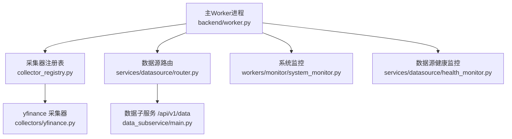
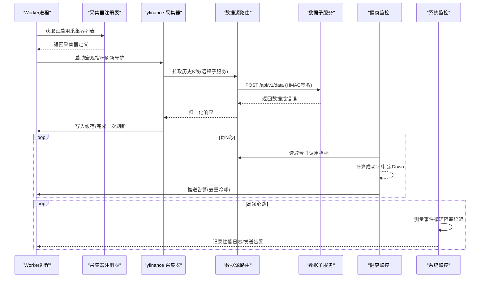
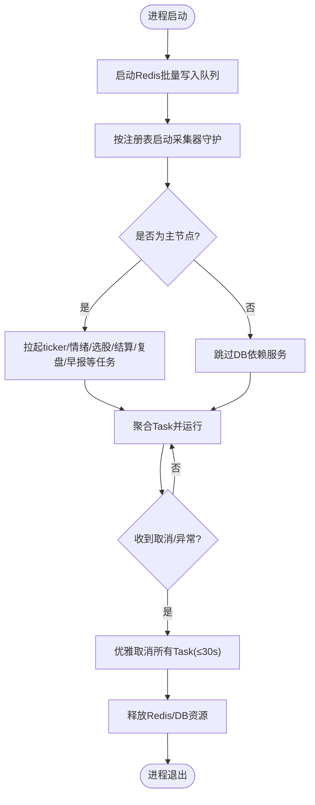
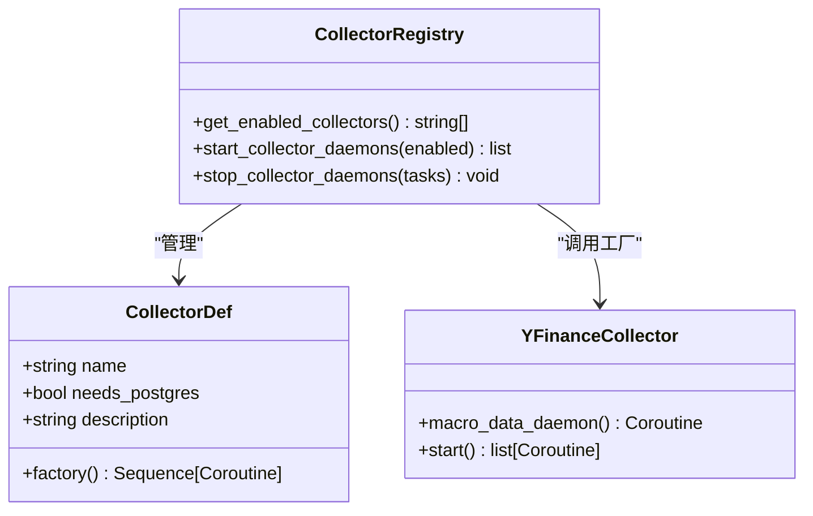
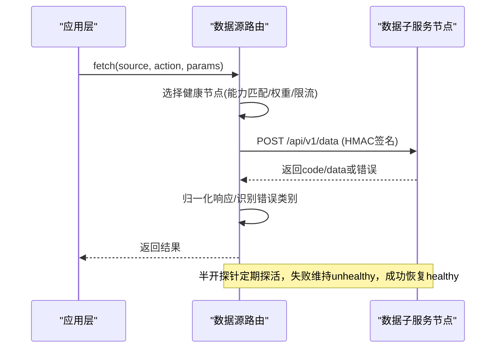
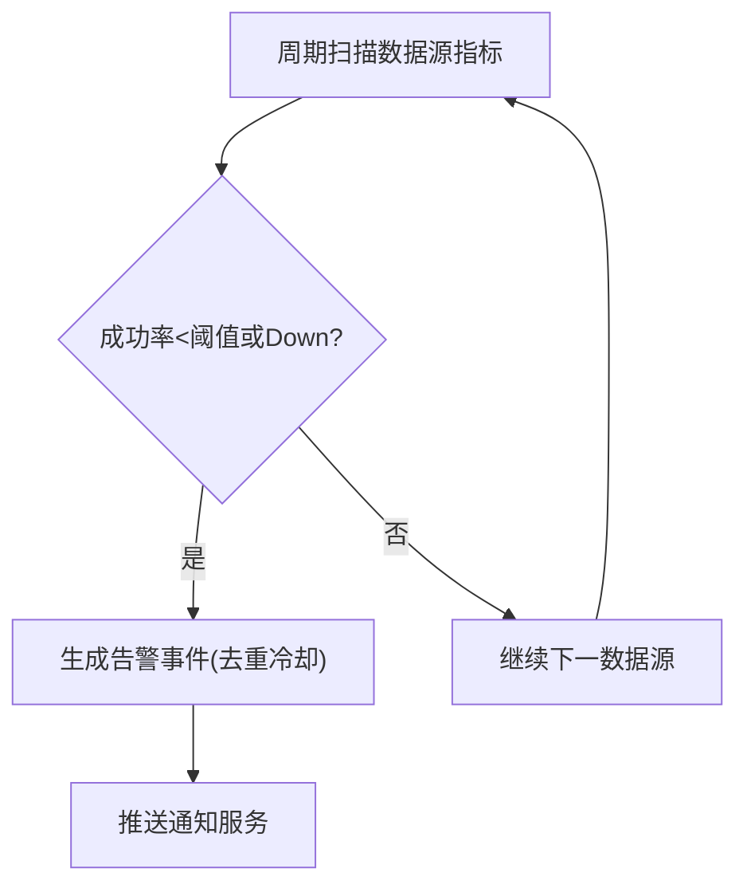
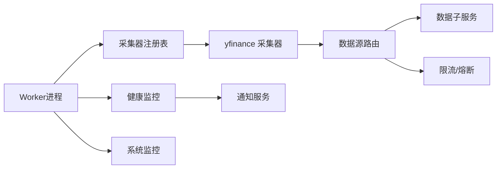

# Worker调度器

<cite>
**本文引用的文件**
- [backend/worker.py](file://backend/worker.py)
- [backend/workers/collector_registry.py](file://backend/workers/collector_registry.py)
- [backend/workers/collectors/yfinance.py](file://backend/workers/collectors/yfinance.py)
- [backend/services/datasource/router.py](file://backend/services/datasource/router.py)
- [backend/services/datasource/health_monitor.py](file://backend/services/datasource/health_monitor.py)
- [backend/workers/monitor/system_monitor.py](file://backend/workers/monitor/system_monitor.py)
- [data_subservice/main.py](file://data_subservice/main.py)
</cite>

## 目录
1. [简介](#简介)
2. [项目结构](#项目结构)
3. [核心组件](#核心组件)
4. [架构总览](#架构总览)
5. [详细组件分析](#详细组件分析)
6. [依赖关系分析](#依赖关系分析)
7. [性能考虑](#性能考虑)
8. [故障排查指南](#故障排查指南)
9. [结论](#结论)
10. [附录](#附录)

## 简介
本文件面向Quant Agent的Worker调度器，系统性说明Worker进程的生命周期管理（启动、停止、重启）、任务队列与采集任务分配机制、资源监控与健康检查、以及扩展与调优建议。文档基于仓库中后端Worker入口、采集器注册表、数据源路由与健康监控、子服务健康探针等实现进行梳理，并提供可操作的示例路径与流程图，帮助读者快速理解并安全扩展系统。

## 项目结构
- 主Worker进程：负责初始化基础设施、按配置启动采集器守护进程、拉起后台服务任务，并在退出时优雅关闭。
- 采集器注册表：集中声明所有数据采集器的元数据与启动工厂，支持按需启用与统一启停。
- 数据源路由：将业务请求路由到远程数据子服务节点，具备多活、熔断、限流感知与半开自愈能力。
- 健康监控：周期性扫描数据源成功率与可达性，触发告警；同时提供系统级事件循环阻塞监控。
- 数据子服务：独立HTTP服务，暴露统一数据端点与健康探针，承载具体数据源的连接与执行。

**图表来源**
- [backend/worker.py:34-103](file://backend/worker.py#L34-L103)
- [backend/workers/collector_registry.py:45-124](file://backend/workers/collector_registry.py#L45-L124)
- [backend/workers/collectors/yfinance.py:55-94](file://backend/workers/collectors/yfinance.py#L55-L94)
- [backend/services/datasource/router.py:249-310](file://backend/services/datasource/router.py#L249-L310)
- [data_subservice/main.py:90-111](file://data_subservice/main.py#L90-L111)

**章节来源**
- [backend/worker.py:34-103](file://backend/worker.py#L34-L103)
- [backend/workers/collector_registry.py:45-124](file://backend/workers/collector_registry.py#L45-L124)

## 核心组件
- Worker进程生命周期管理：统一启动Redis批量写入、采集器守护进程、后台服务任务；在异常或取消时优雅取消所有Task并释放资源。
- 采集器注册与启动：通过注册表集中声明采集器，按启用列表调用工厂函数创建协程并转为Task运行。
- 数据源路由与分配：根据能力集选择健康节点，结合限流与熔断策略进行请求分发，支持多活与自动恢复。
- 健康监控与告警：周期性评估数据源成功率与可达性，触发告警；系统监控检测事件循环阻塞并记录性能日志。
- 子服务健康探针：子服务暴露健康端点，主服务定期探活以恢复熔断节点。

**章节来源**
- [backend/worker.py:41-103](file://backend/worker.py#L41-L103)
- [backend/workers/collector_registry.py:88-124](file://backend/workers/collector_registry.py#L88-L124)
- [backend/services/datasource/router.py:249-310](file://backend/services/datasource/router.py#L249-L310)
- [backend/services/datasource/health_monitor.py:55-186](file://backend/services/datasource/health_monitor.py#L55-L186)
- [backend/workers/monitor/system_monitor.py:10-79](file://backend/workers/monitor/system_monitor.py#L10-L79)
- [data_subservice/main.py:90-111](file://data_subservice/main.py#L90-L111)

## 架构总览
下图展示从Worker进程到数据子服务的整体流程，包括采集器启动、任务分配、健康监控与自愈。

**图表来源**
- [backend/worker.py:41-103](file://backend/worker.py#L41-L103)
- [backend/workers/collector_registry.py:97-124](file://backend/workers/collector_registry.py#L97-L124)
- [backend/workers/collectors/yfinance.py:55-94](file://backend/workers/collectors/yfinance.py#L55-L94)
- [backend/services/datasource/router.py:669-748](file://backend/services/datasource/router.py#L669-L748)
- [backend/services/datasource/health_monitor.py:101-186](file://backend/services/datasource/health_monitor.py#L101-L186)
- [backend/workers/monitor/system_monitor.py:40-79](file://backend/workers/monitor/system_monitor.py#L40-L79)
- [data_subservice/main.py:189-200](file://data_subservice/main.py#L189-L200)

## 详细组件分析

### Worker进程生命周期管理
- 启动阶段：
  - 初始化Redis批量写入队列。
  - 按配置启动采集器守护进程（akshare、finnhub、yfinance、fmp、cboe_pc_ratio、quote_publisher）。
  - 非数据节点额外拉起ticker同步、情绪追踪、选股订阅、每日市场摘要、知识库清理、纸面组合结算、市场复盘与盘前早报等后台任务。
- 运行阶段：
  - 使用asyncio.gather聚合所有Task，统一处理取消与异常。
- 停止阶段：
  - 优雅取消所有后台Task，等待最多30秒完成。
  - 停止Redis批量写入队列、关闭Redis客户端、释放数据库引擎。

**图表来源**
- [backend/worker.py:41-103](file://backend/worker.py#L41-L103)

**章节来源**
- [backend/worker.py:34-103](file://backend/worker.py#L34-L103)

### 采集器注册与任务分配
- 注册表设计：
  - 每个采集器以CollectorDef形式声明名称、是否需要Postgres、描述与启动工厂。
  - get_enabled_collectors返回全部采集器名称（默认全开），start_collector_daemons遍历工厂并创建Task。
- 任务分配：
  - 采集器工厂返回协程序列，由注册表统一转为asyncio.Task运行。
  - yfinance采集器通过数据源路由远程拉取宏观指标，写入Redis缓存供读侧消费。

**图表来源**
- [backend/workers/collector_registry.py:35-124](file://backend/workers/collector_registry.py#L35-L124)
- [backend/workers/collectors/yfinance.py:55-94](file://backend/workers/collectors/yfinance.py#L55-L94)

**章节来源**
- [backend/workers/collector_registry.py:45-124](file://backend/workers/collector_registry.py#L45-L124)
- [backend/workers/collectors/yfinance.py:55-94](file://backend/workers/collectors/yfinance.py#L55-L94)

### 数据源路由与任务分配
- 节点管理：
  - 维护多个DataSourceNode（名称、URL、权重、状态、能力集、熔断与探针状态）。
  - 启动期校验URL端口，避免误指向主服务自身。
- 请求路由：
  - 对每个source/action映射到子服务action，构造请求体并进行HMAC签名。
  - 解析响应并归一化为内部格式，识别限流/配额耗尽/数据不可用等错误类别。
- 健康与自愈：
  - 半开探针周期性探测熔断/异常节点，成功则复位为healthy。
  - 限流压力感知：被限流节点降低优先级，优先选择低压力节点。

**图表来源**
- [backend/services/datasource/router.py:249-310](file://backend/services/datasource/router.py#L249-L310)
- [backend/services/datasource/router.py:669-748](file://backend/services/datasource/router.py#L669-L748)
- [data_subservice/main.py:189-200](file://data_subservice/main.py#L189-L200)

**章节来源**
- [backend/services/datasource/router.py:249-310](file://backend/services/datasource/router.py#L249-L310)
- [backend/services/datasource/router.py:669-748](file://backend/services/datasource/router.py#L669-L748)
- [data_subservice/main.py:189-200](file://data_subservice/main.py#L189-L200)

### 资源监控与健康检查
- 数据源健康监控：
  - 周期性扫描各数据源的成功率与可达性，低于阈值或Down时触发告警（去重冷却）。
  - 通过NotificationService推送飞书告警，避免告警风暴。
- 系统监控：
  - 高频心跳探针检测事件循环阻塞，超过阈值记录性能日志并发送告警。
- 子服务健康探针：
  - 子服务暴露健康端点，包含线程数与Futu连接状态，主服务据此判断节点健康。

**图表来源**
- [backend/services/datasource/health_monitor.py:101-186](file://backend/services/datasource/health_monitor.py#L101-L186)
- [backend/workers/monitor/system_monitor.py:40-79](file://backend/workers/monitor/system_monitor.py#L40-L79)
- [data_subservice/main.py:90-111](file://data_subservice/main.py#L90-L111)

**章节来源**
- [backend/services/datasource/health_monitor.py:55-186](file://backend/services/datasource/health_monitor.py#L55-L186)
- [backend/workers/monitor/system_monitor.py:10-79](file://backend/workers/monitor/system_monitor.py#L10-L79)
- [data_subservice/main.py:90-111](file://data_subservice/main.py#L90-L111)

### 示例：注册新数据源Worker、配置调度规则、处理故障转移
- 注册新数据源Worker：
  - 在采集器注册表中新增CollectorDef，声明名称、描述与启动工厂，确保工厂返回协程序列。
  - 参考路径：[backend/workers/collector_registry.py:45-85](file://backend/workers/collector_registry.py#L45-L85)
- 配置任务调度规则：
  - 通过环境变量配置数据源远程URL与路由开关，启用HMAC签名与多活容灾。
  - 参考路径：[backend/services/datasource/router.py:17-30](file://backend/services/datasource/router.py#L17-L30)
- 处理Worker故障转移：
  - 利用数据源路由的半开探针与熔断机制，自动切换至备用节点；子服务健康端点用于探活。
  - 参考路径：[backend/services/datasource/router.py:310-410](file://backend/services/datasource/router.py#L310-L410)
  - 参考路径：[data_subservice/main.py:90-111](file://data_subservice/main.py#L90-L111)

**章节来源**
- [backend/workers/collector_registry.py:45-85](file://backend/workers/collector_registry.py#L45-L85)
- [backend/services/datasource/router.py:17-30](file://backend/services/datasource/router.py#L17-L30)
- [backend/services/datasource/router.py:310-410](file://backend/services/datasource/router.py#L310-L410)
- [data_subservice/main.py:90-111](file://data_subservice/main.py#L90-L111)

## 依赖关系分析
- 组件耦合：
  - Worker进程依赖采集器注册表与后台服务，采集器依赖数据源路由与Redis。
  - 数据源路由依赖子服务健康端点与限流/熔断机制。
  - 健康监控依赖调用指标存储与通知服务。
- 外部依赖：
  - Redis用于缓存与批量写入。
  - FastAPI与httpx用于子服务通信。
  - Prometheus与Grafana用于监控与可视化。

**图表来源**
- [backend/worker.py:41-103](file://backend/worker.py#L41-L103)
- [backend/workers/collector_registry.py:45-124](file://backend/workers/collector_registry.py#L45-L124)
- [backend/services/datasource/router.py:249-310](file://backend/services/datasource/router.py#L249-L310)
- [backend/services/datasource/health_monitor.py:55-186](file://backend/services/datasource/health_monitor.py#L55-L186)

**章节来源**
- [backend/worker.py:41-103](file://backend/worker.py#L41-L103)
- [backend/workers/collector_registry.py:45-124](file://backend/workers/collector_registry.py#L45-L124)
- [backend/services/datasource/router.py:249-310](file://backend/services/datasource/router.py#L249-L310)
- [backend/services/datasource/health_monitor.py:55-186](file://backend/services/datasource/health_monitor.py#L55-L186)

## 性能考虑
- 事件循环阻塞监控：高频心跳探针检测阻塞，超过阈值记录性能日志并告警，避免慢请求影响整体吞吐。
- 限流与熔断：数据源路由识别限流与配额耗尽，降低受限节点优先级，避免放大错误；熔断后通过半开探针自动恢复。
- 资源释放：Worker停止时优雅取消Task并释放Redis与数据库资源，防止资源泄漏。
- 缓存与批写：Redis批量写入队列减少频繁IO，提升写入性能。

**章节来源**
- [backend/workers/monitor/system_monitor.py:40-79](file://backend/workers/monitor/system_monitor.py#L40-L79)
- [backend/services/datasource/router.py:669-748](file://backend/services/datasource/router.py#L669-L748)
- [backend/worker.py:84-103](file://backend/worker.py#L84-L103)

## 故障排查指南
- 数据源成功率劣化：
  - 检查健康监控告警，确认成功率阈值与样本数设置，查看通知服务是否可用。
  - 参考路径：[backend/services/datasource/health_monitor.py:101-186](file://backend/services/datasource/health_monitor.py#L101-L186)
- 事件循环阻塞：
  - 查看系统监控日志，定位阻塞来源，优化同步代码或拆分任务。
  - 参考路径：[backend/workers/monitor/system_monitor.py:40-79](file://backend/workers/monitor/system_monitor.py#L40-L79)
- 子服务健康异常：
  - 检查子服务健康端点，确认线程数与Futu连接状态，调整资源或重启节点。
  - 参考路径：[data_subservice/main.py:90-111](file://data_subservice/main.py#L90-L111)

**章节来源**
- [backend/services/datasource/health_monitor.py:101-186](file://backend/services/datasource/health_monitor.py#L101-L186)
- [backend/workers/monitor/system_monitor.py:40-79](file://backend/workers/monitor/system_monitor.py#L40-L79)
- [data_subservice/main.py:90-111](file://data_subservice/main.py#L90-L111)

## 结论
Quant Agent的Worker调度器通过注册表驱动的采集器管理、数据源路由的健康与熔断机制、以及多维度的监控与告警，实现了高可用的任务调度与资源管理。扩展新数据源只需在注册表中声明并实现工厂函数；配置调度规则可通过环境变量灵活控制；故障转移由路由与探针自动完成。建议在生产环境中持续优化限流与熔断参数，结合监控与告警体系保障系统稳定性。

## 附录
- 关键路径参考：
  - Worker启动与停止：[backend/worker.py:34-103](file://backend/worker.py#L34-L103)
  - 采集器注册与启动：[backend/workers/collector_registry.py:45-124](file://backend/workers/collector_registry.py#L45-L124)
  - 数据源路由与请求：[backend/services/datasource/router.py:249-310](file://backend/services/datasource/router.py#L249-L310)
  - 健康监控与告警：[backend/services/datasource/health_monitor.py:55-186](file://backend/services/datasource/health_monitor.py#L55-L186)
  - 系统监控与性能日志：[backend/workers/monitor/system_monitor.py:10-79](file://backend/workers/monitor/system_monitor.py#L10-L79)
  - 子服务健康探针：[data_subservice/main.py:90-111](file://data_subservice/main.py#L90-L111)
