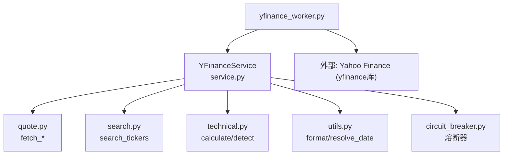
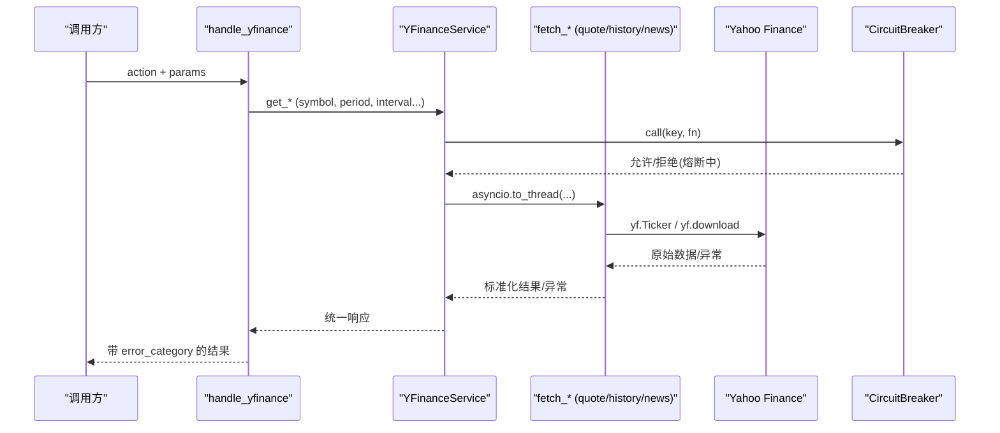
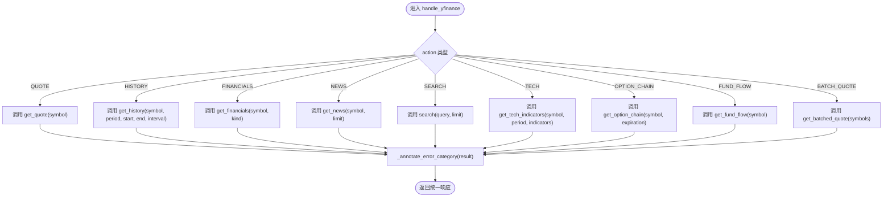
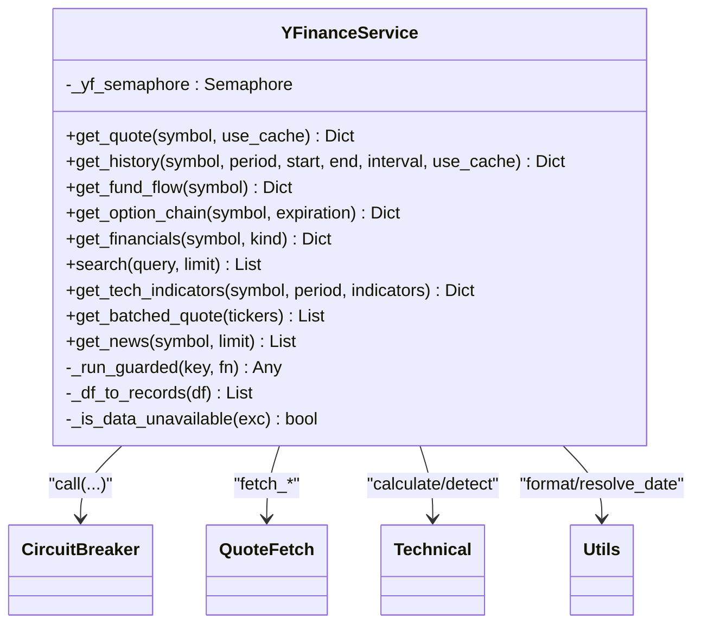
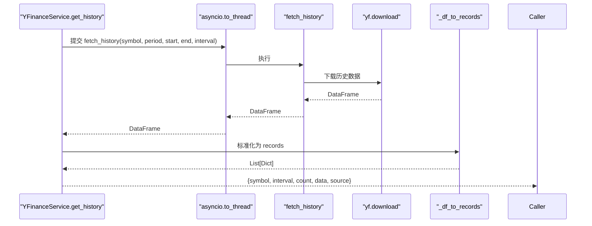
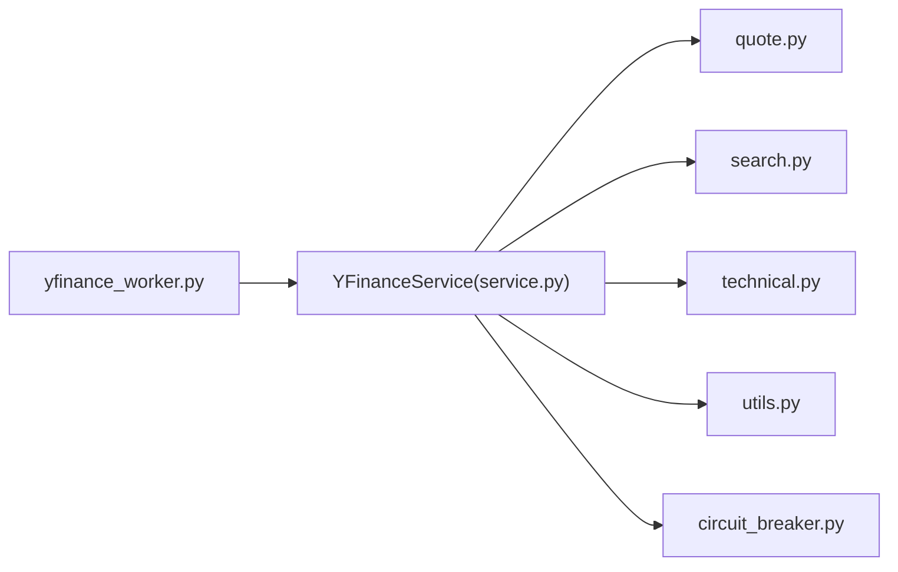

# YFinance数据Worker

<cite>
**本文引用的文件**
- [yfinance_worker.py](file://data_subservice/yfinance_worker.py)
- [service.py](file://data_subservice/_internal/yfinance/service.py)
- [quote.py](file://data_subservice/_internal/yfinance/quote.py)
- [search.py](file://data_subservice/_internal/yfinance/search.py)
- [technical.py](file://data_subservice/_internal/yfinance/technical.py)
- [utils.py](file://data_subservice/_internal/yfinance/utils.py)
- [circuit_breaker.py](file://data_subservice/_internal/circuit_breaker.py)
- [test_yfinance_worker.py](file://data_subservice/tests/test_yfinance_worker.py)
- [test_internal_yfinance_service.py](file://data_subservice/tests/test_internal_yfinance_service.py)
</cite>

## 目录
1. [简介](#简介)
2. [项目结构](#项目结构)
3. [核心组件](#核心组件)
4. [架构总览](#架构总览)
5. [详细组件分析](#详细组件分析)
6. [依赖关系分析](#依赖关系分析)
7. [性能与限流](#性能与限流)
8. [故障恢复与熔断](#故障恢复与熔断)
9. [配置与使用示例](#配置与使用示例)
10. [常见问题排查](#常见问题排查)
11. [结论](#结论)

## 简介
本文件为 Quant Agent 的 YFinance 数据 Worker 提供完整技术文档，覆盖异步数据采集、统一服务类接口、数据标准化转换、缓存与并发控制、限流与熔断策略，以及常见问题的定位与处理。YFinance Worker 作为独立子服务节点，直接对接 Yahoo Finance 数据源，向上暴露统一的 action 路由（如 QUOTE、HISTORY、FINANCIALS、NEWS、SEARCH、TECH、OPTION_CHAIN、BATCH_QUOTE），并负责错误分类、限流标注与降级。

## 项目结构
YFinance Worker 位于 data_subservice 下，采用“物理解耦”设计：worker 仅 import _internal.yfinance 模块，不依赖后端主服务。核心文件职责如下：
- yfinance_worker.py：对外入口，action 路由、错误类别标注、异常兜底
- _internal/yfinance/service.py：YFinanceService 统一服务类，封装并发、熔断、数据转换、各数据域方法
- _internal/yfinance/quote.py：底层抓取实现（行情、历史、资金流向、期权链、新闻）
- _internal/yfinance/search.py：标的搜索
- _internal/yfinance/technical.py：技术指标计算与信号检测
- _internal/yfinance/utils.py：代码格式化、日期范围解析等工具
- _internal/circuit_breaker.py：熔断器（状态机、冷却时间、失败计数）

图表来源
- [yfinance_worker.py:51-104](file://data_subservice/yfinance_worker.py#L51-L104)
- [service.py:36-339](file://data_subservice/_internal/yfinance/service.py#L36-L339)
- [quote.py:16-251](file://data_subservice/_internal/yfinance/quote.py#L16-L251)
- [search.py:10-34](file://data_subservice/_internal/yfinance/search.py#L10-L34)
- [technical.py:30-121](file://data_subservice/_internal/yfinance/technical.py#L30-L121)
- [utils.py:10-51](file://data_subservice/_internal/yfinance/utils.py#L10-L51)
- [circuit_breaker.py:64-282](file://data_subservice/_internal/circuit_breaker.py#L64-L282)

章节来源
- [yfinance_worker.py:1-104](file://data_subservice/yfinance_worker.py#L1-L104)
- [service.py:1-339](file://data_subservice/_internal/yfinance/service.py#L1-L339)

## 核心组件
- YFinanceService：统一入口，提供 get_quote、get_history、get_financials、get_fund_flow、get_option_chain、search、get_tech_indicators、get_batched_quote、get_news 等方法；内部通过 asyncio.to_thread 调用同步 yfinance 抓取函数，并使用 Semaphore 限制并发；所有 IO 经熔断器保护。
- Worker 路由 handle_yfinance：将外部请求映射到 service 方法，并对返回结果进行 error_category 标注（特别是限流场景）。
- 数据标准化：_df_to_records 将历史 K 线 DataFrame 转换为统一记录格式；期权链字段归一化；新闻、财务、搜索均输出稳定结构。
- 工具函数：format_yf_ticker 统一股票代码后缀；resolve_date_range 解析 period/start/end 默认值。

章节来源
- [service.py:94-339](file://data_subservice/_internal/yfinance/service.py#L94-L339)
- [yfinance_worker.py:20-104](file://data_subservice/yfinance_worker.py#L20-L104)
- [quote.py:16-251](file://data_subservice/_internal/yfinance/quote.py#L16-L251)
- [utils.py:10-51](file://data_subservice/_internal/yfinance/utils.py#L10-L51)

## 架构总览
YFinance Worker 作为叶子数据源节点，接收上层调度或 API 的 action 请求，路由至 YFinanceService，再调用具体 fetch_* 函数从 Yahoo Finance 获取原始数据，并进行标准化后返回。所有外部 IO 受并发信号量与熔断器双重保护，确保在高并发和上游限流/熔断时系统稳定。

图表来源
- [yfinance_worker.py:51-104](file://data_subservice/yfinance_worker.py#L51-L104)
- [service.py:94-339](file://data_subservice/_internal/yfinance/service.py#L94-L339)
- [quote.py:48-89](file://data_subservice/_internal/yfinance/quote.py#L48-L89)
- [circuit_breaker.py:111-171](file://data_subservice/_internal/circuit_breaker.py#L111-L171)

## 详细组件分析

### Worker 路由与错误标注
- handle_yfinance 支持动作：QUOTE、HISTORY、FUND_FLOW、OPTION_CHAIN、FINANCIALS、INFO、SEARCH、TECH、BATCH_QUOTE、NEWS。
- _annotate_error_category 对返回结果进行 error_category 补标：当错误文本包含限流关键词（如 too many requests、rate limit、throttl 等）时，标注为 rate_limit，使上层可正确走退避而非误判为普通失败触发熔断。

图表来源
- [yfinance_worker.py:51-104](file://data_subservice/yfinance_worker.py#L51-L104)

章节来源
- [yfinance_worker.py:20-104](file://data_subservice/yfinance_worker.py#L20-L104)
- [test_yfinance_worker.py:13-103](file://data_subservice/tests/test_yfinance_worker.py#L13-L103)

### YFinanceService 统一服务类
- 并发控制：通过 asyncio.Semaphore(YF_MAX_CONCURRENCY) 限制同时进行的 yfinance 外部 IO 调用数，防止线程耗尽。
- 熔断保护：所有外部 IO 经 circuit_breaker.call 包裹，按失败次数与冷却时间管理 OPEN/HALF_OPEN/CLOSED 状态。
- 数据不可用判断：_is_data_unavailable 识别“无数据/已退市/找不到”等数据层面问题，避免误伤熔断。
- 历史数据标准化：_df_to_records 将 DataFrame 转为统一记录列表，兼容 MultiIndex 列名，安全数值转换。
- 技术指标：get_tech_indicators 先拉取历史，再计算 MACD/RSI/EMA/SMA，并生成买卖信号。

图表来源
- [service.py:36-339](file://data_subservice/_internal/yfinance/service.py#L36-L339)
- [circuit_breaker.py:64-282](file://data_subservice/_internal/circuit_breaker.py#L64-L282)
- [quote.py:16-251](file://data_subservice/_internal/yfinance/quote.py#L16-L251)
- [technical.py:30-121](file://data_subservice/_internal/yfinance/technical.py#L30-L121)
- [utils.py:10-51](file://data_subservice/_internal/yfinance/utils.py#L10-L51)

章节来源
- [service.py:36-339](file://data_subservice/_internal/yfinance/service.py#L36-L339)
- [test_internal_yfinance_service.py:15-209](file://data_subservice/tests/test_internal_yfinance_service.py#L15-L209)

### 数据抓取与标准化
- 行情快照：fetch_quote 使用 fast_info 获取最新价、前收、涨跌额/幅、币种与时区。
- 历史K线：fetch_history 使用 yf.download，关闭内置多线程，由 Semaphore 统一管控；返回 DataFrame 并在 service 层拍平 MultiIndex 列，转记录。
- 资金流向：fetch_fund_flow 获取机构持仓。
- 期权链：fetch_option_chain 遍历到期日，规范化 CALL/PUT 合约字段（含 implied_volatility）。
- 新闻：fetch_news 读取 Yahoo news 并裁剪为统一字段。
- 搜索：search_tickers 返回 symbol/name/currency/exchange。
- 技术指标：calculate_technical_indicators 计算 SMA/EMA/RSI/MACD；detect_signals 基于 SMA50/200 趋势与 RSI 超买超卖生成信号。

图表来源
- [service.py:144-206](file://data_subservice/_internal/yfinance/service.py#L144-L206)
- [quote.py:48-89](file://data_subservice/_internal/yfinance/quote.py#L48-L89)

章节来源
- [quote.py:16-251](file://data_subservice/_internal/yfinance/quote.py#L16-L251)
- [service.py:180-206](file://data_subservice/_internal/yfinance/service.py#L180-L206)
- [technical.py:30-121](file://data_subservice/_internal/yfinance/technical.py#L30-L121)

### 错误分类与限流标注
- 数据不可用：_is_data_unavailable 识别“no data/not found/delisted/empty dataset/no data found”，归类为 data_unavailable，不计入熔断。
- 限流标注：worker 层 _annotate_error_category 根据错误文本匹配限流关键词，标注 error_category=rate_limit，使上层走退避策略。
- 熔断器：circuit_breaker 在连续失败达到阈值时进入 OPEN，冷却后尝试 HALF_OPEN 探测，成功则回到 CLOSED。

章节来源
- [service.py:68-88](file://data_subservice/_internal/yfinance/service.py#L68-L88)
- [yfinance_worker.py:20-48](file://data_subservice/yfinance_worker.py#L20-L48)
- [circuit_breaker.py:111-171](file://data_subservice/_internal/circuit_breaker.py#L111-L171)
- [test_internal_yfinance_service.py:15-160](file://data_subservice/tests/test_internal_yfinance_service.py#L15-L160)

## 依赖关系分析
- YFinanceService 依赖：
  - quote.py：行情、历史、资金流向、期权链、新闻抓取
  - search.py：标的搜索
  - technical.py：技术指标计算与信号检测
  - utils.py：ticker 格式化、日期范围解析
  - circuit_breaker.py：熔断器
- Worker 依赖：
  - yfinance_service 单例
  - 日志与错误标注逻辑

图表来源
- [yfinance_worker.py:51-104](file://data_subservice/yfinance_worker.py#L51-L104)
- [service.py:19-33](file://data_subservice/_internal/yfinance/service.py#L19-L33)

章节来源
- [service.py:19-33](file://data_subservice/_internal/yfinance/service.py#L19-L33)

## 性能与限流
- 并发控制：YF_MAX_CONCURRENCY 环境变量控制最大并发外部 IO 数，默认 8。所有产生 yfinance 调用的方法必须经 _run_guarded，确保并发上限。
- 线程模型：yf.download 设置 threads=False，避免内部线程无限增长导致进程资源耗尽。
- 指标与监控：子服务不接入主集群 Prometheus，熔断器 metrics 降级为 no-op，仅打日志。
- 批量行情：get_batched_quote 内部循环调用 fetch_quote，适合少量 tickers；大批量建议在上层分片并发。

章节来源
- [service.py:47-55](file://data_subservice/_internal/yfinance/service.py#L47-L55)
- [quote.py:58-71](file://data_subservice/_internal/yfinance/quote.py#L58-L71)
- [circuit_breaker.py:21-35](file://data_subservice/_internal/circuit_breaker.py#L21-L35)

## 故障恢复与熔断
- 熔断器状态机：CLOSED → OPEN（连续失败达阈值）→ HALF_OPEN（冷却后探测）→ CLOSED（成功恢复）。
- 失败计数：非限流类错误计入失败；限流类错误跳过计数，避免误熔断。
- 数据不可用：针对特定 ticker 无数据的情况，标记为 data_unavailable，不影响整体熔断。
- 恢复策略：上层可根据 error_category 选择重试退避或切换备用数据源。

章节来源
- [circuit_breaker.py:64-282](file://data_subservice/_internal/circuit_breaker.py#L64-L282)
- [service.py:68-88](file://data_subservice/_internal/yfinance/service.py#L68-L88)

## 配置与使用示例
- 环境变量
  - YF_MAX_CONCURRENCY：YFinance 外部 IO 最大并发数，默认 8
  - CIRCUIT_BREAKER_MAX_FAILURES：熔断触发失败次数，默认 3
  - CIRCUIT_BREAKER_COOLDOWN_S：熔断冷却时间（秒），默认 60
- 请求参数
  - QUOTE：symbol
  - HISTORY：symbol, period/start/end, interval（默认 1d）
  - FINANCIALS：symbol, kind（annual/quarterly）
  - NEWS：symbol, limit（默认 15）
  - SEARCH：query, limit（默认 10）
  - TECH：symbol, period（默认 1y）, indicators（MACD/RSI/EMA/SMA）
  - OPTION_CHAIN：symbol, expiration（可选）
  - FUND_FLOW：symbol
  - BATCH_QUOTE：symbols（List[str]）
- 数据标准化
  - 历史 K 线：{date, open, high, low, close, volume}
  - 期权链：{expiration, strike, option_type, bid, ask, last_price, volume, open_interest, implied_volatility}
  - 新闻：{uuid, title, publisher, link, provider_publish_time, type, related_tickers}
  - 财务：{kind, financials}
  - 搜索：{symbol, name, currency, exchange}
- 缓存策略
  - 当前实现未内置缓存；可在上层调用处增加 Redis/内存缓存，结合 symbol+period+interval 作为键，设置合理 TTL。
- 示例流程
  - 配置环境变量后启动 worker，调用 handle_yfinance("HISTORY", {"symbol":"AAPL","period":"1mo","interval":"1d"})，返回统一格式的历史数据。
  - 调用 handle_yfinance("TECH", {"symbol":"AAPL","period":"1y","indicators":["MACD","RSI"]})，返回技术指标与信号。

章节来源
- [service.py:47-55](file://data_subservice/_internal/yfinance/service.py#L47-L55)
- [service.py:144-206](file://data_subservice/_internal/yfinance/service.py#L144-L206)
- [quote.py:16-251](file://data_subservice/_internal/yfinance/quote.py#L16-L251)
- [search.py:10-34](file://data_subservice/_internal/yfinance/search.py#L10-L34)
- [technical.py:30-121](file://data_subservice/_internal/yfinance/technical.py#L30-L121)
- [utils.py:10-51](file://data_subservice/_internal/yfinance/utils.py#L10-L51)

## 常见问题排查
- 限流频繁：检查 YF_MAX_CONCURRENCY 是否过低；确认上层是否重复高频请求；观察 error_category 是否为 rate_limit，必要时调整退避策略。
- 历史数据为空：确认 symbol 是否正确、period/start/end 是否有效；若为指数或停牌股可能返回 data_unavailable；检查 MultiIndex 列是否被拍平。
- 期权链 IV 为空：确认字段归一化是否生效（implied_volatility）；核对 fetch_option_chain 是否遍历到期日并提取 calls/puts。
- 熔断触发：查看熔断器状态与失败次数；区分数据不可用与源级错误；必要时重置熔断器或调整阈值。
- 技术指标异常：确认历史数据充足（如 SMA200 需要足够长度）；检查 indicators 列表是否合法。

章节来源
- [yfinance_worker.py:20-48](file://data_subservice/yfinance_worker.py#L20-L48)
- [service.py:68-88](file://data_subservice/_internal/yfinance/service.py#L68-L88)
- [quote.py:72-89](file://data_subservice/_internal/yfinance/quote.py#L72-L89)
- [circuit_breaker.py:111-171](file://data_subservice/_internal/circuit_breaker.py#L111-L171)

## 结论
YFinance 数据 Worker 通过统一服务类与严格并发/熔断控制，提供了稳定可靠的 Yahoo Finance 数据采集能力。其模块化设计便于扩展与维护，标准化的数据输出与错误分类机制使得上层可以灵活实现缓存、重试与降级策略。建议在生产环境中合理配置并发与熔断参数，并结合上层缓存与监控，确保高可用与高性能。
