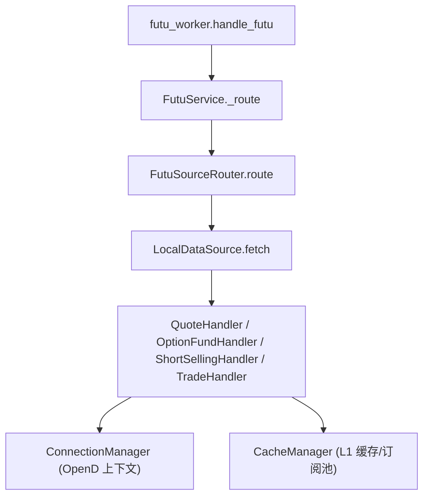
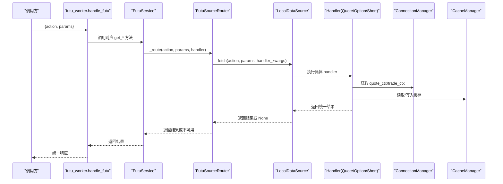
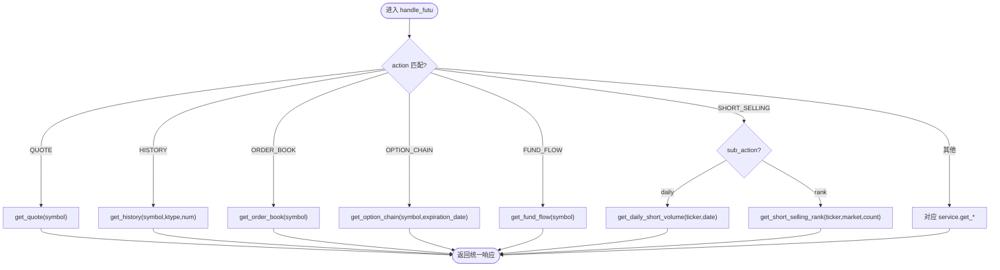
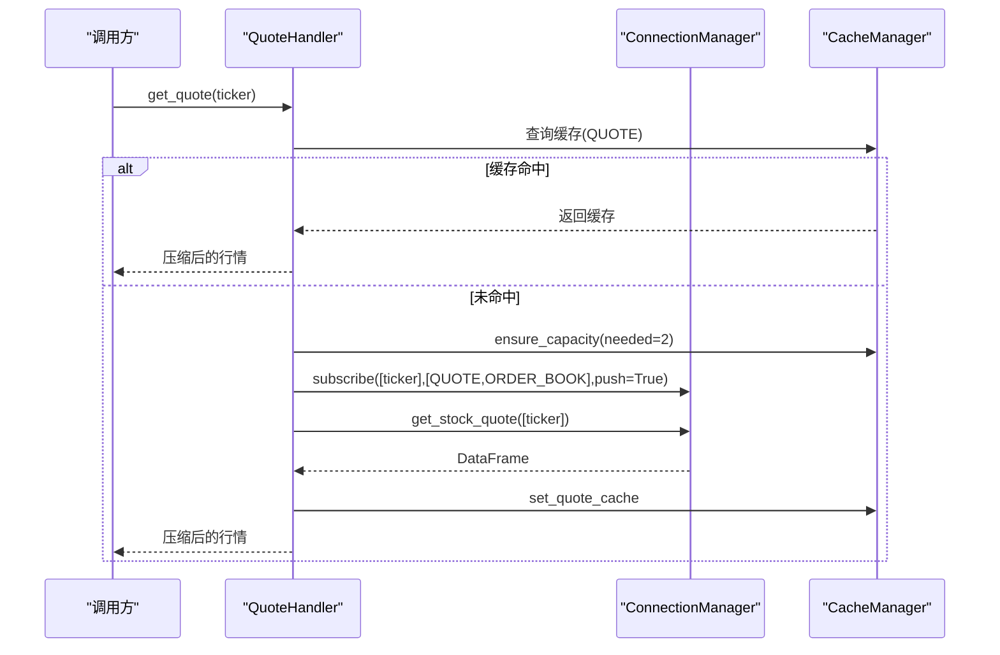
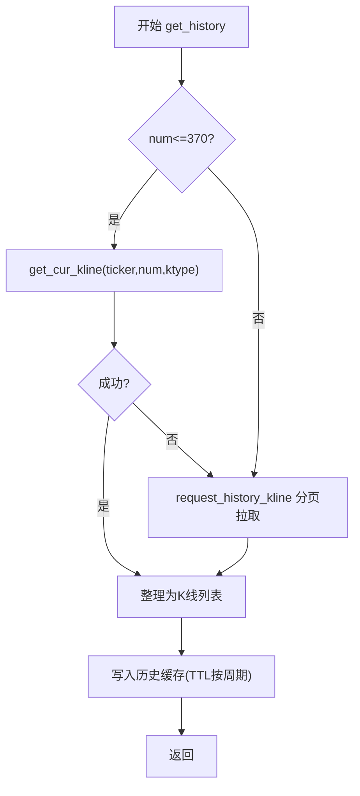
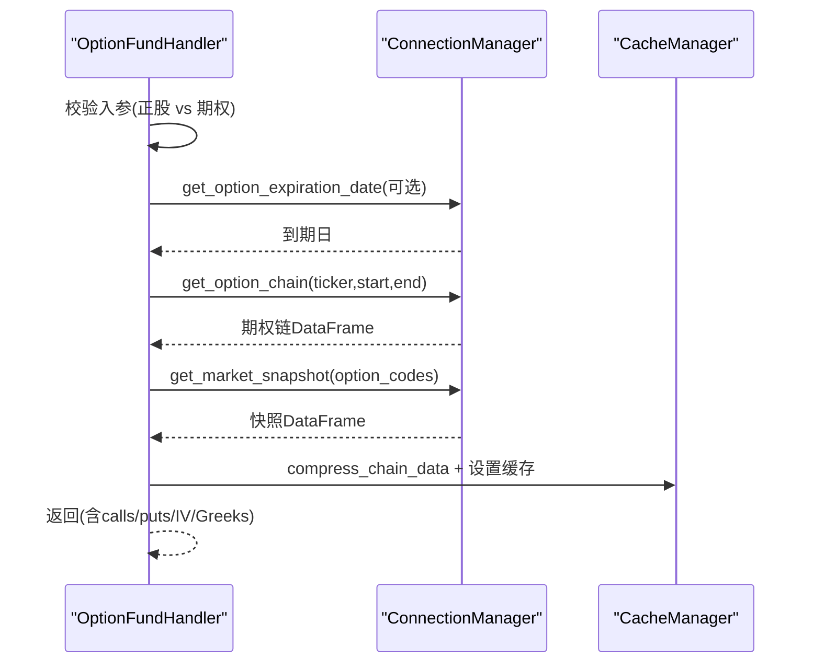
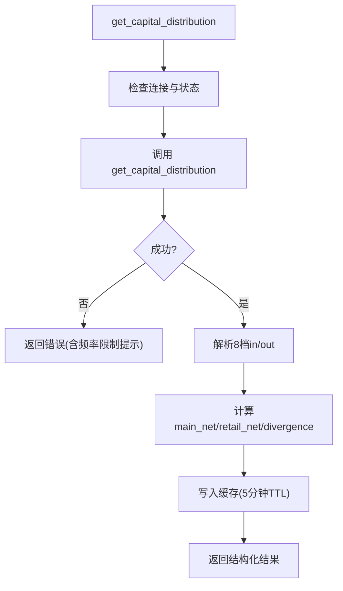
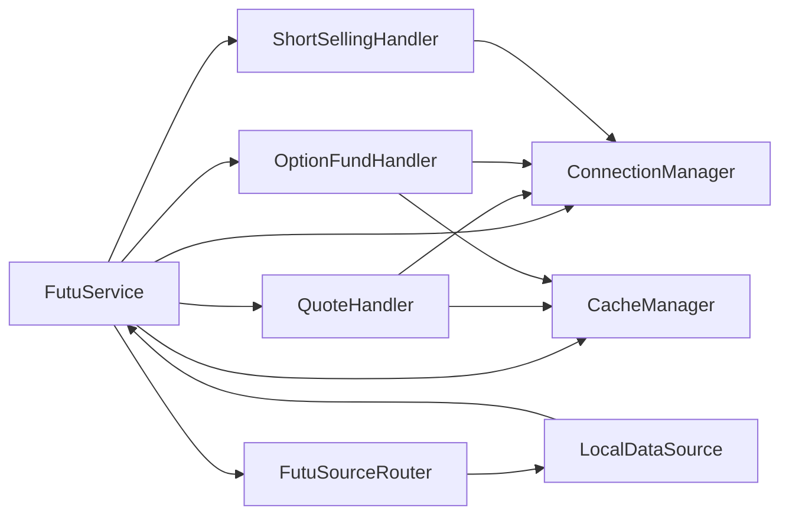

# 富途数据Worker

<cite>
**本文引用的文件**
- [futu_worker.py](file://data_subservice/futu_worker.py)
- [service.py](file://data_subservice/futu_src/service.py)
- [source_router.py](file://data_subservice/futu_src/source_router.py)
- [connection_manager.py](file://data_subservice/futu_src/connection_manager.py)
- [quote_handler.py](file://data_subservice/futu_src/quote_handler.py)
- [option_fund_handler.py](file://data_subservice/futu_src/option_fund_handler.py)
- [short_selling_handler.py](file://data_subservice/futu_src/short_selling_handler.py)
- [cache_manager.py](file://data_subservice/futu_src/cache_manager.py)
- [data_source.py](file://data_subservice/futu_src/data_source.py)
- [test_futu_worker.py](file://data_subservice/tests/test_futu_worker.py)
</cite>

## 目录
1. [简介](#简介)
2. [项目结构](#项目结构)
3. [核心组件](#核心组件)
4. [架构总览](#架构总览)
5. [详细组件分析](#详细组件分析)
6. [依赖关系分析](#依赖关系分析)
7. [性能与缓存](#性能与缓存)
8. [错误处理与连接状态管理](#错误处理与连接状态管理)
9. [使用示例](#使用示例)
10. [故障排查指南](#故障排查指南)
11. [结论](#结论)

## 简介
本文件为 Quant Agent 的富途数据 Worker 提供完整技术文档，聚焦 Futu OpenD 集成实现，覆盖行情订阅、Level 2 盘口、期权链、资金流向、卖空数据等能力。重点说明 handle_futu 的路由机制（支持 QUOTE、HISTORY、ORDER_BOOK、OPTION_CHAIN 等 18+ 操作类型），解释数据源适配器模式如何将富途 API 调用转换为统一响应格式，并给出股票实时行情、历史K线、资金流向、卖空数据的调用示例。同时总结错误处理策略与连接状态管理机制。

## 项目结构
富途数据 Worker 位于 data_subservice 子服务中，采用“入口路由 + 服务编排 + Handler 模块化 + 连接/缓存抽象”的分层设计：
- 入口路由：futu_worker.handle_futu 接收 action 与参数，分发到 futu_service 对应方法
- 服务编排：FutuService 聚合各 Handler，并通过 FutuSourceRouter 统一走本地直连 OpenD
- 模块化解耦：QuoteHandler、OptionFundHandler、ShortSellingHandler、TradeHandler 等按功能划分
- 基础设施：ConnectionManager 负责 OpenD 长连接与上下文；CacheManager 提供 L1 内存缓存与 LRU 订阅池
- 数据源适配：LocalDataSource + FutuSourceRouter 将请求路由到本地 OpenD，屏蔽底层差异

图表来源
- [futu_worker.py:33-190](file://data_subservice/futu_worker.py#L33-L190)
- [service.py:101-116](file://data_subservice/futu_src/service.py#L101-L116)
- [source_router.py:45-67](file://data_subservice/futu_src/source_router.py#L45-L67)
- [data_source.py:76-98](file://data_subservice/futu_src/data_source.py#L76-L98)

章节来源
- [futu_worker.py:33-190](file://data_subservice/futu_worker.py#L33-L190)
- [service.py:31-116](file://data_subservice/futu_src/service.py#L31-L116)
- [source_router.py:18-80](file://data_subservice/futu_src/source_router.py#L18-L80)
- [data_source.py:18-110](file://data_subservice/futu_src/data_source.py#L18-L110)

## 核心组件
- FutuService：全局单例，封装连接、缓存与各 Handler，提供统一的异步接口，并通过 _route 委托给路由器
- ConnectionManager：维护 OpenQuoteContext/OpenSecTradeContext，负责连接、重连、推送回调注册、跨网络加密握手、交易解锁
- QuoteHandler：实时行情、历史K线、盘口深度、板块热力图、港股行业资金流聚合、FedWatch 目标利率隐含概率
- OptionFundHandler：期权链、期权策略组合、期权波动率、资金流向、基本面、十大经纪商、分析师共识、权证链
- ShortSellingHandler：卖空成交榜、每日卖空量（T-1 结算语义）
- CacheManager：L1 内存缓存（带 TTL）、LRU 订阅池、熔断与限流控制、数据压缩工具
- FutuSourceRouter + LocalDataSource：数据源适配器，当前固定 local 模式，屏蔽远程/自动降级逻辑

章节来源
- [service.py:31-116](file://data_subservice/futu_src/service.py#L31-L116)
- [connection_manager.py:44-351](file://data_subservice/futu_src/connection_manager.py#L44-L351)
- [quote_handler.py:74-656](file://data_subservice/futu_src/quote_handler.py#L74-L656)
- [option_fund_handler.py:24-800](file://data_subservice/futu_src/option_fund_handler.py#L24-L800)
- [short_selling_handler.py:46-257](file://data_subservice/futu_src/short_selling_handler.py#L46-L257)
- [cache_manager.py:30-373](file://data_subservice/futu_src/cache_manager.py#L30-L373)
- [source_router.py:18-80](file://data_subservice/futu_src/source_router.py#L18-L80)
- [data_source.py:18-110](file://data_subservice/futu_src/data_source.py#L18-L110)

## 架构总览
handle_futu 作为统一入口，根据 action 字符串路由到 FutuService 的具体方法，再通过 _route 交由 FutuSourceRouter 选择数据源（当前为 local），最终调用对应 Handler 完成数据采集与格式化。

图表来源
- [futu_worker.py:33-190](file://data_subservice/futu_worker.py#L33-L190)
- [service.py:101-116](file://data_subservice/futu_src/service.py#L101-L116)
- [source_router.py:45-67](file://data_subservice/futu_src/source_router.py#L45-L67)
- [data_source.py:76-98](file://data_subservice/futu_src/data_source.py#L76-L98)

## 详细组件分析

### 路由机制：handle_futu 支持的 18+ 操作类型
- 行情类：QUOTE、HISTORY、ORDER_BOOK、SNAPSHOT、STOCK_BASICINFO
- 期权类：OPTION_CHAIN、OPTION_STRATEGY、OPTION_VOLATILITY、WARRANT_CHAIN
- 资金与基本面：FUND_FLOW、CAPITAL_FLOW、FUNDAMENTAL、FINANCIALS、VALUATION、CAPITAL_DISTRIBUTION
- 市场与宏观：TOP_BROKERS、ANALYST_CONSENSUS、FED_WATCH、HEAT_MAP、HK_SECTOR_FLOW
- 卖空数据：SHORT_SELLING（rank/daily）
- 交易与账户：PLACE_ORDER、MODIFY_ORDER、QUERY_ORDER、ACCOUNT_INFO、EMERGENCY_LIQUIDATION
- 订阅与资讯：SUBSCRIBE、UNSUBSCRIBE、COMPANY_NEWS/STOCK_NEWS/NEWS
- 健康检查：HEALTH

上述 action 在 handle_futu 中通过 if/elif 分支映射到 futu_service 的对应方法，并在 SHORT_SELLING 中通过 sub_action/mode 区分 rank 与 daily。

图表来源
- [futu_worker.py:33-190](file://data_subservice/futu_worker.py#L33-L190)

章节来源
- [futu_worker.py:33-190](file://data_subservice/futu_worker.py#L33-L190)
- [test_futu_worker.py:72-185](file://data_subservice/tests/test_futu_worker.py#L72-L185)

### 数据源适配器模式
- FutuSourceRouter：定义 route(action, params, local_handler, **kwargs)，当前 mode 固定为 local，便于未来扩展 remote/auto
- LocalDataSource：实现 FutuDataSource 协议，校验 is_available 并调用 local_handler
- 优势：上层仅关心 action 与参数，不感知 OpenD 细节；可替换为远程代理或 Mock 实现

```mermaid
classDiagram
class FutuDataSource {
<<protocol>>
+is_available bool
+source_type string
+fetch(action,params) Dict
+status() Dict
}
class FutuSourceRouter {
-_local LocalDataSource
+current_mode string
+switch_mode(new_mode) string
+route(action,params,local_handler,**kwargs) Dict
+status() Dict
}
class LocalDataSource {
-_svc FutuService
+is_available bool
+source_type string
+fetch(action,params,local_handler,**handler_kwargs) Dict
+status() Dict
}
FutuSourceRouter --> LocalDataSource : "持有"
LocalDataSource ..|> FutuDataSource : "实现"
```

图表来源
- [source_router.py:18-80](file://data_subservice/futu_src/source_router.py#L18-L80)
- [data_source.py:18-110](file://data_subservice/futu_src/data_source.py#L18-L110)

章节来源
- [source_router.py:18-80](file://data_subservice/futu_src/source_router.py#L18-L80)
- [data_source.py:18-110](file://data_subservice/futu_src/data_source.py#L18-L110)

### 行情数据订阅与 Level 2 盘口
- 实时行情：get_quote 先检查不支持资产，再尝试 L1 缓存命中；若未订阅则进行 LRU 容量检查并订阅 QUOTE 与 ORDER_BOOK，最后拉取快照并压缩返回
- Level 2 盘口：get_order_book 同样基于 L1 缓存与 LRU 订阅池，确保 ORDER_BOOK 推送可用；返回 bids/asks 列表
- 订阅回传：subscribe_quote/unsubscribe_quote 支持前端 WS 订阅后直接通知 OpenD，避免轮询延迟

图表来源
- [quote_handler.py:81-127](file://data_subservice/futu_src/quote_handler.py#L81-L127)
- [quote_handler.py:532-572](file://data_subservice/futu_src/quote_handler.py#L532-L572)
- [cache_manager.py:104-114](file://data_subservice/futu_src/cache_manager.py#L104-L114)

章节来源
- [quote_handler.py:81-127](file://data_subservice/futu_src/quote_handler.py#L81-L127)
- [quote_handler.py:532-572](file://data_subservice/futu_src/quote_handler.py#L532-L572)
- [cache_manager.py:104-114](file://data_subservice/futu_src/cache_manager.py#L104-L114)

### 历史K线与分页拉取
- 优先使用 get_cur_kline（num≤370），否则降级 request_history_kline 分页拉取，拼接并按时间排序取最近 num 根
- 日线及以上周期使用更长缓存 TTL，分时线短 TTL，减少穿透压力

图表来源
- [quote_handler.py:396-530](file://data_subservice/futu_src/quote_handler.py#L396-L530)
- [cache_manager.py:12-20](file://data_subservice/futu_src/cache_manager.py#L12-L20)

章节来源
- [quote_handler.py:396-530](file://data_subservice/futu_src/quote_handler.py#L396-L530)
- [cache_manager.py:12-20](file://data_subservice/futu_src/cache_manager.py#L12-L20)

### 期权数据处理
- 期权链：get_option_chain 自动获取到期日（如未指定），拉取链数据后用 get_market_snapshot 补充 IV/Greeks/买卖价/量仓；失败时标记 degraded
- 期权策略：get_option_strategy 要求正股/ETF/指数入参，支持 STRANGLE 等策略与 spread 参数
- 期权波动率：get_option_volatility 要求期权合约代码入参，自动校验与正股互斥

图表来源
- [option_fund_handler.py:31-122](file://data_subservice/futu_src/option_fund_handler.py#L31-L122)
- [option_fund_handler.py:141-224](file://data_subservice/futu_src/option_fund_handler.py#L141-L224)
- [option_fund_handler.py:226-298](file://data_subservice/futu_src/option_fund_handler.py#L226-L298)
- [cache_manager.py:224-308](file://data_subservice/futu_src/cache_manager.py#L224-L308)

章节来源
- [option_fund_handler.py:31-122](file://data_subservice/futu_src/option_fund_handler.py#L31-L122)
- [option_fund_handler.py:141-224](file://data_subservice/futu_src/option_fund_handler.py#L141-L224)
- [option_fund_handler.py:226-298](file://data_subservice/futu_src/option_fund_handler.py#L226-L298)
- [cache_manager.py:224-308](file://data_subservice/futu_src/cache_manager.py#L224-L308)

### 资金流向与主力筹码分层
- 资金流向：get_capital_distribution 返回 8 档 in/out 明细，计算主力/散户净额与背离信号；带 L1 缓存与熔断冷却期
- 个股资金流向时间序列：get_fund_flow 对 HK 标的额外拉取 broker_queue 与 order_book_level_1；有全局限流与熔断保护

图表来源
- [option_fund_handler.py:499-588](file://data_subservice/futu_src/option_fund_handler.py#L499-L588)
- [cache_manager.py:190-196](file://data_subservice/futu_src/cache_manager.py#L190-L196)

章节来源
- [option_fund_handler.py:499-588](file://data_subservice/futu_src/option_fund_handler.py#L499-L588)
- [cache_manager.py:190-196](file://data_subservice/futu_src/cache_manager.py#L190-L196)

### 卖空数据
- 卖空成交榜：get_short_selling_rank 支持市场级与 ticker 可选，返回当日卖空头寸活跃度
- 每日卖空量：get_daily_short_volume 遵循 T-1 结算语义，空结果标记 no_data，禁止零幻觉

章节来源
- [short_selling_handler.py:52-157](file://data_subservice/futu_src/short_selling_handler.py#L52-L157)
- [short_selling_handler.py:159-257](file://data_subservice/futu_src/short_selling_handler.py#L159-L257)

## 依赖关系分析
- FutuService 依赖 ConnectionManager、CacheManager 与各 Handler
- QuoteHandler/OptionFundHandler/ShortSellingHandler 依赖 ConnectionManager 获取 OpenD 上下文，依赖 CacheManager 做缓存与订阅池管理
- FutuSourceRouter 依赖 LocalDataSource，后者依赖 FutuService
- 所有 Handler 通过 with_global_retry 装饰器获得重试能力

图表来源
- [service.py:31-116](file://data_subservice/futu_src/service.py#L31-L116)
- [source_router.py:18-80](file://data_subservice/futu_src/source_router.py#L18-L80)
- [data_source.py:18-110](file://data_subservice/futu_src/data_source.py#L18-L110)

章节来源
- [service.py:31-116](file://data_subservice/futu_src/service.py#L31-L116)
- [source_router.py:18-80](file://data_subservice/futu_src/source_router.py#L18-L80)
- [data_source.py:18-110](file://data_subservice/futu_src/data_source.py#L18-L110)

## 性能与缓存
- L1 内存缓存：行情 30s、历史 1h、期权链 5min、资金流向 2min、盘口 30s、基本面 24h、主力筹码分层 5min
- 订阅池 LRU：最大订阅数可通过 FUTU_MAX_SUBSCRIPTIONS 配置，超限时淘汰最久未使用的订阅并批量退订
- 熔断与限流：资金流向接口具备全局锁与冷却期，触发频率限制时强制休眠，避免击穿 OpenD
- 历史K线优化：小跨度优先 get_cur_kline，大跨度分页 request_history_kline，减少超时与截断风险

章节来源
- [cache_manager.py:12-20](file://data_subservice/futu_src/cache_manager.py#L12-L20)
- [cache_manager.py:104-114](file://data_subservice/futu_src/cache_manager.py#L104-L114)
- [option_fund_handler.py:346-410](file://data_subservice/futu_src/option_fund_handler.py#L346-L410)
- [quote_handler.py:396-530](file://data_subservice/futu_src/quote_handler.py#L396-L530)

## 错误处理与连接状态管理
- 连接管理：
  - connect() 线程安全，避免重复建连导致回调线程泄漏；跨网络启用加密握手
  - switch_host() 支持运行时切换 OpenD 目标地址
  - unlock_trade_if_needed() 统一交易解锁逻辑，返回是否解锁成功
- 状态代理：FutuService.status 代理到 ConnectionManager.status，避免 watchdog 修改状态不同步
- 错误返回：
  - 未连接/重连中：返回明确 message，避免误判为业务错误
  - 未知 action：返回 error 包含 action 名称
  - ACCOUNT_INFO 锁定：返回 success + trade_unlocked:false + 空数据，防止上游误触发熔断
- 重试与降级：with_global_retry 装饰器提供重试；部分场景（如期权链快照补充失败）标记 degraded 而非阻断主流程

章节来源
- [connection_manager.py:79-160](file://data_subservice/futu_src/connection_manager.py#L79-L160)
- [connection_manager.py:281-298](file://data_subservice/futu_src/connection_manager.py#L281-L298)
- [connection_manager.py:302-345](file://data_subservice/futu_src/connection_manager.py#L302-L345)
- [service.py:68-97](file://data_subservice/futu_src/service.py#L68-L97)
- [futu_worker.py:121-145](file://data_subservice/futu_worker.py#L121-L145)
- [futu_worker.py:186-190](file://data_subservice/futu_worker.py#L186-L190)

## 使用示例
以下为常见操作的调用方式（action 与 params 示例）：
- 股票实时行情：action="QUOTE", params={"symbol":"HK.00700"}
- 历史K线：action="HISTORY", params={"symbol":"HK.00700","ktype":"K_DAY","num":60}
- Level 2 盘口：action="ORDER_BOOK", params={"symbol":"HK.00700"}
- 期权链：action="OPTION_CHAIN", params={"symbol":"US.AAPL","expiration_date":"2026-04-17"}
- 资金流向：action="FUND_FLOW", params={"symbol":"HK.00700"}
- 卖空数据（排行）：action="SHORT_SELLING", params={"symbol":"HK.00700","market":"HK","count":10}
- 卖空数据（每日）：action="SHORT_SELLING", params={"sub_action":"daily","symbol":"HK.00700","date":"2026-04-16"}
- 板块热力图：action="HEAT_MAP", params={"market":"HK"}
- 港股行业资金流：action="HK_SECTOR_FLOW", params={}
- 账户信息：action="ACCOUNT_INFO", params={"market":"HK"}
- 下单：action="PLACE_ORDER", params={"ticker":"HK.00700","qty":100,"price":300.0,"trd_side":"BUY","market":"HK"}

章节来源
- [futu_worker.py:33-190](file://data_subservice/futu_worker.py#L33-L190)
- [test_futu_worker.py:72-185](file://data_subservice/tests/test_futu_worker.py#L72-L185)

## 故障排查指南
- 连接问题：
  - 检查 OpenD 可达性（socket 探测），确认 host/port 配置
  - 跨网络连接需配置 RSA 私钥或解锁密码，否则交易上下文创建会被拒绝
- 订阅额度不足：
  - 观察 LRU 订阅池，必要时降低并发或调整 FUTU_MAX_SUBSCRIPTIONS
  - 关注退订队列，确保批量退订执行成功
- 资金流向限流：
  - 出现频率限制会触发熔断冷却期，等待冷却后再试
  - 开发环境可使用 Mock 数据验证逻辑
- 期权链 IV/Greeks 为空：
  - 检查 get_market_snapshot 是否成功，失败时会标记 degraded
- 账户信息锁定：
  - 若返回 locked:true，表示交易未解锁，属预期状态，不影响行情通道

章节来源
- [connection_manager.py:59-78](file://data_subservice/futu_src/connection_manager.py#L59-L78)
- [connection_manager.py:217-279](file://data_subservice/futu_src/connection_manager.py#L217-L279)
- [option_fund_handler.py:300-344](file://data_subservice/futu_src/option_fund_handler.py#L300-L344)
- [option_fund_handler.py:369-405](file://data_subservice/futu_src/option_fund_handler.py#L369-L405)
- [futu_worker.py:121-145](file://data_subservice/futu_worker.py#L121-L145)

## 结论
富途数据 Worker 通过清晰的分层与适配器模式，将 Futu OpenD 的多维数据能力（行情、盘口、期权、资金、卖空等）统一暴露为稳定的异步接口。handle_futu 提供丰富的 action 路由，配合 ConnectionManager 的连接治理与 CacheManager 的缓存/订阅池管理，实现了高可用、低延迟的数据服务。建议在扩展新数据源时沿用 FutuSourceRouter + LocalDataSource 的适配模式，保持上层调用一致性与可测试性。
