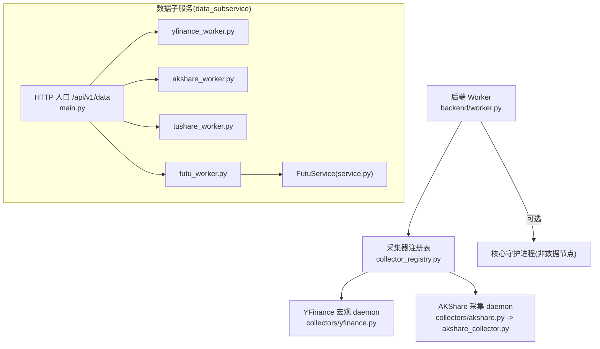
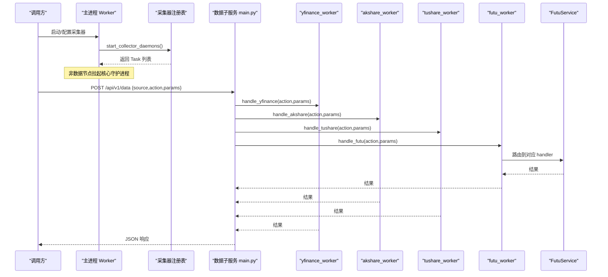
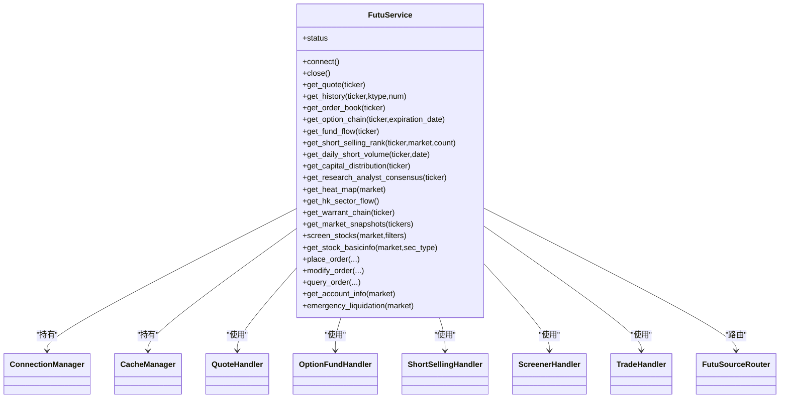
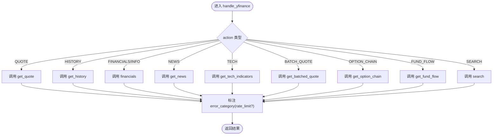
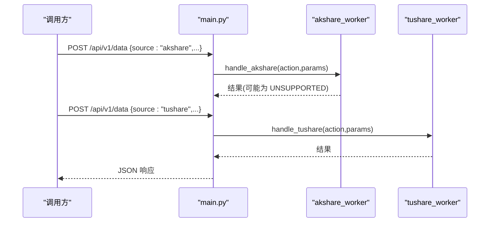
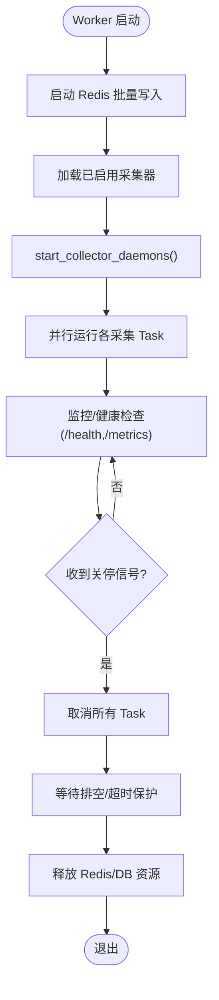
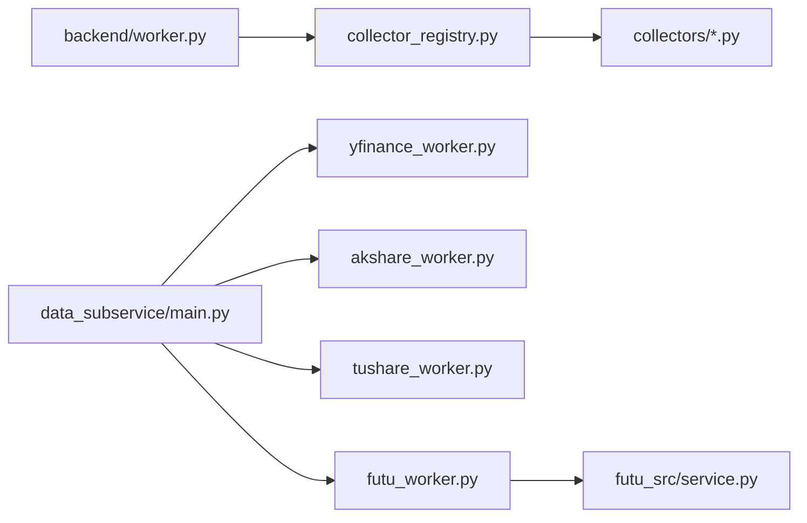

# 数据采集Worker

<cite>
**本文引用的文件**
- [backend/worker.py](file://backend/worker.py)
- [backend/workers/collector_registry.py](file://backend/workers/collector_registry.py)
- [backend/workers/collectors/yfinance.py](file://backend/workers/collectors/yfinance.py)
- [backend/workers/collectors/akshare.py](file://backend/workers/collectors/akshare.py)
- [backend/workers/akshare_collector.py](file://backend/workers/akshare_collector.py)
- [data_subservice/main.py](file://data_subservice/main.py)
- [data_subservice/yfinance_worker.py](file://data_subservice/yfinance_worker.py)
- [data_subservice/futu_worker.py](file://data_subservice/futu_worker.py)
- [data_subservice/akshare_worker.py](file://data_subservice/akshare_worker.py)
- [data_subservice/tushare_worker.py](file://data_subservice/tushare_worker.py)
- [data_subservice/futu_src/service.py](file://data_subservice/futu_src/service.py)
</cite>

## 目录
1. [简介](#简介)
2. [项目结构](#项目结构)
3. [核心组件](#核心组件)
4. [架构总览](#架构总览)
5. [详细组件分析](#详细组件分析)
6. [依赖关系分析](#依赖关系分析)
7. [性能与可扩展性](#性能与可扩展性)
8. [故障排查指南](#故障排查指南)
9. [结论](#结论)
10. [附录：自定义采集器实现示例](#附录自定义采集器实现示例)

## 简介
本文件面向 Quant Agent 的数据采集 Worker 系统，系统性说明以下能力：
- Futu OpenD 集成：行情订阅、Level 2 盘口、期权数据、资金流、卖空、分析师共识等。
- YFinance 实时数据采集：股票行情、历史K线、基本面、新闻、技术指标的异步采集与限流标注。
- AKShare/Tushare 统一接口：A股、港股、美股数据的统一 action/action 路由与错误分类（如 UNSUPPORTED）。
- Worker 调度机制：任务队列管理、资源分配、看门狗与心跳、优雅关停与故障转移。
- 自定义采集器扩展：如何新增采集器、数据转换、质量校验与可观测性。

## 项目结构
- 主进程 worker.py 负责启动 Redis 批量写入、按注册表启动各采集器守护进程，并在非数据节点上拉起若干后台服务。
- 采集器注册表 collector_registry.py 集中声明所有采集器及其工厂函数，worker 通过该表按需启动。
- data_subservice 提供独立 HTTP 子服务，暴露 /api/v1/data 统一入口，按 source 分发到 yfinance/akshare/tushare/futu 等 worker。
- Futu 子服务内部 service.py 封装连接、缓存与各 Handler，并通过路由器选择本地或远程数据源。

图表来源
- [backend/worker.py:34-103](file://backend/worker.py#L34-L103)
- [backend/workers/collector_registry.py:48-114](file://backend/workers/collector_registry.py#L48-L114)
- [data_subservice/main.py:189-234](file://data_subservice/main.py#L189-L234)
- [data_subservice/futu_src/service.py:31-116](file://data_subservice/futu_src/service.py#L31-L116)

章节来源
- [backend/worker.py:34-103](file://backend/worker.py#L34-L103)
- [backend/workers/collector_registry.py:48-114](file://backend/workers/collector_registry.py#L48-L114)
- [data_subservice/main.py:189-234](file://data_subservice/main.py#L189-L234)

## 核心组件
- Worker 主循环：启动 Redis 批量写入、按注册表启动采集器守护进程、拉起核心守护进程、统一优雅关停。
- 采集器注册表：集中声明采集器元数据与启动工厂；start_collector_daemons 遍历工厂创建协程并转为 Task。
- 数据子服务：HMAC 鉴权、能力门控（DS_CAPABILITIES）、统一路由、Prometheus 指标与健康探针。
- Futu 服务：单例模式、连接管理、缓存、Handler 模块化、本地/远程自动切换。

章节来源
- [backend/worker.py:34-103](file://backend/worker.py#L34-L103)
- [backend/workers/collector_registry.py:48-114](file://backend/workers/collector_registry.py#L48-L114)
- [data_subservice/main.py:70-111](file://data_subservice/main.py#L70-L111)
- [data_subservice/futu_src/service.py:31-116](file://data_subservice/futu_src/service.py#L31-L116)

## 架构总览
整体采用“主进程 + 子服务”解耦：
- 主进程负责编排与调度，不直接持有重型 SDK。
- 子服务作为叶子节点承载具体数据源 SDK 调用，对外暴露统一 HTTP 接口。
- Futu 子服务维护长连接与推送，具备看门狗自愈与交易/行情通道分离监控。

图表来源
- [backend/workers/collector_registry.py:97-114](file://backend/workers/collector_registry.py#L97-L114)
- [data_subservice/main.py:189-234](file://data_subservice/main.py#L189-L234)
- [data_subservice/yfinance_worker.py:51-104](file://data_subservice/yfinance_worker.py#L51-L104)
- [data_subservice/akshare_worker.py:9-69](file://data_subservice/akshare_worker.py#L9-L69)
- [data_subservice/tushare_worker.py:9-69](file://data_subservice/tushare_worker.py#L9-L69)
- [data_subservice/futu_worker.py:33-191](file://data_subservice/futu_worker.py#L33-L191)
- [data_subservice/futu_src/service.py:101-116](file://data_subservice/futu_src/service.py#L101-L116)

## 详细组件分析

### Futu OpenD 集成（行情、Level 2、期权）
- 统一入口：futu_worker.handle_futu 将 QUOTE/HISTORY/ORDER_BOOK/OPTION_CHAIN/FUNDAMENTAL/VALUATION/SHORT_SELLING/ANALYST_CONSENSUS/HEAT_MAP/WARRANT_CHAIN/SNAPSHOT/ACCOUNT_INFO/PLACE_ORDER/MODIFY_ORDER/QUERY_ORDER/EMERGENCY_LIQUIDATION 等 action 路由至 FutuService。
- 连接与路由：FutuService 以单例维护 ConnectionManager、CacheManager 与各 Handler，通过 _route 委托 FutuSourceRouter 选择 local/remote/auto。
- 健康与自愈：子服务启动时建立长连接并启动看门狗；/health 与 /futu/status 暴露真实连接状态（含交易通道解锁状态），避免误判。
- 账户未解锁处理：ACCOUNT_INFO 在交易未解锁时返回 success+空数据+trade_unlocked:false，避免上游熔断误杀行情。

图表来源
- [data_subservice/futu_src/service.py:31-116](file://data_subservice/futu_src/service.py#L31-L116)
- [data_subservice/futu_src/service.py:126-435](file://data_subservice/futu_src/service.py#L126-L435)

章节来源
- [data_subservice/futu_worker.py:33-191](file://data_subservice/futu_worker.py#L33-L191)
- [data_subservice/futu_src/service.py:31-116](file://data_subservice/futu_src/service.py#L31-L116)
- [data_subservice/main.py:124-172](file://data_subservice/main.py#L124-L172)

### YFinance 实时数据采集（行情、基本面、新闻）
- 子服务入口：yfinance_worker.handle_yfinance 支持 QUOTE/HISTORY/FUND_FLOW/OPTION_CHAIN/FINANCIALS/INFO/SEARCH/TECH/BATCH_QUOTE/NEWS。
- 限流标注：对包含 Yahoo 限流关键词的错误统一标注 error_category=rate_limit，使上游走退避而非熔断。
- 子服务能力：仅当 DS_CAPABILITIES 包含 yfinance 时才响应请求；否则 503。

图表来源
- [data_subservice/yfinance_worker.py:20-104](file://data_subservice/yfinance_worker.py#L20-L104)

章节来源
- [data_subservice/yfinance_worker.py:51-104](file://data_subservice/yfinance_worker.py#L51-L104)
- [data_subservice/main.py:175-234](file://data_subservice/main.py#L175-L234)

### AKShare/Tushare 统一接口（A股、港股、美股）
- AKShare：
  - 明确不支持港股 QUOTE/HISTORY/FUND_FLOW，返回 error_category=UNSUPPORTED，便于上层改走 Futu。
  - 支持 A 股行情/历史、资金流向、南向/北向、经济日历、板块资金流等。
- Tushare：
  - 支持 FINANCIALS/HOLDER/MONEYFLOW/STOCK_HISTORY/STOCK_QUOTE/FUNDAMENTAL(STOCK_LIST/LOWFREQ_HISTORY/MACRO)。
- 统一路由：data_subservice/main.py 根据 source 动态导入对应 worker，再调用 handle_<source>。

图表来源
- [data_subservice/main.py:189-234](file://data_subservice/main.py#L189-L234)
- [data_subservice/akshare_worker.py:9-69](file://data_subservice/akshare_worker.py#L9-L69)
- [data_subservice/tushare_worker.py:9-69](file://data_subservice/tushare_worker.py#L9-L69)

章节来源
- [data_subservice/akshare_worker.py:9-69](file://data_subservice/akshare_worker.py#L9-L69)
- [data_subservice/tushare_worker.py:9-69](file://data_subservice/tushare_worker.py#L9-L69)
- [data_subservice/main.py:189-234](file://data_subservice/main.py#L189-L234)

### Worker 调度机制（任务队列、资源分配、故障转移）
- 任务启动：worker.py 读取启用采集器列表，调用 start_collector_daemons 获取协程并转为 Task 并行运行。
- 守护进程：
  - YFinance 宏观 daemon 周期性拉取 K 线并写入 Redis 缓存键 yf_macro_cache_*。
  - AKShare 采集 daemon 按交易时段调整间隔，写回共享 Redis，供主服务 cache-mode 读取。
- 资源与健壮性：
  - 子服务 /health 暴露线程水位与 Futu 连接状态，辅助容量规划与故障定位。
  - Futu 看门狗保障长连接断连自愈；交易/行情通道状态分离观测。
  - 优雅关停：worker.py 在 finally 中取消所有 Task，等待排空后释放 Redis/DB 资源。

图表来源
- [backend/worker.py:34-103](file://backend/worker.py#L34-L103)
- [backend/workers/collector_registry.py:97-114](file://backend/workers/collector_registry.py#L97-L114)
- [data_subservice/main.py:91-111](file://data_subservice/main.py#L91-L111)

章节来源
- [backend/worker.py:34-103](file://backend/worker.py#L34-L103)
- [backend/workers/collector_registry.py:97-114](file://backend/workers/collector_registry.py#L97-L114)
- [backend/workers/collectors/yfinance.py:55-94](file://backend/workers/collectors/yfinance.py#L55-L94)
- [backend/workers/akshare_collector.py:150-207](file://backend/workers/akshare_collector.py#L150-L207)

## 依赖关系分析
- 主进程与注册表：worker.py 依赖 collector_registry.py 获取采集器定义与启动工厂。
- 子服务与 worker：main.py 根据 source 动态导入对应 worker，再调用 handle_<source>。
- Futu 内部依赖：futu_worker.py 依赖 futu_service.service.FutuService，后者组合多个 Handler 与路由器。

图表来源
- [backend/worker.py:20-30](file://backend/worker.py#L20-L30)
- [backend/workers/collector_registry.py:23-30](file://backend/workers/collector_registry.py#L23-L30)
- [data_subservice/main.py:32-47](file://data_subservice/main.py#L32-L47)
- [data_subservice/futu_worker.py:1-13](file://data_subservice/futu_worker.py#L1-L13)
- [data_subservice/futu_src/service.py:18-26](file://data_subservice/futu_src/service.py#L18-L26)

章节来源
- [backend/worker.py:20-30](file://backend/worker.py#L20-L30)
- [backend/workers/collector_registry.py:23-30](file://backend/workers/collector_registry.py#L23-L30)
- [data_subservice/main.py:32-47](file://data_subservice/main.py#L32-L47)

## 性能与可扩展性
- 并发与隔离：子服务通过 FastAPI 异步处理请求；Futu 长连接复用，减少握手开销。
- 限流与退避：YFinance 限流错误被识别并标注，配合上游熔断/退避策略降低雪崩风险。
- 缓存与降级：YFinance 宏观数据写入 Redis 缓存；AKShare 采集结果写共享 Redis，主服务可 cache-mode 读取。
- 容量观测：/health 暴露线程数告警阈值，/metrics 暴露 Prometheus 指标，便于横向扩容与弹性伸缩。
- 可扩展点：新增采集器仅需在注册表登记 factory，或在子服务添加 handle_<source> 并声明 DS_CAPABILITIES。

[本节为通用指导，无需特定文件引用]

## 故障排查指南
- Futu 连接与交易解锁：
  - 查看 /futu/status 确认行情与交易通道状态；若 trade_unlocked=false，需解锁交易账户后再访问账户相关接口。
- YFinance 限流：
  - 若返回 error_category=rate_limit，应触发退避重试而非熔断；检查上游是否误判为普通失败。
- AKShare 不支持港股：
  - 若返回 UNSUPPORTED，请在上层路由改走 Futu 获取港股行情/资金流。
- 子服务能力门控：
  - 若返回 503 且提示能力未启用，检查环境变量 DS_CAPABILITIES 是否包含对应 source。
- 优雅关停：
  - 观察 worker 日志中的“后台任务已优雅取消”与资源释放信息，确保无悬挂任务。

章节来源
- [data_subservice/main.py:124-172](file://data_subservice/main.py#L124-L172)
- [data_subservice/yfinance_worker.py:20-48](file://data_subservice/yfinance_worker.py#L20-L48)
- [data_subservice/akshare_worker.py:12-23](file://data_subservice/akshare_worker.py#L12-L23)
- [data_subservice/main.py:175-234](file://data_subservice/main.py#L175-L234)
- [backend/worker.py:84-103](file://backend/worker.py#L84-L103)

## 结论
本系统通过“主进程调度 + 子服务执行”的解耦架构，实现了多数据源的统一接入与稳定运行。Futu 长连接与看门狗保障了实时数据可靠性；YFinance/AKShare/Tushare 通过统一 action 路由与错误分类提升了容错与可观测性；Worker 调度机制提供了任务编排、资源管理与优雅关停能力。新增采集器可通过注册表与子服务 worker 快速扩展。

[本节为总结性内容，无需特定文件引用]

## 附录：自定义采集器实现示例
- 新增子服务 worker：
  - 在 data_subservice 下新增 xxx_worker.py，实现 handle_xxx(action, params)，返回标准字典（含 error_category 标注）。
  - 在 main.py 的 _WORKER_IMPORTS 中添加映射，并确保 DS_CAPABILITIES 包含该 source。
- 在主进程注册采集器：
  - 在 backend/workers/collectors/xxx.py 中实现 start() 工厂，返回协程列表。
  - 在 collector_registry.py 的 COLLECTORS 表中注册 CollectorDef(name, factory)。
- 数据转换与质量校验：
  - 在 worker 中对原始数据进行字段标准化、缺失值处理、异常值过滤。
  - 对限流/网络错误进行标注（如 rate_limit），对不支持场景标注 UNSUPPORTED。
- 示例路径参考：
  - YFinance 限流标注与 action 路由：[data_subservice/yfinance_worker.py:20-104](file://data_subservice/yfinance_worker.py#L20-L104)
  - AKShare 不支持港股标注与路由：[data_subservice/akshare_worker.py:12-23](file://data_subservice/akshare_worker.py#L12-L23)
  - Tushare action 路由：[data_subservice/tushare_worker.py:9-69](file://data_subservice/tushare_worker.py#L9-L69)
  - 注册表注册采集器：[backend/workers/collector_registry.py:48-85](file://backend/workers/collector_registry.py#L48-L85)
  - 子服务能力门控与路由：[data_subservice/main.py:175-234](file://data_subservice/main.py#L175-L234)

章节来源
- [data_subservice/yfinance_worker.py:20-104](file://data_subservice/yfinance_worker.py#L20-L104)
- [data_subservice/akshare_worker.py:12-23](file://data_subservice/akshare_worker.py#L12-L23)
- [data_subservice/tushare_worker.py:9-69](file://data_subservice/tushare_worker.py#L9-L69)
- [backend/workers/collector_registry.py:48-85](file://backend/workers/collector_registry.py#L48-L85)
- [data_subservice/main.py:175-234](file://data_subservice/main.py#L175-L234)
