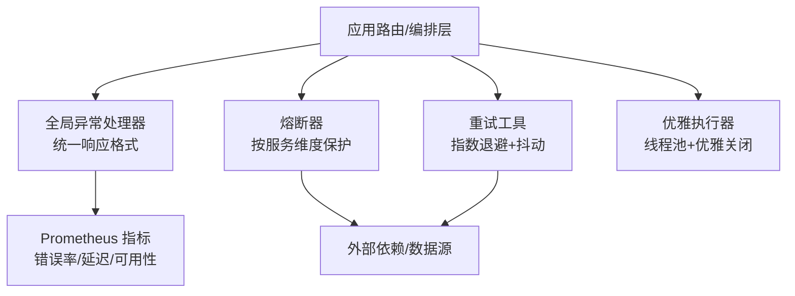
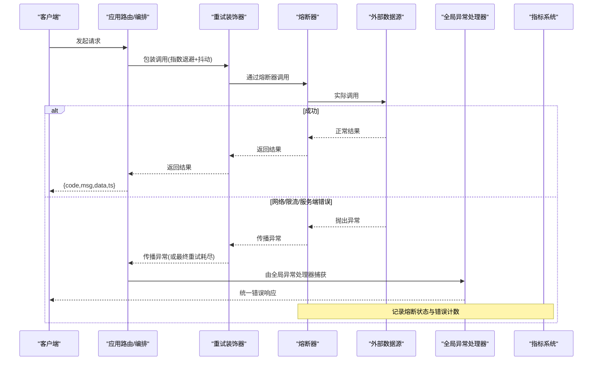
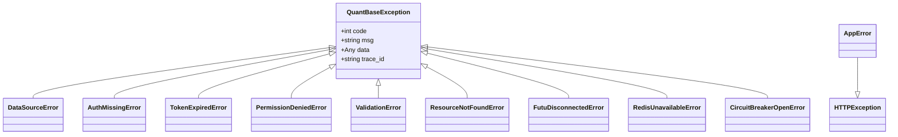
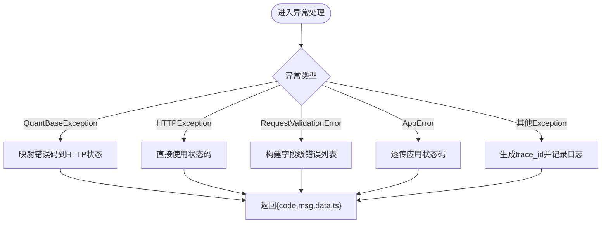
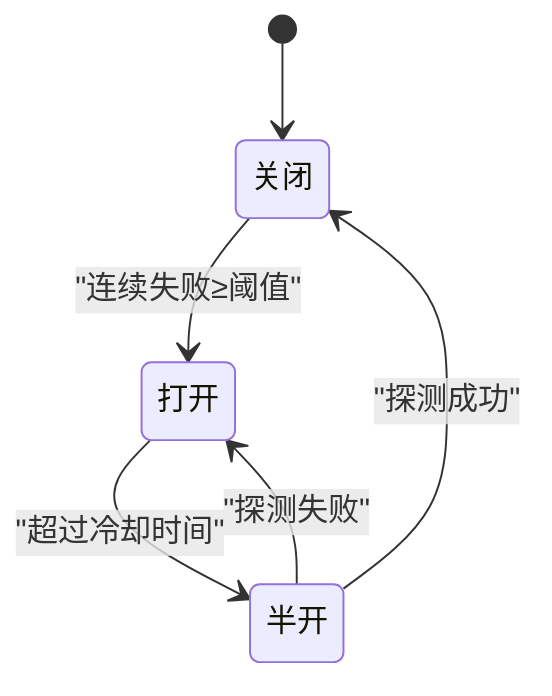
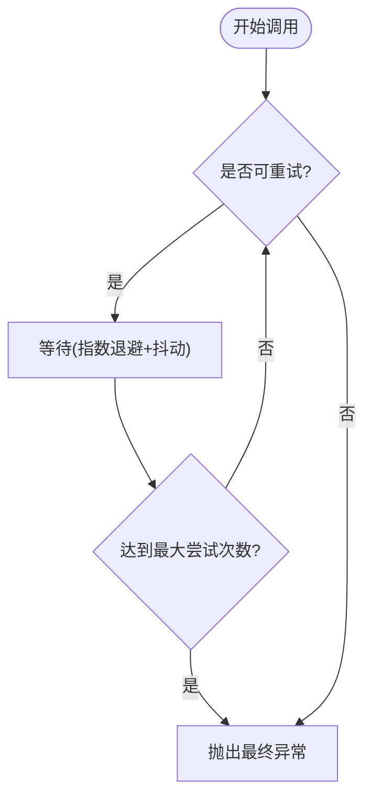
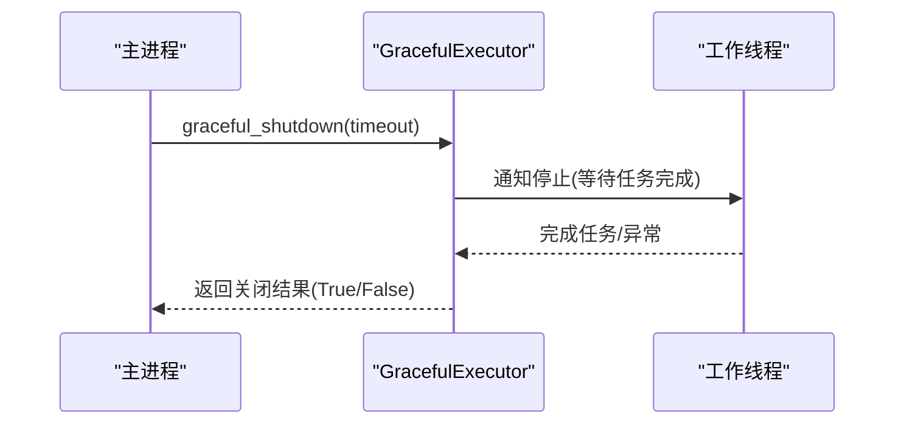
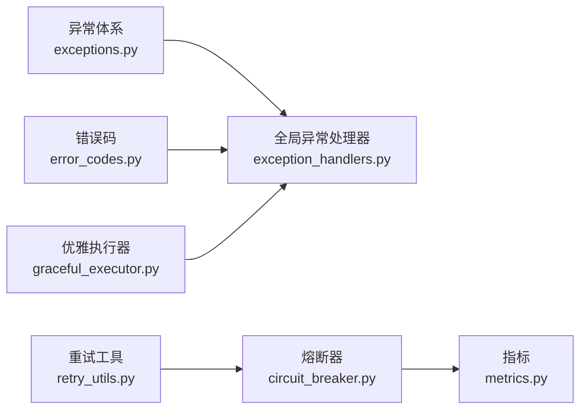

# 错误处理策略

<cite>
**本文引用的文件**
- [backend/core/exceptions.py](file://backend/core/exceptions.py)
- [backend/core/error_codes.py](file://backend/core/error_codes.py)
- [backend/core/exception_handlers.py](file://backend/core/exception_handlers.py)
- [backend/core/circuit_breaker.py](file://backend/core/circuit_breaker.py)
- [backend/core/retry_utils.py](file://backend/core/retry_utils.py)
- [backend/core/metrics.py](file://backend/core/metrics.py)
- [backend/core/graceful_executor.py](file://backend/core/graceful_executor.py)
</cite>

## 目录
1. [简介](#简介)
2. [项目结构](#项目结构)
3. [核心组件](#核心组件)
4. [架构总览](#架构总览)
5. [详细组件分析](#详细组件分析)
6. [依赖关系分析](#依赖关系分析)
7. [性能考量](#性能考量)
8. [故障排查指南](#故障排查指南)
9. [结论](#结论)
10. [附录](#附录)

## 简介
本文件系统化阐述 Quant Agent 的错误处理策略，覆盖网络异常、数据格式错误、服务不可用与优雅关闭等场景。文档聚焦于：
- 网络异常：连接超时、DNS 解析失败、SSL 证书错误的检测与恢复
- 数据格式错误：JSON 解析异常、字段缺失验证、数据类型转换错误
- 服务不可用：依赖降级、缓存回退、熔断与重试、优雅关闭
- 监控告警：错误率统计、趋势分析、自动告警触发
- 实践示例：自定义异常处理器、重试机制、错误日志记录

## 项目结构
Quant Agent 在 backend/core 层集中实现了统一的异常体系、全局异常处理器、熔断器、重试工具、指标与优雅执行器。这些组件共同构成“可观测、可恢复”的错误处理基座。

图表来源
- [backend/core/exception_handlers.py:18-101](file://backend/core/exception_handlers.py#L18-L101)
- [backend/core/circuit_breaker.py:64-218](file://backend/core/circuit_breaker.py#L64-L218)
- [backend/core/retry_utils.py:10-57](file://backend/core/retry_utils.py#L10-L57)
- [backend/core/metrics.py:96-110](file://backend/core/metrics.py#L96-L110)
- [backend/core/graceful_executor.py:26-165](file://backend/core/graceful_executor.py#L26-L165)

章节来源
- [backend/core/exception_handlers.py:1-101](file://backend/core/exception_handlers.py#L1-L101)
- [backend/core/circuit_breaker.py:1-379](file://backend/core/circuit_breaker.py#L1-L379)
- [backend/core/retry_utils.py:1-58](file://backend/core/retry_utils.py#L1-L58)
- [backend/core/metrics.py:1-641](file://backend/core/metrics.py#L1-L641)
- [backend/core/graceful_executor.py:1-204](file://backend/core/graceful_executor.py#L1-L204)

## 核心组件
- 统一异常体系：所有业务异常继承自基类，便于全局处理器统一捕获并转换为标准响应体 {code, msg, data, ts}，支持 trace_id 追踪。
- 全局异常处理器：注册 FastAPI 异常、请求校验异常与应用编排异常，兜底未知异常并生成 trace_id。
- 熔断器：按服务维度维护 CLOSED/OPEN/HALF_OPEN 状态机，支持限流错误过滤、半开探测、指标上报。
- 重试工具：基于 tenacity 的指数退避与随机抖动，定义可重试的网络错误集合（含限流、封禁、HTTP 5xx）。
- 指标与可观测性：提供熔断器状态、数据源错误、可用性、延迟等 Prometheus 指标，支撑监控与告警。
- 优雅执行器：线程池封装，支持异步优雅关闭与超时控制，避免进程退出时任务中断。

章节来源
- [backend/core/exceptions.py:14-144](file://backend/core/exceptions.py#L14-L144)
- [backend/core/error_codes.py:15-54](file://backend/core/error_codes.py#L15-L54)
- [backend/core/exception_handlers.py:18-101](file://backend/core/exception_handlers.py#L18-L101)
- [backend/core/circuit_breaker.py:64-379](file://backend/core/circuit_breaker.py#L64-L379)
- [backend/core/retry_utils.py:10-57](file://backend/core/retry_utils.py#L10-L57)
- [backend/core/metrics.py:96-110](file://backend/core/metrics.py#L96-L110)
- [backend/core/graceful_executor.py:26-165](file://backend/core/graceful_executor.py#L26-L165)

## 架构总览
下图展示一次外部 API 调用从进入应用到返回响应的错误处理路径，包括重试、熔断、指标与统一响应。

图表来源
- [backend/core/retry_utils.py:10-57](file://backend/core/retry_utils.py#L10-L57)
- [backend/core/circuit_breaker.py:147-218](file://backend/core/circuit_breaker.py#L147-L218)
- [backend/core/exception_handlers.py:18-101](file://backend/core/exception_handlers.py#L18-L101)
- [backend/core/metrics.py:96-110](file://backend/core/metrics.py#L96-L110)

## 详细组件分析

### 统一异常体系与错误码
- 设计要点
  - 所有业务异常继承自统一基类，携带 code/msg/data/trace_id，便于上层统一处理。
  - 认证鉴权、请求资源、基础设施三类异常分类清晰，配合错误码映射到 HTTP 状态码。
  - 应用编排层抛出的 AppError 直接透传状态码，保持最小侵入。
- 使用建议
  - 在数据源层、服务层抛出具体异常类型，不要直接抛出通用 Exception。
  - 为关键链路附加 trace_id，便于跨层追踪。

图表来源
- [backend/core/exceptions.py:14-144](file://backend/core/exceptions.py#L14-L144)
- [backend/core/error_codes.py:15-54](file://backend/core/error_codes.py#L15-L54)

章节来源
- [backend/core/exceptions.py:14-144](file://backend/core/exceptions.py#L14-L144)
- [backend/core/error_codes.py:15-54](file://backend/core/error_codes.py#L15-L54)

### 全局异常处理器
- 职责
  - 捕获 QuantBaseException、HTTPException、Pydantic 校验异常与应用编排异常，统一输出 {code, msg, data, ts}。
  - 对未预料异常进行兜底处理，生成 trace_id 并记录错误日志。
- 关键点
  - 校验失败统一映射为 VALIDATION_FAILED，便于前端提示。
  - 兜底处理器记录完整堆栈，便于定位根因。

图表来源
- [backend/core/exception_handlers.py:18-101](file://backend/core/exception_handlers.py#L18-L101)

章节来源
- [backend/core/exception_handlers.py:18-101](file://backend/core/exception_handlers.py#L18-L101)

### 熔断器（Circuit Breaker）
- 状态机
  - CLOSED → OPEN：连续失败达到阈值后触发熔断。
  - OPEN → HALF_OPEN：超过冷却时间后进行探测。
  - HALF_OPEN → CLOSED：探测成功恢复正常；探测失败回到 OPEN。
- 特性
  - 支持限流错误过滤（不计入失败计数），避免误熔断。
  - 暴露状态快照与指标，便于监控与告警。
  - 提供同步/异步调用与装饰器用法。
- 配置
  - 最大失败次数与冷却时间可通过环境变量配置，避免硬编码。

图表来源
- [backend/core/circuit_breaker.py:45-97](file://backend/core/circuit_breaker.py#L45-L97)
- [backend/core/circuit_breaker.py:147-218](file://backend/core/circuit_breaker.py#L147-L218)

章节来源
- [backend/core/circuit_breaker.py:45-379](file://backend/core/circuit_breaker.py#L45-L379)

### 重试机制（指数退避+抖动）
- 可重试错误
  - 外部接口限流与封禁（如 429、403、Rate Limit、Too Many Requests、Forbidden）。
  - Futu 频率限制与底层连接异常（频繁、timeout、特定错误码）。
  - 网络请求底层异常（httpx.RequestError）。
  - 服务端错误状态码（403、429、500、502、503、504）。
- 行为
  - 指数退避等待，带随机抖动，最多尝试固定次数。
  - 每次重试前记录日志，便于定位问题。
- 使用建议
  - 仅对幂等或可安全重试的请求使用。
  - 结合熔断器使用，避免雪崩。

图表来源
- [backend/core/retry_utils.py:10-57](file://backend/core/retry_utils.py#L10-L57)

章节来源
- [backend/core/retry_utils.py:10-57](file://backend/core/retry_utils.py#L10-L57)

### 优雅关闭与线程池管理
- 目标
  - 在进程关闭时等待正在执行的任务完成，避免中断导致的数据不一致。
  - 支持超时控制，防止无限等待影响部署流程。
- 能力
  - 重写 submit 返回 asyncio.Future，便于生命周期管理。
  - 统计提交数、完成数、活跃任务数，便于观察。
  - 优雅关闭方法支持超时与异常处理。

图表来源
- [backend/core/graceful_executor.py:60-165](file://backend/core/graceful_executor.py#L60-L165)

章节来源
- [backend/core/graceful_executor.py:26-165](file://backend/core/graceful_executor.py#L26-L165)

### 监控与告警（错误率、趋势、自动告警）
- 指标覆盖
  - 熔断器状态与状态转换次数，用于判断服务健康度。
  - 数据源错误总数、限流次数、可用性状态，用于评估外部依赖质量。
  - 主动拨测成功率与延迟分布，用于无流量时的存活感知。
  - 数据质量指标（脏数据率、字段缺失、价格异常、过期等），用于数据可信度评估。
- 告警建议
  - 错误率突增：基于 DATASOURCE_ERRORS 的 rate() 设置阈值告警。
  - 熔断频繁切换：基于 CIRCUIT_BREAKER_TRANSITIONS 的 increase() 设置告警。
  - 可用性下降：DATASOURCE_AVAILABILITY 持续为 0 时触发告警。
  - 数据质量劣化：DATA_QUALITY_DIRTY_RATE 或 MISSING_FIELDS 超阈值告警。

章节来源
- [backend/core/metrics.py:96-110](file://backend/core/metrics.py#L96-L110)
- [backend/core/metrics.py:155-217](file://backend/core/metrics.py#L155-L217)
- [backend/core/metrics.py:386-444](file://backend/core/metrics.py#L386-L444)

## 依赖关系分析
- 耦合与内聚
  - 异常体系与错误码高度内聚，被全局异常处理器与熔断器复用。
  - 熔断器依赖指标模块进行状态与转换计数，提升可观测性。
  - 重试工具与熔断器互补：重试解决瞬时故障，熔断保护长期故障。
- 外部依赖
  - httpx：网络请求异常识别与重试判定。
  - tenacity：重试策略实现。
  - prometheus_client：指标采集。
- 潜在循环依赖
  - 当前模块间依赖方向清晰，未见循环导入迹象。

图表来源
- [backend/core/exceptions.py:14-144](file://backend/core/exceptions.py#L14-L144)
- [backend/core/error_codes.py:15-54](file://backend/core/error_codes.py#L15-L54)
- [backend/core/exception_handlers.py:18-101](file://backend/core/exception_handlers.py#L18-L101)
- [backend/core/circuit_breaker.py:64-218](file://backend/core/circuit_breaker.py#L64-L218)
- [backend/core/retry_utils.py:10-57](file://backend/core/retry_utils.py#L10-L57)
- [backend/core/metrics.py:96-110](file://backend/core/metrics.py#L96-L110)
- [backend/core/graceful_executor.py:26-165](file://backend/core/graceful_executor.py#L26-L165)

章节来源
- [backend/core/exceptions.py:14-144](file://backend/core/exceptions.py#L14-L144)
- [backend/core/error_codes.py:15-54](file://backend/core/error_codes.py#L15-L54)
- [backend/core/exception_handlers.py:18-101](file://backend/core/exception_handlers.py#L18-L101)
- [backend/core/circuit_breaker.py:64-218](file://backend/core/circuit_breaker.py#L64-L218)
- [backend/core/retry_utils.py:10-57](file://backend/core/retry_utils.py#L10-L57)
- [backend/core/metrics.py:96-110](file://backend/core/metrics.py#L96-L110)
- [backend/core/graceful_executor.py:26-165](file://backend/core/graceful_executor.py#L26-L165)

## 性能考量
- 重试与熔断的组合
  - 重试适用于瞬时网络波动与限流，但需限制最大尝试次数与退避上限，避免放大负载。
  - 熔断在持续失败时快速失败，减少无效请求与资源消耗。
- 指标开销
  - 高频指标（Summary/Histogram）应合理设置桶与标签基数，避免内存增长。
  - 计数器（Counter）适合错误率与限流计数，查询成本低。
- 优雅关闭
  - 设置合理的超时时间，确保关键任务完成，同时避免阻塞部署。
  - 监控活跃任务数，发现长尾任务并及时优化。

[本节为通用指导，不直接分析具体文件]

## 故障排查指南
- 网络异常
  - 连接超时/DNS/SSL 错误：检查重试条件是否命中，确认 DNS 与证书配置；若频繁出现，关注熔断器是否开启。
  - 参考：重试可重试错误判定、熔断器状态与日志。
- 数据格式错误
  - JSON 解析异常/字段缺失/类型转换错误：由全局校验处理器统一返回字段级错误信息，前端据此提示。
  - 参考：请求参数校验异常处理器。
- 服务不可用
  - 依赖服务降级：结合熔断器与缓存回退（如 STALE 缓存），在外部不可用时返回降级数据。
  - 优雅关闭：使用优雅执行器确保任务完成，避免数据丢失。
- 监控与告警
  - 错误率突增：查看 DATASOURCE_ERRORS 与 CIRCUIT_BREAKER_TRANSITIONS。
  - 可用性下降：查看 DATASOURCE_AVAILABILITY 与主动拨测指标。
  - 数据质量劣化：查看 DATA_QUALITY_DIRTY_RATE、MISSING_FIELDS、PRICE_ANOMALY。

章节来源
- [backend/core/retry_utils.py:10-57](file://backend/core/retry_utils.py#L10-L57)
- [backend/core/circuit_breaker.py:147-218](file://backend/core/circuit_breaker.py#L147-L218)
- [backend/core/exception_handlers.py:45-57](file://backend/core/exception_handlers.py#L45-L57)
- [backend/core/metrics.py:155-217](file://backend/core/metrics.py#L155-L217)
- [backend/core/metrics.py:386-444](file://backend/core/metrics.py#L386-L444)

## 结论
Quant Agent 的错误处理策略以“统一异常 + 全局处理器 + 熔断 + 重试 + 指标 + 优雅关闭”为核心，形成闭环：
- 统一异常与错误码保证响应一致性与可追踪性。
- 熔断与重试协同应对瞬时与长期故障，提升鲁棒性。
- 指标与告警提供可视化与自动化运维能力。
- 优雅关闭保障进程退出时的数据一致性与用户体验。

[本节为总结，不直接分析具体文件]

## 附录
- 自定义异常处理器示例（路径指引）
  - 参考：全局异常处理器注册与处理逻辑
    - [backend/core/exception_handlers.py:18-101](file://backend/core/exception_handlers.py#L18-L101)
- 重试机制示例（路径指引）
  - 参考：重试条件与装饰器配置
    - [backend/core/retry_utils.py:10-57](file://backend/core/retry_utils.py#L10-L57)
- 错误日志记录示例（路径指引）
  - 参考：兜底异常处理器中的日志记录
    - [backend/core/exception_handlers.py:76-90](file://backend/core/exception_handlers.py#L76-L90)
- 错误监控与告警示例（路径指引）
  - 参考：熔断器指标与数据源指标
    - [backend/core/metrics.py:96-110](file://backend/core/metrics.py#L96-L110)
    - [backend/core/metrics.py:155-217](file://backend/core/metrics.py#L155-L217)
