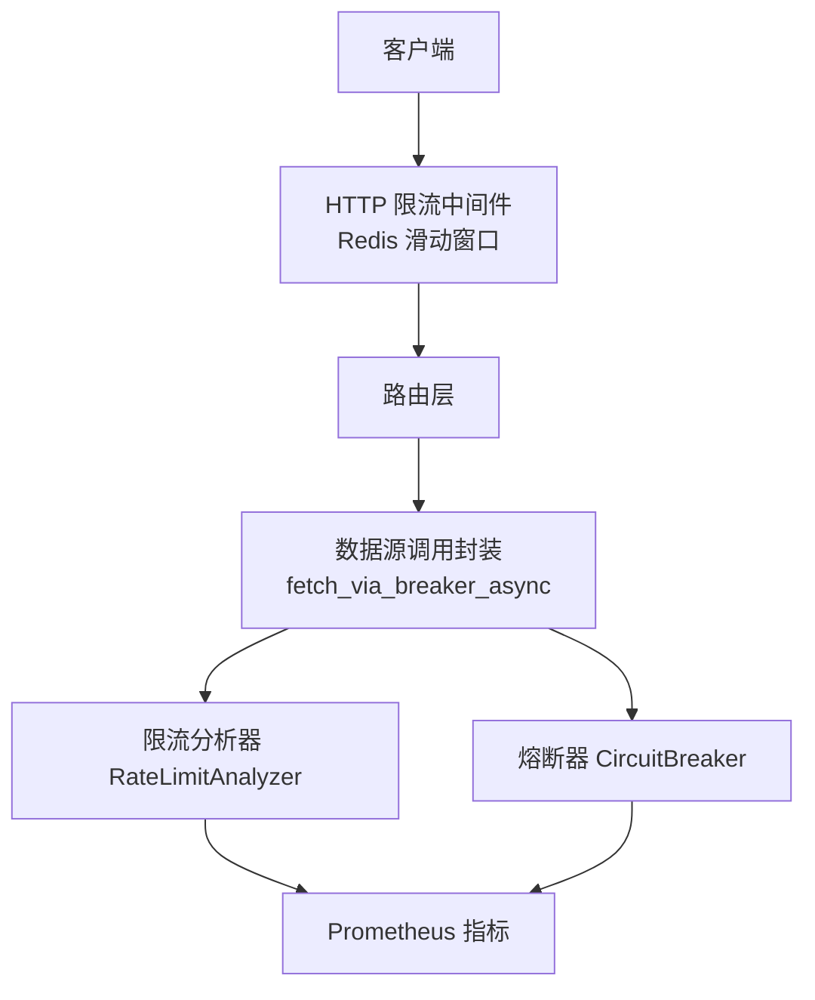
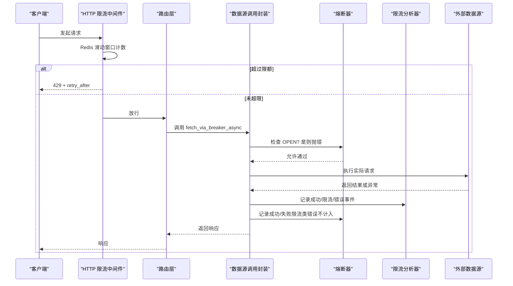
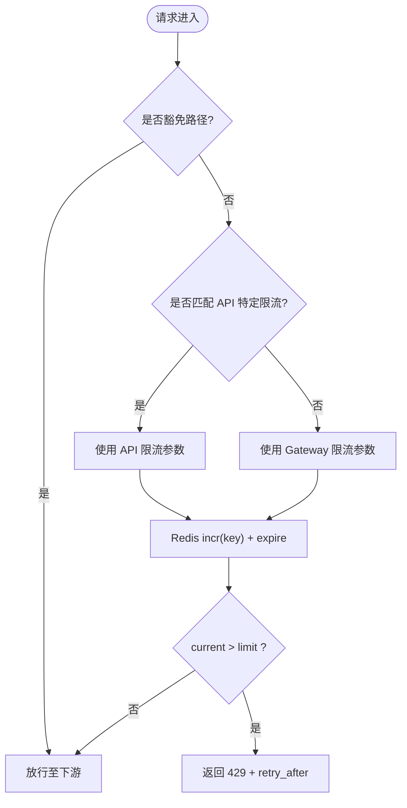
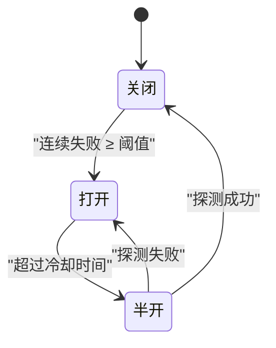
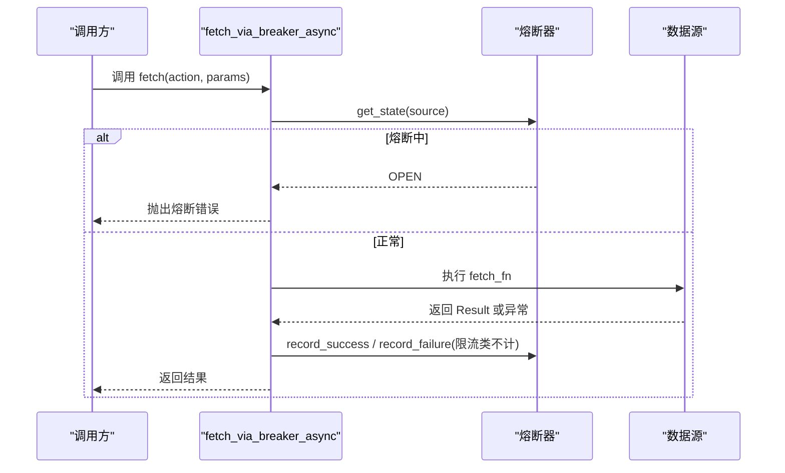
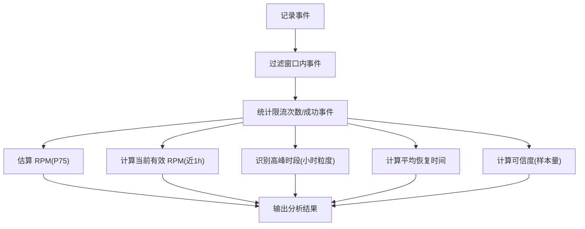
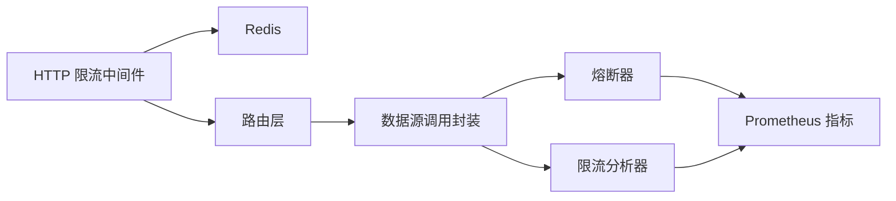

# 限流控制机制

<cite>
**本文引用的文件**
- [backend/middleware/stack.py](file://backend/middleware/stack.py)
- [backend/core/circuit_breaker.py](file://backend/core/circuit_breaker.py)
- [backend/core/circuit_breaker_integration.py](file://backend/core/circuit_breaker_integration.py)
- [backend/services/datasource/analyzer.py](file://backend/services/datasource/analyzer.py)
- [backend/routers/datasource.py](file://backend/routers/datasource.py)
- [backend/core/metrics.py](file://backend/core/metrics.py)
- [backend/tests/test_ratelimit_analyzer_full.py](file://backend/tests/test_ratelimit_analyzer_full.py)
- [backend/tests/test_svc08_finnhub_ratelimit.py](file://backend/tests/test_svc08_finnhub_ratelimit.py)
</cite>

## 目录
1. [简介](#简介)
2. [项目结构](#项目结构)
3. [核心组件](#核心组件)
4. [架构总览](#架构总览)
5. [详细组件分析](#详细组件分析)
6. [依赖关系分析](#依赖关系分析)
7. [性能考量](#性能考量)
8. [故障排查指南](#故障排查指南)
9. [结论](#结论)
10. [附录](#附录)

## 简介
本文件面向 Quant Agent 的限流控制系统，系统性说明 API 配额管理、请求频率限制、并发连接控制与带宽监控；解释令牌桶算法在系统中的落地方式（含令牌生成速率、桶容量配置、突发流量处理）；阐述熔断器模式的应用（服务降级、故障隔离、自动恢复）；并提供可操作的配置示例、自定义限流器实现思路、限流效果监控方法以及策略优化建议（动态阈值、智能限流、多租户隔离）。

## 项目结构
Quant Agent 的限流控制由三层构成：
- HTTP 网关层：基于 Redis 的全局与接口级限流中间件，提供快速拒绝与退避提示。
- 数据源调用层：统一的熔断器封装，将外部数据源调用纳入“失败计数—熔断—半开探测—恢复”的状态机管理，并区分限流类错误与普通错误。
- 分析与观测层：按数据源维度记录事件序列，动态推测限流阈值、高峰时段、平均恢复时间，并通过指标暴露给监控系统。

图表来源
- [backend/middleware/stack.py:167-220](file://backend/middleware/stack.py#L167-L220)
- [backend/core/circuit_breaker_integration.py:40-72](file://backend/core/circuit_breaker_integration.py#L40-L72)
- [backend/core/circuit_breaker.py:64-218](file://backend/core/circuit_breaker.py#L64-L218)
- [backend/services/datasource/analyzer.py:136-315](file://backend/services/datasource/analyzer.py#L136-L315)
- [backend/core/metrics.py:100-110](file://backend/core/metrics.py#L100-L110)

章节来源
- [backend/middleware/stack.py:40-73](file://backend/middleware/stack.py#L40-L73)
- [backend/core/circuit_breaker_integration.py:1-16](file://backend/core/circuit_breaker_integration.py#L1-L16)
- [backend/services/datasource/analyzer.py:1-13](file://backend/services/datasource/analyzer.py#L1-L13)

## 核心组件
- HTTP 分级限流中间件：支持 Gateway 级别与 API 特定级别的限流，使用 Redis 原子递增+过期键实现滑动窗口计数，返回 429 并附带重试间隔。
- 熔断器 CircuitBreaker：维护 CLOSED/OPEN/HALF_OPEN 三态，支持异步/同步调用包装与装饰器，限流类错误不计入失败计数，避免误触发熔断。
- 数据源调用封装：统一接入 fetch_via_breaker_async，对异常与 Result 进行判定，记录成功/失败并联动熔断器与限流分析器。
- 限流分析器 RateLimitAnalyzer：基于事件时间序列，估算 RPM、推荐安全间隔、识别高峰时段、计算平均恢复时间与可信度。
- 指标与监控：暴露熔断器状态、转换次数、数据源延迟/错误/限流计数等 Prometheus 指标。

章节来源
- [backend/middleware/stack.py:167-220](file://backend/middleware/stack.py#L167-L220)
- [backend/core/circuit_breaker.py:64-218](file://backend/core/circuit_breaker.py#L64-L218)
- [backend/core/circuit_breaker_integration.py:40-72](file://backend/core/circuit_breaker_integration.py#L40-L72)
- [backend/services/datasource/analyzer.py:136-315](file://backend/services/datasource/analyzer.py#L136-L315)
- [backend/core/metrics.py:100-110](file://backend/core/metrics.py#L100-L110)

## 架构总览
下图展示一次数据源请求从进入网关到落地的完整路径，包括限流、熔断与分析埋点。

图表来源
- [backend/middleware/stack.py:167-220](file://backend/middleware/stack.py#L167-L220)
- [backend/core/circuit_breaker_integration.py:40-72](file://backend/core/circuit_breaker_integration.py#L40-L72)
- [backend/core/circuit_breaker.py:147-218](file://backend/core/circuit_breaker.py#L147-L218)
- [backend/services/datasource/analyzer.py:194-244](file://backend/services/datasource/analyzer.py#L194-L244)

## 详细组件分析

### HTTP 分级限流中间件
- 功能要点
  - 豁免路径直接放行（健康检查、静态资源、WebSocket 等）。
  - 支持 Gateway 全局限流与 API 特定限流，后者优先匹配。
  - 使用 Redis 管道原子递增 key 并设置过期，统计窗口内请求数。
  - 超过限额返回 429，包含 message 与 retry_after。
  - Redis 不可用时，测试环境放行，生产环境拒绝非豁免请求以防御攻击。
- 关键配置项
  - 全局限流：GATEWAY_RATE_LIMIT、GATEWAY_RATE_WINDOW
  - API 特定限流：API_SPECIFIC_LIMITS（路径 -> (limit, window)）
  - 豁免路径：SKIP_PATHS
- 典型用法
  - 为高成本或易被限流的接口单独配置更严格的 limit/window，如筛选器、回测运行、AI 对话等。

图表来源
- [backend/middleware/stack.py:167-220](file://backend/middleware/stack.py#L167-L220)

章节来源
- [backend/middleware/stack.py:40-73](file://backend/middleware/stack.py#L40-L73)
- [backend/middleware/stack.py:167-220](file://backend/middleware/stack.py#L167-L220)

### 熔断器 CircuitBreaker
- 状态机
  - CLOSED → OPEN：连续失败达到阈值后触发。
  - OPEN → HALF_OPEN：超过冷却时间后进入半开探测。
  - HALF_OPEN → CLOSED：探测成功恢复；HALF_OPEN → OPEN：探测失败再次熔断。
- 限流解耦
  - 限流类错误不计入失败计数，避免误熔断。
  - 支持 per-call error_classifier 覆盖默认判定逻辑。
- 使用方式
  - 异步 call()/call_sync() 包装函数。
  - 装饰器 @guard("service") 自动包裹。
  - 手动 record_failure/record_success/reset/status_snapshot。
- 指标
  - 当前状态 Gauge、状态转换 Counter。

图表来源
- [backend/core/circuit_breaker.py:45-98](file://backend/core/circuit_breaker.py#L45-L98)
- [backend/core/circuit_breaker.py:147-218](file://backend/core/circuit_breaker.py#L147-L218)

章节来源
- [backend/core/circuit_breaker.py:45-98](file://backend/core/circuit_breaker.py#L45-L98)
- [backend/core/circuit_breaker.py:147-218](file://backend/core/circuit_breaker.py#L147-L218)
- [backend/core/metrics.py:100-110](file://backend/core/metrics.py#L100-L110)

### 数据源调用封装（fetch_via_breaker_async）
- 职责
  - 在 OPEN 时直接抛出熔断错误，避免继续施压。
  - 捕获异常并记录失败（限流类错误标记不污染熔断计数）。
  - 对 Result 的成功/失败进行判定，分别记录成功或失败。
  - 支持 exempt_from_breaker 豁免某些 action 的失败计入全局熔断。
- 与限流分析器集成
  - 成功/限流/错误事件均上报至分析器，用于后续 RPM 估计与高峰识别。

图表来源
- [backend/core/circuit_breaker_integration.py:40-72](file://backend/core/circuit_breaker_integration.py#L40-L72)
- [backend/core/circuit_breaker.py:147-218](file://backend/core/circuit_breaker.py#L147-L218)

章节来源
- [backend/core/circuit_breaker_integration.py:25-72](file://backend/core/circuit_breaker_integration.py#L25-L72)

### 限流分析器 RateLimitAnalyzer
- 能力
  - 记录请求事件（成功/限流/错误），支持延迟采样。
  - 估算限流阈值 RPM（成功请求 RPM 的 P75）。
  - 计算当前有效 RPM（最近 1h 的实际速率）。
  - 识别限流高峰时段（小时粒度，限流率超阈值）。
  - 计算平均恢复时间（限流事件到下一次成功的平均秒数）。
  - 输出可信度（样本量越大越可信）。
- 健康看板
  - 提供今日调用量、成功率、限流分类、最近延迟等指标。
- 清理与内存控制
  - 固定最大事件数与窗口清理，防止内存膨胀。

图表来源
- [backend/services/datasource/analyzer.py:250-315](file://backend/services/datasource/analyzer.py#L250-L315)
- [backend/services/datasource/analyzer.py:321-462](file://backend/services/datasource/analyzer.py#L321-L462)

章节来源
- [backend/services/datasource/analyzer.py:136-315](file://backend/services/datasource/analyzer.py#L136-L315)
- [backend/services/datasource/analyzer.py:487-532](file://backend/services/datasource/analyzer.py#L487-L532)
- [backend/tests/test_ratelimit_analyzer_full.py:29-195](file://backend/tests/test_ratelimit_analyzer_full.py#L29-L195)

### 限流状态与概览接口
- 单源限流分析：GET /{name}/rate-limit-analysis
- 单源实时退避状态：GET /{name}/rate-limit-status
- 全局限流概览：GET /rate-limit-overview
- Finnhub 健康探针（限流感知）：GET /finnhub/health

这些接口聚合 throttler 与 analyzer 的结果，便于运维与前端可视化。

章节来源
- [backend/routers/datasource.py:65-152](file://backend/routers/datasource.py#L65-L152)
- [backend/routers/datasource.py:155-182](file://backend/routers/datasource.py#L155-L182)
- [backend/tests/test_svc08_finnhub_ratelimit.py:31-80](file://backend/tests/test_svc08_finnhub_ratelimit.py#L31-L80)

## 依赖关系分析
- 中间件依赖 Redis 做滑动窗口计数；熔断器依赖内部状态与指标；分析器依赖事件队列与线程锁；路由层聚合 throttler/analyzer 状态。
- 指标层统一暴露熔断器状态与转换次数、数据源延迟/错误/限流计数等。

图表来源
- [backend/middleware/stack.py:167-220](file://backend/middleware/stack.py#L167-L220)
- [backend/core/circuit_breaker_integration.py:40-72](file://backend/core/circuit_breaker_integration.py#L40-L72)
- [backend/core/metrics.py:100-110](file://backend/core/metrics.py#L100-L110)

章节来源
- [backend/middleware/stack.py:167-220](file://backend/middleware/stack.py#L167-L220)
- [backend/core/metrics.py:100-110](file://backend/core/metrics.py#L100-L110)

## 性能考量
- 中间件层面
  - 使用 Redis 管道减少网络往返；key 带过期避免持久化膨胀。
  - 豁免路径减少不必要检查，降低开销。
- 熔断器层面
  - 限流类错误不计入失败计数，避免误熔断导致雪崩。
  - 半开探测控制探测频率，平衡恢复速度与稳定性。
- 分析器层面
  - 固定最大事件数与窗口清理，控制内存占用。
  - 小时粒度统计与合并区间，降低复杂度。
- 指标层面
  - 使用直方图与计数器，避免高频写放大。

[本节为通用指导，不直接分析具体文件]

## 故障排查指南
- 常见问题
  - Redis 不可用：中间件在生产环境会拒绝非豁免请求，需检查 Redis 连接与健康。
  - 频繁 429：检查 API 特定限流配置是否过严，或上游数据源真实限流阈值较低。
  - 熔断频繁开启：确认限流类错误是否正确标记，避免误判普通错误为限流。
- 定位手段
  - 查看限流概览与单源状态接口，获取 is_throttled、consecutive_rate_limits、estimated_limit_rpm 等。
  - 查看熔断器状态与转换指标，判断是否处于 OPEN/HALF_OPEN。
  - 查看数据源延迟与错误指标，辅助定位慢请求与错误类型。

章节来源
- [backend/middleware/stack.py:167-220](file://backend/middleware/stack.py#L167-L220)
- [backend/routers/datasource.py:65-152](file://backend/routers/datasource.py#L65-L152)
- [backend/core/metrics.py:100-110](file://backend/core/metrics.py#L100-L110)

## 结论
Quant Agent 的限流控制采用“网关快速拒绝 + 熔断保护 + 动态分析”的分层设计，既能抵御突发流量与上游限流，又能通过数据分析持续优化阈值与策略。结合 Prometheus 指标与可视化接口，可实现可观测、可调节、可扩展的限流体系。

[本节为总结性内容，不直接分析具体文件]

## 附录

### 令牌桶算法在系统中的体现
- 令牌生成速率：可通过 API 特定限流的 limit/window 近似理解为“每窗口允许的令牌数”，例如某接口每分钟允许 N 次请求。
- 桶容量配置：window 即为桶容量上限，超出部分将被拒绝。
- 突发流量处理：中间件在窗口内累计计数，突发请求超过 limit 即返回 429；若需更平滑的突发控制，可在上层引入自适应退避（参考分析器的 recommended_interval_seconds）。

章节来源
- [backend/middleware/stack.py:40-73](file://backend/middleware/stack.py#L40-L73)
- [backend/middleware/stack.py:167-220](file://backend/middleware/stack.py#L167-L220)
- [backend/services/datasource/analyzer.py:368-378](file://backend/services/datasource/analyzer.py#L368-L378)

### 配置示例（概念性）
- 网关全局限流：设置 GATEWAY_RATE_LIMIT 与 GATEWAY_RATE_WINDOW，作为兜底防护。
- API 特定限流：为高风险接口（如筛选器、回测、AI 对话）配置更严格的 limit/window。
- 熔断器参数：通过环境变量调整 max_failures 与 recovery_timeout，平衡敏感度与稳定性。
- 分析器窗口：根据业务需求调整 window_seconds 与 max_events，兼顾精度与内存。

[本节为概念性配置说明，不直接引用代码片段]

### 自定义限流器实现思路
- 扩展中间件：新增自定义限流策略（如漏桶、令牌桶），替换或叠加现有滑动窗口逻辑。
- 扩展熔断器：覆写 is_rate_limit_error 或注入 error_classifier，适配新的错误分类。
- 扩展分析器：增加新的统计维度（如按租户、按用户 ID 分桶），并在路由层暴露新接口。

[本节为概念性扩展指导，不直接引用代码片段]

### 监控与可视化
- 熔断器指标：quant_circuit_breaker_state、quant_circuit_breaker_transitions_total。
- 数据源指标：quant_datasource_latency_milliseconds、quant_datasource_errors_total、quant_datasource_rate_limits_total。
- 健康看板：通过 /datasource/{name}/rate-limit-analysis 与 /datasource/{name}/rate-limit-status 获取细粒度信息。

章节来源
- [backend/core/metrics.py:100-110](file://backend/core/metrics.py#L100-L110)
- [backend/core/metrics.py:155-182](file://backend/core/metrics.py#L155-L182)
- [backend/routers/datasource.py:65-152](file://backend/routers/datasource.py#L65-L152)

### 限流策略优化建议
- 动态调整阈值：基于分析器的 estimated_limit_rpm 与 current_effective_rpm，周期性调优 API_SPECIFIC_LIMITS。
- 智能限流算法：引入自适应退避，根据 recommended_interval_seconds 动态调整请求间隔。
- 多租户限流隔离：在限流 key 中加入租户标识（如 rate_limit:{path}:{tenant}:{client_ip}），实现租户级配额隔离。

[本节为策略优化建议，不直接分析具体文件]