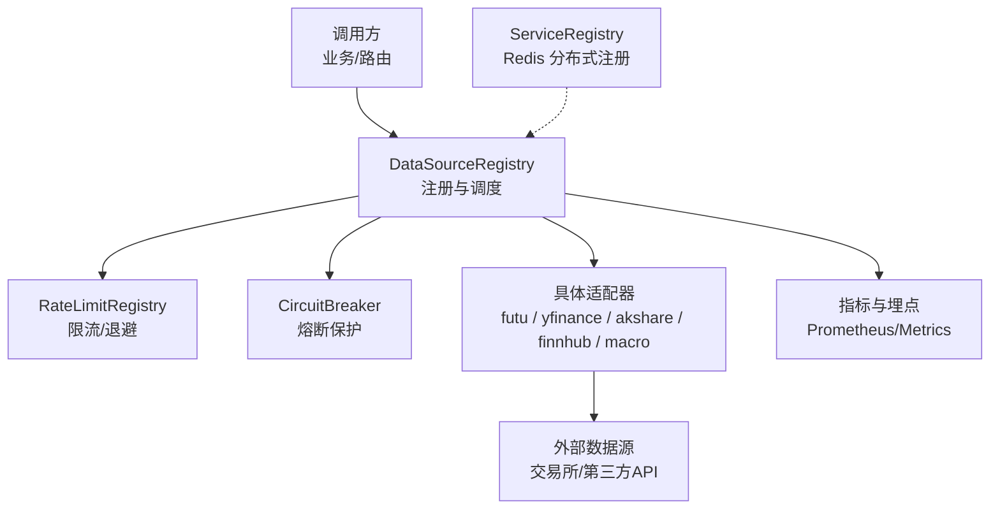
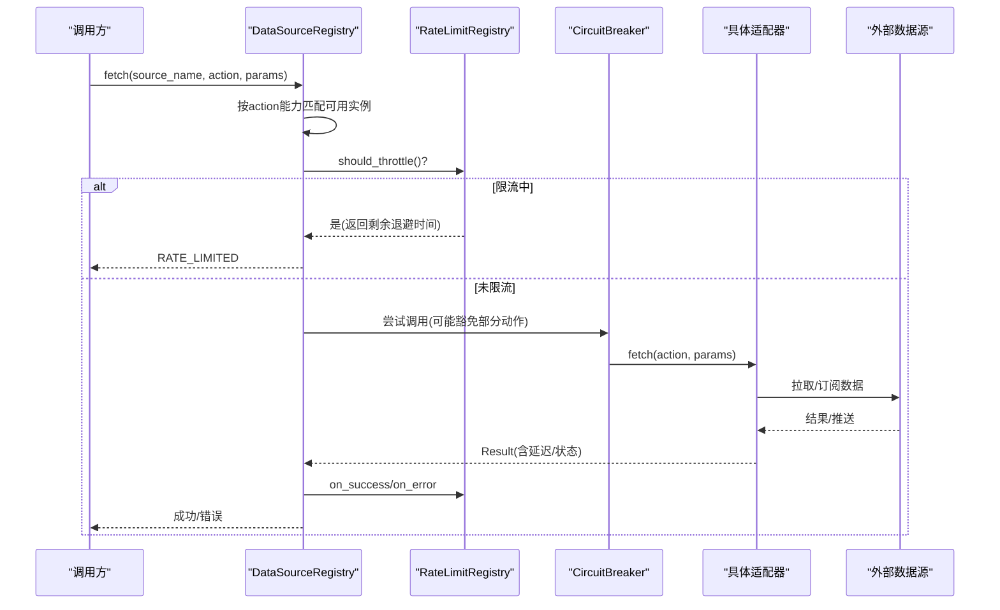
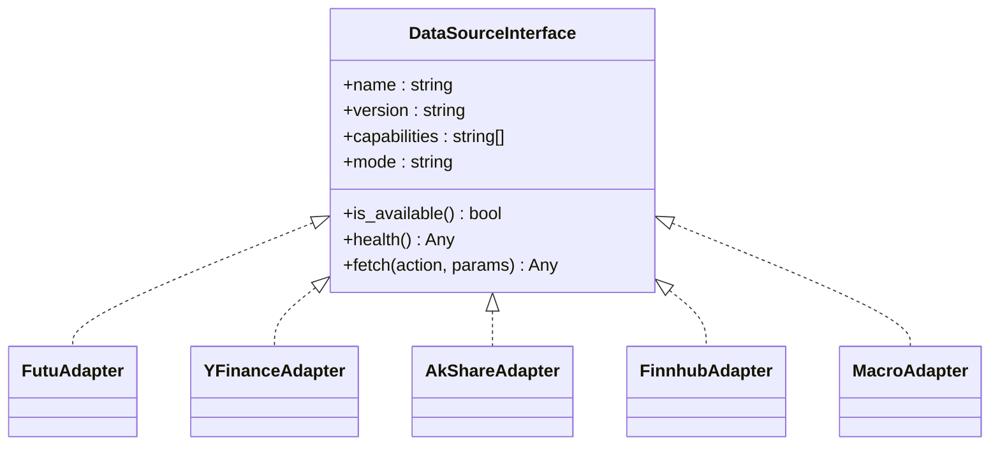
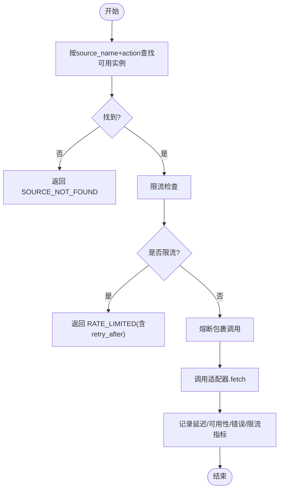
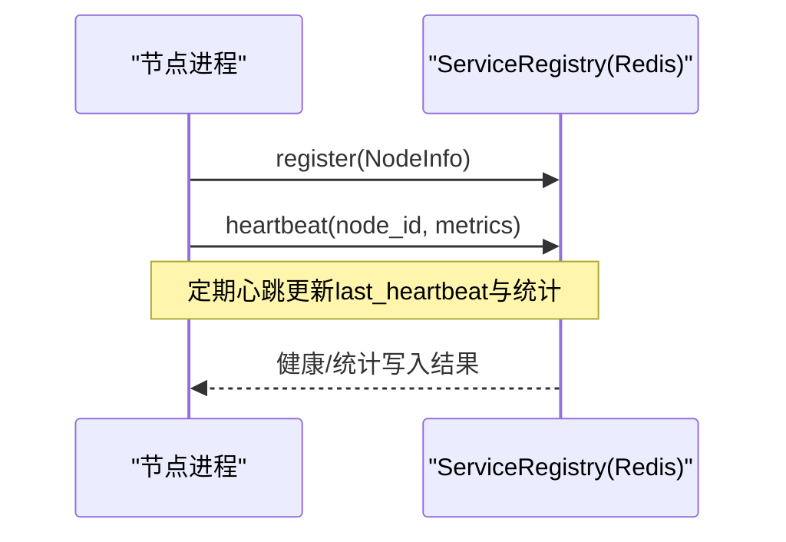
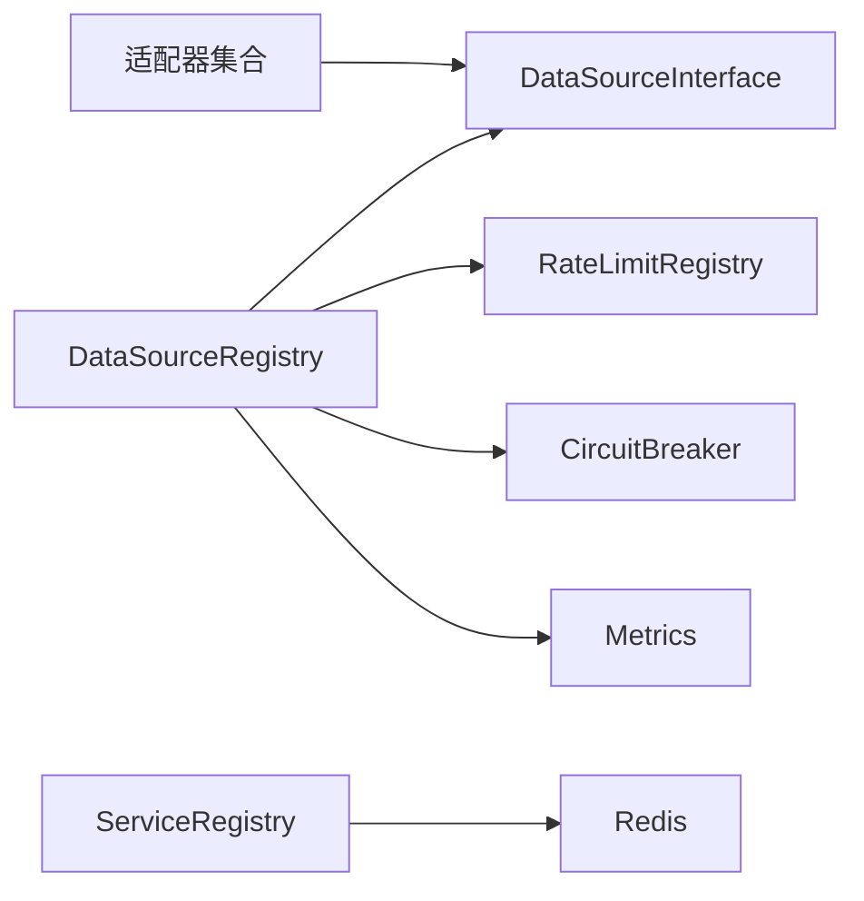
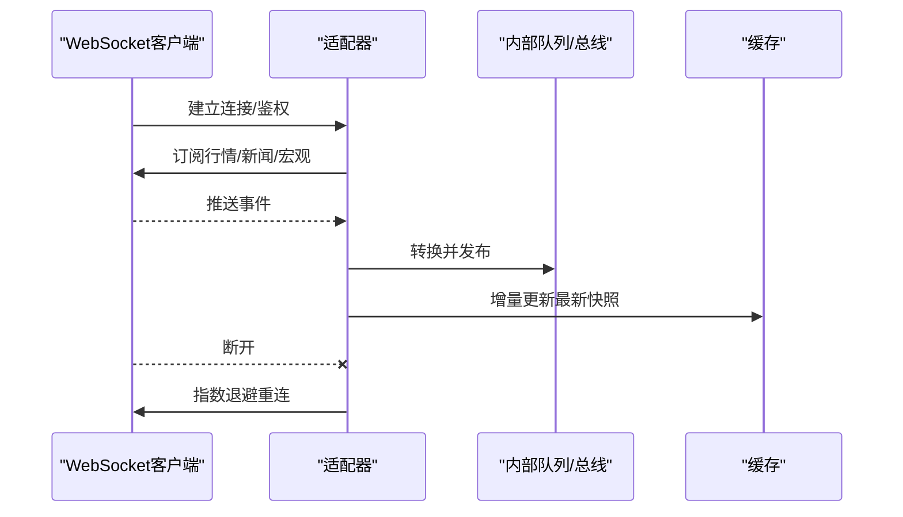
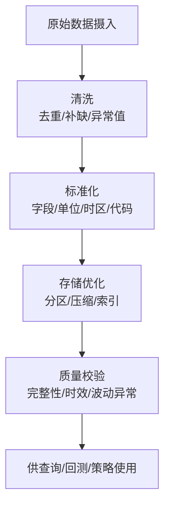
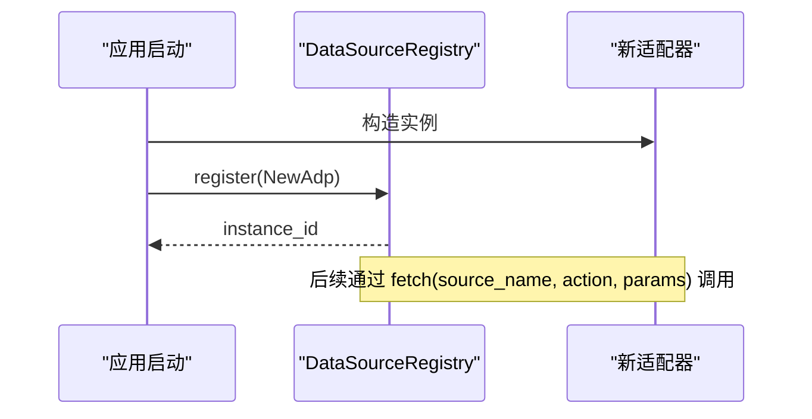
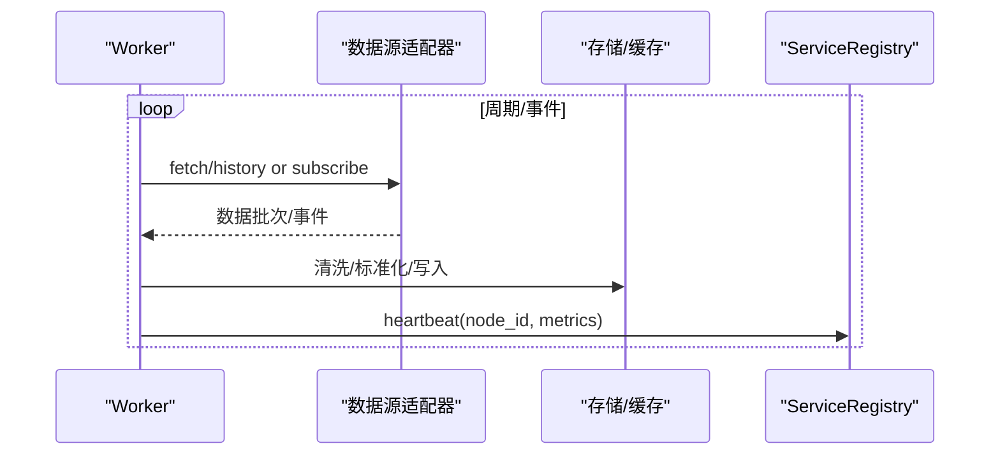

# 数据源集成

<cite>
**本文引用的文件**
- [backend/services/datasource/protocol.py](file://backend/services/datasource/protocol.py)
- [backend/services/datasource/source_registry.py](file://backend/services/datasource/source_registry.py)
- [backend/services/datasource/registry.py](file://backend/services/datasource/registry.py)
- [data_subservice/_internal/service_registry.py](file://data_subservice/_internal/service_registry.py)
- [backend/services/datasource/adapters/futu.py](file://backend/services/datasource/adapters/futu.py)
- [backend/services/datasource/adapters/yfinance_adapter.py](file://backend/services/datasource/adapters/yfinance_adapter.py)
- [backend/services/datasource/adapters/akshare.py](file://backend/services/datasource/adapters/akshare.py)
- [backend/services/datasource/adapters/finnhub.py](file://backend/services/datasource/adapters/finnhub.py)
- [backend/services/datasource/adapters/macro.py](file://backend/services/datasource/adapters/macro.py)
- [backend/workers/collectors/quote_publisher.py](file://backend/workers/collectors/quote_publisher.py)
- [backend/core/circuit_breaker_integration.py](file://backend/core/circuit_breaker_integration.py)
- [backend/core/metrics.py](file://backend/core/metrics.py)
</cite>

## 目录
1. [简介](#简介)
2. [项目结构](#项目结构)
3. [核心组件](#核心组件)
4. [架构总览](#架构总览)
5. [详细组件分析](#详细组件分析)
6. [依赖关系分析](#依赖关系分析)
7. [性能与限流](#性能与限流)
8. [实时数据接入机制](#实时数据接入机制)
9. [历史数据处理流程](#历史数据处理流程)
10. [新增数据源适配器指南](#新增数据源适配器指南)
11. [数据采集 Worker 实现指南](#数据采集-worker-实现指南)
12. [数据质量监控配置](#数据质量监控配置)
13. [故障排查指南](#故障排查指南)
14. [结论](#结论)

## 简介
本文件面向 Quant Agent 的数据源集成子系统，系统性阐述统一数据源架构设计（适配器模式、协议定义、注册机制），覆盖股票行情、期货、宏观经济、新闻等多类数据源的接入方式；说明实时数据接入（WebSocket 连接管理、推送、断线重连）、历史数据处理（清洗、标准化、存储优化）；并提供可操作示例：如何添加新数据源适配器、实现采集 Worker、配置数据质量监控。同时涵盖缓存策略、限流控制与错误处理机制。

## 项目结构
数据源集成由“协议 + 注册表 + 适配器 + 路由/服务层 + 分布式节点注册”构成：
- 协议层：定义统一的 DataSourceInterface，所有数据源必须实现 name/version/capabilities/mode/is_available/health/fetch。
- 注册与调度：DataSourceRegistry 负责实例注册、按能力选择、主路径 fetch 编排（限流、熔断、指标）。
- 限流与退避：RateLimitRegistry 维护每个数据源的 Throttler/Analyzer，统计并驱动退避。
- 适配器：各数据源以适配器形式实现协议（如 futu、yfinance、akshare、finnhub、macro）。
- 分布式注册：ServiceRegistry 基于 Redis 实现跨节点的服务注册、心跳、发现与优雅下线。
- 工作进程：collectors 提供批量采集与发布（如 quote_publisher）。

图表来源
- [backend/services/datasource/source_registry.py:140-255](file://backend/services/datasource/source_registry.py#L140-L255)
- [backend/services/datasource/registry.py:29-99](file://backend/services/datasource/registry.py#L29-L99)
- [data_subservice/_internal/service_registry.py:69-178](file://data_subservice/_internal/service_registry.py#L69-L178)

章节来源
- [backend/services/datasource/protocol.py:12-46](file://backend/services/datasource/protocol.py#L12-L46)
- [backend/services/datasource/source_registry.py:41-139](file://backend/services/datasource/source_registry.py#L41-L139)
- [backend/services/datasource/registry.py:18-99](file://backend/services/datasource/registry.py#L18-L99)
- [data_subservice/_internal/service_registry.py:51-178](file://data_subservice/_internal/service_registry.py#L51-L178)

## 核心组件
- 统一协议 DataSourceInterface：强制所有数据源暴露一致的接口，屏蔽底层差异，便于路由与测试替换。
- 数据源注册表 DataSourceRegistry：集中管理实例、按能力筛选、编排限流/熔断/指标，对外提供统一 fetch。
- 限流注册表 RateLimitRegistry：为每个数据源维护退避器与分析器，记录成功/失败/限流，驱动节流。
- 分布式服务注册 ServiceRegistry：跨节点注册、心跳、发现、权重排序、优雅下线与死节点清理。
- 适配器集合：针对不同数据源（股票、期货、宏观、新闻等）实现协议，封装各自 API/WS 细节。

章节来源
- [backend/services/datasource/protocol.py:12-46](file://backend/services/datasource/protocol.py#L12-L46)
- [backend/services/datasource/source_registry.py:41-255](file://backend/services/datasource/source_registry.py#L41-L255)
- [backend/services/datasource/registry.py:29-99](file://backend/services/datasource/registry.py#L29-L99)
- [data_subservice/_internal/service_registry.py:69-320](file://data_subservice/_internal/service_registry.py#L69-L320)

## 架构总览
下图展示一次典型的历史/快照数据请求在主路径上的流转：路由或上层服务通过 DataSourceRegistry.fetch 发起调用，先进行能力匹配与可用性检查，再经限流与熔断保护后委派给具体适配器执行，最后汇总指标与健康状态。

图表来源
- [backend/services/datasource/source_registry.py:140-255](file://backend/services/datasource/source_registry.py#L140-L255)
- [backend/core/circuit_breaker_integration.py:1-200](file://backend/core/circuit_breaker_integration.py#L1-L200)

## 详细组件分析

### 统一协议与适配器模式
- 协议要求：name、version、capabilities、mode、is_available、health、fetch。
- 适配器职责：实现协议，将外部数据源差异（REST/WS、鉴权、分页、字段映射）封装为统一 Result/ErrorInfo。
- 能力声明：capabilities 用于精确匹配 action，避免静默回退导致语义失效。

图表来源
- [backend/services/datasource/protocol.py:12-46](file://backend/services/datasource/protocol.py#L12-L46)
- [backend/services/datasource/adapters/futu.py:1-200](file://backend/services/datasource/adapters/futu.py#L1-L200)
- [backend/services/datasource/adapters/yfinance_adapter.py:1-200](file://backend/services/datasource/adapters/yfinance_adapter.py#L1-L200)
- [backend/services/datasource/adapters/akshare.py:1-200](file://backend/services/datasource/adapters/akshare.py#L1-L200)
- [backend/services/datasource/adapters/finnhub.py:1-200](file://backend/services/datasource/adapters/finnhub.py#L1-L200)
- [backend/services/datasource/adapters/macro.py:1-200](file://backend/services/datasource/adapters/macro.py#L1-L200)

章节来源
- [backend/services/datasource/protocol.py:12-46](file://backend/services/datasource/protocol.py#L12-L46)
- [backend/services/datasource/adapters/futu.py:1-200](file://backend/services/datasource/adapters/futu.py#L1-L200)
- [backend/services/datasource/adapters/yfinance_adapter.py:1-200](file://backend/services/datasource/adapters/yfinance_adapter.py#L1-L200)
- [backend/services/datasource/adapters/akshare.py:1-200](file://backend/services/datasource/adapters/akshare.py#L1-L200)
- [backend/services/datasource/adapters/finnhub.py:1-200](file://backend/services/datasource/adapters/finnhub.py#L1-L200)
- [backend/services/datasource/adapters/macro.py:1-200](file://backend/services/datasource/adapters/macro.py#L1-L200)

### 注册机制与主路径调度
- 注册：DataSourceRegistry.register 支持多实例、同名替换、预热限流条目。
- 获取：get 支持按 capability 严格匹配，不匹配时不再静默回退（可通过环境变量宽松兼容过渡）。
- 主路径 fetch：限流检查 → 熔断包裹 → 调用适配器 → 统计指标（延迟、可用性、错误类型、限流次数）。

图表来源
- [backend/services/datasource/source_registry.py:98-139](file://backend/services/datasource/source_registry.py#L98-L139)
- [backend/services/datasource/source_registry.py:140-255](file://backend/services/datasource/source_registry.py#L140-L255)

章节来源
- [backend/services/datasource/source_registry.py:41-255](file://backend/services/datasource/source_registry.py#L41-L255)

### 分布式节点服务注册
- 键空间：nodes(Hash)、heartbeats(ZSet)、draining(Set)、stats(Hash)。
- 能力：注册、注销、心跳、发现（按能力/区域过滤）、优雅下线、死节点清理、集群总览。
- 用途：跨 VPS 节点的服务发现与负载均衡（按权重排序）。

图表来源
- [data_subservice/_internal/service_registry.py:91-149](file://data_subservice/_internal/service_registry.py#L91-L149)
- [data_subservice/_internal/service_registry.py:157-178](file://data_subservice/_internal/service_registry.py#L157-L178)

章节来源
- [data_subservice/_internal/service_registry.py:51-320](file://data_subservice/_internal/service_registry.py#L51-L320)

## 依赖关系分析
- DataSourceRegistry 依赖：
  - Protocol 定义的 DataSourceInterface（解耦具体实现）
  - RateLimitRegistry（限流与退避）
  - CircuitBreaker（熔断保护）
  - Metrics（延迟、可用性、错误、限流计数）
- 适配器依赖：
  - 各自的外部 SDK/HTTP/WS 客户端
  - 统一 Result/ErrorInfo 模型（由注册表侧统计）
- 分布式注册依赖：
  - Redis 作为共享状态存储，保证跨进程一致性

图表来源
- [backend/services/datasource/source_registry.py:140-255](file://backend/services/datasource/source_registry.py#L140-L255)
- [backend/core/metrics.py:1-200](file://backend/core/metrics.py#L1-L200)
- [data_subservice/_internal/service_registry.py:69-178](file://data_subservice/_internal/service_registry.py#L69-L178)

章节来源
- [backend/services/datasource/source_registry.py:140-255](file://backend/services/datasource/source_registry.py#L140-L255)
- [backend/core/metrics.py:1-200](file://backend/core/metrics.py#L1-L200)
- [data_subservice/_internal/service_registry.py:69-178](file://data_subservice/_internal/service_registry.py#L69-L178)

## 性能与限流
- 限流策略：
  - 每个数据源独立 Throttler/Analyzer，记录成功/失败/限流类别，驱动退避。
  - 主路径在调用前检查 should_throttle，命中则直接返回 RATE_LIMITED，避免雪崩。
- 熔断保护：
  - 对特定扩展行情动作豁免全局熔断，避免误杀核心通道。
  - 熔断开启时直接返回错误，不调用下游。
- 指标观测：
  - 记录延迟、可用性、错误类型、限流次数，便于 Prometheus/Grafana 可视化。

章节来源
- [backend/services/datasource/registry.py:29-99](file://backend/services/datasource/registry.py#L29-L99)
- [backend/services/datasource/source_registry.py:140-255](file://backend/services/datasource/source_registry.py#L140-L255)
- [backend/core/metrics.py:1-200](file://backend/core/metrics.py#L1-L200)

## 实时数据接入机制
- WebSocket 连接管理：
  - 适配器内部维护连接池/会话，处理鉴权、订阅列表、消息解析。
  - 心跳保活与异常捕获，确保长连接稳定。
- 数据推送：
  - 适配器将原始事件转换为统一格式，推送到内部队列或发布到消息总线。
  - 可选本地缓存（内存/Redis）加速读取。
- 断线重连：
  - 指数退避重试，结合限流与熔断，避免风暴式重连。
  - 重连期间降级为只读或返回明确错误码。

[此图为概念流程图，无需源码映射]

## 历史数据处理流程
- 数据清洗：
  - 去重、缺失值填充、异常值剔除、时间戳对齐、复权处理（如适用）。
- 标准化：
  - 字段名统一、单位换算、时区归一、代码规范（如 ticker 标准化）。
- 存储优化：
  - 列存格式（Parquet/CSV）、分区（按日期/品种）、压缩、索引。
  - 冷热分层：热数据放内存/Redis，冷数据落盘对象存储。
- 质量校验：
  - 完整性、时效性、波动率异常检测，结合数据质量监控告警。

[此图为概念流程图，无需源码映射]

## 新增数据源适配器指南
步骤概览：
1. 实现协议：
   - 新建适配器类，实现 name/version/capabilities/mode/is_available/health/fetch。
   - capabilities 需包含支持的 action（如 history/snapshot/news/macro）。
2. 注册实例：
   - 在应用启动时调用 DataSourceRegistry.register 注册实例。
3. 适配外部 API：
   - 封装 REST/WS 调用、鉴权、分页、错误码映射为统一 Result/ErrorInfo。
4. 限流与熔断：
   - 若外部有速率限制，可在适配器内自行记录 self_recorded，或在注册表侧自动统计。
5. 测试验证：
   - 单元测试覆盖 is_available、health、fetch 的常见/异常分支。

图表来源
- [backend/services/datasource/source_registry.py:55-73](file://backend/services/datasource/source_registry.py#L55-L73)
- [backend/services/datasource/protocol.py:12-46](file://backend/services/datasource/protocol.py#L12-L46)

章节来源
- [backend/services/datasource/protocol.py:12-46](file://backend/services/datasource/protocol.py#L12-L46)
- [backend/services/datasource/source_registry.py:55-73](file://backend/services/datasource/source_registry.py#L55-L73)

## 数据采集 Worker 实现指南
- 角色定位：
  - 周期性或事件驱动的后台任务，负责从数据源拉取历史/增量数据，写入存储或转发至实时通道。
- 关键职责：
  - 任务调度（定时/触发）、批处理、并发控制、幂等写入、失败重试。
  - 与 ServiceRegistry 协作上报节点信息与指标。
- 示例：行情发布 Worker（quote_publisher）
  - 订阅行情事件，聚合为快照，发布到内部通道或缓存。

图表来源
- [backend/workers/collectors/quote_publisher.py:1-200](file://backend/workers/collectors/quote_publisher.py#L1-L200)
- [data_subservice/_internal/service_registry.py:129-149](file://data_subservice/_internal/service_registry.py#L129-L149)

章节来源
- [backend/workers/collectors/quote_publisher.py:1-200](file://backend/workers/collectors/quote_publisher.py#L1-L200)
- [data_subservice/_internal/service_registry.py:129-149](file://data_subservice/_internal/service_registry.py#L129-L149)

## 数据质量监控配置
- 指标维度：
  - 延迟、可用性、错误类型、限流次数、脏数据率、缺失率。
- 监控项：
  - 数据新鲜度（最新时间戳 vs 当前时间）
  - 波动异常（Z-score/分位数阈值）
  - 重复/缺失检测（主键唯一性、必填字段）
- 告警与降级：
  - 超过阈值触发告警，必要时切换备用数据源或降级为缓存。
- 可视化：
  - Prometheus + Grafana 仪表盘，观察各数据源健康与质量趋势。

章节来源
- [backend/core/metrics.py:1-200](file://backend/core/metrics.py#L1-L200)
- [backend/services/datasource/source_registry.py:205-255](file://backend/services/datasource/source_registry.py#L205-L255)

## 故障排查指南
常见问题与定位要点：
- 数据源不可用：
  - 检查 is_available 与 health 返回值，确认凭据/网络/配额。
- 频繁限流：
  - 查看 RateLimitRegistry 的 Analyzer 统计，调整批次大小/频率。
- 熔断触发：
  - 确认是否为瞬时错误，评估是否需要豁免动作或扩大熔断窗口。
- 实时断线：
  - 检查 WS 心跳与重连日志，确认订阅列表与权限。
- 数据质量异常：
  - 核对清洗/标准化规则，检查时间戳与时区，复核复权逻辑。

章节来源
- [backend/services/datasource/registry.py:29-99](file://backend/services/datasource/registry.py#L29-L99)
- [backend/services/datasource/source_registry.py:140-255](file://backend/services/datasource/source_registry.py#L140-L255)

## 结论
Quant Agent 的数据源集成系统通过统一协议、注册与限流熔断机制，实现了多数据源的松耦合接入与高可靠调度。适配器模式屏蔽了底层差异，注册表提供了稳定的主路径调用入口，分布式注册保障了跨节点的可扩展性与弹性。配合完善的指标与质量监控，系统能够在复杂环境下保持稳健运行，并为策略研发与交易提供高质量、低延迟的数据支撑。