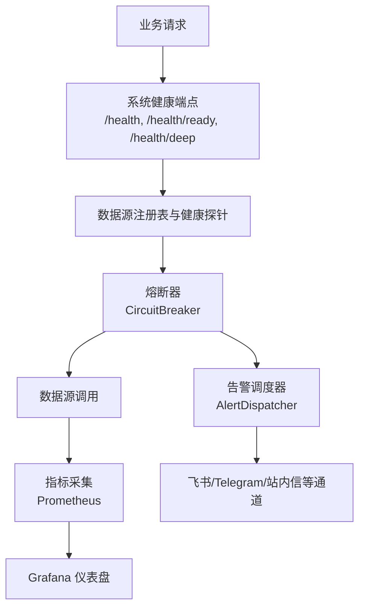
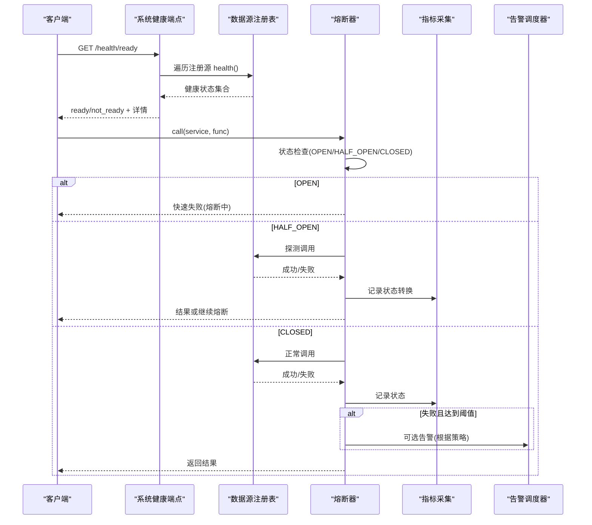
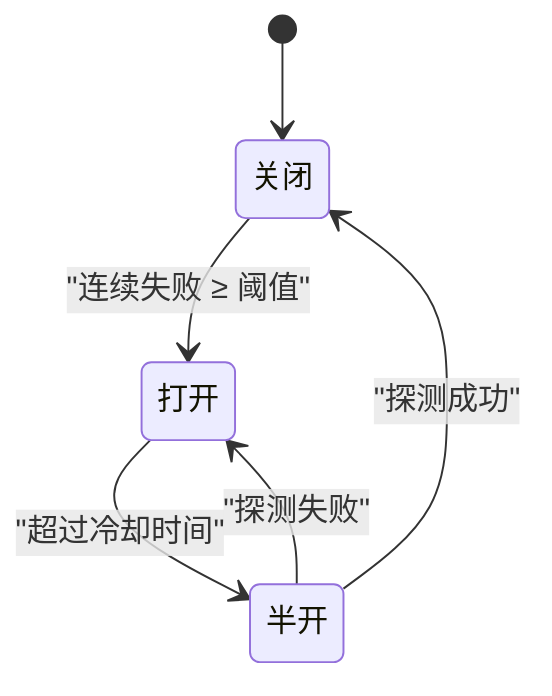
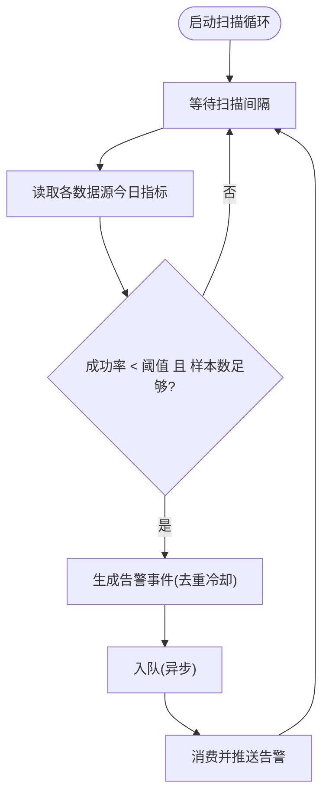
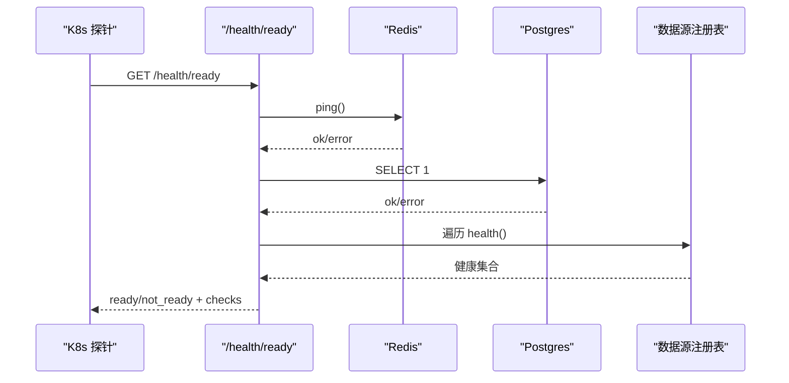
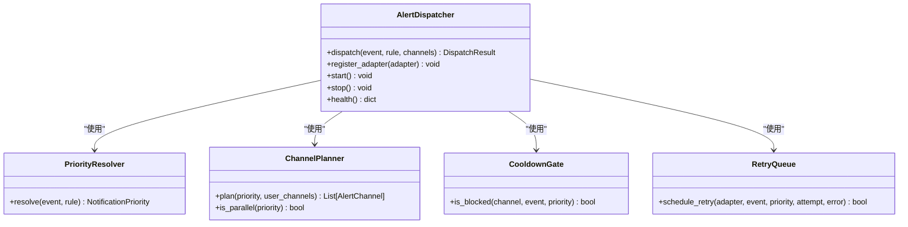
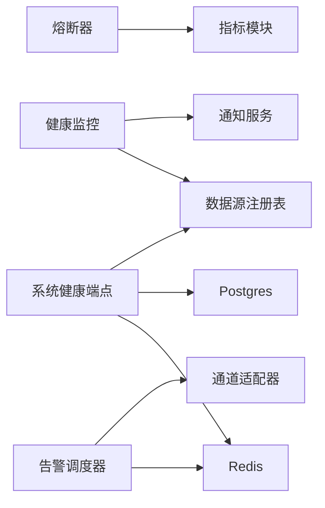

# 数据质量控制

<cite>
**本文引用的文件**
- [backend/core/circuit_breaker.py](file://backend/core/circuit_breaker.py)
- [backend/services/datasource/health_monitor.py](file://backend/services/datasource/health_monitor.py)
- [backend/routers/system_health.py](file://backend/routers/system_health.py)
- [backend/services/alert/dispatcher.py](file://backend/services/alert/dispatcher.py)
- [backend/core/metrics.py](file://backend/core/metrics.py)
- [grafana/provisioning/dashboards/data-quality-dashboard.json](file://grafana/provisioning/dashboards/data-quality-dashboard.json)
- [grafana/provisioning/dashboards/phase3-datasource-monitoring.json](file://grafana/provisioning/dashboards/phase3-datasource-monitoring.json)
- [prometheus.yml](file://prometheus.yml)
</cite>

## 目录
1. [简介](#简介)
2. [项目结构](#项目结构)
3. [核心组件](#核心组件)
4. [架构总览](#架构总览)
5. [详细组件分析](#详细组件分析)
6. [依赖关系分析](#依赖关系分析)
7. [性能考量](#性能考量)
8. [故障排查指南](#故障排查指南)
9. [结论](#结论)
10. [附录：配置与示例](#附录：配置与示例)

## 简介
本文件面向 Quant Agent 的数据质量控制体系，聚焦以下能力：
- 数据质量监控：完整性检查、准确性验证、时效性监控、一致性校验。
- 健康监控：数据源健康评估、延迟监控、错误率统计、可用性检测。
- 限流控制策略：令牌桶算法、滑动窗口、优先级队列、动态调整（结合熔断器与告警通道）。
- 熔断保护机制：故障隔离、快速失败、自动恢复、降级策略。
- 告警机制：邮件通知、Webhook 回调、仪表盘展示等。

本说明以仓库中已实现的核心模块为依据，提供可操作的配置与排障指引，并辅以架构图与时序图帮助理解。

## 项目结构
围绕数据质量与稳定性保障的关键目录与文件：
- 熔断器：backend/core/circuit_breaker.py
- 数据源健康监控：backend/services/datasource/health_monitor.py
- 系统健康端点：backend/routers/system_health.py
- 统一告警调度：backend/services/alert/dispatcher.py
- 指标与仪表盘：backend/core/metrics.py、grafana/provisioning/dashboards/*.json、prometheus.yml

图表来源
- [backend/routers/system_health.py:173-355](file://backend/routers/system_health.py#L173-L355)
- [backend/core/circuit_breaker.py:64-218](file://backend/core/circuit_breaker.py#L64-L218)
- [backend/services/alert/dispatcher.py:357-461](file://backend/services/alert/dispatcher.py#L357-L461)
- [backend/core/metrics.py:1-200](file://backend/core/metrics.py#L1-L200)
- [grafana/provisioning/dashboards/data-quality-dashboard.json:1-200](file://grafana/provisioning/dashboards/data-quality-dashboard.json#L1-L200)
- [grafana/provisioning/dashboards/phase3-datasource-monitoring.json:1-200](file://grafana/provisioning/dashboards/phase3-datasource-monitoring.json#L1-L200)
- [prometheus.yml:1-200](file://prometheus.yml#L1-L200)

章节来源
- [backend/routers/system_health.py:173-355](file://backend/routers/system_health.py#L173-L355)
- [backend/core/circuit_breaker.py:64-218](file://backend/core/circuit_breaker.py#L64-L218)
- [backend/services/alert/dispatcher.py:357-461](file://backend/services/alert/dispatcher.py#L357-L461)
- [backend/core/metrics.py:1-200](file://backend/core/metrics.py#L1-L200)
- [grafana/provisioning/dashboards/data-quality-dashboard.json:1-200](file://grafana/provisioning/dashboards/data-quality-dashboard.json#L1-L200)
- [grafana/provisioning/dashboards/phase3-datasource-monitoring.json:1-200](file://grafana/provisioning/dashboards/phase3-datasource-monitoring.json#L1-L200)
- [prometheus.yml:1-200](file://prometheus.yml#L1-L200)

## 核心组件
- 熔断器（CircuitBreaker）：按服务维度维护 CLOSED/OPEN/HALF_OPEN 状态机，支持异步/同步调用包装、限流类错误过滤、手动记录成功/失败、状态快照导出。
- 数据源健康监控（DataSourceHealthMonitor）：周期性扫描各数据源成功率与可达性，触发“低成功率/失联”告警，具备去重冷却与异步推送。
- 系统健康端点（System Health Router）：暴露 liveness/readiness/deep 探针，聚合 Redis/PG/数据源/事件循环延迟/熔断状态等。
- 统一告警调度（AlertDispatcher）：优先级解析、通道规划、冷却门控、重试与死信队列、投递记录追踪。

章节来源
- [backend/core/circuit_breaker.py:64-218](file://backend/core/circuit_breaker.py#L64-L218)
- [backend/services/datasource/health_monitor.py:55-257](file://backend/services/datasource/health_monitor.py#L55-L257)
- [backend/routers/system_health.py:173-355](file://backend/routers/system_health.py#L173-L355)
- [backend/services/alert/dispatcher.py:357-461](file://backend/services/alert/dispatcher.py#L357-L461)

## 架构总览
下图展示了从请求进入、健康检查、数据源访问、熔断与告警的全链路交互。

图表来源
- [backend/routers/system_health.py:197-246](file://backend/routers/system_health.py#L197-L246)
- [backend/core/circuit_breaker.py:147-218](file://backend/core/circuit_breaker.py#L147-L218)
- [backend/services/alert/dispatcher.py:396-461](file://backend/services/alert/dispatcher.py#L396-L461)

## 详细组件分析

### 熔断器（CircuitBreaker）
- 状态机：CLOSED → OPEN（连续失败≥阈值）→ HALF_OPEN（超过冷却时间）→ CLOSED（探测成功）或回 OPEN（探测失败）。
- 限流解耦：通过 error_classifier 或 is_rate_limit_error 钩子将限流类错误排除在失败计数之外，避免误熔断。
- 可观测性：状态与转换通过指标上报；status_snapshot 提供运行时快照。
- 使用方式：装饰器 guard、call/call_sync 包装函数、record_failure/record_success 手动记录。

图表来源
- [backend/core/circuit_breaker.py:45-97](file://backend/core/circuit_breaker.py#L45-L97)
- [backend/core/circuit_breaker.py:147-218](file://backend/core/circuit_breaker.py#L147-L218)

章节来源
- [backend/core/circuit_breaker.py:45-218](file://backend/core/circuit_breaker.py#L45-L218)
- [backend/core/metrics.py:1-200](file://backend/core/metrics.py#L1-L200)

### 数据源健康监控（DataSourceHealthMonitor）
- 扫描周期：定时任务每 N 秒扫描一次，读取当日调用指标，计算成功率。
- 告警规则：成功率低于阈值（默认 95%）且样本数足够时触发；对“Down”场景进行近似判定并结合健康卡片。
- 去重冷却：同数据源+同类型告警在冷却期内不重复推送。
- 异步推送：通过 NotificationService 发送告警，非阻塞热路径。

图表来源
- [backend/services/datasource/health_monitor.py:101-236](file://backend/services/datasource/health_monitor.py#L101-L236)

章节来源
- [backend/services/datasource/health_monitor.py:37-257](file://backend/services/datasource/health_monitor.py#L37-L257)

### 系统健康端点（System Health Router）
- Liveness：进程存活即 200，不依赖外部依赖。
- Readiness：Redis/PG/至少一个数据源连通才就绪，否则 503。
- Deep：全链路诊断，包含组件健康、数据源就绪、采集器心跳、事件循环延迟、熔断状态等。
- Webhook：接收 Uptime Kuma 等外部监控的 Webhook，转发为内部告警。

图表来源
- [backend/routers/system_health.py:197-246](file://backend/routers/system_health.py#L197-L246)
- [backend/routers/system_health.py:249-355](file://backend/routers/system_health.py#L249-L355)

章节来源
- [backend/routers/system_health.py:173-355](file://backend/routers/system_health.py#L173-L355)

### 统一告警调度（AlertDispatcher）
- 优先级解析：基于 severity/source 映射到 P0~P3。
- 通道规划：不同优先级默认推送不同通道组合，in_app 始终可用。
- 冷却门控：按通道与指纹（source/rule_id/ticker/severity）设置 TTL，抑制风暴。
- 重试与死信：按优先级退避重试，超限进入 DLQ。
- 投递记录：记录每次投递的状态、耗时与错误。

图表来源
- [backend/services/alert/dispatcher.py:66-157](file://backend/services/alert/dispatcher.py#L66-L157)
- [backend/services/alert/dispatcher.py:173-219](file://backend/services/alert/dispatcher.py#L173-L219)
- [backend/services/alert/dispatcher.py:279-349](file://backend/services/alert/dispatcher.py#L279-L349)
- [backend/services/alert/dispatcher.py:357-461](file://backend/services/alert/dispatcher.py#L357-L461)

章节来源
- [backend/services/alert/dispatcher.py:66-461](file://backend/services/alert/dispatcher.py#L66-L461)

## 依赖关系分析
- 熔断器依赖指标模块上报状态与转换次数；可通过环境变量配置最大失败次数与冷却时间。
- 健康监控依赖数据源注册表与调用指标存储，并通过通知服务推送告警。
- 系统健康端点依赖 Redis、Postgres、数据源注册表与订阅服务，用于就绪判断与深度诊断。
- 告警调度器依赖 Redis（冷却与 DLQ），适配器可扩展至飞书、Telegram、站内信等。

图表来源
- [backend/core/circuit_breaker.py:34-37](file://backend/core/circuit_breaker.py#L34-L37)
- [backend/services/datasource/health_monitor.py:90-98](file://backend/services/datasource/health_monitor.py#L90-L98)
- [backend/routers/system_health.py:205-246](file://backend/routers/system_health.py#L205-L246)
- [backend/services/alert/dispatcher.py:181-219](file://backend/services/alert/dispatcher.py#L181-L219)

章节来源
- [backend/core/circuit_breaker.py:34-37](file://backend/core/circuit_breaker.py#L34-L37)
- [backend/services/datasource/health_monitor.py:90-98](file://backend/services/datasource/health_monitor.py#L90-L98)
- [backend/routers/system_health.py:205-246](file://backend/routers/system_health.py#L205-L246)
- [backend/services/alert/dispatcher.py:181-219](file://backend/services/alert/dispatcher.py#L181-L219)

## 性能考量
- 熔断器：
  - 使用异步锁保护状态变更，避免竞态。
  - 限流类错误不计入失败计数，降低误熔断概率。
  - 半开探测仅在超时后执行，减少无效探测开销。
- 健康监控：
  - 后台扫描与告警消费分离，避免阻塞主流程。
  - 去重冷却防止告警风暴。
- 系统健康端点：
  - 探针调用带超时与异常兜底，确保诊断接口稳定。
  - 事件循环延迟测量用于评估拥塞程度。
- 告警调度：
  - 并行投递高优先级告警，串行处理低优先级。
  - 指数退避重试与死信队列，提高可靠性。

[本节为通用性能讨论，不直接分析具体文件]

## 故障排查指南
- 数据源不可用或成功率劣化：
  - 查看 /health/ready 的 data_sources 字段，确认各源 healthy/unhealthy。
  - 关注 DataSourceHealthMonitor 的告警消息，定位低成功率数据源。
- 熔断频繁触发：
  - 检查 circuit_breaker_states 快照，确认是否因连续失败导致 OPEN。
  - 若为限流错误，确认 error_classifier 或 is_rate_limit_error 是否正确过滤。
- 告警未送达：
  - 检查 AlertDispatcher 的健康状态与适配器启用情况。
  - 查看冷却门控是否抑制了重复告警，必要时调整 TTL。
  - 检查 DLQ 是否有失败记录。

章节来源
- [backend/routers/system_health.py:249-355](file://backend/routers/system_health.py#L249-L355)
- [backend/services/datasource/health_monitor.py:101-236](file://backend/services/datasource/health_monitor.py#L101-L236)
- [backend/core/circuit_breaker.py:341-352](file://backend/core/circuit_breaker.py#L341-L352)
- [backend/services/alert/dispatcher.py:558-564](file://backend/services/alert/dispatcher.py#L558-L564)

## 结论
Quant Agent 的数据质量控制体系以熔断器为核心，配合健康监控与统一告警调度，形成“监测—保护—告警”的闭环。通过系统健康端点提供标准化探针，结合 Prometheus/Grafana 可视化，可实现对数据源可用性、延迟、错误率的持续监控与快速响应。限流类错误与熔断解耦，避免误判；告警通道的优先级与冷却机制有效抑制告警风暴。整体方案兼顾稳定性与可观测性，便于运维与研发协同排障。

[本节为总结性内容，不直接分析具体文件]

## 附录：配置与示例
- 熔断器配置
  - 环境变量：
    - CIRCUIT_BREAKER_MAX_FAILURES：连续失败阈值（默认 3）
    - CIRCUIT_BREAKER_COOLDOWN_S：冷却时间（秒，默认 60）
  - 使用示例：
    - 装饰器：@circuit_breaker.guard("service_name")
    - 调用：await circuit_breaker.call("service_name", async_func, *args)
    - 手动记录：circuit_breaker.record_failure("service_name", is_rate_limit=True/False)
  - 参考路径
    - [backend/core/circuit_breaker.py:40-43](file://backend/core/circuit_breaker.py#L40-L43)
    - [backend/core/circuit_breaker.py:267-284](file://backend/core/circuit_breaker.py#L267-L284)
    - [backend/core/circuit_breaker.py:286-324](file://backend/core/circuit_breaker.py#L286-L324)

- 健康监控阈值与冷却
  - 成功率阈值：SUCCESS_RATE_THRESHOLD = 0.95
  - 最小样本数：MIN_SAMPLES_FOR_RATE = 20
  - 扫描间隔：SCAN_INTERVAL_SECONDS = 60
  - 冷却时长：COOLDOWN_SECONDS = 900
  - 参考路径
    - [backend/services/datasource/health_monitor.py:37-42](file://backend/services/datasource/health_monitor.py#L37-L42)

- 系统健康端点
  - /health：liveness，始终 200
  - /health/ready：readiness，检查 Redis/PG/数据源
  - /health/deep：全链路诊断，含熔断状态、事件循环延迟等
  - /webhook/uptime-kuma：接收外部监控 Webhook 并转为内部告警
  - 参考路径
    - [backend/routers/system_health.py:173-184](file://backend/routers/system_health.py#L173-L184)
    - [backend/routers/system_health.py:197-246](file://backend/routers/system_health.py#L197-L246)
    - [backend/routers/system_health.py:249-355](file://backend/routers/system_health.py#L249-L355)
    - [backend/routers/system_health.py:382-395](file://backend/routers/system_health.py#L382-L395)

- 告警通道与优先级
  - 优先级解析：P0~P3，依据 severity/source 决定
  - 通道计划：P0 强制 in_app + feishu + telegram；P3 仅 in_app
  - 冷却门控：按通道与指纹设置 TTL，抑制重复
  - 重试与 DLQ：按优先级退避重试，超限进入死信队列
  - 参考路径
    - [backend/services/alert/dispatcher.py:66-108](file://backend/services/alert/dispatcher.py#L66-L108)
    - [backend/services/alert/dispatcher.py:116-157](file://backend/services/alert/dispatcher.py#L116-L157)
    - [backend/services/alert/dispatcher.py:173-219](file://backend/services/alert/dispatcher.py#L173-L219)
    - [backend/services/alert/dispatcher.py:279-349](file://backend/services/alert/dispatcher.py#L279-L349)

- 指标与仪表盘
  - Prometheus 抓取：/metrics（Basic Auth 保护）
  - Grafana 仪表盘：data-quality-dashboard.json、phase3-datasource-monitoring.json
  - 参考路径
    - [backend/routers/system_health.py:51-56](file://backend/routers/system_health.py#L51-L56)
    - [grafana/provisioning/dashboards/data-quality-dashboard.json:1-200](file://grafana/provisioning/dashboards/data-quality-dashboard.json#L1-L200)
    - [grafana/provisioning/dashboards/phase3-datasource-monitoring.json:1-200](file://grafana/provisioning/dashboards/phase3-datasource-monitoring.json#L1-L200)
    - [prometheus.yml:1-200](file://prometheus.yml#L1-L200)

- 自定义质量检查建议
  - 完整性检查：在数据入库前校验必填字段、数据类型、范围约束。
  - 准确性验证：与权威源比对关键字段，或使用统计方法检测异常值。
  - 时效性监控：对比数据时间戳与当前时间，设置最大延迟阈值。
  - 一致性校验：跨表/跨源关联键一致性与外键约束检查。
  - 集成方式：在数据接入层插入校验步骤，失败则走告警通道并记录指标。

[本节为配置与示例说明，引用具体文件路径供查阅]
