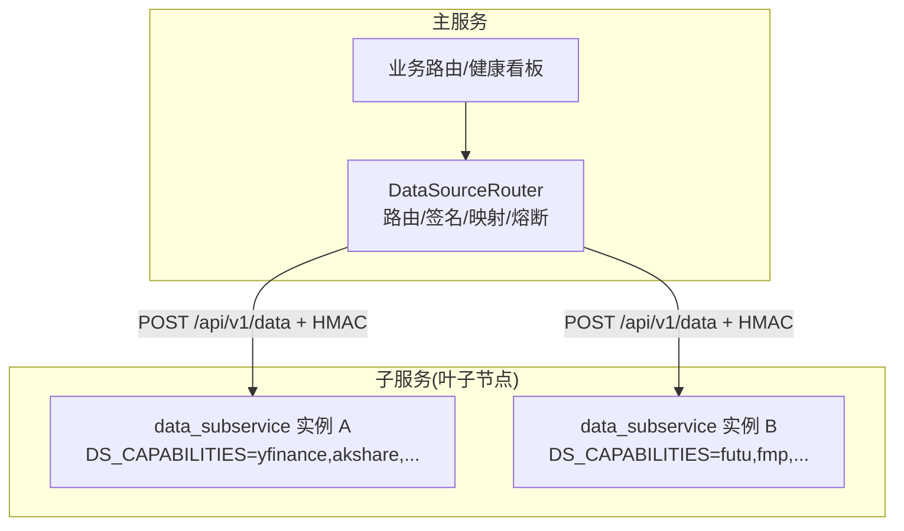
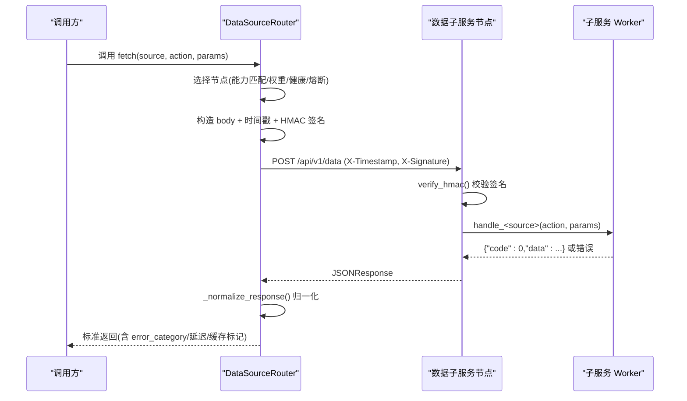
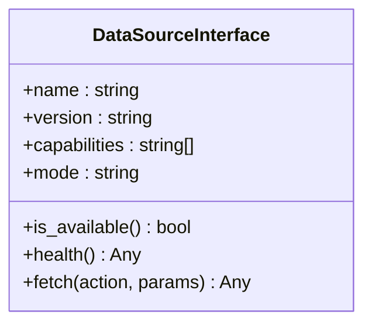
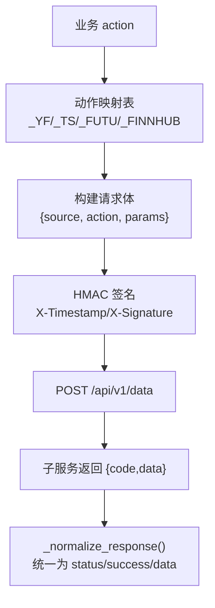
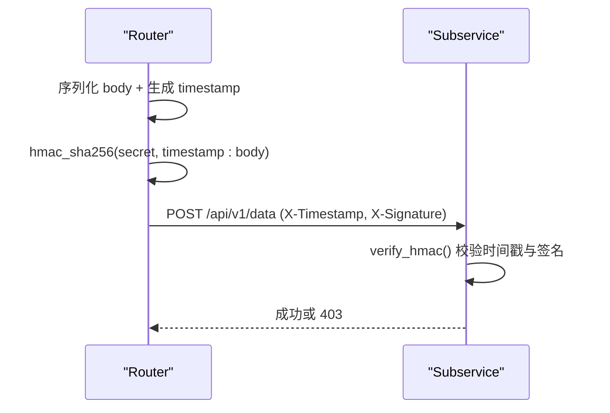
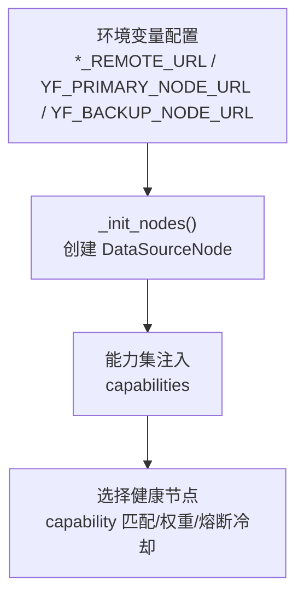
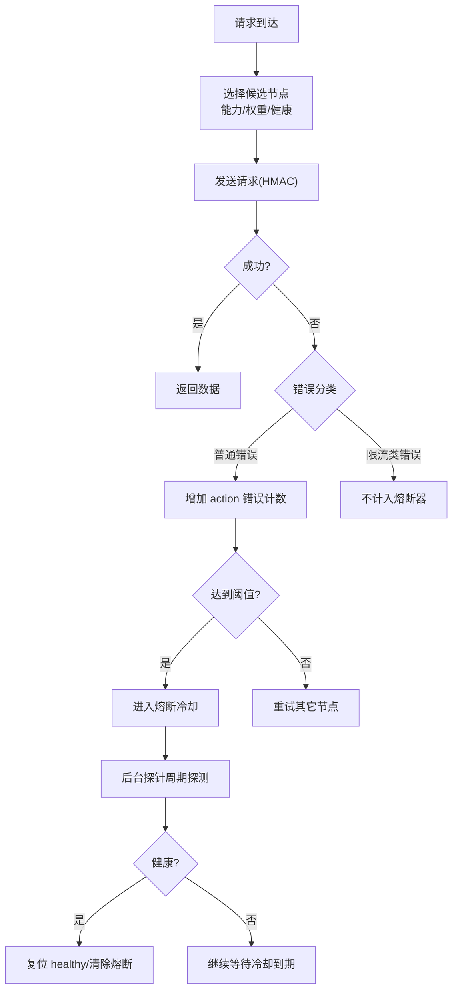
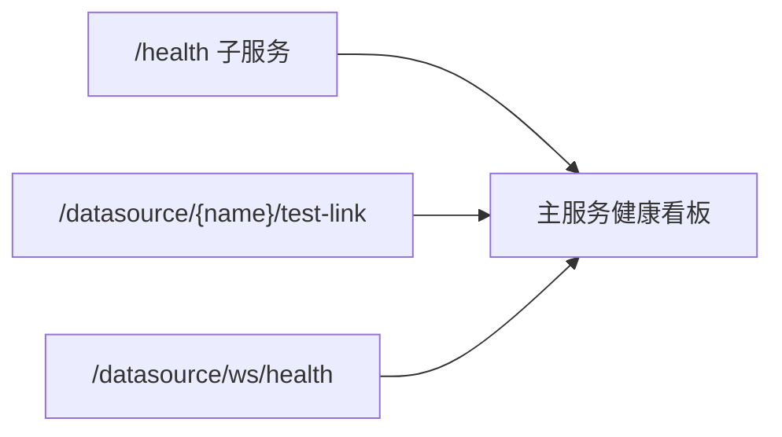
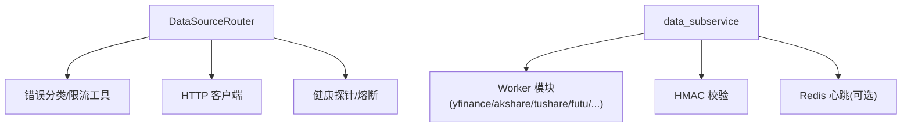

# 统一数据源架构

<cite>
**本文引用的文件**
- [backend/services/datasource/router.py](file://backend/services/datasource/router.py)
- [backend/services/datasource/__init__.py](file://backend/services/datasource/__init__.py)
- [backend/services/datasource/protocol.py](file://backend/services/datasource/protocol.py)
- [data_subservice/main.py](file://data_subservice/main.py)
- [backend/routers/datasource.py](file://backend/routers/datasource.py)
</cite>

## 目录
1. [简介](#简介)
2. [项目结构](#项目结构)
3. [核心组件](#核心组件)
4. [架构总览](#架构总览)
5. [详细组件分析](#详细组件分析)
6. [依赖关系分析](#依赖关系分析)
7. [性能与可用性考虑](#性能与可用性考虑)
8. [故障排查指南](#故障排查指南)
9. [结论](#结论)
10. [附录：配置与示例](#附录：配置与示例)

## 简介
本文件面向 Quant Agent 的“统一数据源架构”，聚焦适配器模式、协议定义、路由与多活容灾设计。核心目标包括：
- 解释 DataSourceNode、DataSourceRouter 的设计与实现机制
- 说明 action 映射表（_YF_ACTION_MAP、_TS_ACTION_MAP、_FUTU_ACTION_MAP 等）及请求响应格式
- 阐述 HMAC 签名校验机制
- 说明节点发现、能力声明、负载均衡策略
- 解释主备多活、故障转移与熔断保护
- 提供具体配置与自定义 action 映射的实践示例
- 通过架构图与数据流图展示组件交互

## 项目结构
统一数据源由“主服务路由层”和“子服务叶子节点”组成，采用物理解耦：
- 主服务侧：负责路由、HMAC 签名、动作映射、限流/熔断、健康探针与监控
- 子服务侧：独立 HTTP 服务，按 DS_CAPABILITIES 暴露能力，处理具体数据源请求

**图表来源**
- [backend/services/datasource/router.py:222-247](file://backend/services/datasource/router.py#L222-L247)
- [data_subservice/main.py:189-234](file://data_subservice/main.py#L189-L234)

**章节来源**
- [backend/services/datasource/router.py:1-30](file://backend/services/datasource/router.py#L1-L30)
- [data_subservice/main.py:1-35](file://data_subservice/main.py#L1-L35)

## 核心组件
- DataSourceNode：描述一个远程数据源节点（名称、URL、权重、能力集、健康状态、熔断与探针状态、action 级熔断计数）
- DataSourceRouter：维护节点集合、发起带 HMAC 签名的请求、动作映射、健康探测、半开自愈、负载均衡与熔断
- 协议接口：DataSourceInterface 定义统一的 fetch/health/capabilities 契约
- 子服务入口：/api/v1/data 统一接收 source/action/params，按 DS_CAPABILITIES 门控并调用对应 worker

**章节来源**
- [backend/services/datasource/router.py:222-247](file://backend/services/datasource/router.py#L222-L247)
- [backend/services/datasource/router.py:249-289](file://backend/services/datasource/router.py#L249-L289)
- [backend/services/datasource/protocol.py:12-47](file://backend/services/datasource/protocol.py#L12-L47)
- [data_subservice/main.py:175-234](file://data_subservice/main.py#L175-L234)

## 架构总览
下图展示了从业务请求到子服务执行、再到结果归一化的完整流程，包含 HMAC 签名、动作映射、错误分类、熔断与自愈探针。

**图表来源**
- [backend/services/datasource/router.py:586-600](file://backend/services/datasource/router.py#L586-L600)
- [backend/services/datasource/router.py:669-748](file://backend/services/datasource/router.py#L669-L748)
- [data_subservice/main.py:70-88](file://data_subservice/main.py#L70-L88)
- [data_subservice/main.py:189-234](file://data_subservice/main.py#L189-L234)

## 详细组件分析

### 适配器模式与协议
- DataSourceInterface 定义了 name/version/capabilities/mode/is_available/health/fetch 的统一契约，所有数据源必须遵循
- Router 不直连具体服务，仅通过协议抽象进行调度与封装，便于替换/扩展

**图表来源**
- [backend/services/datasource/protocol.py:12-47](file://backend/services/datasource/protocol.py#L12-L47)

**章节来源**
- [backend/services/datasource/protocol.py:1-47](file://backend/services/datasource/protocol.py#L1-L47)

### 动作映射表与请求/响应格式
- 主服务内部 action 到子服务 action 的映射表：
  - _YF_ACTION_MAP：yfinance 相关动作（quote/history/tech/financials/search 等）
  - _TS_ACTION_MAP：tushare 相关动作（stock_history/stock_quote/fundamental 等）
  - _FUTU_ACTION_MAP：futu 相关动作（quote/history/order_book/account_info 等）
  - _FINNHUB_ACTION_MAP：finnhub 相关动作（quote/news/earnings/calendar 等）
- 子服务统一端点：POST /api/v1/data，body 为 {source, action, params}
- 子服务返回：{"code":0,"data":...}；Router 会将其归一化为内部约定格式

**图表来源**
- [backend/services/datasource/router.py:61-140](file://backend/services/datasource/router.py#L61-L140)
- [backend/services/datasource/router.py:602-660](file://backend/services/datasource/router.py#L602-L660)
- [data_subservice/main.py:189-234](file://data_subservice/main.py#L189-L234)

**章节来源**
- [backend/services/datasource/router.py:61-140](file://backend/services/datasource/router.py#L61-L140)
- [backend/services/datasource/router.py:602-660](file://backend/services/datasource/router.py#L602-L660)
- [data_subservice/main.py:189-234](file://data_subservice/main.py#L189-L234)

### HMAC 签名机制
- 主服务侧：对最终发送的 body 字符串与时间戳拼接后做 HMAC-SHA256，生成 X-Signature，并通过 X-Timestamp 传递
- 子服务侧：verify_hmac 校验时间戳有效期（默认 300s），并对相同消息计算签名比对
- 若签名失败或时间戳过期，子服务返回 403

**图表来源**
- [backend/services/datasource/router.py:586-600](file://backend/services/datasource/router.py#L586-L600)
- [backend/services/datasource/router.py:699-708](file://backend/services/datasource/router.py#L699-L708)
- [data_subservice/main.py:70-88](file://data_subservice/main.py#L70-L88)

**章节来源**
- [backend/services/datasource/router.py:586-600](file://backend/services/datasource/router.py#L586-L600)
- [data_subservice/main.py:70-88](file://data_subservice/main.py#L70-L88)

### 注册机制：节点发现、能力声明、负载均衡
- 节点发现：通过环境变量配置各源远程 URL（支持逗号分隔多活）
- 能力声明：子服务通过 DS_CAPABILITIES 声明自身能力；Router 在初始化时根据配置为每个节点设置 capabilities
- 负载均衡：按能力过滤候选节点，结合权重与健康状态选择；限流压力感知可降低被限流节点的优先级

**图表来源**
- [backend/services/datasource/router.py:446-579](file://backend/services/datasource/router.py#L446-L579)
- [data_subservice/main.py:175-186](file://data_subservice/main.py#L175-L186)

**章节来源**
- [backend/services/datasource/router.py:446-579](file://backend/services/datasource/router.py#L446-L579)
- [data_subservice/main.py:175-186](file://data_subservice/main.py#L175-L186)

### 多活容灾：主备节点、故障转移、熔断保护
- 主备多活：YFinance 支持 primary + 多个 backup；其他源也可通过逗号分隔 URL 配置多活
- 故障转移：当某节点健康检查失败或处于熔断冷却期，自动切换到其它候选节点
- 熔断保护：
  - 节点级：error_count 与 circuit_breaker_until 控制节点级熔断
  - Action 级：action_errors 与 action_breaker_until 隔离单个 action 的连续失败，避免整节点误杀
  - 半开自愈：后台探针周期性探测 unhealthy/熔断中的节点，恢复则复位

**图表来源**
- [backend/services/datasource/router.py:150-175](file://backend/services/datasource/router.py#L150-L175)
- [backend/services/datasource/router.py:293-308](file://backend/services/datasource/router.py#L293-L308)
- [backend/services/datasource/router.py:310-409](file://backend/services/datasource/router.py#L310-L409)
- [backend/services/datasource/router.py:786-800](file://backend/services/datasource/router.py#L786-L800)

**章节来源**
- [backend/services/datasource/router.py:150-175](file://backend/services/datasource/router.py#L150-L175)
- [backend/services/datasource/router.py:293-308](file://backend/services/datasource/router.py#L293-L308)
- [backend/services/datasource/router.py:310-409](file://backend/services/datasource/router.py#L310-L409)
- [backend/services/datasource/router.py:786-800](file://backend/services/datasource/router.py#L786-L800)

### 健康状态与监控
- 子服务 /health 暴露线程水位与 Futu 连接状态，便于快速定位资源枯竭或连接异常
- 主服务提供健康看板与实时推送，聚合各数据源的限流状态、成功率、延迟分布等指标
- 支持主动测试链路（test-link），并发受控，避免打爆上游

**图表来源**
- [data_subservice/main.py:91-172](file://data_subservice/main.py#L91-L172)
- [backend/routers/datasource.py:185-351](file://backend/routers/datasource.py#L185-L351)
- [backend/routers/datasource.py:487-642](file://backend/routers/datasource.py#L487-L642)
- [backend/routers/datasource.py:645-707](file://backend/routers/datasource.py#L645-L707)

**章节来源**
- [data_subservice/main.py:91-172](file://data_subservice/main.py#L91-L172)
- [backend/routers/datasource.py:185-351](file://backend/routers/datasource.py#L185-L351)
- [backend/routers/datasource.py:487-642](file://backend/routers/datasource.py#L487-L642)
- [backend/routers/datasource.py:645-707](file://backend/routers/datasource.py#L645-L707)

## 依赖关系分析
- Router 依赖：
  - 错误分类与限流工具（ErrorCategory、classify_http_error、parse_retry_after）
  - 子服务通信（httpx.AsyncClient）
  - 健康探针与熔断逻辑（内置）
- 子服务依赖：
  - FastAPI 路由与中间件（HMAC 校验）
  - 各数据源 worker（延迟导入，按需加载）
  - Redis 心跳（可选）

**图表来源**
- [backend/services/datasource/router.py:44-56](file://backend/services/datasource/router.py#L44-L56)
- [backend/services/datasource/router.py:662-668](file://backend/services/datasource/router.py#L662-L668)
- [data_subservice/main.py:24-30](file://data_subservice/main.py#L24-L30)
- [data_subservice/main.py:334-349](file://data_subservice/main.py#L334-L349)

**章节来源**
- [backend/services/datasource/router.py:44-56](file://backend/services/datasource/router.py#L44-L56)
- [backend/services/datasource/router.py:662-668](file://backend/services/datasource/router.py#L662-L668)
- [data_subservice/main.py:24-30](file://data_subservice/main.py#L24-L30)
- [data_subservice/main.py:334-349](file://data_subservice/main.py#L334-L349)

## 性能与可用性考虑
- 限流退避：区分普通错误与限流类错误，限流类错误触发独立退避机制，不计入熔断器失败计数
- 节点级与 action 级熔断：避免单 action 失败导致整节点不可用；小节点需要更高比例才触发进程级熔断
- 半开自愈：后台探针定期探测，恢复后自动复位，减少人工干预
- 线程水位监控：子服务 /health 暴露线程数与告警阈值，防止线程耗尽导致的静默失效
- 延迟统计与可视化：支持延迟分布、错误率趋势、限流热力图等监控指标

[本节为通用指导，无需特定文件引用]

## 故障排查指南
- 403 签名失败：检查 DATA_SOURCE_HMAC_SECRET 是否一致；确认时间戳未过期；确保对最终发送的 body 字节签名
- 端口误配：启动期会检测 *_REMOTE_URL 是否指向主服务自身而非子服务 8001 端口
- 能力未启用：子服务需显式声明 DS_CAPABILITIES，否则对应 source 将返回 503
- 线程耗尽：观察 /health 的 threads.count 与告警阈值，必要时扩容或限流
- 熔断持续：查看 action 级熔断与节点级熔断状态；利用 reset_circuit_breakers 重置部署残留

**章节来源**
- [backend/services/datasource/router.py:250-284](file://backend/services/datasource/router.py#L250-L284)
- [backend/services/datasource/router.py:411-445](file://backend/services/datasource/router.py#L411-L445)
- [data_subservice/main.py:70-88](file://data_subservice/main.py#L70-L88)
- [data_subservice/main.py:175-186](file://data_subservice/main.py#L175-L186)
- [data_subservice/main.py:91-122](file://data_subservice/main.py#L91-L122)

## 结论
该统一数据源架构通过适配器模式与协议抽象，实现了跨节点的数据源路由与多活容灾。HMAC 签名保障节点间通信安全；动作映射表屏蔽了不同数据源的差异；限流与熔断机制提升了系统韧性；健康探针与监控提供了可观测性。整体设计兼顾可扩展性与稳定性，适合大规模数据源接入场景。

[本节为总结，无需特定文件引用]

## 附录：配置与示例

### 配置不同数据源节点
- 环境变量（示例）：
  - YF_PRIMARY_NODE_URL=http://localhost:8001
  - YF_BACKUP_NODE_URL=http://yf-b:8001
  - AKSHARE_REMOTE_URL=http://bj:8001
  - TUSHARE_REMOTE_URL=http://bj:8001
  - FUTU_REMOTE_URL=http://localhost:8001
  - FMP_REMOTE_URL=http://localhost:8001
  - FINNHUB_REMOTE_URL=http://localhost:8001
  - DATA_SOURCE_HMAC_SECRET=your-secret
- 子服务能力声明：
  - DS_CAPABILITIES=yfinance,akshare,tushare,fmp,futu,finnhub,fred,dbnomics,rbi,tavily,bocha,jina

**章节来源**
- [backend/services/datasource/router.py:17-29](file://backend/services/datasource/router.py#L17-L29)
- [backend/services/datasource/router.py:446-579](file://backend/services/datasource/router.py#L446-L579)
- [data_subservice/main.py:175-186](file://data_subservice/main.py#L175-L186)

### 实现自定义 action 映射
- 在主服务 router 中新增映射项至相应 _*_ACTION_MAP
- 确保子服务 worker 已实现对应 action 的处理逻辑
- 若子服务未实现，将被识别为远程不支持，避免无效请求污染熔断计数

**章节来源**
- [backend/services/datasource/router.py:61-140](file://backend/services/datasource/router.py#L61-L140)
- [data_subservice/main.py:210-234](file://data_subservice/main.py#L210-L234)

### 处理节点健康状态
- 子服务 /health 返回线程水位与 Futu 连接状态
- 主服务健康看板聚合各数据源状态，支持主动测试链路
- 使用 /datasource/{name}/rate-limit-status 查询实时退避状态

**章节来源**
- [data_subservice/main.py:91-172](file://data_subservice/main.py#L91-L172)
- [backend/routers/datasource.py:185-351](file://backend/routers/datasource.py#L185-L351)
- [backend/routers/datasource.py:94-152](file://backend/routers/datasource.py#L94-L152)
