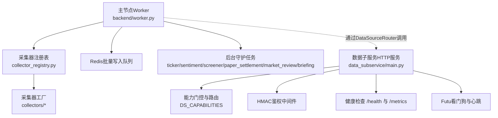
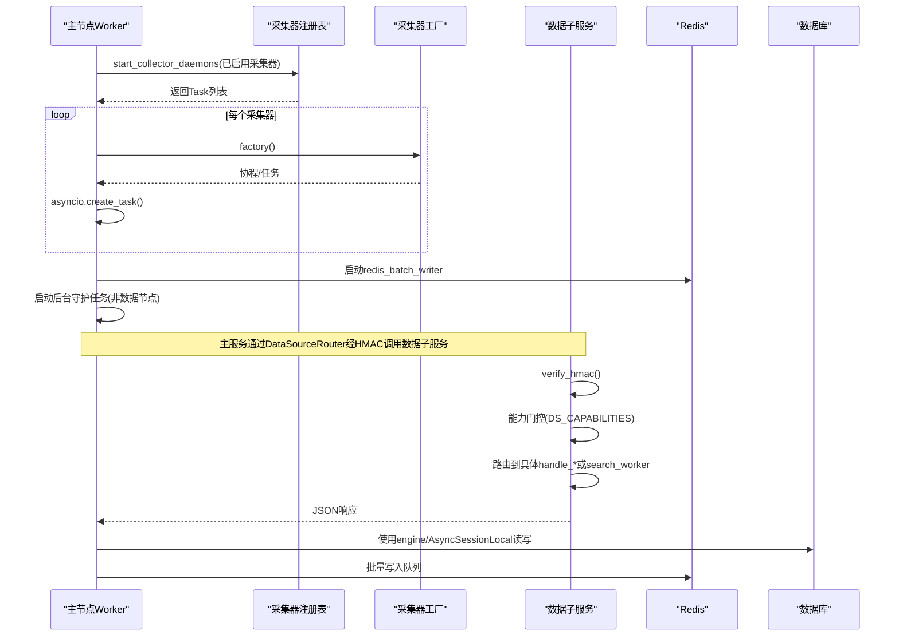
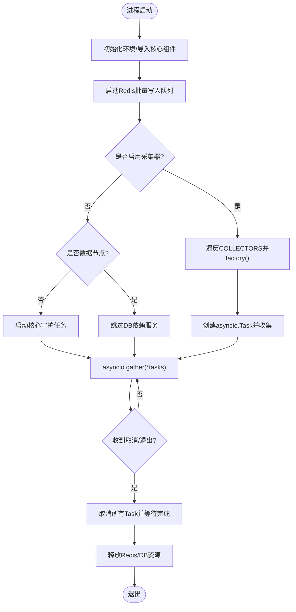
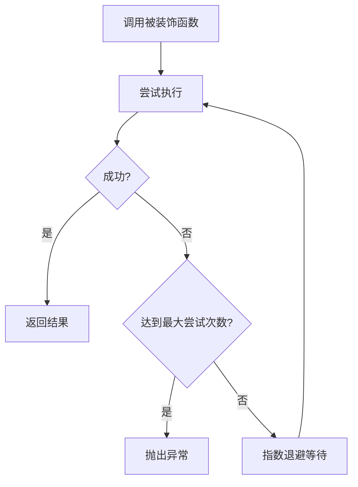
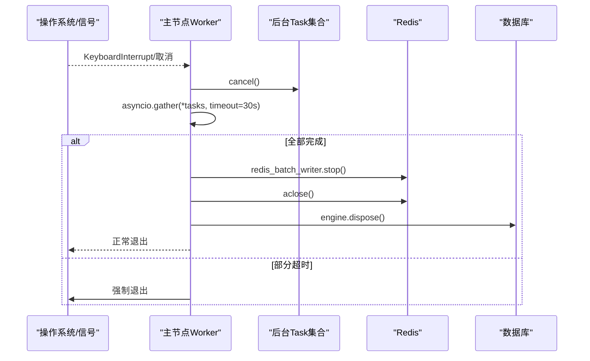
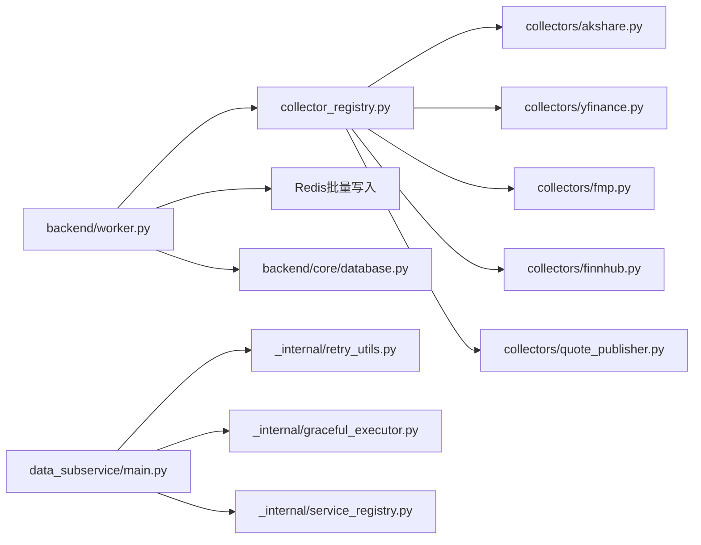

# Worker开发指南

<cite>
**本文引用的文件**
- [backend/worker.py](file://backend/worker.py)
- [backend/workers/collector_registry.py](file://backend/workers/collector_registry.py)
- [data_subservice/main.py](file://data_subservice/main.py)
- [data_subservice/_internal/retry_utils.py](file://data_subservice/_internal/retry_utils.py)
- [data_subservice/_internal/graceful_executor.py](file://data_subservice/_internal/graceful_executor.py)
- [backend/core/database.py](file://backend/core/database.py)
</cite>

## 目录
1. [简介](#简介)
2. [项目结构](#项目结构)
3. [核心组件](#核心组件)
4. [架构总览](#架构总览)
5. [详细组件分析](#详细组件分析)
6. [依赖关系分析](#依赖关系分析)
7. [性能考量](#性能考量)
8. [故障排查指南](#故障排查指南)
9. [结论](#结论)
10. [附录：新增Worker开发示例](#附录新增worker开发示例)

## 简介
本指南面向Quant Agent Worker系统的开发者，系统性说明Worker的进程隔离、任务调度与消息队列集成；异步任务处理机制（协程、并发控制、优先级）；资源管理策略（数据库连接池、HTTP客户端复用、内存优化）；重试机制（指数退避、失败分类、死信队列思路）；优雅关闭流程（信号处理、任务中断、状态保存、资源清理）；并提供新增Worker的完整实现范式、配置参数、启动脚本以及监控调试方法。

## 项目结构
系统由“主节点Worker”和“数据子服务（Data Subservice）”两部分组成：
- 主节点Worker负责启动采集器守护进程、后台服务任务、Redis批量写入队列，并统一协调生命周期。
- 数据子服务作为独立HTTP服务暴露统一数据获取接口，支持能力声明、HMAC鉴权、健康检查、Prometheus指标、Futu长连接看门狗等。

图表来源
- [backend/worker.py:34-103](file://backend/worker.py#L34-L103)
- [backend/workers/collector_registry.py:48-124](file://backend/workers/collector_registry.py#L48-L124)
- [data_subservice/main.py:70-234](file://data_subservice/main.py#L70-L234)

章节来源
- [backend/worker.py:34-103](file://backend/worker.py#L34-L103)
- [backend/workers/collector_registry.py:48-124](file://backend/workers/collector_registry.py#L48-L124)
- [data_subservice/main.py:70-234](file://data_subservice/main.py#L70-L234)

## 核心组件
- 主节点Worker入口：加载环境变量、初始化Redis批量写入、按注册表启动采集器daemon、在子服务节点跳过DB依赖的核心服务，最终通过asyncio.gather统一挂起并在取消时优雅关闭。
- 采集器注册表：集中定义采集器元数据与启动工厂，start_collector_daemons遍历工厂创建Task并返回句柄，stop_collector_daemons用于关停。
- 数据子服务：FastAPI应用，提供HMAC鉴权的统一数据接口、能力门控、健康检查、Prometheus指标、Futu看门狗与Redis心跳。
- 重试与执行器：子服务内提供基于tenacity的指数退避重试装饰器；GracefulExecutor封装线程池，支持异步优雅关闭。
- 数据库连接池：后端使用SQLAlchemy引擎，支持同步/异步Session，连接池大小、溢出、超时、回收等参数可配置化。

章节来源
- [backend/worker.py:34-103](file://backend/worker.py#L34-L103)
- [backend/workers/collector_registry.py:48-124](file://backend/workers/collector_registry.py#L48-L124)
- [data_subservice/main.py:70-234](file://data_subservice/main.py#L70-L234)
- [data_subservice/_internal/retry_utils.py:16-66](file://data_subservice/_internal/retry_utils.py#L16-L66)
- [data_subservice/_internal/graceful_executor.py:12-109](file://data_subservice/_internal/graceful_executor.py#L12-L109)
- [backend/core/database.py:7-67](file://backend/core/database.py#L7-L67)

## 架构总览
下图展示主节点Worker与数据子服务的交互、采集器注册与任务编排、以及健康与指标观测点。

图表来源
- [backend/worker.py:34-103](file://backend/worker.py#L34-L103)
- [backend/workers/collector_registry.py:97-124](file://backend/workers/collector_registry.py#L97-L124)
- [data_subservice/main.py:70-234](file://data_subservice/main.py#L70-L234)
- [backend/core/database.py:7-67](file://backend/core/database.py#L7-L67)

## 详细组件分析

### 进程隔离与任务调度
- 进程隔离：主节点Worker与数据子服务以独立进程运行，数据子服务不依赖backend包，仅依赖自身_internal模块，降低耦合与启动成本。
- 任务调度：主节点通过采集器注册表按需启动多个采集器daemon，并以asyncio.Task统一管理；后台守护任务（ticker、sentiment、screener、paper settlement、market review、morning briefing）在子服务节点按需启动。
- 消息队列集成：Redis批量写入队列在启动时开启，采集器与后台任务可通过该队列进行高吞吐落库；数据子服务可选向主Redis注册节点心跳，实现服务发现与健康探测。

图表来源
- [backend/worker.py:34-103](file://backend/worker.py#L34-L103)
- [backend/workers/collector_registry.py:97-124](file://backend/workers/collector_registry.py#L97-L124)

章节来源
- [backend/worker.py:34-103](file://backend/worker.py#L34-L103)
- [backend/workers/collector_registry.py:97-124](file://backend/workers/collector_registry.py#L97-L124)

### 异步任务处理机制
- 协程使用：采集器工厂返回协程序列，主节点统一create_task并gather；数据子服务内部大量使用async/await与httpx异步客户端。
- 并发控制：通过asyncio.Task数量控制并发；对阻塞型I/O（如Futu OpenD连接）采用工作线程执行避免阻塞事件循环；GracefulExecutor提供带统计与优雅关闭的线程池。
- 任务优先级管理：当前未显式实现优先级队列，建议通过多队列+不同消费者并发度或优先级Task分组实现（例如将高频行情任务放入高并发组，低频批处理放入低并发组）。

章节来源
- [backend/workers/collector_registry.py:97-124](file://backend/workers/collector_registry.py#L97-L124)
- [data_subservice/main.py:260-330](file://data_subservice/main.py#L260-L330)
- [data_subservice/_internal/graceful_executor.py:12-109](file://data_subservice/_internal/graceful_executor.py#L12-L109)

### 资源管理策略
- 数据库连接池：SQLAlchemy引擎根据DATABASE_URL自动选择SQLite或PostgreSQL/MySQL；连接池大小、溢出、超时、回收周期均可通过环境变量配置；提供同步与异步Session供不同场景使用。
- HTTP客户端复用：数据子服务使用httpx.AsyncClient进行请求，建议在应用级复用客户端实例以减少握手开销；对远程节点调用封装了超时与签名。
- 内存使用优化：采集器daemon常驻但应避免大对象驻留；Redis批量写入减少频繁写盘；GracefulExecutor限制最大等待时间，防止shutdown阻塞。

章节来源
- [backend/core/database.py:7-67](file://backend/core/database.py#L7-L67)
- [data_subservice/main.py:334-349](file://data_subservice/main.py#L334-L349)
- [data_subservice/_internal/graceful_executor.py:71-109](file://data_subservice/_internal/graceful_executor.py#L71-L109)

### 重试机制实现
- 指数退避：子服务内置with_global_retry装饰器，基于tenacity实现指数退避、最大尝试次数与异常类型过滤，适用于网络抖动与临时不可用场景。
- 失败分类：可按业务异常类型区分重试策略（如限流、认证失败、超时），在装饰器中指定retry_on元组；对于幂等性差的操作需结合去重或补偿逻辑。
- 死信队列处理：仓库未直接实现死信队列，可在上层引入Redis队列持久化失败消息，配合定时扫描与告警，将多次重试失败的任务转入DLQ人工干预。

图表来源
- [data_subservice/_internal/retry_utils.py:16-66](file://data_subservice/_internal/retry_utils.py#L16-L66)

章节来源
- [data_subservice/_internal/retry_utils.py:16-66](file://data_subservice/_internal/retry_utils.py#L16-L66)

### 优雅关闭流程
- 信号处理：主节点通过KeyboardInterrupt捕获退出；数据子服务通过FastAPI shutdown事件清理看门狗与心跳任务。
- 任务中断：主节点在取消时cancel所有后台Task，并使用asyncio.wait_for设置超时，确保不会无限等待。
- 状态保存：采集器与守护任务应在取消路径中保存关键状态（如进度、锁释放）；数据子服务看门狗在取消时停止循环。
- 资源清理：优先排空Redis批量写入队列，再关闭Redis连接与数据库引擎；GracefulExecutor提供异步优雅关闭。

图表来源
- [backend/worker.py:84-103](file://backend/worker.py#L84-L103)
- [data_subservice/main.py:317-330](file://data_subservice/main.py#L317-L330)
- [data_subservice/_internal/graceful_executor.py:71-109](file://data_subservice/_internal/graceful_executor.py#L71-L109)

章节来源
- [backend/worker.py:84-103](file://backend/worker.py#L84-L103)
- [data_subservice/main.py:317-330](file://data_subservice/main.py#L317-L330)
- [data_subservice/_internal/graceful_executor.py:71-109](file://data_subservice/_internal/graceful_executor.py#L71-L109)

## 依赖关系分析
- 主节点Worker依赖采集器注册表与Redis批量写入；数据子服务依赖内部重试、执行器、服务注册与指标模块。
- 数据子服务通过能力声明（DS_CAPABILITIES）门控对外暴露的数据源，避免未安装SDK导致的启动失败。
- 数据库连接池由后端统一配置，主节点在需要时访问；数据子服务在无backend依赖模式下不直接依赖数据库。

图表来源
- [backend/workers/collector_registry.py:48-85](file://backend/workers/collector_registry.py#L48-L85)
- [data_subservice/main.py:32-47](file://data_subservice/main.py#L32-L47)
- [backend/core/database.py:7-67](file://backend/core/database.py#L7-L67)

章节来源
- [backend/workers/collector_registry.py:48-85](file://backend/workers/collector_registry.py#L48-L85)
- [data_subservice/main.py:32-47](file://data_subservice/main.py#L32-L47)
- [backend/core/database.py:7-67](file://backend/core/database.py#L7-L67)

## 性能考量
- 并发模型：优先使用asyncio协程处理I/O密集型任务；对阻塞型SDK调用使用线程池（GracefulExecutor）避免阻塞事件循环。
- 连接复用：数据库连接池与HTTP客户端复用显著降低握手与建连开销；Redis批量写入减少频繁落库。
- 资源水位：数据子服务健康端点暴露线程数与降级状态，便于监控线程耗尽风险；Futu看门狗保障长连接自愈。
- 重试与熔断：指数退避重试缓解瞬时失败；结合熔断器（circuit_breaker）与指标抓取（/metrics/circuit）实现快速失败与恢复。

[本节为通用指导，无需特定文件引用]

## 故障排查指南
- 健康检查：
  - 数据子服务提供/health，包含线程水位与Futu连接状态；/futu/status暴露真实连接详情；/metrics提供Prometheus指标。
- 指标与日志：
  - 使用/data_subservice/_internal/metrics自定义指标；结合Grafana/Prometheus面板观察线程数、重试次数、熔断状态。
- 常见问题：
  - 线程耗尽：关注/health中的threads.count与degraded标志；必要时扩容或限流。
  - Futu连接异常：查看/futu/status的trade_connected/trade_unlocked字段定位交易通道问题。
  - 重试风暴：调整with_global_retry参数（max_attempts、initial_wait、max_wait）并结合熔断器。
  - 优雅关闭卡住：确认后台Task正确响应Cancel；检查GracefulExecutor的max_wait_s设置。

章节来源
- [data_subservice/main.py:91-172](file://data_subservice/main.py#L91-L172)
- [data_subservice/main.py:237-256](file://data_subservice/main.py#L237-L256)
- [data_subservice/_internal/retry_utils.py:16-66](file://data_subservice/_internal/retry_utils.py#L16-L66)
- [data_subservice/_internal/graceful_executor.py:71-109](file://data_subservice/_internal/graceful_executor.py#L71-L109)

## 结论
Quant Agent Worker系统通过主节点与数据子服务的物理解耦、采集器注册表驱动的灵活扩展、基于asyncio的异步任务编排、以及完善的重试与优雅关闭机制，实现了高可用、可扩展且易运维的后台处理能力。开发者应遵循能力门控、HMAC鉴权、指标暴露与监控告警的最佳实践，持续优化并发与资源使用，确保系统在大规模数据采集与实时处理场景下的稳定性。

[本节为总结，无需特定文件引用]

## 附录：新增Worker开发示例
以下示例展示如何新增一个采集器Worker，包括类设计、配置参数、启动脚本与集成步骤。请根据实际业务替换占位符与细节。

- Worker类设计
  - 职责单一：每个采集器聚焦单一数据源或任务域。
  - 异步优先：使用async/await处理I/O；阻塞操作通过GracefulExecutor提交。
  - 重试与熔断：使用with_global_retry装饰器；必要时接入熔断器。
  - 资源管理：复用HTTP客户端与数据库连接；避免大对象常驻内存。
  - 可观测性：记录关键指标与日志；暴露健康检查（如需）。

- 配置参数
  - 数据源凭据与端点：通过环境变量注入。
  - 能力声明：在数据子服务中通过DS_CAPABILITIES声明新能力。
  - 重试与超时：调整max_attempts、initial_wait、max_wait与HTTP超时。
  - 连接池：根据负载调整DB_POOL_SIZE、MAX_OVERFLOW、POOL_TIMEOUT。

- 启动脚本
  - 主节点：在collector_registry.py中注册新采集器定义与factory；worker.py会自动启动。
  - 数据子服务：实现handle_<source>或统一search_worker路由；确保verify_hmac与能力门控生效。
  - 部署：通过docker-compose或systemd启动独立进程；配置ENABLE_REDIS_HEARTBEAT与NODE_HEARTBEAT_TTL。

- 集成与测试
  - 单元测试：覆盖重试、熔断、异常分支与优雅关闭。
  - 集成测试：验证HMAC鉴权、能力门控、/health与/metrics。
  - 压测：评估并发与资源水位，调整线程池与工作集大小。

章节来源
- [backend/workers/collector_registry.py:48-85](file://backend/workers/collector_registry.py#L48-L85)
- [backend/workers/collector_registry.py:97-124](file://backend/workers/collector_registry.py#L97-L124)
- [data_subservice/main.py:175-234](file://data_subservice/main.py#L175-L234)
- [data_subservice/_internal/retry_utils.py:16-66](file://data_subservice/_internal/retry_utils.py#L16-L66)
- [data_subservice/_internal/graceful_executor.py:12-109](file://data_subservice/_internal/graceful_executor.py#L12-L109)
- [backend/core/database.py:7-67](file://backend/core/database.py#L7-L67)
