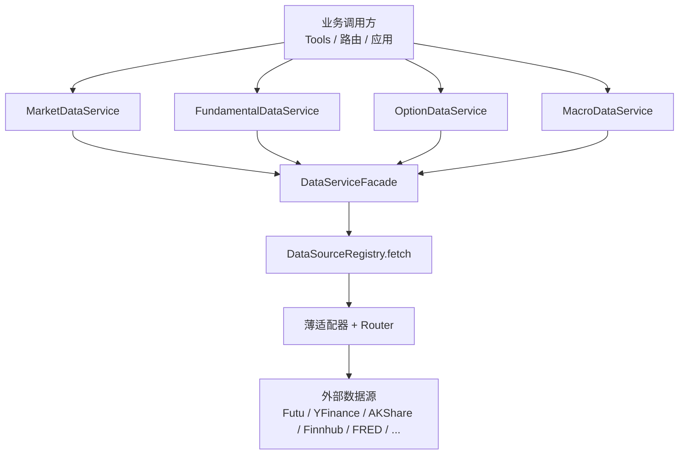
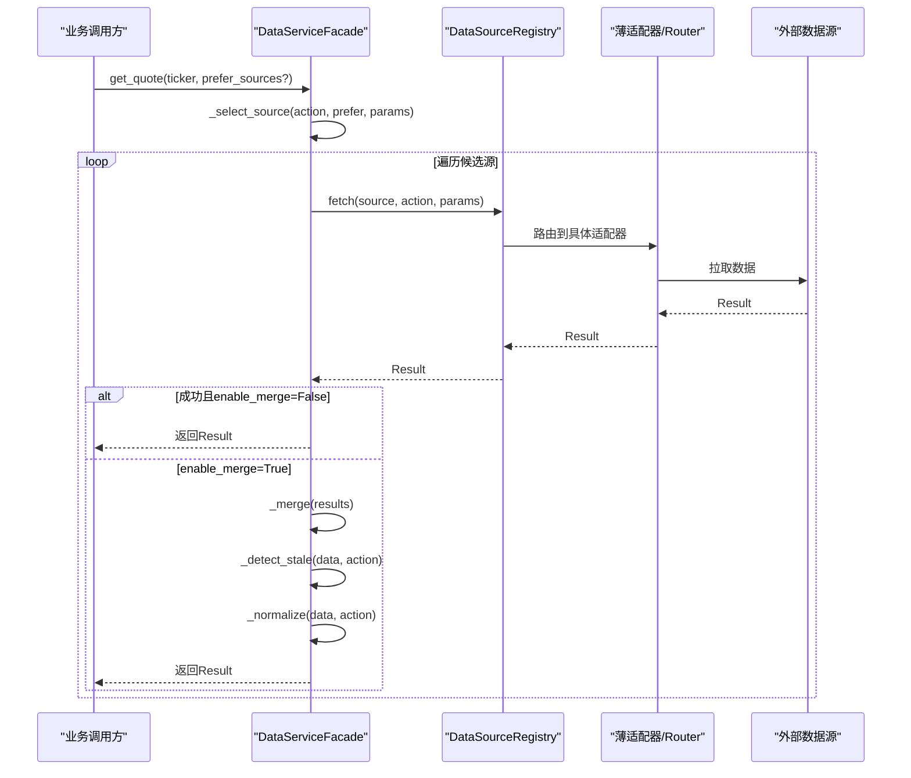
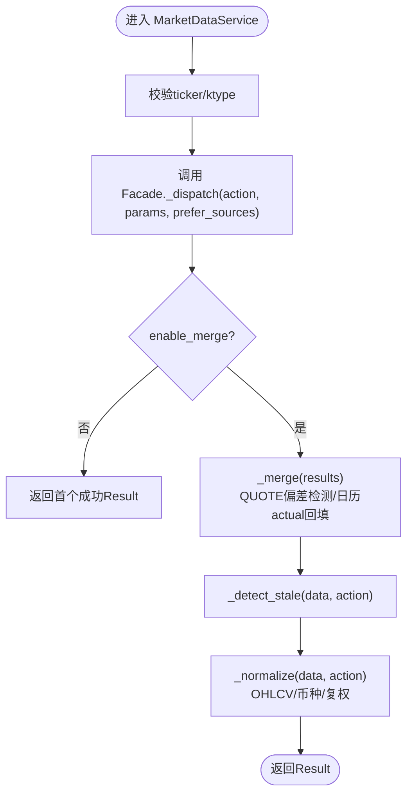
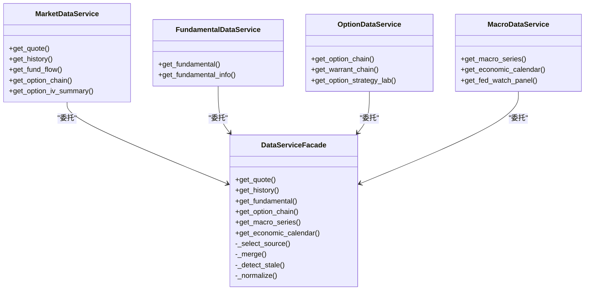

# 业务Facade设计

<cite>
**本文引用的文件**
- [backend/services/datasource/business/facade.py](file://backend/services/datasource/business/facade.py)
- [backend/services/datasource/business/market.py](file://backend/services/datasource/business/market.py)
- [backend/services/datasource/business/fundamental.py](file://backend/services/datasource/business/fundamental.py)
- [backend/services/datasource/business/option.py](file://backend/services/datasource/business/option.py)
- [backend/services/datasource/business/macro.py](file://backend/services/datasource/business/macro.py)
- [docs/23. 业务数据源聚合Facade设计.md](file://docs/23. 业务数据源聚合Facade设计.md)
- [backend/tests/test_be_arch06_facade.py](file://backend/tests/test_be_arch06_facade.py)
</cite>

## 目录
1. [引言](#引言)
2. [项目结构](#项目结构)
3. [核心组件](#核心组件)
4. [架构总览](#架构总览)
5. [详细组件分析](#详细组件分析)
6. [依赖关系分析](#依赖关系分析)
7. [性能与可用性](#性能与可用性)
8. [故障排查指南](#故障排查指南)
9. [结论](#结论)
10. [附录：使用示例与扩展指南](#附录使用示例与扩展指南)

## 引言
本设计文档面向Quant Agent的业务Facade层，聚焦“业务数据源聚合Facade”的职责、接口与实现策略。Facade位于薄适配器之上，向上提供统一业务语义（行情、基本面、期权、宏观），向下通过统一的DataSourceRegistry取数，承担多源路由、结果融合、业务级检测与归一化等职责，使上层业务逻辑无需感知底层数据源细节。

## 项目结构
- 业务Facade核心：`backend/services/datasource/business/facade.py`
- 领域封装：
  - 行情：`market.py`
  - 基本面：`fundamental.py`
  - 期权：`option.py`
  - 宏观：`macro.py`
- 设计文档：`docs/23. 业务数据源聚合Facade设计.md`
- 测试用例：`backend/tests/test_be_arch06_facade.py`

图表来源
- [backend/services/datasource/business/facade.py:1070-1144](file://backend/services/datasource/business/facade.py#L1070-L1144)
- [backend/services/datasource/business/market.py:28-71](file://backend/services/datasource/business/market.py#L28-L71)
- [backend/services/datasource/business/fundamental.py:18-41](file://backend/services/datasource/business/fundamental.py#L18-L41)
- [backend/services/datasource/business/option.py:18-70](file://backend/services/datasource/business/option.py#L18-L70)
- [backend/services/datasource/business/macro.py:20-56](file://backend/services/datasource/business/macro.py#L20-L56)

章节来源
- [docs/23. 业务数据源聚合Facade设计.md:46-92](file://docs/23. 业务数据源聚合Facade设计.md#L46-L92)
- [backend/services/datasource/business/facade.py:1070-1144](file://backend/services/datasource/business/facade.py#L1070-L1144)

## 核心组件
- DataServiceFacade：统一调度入口，负责选源、取数、融合、检测、归一化。
- MarketDataService：行情领域封装，提供get_quote/get_history/get_fund_flow/get_option_chain等。
- FundamentalDataService：基本面领域封装，提供get_fundamental/get_fundamental_info。
- OptionDataService：期权领域封装，提供get_option_chain/get_warrant_chain/get_option_strategy_lab等。
- MacroDataService：宏观领域封装，提供get_macro_series/get_economic_calendar/get_fed_watch_panel等。

章节来源
- [backend/services/datasource/business/facade.py:212-1144](file://backend/services/datasource/business/facade.py#L212-L1144)
- [backend/services/datasource/business/market.py:28-229](file://backend/services/datasource/business/market.py#L28-L229)
- [backend/services/datasource/business/fundamental.py:18-41](file://backend/services/datasource/business/fundamental.py#L18-L41)
- [backend/services/datasource/business/option.py:18-235](file://backend/services/datasource/business/option.py#L18-L235)
- [backend/services/datasource/business/macro.py:20-163](file://backend/services/datasource/business/macro.py#L20-L163)

## 架构总览
Facade模式在数据源聚合中的作用：
- 统一接口抽象：对外暴露业务语义方法（如get_quote/get_history），屏蔽底层action差异。
- 多数据源路由：基于市场感知、健康度、限流退避、业务权重选择候选源。
- 结果合并策略：单源直接采用；多源按新鲜度或领域规则融合（如ECONOMIC_CALENDAR的actual回填）。
- 业务级检测与归一化：Stale检测、字段完整性校验、OHLCV/币种/复权统一。

图表来源
- [backend/services/datasource/business/facade.py:1070-1144](file://backend/services/datasource/business/facade.py#L1070-L1144)
- [backend/services/datasource/business/facade.py:1148-1215](file://backend/services/datasource/business/facade.py#L1148-L1215)
- [backend/services/datasource/business/facade.py:1217-1251](file://backend/services/datasource/business/facade.py#L1217-L1251)
- [backend/services/datasource/business/facade.py:1253-1323](file://backend/services/datasource/business/facade.py#L1253-L1323)

## 详细组件分析

### 行情数据Facade（MarketDataService）
- 统一访问接口：
  - get_quote：实时行情快照，支持prefer_sources覆盖。
  - get_history：历史K线，自动ktype归一（DAY/WEEK/MON/MIN_*）。
  - get_fund_flow：当日主力资金流。
  - get_capital_distribution：主力筹码分层+背离信号派生。
  - get_heat_map：板块热力图面板派生。
  - get_order_book：L2盘口深度，派生spread/imbalance。
  - get_market_snapshot：批量快照面板统计。
  - get_stock_basicinfo：全市场基本信息。
  - get_option_iv_summary：IV指标聚合（ATM IV、IV分位、RV30d、Skew）。
  - get_option_chain：期权链及OCC合约代码。
- 策略要点：
  - ticker校验与ktype归一。
  - 市场感知路由（US/HK/CN）优先Futu真实报价，备选Finnhub/AKShare/Tushare/YFinance。
  - 多源融合仅在QUOTE启用，其他动作默认单源。

图表来源
- [backend/services/datasource/business/market.py:28-229](file://backend/services/datasource/business/market.py#L28-L229)
- [backend/services/datasource/business/facade.py:1070-1144](file://backend/services/datasource/business/facade.py#L1070-L1144)
- [backend/services/datasource/business/facade.py:1217-1251](file://backend/services/datasource/business/facade.py#L1217-L1251)
- [backend/services/datasource/business/facade.py:1253-1323](file://backend/services/datasource/business/facade.py#L1253-L1323)

章节来源
- [backend/services/datasource/business/market.py:28-229](file://backend/services/datasource/business/market.py#L28-L229)

### 基本面数据Facade（FundamentalDataService）
- 统一访问接口：
  - get_fundamental：个股基本面（PE/PB/ROE/做空比例等）。
  - get_fundamental_info：公司概况/财务详情（profile/income_statement等）。
- 策略要点：
  - ticker校验。
  - 市场感知路由：美股futu/fmp/yfinance；港股yfinance/akshare；A股akshare/tushare。
  - 三源合并（get_fundamental_merged）并发拉取Futu(FINANCIALS/VALUATION)、FMP、YFinance，任一失败不影响整体，全部失败返回ALL_SOURCES_FAILED。

章节来源
- [backend/services/datasource/business/fundamental.py:18-41](file://backend/services/datasource/business/fundamental.py#L18-L41)
- [backend/services/datasource/business/facade.py:472-555](file://backend/services/datasource/business/facade.py#L472-L555)
- [backend/services/datasource/business/facade.py:814-849](file://backend/services/datasource/business/facade.py#L814-L849)

### 期权数据Facade（OptionDataService）
- 统一访问接口：
  - get_option_chain：期权链与OCC合约代码。
  - get_warrant_chain：窝轮链（Futu专属）。
  - get_option_strategy：期权策略组合（STRANGLE等）。
  - get_option_volatility：期权波动率。
  - get_option_strategy_lab：损益实验室（到期纯代数推演，Greeks求和）。
- 策略要点：
  - 入参必须为正股/ETF/指数（策略组合）或期权合约（波动率）。
  - 损益曲线基于真实组合腿行权价与权利金计算，缺失字段不臆造。
  - Greeks敞口为各腿真实值求和，缺失字段跳过而非补零。

章节来源
- [backend/services/datasource/business/option.py:18-235](file://backend/services/datasource/business/option.py#L18-L235)

### 宏观数据Facade（MacroDataService）
- 统一访问接口：
  - get_macro_series：宏观经济序列（FRED等）。
  - get_economic_calendar：经济日历（fred/dbnomics/rbi多源融合，actual回填）。
  - get_company_news：公司新闻（事件驱动视角）。
  - get_fed_watch / get_fed_watch_panel：FOMC隐含概率与面板派生（下一会议隐含利率、政策斜率）。
- 策略要点：
  - 经济日历以country+event去重，actual/estimate互补回填。
  - FedWatch面板防御式识别日期列与利率区间列，输出next_meeting_implied_rate与policy_slope。

章节来源
- [backend/services/datasource/business/macro.py:20-163](file://backend/services/datasource/business/macro.py#L20-L163)
- [backend/services/datasource/business/facade.py:1052-1066](file://backend/services/datasource/business/facade.py#L1052-L1066)

## 依赖关系分析
- Facade仅通过DataSourceRegistry.fetch取数，禁止直连第三方库或HTTP。
- 领域服务（Market/Fundamental/Option/Macro）封装业务语义，内部复用Facade能力。
- 源选择策略依赖：
  - 健康度过滤（is_available/capabilities）。
  - 限流退避（rate_limit_registry）。
  - 业务权重（DATASOURCE_*_BUSINESS_WEIGHT）。
  - 市场感知偏好（US/HK/CN）。

图表来源
- [backend/services/datasource/business/facade.py:212-1144](file://backend/services/datasource/business/facade.py#L212-L1144)
- [backend/services/datasource/business/market.py:28-229](file://backend/services/datasource/business/market.py#L28-L229)
- [backend/services/datasource/business/fundamental.py:18-41](file://backend/services/datasource/business/fundamental.py#L18-L41)
- [backend/services/datasource/business/option.py:18-235](file://backend/services/datasource/business/option.py#L18-L235)
- [backend/services/datasource/business/macro.py:20-163](file://backend/services/datasource/business/macro.py#L20-L163)

章节来源
- [backend/services/datasource/business/facade.py:1148-1215](file://backend/services/datasource/business/facade.py#L1148-L1215)

## 性能与可用性
- 并发与降级：
  - 基本面三源合并使用asyncio.gather，单源异常不拖垮整体。
  - 卖空拥挤度监控并发拉取Futu与HKEX监管数据，T-1红线处理no_data。
- 指标与可观测性：
  - DATASOURCE_FACADE_MERGE记录融合模式（single/multi/deviation/calendar_merge）。
  - DATASOURCE_QUOTE_DEVIATION记录报价偏差超阈值次数。
- 稳定性：
  - 归一化与检测异常捕获，保留原data避免500。
  - 全源失败返回明确错误码ALL_SOURCES_FAILED，便于上层告警。

章节来源
- [backend/services/datasource/business/facade.py:490-555](file://backend/services/datasource/business/facade.py#L490-L555)
- [backend/services/datasource/business/facade.py:852-990](file://backend/services/datasource/business/facade.py#L852-L990)
- [backend/services/datasource/business/facade.py:1120-1144](file://backend/services/datasource/business/facade.py#L1120-L1144)

## 故障排查指南
- 常见问题定位：
  - 所有源失败：检查capabilities是否声明对应action，健康度与限流退避状态。
  - 报价偏差告警：核对不同源last_price/price字段一致性，调整QUOTE_DEVIATION_PCT。
  - 数据陈旧：确认timestamp/update_time/time字段存在且合理，调整STALE_THRESHOLD_SEC。
  - 归一化失败：检查OHLCV别名映射，确保时间字段time存在。
- 调试建议：
  - 使用prefer_sources临时指定源，验证特定源行为。
  - 查看Result.source与error.message，定位失败源与原因。
  - 结合测试用例模拟多源场景，验证融合与降级路径。

章节来源
- [backend/tests/test_be_arch06_facade.py:65-150](file://backend/tests/test_be_arch06_facade.py#L65-L150)
- [backend/services/datasource/business/facade.py:1106-1144](file://backend/services/datasource/business/facade.py#L1106-L1144)

## 结论
业务Facade层通过统一接口抽象、多源路由、结果融合与业务级检测，显著降低了上层业务对底层数据源的耦合度，提升了系统的可维护性与可扩展性。各领域服务专注业务语义封装，Facade专注跨源策略与质量保障，形成清晰的分层边界。

## 附录：使用示例与扩展指南

### 使用示例
- 行情快照：
  - 调用MarketDataService.get_quote获取实时报价，支持prefer_sources覆盖。
  - 处理返回Result.data中的last_price/price/close字段，注意currency标注。
- 历史K线：
  - 调用MarketDataService.get_history，自动ktype归一，返回OHLCV标准化字段。
- 基本面合并：
  - 调用Facade.get_fundamental_merged并发拉取三路真基本面，任一失败不影响整体。
- 期权损益实验室：
  - 调用OptionDataService.get_option_strategy_lab，基于真实组合腿计算损益曲线与Greeks敞口。
- 宏观日历：
  - 调用MacroDataService.get_economic_calendar，获得fred/dbnomics/rbi融合后的events，actual回填。

章节来源
- [backend/services/datasource/business/market.py:37-71](file://backend/services/datasource/business/market.py#L37-L71)
- [backend/services/datasource/business/fundamental.py:24-32](file://backend/services/datasource/business/fundamental.py#L24-L32)
- [backend/services/datasource/business/option.py:73-226](file://backend/services/datasource/business/option.py#L73-L226)
- [backend/services/datasource/business/macro.py:34-40](file://backend/services/datasource/business/macro.py#L34-L40)

### 扩展指南
- 添加新业务领域Facade：
  - 新建领域模块（如new_domain.py），封装业务语义方法，内部委托Facade._dispatch。
  - 定义新的action常量与参数结构，注册到DataSourceInterface capabilities。
- 实现数据源切换：
  - 通过prefer_sources参数临时覆盖源优先级。
  - 配置DATASOURCE_*_BUSINESS_WEIGHT环境变量调整默认权重。
- 配置优先级策略：
  - 市场感知偏好：在facade.py中扩展_MARKET_*_PREFERENCE字典。
  - 融合策略：在_merge中新增action分支，实现领域特定融合逻辑。
  - 检测与归一化：在_detect_stale/_normalize中补充领域规则。

章节来源
- [backend/services/datasource/business/facade.py:1148-1215](file://backend/services/datasource/business/facade.py#L1148-L1215)
- [backend/services/datasource/business/facade.py:1217-1251](file://backend/services/datasource/business/facade.py#L1217-L1251)
- [backend/services/datasource/business/facade.py:1253-1323](file://backend/services/datasource/business/facade.py#L1253-L1323)