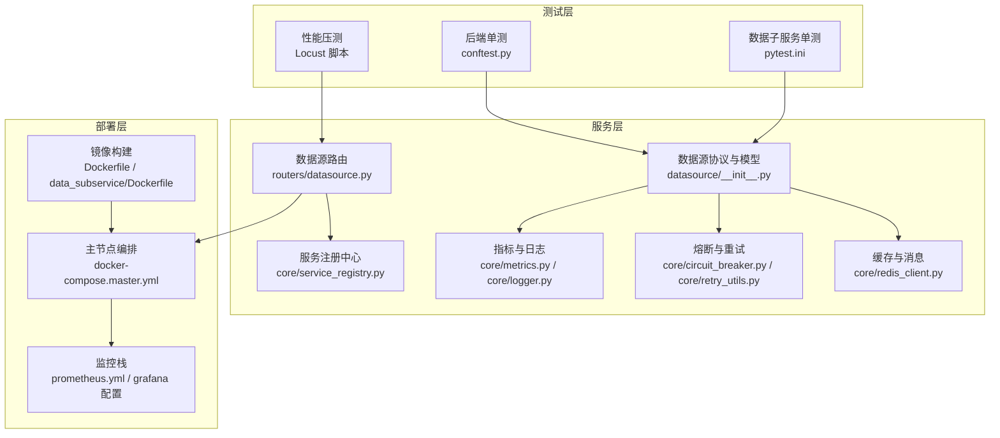
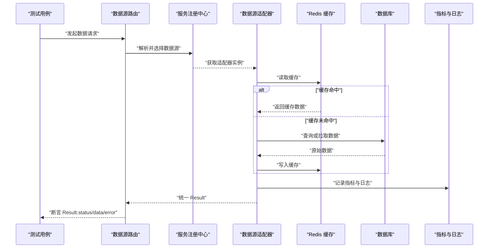
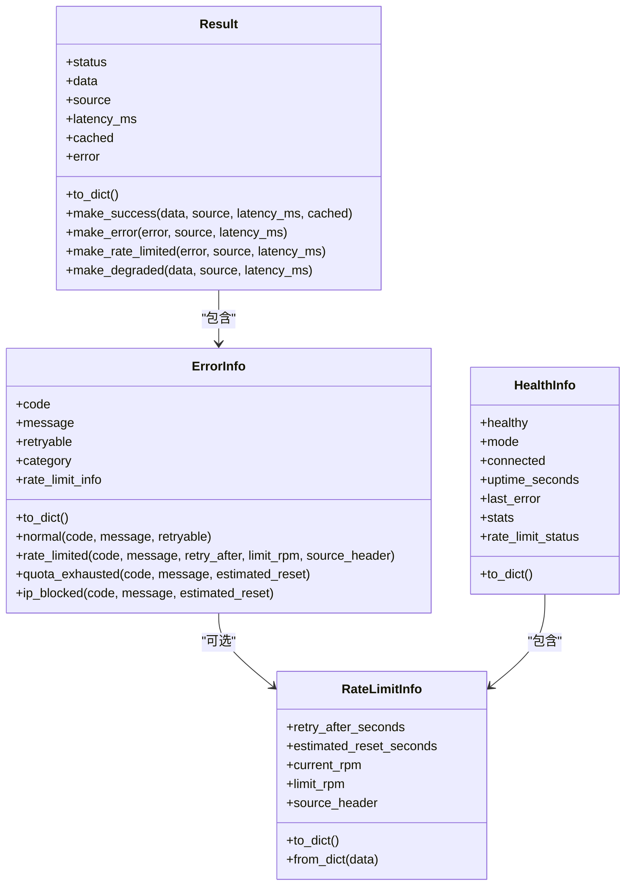
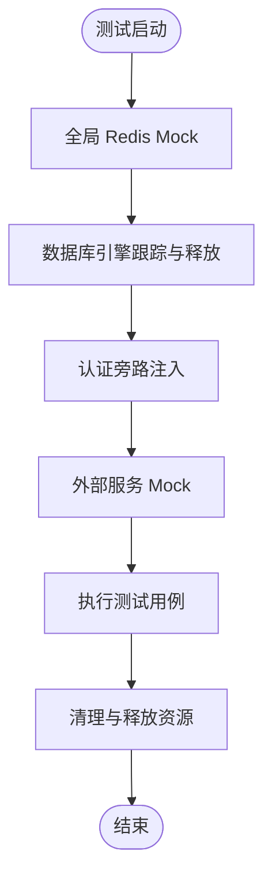
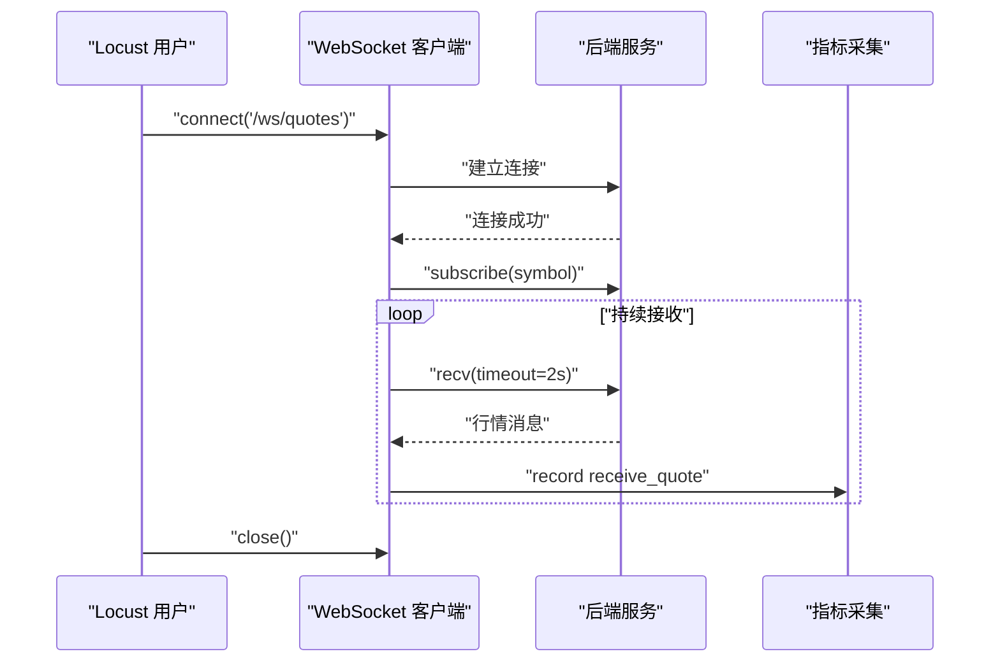
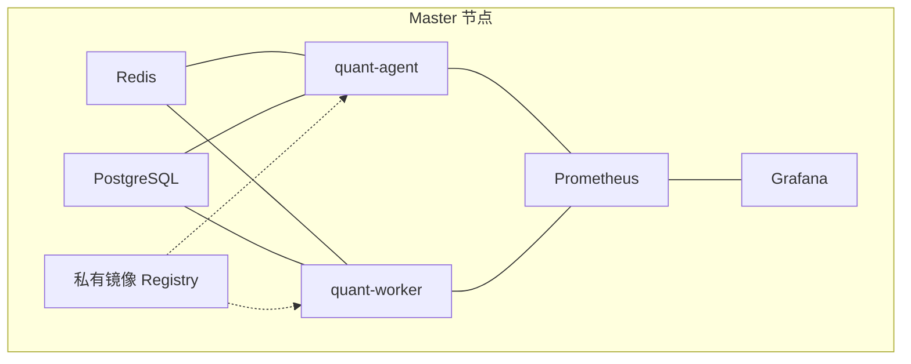
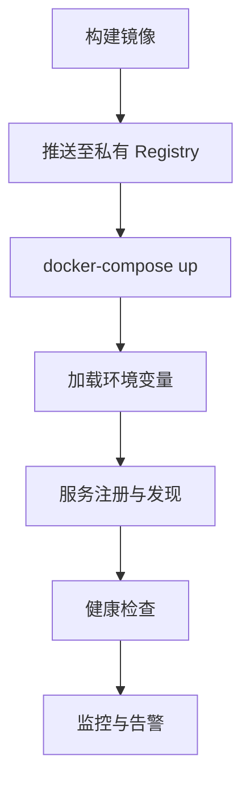
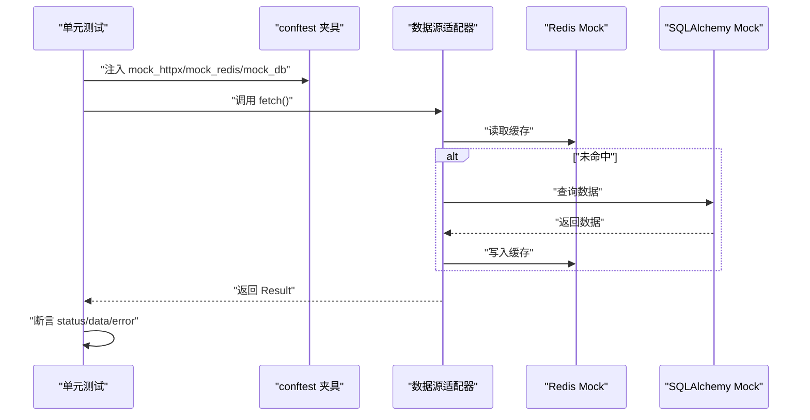
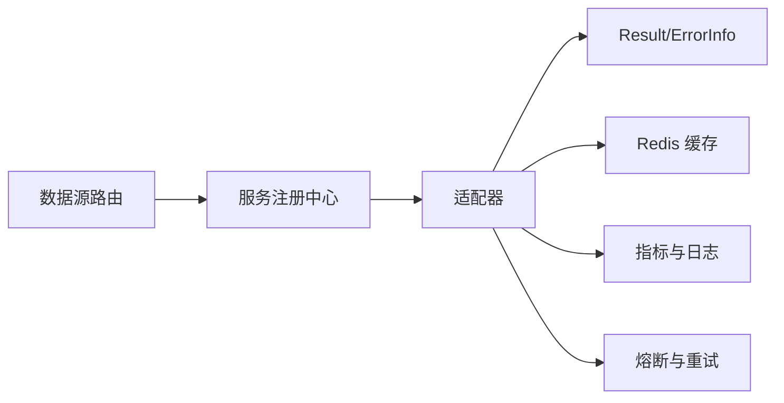

# 测试与部署

<cite>
**本文引用的文件**
- [backend/tests/conftest.py](file://backend/tests/conftest.py)
- [data_subservice/pytest.ini](file://data_subservice/pytest.ini)
- [scripts/locust_ws_stress.py](file://scripts/locust_ws_stress.py)
- [docker-compose.master.yml](file://docker-compose.master.yml)
- [backend/services/datasource/__init__.py](file://backend/services/datasource/__init__.py)
- [backend/routers/datasource.py](file://backend/routers/datasource.py)
- [backend/core/service_registry.py](file://backend/core/service_registry.py)
- [backend/core/metrics.py](file://backend/core/metrics.py)
- [backend/core/logger.py](file://backend/core/logger.py)
- [backend/core/circuit_breaker.py](file://backend/core/circuit_breaker.py)
- [backend/core/retry_utils.py](file://backend/core/retry_utils.py)
- [backend/core/redis_client.py](file://backend/core/redis_client.py)
- [backend/main.py](file://backend/main.py)
- [Dockerfile](file://Dockerfile)
- [data_subservice/Dockerfile](file://data_subservice/Dockerfile)
- [prometheus.yml](file://prometheus.yml)
- [grafana/provisioning/alerting/alerting.yml](file://grafana/provisioning/alerting/alerting.yml)
- [grafana/provisioning/dashboards/dashboard.yml](file://grafana/provisioning/dashboards/dashboard.yml)
- [config/prometheus_rules.yml](file://config/prometheus_rules.yml)
</cite>

## 目录
1. [简介](#简介)
2. [项目结构](#项目结构)
3. [核心组件](#核心组件)
4. [架构总览](#架构总览)
5. [详细组件分析](#详细组件分析)
6. [依赖关系分析](#依赖关系分析)
7. [性能考虑](#性能考虑)
8. [故障排查指南](#故障排查指南)
9. [结论](#结论)
10. [附录](#附录)

## 简介
本指南面向 Quant Agent 自定义数据源的测试与部署，覆盖分层测试策略（单元、集成、端到端）、Mock 数据生成、性能测试方法、集成环境搭建（Docker 编排、依赖服务、测试数据初始化）、部署流程（镜像构建、环境变量、服务注册发现），以及运维监控（健康检查、告警、日志收集、故障排查）。文档以仓库现有实现为依据，提供可操作的步骤与图示。

## 项目结构
Quant Agent 的测试与部署围绕以下关键区域展开：
- 后端测试基础设施：统一的 pytest fixtures、全局 Mock、数据库与 Redis 隔离、认证旁路等，确保数据源适配器测试稳定、可重复。
- 数据子服务独立测试：因重型 SDK 隔离在 data_subservice 中，使用独立的 pytest 配置运行。
- 性能压测脚本：基于 Locust 的 WebSocket 与 REST 压力测试，用于评估行情订阅与查询接口吞吐与延迟。
- 容器编排与部署：master 节点通过 docker-compose 编排 Redis、PostgreSQL、主服务、工作进程、监控栈；提供健康检查与资源限制。
- 数据源协议与统一返回：定义 Result/ErrorInfo/HealthInfo 等统一模型，便于各适配器一致化输出与测试断言。

**图表来源**
- [backend/tests/conftest.py:24-175](file://backend/tests/conftest.py#L24-L175)
- [data_subservice/pytest.ini:17-36](file://data_subservice/pytest.ini#L17-L36)
- [scripts/locust_ws_stress.py:1-262](file://scripts/locust_ws_stress.py#L1-L262)
- [backend/services/datasource/__init__.py:23-468](file://backend/services/datasource/__init__.py#L23-L468)
- [backend/routers/datasource.py](file://backend/routers/datasource.py)
- [backend/core/service_registry.py](file://backend/core/service_registry.py)
- [backend/core/metrics.py](file://backend/core/metrics.py)
- [backend/core/logger.py](file://backend/core/logger.py)
- [backend/core/circuit_breaker.py](file://backend/core/circuit_breaker.py)
- [backend/core/retry_utils.py](file://backend/core/retry_utils.py)
- [backend/core/redis_client.py](file://backend/core/redis_client.py)
- [docker-compose.master.yml:16-276](file://docker-compose.master.yml#L16-L276)
- [Dockerfile](file://Dockerfile)
- [data_subservice/Dockerfile](file://data_subservice/Dockerfile)
- [prometheus.yml](file://prometheus.yml)

**章节来源**
- [backend/tests/conftest.py:24-175](file://backend/tests/conftest.py#L24-L175)
- [data_subservice/pytest.ini:17-36](file://data_subservice/pytest.ini#L17-L36)
- [scripts/locust_ws_stress.py:1-262](file://scripts/locust_ws_stress.py#L1-L262)
- [backend/services/datasource/__init__.py:23-468](file://backend/services/datasource/__init__.py#L23-L468)
- [docker-compose.master.yml:16-276](file://docker-compose.master.yml#L16-L276)

## 核心组件
- 统一数据源协议与返回模型：Result、ErrorInfo、RateLimitInfo、HealthInfo 等，为所有数据源适配器提供一致的输入输出契约，便于单元测试断言与集成测试验证。
- 错误分类与限流处理：ErrorCategory 区分普通错误与限流类错误，配合 RateLimitStatus 与退避策略，使测试可覆盖不同降级路径。
- 服务注册与发现：DataSourceRegistry 与 RateLimitRegistry 管理数据源实例与限流状态，支持多源切换与动态治理。
- 测试夹具与隔离：conftest.py 提供数据库会话、Redis Mock、HTTP 客户端、认证旁路、外部服务 Mock 等，保证测试稳定性与可重复性。
- 性能压测：Locust 脚本模拟 WebSocket 行情订阅与 REST 查询，支持分布式执行与无头模式，便于 CI 集成。
- 容器编排与健康检查：docker-compose.master.yml 编排 Redis、PostgreSQL、主服务与工作进程，配置健康检查与资源限制，保障服务可用性。

**章节来源**
- [backend/services/datasource/__init__.py:23-468](file://backend/services/datasource/__init__.py#L23-L468)
- [backend/tests/conftest.py:24-175](file://backend/tests/conftest.py#L24-L175)
- [scripts/locust_ws_stress.py:1-262](file://scripts/locust_ws_stress.py#L1-L262)
- [docker-compose.master.yml:16-276](file://docker-compose.master.yml#L16-L276)

## 架构总览
下图展示数据源适配器的调用链路与测试/部署关键点：

**图表来源**
- [backend/routers/datasource.py](file://backend/routers/datasource.py)
- [backend/core/service_registry.py](file://backend/core/service_registry.py)
- [backend/services/datasource/__init__.py:227-307](file://backend/services/datasource/__init__.py#L227-L307)
- [backend/core/redis_client.py](file://backend/core/redis_client.py)
- [backend/core/metrics.py](file://backend/core/metrics.py)
- [backend/core/logger.py](file://backend/core/logger.py)

## 详细组件分析

### 数据源协议与统一返回模型
- 统一返回结构 Result 包含状态、数据、来源、延迟、缓存标记与错误信息，提供 make_success/make_error/make_rate_limited/make_degraded 快捷构造，便于测试断言不同分支。
- ErrorInfo 与 ErrorCategory 将错误分为普通与限流类，限流类错误不计入熔断器失败计数，测试可覆盖 rate_limit/quota_exhausted/ip_blocked 场景。
- HealthInfo 与 RateLimitStatus 提供健康与限流状态，便于集成测试校验服务降级与恢复。

**图表来源**
- [backend/services/datasource/__init__.py:227-307](file://backend/services/datasource/__init__.py#L227-L307)
- [backend/services/datasource/__init__.py:100-211](file://backend/services/datasource/__init__.py#L100-L211)
- [backend/services/datasource/__init__.py:348-371](file://backend/services/datasource/__init__.py#L348-L371)

**章节来源**
- [backend/services/datasource/__init__.py:23-468](file://backend/services/datasource/__init__.py#L23-L468)

### 测试夹具与隔离策略
- 全局 Redis Mock：自动 patch 已知模块中的 redis_client/l1_cached_redis/redis_batch_writer，提供 get/set/delete/exists/expire/pipeline/pubsub 等能力，避免真实网络依赖。
- 数据库引擎释放：包装 SQLAlchemy create_engine/create_async_engine，统一登记并在会话结束时 dispose，消除连接泄漏警告。
- 认证旁路：对特定路由前缀注入假用户，避免鉴权干扰数据源适配器测试。
- 外部服务 Mock：默认禁用真实 Futu/yfinance 连接，可通过 no_mock_external 标记跳过。

**图表来源**
- [backend/tests/conftest.py:177-268](file://backend/tests/conftest.py#L177-L268)
- [backend/tests/conftest.py:36-98](file://backend/tests/conftest.py#L36-L98)
- [backend/tests/conftest.py:585-679](file://backend/tests/conftest.py#L585-L679)
- [backend/tests/conftest.py:271-295](file://backend/tests/conftest.py#L271-L295)

**章节来源**
- [backend/tests/conftest.py:24-175](file://backend/tests/conftest.py#L24-L175)
- [backend/tests/conftest.py:177-268](file://backend/tests/conftest.py#L177-L268)
- [backend/tests/conftest.py:271-295](file://backend/tests/conftest.py#L271-L295)
- [backend/tests/conftest.py:585-679](file://backend/tests/conftest.py#L585-L679)

### 数据子服务独立测试
- 独立 pytest 配置：testpaths、markers、asyncio_mode、env、filterwarnings 与主工程保持一致，避免重型 SDK 污染 backend 环境。
- 运行方式：在 data_subservice 目录下安装 requirements.txt 后执行 pytest -c pytest.ini，确保导入路径正确。

**章节来源**
- [data_subservice/pytest.ini:1-36](file://data_subservice/pytest.ini#L1-L36)

### 性能测试方法
- WebSocket 压力测试：Locust 脚本模拟 1000 并发行情订阅，连接/订阅/接收消息全流程记录延迟，支持 master/worker 分布式与无头模式。
- REST API 压力测试：健康检查、行情查询、K 线查询、筛选器接口作为任务集，统计吞吐与 P95/P99 延迟。
- 指标采集：通过 events.request.fire 上报请求类型、名称、响应时间与异常，便于后续分析与报告导出。

**图表来源**
- [scripts/locust_ws_stress.py:34-117](file://scripts/locust_ws_stress.py#L34-L117)
- [scripts/locust_ws_stress.py:119-199](file://scripts/locust_ws_stress.py#L119-L199)
- [scripts/locust_ws_stress.py:201-262](file://scripts/locust_ws_stress.py#L201-L262)

**章节来源**
- [scripts/locust_ws_stress.py:1-262](file://scripts/locust_ws_stress.py#L1-L262)

### 集成测试环境搭建
- Docker 编排：master 节点包含 Redis、PostgreSQL、quant-agent、quant-worker、私有镜像 Registry、Prometheus、Grafana，均配置健康检查与资源限制。
- 依赖服务准备：Redis 绑定内网与回环地址，PostgreSQL 仅内网访问；quant-agent/quant-worker 通过内部服务名通信，避免 host.docker.internal 问题。
- 测试数据初始化：通过环境变量注入数据库 URL、Redis 密码、量化环境标志等；可在测试夹具中设置 SQLite 内存库与最小化 bcrypt 成本加速测试。

**图表来源**
- [docker-compose.master.yml:16-276](file://docker-compose.master.yml#L16-L276)

**章节来源**
- [docker-compose.master.yml:16-276](file://docker-compose.master.yml#L16-L276)

### 部署流程
- 容器镜像构建：后端与数据子服务分别提供 Dockerfile，按需构建镜像并推送到私有 Registry。
- 环境变量配置：REDIS_HOST/PORT/PASSWORD、DATABASE_URL、QUANT_ENV、OTEL_ENABLED、DATA_SOURCE_ROUTER_ENABLED 等，确保服务间通信与功能开关正确。
- 服务注册发现：通过 DataSourceRegistry 与 RateLimitRegistry 管理数据源实例与限流状态，支持运行时切换与治理。

**图表来源**
- [Dockerfile](file://Dockerfile)
- [data_subservice/Dockerfile](file://data_subservice/Dockerfile)
- [docker-compose.master.yml:76-165](file://docker-compose.master.yml#L76-L165)
- [backend/core/service_registry.py](file://backend/core/service_registry.py)

**章节来源**
- [Dockerfile](file://Dockerfile)
- [data_subservice/Dockerfile](file://data_subservice/Dockerfile)
- [docker-compose.master.yml:76-165](file://docker-compose.master.yml#L76-L165)

### 编写数据源适配器的测试用例示例
- 单元测试：使用 conftest 提供的 mock_httpx、mock_redis、mock_db 等夹具，构造 Result 断言 status/data/error，覆盖 success/error/rate_limited/degraded 分支。
- 集成测试：启用 live_network 标记或 no_mock_external 标记，结合真实或半真实依赖，验证适配器与下游服务的交互。
- 端到端测试：通过 FastAPI TestClient 或 httpx.AsyncClient 调用路由，验证数据源路由到适配器的完整链路。

**图表来源**
- [backend/tests/conftest.py:320-353](file://backend/tests/conftest.py#L320-L353)
- [backend/services/datasource/__init__.py:227-307](file://backend/services/datasource/__init__.py#L227-L307)

**章节来源**
- [backend/tests/conftest.py:320-353](file://backend/tests/conftest.py#L320-L353)
- [backend/services/datasource/__init__.py:227-307](file://backend/services/datasource/__init__.py#L227-L307)

### 执行测试套件与分析结果
- 后端单测：在 backend 目录执行 pytest，利用 conftest 的全局 Mock 与隔离，快速反馈适配器逻辑正确性。
- 数据子服务单测：在 data_subservice 目录执行 pytest -c pytest.ini，确保重型 SDK 不污染主环境。
- 性能压测：使用 Locust 脚本进行 WebSocket 与 REST 压测，导出 CSV 报告分析 P95/P99 延迟与错误率。

**章节来源**
- [data_subservice/pytest.ini:17-36](file://data_subservice/pytest.ini#L17-L36)
- [scripts/locust_ws_stress.py:1-262](file://scripts/locust_ws_stress.py#L1-L262)

## 依赖关系分析
- 数据源协议与适配器：适配器需遵循 Result/ErrorInfo/HealthInfo 契约，通过 DataSourceRegistry 注册与发现。
- 缓存与消息：Redis 用于缓存与发布订阅，测试中通过全局 Mock 替代真实连接。
- 指标与日志：metrics.py 与 logger.py 记录性能与调试信息，便于监控与排障。
- 熔断与重试：circuit_breaker.py 与 retry_utils.py 提供容错与重试机制，测试需覆盖熔断与退避路径。

**图表来源**
- [backend/services/datasource/__init__.py:227-307](file://backend/services/datasource/__init__.py#L227-L307)
- [backend/core/redis_client.py](file://backend/core/redis_client.py)
- [backend/core/metrics.py](file://backend/core/metrics.py)
- [backend/core/logger.py](file://backend/core/logger.py)
- [backend/core/circuit_breaker.py](file://backend/core/circuit_breaker.py)
- [backend/core/retry_utils.py](file://backend/core/retry_utils.py)
- [backend/core/service_registry.py](file://backend/core/service_registry.py)

**章节来源**
- [backend/services/datasource/__init__.py:227-307](file://backend/services/datasource/__init__.py#L227-L307)
- [backend/core/redis_client.py](file://backend/core/redis_client.py)
- [backend/core/metrics.py](file://backend/core/metrics.py)
- [backend/core/logger.py](file://backend/core/logger.py)
- [backend/core/circuit_breaker.py](file://backend/core/circuit_breaker.py)
- [backend/core/retry_utils.py](file://backend/core/retry_utils.py)
- [backend/core/service_registry.py](file://backend/core/service_registry.py)

## 性能考虑
- 并发与资源限制：主服务通过 uvicorn 参数控制并发与最大请求数，防止内存膨胀；容器级别设置 CPU/内存限制，保障稳态运行。
- 缓存命中率：合理设计缓存键与过期策略，减少下游依赖压力，提升响应速度。
- 限流与退避：针对第三方 API 的频率限制，采用指数退避与配额耗尽检测，避免雪崩。
- 压测目标：WebSocket 行情订阅 P95 延迟 < 100ms，REST 查询在高并发下保持低错误率与稳定吞吐。

[本节为通用指导，无需具体文件引用]

## 故障排查指南
- 健康检查：通过 /api/v1/health 与容器 healthcheck 确认服务状态；Prometheus/Grafana 可视化监控指标。
- 告警规则：配置 prometheus_rules.yml 与 Grafana alerting.yml，针对延迟、错误率、限流次数设置阈值。
- 日志收集：结构化日志与指标上报，结合 Tempo/Grafana 进行链路追踪与根因分析。
- 常见问题：
  - 连接失败：检查 Redis/PostgreSQL 健康状态与网络绑定。
  - 限流频繁：查看 RateLimitStatus 与错误分类，调整退避策略与并发。
  - 熔断触发：分析熔断器状态与失败原因，必要时重置或扩容。

**章节来源**
- [docker-compose.master.yml:110-115](file://docker-compose.master.yml#L110-L115)
- [prometheus.yml](file://prometheus.yml)
- [grafana/provisioning/alerting/alerting.yml](file://grafana/provisioning/alerting/alerting.yml)
- [config/prometheus_rules.yml](file://config/prometheus_rules.yml)

## 结论
Quant Agent 的数据源测试与部署体系以统一协议为核心，结合完善的测试夹具、独立子服务测试、性能压测与容器编排，形成从开发到运维的闭环。通过标准化 Result/ErrorInfo/HealthInfo 与严格的隔离策略，确保适配器质量与系统稳定性；借助 Prometheus/Grafana 与告警规则，实现可观测性与快速排障。建议持续完善测试覆盖率与压测基线，优化缓存与限流策略，保障高可用与高性能。

[本节为总结，无需具体文件引用]

## 附录
- 常用命令参考：
  - 运行后端单测：cd backend && pytest
  - 运行数据子服务单测：cd data_subservice && pytest -c pytest.ini
  - 启动主节点：docker-compose -f docker-compose.master.yml up -d
  - 启动监控：docker-compose -f docker-compose.master.yml --profile monitoring up -d
  - 执行压测：locust -f scripts/locust_ws_stress.py --host ws://localhost:8000 --headless -u 1000 -r 10 -t 60s --csv=locust_report

[本节为补充信息，无需具体文件引用]