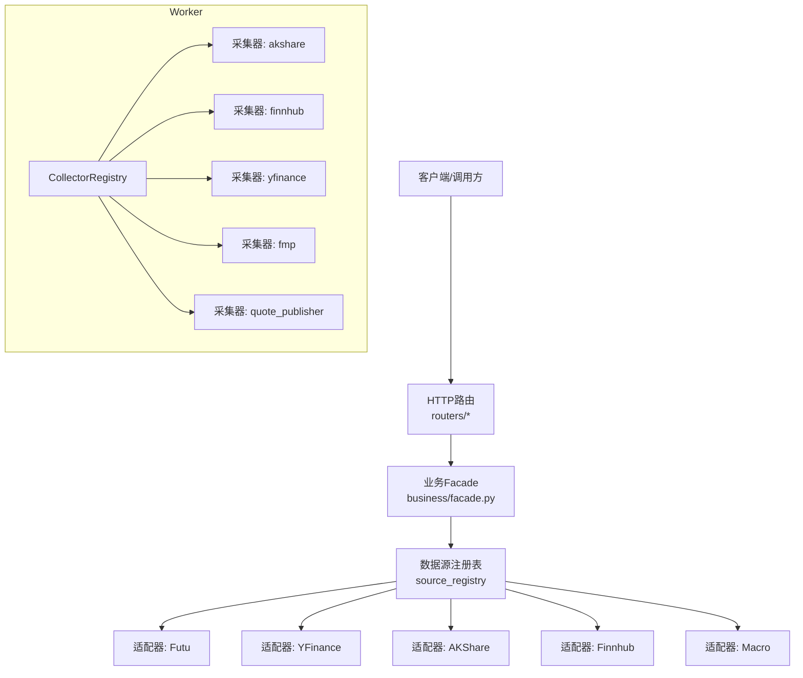
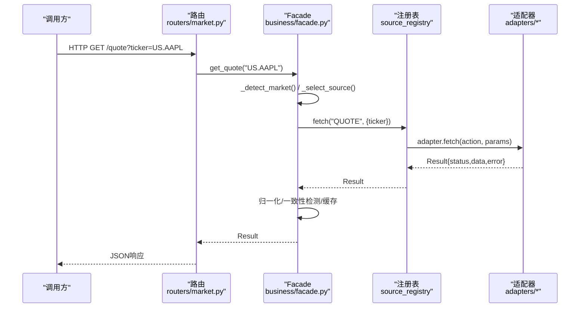
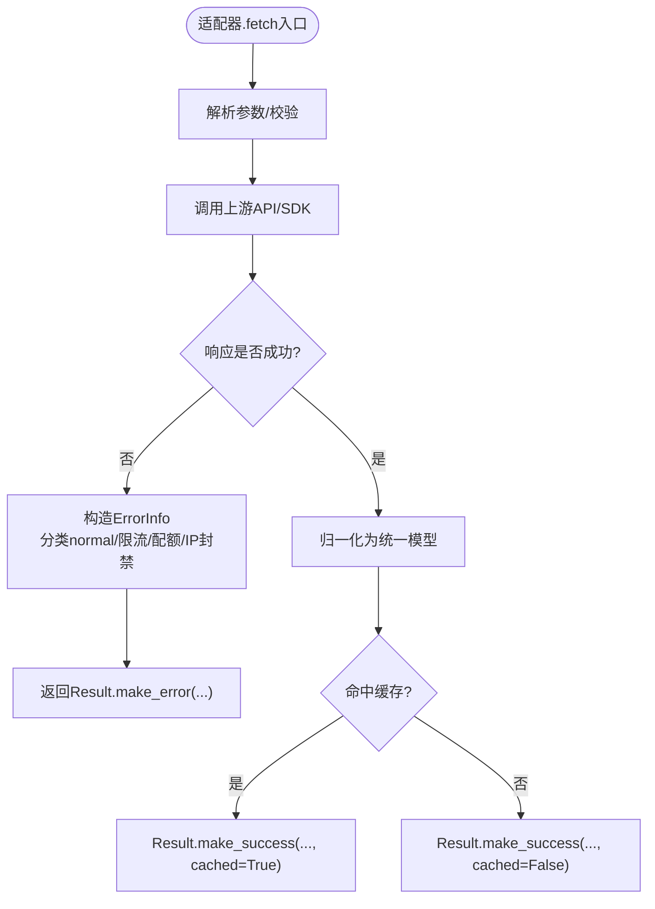
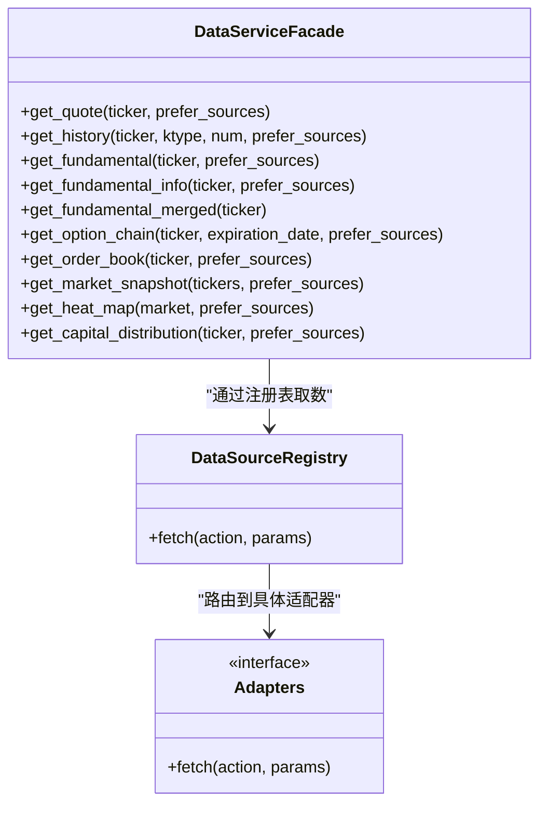
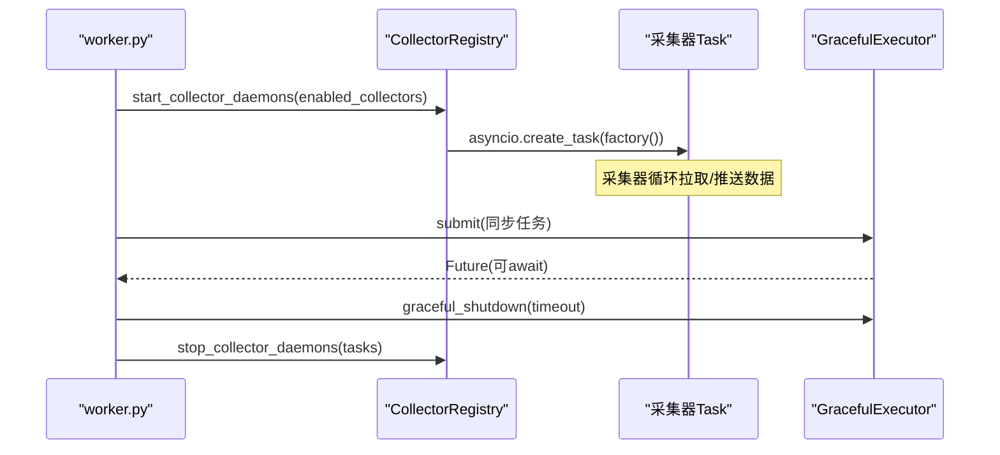
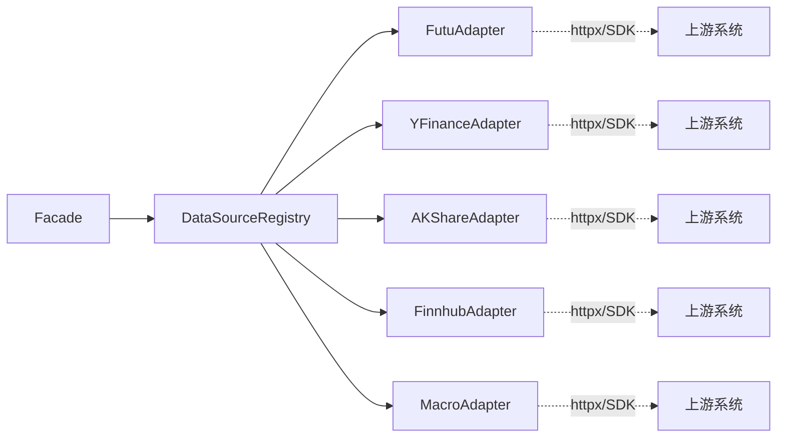

# 自定义数据源开发

<cite>
**本文引用的文件**
- [backend/services/datasource/__init__.py](file://backend/services/datasource/__init__.py)
- [backend/services/datasource/protocol.py](file://backend/services/datasource/protocol.py)
- [backend/services/datasource/business/facade.py](file://backend/services/datasource/business/facade.py)
- [backend/core/retry_utils.py](file://backend/core/retry_utils.py)
- [backend/core/graceful_executor.py](file://backend/core/graceful_executor.py)
- [backend/workers/collector_registry.py](file://backend/workers/collector_registry.py)
- [backend/services/datasource/adapters/futu.py](file://backend/services/datasource/adapters/futu.py)
- [backend/services/datasource/adapters/yfinance.py](file://backend/services/datasource/adapters/legacy_yfinance.py)
- [backend/services/datasource/adapters/akshare.py](file://backend/services/datasource/adapters/akshare.py)
- [backend/services/datasource/adapters/finnhub.py](file://backend/services/datasource/adapters/finnhub.py)
- [backend/services/datasource/adapters/macro.py](file://backend/services/datasource/adapters/macro.py)
- [backend/routers/market.py](file://backend/routers/market.py)
- [backend/routers/options.py](file://backend/routers/options.py)
- [backend/routers/macro.py](file://backend/routers/macro.py)
- [backend/routers/market_fundamental.py](file://backend/routers/market_fundamental.py)
</cite>

## 目录
1. [简介](#简介)
2. [项目结构](#项目结构)
3. [核心组件](#核心组件)
4. [架构总览](#架构总览)
5. [详细组件分析](#详细组件分析)
6. [依赖关系分析](#依赖关系分析)
7. [性能考虑](#性能考虑)
8. [故障排查指南](#故障排查指南)
9. [结论](#结论)
10. [附录：示例与最佳实践](#附录示例与最佳实践)

## 简介
本文件面向“Quant Agent”的自定义数据源开发，提供从适配器规范、业务Facade设计、Worker开发到测试策略与部署上线的全流程文档。目标是让开发者在不了解底层实现细节的情况下，也能快速接入新的数据源并稳定运行于生产环境。

## 项目结构
后端围绕“统一协议 + 多适配器 + 业务Facade + Worker采集器”的分层架构组织：
- 协议层：定义所有数据源必须实现的 DataSourceInterface，以及统一的 Result/ErrorInfo/RateLimitInfo/HealthInfo。
- 适配器层：各数据源（Futu、YFinance、AKShare、Finnhub、Macro等）实现协议，屏蔽差异。
- 业务Facade：面向业务的语义接口（行情、基本面、期权、宏观），负责选源、融合、归一化、一致性检测与缓存。
- Worker层：后台采集器注册表与守护进程，负责定时/长连接数据采集与发布。
- Router层：HTTP路由将请求转发至Facade或具体服务。

图表来源
- [backend/services/datasource/business/facade.py:1-120](file://backend/services/datasource/business/facade.py#L1-L120)
- [backend/workers/collector_registry.py:1-124](file://backend/workers/collector_registry.py#L1-L124)

章节来源
- [backend/services/datasource/business/facade.py:1-120](file://backend/services/datasource/business/facade.py#L1-L120)
- [backend/workers/collector_registry.py:1-124](file://backend/workers/collector_registry.py#L1-L124)

## 核心组件
- 统一协议与模型
  - DataSourceInterface：强制每个数据源暴露 name/version/capabilities/mode/is_available/health/fetch。
  - Result/ErrorInfo/RateLimitInfo/HealthInfo：统一返回结构、错误分类与限流信息、健康状态。
- 业务Facade
  - 市场数据：get_quote/get_history/get_order_book/get_market_snapshot 等。
  - 基本面数据：get_fundamental/get_fundamental_info/get_fundamental_merged。
  - 期权数据：get_option_chain。
  - 宏观数据：通过适配器 macro 暴露系列/日历等能力。
- Worker与采集器
  - CollectorRegistry：集中声明采集器元数据与启动工厂，支持优雅关停。
  - GracefulExecutor：线程池优雅关闭，保障任务完成与资源释放。
- 重试与降级
  - retry_utils：基于tenacity的指数退避重试，识别限流/封禁/网络异常。
  - Facade内部的多源融合与降级策略，保证可用性。

章节来源
- [backend/services/datasource/protocol.py:1-47](file://backend/services/datasource/protocol.py#L1-L47)
- [backend/services/datasource/__init__.py:23-371](file://backend/services/datasource/__init__.py#L23-L371)
- [backend/services/datasource/business/facade.py:212-800](file://backend/services/datasource/business/facade.py#L212-L800)
- [backend/core/retry_utils.py:1-58](file://backend/core/retry_utils.py#L1-L58)
- [backend/core/graceful_executor.py:1-204](file://backend/core/graceful_executor.py#L1-L204)
- [backend/workers/collector_registry.py:1-124](file://backend/workers/collector_registry.py#L1-L124)

## 架构总览
下图展示一次“获取美股报价”的请求路径：Router接收请求→Facade根据ticker判定市场与action→选择优先级源→经DataSourceRegistry.fetch调用具体适配器→返回Result→Facade做归一化与偏差检测→返回给调用方。

图表来源
- [backend/services/datasource/business/facade.py:68-118](file://backend/services/datasource/business/facade.py#L68-L118)
- [backend/services/datasource/business/facade.py:220-242](file://backend/services/datasource/business/facade.py#L220-L242)
- [backend/services/datasource/protocol.py:12-47](file://backend/services/datasource/protocol.py#L12-L47)

## 详细组件分析

### 适配器开发规范
- 接口契约
  - 必须实现 DataSourceInterface：name、version、capabilities、mode、is_available、health、fetch(action, params)。
  - fetch 必须返回 Result（含 status/data/error/latency_ms/source/cached）。
- 数据模型转换
  - 适配器内部可自由解析上游数据，但对外必须转换为Facade期望的统一结构（如OHLCV、币种、时间粒度、复权）。
  - 对于缺失字段应保留None而非臆造，遵循“零幻觉红线”。
- 错误处理标准
  - 使用 ErrorInfo 表达错误，区分 normal/rate_limit/quota_exhausted/ip_blocked/data_unavailable。
  - 限流类错误需附带 RateLimitInfo（retry_after_seconds、estimated_reset_seconds、limit_rpm等）。
  - 对429/403/超时/网络异常进行重试时，结合 retry_utils 的 is_retryable_http_error 判断。
- 日志记录规范
  - 在关键路径（选源、失败、降级、合并）记录结构化日志，包含 action、ticker、source、latency_ms、error.code。
  - 避免打印敏感信息（密钥、完整URL、用户隐私）。

图表来源
- [backend/services/datasource/__init__.py:227-306](file://backend/services/datasource/__init__.py#L227-L306)
- [backend/core/retry_utils.py:10-58](file://backend/core/retry_utils.py#L10-L58)

章节来源
- [backend/services/datasource/protocol.py:12-47](file://backend/services/datasource/protocol.py#L12-L47)
- [backend/services/datasource/__init__.py:23-371](file://backend/services/datasource/__init__.py#L23-L371)
- [backend/core/retry_utils.py:1-58](file://backend/core/retry_utils.py#L1-L58)

### 业务Facade设计
- 统一接口
  - 市场数据：get_quote、get_history、get_order_book、get_market_snapshot、get_heat_map、get_capital_distribution。
  - 基本面数据：get_fundamental、get_fundamental_info、get_fundamental_merged（并发三源合并）。
  - 期权数据：get_option_chain。
  - 宏观数据：通过macro适配器暴露系列/日历等能力，Facade按action路由。
- 选源策略
  - 基于市场（US/HK/CN）与action（QUOTE/FUNDAMENTAL/NEWS/FLOW等）的优先级表选择源。
  - 权重可通过环境变量覆盖（DATASOURCE_*_BUSINESS_WEIGHT）。
- 多源融合与一致性
  - 对报价进行偏差检测（可配置百分比阈值），触发告警或降级。
  - 对经济日历事件按country+event去重，actual/estimate互补回填。
- 缓存与新鲜度
  - 不同action有stale阈值（秒），超过即判为过期，优先拉取新数据。
  - 结果携带cached标志，便于上层统计命中率。

图表来源
- [backend/services/datasource/business/facade.py:212-800](file://backend/services/datasource/business/facade.py#L212-L800)
- [backend/services/datasource/protocol.py:12-47](file://backend/services/datasource/protocol.py#L12-L47)

章节来源
- [backend/services/datasource/business/facade.py:68-118](file://backend/services/datasource/business/facade.py#L68-L118)
- [backend/services/datasource/business/facade.py:159-206](file://backend/services/datasource/business/facade.py#L159-L206)
- [backend/services/datasource/business/facade.py:490-555](file://backend/services/datasource/business/facade.py#L490-L555)

### Worker开发指南
- 异步任务处理
  - 采集器以协程形式启动，CollectorRegistry.start_collector_daemons遍历factory创建Task。
  - 使用asyncio.gather管理多个采集器生命周期。
- 资源管理
  - 使用GracefulExecutor封装线程池，提交同步任务并追踪active/submitted/completed计数。
  - 在应用shutdown阶段调用graceful_shutdown等待任务完成，避免中断。
- 重试机制
  - 外部API调用使用with_global_retry装饰器，自动识别限流/封禁/网络异常并指数退避重试。
- 优雅关闭
  - stop_collector_daemons取消Task并gather等待；GracefulExecutor.graceful_shutdown设置超时，防止无限等待。

图表来源
- [backend/workers/collector_registry.py:97-124](file://backend/workers/collector_registry.py#L97-L124)
- [backend/core/graceful_executor.py:60-165](file://backend/core/graceful_executor.py#L60-L165)

章节来源
- [backend/workers/collector_registry.py:1-124](file://backend/workers/collector_registry.py#L1-L124)
- [backend/core/graceful_executor.py:1-204](file://backend/core/graceful_executor.py#L1-L204)
- [backend/core/retry_utils.py:1-58](file://backend/core/retry_utils.py#L1-L58)

### 测试策略
- 单元测试
  - 针对适配器fetch的边界条件（空数据、字段缺失、类型转换）编写用例。
  - 验证Result/ErrorInfo/RateLimitInfo序列化与反序列化。
- 集成测试
  - 使用Mock数据或本地桩服务模拟上游API，端到端验证Facade选源与融合逻辑。
  - 覆盖多市场（US/HK/CN）与多action（QUOTE/FUNDAMENTAL/OPTION_CHAIN/MACRO_SERIES）。
- Mock数据
  - 为每个适配器准备典型场景的JSON样例（成功、限流、配额耗尽、IP封禁、数据不可用）。
- 性能测试
  - 使用Locust或自定义脚本压测Facade并发拉取与合并，观察延迟与CPU/内存占用。
  - 监控指标：latency_ms、缓存命中率、熔断器状态、限流次数。

[本节为通用指导，不直接分析具体文件]

## 依赖关系分析
- 耦合与内聚
  - Facade仅依赖DataSourceRegistry，不直接import具体适配器，降低耦合。
  - 适配器实现DataSourceInterface，内聚各自的上游解析与错误处理。
- 外部依赖
  - httpx/tornado/websocket等用于网络通信；Redis用于缓存与队列；数据库用于持久化。
- 潜在循环依赖
  - 通过分层与注册表解耦，避免模块间循环导入。
- 接口契约
  - 所有数据源必须满足DataSourceInterface，确保Router/Facade可统一调度。

图表来源
- [backend/services/datasource/business/facade.py:212-242](file://backend/services/datasource/business/facade.py#L212-L242)
- [backend/services/datasource/protocol.py:12-47](file://backend/services/datasource/protocol.py#L12-L47)

章节来源
- [backend/services/datasource/business/facade.py:212-242](file://backend/services/datasource/business/facade.py#L212-L242)
- [backend/services/datasource/protocol.py:12-47](file://backend/services/datasource/protocol.py#L12-L47)

## 性能考虑
- 并发与批处理
  - Facade对基本面三源并发拉取（asyncio.gather），减少端到端延迟。
  - 批量快照（SNAPSHOT）限制每批数量，避免上游压力。
- 缓存与新鲜度
  - 不同action设置stale阈值，命中缓存直接返回，降低上游压力。
- 限流与退避
  - 使用RateLimitThrottler与BackoffStrategy，结合classify_http_error与parse_retry_after，智能退避。
- 资源控制
  - GracefulExecutor限制最大工作线程与等待超时，防止OOM与长时间阻塞。
- 观测性
  - 记录latency_ms、缓存命中、错误分类、限流状态，便于定位瓶颈。

[本节为通用指导，不直接分析具体文件]

## 故障排查指南
- 常见问题
  - 429/403频繁：检查ErrorCategory是否为rate_limit/ip_blocked，确认Retry-After与限流头。
  - 数据为空：确认stale阈值与缓存策略，核对上游返回结构。
  - 高延迟：查看latency_ms与并发度，评估是否需要增加缓存或调整优先级。
- 定位步骤
  - 查看Result.error.code/message与ErrorInfo.category。
  - 检查Facade选源策略与市场判定是否正确。
  - 使用GracefulExecutor.stats与CollectorRegistry任务状态确认Worker健康。
- 恢复策略
  - 触发降级：返回缓存或过期数据（DEGRADED），并标记cached=True。
  - 熔断保护：对持续失败的源暂时降权或隔离。

章节来源
- [backend/services/datasource/__init__.py:23-371](file://backend/services/datasource/__init__.py#L23-L371)
- [backend/core/retry_utils.py:10-58](file://backend/core/retry_utils.py#L10-L58)
- [backend/core/graceful_executor.py:101-165](file://backend/core/graceful_executor.py#L101-L165)

## 结论
通过统一协议、业务Facade与Worker采集器的分层设计，Quant Agent实现了可扩展、高可用、易维护的数据源体系。开发者只需遵循适配器规范与错误处理标准，即可快速接入新数据源，并在生产环境中获得稳定的表现。

[本节为总结，不直接分析具体文件]

## 附录：示例与最佳实践

### 示例：实现新的数据源适配器
- 步骤
  1. 新建适配器文件（如 backend/services/datasource/adapters/newsrc.py），实现DataSourceInterface。
  2. 在fetch中解析上游数据，构造Result（含ErrorInfo/RateLimitInfo）。
  3. 注册到DataSourceRegistry（若需要），或通过Facade的市场感知策略自动路由。
  4. 编写单元测试与集成测试，覆盖成功、限流、配额耗尽、IP封禁、数据不可用场景。
- 参考路径
  - [backend/services/datasource/adapters/futu.py](file://backend/services/datasource/adapters/futu.py)
  - [backend/services/datasource/adapters/legacy_yfinance.py](file://backend/services/datasource/adapters/legacy_yfinance.py)
  - [backend/services/datasource/adapters/akshare.py](file://backend/services/datasource/adapters/akshare.py)
  - [backend/services/datasource/adapters/finnhub.py](file://backend/services/datasource/adapters/finnhub.py)
  - [backend/services/datasource/adapters/macro.py](file://backend/services/datasource/adapters/macro.py)

章节来源
- [backend/services/datasource/protocol.py:12-47](file://backend/services/datasource/protocol.py#L12-L47)
- [backend/services/datasource/__init__.py:227-306](file://backend/services/datasource/__init__.py#L227-L306)

### 示例：开发自定义Worker
- 步骤
  1. 在workers/collectors下新增采集器模块，实现start()工厂函数。
  2. 在CollectorRegistry.COLLECTORS中注册，描述名称、依赖与功能。
  3. 使用GracefulExecutor提交同步任务，确保优雅关闭。
  4. 编写测试用例，验证Task启动、停止与异常恢复。
- 参考路径
  - [backend/workers/collector_registry.py:48-85](file://backend/workers/collector_registry.py#L48-L85)
  - [backend/core/graceful_executor.py:60-165](file://backend/core/graceful_executor.py#L60-L165)

章节来源
- [backend/workers/collector_registry.py:1-124](file://backend/workers/collector_registry.py#L1-L124)
- [backend/core/graceful_executor.py:1-204](file://backend/core/graceful_executor.py#L1-L204)

### 示例：编写测试用例
- 单元测试
  - 验证Result/ErrorInfo/RateLimitInfo序列化与反序列化。
  - 验证适配器fetch在不同输入下的行为。
- 集成测试
  - 使用Mock数据模拟上游API，端到端验证Facade选源与融合。
  - 覆盖多市场与多action场景。
- 性能测试
  - 使用Locust压测Facade并发拉取，观察延迟与资源占用。

[本节为通用指导，不直接分析具体文件]

### 部署上线流程
- 前置检查
  - 确认适配器已注册、Facade路由正确、Worker已启用。
  - 配置限流与熔断策略，设置stale阈值与缓存策略。
- 灰度发布
  - 先在小流量环境验证，观察错误率与延迟。
  - 逐步扩大流量，监控指标与告警。
- 回滚策略
  - 若出现严重问题，快速回滚版本或禁用相关数据源。

[本节为通用指导，不直接分析具体文件]

### 最佳实践
- 代码复用
  - 复用Result/ErrorInfo/RateLimitInfo/HealthInfo，避免重复造轮子。
  - 使用Facade的统一方法，避免直连具体数据源。
- 配置管理
  - 通过环境变量覆盖业务权重与阈值（如DATASOURCE_*_BUSINESS_WEIGHT）。
- 安全考虑
  - 不在日志中输出敏感信息，使用加密存储密钥。
- 性能优化
  - 合理使用缓存与批处理，避免频繁小请求。
  - 使用并发拉取与降级策略，提升可用性。

[本节为通用指导，不直接分析具体文件]
