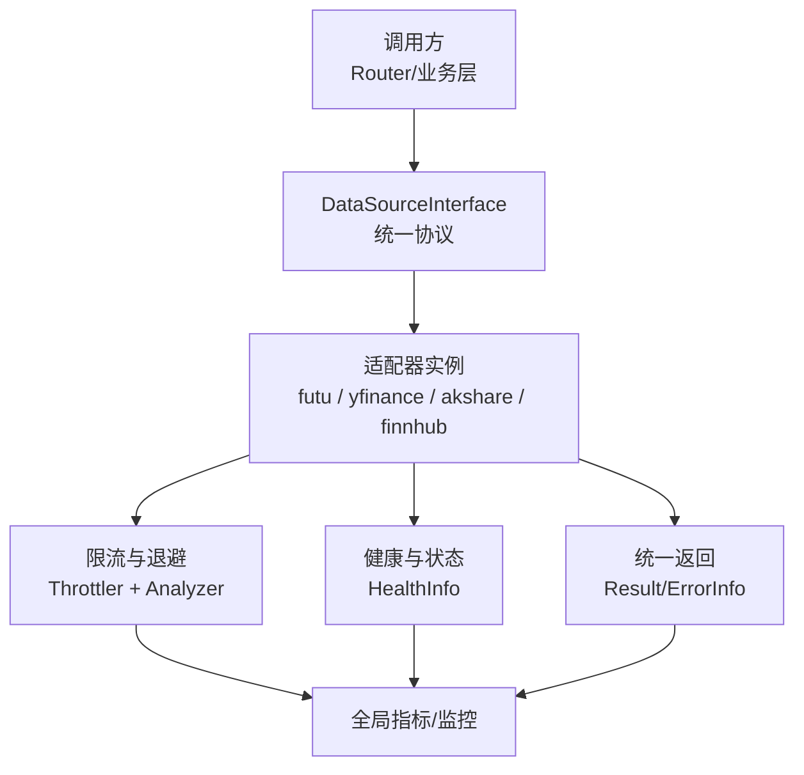
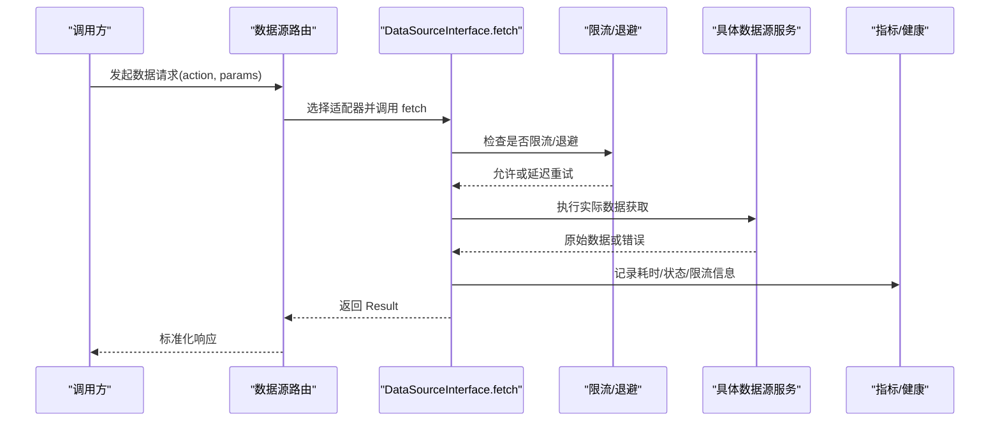
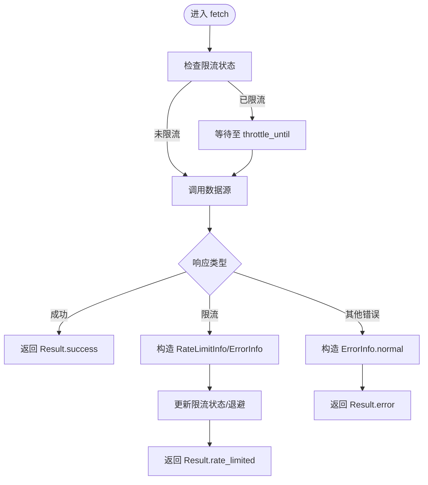
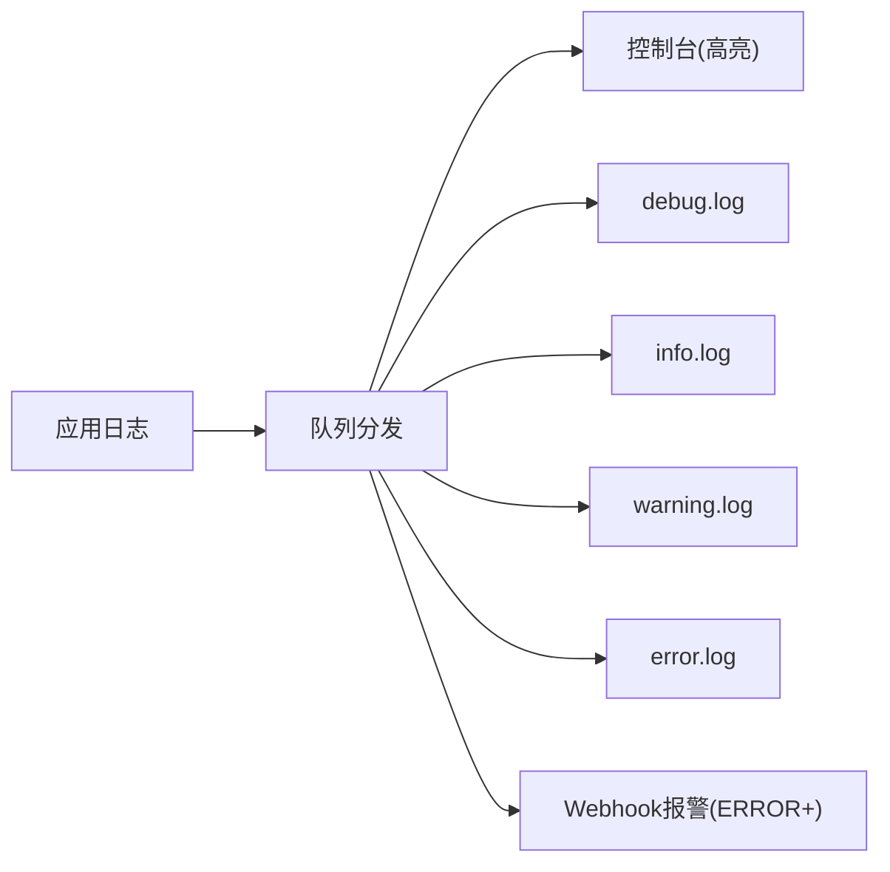
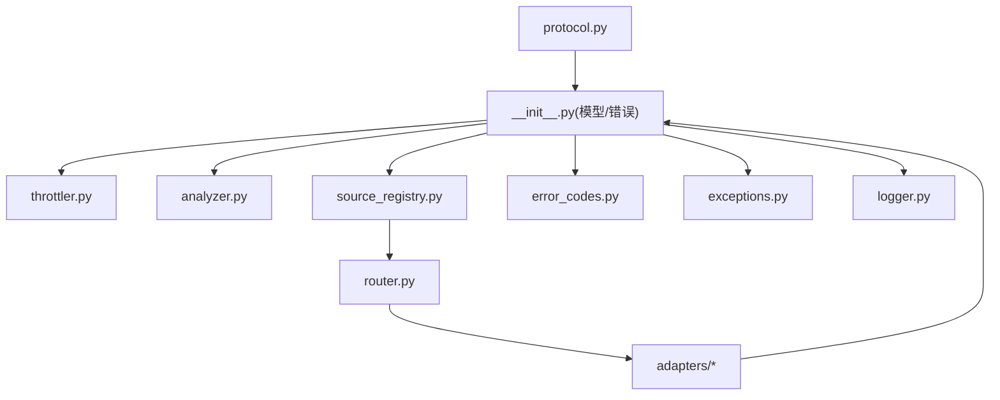

# 适配器开发规范

<cite>
**本文引用的文件**
- [backend/services/datasource/__init__.py](file://backend/services/datasource/__init__.py)
- [backend/services/datasource/protocol.py](file://backend/services/datasource/protocol.py)
- [backend/services/datasource/analyzer.py](file://backend/services/datasource/analyzer.py)
- [backend/services/datasource/throttler.py](file://backend/services/datasource/throttler.py)
- [backend/services/datasource/source_registry.py](file://backend/services/datasource/source_registry.py)
- [backend/services/datasource/router.py](file://backend/services/datasource/router.py)
- [data_subservice/_internal/error_codes.py](file://data_subservice/_internal/error_codes.py)
- [data_subservice/_internal/exceptions.py](file://data_subservice/_internal/exceptions.py)
- [backend/core/logger.py](file://backend/core/logger.py)
- [backend/services/datasource/adapters/futu.py](file://backend/services/datasource/adapters/futu.py)
- [backend/services/datasource/adapters/yfinance_adapter.py](file://backend/services/datasource/adapters/yfinance_adapter.py)
- [backend/services/datasource/adapters/akshare.py](file://backend/services/datasource/adapters/akshare.py)
- [backend/services/datasource/adapters/finnhub.py](file://backend/services/datasource/adapters/finnhub.py)
</cite>

## 目录
1. [简介](#简介)
2. [项目结构](#项目结构)
3. [核心组件](#核心组件)
4. [架构总览](#架构总览)
5. [详细组件分析](#详细组件分析)
6. [依赖关系分析](#依赖关系分析)
7. [性能考量](#性能考量)
8. [故障排查指南](#故障排查指南)
9. [结论](#结论)
10. [附录：实现新数据源适配器的步骤与示例](#附录：实现新数据源适配器的步骤与示例)

## 简介
本规范面向 Quant Agent 的数据源适配器开发，目标是统一“如何接入外部数据源”的接口、错误处理、日志与可观测性、以及性能与稳定性保障。通过统一的协议、返回结构与限流/熔断机制，确保新增数据源以最小成本融入系统，并具备可观测、可降级、可恢复的能力。

## 项目结构
围绕数据源适配的核心代码主要分布在以下位置：
- 协议与统一模型：backend/services/datasource/protocol.py、backend/services/datasource/__init__.py
- 限流与退避：backend/services/datasource/throttler.py、analyzer.py
- 注册与路由：source_registry.py、router.py
- 具体适配器实现：adapters/ 下的各数据源实现
- 错误码与异常（子服务侧）：data_subservice/_internal/error_codes.py、exceptions.py
- 日志与可观测性：backend/core/logger.py

图表来源
- [backend/services/datasource/protocol.py:12-47](file://backend/services/datasource/protocol.py#L12-L47)
- [backend/services/datasource/__init__.py:218-306](file://backend/services/datasource/__init__.py#L218-L306)
- [backend/services/datasource/throttler.py:1-200](file://backend/services/datasource/throttler.py#L1-L200)
- [backend/services/datasource/analyzer.py:1-200](file://backend/services/datasource/analyzer.py#L1-L200)

章节来源
- [backend/services/datasource/protocol.py:12-47](file://backend/services/datasource/protocol.py#L12-L47)
- [backend/services/datasource/__init__.py:218-306](file://backend/services/datasource/__init__.py#L218-L306)

## 核心组件
- DataSourceInterface：所有数据源必须实现的统一协议，包含 name/version/capabilities/mode/is_available/health/fetch 等能力与方法。
- Result/ErrorInfo/RateLimitInfo/HealthInfo：统一返回结构、错误详情、限流详情与健康信息，保证上层对结果的一致消费。
- ErrorCategory：错误分类体系，区分普通错误与限流/配额耗尽/IP封禁等场景，影响熔断与重试策略。
- Throttler/Analyzer：基于HTTP响应头与历史请求频率进行自适应退避与限流控制。
- Registry/Router：适配器注册与请求路由，屏蔽具体实现细节，提供集中治理。

章节来源
- [backend/services/datasource/protocol.py:12-47](file://backend/services/datasource/protocol.py#L12-L47)
- [backend/services/datasource/__init__.py:23-47](file://backend/services/datasource/__init__.py#L23-L47)
- [backend/services/datasource/__init__.py:54-93](file://backend/services/datasource/__init__.py#L54-L93)
- [backend/services/datasource/__init__.py:100-211](file://backend/services/datasource/__init__.py#L100-L211)
- [backend/services/datasource/__init__.py:218-306](file://backend/services/datasource/__init__.py#L218-L306)
- [backend/services/datasource/__init__.py:314-371](file://backend/services/datasource/__init__.py#L314-L371)
- [backend/services/datasource/__init__.py:379-424](file://backend/services/datasource/__init__.py#L379-L424)

## 架构总览
下图展示了从调用方到数据源的完整链路，包括协议约束、限流退避、健康检查与统一返回。

图表来源
- [backend/services/datasource/protocol.py:40-47](file://backend/services/datasource/protocol.py#L40-L47)
- [backend/services/datasource/__init__.py:218-306](file://backend/services/datasource/__init__.py#L218-L306)
- [backend/services/datasource/throttler.py:1-200](file://backend/services/datasource/throttler.py#L1-L200)
- [backend/services/datasource/analyzer.py:1-200](file://backend/services/datasource/analyzer.py#L1-L200)

## 详细组件分析

### 适配器接口规范（DataSourceInterface）
- 必需属性
  - name：数据源唯一标识（如 futu、yfinance、akshare、finnhub）
  - version：接口实现版本号
  - capabilities：支持的 action 列表
  - mode：运行模式（internal/external/hybrid）
- 必需方法
  - is_available()：当前可用性判断
  - health()：返回 HealthInfo，包含连接状态、运行时长、最近错误、限流状态等
  - fetch(action, params)：唯一数据获取入口，返回 Result（含 status/data/error/latency_ms/cached/source/self_recorded）

参数格式
- action：字符串，表示要执行的动作（如 quote、kline、search、fundamental 等），由 capabilities 声明
- params：字典，键值对为数据源特定查询参数；适配器内部负责校验与标准化

返回值结构
- Result.status：success/error/rate_limited/degraded
- Result.data：业务数据（结构化对象或原始数据）
- Result.error：ErrorInfo（当 status 非 success 时填充）
- Result.latency_ms：本次请求耗时（毫秒）
- Result.cached：是否命中缓存
- Result.source：数据来源标识
- Result.self_recorded：是否已在内部记录指标（避免重复统计）

章节来源
- [backend/services/datasource/protocol.py:12-47](file://backend/services/datasource/protocol.py#L12-L47)
- [backend/services/datasource/__init__.py:218-306](file://backend/services/datasource/__init__.py#L218-L306)

### 数据模型转换机制
- 目标：将不同数据源的原始数据转换为标准模型，便于上层统一消费。
- 映射规则
  - 字段标准化：统一时间戳为UTC、标价为浮点、数量为整数、缺失值用None或默认值
  - 类型安全：对数值型字段做范围校验与溢出保护，对枚举类字段做白名单校验
  - 结构对齐：将嵌套结构扁平化或按领域模型重组（如K线OHLCV、报价快照）
- 数据类型处理
  - 字符串清洗：去除空白、规范化大小写、编码统一
  - 日期时间：解析多种格式并转为标准datetime
  - 数值：空串转None，非法值记录告警并丢弃
- 建议实践
  - 在适配器内部定义明确的输入/输出Schema（Pydantic或dataclass）
  - 转换失败时返回 Result.make_error，携带 ErrorInfo 与错误码
  - 对关键路径增加单元测试覆盖边界条件

[本节为通用设计说明，不直接分析具体文件]

### 错误处理标准
- 错误分类（ErrorCategory）
  - normal：普通业务/网络错误，计入熔断器失败计数
  - rate_limit：频率限流（如HTTP 429），触发独立退避
  - quota_exhausted：配额耗尽（如日调用上限）
  - ip_blocked：IP封禁（反爬触发）
  - data_unavailable：标的层面数据不可用（不计入熔断器）
- 错误详情（ErrorInfo）
  - code：错误码（如 FUTU_DISCONNECTED、YFINANCE_429）
  - message：人类可读描述
  - retryable：是否可重试
  - category：错误分类
  - rate_limit_info：限流详情（retry_after_seconds、estimated_reset_seconds、current_rpm、limit_rpm、source_header）
- HTTP错误分类工具
  - classify_http_error：根据状态码与响应头推断错误分类
  - parse_retry_after：从响应头解析重试等待秒数
- 子服务错误码与异常
  - ErrorCode：全局错误码枚举（认证、权限、资源、熔断、内部错误等）
  - 自定义异常：AuthMissingError、TokenExpiredError、ValidationError、ResourceNotFoundError、FutuDisconnectedError、RedisUnavailableError、CircuitBreakerOpenError、AppError

章节来源
- [backend/services/datasource/__init__.py:23-47](file://backend/services/datasource/__init__.py#L23-L47)
- [backend/services/datasource/__init__.py:100-211](file://backend/services/datasource/__init__.py#L100-L211)
- [backend/services/datasource/__init__.py:379-424](file://backend/services/datasource/__init__.py#L379-L424)
- [data_subservice/_internal/error_codes.py:9-41](file://data_subservice/_internal/error_codes.py#L9-L41)
- [data_subservice/_internal/exceptions.py:13-103](file://data_subservice/_internal/exceptions.py#L13-L103)

### 重试策略与退避
- 限流状态（RateLimitStatus）
  - is_throttled：是否被限流
  - throttle_until：限流截止时间
  - estimated_rpm/estimated_limit_rpm：估计当前/限制RPM
  - consecutive_rate_limits：连续限流次数
  - total_rate_limits_1h：近一小时限流总数
  - backoff_strategy：退避策略名称
  - category：主导类别（rate_limit/quota_exhausted/ip_blocked）
- 退避引擎（Throttler/Analyzer）
  - 基于HTTP响应头（Retry-After、X-RateLimit-*）与历史频率动态调整
  - 支持指数退避、抖动、固定窗口等策略
  - 与熔断器解耦：限流类错误走独立退避路径，不影响熔断计数

图表来源
- [backend/services/datasource/__init__.py:314-371](file://backend/services/datasource/__init__.py#L314-L371)
- [backend/services/datasource/throttler.py:1-200](file://backend/services/datasource/throttler.py#L1-L200)
- [backend/services/datasource/analyzer.py:1-200](file://backend/services/datasource/analyzer.py#L1-L200)

章节来源
- [backend/services/datasource/__init__.py:314-371](file://backend/services/datasource/__init__.py#L314-L371)
- [backend/services/datasource/throttler.py:1-200](file://backend/services/datasource/throttler.py#L1-L200)
- [backend/services/datasource/analyzer.py:1-200](file://backend/services/datasource/analyzer.py#L1-L200)

### 日志记录规范
- 日志级别使用
  - DEBUG：调试与详细追踪
  - INFO：正常业务流程与关键事件
  - WARNING：潜在问题与降级提示
  - ERROR/CRITICAL：严重错误与熔断报警
- 结构化日志格式
  - 统一时间戳、级别、模块、消息体
  - 文件按级别分片存储，自动轮转与清理
  - 终端高亮显示，便于快速定位
- 性能指标收集
  - Result.latency_ms：每次请求耗时
  - 限流状态与次数：consecutive_rate_limits、total_rate_limits_1h
  - 健康信息：connected、uptime_seconds、last_error
- Webhook报警
  - 配置 ALERT_WEBHOOK_URL 后，ERROR及以上级别自动推送通知

图表来源
- [backend/core/logger.py:129-212](file://backend/core/logger.py#L129-L212)

章节来源
- [backend/core/logger.py:129-212](file://backend/core/logger.py#L129-L212)

### 健康检查与状态上报
- HealthInfo
  - healthy：整体健康度
  - mode：运行模式
  - connected：是否已连接
  - uptime_seconds：运行时长
  - last_error：最近错误信息
  - stats：统计信息
  - rate_limit_status：限流状态
- 适配器需定期刷新连接状态与限流状态，供上层监控与降级决策

章节来源
- [backend/services/datasource/__init__.py:348-371](file://backend/services/datasource/__init__.py#L348-L371)

## 依赖关系分析
- 协议与模型：protocol.py 定义接口；__init__.py 提供统一返回与错误分类
- 限流与退避：throttler.py、analyzer.py 提供自适应限流与频率分析
- 注册与路由：source_registry.py、router.py 管理适配器生命周期与请求分发
- 具体适配器：adapters/ 下实现不同数据源的具体逻辑
- 错误与异常：data_subservice/_internal/error_codes.py、exceptions.py 提供全局错误码与异常类型
- 日志与可观测性：backend/core/logger.py 提供统一日志与报警

图表来源
- [backend/services/datasource/protocol.py:12-47](file://backend/services/datasource/protocol.py#L12-L47)
- [backend/services/datasource/__init__.py:218-306](file://backend/services/datasource/__init__.py#L218-L306)
- [backend/services/datasource/throttler.py:1-200](file://backend/services/datasource/throttler.py#L1-L200)
- [backend/services/datasource/analyzer.py:1-200](file://backend/services/datasource/analyzer.py#L1-L200)
- [backend/services/datasource/source_registry.py:1-200](file://backend/services/datasource/source_registry.py#L1-L200)
- [backend/services/datasource/router.py:1-200](file://backend/services/datasource/router.py#L1-L200)
- [data_subservice/_internal/error_codes.py:9-41](file://data_subservice/_internal/error_codes.py#L9-L41)
- [data_subservice/_internal/exceptions.py:13-103](file://data_subservice/_internal/exceptions.py#L13-L103)
- [backend/core/logger.py:129-212](file://backend/core/logger.py#L129-L212)

章节来源
- [backend/services/datasource/protocol.py:12-47](file://backend/services/datasource/protocol.py#L12-L47)
- [backend/services/datasource/__init__.py:218-306](file://backend/services/datasource/__init__.py#L218-L306)
- [backend/services/datasource/throttler.py:1-200](file://backend/services/datasource/throttler.py#L1-L200)
- [backend/services/datasource/analyzer.py:1-200](file://backend/services/datasource/analyzer.py#L1-L200)
- [backend/services/datasource/source_registry.py:1-200](file://backend/services/datasource/source_registry.py#L1-L200)
- [backend/services/datasource/router.py:1-200](file://backend/services/datasource/router.py#L1-L200)
- [data_subservice/_internal/error_codes.py:9-41](file://data_subservice/_internal/error_codes.py#L9-L41)
- [data_subservice/_internal/exceptions.py:13-103](file://data_subservice/_internal/exceptions.py#L13-L103)
- [backend/core/logger.py:129-212](file://backend/core/logger.py#L129-L212)

## 性能考量
- 连接池管理
  - 复用长连接（如WebSocket/HTTP Keep-Alive）
  - 合理设置最大连接数与空闲超时
- 缓存策略
  - 热点数据短期缓存（TTL可控）
  - 缓存失效与回源策略（降级返回旧数据）
- 限流控制
  - 基于RPM/并发数的自适应限流
  - 结合HTTP响应头（Retry-After、X-RateLimit-*）动态调整
- 资源清理
  - 异步任务与连接在进程退出时优雅关闭
  - 日志队列与监听器在atexit中停止

[本节为通用指导，不直接分析具体文件]

## 故障排查指南
- 常见问题
  - 频繁限流：检查 RateLimitStatus.consecutive_rate_limits 与 total_rate_limits_1h
  - 熔断打开：确认是否为限流类错误（不计入熔断）或真实服务故障
  - 数据不可用：data_unavailable 属于标的层面问题，不应误判为节点故障
- 诊断步骤
  - 查看 Result.error.code/message 与 ErrorInfo.category
  - 检查 HealthInfo.connected/last_error 与 rate_limit_status
  - 核对日志中的耗时与限流信息（latency_ms、backoff_strategy）
- 恢复措施
  - 调整限流阈值与退避策略
  - 切换备用数据源或启用降级缓存
  - 修复上游服务或提升配额

章节来源
- [backend/services/datasource/__init__.py:218-306](file://backend/services/datasource/__init__.py#L218-L306)
- [backend/services/datasource/__init__.py:314-371](file://backend/services/datasource/__init__.py#L314-L371)
- [backend/core/logger.py:129-212](file://backend/core/logger.py#L129-L212)

## 结论
通过统一的协议、返回结构与限流/熔断机制，Quant Agent 的数据源适配器实现了高内聚、低耦合的可插拔架构。遵循本规范可实现稳定、可观测、易扩展的数据接入能力，并为后续新增数据源提供清晰路径。

## 附录：实现新数据源适配器的步骤与示例

### 步骤概览
- 定义适配器类并实现 DataSourceInterface
- 实现 capabilities 与 action 映射
- 在 fetch 中完成参数校验、数据获取、模型转换与错误处理
- 使用 Result 统一返回，填充 latency_ms、source、cached、self_recorded
- 注册适配器到 DataSourceRegistry，并通过 Router 暴露能力

### 参考实现路径
- 协议定义：[backend/services/datasource/protocol.py:12-47](file://backend/services/datasource/protocol.py#L12-L47)
- 统一返回与错误：[backend/services/datasource/__init__.py:218-306](file://backend/services/datasource/__init__.py#L218-L306)、[backend/services/datasource/__init__.py:100-211](file://backend/services/datasource/__init__.py#L100-L211)
- 限流与退避：[backend/services/datasource/throttler.py:1-200](file://backend/services/datasource/throttler.py#L1-L200)、[backend/services/datasource/analyzer.py:1-200](file://backend/services/datasource/analyzer.py#L1-L200)
- 注册与路由：[backend/services/datasource/source_registry.py:1-200](file://backend/services/datasource/source_registry.py#L1-L200)、[backend/services/datasource/router.py:1-200](file://backend/services/datasource/router.py#L1-L200)
- 现有适配器参考
  - Futu：[backend/services/datasource/adapters/futu.py](file://backend/services/datasource/adapters/futu.py)
  - YFinance：[backend/services/datasource/adapters/yfinance_adapter.py](file://backend/services/datasource/adapters/yfinance_adapter.py)
  - AKShare：[backend/services/datasource/adapters/akshare.py](file://backend/services/datasource/adapters/akshare.py)
  - Finnhub：[backend/services/datasource/adapters/finnhub.py](file://backend/services/datasource/adapters/finnhub.py)

### 配置方法
- 在适配器中声明 capabilities 与 mode
- 通过 DataSourceRegistry 注册实例
- 在 Router 中绑定 action 到具体实现
- 可选：配置限流策略（RPM、退避算法）、缓存TTL、连接池大小

### 测试用例编写
- 单元测试
  - 验证 fetch 的参数校验与返回结构
  - 模拟限流与配额耗尽场景，检查 Result.status 与 ErrorInfo.category
  - 断言 latency_ms 与 cached 标志
- 集成测试
  - 端到端调用 Router，验证适配器注册与路由正确
  - 注入Mock数据源，验证模型转换与错误处理
- 性能测试
  - 压测高并发下的限流与退避行为
  - 监控健康信息与指标上报

[本节为通用指导，不直接分析具体文件]