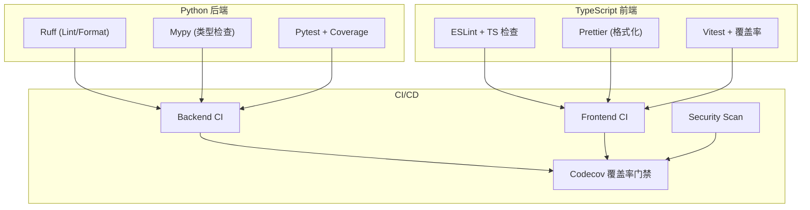
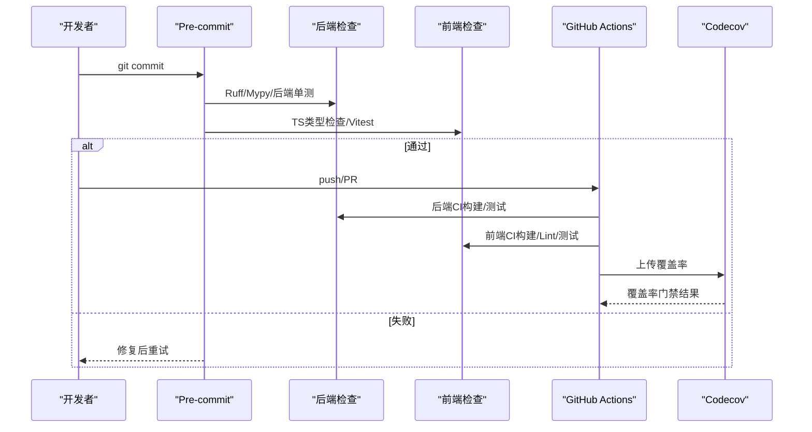
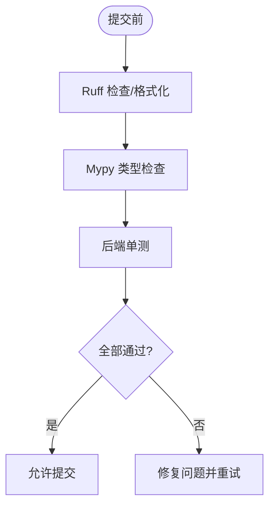
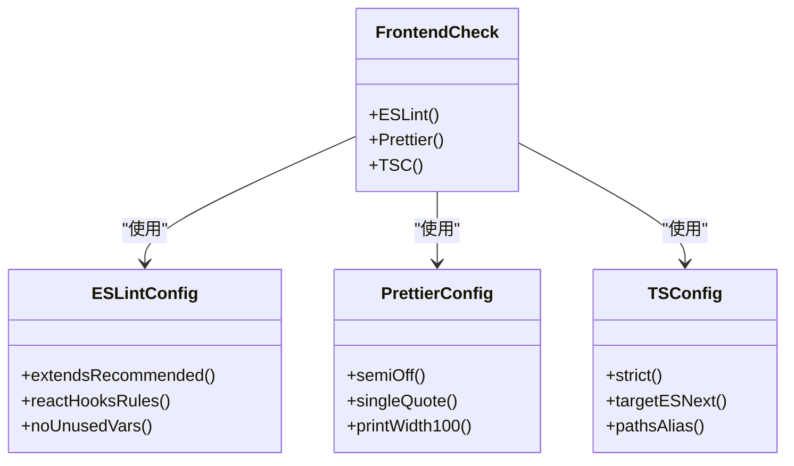
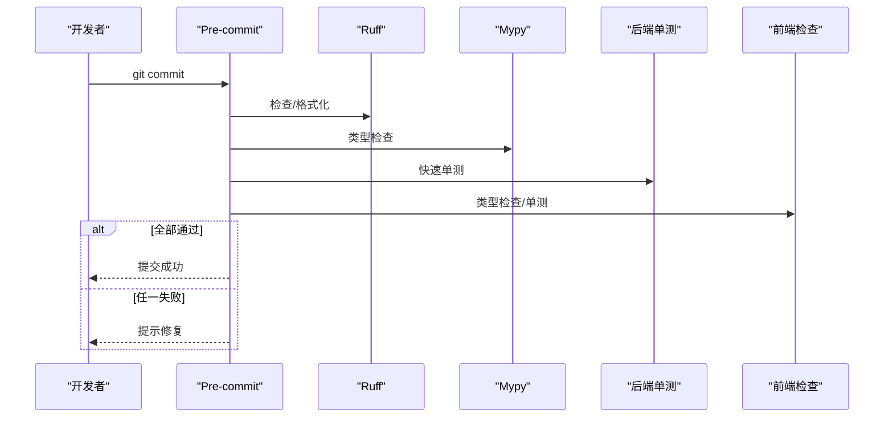
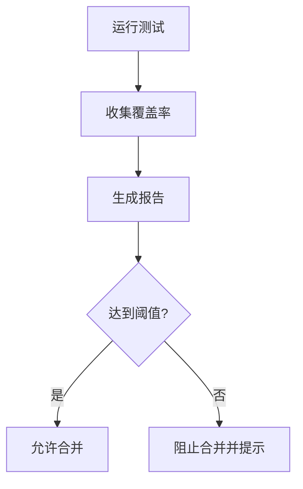
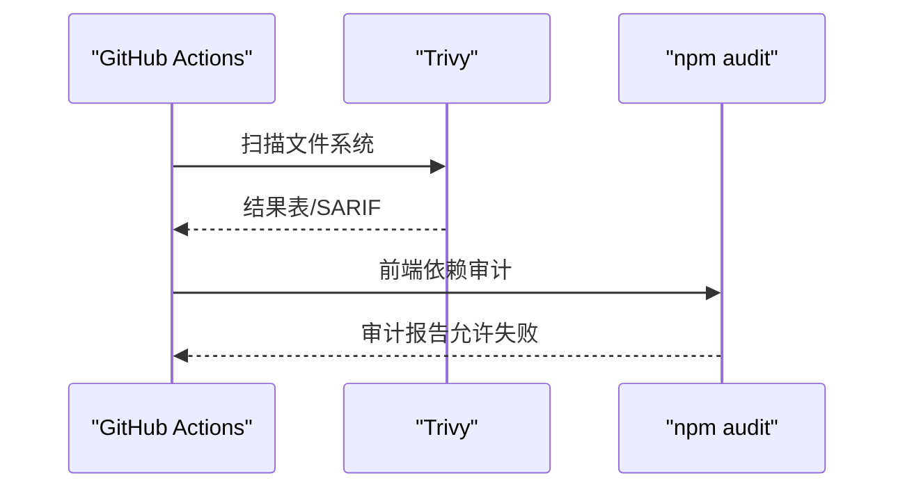
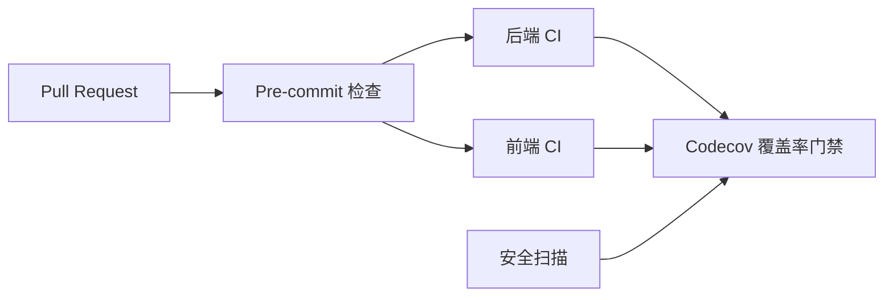
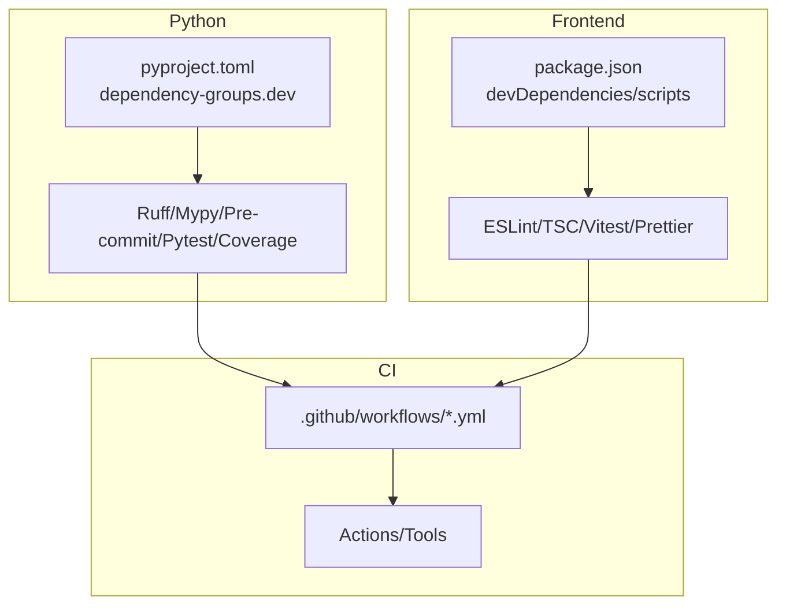

# 代码质量检查

<cite>
**本文引用的文件**
- [.pre-commit-config.yaml](file://.pre-commit-config.yaml)
- [pyproject.toml](file://pyproject.toml)
- [frontend/eslint.config.js](file://frontend/eslint.config.js)
- [frontend/.prettierrc](file://frontend/.prettierrc)
- [frontend/tsconfig.json](file://frontend/tsconfig.json)
- [frontend/package.json](file://frontend/package.json)
- [codecov.yml](file://codecov.yml)
- [.github/workflows/backend.yml](file://.github/workflows/backend.yml)
- [.github/workflows/frontend.yml](file://.github/workflows/frontend.yml)
- [.github/workflows/security.yml](file://.github/workflows/security.yml)
- [lint.yml](file://lint.yml)
- [docs/CODE_QUALITY_GATE.md](file://docs/CODE_QUALITY_GATE.md)
</cite>

## 目录
1. [简介](#简介)
2. [项目结构](#项目结构)
3. [核心组件](#核心组件)
4. [架构总览](#架构总览)
5. [详细组件分析](#详细组件分析)
6. [依赖关系分析](#依赖关系分析)
7. [性能与可维护性考量](#性能与可维护性考量)
8. [故障排查指南](#故障排查指南)
9. [结论](#结论)
10. [附录](#附录)

## 简介
本文件为 Quant Agent 项目的代码质量检查体系说明，覆盖静态分析、类型检查、格式化、安全扫描、覆盖率门禁以及持续集成中的质量门禁。目标是让开发团队在提交前和 CI 阶段都能稳定地保障代码质量，统一风格与规范，降低缺陷流入主干的风险。

## 项目结构
本项目采用多语言、多模块的工程组织：
- Python 后端（backend）：使用 Ruff 进行 Lint/格式化，Mypy 进行类型检查，Pytest + Coverage 进行测试与覆盖率统计。
- TypeScript/React 前端（frontend）：使用 ESLint + TypeScript 编译器进行类型与规则检查，Prettier 统一格式，Vitest 运行测试并产出覆盖率。
- 预提交钩子（pre-commit）：在本地提交前执行一系列检查，阻止低质量代码进入仓库。
- 持续集成（GitHub Actions）：在后端、前端与安全扫描工作流中设置质量门禁，结合 Codecov 进行覆盖率门槛控制。

**图示来源**
- [.pre-commit-config.yaml:6-72](file://.pre-commit-config.yaml#L6-L72)
- [pyproject.toml:104-232](file://pyproject.toml#L104-L232)
- [frontend/eslint.config.js:1-34](file://frontend/eslint.config.js#L1-L34)
- [frontend/.prettierrc:1-10](file://frontend/.prettierrc#L1-L10)
- [frontend/tsconfig.json:1-42](file://frontend/tsconfig.json#L1-L42)
- [frontend/package.json:6-15](file://frontend/package.json#L6-L15)
- [.github/workflows/backend.yml:119-193](file://.github/workflows/backend.yml#L119-L193)
- [.github/workflows/frontend.yml:14-111](file://.github/workflows/frontend.yml#L14-L111)
- [.github/workflows/security.yml:13-48](file://.github/workflows/security.yml#L13-L48)
- [codecov.yml:18-65](file://codecov.yml#L18-L65)

**章节来源**
- [.pre-commit-config.yaml:6-72](file://.pre-commit-config.yaml#L6-L72)
- [pyproject.toml:104-232](file://pyproject.toml#L104-L232)
- [frontend/eslint.config.js:1-34](file://frontend/eslint.config.js#L1-L34)
- [frontend/.prettierrc:1-10](file://frontend/.prettierrc#L1-L10)
- [frontend/tsconfig.json:1-42](file://frontend/tsconfig.json#L1-L42)
- [frontend/package.json:6-15](file://frontend/package.json#L6-L15)
- [.github/workflows/backend.yml:119-193](file://.github/workflows/backend.yml#L119-L193)
- [.github/workflows/frontend.yml:14-111](file://.github/workflows/frontend.yml#L14-L111)
- [.github/workflows/security.yml:13-48](file://.github/workflows/security.yml#L13-L48)
- [codecov.yml:18-65](file://codecov.yml#L18-L65)

## 核心组件
- 预提交钩子（Pre-commit）
  - Python：Ruff（lint/format）、Mypy（类型检查）、后端单测片段。
  - 前端：TypeScript 类型检查、Vitest 单测。
  - 通用：空白行、文件结尾、YAML 校验、大文件检测、合并冲突与私钥检测。
- Python 静态分析与类型检查
  - Ruff：启用 E/F/W/I 规则集，忽略行长度限制以兼容中文日志/注释；格式化风格与 Black 一致（双引号）。
  - Mypy：针对 backend/core 与 backend/routers 进行类型检查，忽略缺失导入以减少噪声。
- 前端静态分析与类型检查
  - ESLint：基于 @eslint/js 与 typescript-eslint 推荐配置，启用 react-hooks 与 react-refresh 插件，关闭对 HMR 误报的规则，放宽 any 限制但保留未使用变量警告。
  - Prettier：无分号、单引号、100 列宽、避免箭头函数括号、2 空格缩进、自动换行符。
  - TypeScript：严格模式、ESNext 目标、bundler 解析、路径别名 @/*。
- 测试与覆盖率
  - Pytest：仅主服务 backend/tests，禁用 unraisableexception 插件以避免误报；Coverage 并行收集，排除外部 SDK、调度器入口等低价值区域，阈值 80%。
  - Vitest：前端测试与覆盖率输出，上传至 Codecov。
- 安全扫描
  - Trivy：文件系统扫描，生成 SARIF 产物，不阻断流程（私有仓库限制），每周定时任务。
  - 前端 npm audit：构建阶段执行，允许失败继续。
- 覆盖率门禁（Codecov）
  - 后端与前端分别设定目标与阈值，新增代码 patch 覆盖率要求 60%，趋势禁止倒退。

**章节来源**
- [.pre-commit-config.yaml:6-72](file://.pre-commit-config.yaml#L6-L72)
- [pyproject.toml:104-232](file://pyproject.toml#L104-L232)
- [frontend/eslint.config.js:1-34](file://frontend/eslint.config.js#L1-L34)
- [frontend/.prettierrc:1-10](file://frontend/.prettierrc#L1-L10)
- [frontend/tsconfig.json:1-42](file://frontend/tsconfig.json#L1-L42)
- [frontend/package.json:6-15](file://frontend/package.json#L6-L15)
- [codecov.yml:18-65](file://codecov.yml#L18-L65)
- [.github/workflows/security.yml:13-48](file://.github/workflows/security.yml#L13-L48)

## 架构总览
下图展示了从开发者提交到 CI 质量门禁的完整链路：本地 pre-commit 拦截 → 后端/前端静态检查与类型检查 → 单元测试与覆盖率 → 安全扫描 → Codecov 覆盖率门禁。

**图示来源**
- [.pre-commit-config.yaml:6-72](file://.pre-commit-config.yaml#L6-L72)
- [.github/workflows/backend.yml:119-193](file://.github/workflows/backend.yml#L119-L193)
- [.github/workflows/frontend.yml:14-111](file://.github/workflows/frontend.yml#L14-L111)
- [codecov.yml:18-65](file://codecov.yml#L18-L65)

## 详细组件分析

### Python 静态分析与类型检查（Ruff + Mypy）
- Ruff
  - 规则集：E/F/W/I（错误、警告、样式、导入排序）。
  - 行长度：忽略 E501，便于中文日志/注释。
  - 格式化：双引号风格，与 Black 一致。
- Mypy
  - 范围：backend/core 与 backend/routers。
  - 策略：忽略缺失导入，减少第三方库噪声；优先使用 .venv 内 mypy 以提升速度。
- 最佳实践
  - 新增模块需补充类型注解，避免 any 滥用。
  - 对外接口（API/SDK）建议显式声明返回类型与参数类型。
  - 复杂逻辑拆分为小函数，提升可读性与可测性。

**图示来源**
- [.pre-commit-config.yaml:6-39](file://.pre-commit-config.yaml#L6-L39)
- [pyproject.toml:104-124](file://pyproject.toml#L104-L124)

**章节来源**
- [.pre-commit-config.yaml:6-39](file://.pre-commit-config.yaml#L6-L39)
- [pyproject.toml:104-124](file://pyproject.toml#L104-L124)

### TypeScript/React 前端检查（ESLint + Prettier + TSC）
- ESLint
  - 基于 @eslint/js 与 typescript-eslint 推荐配置。
  - 启用 react-hooks 与 react-refresh 插件，关闭 HMR 相关误报规则。
  - 未使用变量告警，支持下划线前缀忽略。
- Prettier
  - 无分号、单引号、100 列宽、避免箭头函数括号、2 空格缩进。
- TypeScript
  - 严格模式、ESNext 目标、bundler 解析、路径别名 @/*。
- 最佳实践
  - 组件与 Hook 遵循 React Hooks 规则。
  - 类型定义集中管理，避免 any 扩散。
  - 公共 API 与事件模型保持向后兼容。

**图示来源**
- [frontend/eslint.config.js:1-34](file://frontend/eslint.config.js#L1-L34)
- [frontend/.prettierrc:1-10](file://frontend/.prettierrc#L1-L10)
- [frontend/tsconfig.json:1-42](file://frontend/tsconfig.json#L1-L42)

**章节来源**
- [frontend/eslint.config.js:1-34](file://frontend/eslint.config.js#L1-L34)
- [frontend/.prettierrc:1-10](file://frontend/.prettierrc#L1-L10)
- [frontend/tsconfig.json:1-42](file://frontend/tsconfig.json#L1-L42)

### 预提交钩子（Pre-commit）
- Python 钩子
  - Ruff：自动修复并退出非零码。
  - Mypy：类型检查，忽略缺失导入。
  - 后端单测：快速验证关键用例。
- 前端钩子
  - 类型检查与 Vitest 单测。
- 通用钩子
  - 尾随空白、文件结尾、YAML 校验、大文件检测、合并冲突、私钥检测。

**图示来源**
- [.pre-commit-config.yaml:6-72](file://.pre-commit-config.yaml#L6-L72)

**章节来源**
- [.pre-commit-config.yaml:6-72](file://.pre-commit-config.yaml#L6-L72)

### 测试与覆盖率（Pytest + Coverage + Vitest）
- Pytest
  - 仅主服务 backend/tests，禁用 unraisableexception 插件避免误报。
  - Coverage 并行收集，排除外部 SDK、调度器入口等低价值区域，阈值 80%。
- Vitest
  - 前端测试与覆盖率输出，上传至 Codecov。
- 覆盖率门禁（Codecov）
  - 后端与前端分别设定目标与阈值，新增代码 patch 覆盖率要求 60%。

**图示来源**
- [pyproject.toml:125-210](file://pyproject.toml#L125-L210)
- [codecov.yml:18-65](file://codecov.yml#L18-L65)

**章节来源**
- [pyproject.toml:125-210](file://pyproject.toml#L125-L210)
- [codecov.yml:18-65](file://codecov.yml#L18-L65)

### 安全扫描（Trivy + npm audit）
- Trivy
  - 文件系统扫描，SARIF 输出用于归档，不阻断流程（私有仓库限制），每周定时任务。
- npm audit
  - 前端构建阶段执行，允许失败继续，便于逐步治理。

**图示来源**
- [.github/workflows/security.yml:13-48](file://.github/workflows/security.yml#L13-L48)
- [.github/workflows/frontend.yml:102-105](file://.github/workflows/frontend.yml#L102-L105)

**章节来源**
- [.github/workflows/security.yml:13-48](file://.github/workflows/security.yml#L13-L48)
- [.github/workflows/frontend.yml:102-105](file://.github/workflows/frontend.yml#L102-L105)

### 持续集成质量门禁
- 后端 CI
  - 构建镜像、运行后端单测、数据子服务单测，作为构建/部署门禁。
- 前端 CI
  - 安装依赖、运行测试与覆盖率、Lint 与类型检查、构建产物、Mock 红线扫描、安全审计。
- 通用质量门禁
  - lint.yml：在 PR/Push main 时运行 pre-commit。
  - Codecov：覆盖率目标与阈值控制。

**图示来源**
- [lint.yml:1-47](file://lint.yml#L1-L47)
- [.github/workflows/backend.yml:119-193](file://.github/workflows/backend.yml#L119-L193)
- [.github/workflows/frontend.yml:14-111](file://.github/workflows/frontend.yml#L14-L111)
- [codecov.yml:18-65](file://codecov.yml#L18-L65)

**章节来源**
- [lint.yml:1-47](file://lint.yml#L1-L47)
- [.github/workflows/backend.yml:119-193](file://.github/workflows/backend.yml#L119-L193)
- [.github/workflows/frontend.yml:14-111](file://.github/workflows/frontend.yml#L14-L111)
- [codecov.yml:18-65](file://codecov.yml#L18-L65)

## 依赖关系分析
- Python 工具链
  - Ruff、Mypy、Pre-commit、Pytest、Coverage 均通过 pyproject.toml 的 dependency-groups.dev 统一管理，确保版本锁定与一致性。
- 前端工具链
  - ESLint、TypeScript、Vitest、Prettier 通过 frontend/package.json 的 devDependencies 管理，脚本命令集中在 scripts 段。
- CI 依赖
  - GitHub Actions 工作流调用官方 action（如 setup-python、pnpm/action-setup、trivy-action），保证环境一致性。

**图示来源**
- [pyproject.toml:212-232](file://pyproject.toml#L212-L232)
- [frontend/package.json:86-112](file://frontend/package.json#L86-L112)
- [.github/workflows/backend.yml:119-193](file://.github/workflows/backend.yml#L119-L193)
- [.github/workflows/frontend.yml:14-111](file://.github/workflows/frontend.yml#L14-L111)

**章节来源**
- [pyproject.toml:212-232](file://pyproject.toml#L212-L232)
- [frontend/package.json:86-112](file://frontend/package.json#L86-L112)
- [.github/workflows/backend.yml:119-193](file://.github/workflows/backend.yml#L119-L193)
- [.github/workflows/frontend.yml:14-111](file://.github/workflows/frontend.yml#L14-L111)

## 性能与可维护性考量
- 预提交性能
  - Mypy 优先使用 .venv 内解释器，避免 uv run 临时解析开销。
  - 前端类型检查与单测在 pre-commit 中执行，尽早发现问题。
- 覆盖率收集
  - pytest-cov 开启 parallel 模式，避免 xdist 下并发导致的覆盖率低估。
- 可维护性
  - 统一的 Lint/Format 规则减少分歧，提升协作效率。
  - 类型检查严格化有助于重构与演进。

[本节提供一般性指导，无需特定文件引用]

## 故障排查指南
- 预提交失败
  - 确认已安装 pre-commit 并执行 pre-commit install。
  - 检查 Python 环境与依赖是否就绪（uv sync / pip install）。
  - 查看具体 hook 输出定位问题（Ruff/Mypy/单测）。
- 类型检查失败
  - 根据报错补充类型注解或调整 mypy 配置（如忽略缺失导入）。
  - 前端 TS 错误参考 tsc 输出，必要时放宽局部 any 并记录原因。
- 覆盖率不达标
  - 检查 coverage 排除项是否合理，补充关键路径测试。
  - 关注新增代码 patch 覆盖率要求（60%）。
- 安全扫描告警
  - 根据 Trivy 报告评估风险等级，优先修复高危漏洞。
  - 前端 npm audit 告警逐步升级依赖或替换不安全包。

**章节来源**
- [.pre-commit-config.yaml:6-72](file://.pre-commit-config.yaml#L6-L72)
- [pyproject.toml:104-232](file://pyproject.toml#L104-L232)
- [codecov.yml:18-65](file://codecov.yml#L18-L65)
- [.github/workflows/security.yml:13-48](file://.github/workflows/security.yml#L13-L48)

## 结论
通过统一的预提交钩子、严格的静态分析与类型检查、完善的测试与覆盖率门禁，以及安全扫描与 CI 质量门禁，Quant Agent 项目在提交前与持续集成阶段形成了闭环的质量保障体系。建议团队在日常开发中遵循本规范，持续优化覆盖率与代码复杂度，确保主干代码的高质量与可维护性。

[本节总结性内容，无需特定文件引用]

## 附录
- 常用命令
  - 本地预提交：pre-commit run --all-files
  - Python 检查：ruff check/format、mypy、pytest
  - 前端检查：pnpm run lint、pnpm run type-check、pnpm run test
- 文档参考
  - 代码质量门禁指南：docs/CODE_QUALITY_GATE.md

**章节来源**
- [docs/CODE_QUALITY_GATE.md:1-189](file://docs/CODE_QUALITY_GATE.md#L1-L189)