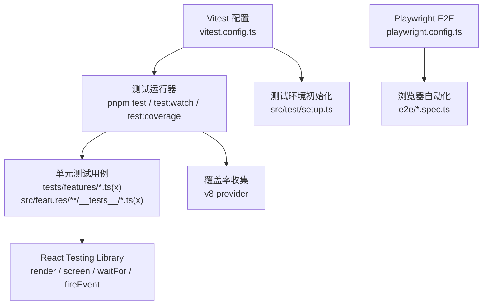
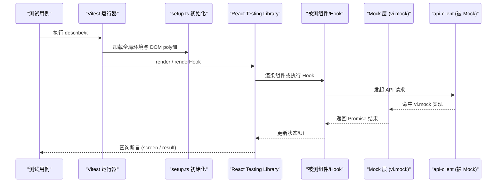
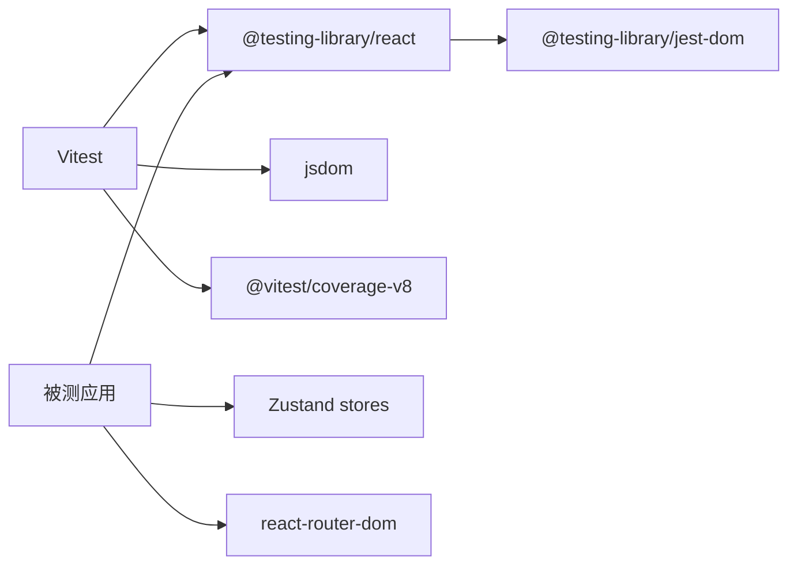

# 前端单元测试规范

<cite>
**本文引用的文件**
- [vitest.config.ts](file://frontend/vitest.config.ts)
- [package.json](file://frontend/package.json)
- [setup.ts](file://frontend/src/test/setup.ts)
- [playwright.config.ts](file://frontend/playwright.config.ts)
- [alert-center.test.ts](file://frontend/tests/features/alert-center.test.ts)
- [module.test.tsx](file://frontend/src/features/calendars/__tests__/module.test.tsx)
- [fe-experience.test.tsx](file://frontend/tests/features/fe-experience.test.tsx)
- [financial-format.test.ts](file://frontend/src/lib/financial-format.test.ts)
- [key-components.test.ts](file://frontend/tests/features/key-components.test.ts)
- [engine.test.ts](file://frontend/src/features/quotes/custom-indicator/engine.test.ts)
- [trading-mode.test.ts](file://frontend/tests/features/trading-mode.test.ts)
</cite>

## 目录
1. [简介](#简介)
2. [项目结构](#项目结构)
3. [核心组件](#核心组件)
4. [架构总览](#架构总览)
5. [详细组件分析](#详细组件分析)
6. [依赖关系分析](#依赖关系分析)
7. [性能考虑](#性能考虑)
8. [故障排查指南](#故障排查指南)
9. [结论](#结论)
10. [附录](#附录)

## 简介
本规范面向 Quant Agent 前端（React + Vite）的单元测试，基于 Vitest 与 React Testing Library，结合 Playwright 完成端到端衔接。文档覆盖测试环境设置、配置文件优化、运行器配置、组件渲染与交互模拟、异步与错误边界测试、Mock 策略、测试数据准备、快照/集成/E2E 衔接，以及最佳实践与常见问题排查。

## 项目结构
前端测试相关的关键位置与职责：
- 测试框架与运行器：Vitest 通过 vitest.config.ts 配置 jsdom 环境、全局 API、覆盖率阈值与排除规则；package.json 提供 test、test:watch、test:coverage 脚本。
- 测试初始化：src/test/setup.ts 统一注入 jest-dom 断言、mock window.matchMedia/IntersectionObserver/ResizeObserver/indexedDB，并可选抑制控制台输出。
- 单元测试用例：位于 tests/features 与 src/features/*/__tests__，按功能模块组织，使用 @testing-library/react 进行渲染与交互。
- E2E 测试：playwright.config.ts 定义 e2e 目录、浏览器设备、重试、截图/视频、webServer 启动等。

图表来源
- [vitest.config.ts:1-41](file://frontend/vitest.config.ts#L1-L41)
- [package.json:6-15](file://frontend/package.json#L6-L15)
- [setup.ts:1-90](file://frontend/src/test/setup.ts#L1-L90)
- [playwright.config.ts:1-62](file://frontend/playwright.config.ts#L1-L62)

章节来源
- [vitest.config.ts:1-41](file://frontend/vitest.config.ts#L1-L41)
- [package.json:6-15](file://frontend/package.json#L6-L15)
- [setup.ts:1-90](file://frontend/src/test/setup.ts#L1-L90)
- [playwright.config.ts:1-62](file://frontend/playwright.config.ts#L1-L62)

## 核心组件
- 测试运行与配置
  - Vitest 启用 globals、jsdom 环境、setupFiles、覆盖率阈值（分支/函数/行/语句均≥60%），并排除类型声明、故事书与测试文件本身。
  - package.json 暴露 test、test:watch、test:coverage 命令，便于本地与 CI 使用。
- 测试环境初始化
  - setup.ts 引入 @testing-library/jest-dom 扩展断言；mock 常用浏览器 API（matchMedia、IntersectionObserver、ResizeObserver、indexedDB），屏蔽无关 console.warn。
- 测试组织
  - 单元级：针对纯函数、工具库、store、hooks 的细粒度测试。
  - 组件级：渲染 UI、触发事件、断言状态变化与副作用（如 API 调用）。
  - 集成/E2E：通过 Playwright 在真实浏览器中验证关键用户流程。

章节来源
- [vitest.config.ts:12-39](file://frontend/vitest.config.ts#L12-L39)
- [package.json:6-15](file://frontend/package.json#L6-L15)
- [setup.ts:6-89](file://frontend/src/test/setup.ts#L6-L89)

## 架构总览
下图展示从测试入口到组件渲染、API Mock、状态更新与断言的完整链路，适用于大多数 Hook/组件测试场景。

图表来源
- [setup.ts:6-89](file://frontend/src/test/setup.ts#L6-L89)
- [alert-center.test.ts:11-24](file://frontend/tests/features/alert-center.test.ts#L11-L24)
- [module.test.tsx:15-23](file://frontend/src/features/calendars/__tests__/module.test.tsx#L15-L23)

## 详细组件分析

### 测试环境设置与配置优化
- 环境与环境变量
  - 使用 jsdom 模拟浏览器 DOM；setup.ts 补齐缺失的浏览器 API，避免第三方库报错。
  - 可通过环境变量控制行为（例如 SUPPRESS_CONSOLE）。
- 覆盖率门禁
  - 使用 v8 提供者，输出 text/json/html 报告；阈值统一为 60%，排除类型与测试文件，聚焦业务代码。
- 别名与插件
  - 启用 @vitejs/plugin-react；配置 @ 路径别名指向 src，便于 import 路径简洁稳定。

章节来源
- [vitest.config.ts:1-41](file://frontend/vitest.config.ts#L1-L41)
- [setup.ts:8-89](file://frontend/src/test/setup.ts#L8-L89)

### React Testing Library 使用方法
- 组件渲染
  - 使用 render 挂载组件，配合 MemoryRouter 包裹路由相关组件；用 screen 查询文本/节点。
- 用户交互模拟
  - 使用 fireEvent 触发点击、输入等事件；对异步更新使用 waitFor 等待 DOM 稳定。
- 状态变化测试
  - 对 store/hook 使用 renderHook 获取 result.current，并通过 act 包裹异步操作，再断言状态。

示例参考
- 日历模块渲染标题与 Tab、顶部 MarketsView 卡片、STALE 角标、切换 Tab 触发 API 调用。
- DataState 在不同状态下渲染骨架/空态/就绪态与 STALE 标识。
- VirtualList 仅渲染可视窗口内的项。

章节来源
- [module.test.tsx:125-185](file://frontend/src/features/calendars/__tests__/module.test.tsx#L125-L185)
- [fe-experience.test.tsx:20-78](file://frontend/tests/features/fe-experience.test.tsx#L20-L78)

### 异步组件与 Hook 测试
- Promise 处理
  - 使用 await act 包裹异步 Hook 方法，确保状态更新在断言前完成。
- 异步数据加载
  - 通过 vi.mock 拦截 apiClient.get/post/put/delete，分别模拟成功与失败响应。
- 错误处理
  - 模拟网络异常，断言 error 字段与回退 UI。

示例参考
- useAlertRules：fetchRules、createRule、toggleRule、deleteRule 的成功与失败路径。
- useAlertEvents：fetchEvents、ackEvent、ackAll 的状态同步。
- trading mode：hydrate/request 模式切换的确认与后端交互。

章节来源
- [alert-center.test.ts:83-175](file://frontend/tests/features/alert-center.test.ts#L83-L175)
- [alert-center.test.ts:177-234](file://frontend/tests/features/alert-center.test.ts#L177-L234)
- [trading-mode.test.ts:49-107](file://frontend/tests/features/trading-mode.test.ts#L49-L107)

### Mock 策略
- API 调用 Mock
  - 使用 vi.mock('@/lib/api-client', ...) 替换真实 fetch，集中管理 get/post/put/delete 的返回值。
  - 在 beforeEach 中 clearAllMocks，保证用例隔离。
- 第三方库 Mock
  - 对需要浏览器能力的库（如 indexedDB、IntersectionObserver、ResizeObserver）在 setup.ts 中统一 mock。
- 浏览器 API Mock
  - matchMedia 返回固定 matches=false，避免媒体查询导致的渲染差异。

章节来源
- [setup.ts:8-79](file://frontend/src/test/setup.ts#L8-L79)
- [alert-center.test.ts:11-24](file://frontend/tests/features/alert-center.test.ts#L11-L24)
- [module.test.tsx:15-23](file://frontend/src/features/calendars/__tests__/module.test.tsx#L15-L23)
- [trading-mode.test.ts:15-31](file://frontend/tests/features/trading-mode.test.ts#L15-L31)

### 测试数据准备
- 测试 fixtures
  - 在测试文件中直接定义最小可用数据结构（如 AlertRule、AlertEvent、市场快照等），减少外部依赖。
- 模拟数据生成
  - 自定义工厂函数生成 K 线序列、指标信号等，用于复杂逻辑（如回测引擎）的边界与回归测试。
- 测试状态管理
  - 通过 store 的 getState/setState/reset 等方法重置初始状态，确保用例间互不干扰。

章节来源
- [alert-center.test.ts:25-56](file://frontend/tests/features/alert-center.test.ts#L25-L56)
- [engine.test.ts:4-19](file://frontend/src/features/quotes/custom-indicator/engine.test.ts#L4-L19)
- [key-components.test.ts:24-70](file://frontend/tests/features/key-components.test.ts#L24-L70)

### 组件快照测试
- 建议对稳定的页面区块（如日历顶部 MarketsView、告警中心列表）使用快照断言，快速发现意外变更。
- 注意：快照需配合合理的 Mock 与数据，避免噪声；当 UI 设计迭代时，及时审查并更新快照。

[本节为通用指导，不直接分析具体文件]

### 集成测试与端到端衔接
- 集成测试
  - 以功能模块为单位，组合多个组件与 store，验证数据流与交互闭环（如日历模块的 Tab 切换与 API 调用）。
- 端到端测试
  - 使用 Playwright 在真实浏览器中运行 e2e 用例，自动启动 dev server，捕获截图/视频，支持重试与报告。
- 衔接策略
  - 单元/集成保障正确性与稳定性；E2E 保障关键用户路径可用性。三者互补，形成质量防线。

章节来源
- [module.test.tsx:125-185](file://frontend/src/features/calendars/__tests__/module.test.tsx#L125-L185)
- [playwright.config.ts:1-62](file://frontend/playwright.config.ts#L1-L62)

## 依赖关系分析
- 测试框架依赖
  - Vitest + @vitejs/plugin-react + jsdom + @testing-library/react + @testing-library/jest-dom + @vitest/coverage-v8。
- 运行时依赖
  - React、Zustand、i18next、react-router-dom 等由被测组件引入；测试中通过 Mock 隔离外部影响。
- 工具与辅助
  - MSW 作为 HTTP Mock 备选方案已安装；当前项目主要采用 vi.mock 方式。

图表来源
- [package.json:86-112](file://frontend/package.json#L86-L112)

章节来源
- [package.json:86-112](file://frontend/package.json#L86-L112)

## 性能考虑
- 测试并行与超时
  - 单元测试默认并行执行，速度快；E2E 串行执行更稳定。合理设置单用例超时，避免长耗时阻塞。
- 渲染与查询优化
  - 使用 waitFor 替代固定延时；尽量精确查询（byRole/byTestId），减少重排。
- 覆盖率与瓶颈
  - 覆盖率阈值可逐步提升；关注热点模块的测试执行时间，必要时拆分用例或优化 Mock。

[本节为通用指导，不直接分析具体文件]

## 故障排查指南
- 常见环境问题
  - 缺少浏览器 API：检查 setup.ts 是否已 mock matchMedia/IntersectionObserver/ResizeObserver/indexedDB。
  - 路由相关报错：确保组件用 MemoryRouter 包裹。
  - 异步未等待：使用 await act 包裹异步 Hook 调用，再用 waitFor 等待 DOM 更新。
- 断言失败
  - 检查 Mock 返回值是否与预期一致；确认 beforeEach 中已 clearAllMocks。
  - 对于颜色/样式类名，优先断言包含关系而非全量匹配，降低样式重构带来的脆弱性。
- E2E 不稳定
  - 增加重试次数；开启截图/视频；检查 webServer 启动与 baseURL 配置。

章节来源
- [setup.ts:8-89](file://frontend/src/test/setup.ts#L8-L89)
- [playwright.config.ts:23-60](file://frontend/playwright.config.ts#L23-L60)

## 结论
本项目已建立完善的单元测试体系：Vitest 提供高效运行与覆盖率门禁，React Testing Library 聚焦用户视角的交互与状态断言，setup.ts 统一补齐浏览器能力，vi.mock 精准隔离外部依赖。配合 Playwright 的 E2E 用例，形成从单元到端到端的完整质量保障。建议持续完善关键路径的测试覆盖，逐步提高覆盖率阈值，并将测试纳入 CI 门禁。

[本节为总结，不直接分析具体文件]

## 附录

### 常用命令速查
- 运行单元测试：pnpm test
- 监听模式：pnpm test:watch
- 生成覆盖率：pnpm test:coverage
- 运行 E2E：npx playwright test

章节来源
- [package.json:6-15](file://frontend/package.json#L6-L15)
- [playwright.config.ts:1-17](file://frontend/playwright.config.ts#L1-L17)

### 典型测试模式速览
- 纯函数/工具函数：直接传入参数，断言返回值与边界情况。
- Store/Hook：使用 renderHook 获取 result，act 包裹异步操作，断言状态变化。
- 组件：render 后通过 screen 查询元素，fireEvent 触发交互，waitFor 等待异步更新。
- API 交互：vi.mock 拦截 apiClient，分别模拟成功/失败，断言副作用与 UI。

章节来源
- [financial-format.test.ts:16-127](file://frontend/src/lib/financial-format.test.ts#L16-L127)
- [key-components.test.ts:24-156](file://frontend/tests/features/key-components.test.ts#L24-L156)
- [alert-center.test.ts:83-234](file://frontend/tests/features/alert-center.test.ts#L83-L234)
- [module.test.tsx:125-185](file://frontend/src/features/calendars/__tests__/module.test.tsx#L125-L185)

### 复杂逻辑测试示例（回测引擎）
- 表达式求值、布尔信号采集、参数网格搜索、回测交易明细校验等，均以确定性输入与断言覆盖核心算法的正确性与健壮性。

章节来源
- [engine.test.ts:21-275](file://frontend/src/features/quotes/custom-indicator/engine.test.ts#L21-L275)