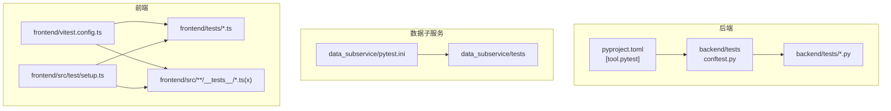
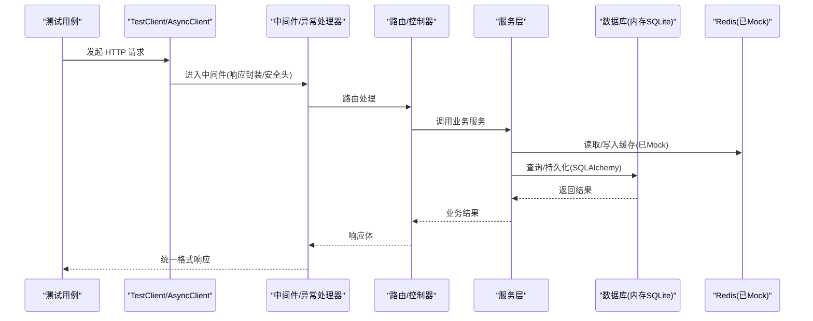
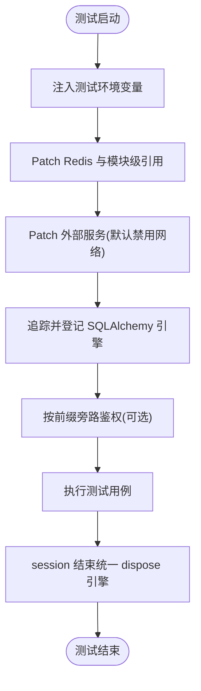
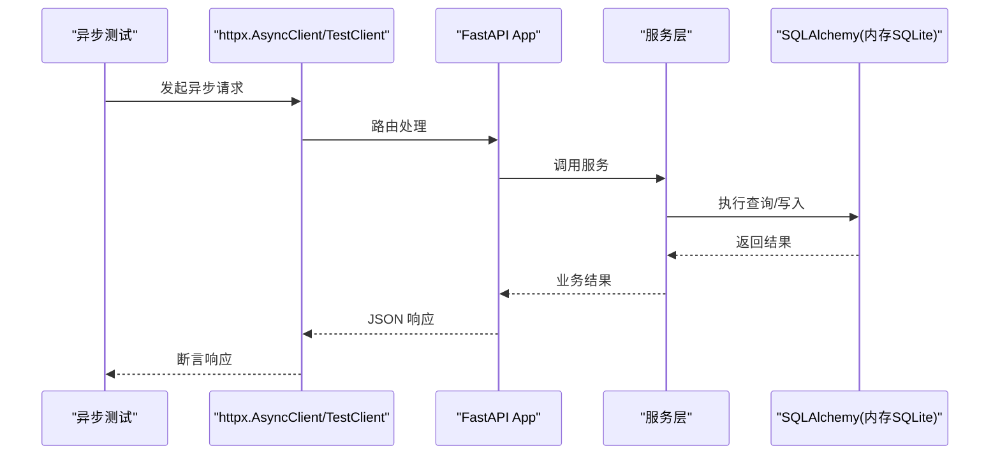
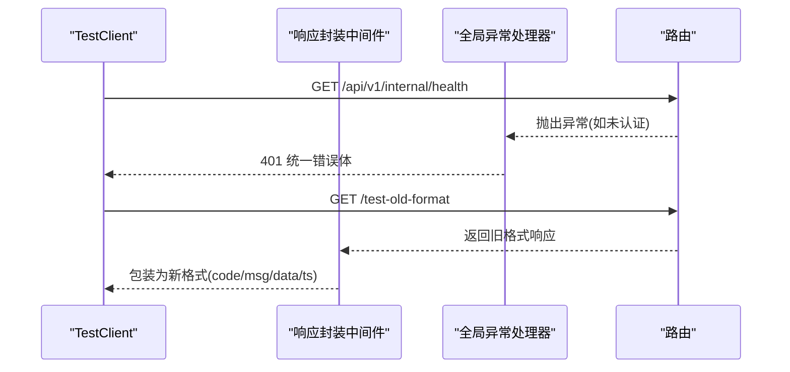
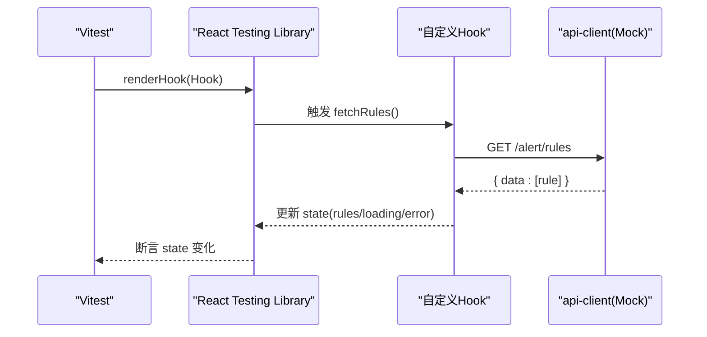
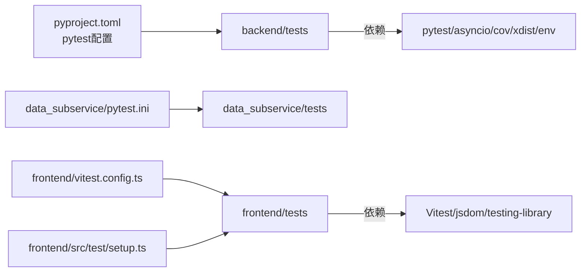

# 单元测试规范

<cite>
**本文引用的文件**
- [backend/tests/conftest.py](file://backend/tests/conftest.py)
- [pyproject.toml](file://pyproject.toml)
- [data_subservice/pytest.ini](file://data_subservice/pytest.ini)
- [frontend/vitest.config.ts](file://frontend/vitest.config.ts)
- [frontend/src/test/setup.ts](file://frontend/src/test/setup.ts)
- [backend/tests/test_main.py](file://backend/tests/test_main.py)
- [frontend/tests/features/alert-center.test.ts](file://frontend/tests/features/alert-center.test.ts)
</cite>

## 目录
1. [简介](#简介)
2. [项目结构](#项目结构)
3. [核心组件](#核心组件)
4. [架构总览](#架构总览)
5. [详细组件分析](#详细组件分析)
6. [依赖关系分析](#依赖关系分析)
7. [性能考虑](#性能考虑)
8. [故障排查指南](#故障排查指南)
9. [结论](#结论)
10. [附录](#附录)

## 简介
本规范面向 Quant Agent 项目的后端与前端测试，目标是建立统一、可维护、可扩展的单元测试实践。内容覆盖：
- 后端 Python 测试：pytest 最佳实践、异步测试、数据库操作、API 路由测试、外部依赖 Mock、测试数据准备、用例组织与断言约定。
- 前端 React 测试：Vitest + React Testing Library 的组件与 Hook 测试方法、Mock 策略、覆盖率门禁。
- 质量门槛与工程化：覆盖率阈值、标记分类（slow/integration/e2e）、并发执行与隔离、CI 集成建议。
- 性能与并发：测试耗时控制、并行执行、资源释放与稳定性保障。

## 项目结构
本项目将后端与前端测试解耦配置：
- 后端测试位于 backend/tests，使用 pytest 驱动，集中 Fixture 与全局 Mock 在 conftest.py 中管理。
- 数据子服务测试位于 data_subservice/tests，通过独立的 pytest.ini 运行，避免重型 SDK 污染主环境。
- 前端测试位于 frontend/tests 与 src/features/**/__tests__，由 Vitest 驱动，配置文件为 vitest.config.ts，并在 setup.ts 中完成浏览器 API Mock。

**图表来源**
- [backend/tests/conftest.py:1-679](file://backend/tests/conftest.py#L1-L679)
- [pyproject.toml:125-165](file://pyproject.toml#L125-L165)
- [data_subservice/pytest.ini:1-36](file://data_subservice/pytest.ini#L1-L36)
- [frontend/vitest.config.ts:1-41](file://frontend/vitest.config.ts#L1-L41)
- [frontend/src/test/setup.ts:1-90](file://frontend/src/test/setup.ts#L1-L90)

**章节来源**
- [backend/tests/conftest.py:1-679](file://backend/tests/conftest.py#L1-L679)
- [pyproject.toml:125-165](file://pyproject.toml#L125-L165)
- [data_subservice/pytest.ini:1-36](file://data_subservice/pytest.ini#L1-L36)
- [frontend/vitest.config.ts:1-41](file://frontend/vitest.config.ts#L1-L41)
- [frontend/src/test/setup.ts:1-90](file://frontend/src/test/setup.ts#L1-L90)

## 核心组件
- 后端测试基础设施
  - 全局 Fixtures：数据库会话、Redis、HTTP 客户端、FastAPI TestClient、认证旁路、外部服务 Mock、事件循环等。
  - 环境变量注入：强制 SQLite、测试密钥、加密密钥、bcrypt 轮次等，确保离线与稳定。
  - 资源清理：统一登记并关闭 SQLAlchemy 引擎，防止连接泄漏；重置熔断器单例，保证测试隔离。
  - 标记体系：slow、integration、e2e、no_mock_external、asyncio，配合 pytest 选项进行筛选与行为控制。
- 前端测试基础设施
  - Vitest 配置：jsdom 环境、覆盖率阈值、排除规则、别名解析。
  - 全局 Setup：mock matchMedia、IntersectionObserver、ResizeObserver、indexedDB，屏蔽控制台噪音。
  - 示例测试：Hook 测试、常量断言、网络请求 Mock、状态变更验证。

**章节来源**
- [backend/tests/conftest.py:24-33](file://backend/tests/conftest.py#L24-L33)
- [backend/tests/conftest.py:36-98](file://backend/tests/conftest.py#L36-L98)
- [backend/tests/conftest.py:100-268](file://backend/tests/conftest.py#L100-L268)
- [backend/tests/conftest.py:297-376](file://backend/tests/conftest.py#L297-L376)
- [backend/tests/conftest.py:585-679](file://backend/tests/conftest.py#L585-L679)
- [pyproject.toml:125-165](file://pyproject.toml#L125-L165)
- [frontend/vitest.config.ts:12-40](file://frontend/vitest.config.ts#L12-L40)
- [frontend/src/test/setup.ts:8-89](file://frontend/src/test/setup.ts#L8-L89)

## 架构总览
下图展示后端测试从用例到应用层的关键调用链，以及前端 Hook 测试的数据流。

**图表来源**
- [backend/tests/test_main.py:22-79](file://backend/tests/test_main.py#L22-L79)
- [backend/tests/conftest.py:355-376](file://backend/tests/conftest.py#L355-L376)
- [backend/tests/conftest.py:177-268](file://backend/tests/conftest.py#L177-L268)

## 详细组件分析

### 后端：pytest 最佳实践与 Fixture 体系
- 全局自动 Fixture
  - Redis 全局 Mock：对 redis.asyncio.Redis 及模块级引用进行 patch，提供 get/set/delete/exists/pipeline/pubsub 等能力，确保健康检查与缓存逻辑可用。
  - 外部服务 Mock：默认禁用真实网络请求，支持 no_mock_external 标记跳过以进行集成测试。
  - 数据库引擎追踪与释放：包装 create_engine/create_async_engine，统一登记并在 session 结束时 dispose，消除 ResourceWarning。
  - 认证旁路：针对特定路由前缀注入假用户，避免鉴权干扰功能测试。
- 常用 Fixture
  - mock_db / mock_async_db：同步/异步数据库会话 Mock。
  - mock_redis：异步 Redis 客户端 Mock。
  - mock_httpx：异步 HTTP 客户端 Mock。
  - test_client / async_test_client：FastAPI 同步/异步测试客户端。
  - sample_*：行情、K线、订单、持仓等示例数据。
  - TestDataFactory：工厂模式生成多样化测试数据。
- 标记与环境
  - markers：slow、integration、e2e、no_mock_external、asyncio。
  - asyncio_mode=auto：自动处理协程测试。
  - env：NUMBA_CACHE_DIR 指向临时目录，避免 IDE 守卫导致崩溃。
  - filterwarnings：忽略非关键警告，减少噪声。

**图表来源**
- [backend/tests/conftest.py:155-175](file://backend/tests/conftest.py#L155-L175)
- [backend/tests/conftest.py:177-268](file://backend/tests/conftest.py#L177-L268)
- [backend/tests/conftest.py:271-295](file://backend/tests/conftest.py#L271-L295)
- [backend/tests/conftest.py:36-98](file://backend/tests/conftest.py#L36-L98)
- [backend/tests/conftest.py:585-679](file://backend/tests/conftest.py#L585-L679)

**章节来源**
- [backend/tests/conftest.py:24-33](file://backend/tests/conftest.py#L24-L33)
- [backend/tests/conftest.py:36-98](file://backend/tests/conftest.py#L36-L98)
- [backend/tests/conftest.py:100-268](file://backend/tests/conftest.py#L100-L268)
- [backend/tests/conftest.py:297-376](file://backend/tests/conftest.py#L297-L376)
- [backend/tests/conftest.py:585-679](file://backend/tests/conftest.py#L585-L679)
- [pyproject.toml:125-165](file://pyproject.toml#L125-L165)

### 后端：异步测试与数据库操作测试
- 异步测试
  - 使用 AsyncMock 模拟异步接口，结合 httpx.AsyncClient 或 FastAPI 异步端点进行端到端验证。
  - 事件循环：为旧式测试提供独立 event_loop fixture，兼容 asyncio.get_event_loop() 调用。
- 数据库操作
  - 强制 SQLite 内存库，避免 CI 的 PostgreSQL 类型不兼容问题。
  - 通过 mock_db/mock_async_db 快速构造无 IO 的测试场景；需要真实事务时可使用内存库。
  - 统一引擎释放，避免连接泄漏与资源告警。

**图表来源**
- [backend/tests/conftest.py:140-149](file://backend/tests/conftest.py#L140-L149)
- [backend/tests/conftest.py:355-376](file://backend/tests/conftest.py#L355-L376)
- [backend/tests/conftest.py:297-317](file://backend/tests/conftest.py#L297-L317)

**章节来源**
- [backend/tests/conftest.py:140-149](file://backend/tests/conftest.py#L140-L149)
- [backend/tests/conftest.py:297-317](file://backend/tests/conftest.py#L297-L317)
- [backend/tests/conftest.py:355-376](file://backend/tests/conftest.py#L355-L376)

### 后端：API 路由测试与异常处理
- 使用 TestClient 与 async_test_client 对路由进行同步/异步测试。
- 验证统一响应封装：旧格式响应被自动包装为新格式；已有 code 字段直接放行。
- 验证全局异常处理器：QuantBaseException、Pydantic 校验失败、兜底异常分别返回预期状态码与消息。
- 系统端点鉴权：未认证访问内部端点应返回 401。

**图表来源**
- [backend/tests/test_main.py:22-79](file://backend/tests/test_main.py#L22-L79)
- [backend/tests/test_main.py:81-138](file://backend/tests/test_main.py#L81-L138)

**章节来源**
- [backend/tests/test_main.py:22-79](file://backend/tests/test_main.py#L22-L79)
- [backend/tests/test_main.py:81-138](file://backend/tests/test_main.py#L81-L138)

### 后端：外部依赖 Mock 策略
- Redis
  - 全局自动 patch redis.asyncio.Redis 与模块级引用，提供 get/set/delete/exists/expire/incr/pipeline/pubsub 等方法。
  - 支持 pipeline 的 async with 上下文，确保批量操作测试可用。
- HTTP 客户端
  - mock_httpx 提供 get/post/put/delete 的 AsyncMock 响应，便于断言请求参数与响应体。
- 第三方服务
  - 默认禁用真实网络请求，可通过 no_mock_external 标记启用集成测试。
  - Futu/yfinance 等通过 patch 指定模块或类，返回固定数据或空集合。

**章节来源**
- [backend/tests/conftest.py:100-268](file://backend/tests/conftest.py#L100-L268)
- [backend/tests/conftest.py:339-353](file://backend/tests/conftest.py#L339-L353)
- [backend/tests/conftest.py:271-295](file://backend/tests/conftest.py#L271-L295)

### 后端：测试数据准备与用例组织
- 测试数据
  - 使用 sample_* fixtures 提供最小可用数据；TestDataFactory 支持按需覆盖字段。
- 用例组织
  - 文件名遵循 test_*.py；类名 Test*；函数名 test_*。
  - 使用 markers 区分 slow/integration/e2e，便于选择性执行。
- 断言约定
  - 优先断言状态码、响应结构与关键字段；对业务值进行精确断言。
  - 对异常路径断言错误码与消息，确保统一错误格式。

**章节来源**
- [backend/tests/conftest.py:407-582](file://backend/tests/conftest.py#L407-L582)
- [pyproject.toml:125-165](file://pyproject.toml#L125-L165)

### 前端：Vitest 与 React Testing Library 测试方法
- 环境配置
  - jsdom 环境，setupFiles 引入全局 Mock，exclude 排除 e2e 与构建产物。
  - 覆盖率阈值：分支/函数/行/语句均不低于 60%。
- 组件与 Hook 测试
  - 使用 renderHook 测试自定义 Hook，结合 act 包裹异步更新。
  - 使用 vi.mock 对 api-client 等模块进行替换，断言请求方法与参数。
  - 对常量与映射进行断言，确保 UI 文案与样式类正确。
- 浏览器 API Mock
  - matchMedia、IntersectionObserver、ResizeObserver、indexedDB 均已 Mock，避免运行时错误。

**图表来源**
- [frontend/vitest.config.ts:12-40](file://frontend/vitest.config.ts#L12-L40)
- [frontend/src/test/setup.ts:8-89](file://frontend/src/test/setup.ts#L8-L89)
- [frontend/tests/features/alert-center.test.ts:13-24](file://frontend/tests/features/alert-center.test.ts#L13-L24)
- [frontend/tests/features/alert-center.test.ts:83-175](file://frontend/tests/features/alert-center.test.ts#L83-L175)

**章节来源**
- [frontend/vitest.config.ts:12-40](file://frontend/vitest.config.ts#L12-L40)
- [frontend/src/test/setup.ts:8-89](file://frontend/src/test/setup.ts#L8-L89)
- [frontend/tests/features/alert-center.test.ts:13-24](file://frontend/tests/features/alert-center.test.ts#L13-L24)
- [frontend/tests/features/alert-center.test.ts:83-175](file://frontend/tests/features/alert-center.test.ts#L83-L175)

### 后端：数据子服务测试入口
- 独立 pytest.ini：避免重型 SDK 污染主环境，单独安装 requirements.txt 后运行。
- 与主工程保持一致的标记与环境配置，确保跨模块测试风格统一。

**章节来源**
- [data_subservice/pytest.ini:1-36](file://data_subservice/pytest.ini#L1-L36)

## 依赖关系分析
- 后端测试依赖
  - pytest、pytest-asyncio、pytest-cov、pytest-xdist、pytest-env、httpx、vcrpy。
  - FastAPI TestClient 用于路由测试；SQLAlchemy 用于数据库操作；redis 用于缓存。
- 前端测试依赖
  - Vitest、@testing-library/react、jsdom 环境；vi 作为 Mock 工具。
- 配置耦合
  - pyproject.toml 中的 [tool.pytest] 与 data_subservice/pytest.ini 保持标记与过滤一致。
  - frontend/vitest.config.ts 与 setup.ts 共同决定测试环境与覆盖率统计范围。

**图表来源**
- [pyproject.toml:125-165](file://pyproject.toml#L125-L165)
- [data_subservice/pytest.ini:17-36](file://data_subservice/pytest.ini#L17-L36)
- [frontend/vitest.config.ts:1-41](file://frontend/vitest.config.ts#L1-L41)
- [frontend/src/test/setup.ts:1-90](file://frontend/src/test/setup.ts#L1-L90)

**章节来源**
- [pyproject.toml:125-165](file://pyproject.toml#L125-L165)
- [data_subservice/pytest.ini:17-36](file://data_subservice/pytest.ini#L17-L36)
- [frontend/vitest.config.ts:1-41](file://frontend/vitest.config.ts#L1-L41)
- [frontend/src/test/setup.ts:1-90](file://frontend/src/test/setup.ts#L1-L90)

## 性能考虑
- 测试耗时控制
  - 使用 markers 标记 slow/integration/e2e，CI 中可选择性执行以提升速度。
  - 异步测试优先，减少阻塞；合理使用超时配置。
- 并行执行
  - pytest-xdist 支持多进程并行；coverage 开启 parallel 合并各 worker 数据。
  - 注意资源隔离：Redis/数据库/熔断器等全局状态在每个测试前后重置。
- 资源释放
  - 统一 dispose SQLAlchemy 引擎，避免连接泄漏。
  - 关闭事件循环，防止残留任务影响后续测试。

**章节来源**
- [pyproject.toml:191-199](file://pyproject.toml#L191-L199)
- [backend/tests/conftest.py:36-98](file://backend/tests/conftest.py#L36-L98)
- [backend/tests/conftest.py:140-149](file://backend/tests/conftest.py#L140-L149)

## 故障排查指南
- 常见问题
  - 连接泄漏：确认所有引擎在 session 结束时 dispose；检查是否遗漏 close。
  - 网络请求：确认外部服务已被 Mock；必要时使用 no_mock_external 标记进行集成测试。
  - 认证失败：检查路由前缀是否在认证旁路列表中；确认依赖注入覆盖是否正确。
  - 覆盖率偏低：检查 coverage 排除规则与 source 配置；确保测试覆盖关键路径。
- 调试技巧
  - 使用 -v --tb=short 获取简洁堆栈；逐步缩小问题范围。
  - 打印日志与断言中间状态，定位 Mock 与实际调用差异。
  - 使用 vcrpy 录制/回放网络请求，提升稳定性。

**章节来源**
- [backend/tests/conftest.py:36-98](file://backend/tests/conftest.py#L36-L98)
- [backend/tests/conftest.py:177-268](file://backend/tests/conftest.py#L177-L268)
- [backend/tests/conftest.py:585-679](file://backend/tests/conftest.py#L585-L679)
- [pyproject.toml:125-165](file://pyproject.toml#L125-L165)

## 结论
本规范基于现有代码库的测试基础设施，提供了后端与前端统一的单元测试实践指南。通过集中 Fixture、严格的环境隔离、明确的标记体系与覆盖率门禁，确保测试的可维护性与稳定性。开发者应遵循本规范编写用例，持续优化测试质量与执行效率。

## 附录
- 运行命令建议
  - 后端：uv run pytest -v --strict-markers --tb=short -p no:unraisableexception
  - 数据子服务：cd data_subservice && pip install -r requirements.txt && pytest -c pytest.ini
  - 前端：pnpm vitest run --coverage
- 覆盖率目标
  - 后端：fail_under=80
  - 前端：branches/functions/lines/statements >= 60

**章节来源**
- [pyproject.toml:197-200](file://pyproject.toml#L197-L200)
- [frontend/vitest.config.ts:17-29](file://frontend/vitest.config.ts#L17-L29)