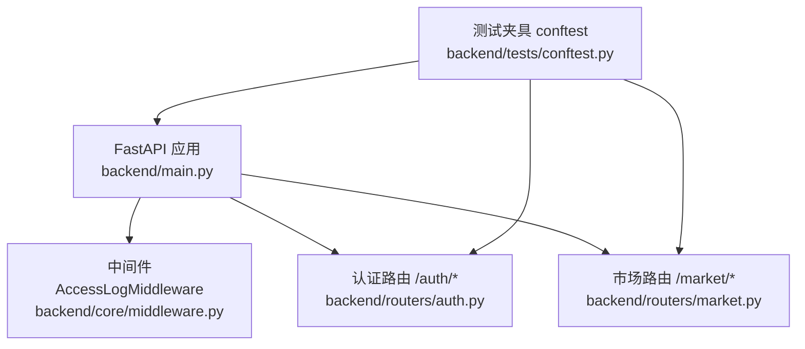
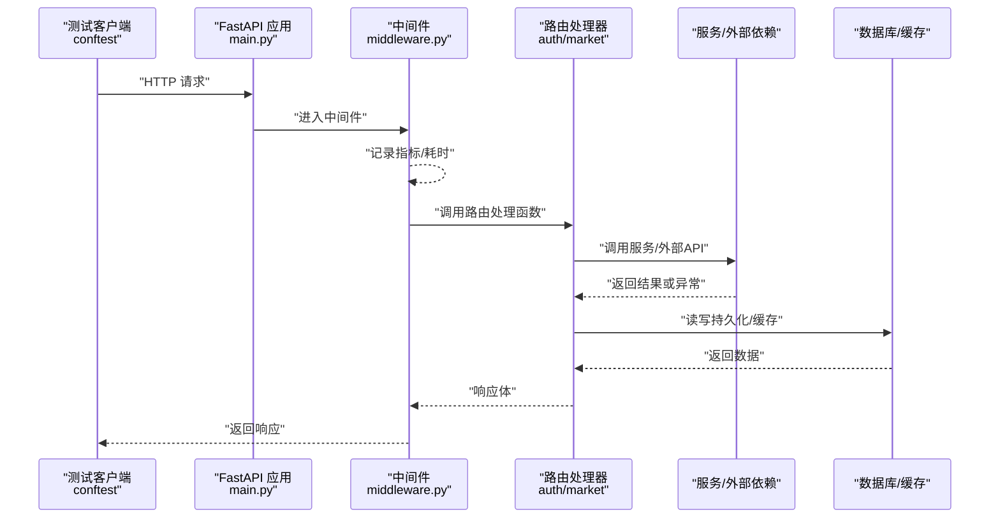
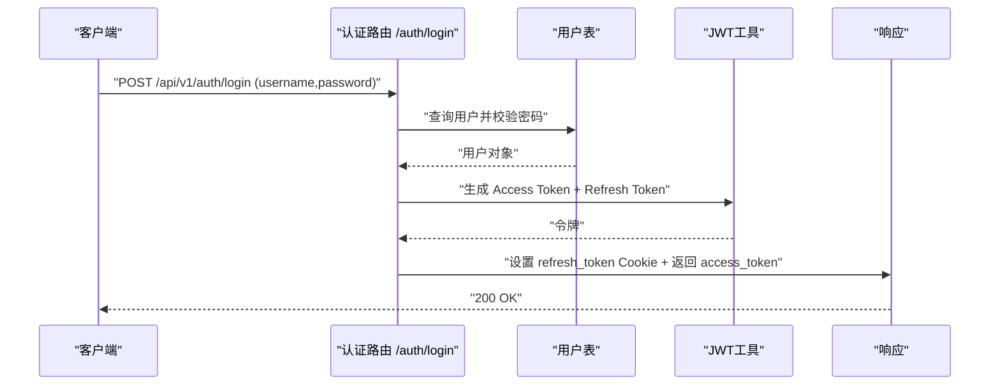
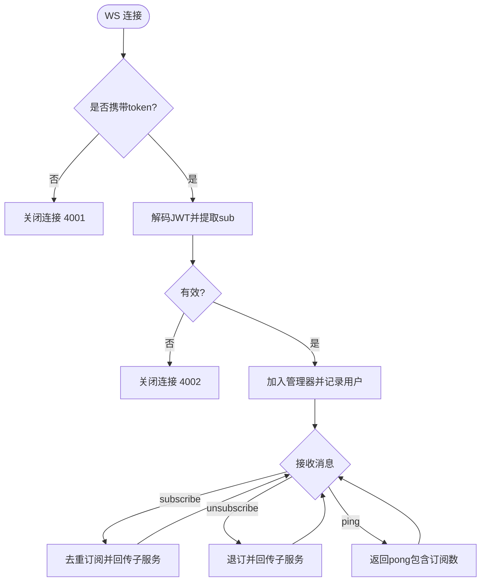
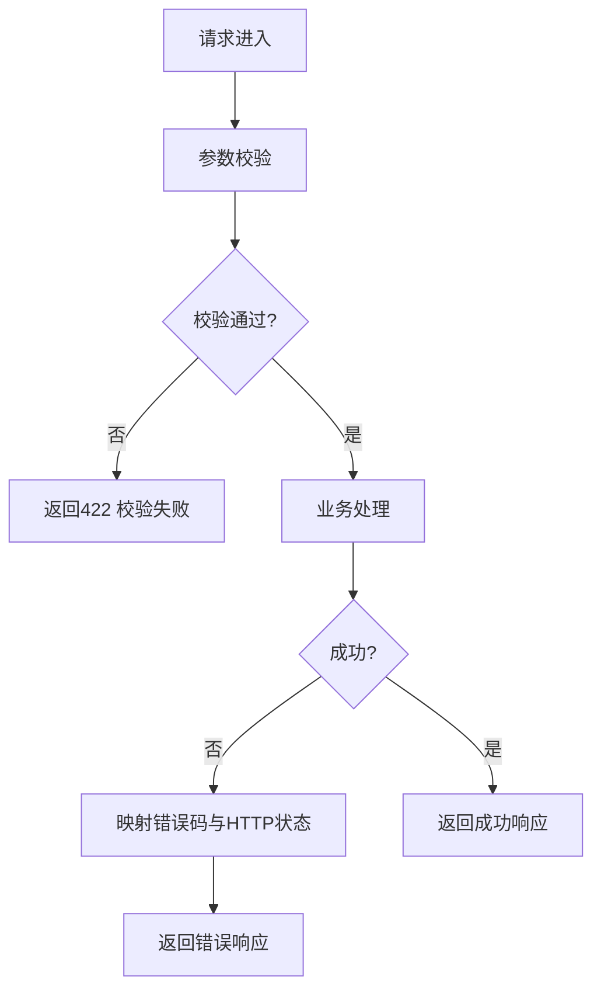
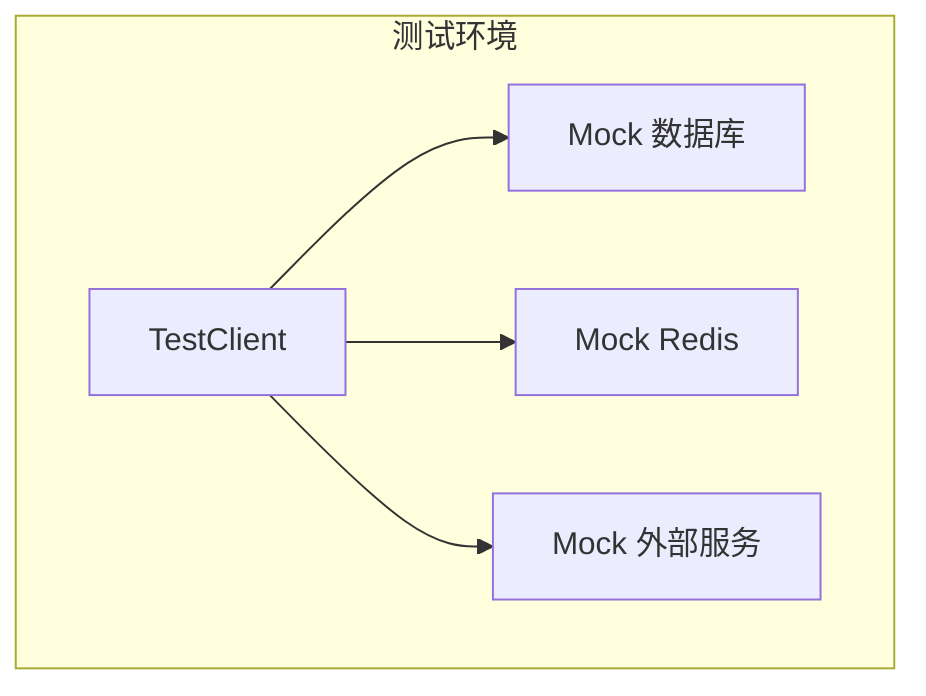
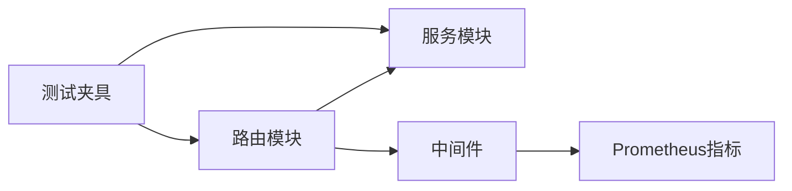

# API路由测试规范

<cite>
**本文引用的文件**
- [backend/main.py](file://backend/main.py)
- [backend/core/middleware.py](file://backend/core/middleware.py)
- [backend/routers/auth.py](file://backend/routers/auth.py)
- [backend/routers/market.py](file://backend/routers/market.py)
- [backend/tests/conftest.py](file://backend/tests/conftest.py)
- [backend/tests/test_auth.py](file://backend/tests/test_auth.py)
- [backend/tests/test_market_router.py](file://backend/tests/test_market_router.py)
- [backend/core/exceptions.py](file://backend/core/exceptions.py)
- [backend/core/error_codes.py](file://backend/core/error_codes.py)
</cite>

## 目录
1. [简介](#简介)
2. [项目结构](#项目结构)
3. [核心组件](#核心组件)
4. [架构总览](#架构总览)
5. [详细组件分析](#详细组件分析)
6. [依赖关系分析](#依赖关系分析)
7. [性能考虑](#性能考虑)
8. [故障排查指南](#故障排查指南)
9. [结论](#结论)
10. [附录](#附录)

## 简介
本规范面向Quant Agent后端API的FastAPI路由测试，覆盖同步与异步测试客户端、请求构造、响应验证、认证中间件（JWT）测试、数据校验测试、业务路由测试（市场数据、订单管理、策略管理等）、集成测试策略（数据库、缓存、外部服务）以及性能测试（负载、并发、响应时间监控）。目标是为开发者提供可落地的测试实践与最佳实践清单。

## 项目结构
后端采用模块化路由组织，统一通过应用工厂创建FastAPI实例并挂载路由；测试层基于pytest，提供统一的fixtures与环境隔离。关键入口与测试基础设施如下：
- 应用装配与路由挂载：backend/main.py
- 全局中间件与指标采集：backend/core/middleware.py
- 认证路由与JWT流程：backend/routers/auth.py
- 市场数据路由与WebSocket：backend/routers/market.py
- 测试夹具与环境配置：backend/tests/conftest.py
- 认证与市场路由单测示例：backend/tests/test_auth.py、backend/tests/test_market_router.py
- 异常体系与错误码：backend/core/exceptions.py、backend/core/error_codes.py

图表来源
- [backend/main.py:125-218](file://backend/main.py#L125-L218)
- [backend/core/middleware.py:90-133](file://backend/core/middleware.py#L90-L133)
- [backend/routers/auth.py:100-386](file://backend/routers/auth.py#L100-L386)
- [backend/routers/market.py:45-200](file://backend/routers/market.py#L45-L200)
- [backend/tests/conftest.py:355-375](file://backend/tests/conftest.py#L355-L375)

章节来源
- [backend/main.py:125-218](file://backend/main.py#L125-L218)
- [backend/core/middleware.py:90-133](file://backend/core/middleware.py#L90-L133)
- [backend/tests/conftest.py:355-375](file://backend/tests/conftest.py#L355-L375)

## 核心组件
- FastAPI应用工厂与路由挂载：集中注册所有业务路由，统一前缀/api/v1，便于测试断言路径。
- 访问日志与Prometheus指标：统一记录请求耗时、状态码、外部调用耗时，为性能测试提供观测点。
- 认证路由：提供登录、刷新、登出、当前用户信息，使用JWT与Cookie管理会话。
- 市场数据路由：提供行情查询、健康检查、WebSocket实时推送等接口。
- 测试夹具：提供同步/异步TestClient、Mock Redis/DB/外部服务、鉴权旁路等。

章节来源
- [backend/main.py:125-218](file://backend/main.py#L125-L218)
- [backend/core/middleware.py:10-88](file://backend/core/middleware.py#L10-L88)
- [backend/routers/auth.py:100-386](file://backend/routers/auth.py#L100-L386)
- [backend/routers/market.py:45-200](file://backend/routers/market.py#L45-L200)
- [backend/tests/conftest.py:177-268](file://backend/tests/conftest.py#L177-L268)

## 架构总览
下图展示从测试客户端到路由、中间件、服务的调用链，以及认证与数据流的关键节点。

图表来源
- [backend/main.py:125-218](file://backend/main.py#L125-L218)
- [backend/core/middleware.py:90-133](file://backend/core/middleware.py#L90-L133)
- [backend/routers/auth.py:117-162](file://backend/routers/auth.py#L117-L162)
- [backend/routers/market.py:73-200](file://backend/routers/market.py#L73-L200)

## 详细组件分析

### 认证路由测试（JWT、权限、上下文模拟）
- 登录流程：表单提交用户名密码，服务端校验后签发Access Token与Refresh Token，设置HttpOnly Cookie。
- 刷新流程：读取Cookie中的Refresh Token，校验后签发新的Access Token并续期Refresh Token。
- 登出流程：尝试解析Cookie中的Refresh Token，记录审计日志，删除Cookie。
- 当前用户：通过Depends注入get_current_user，解析Authorization头中的Bearer Token并获取用户。

图表来源
- [backend/routers/auth.py:117-162](file://backend/routers/auth.py#L117-L162)
- [backend/routers/auth.py:305-346](file://backend/routers/auth.py#L305-L346)
- [backend/routers/auth.py:349-386](file://backend/routers/auth.py#L349-L386)

测试要点与最佳实践
- 使用同步TestClient进行登录、刷新、登出、获取当前用户等端到端用例。
- 未携带Token访问受保护接口应返回401/403；携带无效Token也应失败。
- 利用conftest中的鉴权旁路机制，对特定前缀路由在测试中自动注入假用户，避免大量401干扰。
- 针对Cookie行为（SameSite、Secure）在不同环境下的差异，需分别验证。

章节来源
- [backend/routers/auth.py:100-386](file://backend/routers/auth.py#L100-L386)
- [backend/tests/test_auth.py:33-78](file://backend/tests/test_auth.py#L33-L78)
- [backend/tests/conftest.py:585-679](file://backend/tests/conftest.py#L585-L679)

### 市场数据路由测试（REST与WebSocket）
- REST接口：行情报价、基本面数据、服务健康检查等，支持多数据源聚合与降级。
- WebSocket：连接鉴权（Query String token）、心跳保活、订阅/退订标的、背压保护。

图表来源
- [backend/routers/market.py:73-200](file://backend/routers/market.py#L73-L200)

测试要点与最佳实践
- REST：验证不同数据源（如Futu、YFinance）的成功与失败分支，确认扁平payload结构与source字段。
- WebSocket：验证无token连接被拒绝、无效token断开、心跳超时断开、重复订阅去重、退订释放资源。
- 使用TestClient配合mock外部数据源，确保测试稳定与快速。

章节来源
- [backend/routers/market.py:45-200](file://backend/routers/market.py#L45-L200)
- [backend/tests/test_market_router.py:31-71](file://backend/tests/test_market_router.py#L31-L71)
- [backend/tests/test_market_router.py:110-169](file://backend/tests/test_market_router.py#L110-L169)

### 数据验证测试（参数校验、响应格式、错误响应）
- 参数校验：Pydantic模型校验请求体与查询参数，非法输入返回422。
- 响应格式：统一返回结构，包含data、source、degraded等字段；错误时返回标准错误码与消息。
- 错误响应：自定义异常层级与错误码映射，保证HTTP状态码与业务错误码一致。

图表来源
- [backend/core/exceptions.py:14-144](file://backend/core/exceptions.py#L14-L144)
- [backend/core/error_codes.py:15-55](file://backend/core/error_codes.py#L15-L55)

测试要点与最佳实践
- 针对每个路由的入参边界值、类型、必填项进行覆盖。
- 断言响应体结构（字段存在性、类型、枚举值），尤其是扁平payload与degraded标志。
- 验证错误码映射是否正确，确保前端能按统一错误协议处理。

章节来源
- [backend/core/exceptions.py:14-144](file://backend/core/exceptions.py#L14-L144)
- [backend/core/error_codes.py:15-55](file://backend/core/error_codes.py#L15-L55)

### 业务路由测试示例（市场数据、订单管理、策略管理）
- 市场数据：报价、K线、基本面、健康检查、服务可达性。
- 订单管理：下单、撤单、查询订单、查询持仓（结合OMS路由）。
- 策略管理：策略版本、沙箱执行、回测报告（结合strategy/backtest路由）。

测试要点与最佳实践
- 使用conftest提供的sample_*夹具快速构造测试数据。
- 对外部依赖（数据库、Redis、第三方数据源）进行Mock，确保测试隔离与稳定性。
- 对关键路径（下单、回测）增加异常分支与降级场景测试。

章节来源
- [backend/tests/conftest.py:407-582](file://backend/tests/conftest.py#L407-L582)
- [backend/tests/test_market_router.py:73-108](file://backend/tests/test_market_router.py#L73-L108)

### 集成测试策略（数据库、缓存、外部服务）
- 数据库交互：使用内存SQLite或临时引擎，覆盖CRUD与事务边界。
- 缓存操作：Mock Redis客户端，验证读/写/过期/管道行为。
- 外部服务：Mock httpx/第三方SDK，模拟成功、超时、熔断等场景。

图表来源
- [backend/tests/conftest.py:297-353](file://backend/tests/conftest.py#L297-L353)
- [backend/tests/conftest.py:177-268](file://backend/tests/conftest.py#L177-L268)

章节来源
- [backend/tests/conftest.py:297-353](file://backend/tests/conftest.py#L297-L353)
- [backend/tests/conftest.py:177-268](file://backend/tests/conftest.py#L177-L268)

## 依赖关系分析
- 路由与服务解耦：路由仅负责请求解析与响应封装，业务逻辑下沉至services与domain层。
- 中间件与指标：AccessLogMiddleware与Prometheus指标贯穿所有请求，便于性能分析与问题定位。
- 测试夹具与依赖注入：通过dependency_overrides替换真实依赖，实现测试隔离。

图表来源
- [backend/main.py:125-218](file://backend/main.py#L125-L218)
- [backend/core/middleware.py:10-88](file://backend/core/middleware.py#L10-L88)
- [backend/tests/conftest.py:585-679](file://backend/tests/conftest.py#L585-L679)

章节来源
- [backend/main.py:125-218](file://backend/main.py#L125-L218)
- [backend/core/middleware.py:10-88](file://backend/core/middleware.py#L10-L88)
- [backend/tests/conftest.py:585-679](file://backend/tests/conftest.py#L585-L679)

## 性能考虑
- 中间件指标：通过Prometheus计数器与直方图记录请求总数、状态码、P95/P99耗时，用于负载测试与瓶颈定位。
- 外部调用监控：httpx拦截器统计第三方API耗时与状态码，识别慢调用与不稳定服务。
- 建议实践：
  - 使用Locust或类似工具进行负载与并发测试，关注P95/P99与错误率。
  - 对热点接口（如行情、下单）进行压力测试，观察缓存命中率与数据库连接池使用情况。
  - 结合分布式追踪（OpenTelemetry）与日志，定位慢请求根因。

章节来源
- [backend/core/middleware.py:10-88](file://backend/core/middleware.py#L10-L88)

## 故障排查指南
- 常见错误：
  - 401/403：Token缺失、过期或权限不足，检查Authorization头与Cookie。
  - 422：参数校验失败，检查请求体结构与必填字段。
  - 503：外部依赖不可用（Redis、数据源），检查服务健康与熔断状态。
- 排查步骤：
  - 查看中间件日志与Prometheus指标，定位慢请求与异常。
  - 使用conftest中的Mock能力逐步缩小问题范围（数据库、缓存、外部服务）。
  - 针对WebSocket，检查token鉴权、心跳超时与订阅去重逻辑。

章节来源
- [backend/core/error_codes.py:15-55](file://backend/core/error_codes.py#L15-L55)
- [backend/core/exceptions.py:14-144](file://backend/core/exceptions.py#L14-L144)
- [backend/core/middleware.py:90-133](file://backend/core/middleware.py#L90-L133)

## 结论
本规范围绕FastAPI路由测试的最佳实践，系统阐述了认证、数据验证、业务路由、集成测试与性能测试的关键点。通过统一的测试夹具与Mock策略，确保测试的稳定性和覆盖率；借助中间件指标与异常体系，提升问题定位效率。建议团队在日常开发中遵循本规范，持续完善测试用例与质量门禁。

## 附录
- 同步与异步测试客户端：
  - 同步：使用fastapi.testclient.TestClient，适合简单HTTP用例。
  - 异步：使用httpx.AsyncClient(app=app)，适合异步路由与高并发场景。
- 请求构造与响应验证：
  - 使用Pydantic模型约束请求体，断言响应体结构与字段。
  - 对错误响应断言错误码与消息，确保前后端契约一致。
- 认证中间件测试：
  - 覆盖登录、刷新、登出、当前用户等流程。
  - 验证JWT签名、过期时间、Cookie属性（SameSite、Secure）。
- 业务路由测试：
  - 市场数据：报价、基本面、健康检查、WebSocket。
  - 订单管理：下单、撤单、查询。
  - 策略管理：版本、沙箱、回测报告。
- 集成测试：
  - 数据库：内存SQLite或临时引擎，覆盖CRUD与事务。
  - 缓存：Mock Redis，验证读写与过期。
  - 外部服务：Mock httpx/SDK，模拟成功、超时、熔断。
- 性能测试：
  - 负载与并发：Locust等工具，关注P95/P99与错误率。
  - 监控：Prometheus与OpenTelemetry，结合日志定位瓶颈。