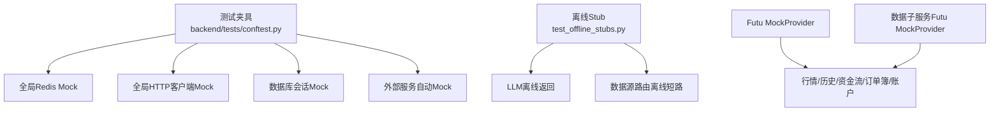
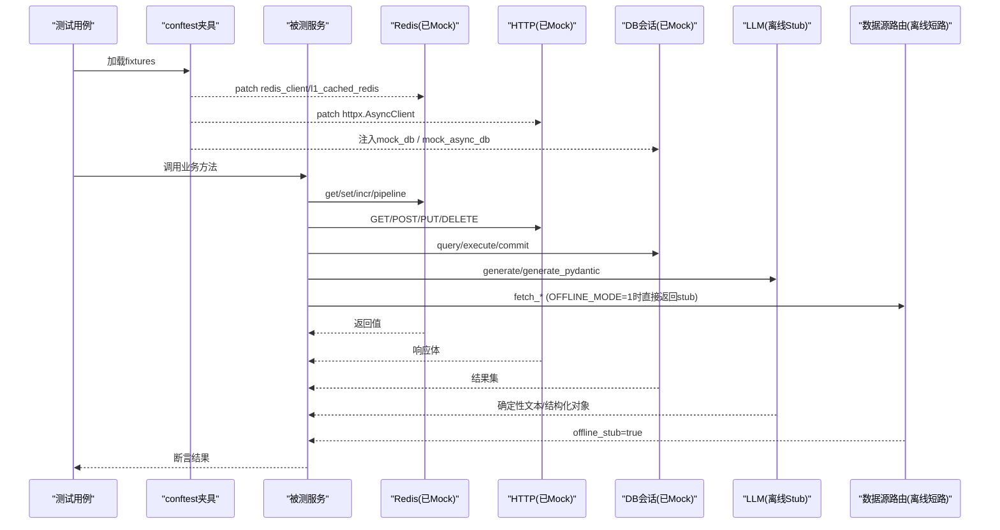
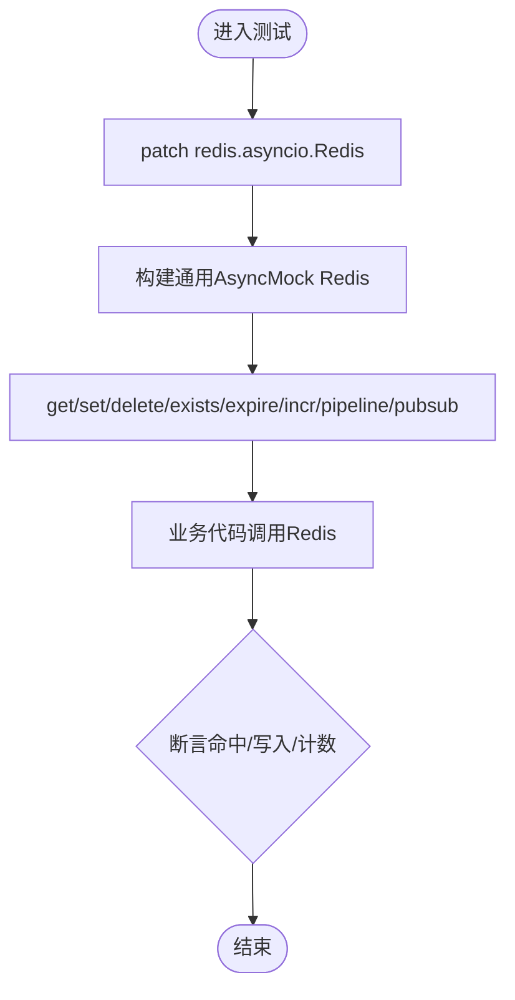
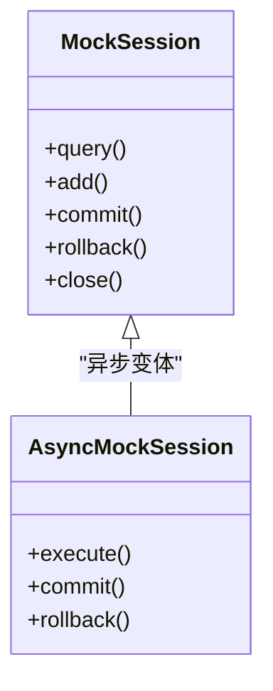
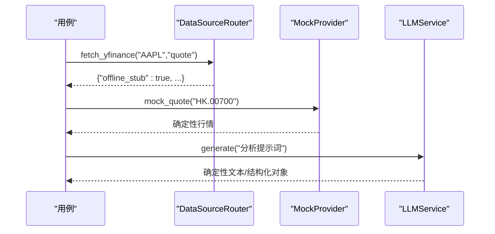
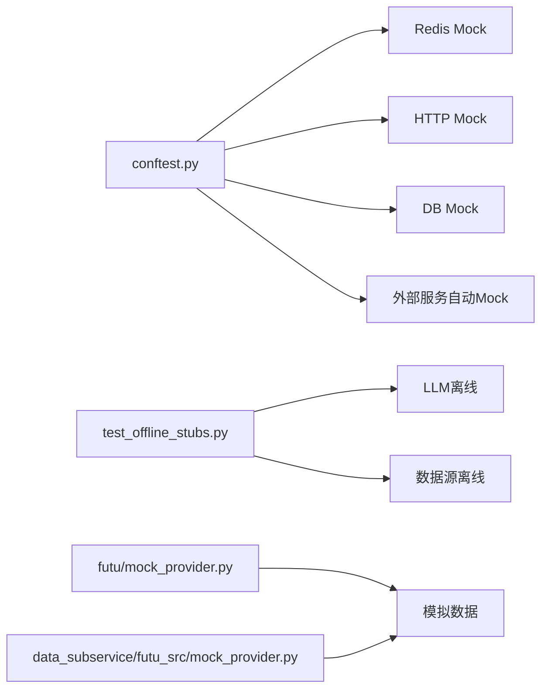

# Mock与Stub策略

<cite>
**本文引用的文件**
- [backend/tests/conftest.py](file://backend/tests/conftest.py)
- [backend/tests/test_offline_stubs.py](file://backend/tests/test_offline_stubs.py)
- [backend/services/futu/mock_provider.py](file://backend/services/futu/mock_provider.py)
- [data_subservice/futu_src/mock_provider.py](file://data_subservice/futu_src/mock_provider.py)
</cite>

## 目录
1. [简介](#简介)
2. [项目结构](#项目结构)
3. [核心组件](#核心组件)
4. [架构总览](#架构总览)
5. [详细组件分析](#详细组件分析)
6. [依赖关系分析](#依赖关系分析)
7. [性能考虑](#性能考虑)
8. [故障排查指南](#故障排查指南)
9. [结论](#结论)
10. [附录](#附录)

## 简介
本指南面向Quant Agent项目的测试与开发，系统化阐述Mock与Stub策略，覆盖外部依赖（Redis、HTTP客户端、第三方API）、异步Mock（AsyncMock、协程行为、异常场景）、数据库（SQLAlchemy会话、查询结果、事务）、业务服务（数据源、交易接口、AI服务）以及网络请求拦截与错误处理。同时给出性能测试考量（开销控制、内存优化、并发安全），帮助开发者设计可维护、可复现、高性能的测试替身体系。

## 项目结构
本项目在测试层通过统一的pytest fixtures集中管理Mock/Stub，并在关键模块提供离线Stub实现，确保在无真实依赖环境下稳定运行。

图表来源
- [backend/tests/conftest.py:100-268](file://backend/tests/conftest.py#L100-L268)
- [backend/tests/test_offline_stubs.py:1-169](file://backend/tests/test_offline_stubs.py#L1-L169)
- [backend/services/futu/mock_provider.py:1-147](file://backend/services/futu/mock_provider.py#L1-L147)
- [data_subservice/futu_src/mock_provider.py:1-147](file://data_subservice/futu_src/mock_provider.py#L1-L147)

章节来源
- [backend/tests/conftest.py:100-268](file://backend/tests/conftest.py#L100-L268)
- [backend/tests/test_offline_stubs.py:1-169](file://backend/tests/test_offline_stubs.py#L1-L169)
- [backend/services/futu/mock_provider.py:1-147](file://backend/services/futu/mock_provider.py#L1-L147)
- [data_subservice/futu_src/mock_provider.py:1-147](file://data_subservice/futu_src/mock_provider.py#L1-L147)

## 核心组件
- 全局Redis Mock：通过autouse fixture动态patch多个模块中的redis_client/l1_cached_redis/redis_batch_writer，提供get/set/delete/exists/expire/incr/pipeline/pubsub等能力，并内置轻量内存存储以支持原子操作验证。
- HTTP客户端Mock：提供httpx异步客户端的通用Mock，统一返回200与空JSON，便于快速构造成功路径用例。
- 数据库会话Mock：同步与异步两种会话Mock，覆盖query/add/commit/rollback/close或execute/commit/rollback等常用方法。
- 外部服务自动Mock：默认禁用真实网络访问，自动mock Futu/yfinance等服务；可通过环境变量或标记开关切换。
- 离线Stub：在testing/offline环境启用LLM与数据源的离线返回，保证无网可用且结果可预测。

章节来源
- [backend/tests/conftest.py:100-268](file://backend/tests/conftest.py#L100-L268)
- [backend/tests/conftest.py:271-295](file://backend/tests/conftest.py#L271-L295)
- [backend/tests/conftest.py:298-352](file://backend/tests/conftest.py#L298-L352)
- [backend/tests/test_offline_stubs.py:1-169](file://backend/tests/test_offline_stubs.py#L1-L169)

## 架构总览
下图展示测试期Mock/Stub如何替换真实依赖，形成“应用逻辑 + 测试替身”的稳定执行路径。

图表来源
- [backend/tests/conftest.py:100-268](file://backend/tests/conftest.py#L100-L268)
- [backend/tests/conftest.py:298-352](file://backend/tests/conftest.py#L298-L352)
- [backend/tests/test_offline_stubs.py:131-161](file://backend/tests/test_offline_stubs.py#L131-L161)

## 详细组件分析

### Redis客户端Mock策略
- 目标：在不启动真实Redis的情况下，模拟常用命令与管道行为，保障健康检查与缓存读写路径可测。
- 关键点：
  - 使用Autouse Fixture在导入前patch redis.asyncio.Redis，避免模块级初始化建立真实连接。
  - 为redis_client、l1_cached_redis、redis_batch_writer分别提供对应能力的Mock。
  - pipeline支持异步上下文管理器，incr/expire/execute返回符合预期的值。
  - pubsub订阅/消息获取/关闭均Mock，满足SSE等场景。
  - ping必须返回True，否则健康检查失败。
- 扩展建议：新增模块引用Redis时，将其加入patch列表，确保每测试隔离。

图表来源
- [backend/tests/conftest.py:100-268](file://backend/tests/conftest.py#L100-L268)

章节来源
- [backend/tests/conftest.py:100-268](file://backend/tests/conftest.py#L100-L268)

### HTTP客户端与第三方API Mock
- 目标：拦截所有HTTP出站请求，返回可控响应，便于覆盖成功/失败/超时/限流等分支。
- 关键点：
  - 提供httpx.AsyncClient的通用Mock，统一返回200与空JSON。
  - 可在具体用例中按需覆盖response.json/text/status_code，或抛出异常模拟网络错误。
  - 结合conftest的外部服务自动Mock，避免触发真实网络。
- 实践建议：
  - 对需要复杂响应的接口，按用例构造最小必要字段。
  - 对错误路径，优先使用side_effect抛出特定异常，验证重试/熔断/降级逻辑。

章节来源
- [backend/tests/conftest.py:339-352](file://backend/tests/conftest.py#L339-L352)
- [backend/tests/conftest.py:271-295](file://backend/tests/conftest.py#L271-L295)

### 数据库Mock策略（SQLAlchemy）
- 目标：在不连接真实数据库的前提下，验证ORM/SQL执行路径、事务语义与回滚逻辑。
- 关键点：
  - 提供同步与异步会话Mock，覆盖query/add/commit/rollback/close或execute/commit/rollback。
  - 通过包装create_engine/create_async_engine登记引擎，在测试结束后统一dispose，避免资源泄漏。
  - 强制使用SQLite内存库，避免CI环境PostgreSQL类型不兼容问题。
- 实践建议：
  - 针对复杂查询，使用return_value预设结果集；针对写路径，断言commit/rollback被调用次数。
  - 对于事务边界，结合异常注入验证回滚分支。

图表来源
- [backend/tests/conftest.py:298-317](file://backend/tests/conftest.py#L298-L317)

章节来源
- [backend/tests/conftest.py:36-98](file://backend/tests/conftest.py#L36-L98)
- [backend/tests/conftest.py:298-317](file://backend/tests/conftest.py#L298-L317)

### 异步Mock与协程行为模拟
- 目标：确保协程函数、异步I/O、事件循环在测试中可预测地执行。
- 关键点：
  - 大量使用AsyncMock模拟异步方法，配合side_effect设置不同分支。
  - 为旧式测试提供独立event_loop fixture，兼容基于loop.run_until_complete的用例。
  - 对外部服务的自动Mock默认跳过真实网络，必要时通过标记或环境变量开启真实调用。
- 实践建议：
  - 对并发场景，使用独立的fixture隔离事件循环，避免状态污染。
  - 对超时/取消等异常，使用side_effect抛出TimeoutError/CancelledError进行覆盖。

章节来源
- [backend/tests/conftest.py:140-149](file://backend/tests/conftest.py#L140-L149)
- [backend/tests/conftest.py:271-295](file://backend/tests/conftest.py#L271-L295)

### 业务服务Mock示例
- 数据源服务：通过DataSourceRouter的离线模式，使fetch_*直接返回确定性stub，无需节点健康或enabled配置。
- 交易接口：利用Futu MockProvider生成行情、历史、资金流、订单簿、账户信息等，覆盖多市场与期权场景。
- AI服务：LLMService在testing/offline环境返回确定性文本或Pydantic模型实例，并与Token计量联动。

图表来源
- [backend/tests/test_offline_stubs.py:131-161](file://backend/tests/test_offline_stubs.py#L131-L161)
- [backend/services/futu/mock_provider.py:13-147](file://backend/services/futu/mock_provider.py#L13-L147)
- [data_subservice/futu_src/mock_provider.py:13-147](file://data_subservice/futu_src/mock_provider.py#L13-L147)

章节来源
- [backend/tests/test_offline_stubs.py:1-169](file://backend/tests/test_offline_stubs.py#L1-L169)
- [backend/services/futu/mock_provider.py:1-147](file://backend/services/futu/mock_provider.py#L1-L147)
- [data_subservice/futu_src/mock_provider.py:1-147](file://data_subservice/futu_src/mock_provider.py#L1-L147)

### 网络请求Mock与错误处理测试
- 目标：覆盖正常响应、网络错误、超时、限流、熔断等路径。
- 关键点：
  - 通过httpx客户端Mock统一拦截请求，按用例定制响应。
  - 结合熔断器与重试工具（如存在）验证降级与恢复。
  - 使用live_network标记区分需真实网络的集成测试，默认跳过以保证离线友好。
- 实践建议：
  - 对错误分支，优先用side_effect抛出异常，而非仅修改状态码。
  - 对限流/熔断，构造连续失败序列验证阈值与恢复。

章节来源
- [backend/tests/conftest.py:24-33](file://backend/tests/conftest.py#L24-L33)
- [backend/tests/conftest.py:339-352](file://backend/tests/conftest.py#L339-L352)
- [backend/tests/test_offline_stubs.py:164-169](file://backend/tests/test_offline_stubs.py#L164-L169)

## 依赖关系分析
- conftest作为测试基础设施，集中管理Redis、HTTP、DB、外部服务的Mock，降低各用例耦合度。
- test_offline_stubs验证离线模式下的LLM与数据源路由行为，确保无网可用。
- Futu MockProvider提供稳定的模拟数据，屏蔽底层券商/数据源差异。

图表来源
- [backend/tests/conftest.py:100-268](file://backend/tests/conftest.py#L100-L268)
- [backend/tests/test_offline_stubs.py:1-169](file://backend/tests/test_offline_stubs.py#L1-L169)
- [backend/services/futu/mock_provider.py:1-147](file://backend/services/futu/mock_provider.py#L1-L147)
- [data_subservice/futu_src/mock_provider.py:1-147](file://data_subservice/futu_src/mock_provider.py#L1-L147)

章节来源
- [backend/tests/conftest.py:100-268](file://backend/tests/conftest.py#L100-L268)
- [backend/tests/test_offline_stubs.py:1-169](file://backend/tests/test_offline_stubs.py#L1-L169)
- [backend/services/futu/mock_provider.py:1-147](file://backend/services/futu/mock_provider.py#L1-L147)
- [data_subservice/futu_src/mock_provider.py:1-147](file://data_subservice/futu_src/mock_provider.py#L1-L147)

## 性能考虑
- Mock开销控制：
  - 尽量使用轻量级内存存储替代真实Redis，减少序列化/网络开销。
  - 对高频调用（如pipeline）返回固定小对象，避免大对象复制。
- 内存使用优化：
  - 避免在fixture中创建超大数据集；按需生成或使用工厂方法。
  - 及时释放引擎与连接，防止测试期间内存增长。
- 并发安全性验证：
  - 每个测试使用独立事件循环，避免共享状态污染。
  - 对共享单例（如熔断器）在测试前后重置，确保隔离。

[本节为通用指导，不直接分析具体文件]

## 故障排查指南
- Redis相关：
  - 若健康检查失败，确认mock_rc.ping返回True。
  - 若出现未关闭连接警告，确认engine dispose流程生效。
- 外部服务：
  - 如需真实网络，设置相应环境变量或移除no_mock_external标记；否则保持离线。
- 离线模式：
  - OFFLINE_MODE=1时，数据源路由应直接返回offline_stub=true；若未生效，检查环境变量与导入顺序。
- LLM离线：
  - testing/offline环境应返回确定性内容；若触网，检查QUANT_ENV与LLM_STUB配置。

章节来源
- [backend/tests/conftest.py:100-268](file://backend/tests/conftest.py#L100-L268)
- [backend/tests/conftest.py:271-295](file://backend/tests/conftest.py#L271-L295)
- [backend/tests/test_offline_stubs.py:31-65](file://backend/tests/test_offline_stubs.py#L31-L65)
- [backend/tests/test_offline_stubs.py:131-161](file://backend/tests/test_offline_stubs.py#L131-L161)

## 结论
通过集中化的测试夹具与离线Stub，Quant Agent实现了高内聚、低耦合的Mock/Stub体系。该体系在保证测试稳定性的同时，兼顾了性能与可维护性。建议在新功能接入时遵循以下原则：
- 优先通过conftest提供的通用Mock完成基础路径验证。
- 对复杂外部依赖，采用专用MockProvider或离线Stub。
- 对异常与降级路径，使用side_effect精确注入错误。
- 对并发与资源，严格隔离事件循环与数据库连接。

[本节为总结，不直接分析具体文件]

## 附录
- 常用Fixture速查：
  - mock_db / mock_async_db：数据库会话Mock
  - mock_redis：Redis客户端Mock
  - mock_httpx：HTTP客户端Mock
  - mock_futu / mock_yfinance：第三方服务Mock
- 环境变量开关：
  - QUANT_ENV：控制离线模式与LLM Stub
  - OFFLINE_MODE：控制数据源路由离线短路
  - DISABLE_EXTERNAL_MOCK：关闭外部服务自动Mock
  - CHAT_MOCK_DELAY：测试环境加速

[本节为补充信息，不直接分析具体文件]
