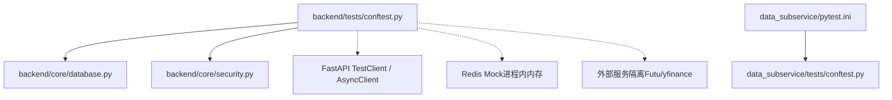
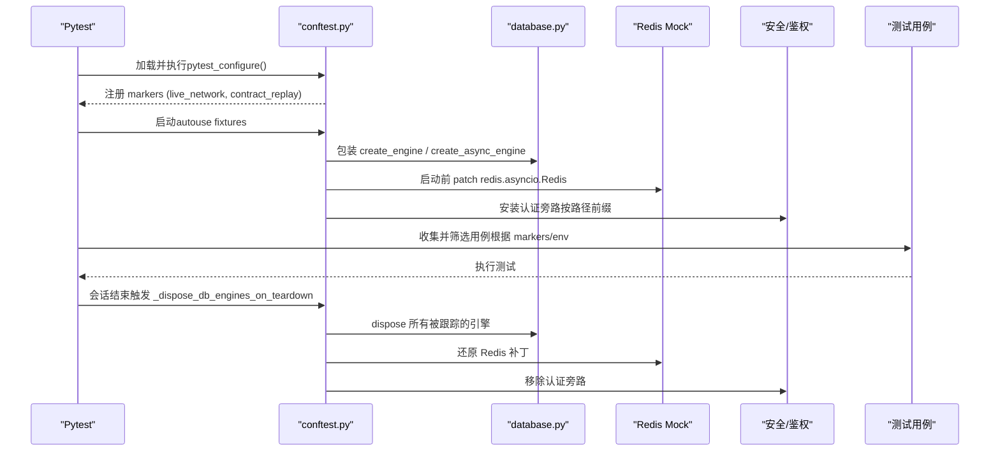
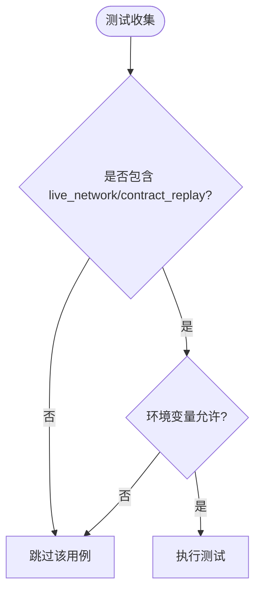
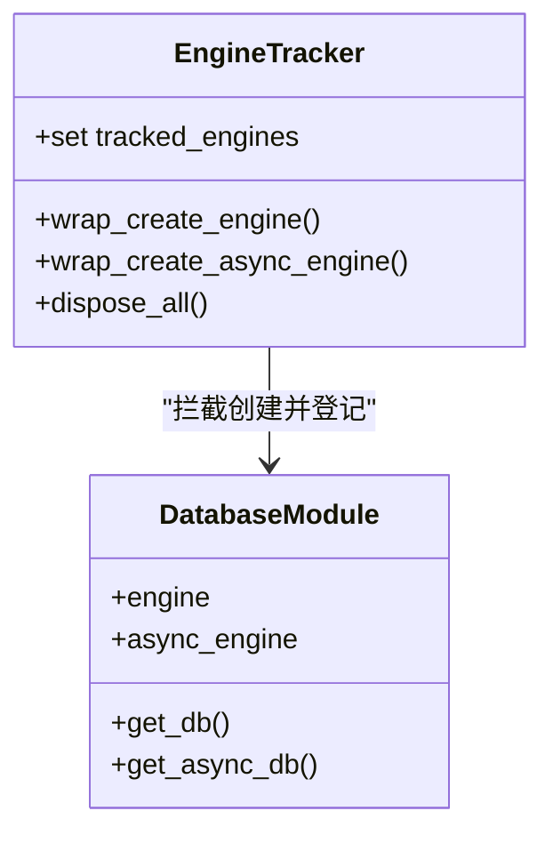
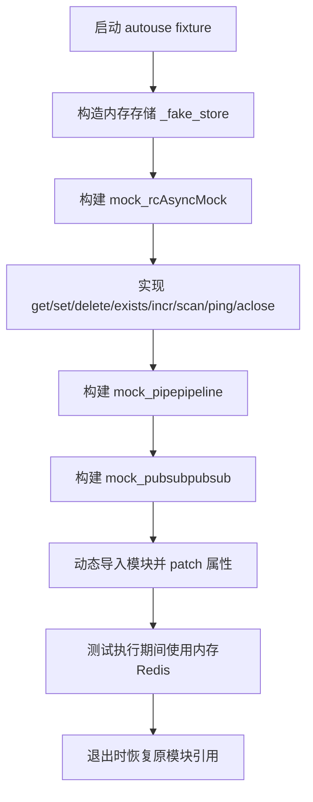
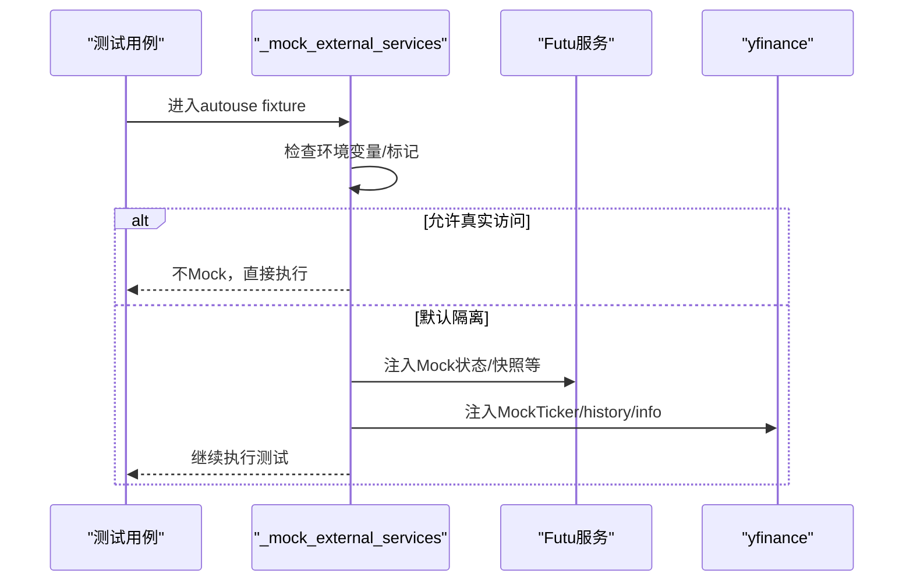
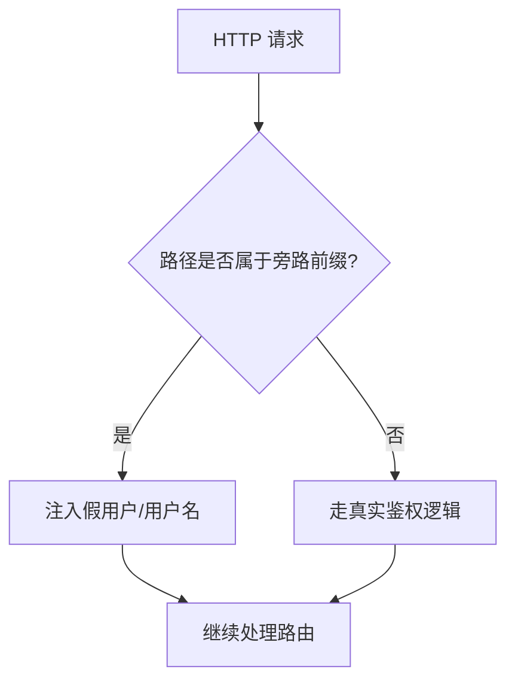
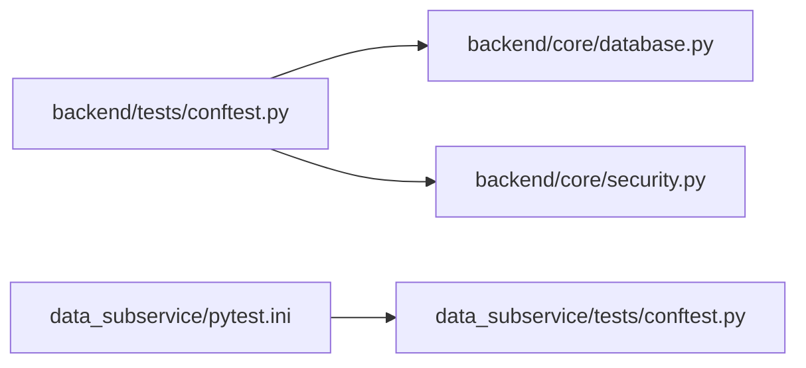

# Pytest配置与Fixtures

<cite>
**本文引用的文件**
- [backend/tests/conftest.py](file://backend/tests/conftest.py)
- [data_subservice/pytest.ini](file://data_subservice/pytest.ini)
- [backend/core/database.py](file://backend/core/database.py)
- [backend/core/security.py](file://backend/core/security.py)
</cite>

## 目录
1. [简介](#简介)
2. [项目结构](#项目结构)
3. [核心组件](#核心组件)
4. [架构总览](#架构总览)
5. [详细组件分析](#详细组件分析)
6. [依赖关系分析](#依赖关系分析)
7. [性能考虑](#性能考虑)
8. [故障排查指南](#故障排查指南)
9. [结论](#结论)
10. [附录](#附录)

## 简介
本文件面向Quant Agent项目的测试工程，聚焦于pytest框架在backend与data_subservice两端的配置与基础设施。重点说明：
- conftest.py的架构设计：全局fixture管理、测试环境初始化、依赖Mock策略
- 自定义标记（markers）的使用机制：live_network、contract_replay等
- 数据库引擎生命周期管理：SQLAlchemy引擎跟踪、连接释放、资源清理
- Redis客户端自动Mock实现原理：动态模块补丁、内存存储模拟、管道操作Mock
- 外部服务隔离策略：Futu OpenD、yfinance等第三方服务的Mock
- 认证旁路机制：在测试环境中绕过鉴权中间件
- pytest配置最佳实践：针对本项目环境的可复用建议

## 项目结构
后端主工程使用backend/tests下的conftest统一注入测试环境与依赖Mock；数据子服务data_subservice通过独立的pytest.ini与轻量conftest运行，避免重型SDK污染主工程环境。

图表来源
- [backend/tests/conftest.py:24-33](file://backend/tests/conftest.py#L24-L33)
- [backend/tests/conftest.py:100-268](file://backend/tests/conftest.py#L100-L268)
- [backend/core/database.py:1-67](file://backend/core/database.py#L1-L67)
- [data_subservice/pytest.ini:17-36](file://data_subservice/pytest.ini#L17-L36)

章节来源
- [backend/tests/conftest.py:24-33](file://backend/tests/conftest.py#L24-L33)
- [data_subservice/pytest.ini:17-36](file://data_subservice/pytest.ini#L17-L36)

## 核心组件
- 自定义标记注册：为集成测试与契约回放提供可选执行开关
- 数据库引擎追踪与释放：拦截create_engine/create_async_engine，会话结束时统一dispose
- Redis全局Mock：在导入前替换redis.asyncio.Redis，并在各模块中动态patch redis_client/l1_cached_redis/redis_batch_writer
- 外部服务隔离：默认禁用真实网络请求，支持按标记或环境变量切换
- 认证旁路：对指定路由前缀注入假用户，避免鉴权阻断测试

章节来源
- [backend/tests/conftest.py:24-33](file://backend/tests/conftest.py#L24-L33)
- [backend/tests/conftest.py:36-98](file://backend/tests/conftest.py#L36-L98)
- [backend/tests/conftest.py:100-268](file://backend/tests/conftest.py#L100-L268)
- [backend/tests/conftest.py:271-295](file://backend/tests/conftest.py#L271-L295)
- [backend/tests/conftest.py:585-679](file://backend/tests/conftest.py#L585-L679)

## 架构总览
下图展示了测试启动到用例执行的端到端流程，包括标记解析、环境初始化、依赖Mock注入、认证旁路与资源回收。

图表来源
- [backend/tests/conftest.py:24-33](file://backend/tests/conftest.py#L24-L33)
- [backend/tests/conftest.py:36-98](file://backend/tests/conftest.py#L36-L98)
- [backend/tests/conftest.py:100-268](file://backend/tests/conftest.py#L100-L268)
- [backend/tests/conftest.py:585-679](file://backend/tests/conftest.py#L585-L679)
- [backend/core/database.py:1-67](file://backend/core/database.py#L1-L67)

## 详细组件分析

### 自定义标记（markers）机制
- live_network：用于需要真实网络或外部API Key的集成测试，默认跳过，仅在显式启用时执行
- contract_replay：用于三方数据源契约录制/回放测试，默认离线回放预置cassette；设置QUANT_RECORD=1时可补录

图表来源
- [backend/tests/conftest.py:24-33](file://backend/tests/conftest.py#L24-L33)

章节来源
- [backend/tests/conftest.py:24-33](file://backend/tests/conftest.py#L24-L33)

### 数据库引擎生命周期管理
- 拦截创建：在导入任何模块之前，包装sqlalchemy.create_engine与create_async_engine，将创建的引擎加入全局集合
- 统一释放：会话结束时遍历集合，对同步/异步引擎均调用dispose，确保SQLite连接优雅关闭
- 兼容场景：覆盖模块级全局引擎、测试自建内存引擎、以及各db_session fixture临时引擎

图表来源
- [backend/tests/conftest.py:36-98](file://backend/tests/conftest.py#L36-L98)
- [backend/core/database.py:1-67](file://backend/core/database.py#L1-L67)

章节来源
- [backend/tests/conftest.py:36-98](file://backend/tests/conftest.py#L36-L98)
- [backend/core/database.py:1-67](file://backend/core/database.py#L1-L67)

### Redis客户端自动Mock实现原理
- 提前补丁：在导入任何模块之前，用AsyncMock替换redis.asyncio.Redis，防止模块加载时建立真实连接
- 动态模块补丁：通过importlib动态导入目标模块，仅对存在的属性（redis_client、l1_cached_redis、redis_batch_writer）进行patch
- 内存存储模拟：内部维护字典作为键值存储，get/set/delete/exists/incr/scan/ping等方法均基于内存状态
- 管道操作Mock：pipeline返回支持异步上下文管理的mock对象，incr/expire/execute等行为符合预期
- Pub/Sub Mock：pubsub订阅/获取消息/取消订阅/关闭方法均为异步mock

图表来源
- [backend/tests/conftest.py:100-268](file://backend/tests/conftest.py#L100-L268)

章节来源
- [backend/tests/conftest.py:100-268](file://backend/tests/conftest.py#L100-L268)

### 外部服务Mock策略（Futu OpenD、yfinance等）
- 默认隔离：autouse fixture默认阻止真实网络请求，避免测试依赖外部服务
- 选择性放行：可通过环境变量DISABLE_EXTERNAL_MOCK=1或标记no_mock_external跳过隔离
- 具体Mock：对Futu服务实例与方法进行Mock；对yfinance.Ticker进行Mock以返回静态行情数据

图表来源
- [backend/tests/conftest.py:271-295](file://backend/tests/conftest.py#L271-L295)

章节来源
- [backend/tests/conftest.py:271-295](file://backend/tests/conftest.py#L271-L295)

### 认证旁路机制（测试环境绕过鉴权）
- 目的：对新增鉴权的路由前缀统一注入假用户，避免大量既有单测因缺少Token而失败
- 范围：仅对特定前缀（如交易、OMS、告警、审计、选股、策略、聊天建议等）生效，其他路由保留真实鉴权
- 实现：通过app.dependency_overrides覆盖get_current_user、get_current_user_optional、get_current_username，在路径匹配时返回假用户对象或用户名

图表来源
- [backend/tests/conftest.py:585-679](file://backend/tests/conftest.py#L585-L679)

章节来源
- [backend/tests/conftest.py:585-679](file://backend/tests/conftest.py#L585-L679)

### HTTP客户端与测试客户端
- 同步与异步TestClient：分别提供fastapi.testclient.TestClient与httpx.AsyncClient(app=app)
- httpx客户端Mock：提供统一的响应结构与JSON解析，便于断言接口行为

章节来源
- [backend/tests/conftest.py:339-375](file://backend/tests/conftest.py#L339-L375)

### 数据子服务独立测试入口
- 独立pytest.ini：定义testpaths、markers、asyncio_mode、env与filterwarnings，保证与主工程一致的行为
- 独立conftest：注入sys.path，使data_subservice作为顶层包可导入，同时兼容内部绝对导入

章节来源
- [data_subservice/pytest.ini:17-36](file://data_subservice/pytest.ini#L17-L36)
- [data_subservice/tests/conftest.py:1-21](file://data_subservice/tests/conftest.py#L1-L21)

## 依赖关系分析
- backend/tests/conftest.py依赖backend.core.database与backend.core.security，并通过FastAPI依赖注入机制进行认证旁路
- data_subservice/pytest.ini与data_subservice/tests/conftest.py构成独立测试环境，避免主工程依赖重型SDK
- 数据库模块提供同步与异步引擎及会话工厂，供业务层与服务层使用

图表来源
- [backend/tests/conftest.py:585-679](file://backend/tests/conftest.py#L585-L679)
- [backend/core/database.py:1-67](file://backend/core/database.py#L1-L67)
- [data_subservice/pytest.ini:17-36](file://data_subservice/pytest.ini#L17-L36)

章节来源
- [backend/tests/conftest.py:585-679](file://backend/tests/conftest.py#L585-L679)
- [backend/core/database.py:1-67](file://backend/core/database.py#L1-L67)
- [data_subservice/pytest.ini:17-36](file://data_subservice/pytest.ini#L17-L36)

## 性能考虑
- 降低bcrypt成本因子：测试环境将BCRYPT_ROUNDS设置为较低值，显著加速密码哈希验证
- 减少外部延迟：关闭聊天路由的模拟延迟，提升端到端测试速度
- 内存Redis：使用进程内字典模拟缓存，避免网络IO开销
- 引擎统一释放：避免未关闭连接导致的ResourceWarning与资源泄漏

章节来源
- [backend/tests/conftest.py:155-175](file://backend/tests/conftest.py#L155-L175)
- [backend/tests/conftest.py:36-98](file://backend/tests/conftest.py#L36-L98)

## 故障排查指南
- ResourceWarning未关闭数据库连接：确认已安装引擎追踪与释放fixture，并确保测试结束后调用dispose
- Redis连接超时：确认已在导入前patch redis.asyncio.Redis，且模块中的redis_client已被正确替换
- Futu日志权限问题：TimedRotatingFileHandler降级为StreamHandler，os.makedirs容错处理并行创建目录
- 认证失败401：检查请求路径是否属于旁路前缀，或确认是否使用了正确的测试客户端与依赖覆盖

章节来源
- [backend/tests/conftest.py:36-98](file://backend/tests/conftest.py#L36-L98)
- [backend/tests/conftest.py:100-268](file://backend/tests/conftest.py#L100-L268)
- [backend/tests/conftest.py:585-679](file://backend/tests/conftest.py#L585-L679)

## 结论
本项目的pytest配置通过conftest集中管理测试环境与依赖Mock，结合自定义标记与环境变量实现灵活的测试控制。数据库引擎追踪与释放、Redis内存模拟、外部服务隔离与认证旁路共同构成了稳定、快速、可复用的测试基础设施。建议在新增测试时遵循以下最佳实践：
- 明确标记用例类型（live_network、contract_replay），按需启用
- 优先使用内置fixtures（mock_db、mock_redis、test_client等）
- 避免引入真实网络或外部服务，必要时通过环境变量或标记放行
- 关注数据库与Redis资源的生命周期，确保测试隔离与资源清理

## 附录
- 环境变量清单（测试环境）：DATABASE_URL、REDIS_HOST/PORT/PASSWORD、INTERNAL_API_SECRET、EMBEDDING_*、JWT_SECRET_KEY、QUANT_ENV、BCRYPT_ROUNDS、ENCRYPTION_MASTER_KEY、CHAT_MOCK_DELAY、DISABLE_EXTERNAL_MOCK、QUANT_RECORD
- 常用标记：slow、integration、e2e、no_mock_external、asyncio（data_subservice）

章节来源
- [backend/tests/conftest.py:155-175](file://backend/tests/conftest.py#L155-L175)
- [data_subservice/pytest.ini:23-29](file://data_subservice/pytest.ini#L23-L29)