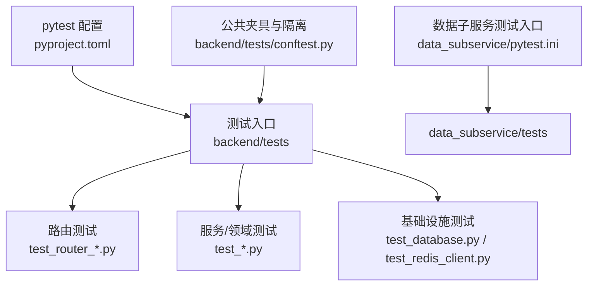
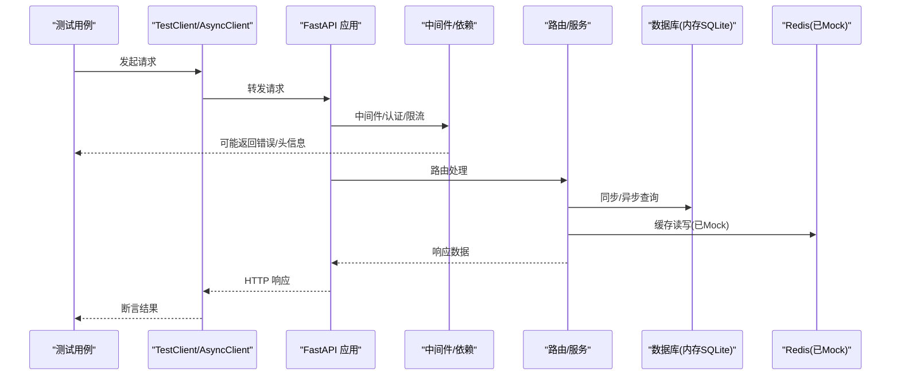
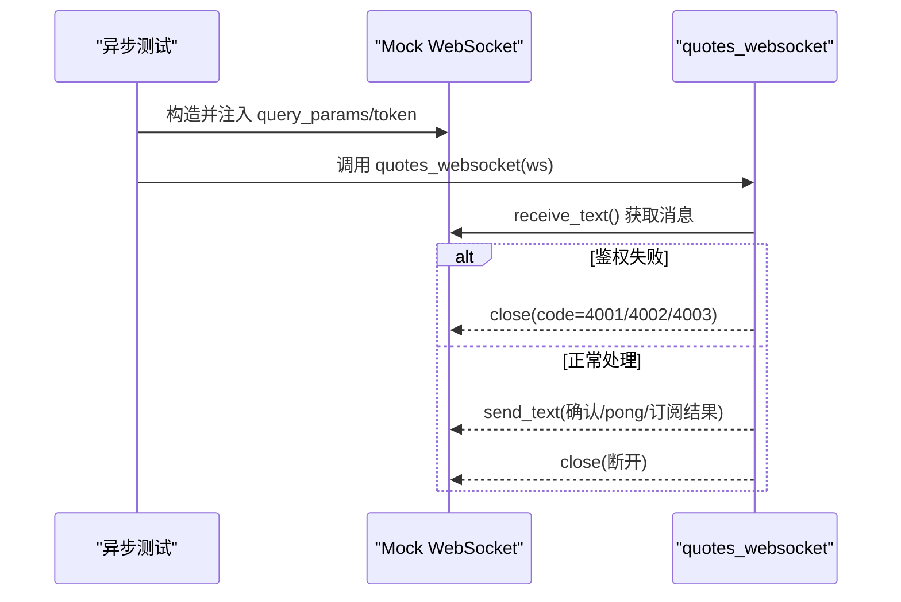
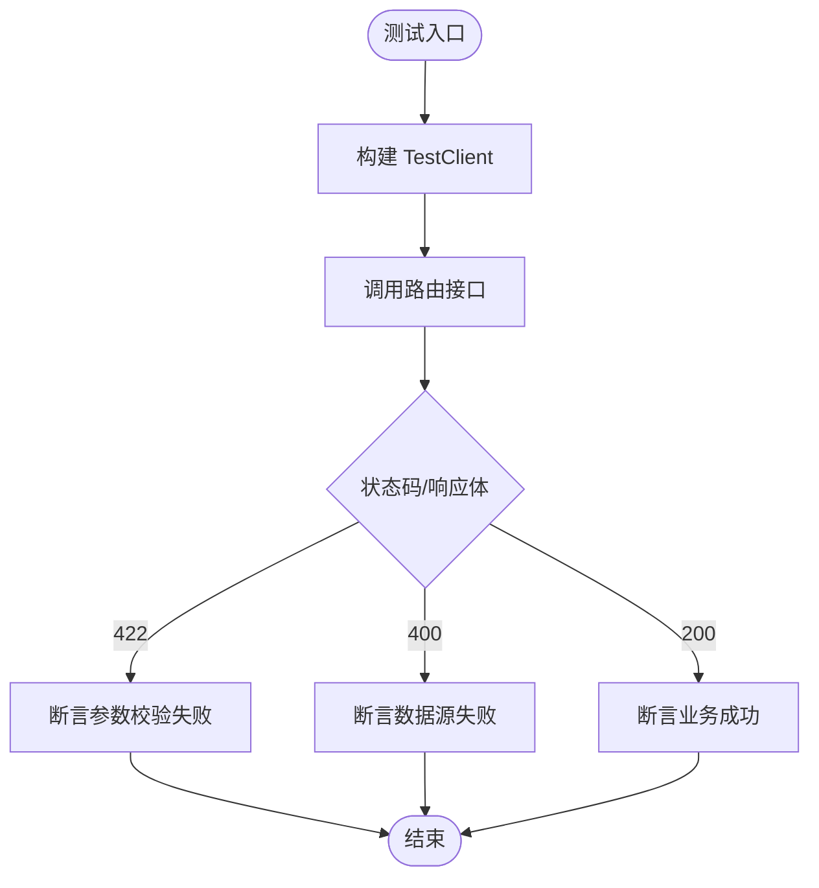
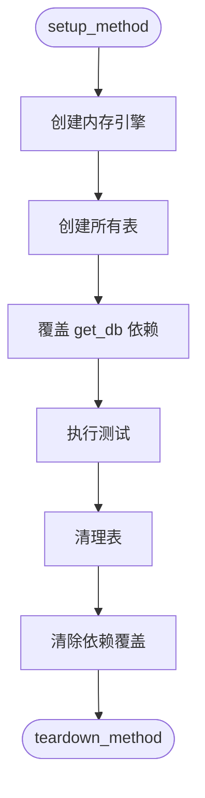
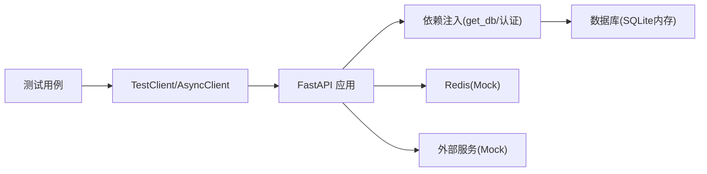

# 后端单元测试规范

<cite>
**本文引用的文件**
- [backend/tests/conftest.py](file://backend/tests/conftest.py)
- [pyproject.toml](file://pyproject.toml)
- [data_subservice/pytest.ini](file://data_subservice/pytest.ini)
- [backend/tests/test_auth.py](file://backend/tests/test_auth.py)
- [backend/tests/test_database.py](file://backend/tests/test_database.py)
- [backend/tests/test_redis_client.py](file://backend/tests/test_redis_client.py)
- [backend/tests/test_router_backtest.py](file://backend/tests/test_router_backtest.py)
- [backend/tests/test_market_websocket_auth.py](file://backend/tests/test_market_websocket_auth.py)
</cite>

## 目录
1. [简介](#简介)
2. [项目结构](#项目结构)
3. [核心组件](#核心组件)
4. [架构总览](#架构总览)
5. [详细组件分析](#详细组件分析)
6. [依赖关系分析](#依赖关系分析)
7. [性能考虑](#性能考虑)
8. [故障排查指南](#故障排查指南)
9. [结论](#结论)
10. [附录](#附录)

## 简介
本规范面向 Quant Agent 后端 Python 单元测试，基于 pytest 框架与 FastAPI 生态，覆盖测试组织、conftest 配置、fixture 模式、异步测试（asyncio、异步数据库、WebSocket）、API 路由测试、数据库测试策略、外部依赖 Mock、业务/服务/领域模型测试示例，以及性能测试、并发测试与覆盖率要求。目标是提供一套可执行、可维护、可扩展的测试标准，帮助开发者高质量地编写和运行后端单测。

## 项目结构
- 测试根路径：backend/tests
- 数据子服务独立测试：data_subservice/tests（由 data_subservice/pytest.ini 驱动）
- 测试配置：pyproject.toml 中 [tool.pytest.ini_options] 与 [tool.coverage.*]
- 公共夹具与全局隔离：backend/tests/conftest.py
- 典型测试样例：认证、数据库、Redis、回测路由、WebSocket 鉴权等

图表来源
- [pyproject.toml:125-165](file://pyproject.toml#L125-L165)
- [data_subservice/pytest.ini:17-36](file://data_subservice/pytest.ini#L17-L36)
- [backend/tests/conftest.py:24-33](file://backend/tests/conftest.py#L24-L33)

章节来源
- [pyproject.toml:125-165](file://pyproject.toml#L125-L165)
- [data_subservice/pytest.ini:17-36](file://data_subservice/pytest.ini#L17-L36)
- [backend/tests/conftest.py:24-33](file://backend/tests/conftest.py#L24-L33)

## 核心组件
- 测试运行器与标记
  - 使用 pytest 8+，启用 strict-markers、short traceback，禁用 unraisableexception 插件以避免误报。
  - 自定义标记：slow、integration、e2e、no_mock_external、asyncio；异步模式 auto。
- 环境变量与运行时
  - 强制 SQLite 内存库用于测试，降低 CI 复杂度；设置 Redis、JWT、嵌入模型等关键环境变量。
  - 通过 pytest-env 注入 NUMBA_CACHE_DIR，避免 IDE 安全删除导致的崩溃。
- 覆盖率
  - source=backend，并行合并，fail_under=80%，排除迁移、PB、启动脚本等低价值代码。
- 公共夹具
  - conftest.py 提供：事件循环、TestClient、Mock DB/Redis/HTTP、认证旁路、外部服务 Mock、引擎释放、熔断重置等。

章节来源
- [pyproject.toml:125-165](file://pyproject.toml#L125-L165)
- [pyproject.toml:167-207](file://pyproject.toml#L167-L207)
- [backend/tests/conftest.py:140-175](file://backend/tests/conftest.py#L140-L175)
- [backend/tests/conftest.py:177-268](file://backend/tests/conftest.py#L177-L268)
- [backend/tests/conftest.py:271-295](file://backend/tests/conftest.py#L271-L295)
- [backend/tests/conftest.py:355-375](file://backend/tests/conftest.py#L355-L375)
- [backend/tests/conftest.py:585-679](file://backend/tests/conftest.py#L585-L679)

## 架构总览
下图展示测试到应用的路径：测试通过 TestClient/AsyncClient 调用 FastAPI 应用，经过中间件与依赖注入，进入路由与服务层，必要时访问数据库与缓存。conftest 在导入阶段完成关键 Mock 与环境准备，确保测试隔离与稳定。

图表来源
- [backend/tests/conftest.py:355-375](file://backend/tests/conftest.py#L355-L375)
- [backend/tests/conftest.py:177-268](file://backend/tests/conftest.py#L177-L268)
- [backend/tests/test_auth.py:33-77](file://backend/tests/test_auth.py#L33-L77)

## 详细组件分析

### 测试组织与 conftest 最佳实践
- 文件命名与分类
  - 路由测试：test_router_*.py
  - 服务/领域测试：test_*.py（按模块或特性分组）
  - 基础设施测试：test_database.py、test_redis_client.py
- conftest.py 职责
  - 注册自定义标记（live_network、contract_replay）
  - 统一事件循环与异步支持
  - 强制 SQLite 环境并设置必要环境变量
  - 自动 Mock Redis、外部服务、Futu/YFinance
  - 提供 TestClient、Mock DB/HTTP、用户与行情数据工厂
  - 为新增鉴权前缀提供测试期鉴权旁路，避免大量 401
  - 跟踪并释放 SQLAlchemy 引擎，消除资源警告
  - 重置全局熔断单例，保证测试隔离

章节来源
- [backend/tests/conftest.py:24-33](file://backend/tests/conftest.py#L24-L33)
- [backend/tests/conftest.py:36-98](file://backend/tests/conftest.py#L36-L98)
- [backend/tests/conftest.py:100-137](file://backend/tests/conftest.py#L100-L137)
- [backend/tests/conftest.py:140-175](file://backend/tests/conftest.py#L140-L175)
- [backend/tests/conftest.py:177-268](file://backend/tests/conftest.py#L177-L268)
- [backend/tests/conftest.py:271-295](file://backend/tests/conftest.py#L271-L295)
- [backend/tests/conftest.py:355-375](file://backend/tests/conftest.py#L355-L375)
- [backend/tests/conftest.py:585-679](file://backend/tests/conftest.py#L585-L679)

### Fixture 使用模式
- 通用 fixture
  - mock_db、mock_async_db：模拟同步/异步数据库会话
  - mock_redis：模拟 Redis 客户端（含 pipeline、pubsub）
  - mock_httpx：模拟异步 HTTP 客户端
  - test_client、async_test_client：FastAPI 同步/异步测试客户端
  - mock_user、admin_user、auth_headers：认证相关数据
  - sample_quote、sample_klines、sample_order、sample_position：行情/订单/持仓示例
  - factory：测试数据工厂，快速生成结构化数据
- 自动 fixture
  - _reset_circuit_breaker：每个测试前后重置熔断状态
  - _dispose_db_engines_on_teardown：会话结束统一释放引擎
  - _mock_redis_globals：动态 patch 已知模块中的 redis 引用
  - _mock_external_services：默认 Mock 外部数据源，可通过 no_mock_external 跳过
  - _auth_bypass_for_tests：对指定前缀路由提供假用户旁路

章节来源
- [backend/tests/conftest.py:298-353](file://backend/tests/conftest.py#L298-L353)
- [backend/tests/conftest.py:379-485](file://backend/tests/conftest.py#L379-L485)
- [backend/tests/conftest.py:499-582](file://backend/tests/conftest.py#L499-L582)
- [backend/tests/conftest.py:75-98](file://backend/tests/conftest.py#L75-L98)
- [backend/tests/conftest.py:193-268](file://backend/tests/conftest.py#L193-L268)
- [backend/tests/conftest.py:275-295](file://backend/tests/conftest.py#L275-L295)
- [backend/tests/conftest.py:600-679](file://backend/tests/conftest.py#L600-L679)

### 异步测试编写方法
- asyncio 模式
  - 使用 @pytest.mark.asyncio 或 pytest-asyncio auto 模式
  - 通过 async_test_client 进行异步 HTTP 调用
- 异步数据库操作测试
  - 使用 create_async_engine + AsyncSessionLocal，结合 get_async_db 生成器
  - 验证 sessionmaker 配置（expire_on_commit=False）
- WebSocket 连接测试
  - 直接构造 AsyncMock 的 WebSocket 对象，模拟 receive_text/send_text/close
  - 覆盖鉴权失败分支（无 token、无效 token、payload 无 sub）与消息处理分支（未知 action、ping、订阅/取消订阅）

图表来源
- [backend/tests/test_market_websocket_auth.py:23-35](file://backend/tests/test_market_websocket_auth.py#L23-L35)
- [backend/tests/test_market_websocket_auth.py:54-111](file://backend/tests/test_market_websocket_auth.py#L54-L111)
- [backend/tests/test_market_websocket_auth.py:113-193](file://backend/tests/test_market_websocket_auth.py#L113-L193)

章节来源
- [backend/tests/test_database.py:83-91](file://backend/tests/test_database.py#L83-L91)
- [backend/tests/test_database.py:114-128](file://backend/tests/test_database.py#L114-L128)
- [backend/tests/test_market_websocket_auth.py:54-111](file://backend/tests/test_market_websocket_auth.py#L54-L111)
- [backend/tests/test_market_websocket_auth.py:113-193](file://backend/tests/test_market_websocket_auth.py#L113-L193)

### API 路由测试完整示例
- 认证路由测试
  - 使用内存 SQLite 与 StaticPool，创建表并覆盖 get_db 依赖
  - 覆盖登录缺失凭据、错误凭据、刷新 Token 无 Cookie、未认证获取当前用户、未认证登出等场景
- 回测路由测试
  - 参数校验（缺少 ticker 返回 422）
  - 异常路径（所有数据源失败返回 400）
  - 正常路径（内置策略/动态策略成功）
  - 异常路径（动态策略执行抛异常返回 error）
- 响应验证
  - 使用统一响应封装剥离函数，断言 status/data/msg 字段

图表来源
- [backend/tests/test_auth.py:33-77](file://backend/tests/test_auth.py#L33-L77)
- [backend/tests/test_auth.py:79-118](file://backend/tests/test_auth.py#L79-L118)
- [backend/tests/test_router_backtest.py:25-80](file://backend/tests/test_router_backtest.py#L25-L80)
- [backend/tests/test_router_backtest.py:81-153](file://backend/tests/test_router_backtest.py#L81-L153)

章节来源
- [backend/tests/test_auth.py:33-118](file://backend/tests/test_auth.py#L33-L118)
- [backend/tests/test_router_backtest.py:25-153](file://backend/tests/test_router_backtest.py#L25-L153)

### 数据库测试策略
- 会话与引擎
  - 同步：create_engine("sqlite:///:memory:") + StaticPool，sessionmaker 绑定引擎
  - 异步：create_async_engine("sqlite+aiosqlite:///:memory:") + async_sessionmaker
- 依赖覆盖
  - 通过 app.dependency_overrides[get_db] 注入测试会话
- 事务与清理
  - 使用 Base.metadata.create_all/drop_all 管理表生命周期
  - conftest 统一登记并 dispose 引擎，避免资源泄漏
- 配置验证
  - 从环境变量读取池大小与超时，验证默认值

图表来源
- [backend/tests/test_auth.py:33-77](file://backend/tests/test_auth.py#L33-L77)
- [backend/tests/test_database.py:69-91](file://backend/tests/test_database.py#L69-L91)
- [backend/tests/test_database.py:93-128](file://backend/tests/test_database.py#L93-L128)
- [backend/tests/test_database.py:141-172](file://backend/tests/test_database.py#L141-L172)

章节来源
- [backend/tests/test_auth.py:33-77](file://backend/tests/test_auth.py#L33-L77)
- [backend/tests/test_database.py:69-172](file://backend/tests/test_database.py#L69-L172)
- [backend/tests/conftest.py:36-98](file://backend/tests/conftest.py#L36-L98)

### 外部依赖 Mock 策略
- Redis 客户端
  - 全局自动 fixture 动态 patch 已知模块中的 redis_client/l1_cached_redis/redis_batch_writer
  - 提供 AsyncMock 实现的 get/set/delete/exists/expire/incr/pipeline/pubsub 等方法
- HTTP 客户端
  - mock_httpx fixture 提供 AsyncMock 的 httpx 客户端，统一返回 200 与空 JSON
- 第三方服务
  - _mock_external_services 默认 Mock Futu/YFinance，可通过 no_mock_external 标记跳过
  - 针对 macOS 权限问题与 xdist 竞态，patch TimedRotatingFileHandler 与 os.makedirs

章节来源
- [backend/tests/conftest.py:177-268](file://backend/tests/conftest.py#L177-L268)
- [backend/tests/conftest.py:271-295](file://backend/tests/conftest.py#L271-L295)
- [backend/tests/conftest.py:100-137](file://backend/tests/conftest.py#L100-L137)
- [backend/tests/test_redis_client.py:31-59](file://backend/tests/test_redis_client.py#L31-L59)

### 业务逻辑、服务层、领域模型测试示例
- 业务逻辑
  - 回测路由：参数校验、数据加载失败、内置/动态策略执行、异常处理
- 服务层
  - Redis 批量写入：初始化、启动/停止、队列满触发刷新、超时刷新、异常打印
- 领域模型
  - 数据库 URL 检测、异步 URL 转换、sessionmaker 配置、Base 元数据存在性

章节来源
- [backend/tests/test_router_backtest.py:25-153](file://backend/tests/test_router_backtest.py#L25-L153)
- [backend/tests/test_redis_client.py:60-200](file://backend/tests/test_redis_client.py#L60-L200)
- [backend/tests/test_database.py:15-91](file://backend/tests/test_database.py#L15-L91)

## 依赖关系分析
- 测试与应用的耦合点
  - FastAPI 应用实例：通过 TestClient/AsyncClient 直接调用
  - 依赖注入：app.dependency_overrides 覆盖 get_db、认证依赖
  - 全局状态：熔断单例、Redis 客户端、外部服务连接
- 外部依赖
  - Redis：通过 conftest 全局 Mock，避免真实连接
  - HTTP：httpx 客户端被 Mock
  - 数据源：Futu/YFinance 默认 Mock，可按需关闭

图表来源
- [backend/tests/conftest.py:355-375](file://backend/tests/conftest.py#L355-L375)
- [backend/tests/conftest.py:177-268](file://backend/tests/conftest.py#L177-L268)
- [backend/tests/conftest.py:271-295](file://backend/tests/conftest.py#L271-L295)
- [backend/tests/test_auth.py:44-57](file://backend/tests/test_auth.py#L44-L57)

章节来源
- [backend/tests/conftest.py:355-375](file://backend/tests/conftest.py#L355-L375)
- [backend/tests/conftest.py:177-295](file://backend/tests/conftest.py#L177-L295)
- [backend/tests/test_auth.py:44-57](file://backend/tests/test_auth.py#L44-L57)

## 性能考虑
- 测试加速
  - bcrypt 成本因子降至 4，显著加快密码哈希测试
  - 关闭 chat router 模拟延迟
  - 使用内存 SQLite 与 StaticPool，减少 I/O 开销
- 并发测试
  - 启用 pytest-xdist 并行执行，配合 coverage parallel 合并
  - 注意 xdist 下目录创建竞态，已通过 patch os.makedirs 兜底
- 资源管理
  - 统一登记并 dispose SQLAlchemy 引擎，避免资源泄漏
  - 重置熔断单例，防止跨测试污染

章节来源
- [backend/tests/conftest.py:168-174](file://backend/tests/conftest.py#L168-L174)
- [backend/tests/conftest.py:36-98](file://backend/tests/conftest.py#L36-L98)
- [backend/tests/conftest.py:123-137](file://backend/tests/conftest.py#L123-L137)
- [pyproject.toml:191-195](file://pyproject.toml#L191-L195)

## 故障排查指南
- 常见问题
  - 未关闭数据库连接导致 ResourceWarning：通过 conftest 统一登记与 dispose 解决
  - Redis 连接超时：全局 Mock redis.asyncio.Redis，避免真实连接
  - 权限错误（macOS TCC/sandbox）：patch TimedRotatingFileHandler 降级为 StreamHandler
  - xdist 竞态创建目录：patch os.makedirs 忽略 FileExistsError
  - 认证 401：使用 _auth_bypass_for_tests 对指定前缀路由提供假用户
- 定位建议
  - 查看 conftest 自动 fixture 是否生效（autouse=True）
  - 检查依赖覆盖是否正确（dependency_overrides）
  - 确认环境变量是否设置（DATABASE_URL、REDIS_*、JWT_SECRET_KEY 等）

章节来源
- [backend/tests/conftest.py:36-98](file://backend/tests/conftest.py#L36-L98)
- [backend/tests/conftest.py:100-137](file://backend/tests/conftest.py#L100-L137)
- [backend/tests/conftest.py:177-268](file://backend/tests/conftest.py#L177-L268)
- [backend/tests/conftest.py:600-679](file://backend/tests/conftest.py#L600-L679)

## 结论
本规范基于现有仓库的测试实践，系统化梳理了 pytest 配置、conftest 设计、fixture 模式、异步测试、API 路由测试、数据库策略与外部依赖 Mock。遵循本规范可显著提升测试稳定性、可维护性与覆盖率，同时保障并发执行与性能优化。建议在新功能开发时同步补充对应测试，并严格满足覆盖率门槛。

## 附录
- 运行方式
  - 主工程：pytest -v --strict-markers --tb=short -p no:unraisableexception
  - 数据子服务：cd data_subservice && pytest -c pytest.ini
- 覆盖率报告
  - 生成 HTML：coverage html（输出目录 htmlcov）
  - 阈值：fail_under=80%

章节来源
- [pyproject.toml:125-165](file://pyproject.toml#L125-L165)
- [pyproject.toml:167-207](file://pyproject.toml#L167-L207)
- [data_subservice/pytest.ini:17-36](file://data_subservice/pytest.ini#L17-L36)