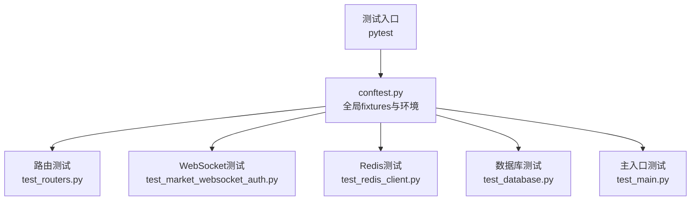
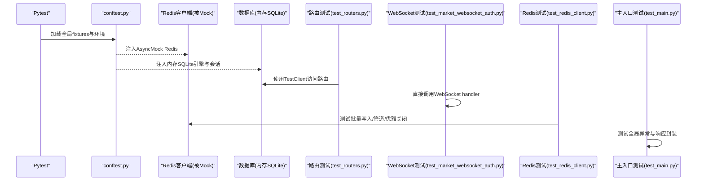
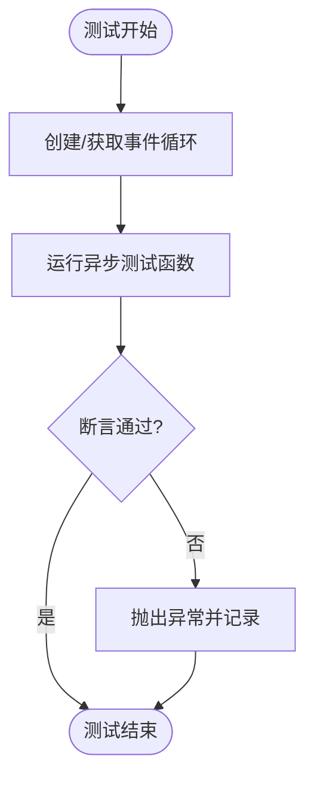
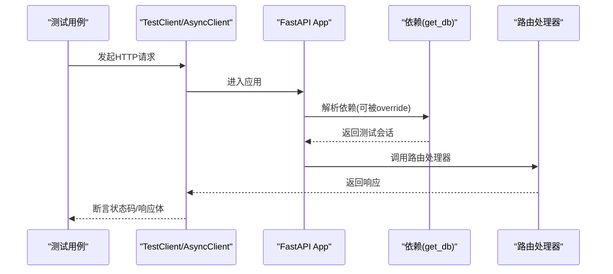
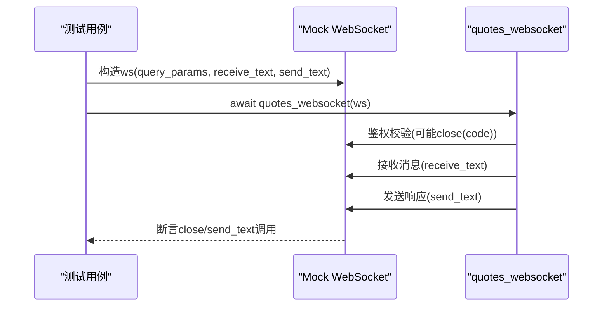
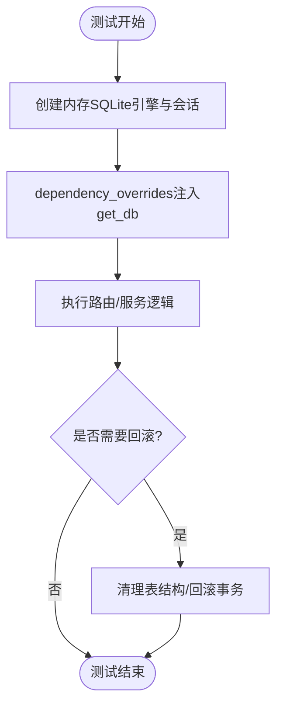
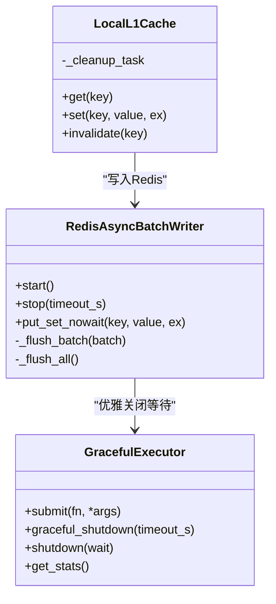
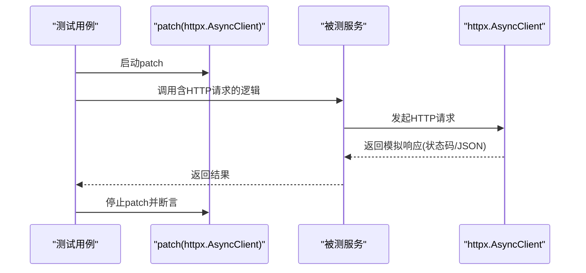
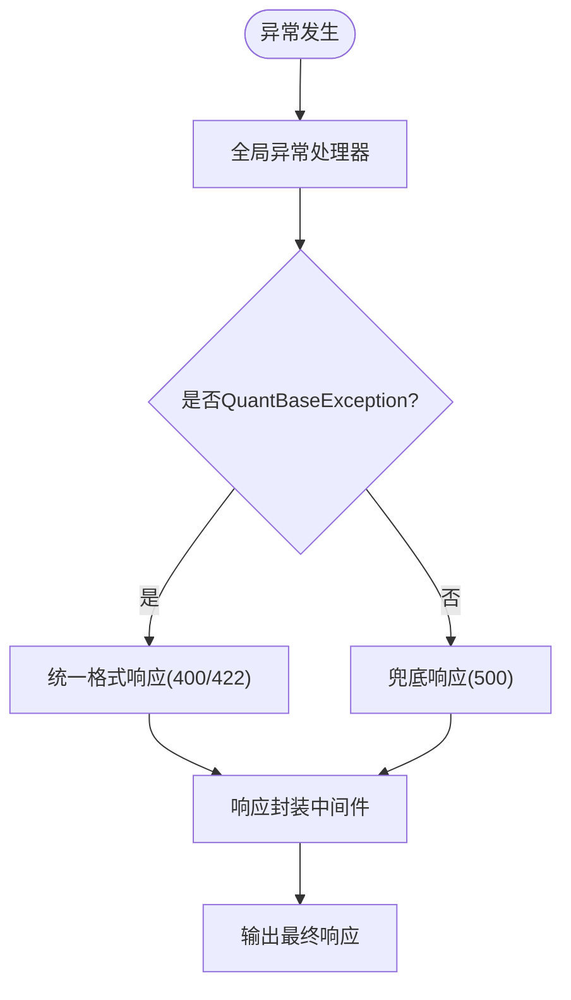
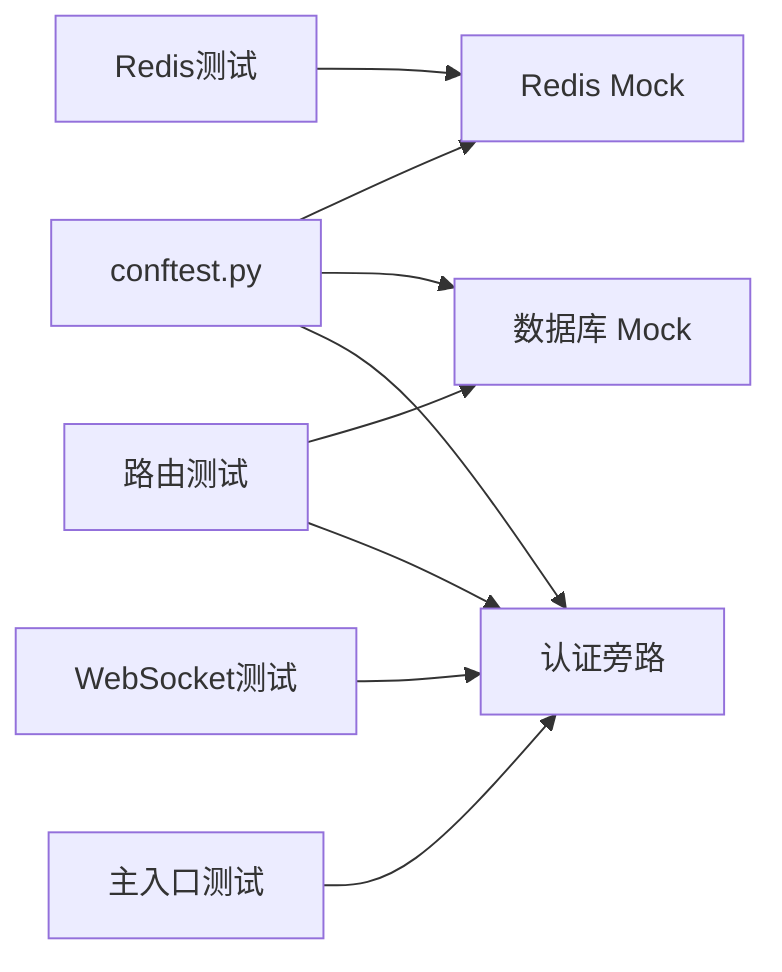

# 异步测试最佳实践

<cite>
**本文引用的文件**
- [backend/tests/conftest.py](file://backend/tests/conftest.py)
- [backend/tests/test_market_websocket_auth.py](file://backend/tests/test_market_websocket_auth.py)
- [backend/tests/test_redis_client.py](file://backend/tests/test_redis_client.py)
- [backend/tests/test_database.py](file://backend/tests/test_database.py)
- [backend/tests/test_routers.py](file://backend/tests/test_routers.py)
- [backend/tests/test_main.py](file://backend/tests/test_main.py)
</cite>

## 目录
1. [简介](#简介)
2. [项目结构](#项目结构)
3. [核心组件](#核心组件)
4. [架构总览](#架构总览)
5. [详细组件分析](#详细组件分析)
6. [依赖关系分析](#依赖关系分析)
7. [性能考虑](#性能考虑)
8. [故障排查指南](#故障排查指南)
9. [结论](#结论)
10. [附录](#附录)

## 简介
本指南面向 Quant Agent 项目的异步测试，聚焦以下目标：
- asyncio 测试环境搭建：事件循环管理、异步 fixture 配置、协程测试模式
- FastAPI 异步路由测试：TestClient 同步/异步使用、WebSocket 连接测试、SSE 流式响应测试
- 异步数据库操作测试：异步会话管理、事务回滚、并发安全验证
- 异步 Redis 操作测试：命令执行、管道操作、发布订阅模式
- 异步 HTTP 客户端测试：请求拦截、响应模拟、超时处理
- 性能测试与优化：异步 I/O 优化、并发测试、内存泄漏检测
- 提供可落地的异步代码测试最佳实践

## 项目结构
后端测试集中在 backend/tests 目录，采用 pytest + pytest-asyncio 组织。关键基础设施包括：
- conftest.py：全局 fixtures、环境变量、Redis/DB/外部服务 Mock、认证旁路等
- 路由层测试：覆盖鉴权、偏好设置、系统端点等
- WebSocket 测试：直接对 handler 进行断言，避免 TestClient 线程问题
- Redis 客户端测试：批量写入、本地 L1 缓存、优雅关闭、连接池配置
- 数据库配置测试：URL 转换、引擎与会话工厂、连接池参数
- 主入口测试：全局异常处理器、统一响应封装、CORS 与安全中间件

**图表来源**
- [backend/tests/conftest.py:140-175](file://backend/tests/conftest.py#L140-L175)
- [backend/tests/test_routers.py:20-46](file://backend/tests/test_routers.py#L20-L46)
- [backend/tests/test_market_websocket_auth.py:23-51](file://backend/tests/test_market_websocket_auth.py#L23-L51)
- [backend/tests/test_redis_client.py:31-59](file://backend/tests/test_redis_client.py#L31-L59)
- [backend/tests/test_database.py:69-127](file://backend/tests/test_database.py#L69-L127)
- [backend/tests/test_main.py:22-79](file://backend/tests/test_main.py#L22-L79)

**章节来源**
- [backend/tests/conftest.py:140-175](file://backend/tests/conftest.py#L140-L175)
- [backend/tests/test_routers.py:20-46](file://backend/tests/test_routers.py#L20-L46)

## 核心组件
- 事件循环与异步测试夹具
  - 为旧式测试提供独立事件循环 fixture，确保每个测试函数拥有独立 loop
  - 通过 pytest-asyncio 自动管理事件循环（Mode.AUTO），兼容显式 get_event_loop() 的旧用例
- 全局 Mock 与隔离
  - 在导入任何模块前 patch redis.asyncio.Redis，防止真实连接
  - 动态 patch 已知模块中的 redis_client/l1_cached_redis/redis_batch_writer 引用，保证测试隔离
  - 重置熔断器单例，避免跨测试污染
- 数据库与连接管理
  - 包装 create_engine/create_async_engine，统一登记并优雅 dispose，消除 ResourceWarning
  - 强制 SQLite 内存库，避免 CI 中 PostgreSQL 类型编译失败
- 认证旁路与测试数据
  - 针对新增鉴权的前缀路由提供假用户旁路，避免大量既有路由单测因缺少 Token 而 401
  - 提供示例行情/K线/订单/持仓/用户等测试数据工厂

**章节来源**
- [backend/tests/conftest.py:36-98](file://backend/tests/conftest.py#L36-L98)
- [backend/tests/conftest.py:100-175](file://backend/tests/conftest.py#L100-L175)
- [backend/tests/conftest.py:177-268](file://backend/tests/conftest.py#L177-L268)
- [backend/tests/conftest.py:297-375](file://backend/tests/conftest.py#L297-L375)
- [backend/tests/conftest.py:585-679](file://backend/tests/conftest.py#L585-L679)

## 架构总览
下图展示了异步测试从 pytest 到具体被测组件的调用链，以及关键 Mock 注入点。

**图表来源**
- [backend/tests/conftest.py:177-268](file://backend/tests/conftest.py#L177-L268)
- [backend/tests/test_routers.py:20-46](file://backend/tests/test_routers.py#L20-L46)
- [backend/tests/test_market_websocket_auth.py:23-51](file://backend/tests/test_market_websocket_auth.py#L23-L51)
- [backend/tests/test_redis_client.py:31-59](file://backend/tests/test_redis_client.py#L31-L59)
- [backend/tests/test_main.py:22-79](file://backend/tests/test_main.py#L22-L79)

## 详细组件分析

### 事件循环管理与异步 Fixture
- 事件循环
  - 为旧测试提供 function 级 event_loop fixture，创建/关闭独立循环
  - 兼容 pytest-asyncio Mode.AUTO，避免混用导致的循环冲突
- 异步测试模式
  - 使用 @pytest.mark.asyncio 标记协程测试
  - 通过 async def 测试函数与 AsyncMock 配合，验证异步行为

**图表来源**
- [backend/tests/conftest.py:140-150](file://backend/tests/conftest.py#L140-L150)
- [backend/tests/test_market_websocket_auth.py:57-111](file://backend/tests/test_market_websocket_auth.py#L57-L111)
- [backend/tests/test_redis_client.py:75-100](file://backend/tests/test_redis_client.py#L75-L100)

**章节来源**
- [backend/tests/conftest.py:140-150](file://backend/tests/conftest.py#L140-L150)

### FastAPI 异步路由测试
- 同步 TestClient
  - 使用 TestClient(app) 发起请求，适合简单同步场景
  - 通过 dependency_overrides 替换 get_db，使用内存 SQLite 会话
- 异步 TestClient
  - 使用 httpx.AsyncClient(app=app) 进行异步请求，适合需要并发或异步流的场景
- 认证旁路
  - 针对特定路由前缀绕过鉴权，便于快速集成测试

**图表来源**
- [backend/tests/test_routers.py:20-46](file://backend/tests/test_routers.py#L20-L46)
- [backend/tests/conftest.py:355-375](file://backend/tests/conftest.py#L355-L375)
- [backend/tests/conftest.py:585-679](file://backend/tests/conftest.py#L585-L679)

**章节来源**
- [backend/tests/test_routers.py:20-46](file://backend/tests/test_routers.py#L20-L46)
- [backend/tests/conftest.py:355-375](file://backend/tests/conftest.py#L355-L375)

### WebSocket 连接测试
- 策略
  - 直接构造 mock WebSocket 对象，避免 TestClient 线程管理问题
  - 通过 side_effect 模拟消息序列与断开事件
- 鉴权分支
  - 无 token、无效 token、token 无 sub 分别返回不同 close code
- 消息处理
  - ping/pong、subscribe/unsubscribe、非法 JSON、未知 action 等分支

**图表来源**
- [backend/tests/test_market_websocket_auth.py:23-51](file://backend/tests/test_market_websocket_auth.py#L23-L51)
- [backend/tests/test_market_websocket_auth.py:57-111](file://backend/tests/test_market_websocket_auth.py#L57-L111)
- [backend/tests/test_market_websocket_auth.py:113-234](file://backend/tests/test_market_websocket_auth.py#L113-L234)

**章节来源**
- [backend/tests/test_market_websocket_auth.py:57-111](file://backend/tests/test_market_websocket_auth.py#L57-L111)
- [backend/tests/test_market_websocket_auth.py:113-234](file://backend/tests/test_market_websocket_auth.py#L113-L234)

### SSE 流式响应测试
- 建议方法
  - 使用 httpx.AsyncClient 的 streaming 接口读取 Server-Sent Events
  - 逐条解析 data: 行，断言字段与顺序
  - 结合超时与重试策略，模拟网络抖动
- 注意事项
  - 确保服务端正确设置 Content-Type 与分隔符
  - 在测试中限制最大接收条数，避免无限流导致资源耗尽

[本节为概念性说明，不直接分析具体文件]

### 异步数据库操作测试
- 会话管理
  - 使用内存 SQLite 与 StaticPool，避免多线程竞争
  - 通过 dependency_overrides 注入测试会话，确保每个测试隔离
- 事务回滚
  - 在每个测试结束后清理表结构，或使用事务包裹后回滚
- 并发安全
  - 使用 check_same_thread=False 与 StaticPool，确保多线程安全
  - 通过包装引擎创建与 dispose，避免连接泄漏

**图表来源**
- [backend/tests/test_routers.py:29-46](file://backend/tests/test_routers.py#L29-L46)
- [backend/tests/test_database.py:69-127](file://backend/tests/test_database.py#L69-L127)

**章节来源**
- [backend/tests/test_routers.py:29-46](file://backend/tests/test_routers.py#L29-L46)
- [backend/tests/test_database.py:69-127](file://backend/tests/test_database.py#L69-L127)

### 异步 Redis 操作测试
- 命令执行
  - 使用 AsyncMock 模拟 get/set/delete/exists/expire/hget/hset/hgetall/publish/xadd/xread
  - 通过 side_effect 控制返回值，验证业务分支
- 管道操作
  - 模拟 pipeline 的 __aenter__/__aexit__/execute，验证批量写入
- 发布订阅
  - 模拟 pubsub 的 subscribe/get_message/unsubscribe/close，验证消息流
- 批量写入器
  - 测试 start/stop、队列满触发 flush、超时触发 flush、取消任务时刷新剩余数据
- 本地 L1 缓存
  - 测试命中/未命中/过期/容量保护/失效/后台清理任务

**图表来源**
- [backend/tests/test_redis_client.py:31-59](file://backend/tests/test_redis_client.py#L31-L59)
- [backend/tests/test_redis_client.py:118-249](file://backend/tests/test_redis_client.py#L118-L249)
- [backend/tests/test_redis_client.py:251-409](file://backend/tests/test_redis_client.py#L251-L409)
- [backend/tests/test_redis_client.py:434-495](file://backend/tests/test_redis_client.py#L434-L495)
- [backend/tests/test_redis_client.py:497-549](file://backend/tests/test_redis_client.py#L497-L549)

**章节来源**
- [backend/tests/test_redis_client.py:31-59](file://backend/tests/test_redis_client.py#L31-L59)
- [backend/tests/test_redis_client.py:118-249](file://backend/tests/test_redis_client.py#L118-L249)
- [backend/tests/test_redis_client.py:251-409](file://backend/tests/test_redis_client.py#L251-L409)
- [backend/tests/test_redis_client.py:434-495](file://backend/tests/test_redis_client.py#L434-L495)
- [backend/tests/test_redis_client.py:497-549](file://backend/tests/test_redis_client.py#L497-L549)

### 异步 HTTP 客户端测试
- 请求拦截
  - 使用 unittest.mock.patch 拦截 httpx.AsyncClient 的 get/post/put/delete
  - 通过 side_effect 模拟不同响应（成功、错误、超时）
- 响应模拟
  - 构造 MagicMock response，设置 status_code/json/text
- 超时处理
  - 在测试中设置较短超时，验证超时分支与重试逻辑

**图表来源**
- [backend/tests/conftest.py:339-353](file://backend/tests/conftest.py#L339-L353)

**章节来源**
- [backend/tests/conftest.py:339-353](file://backend/tests/conftest.py#L339-L353)

### 全局异常与响应封装测试
- 全局异常处理器
  - 验证 QuantBaseException 转换为统一格式，包含 code/msg/data
  - 验证 Pydantic 校验失败返回 422，兜底异常返回 500
- 响应封装中间件
  - 旧式响应自动包装为新格式，已有 code 字段的响应直接放行
- 安全中间件
  - 验证 CORS 预检请求返回允许的头

**图表来源**
- [backend/tests/test_main.py:22-79](file://backend/tests/test_main.py#L22-L79)
- [backend/tests/test_main.py:81-128](file://backend/tests/test_main.py#L81-L128)

**章节来源**
- [backend/tests/test_main.py:22-79](file://backend/tests/test_main.py#L22-L79)
- [backend/tests/test_main.py:81-128](file://backend/tests/test_main.py#L81-L128)

## 依赖关系分析
- 低耦合高内聚
  - 路由测试通过 dependency_overrides 解耦数据库依赖
  - Redis 测试通过 AsyncMock 解耦真实 Redis 连接
  - WebSocket 测试直接调用 handler，避免框架层耦合
- 外部依赖隔离
  - 全局 patch redis.asyncio.Redis，防止导入时建立真实连接
  - 动态 patch 已知模块中的 redis_client/l1_cached_redis/redis_batch_writer，确保测试隔离
- 潜在循环依赖
  - 通过延迟导入与 patch 时机控制，避免模块导入时的副作用

**图表来源**
- [backend/tests/conftest.py:177-268](file://backend/tests/conftest.py#L177-L268)
- [backend/tests/test_routers.py:20-46](file://backend/tests/test_routers.py#L20-L46)
- [backend/tests/test_market_websocket_auth.py:23-51](file://backend/tests/test_market_websocket_auth.py#L23-L51)
- [backend/tests/test_redis_client.py:31-59](file://backend/tests/test_redis_client.py#L31-L59)
- [backend/tests/test_main.py:22-79](file://backend/tests/test_main.py#L22-L79)

**章节来源**
- [backend/tests/conftest.py:177-268](file://backend/tests/conftest.py#L177-L268)

## 性能考虑
- 异步 I/O 优化
  - 使用 httpx.AsyncClient 进行并发请求，减少阻塞
  - 合理设置超时与重试，避免长时间占用事件循环
- 并发测试
  - 使用 asyncio.gather 并发执行多个异步任务，验证竞态条件
  - 通过 Semaphore 限制并发度，避免资源耗尽
- 内存泄漏检测
  - 监控 Redis 批量写入器的队列长度与任务完成状态
  - 使用 memory_profiler 或 tracemalloc 检测内存增长
- 连接池配置
  - 调整 DB_POOL_SIZE、DB_MAX_OVERFLOW、REDIS_MAX_CONNECTIONS，平衡吞吐与资源占用

[本节为通用指导，不直接分析具体文件]

## 故障排查指南
- 常见错误
  - 未关闭数据库连接：通过包装 create_engine/create_async_engine 统一 dispose
  - Redis 连接超时：在导入前 patch redis.asyncio.Redis，避免真实连接
  - 认证失败：检查认证旁路是否生效，确认路由前缀匹配
- 调试技巧
  - 使用 capsys 捕获日志输出，验证错误信息
  - 通过 side_effect 精确控制 Mock 行为，定位分支问题
- 恢复策略
  - 测试前后重置熔断器、清理表结构、关闭后台任务

**章节来源**
- [backend/tests/conftest.py:36-98](file://backend/tests/conftest.py#L36-L98)
- [backend/tests/conftest.py:177-268](file://backend/tests/conftest.py#L177-L268)
- [backend/tests/test_redis_client.py:118-249](file://backend/tests/test_redis_client.py#L118-L249)

## 结论
本项目通过完善的 fixtures、Mock 策略与隔离机制，构建了稳定高效的异步测试体系。开发者应遵循以下最佳实践：
- 使用 pytest-asyncio 管理事件循环，避免混用旧式 get_event_loop()
- 通过 dependency_overrides 解耦外部依赖，确保测试隔离
- 对 Redis/HTTP/WebSocket 等异步组件使用 AsyncMock，精确控制行为
- 关注连接池与超时配置，平衡性能与稳定性
- 定期执行并发测试与内存泄漏检测，保障长期维护质量

[本节为总结性内容，不直接分析具体文件]

## 附录
- 参考文件
  - [backend/tests/conftest.py](file://backend/tests/conftest.py)
  - [backend/tests/test_market_websocket_auth.py](file://backend/tests/test_market_websocket_auth.py)
  - [backend/tests/test_redis_client.py](file://backend/tests/test_redis_client.py)
  - [backend/tests/test_database.py](file://backend/tests/test_database.py)
  - [backend/tests/test_routers.py](file://backend/tests/test_routers.py)
  - [backend/tests/test_main.py](file://backend/tests/test_main.py)

[本节为索引性内容，不直接分析具体文件]
