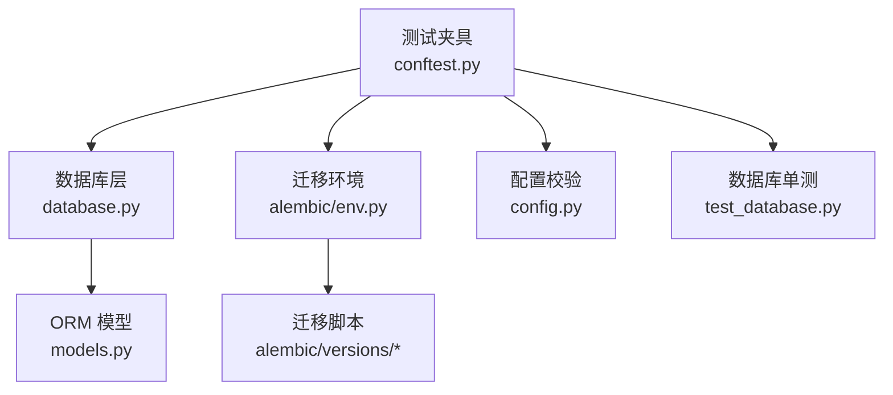
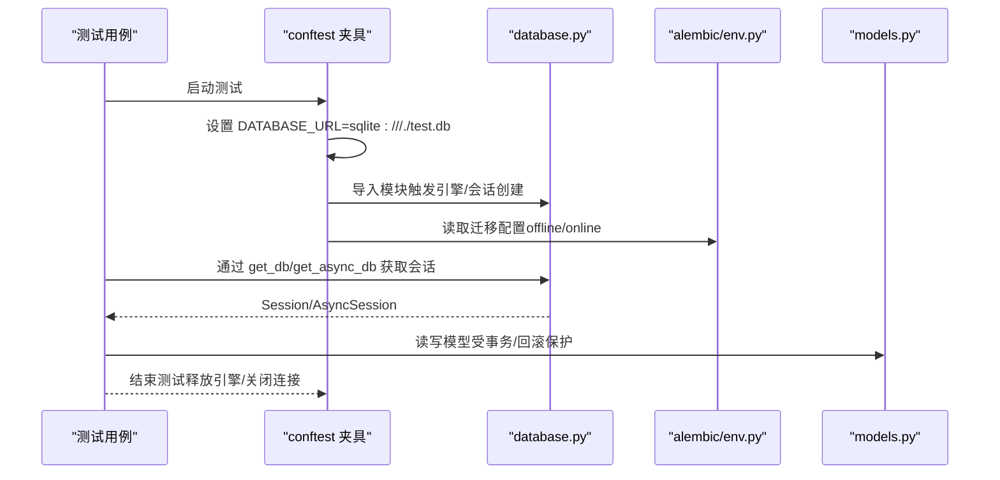
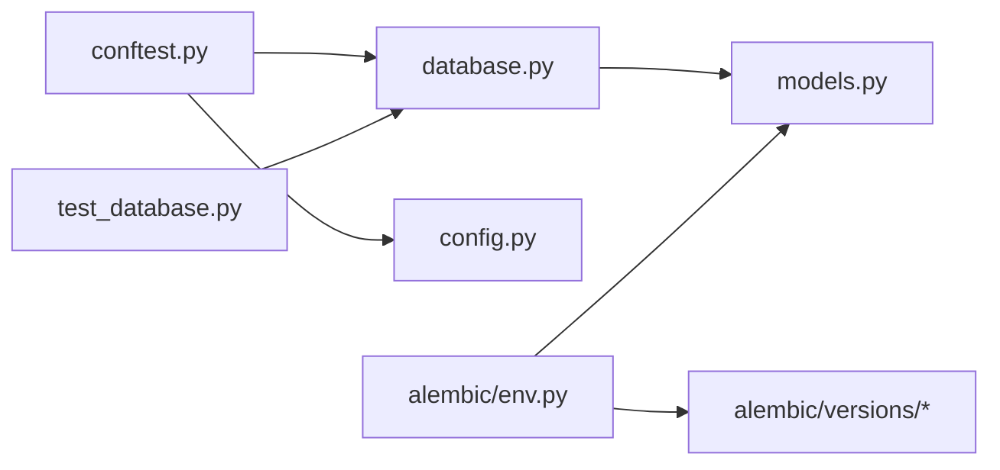

# 数据库测试策略

<cite>
**本文引用的文件**
- [backend/core/database.py](file://backend/core/database.py)
- [backend/tests/conftest.py](file://backend/tests/conftest.py)
- [backend/core/models.py](file://backend/core/models.py)
- [backend/alembic/env.py](file://backend/alembic/env.py)
- [backend/alembic/versions/ai04rag_add_rag_governance.py](file://backend/alembic/versions/ai04rag_add_rag_governance.py)
- [backend/tests/test_database.py](file://backend/tests/test_database.py)
- [backend/core/config.py](file://backend/core/config.py)
</cite>

## 目录
1. [简介](#简介)
2. [项目结构](#项目结构)
3. [核心组件](#核心组件)
4. [架构总览](#架构总览)
5. [详细组件分析](#详细组件分析)
6. [依赖关系分析](#依赖关系分析)
7. [性能考虑](#性能考虑)
8. [故障排查指南](#故障排查指南)
9. [结论](#结论)
10. [附录](#附录)

## 简介
本策略文档面向 Quant Agent 后端，围绕 SQLAlchemy 与 Alembic 的数据库测试给出完整方案。重点覆盖：
- 测试会话配置：测试数据库选择、连接池管理、事务回滚机制
- 测试数据准备：工厂模式、种子数据、数据集管理
- 异步数据库操作测试：异步会话使用、并发查询、锁竞争处理
- ORM 模型测试：关系验证、约束测试、查询性能测试
- 迁移测试：版本兼容性、数据完整性、回滚测试
- 性能测试：慢查询检测、索引优化验证、连接泄漏检测
- 最佳实践与质量保证清单

## 项目结构
本项目在 backend 下提供统一的数据库层（同步/异步引擎与会话）、ORM 模型定义、Alembic 迁移环境，以及集中式的 pytest fixtures 与测试用例。关键路径如下：
- 数据库层：backend/core/database.py
- ORM 模型：backend/core/models.py
- 迁移环境：backend/alembic/env.py 与 alembic/versions/*.py
- 测试夹具与全局隔离：backend/tests/conftest.py
- 数据库配置校验：backend/core/config.py
- 数据库相关单测：backend/tests/test_database.py

图表来源
- [backend/tests/conftest.py:24-175](file://backend/tests/conftest.py#L24-L175)
- [backend/core/database.py:1-67](file://backend/core/database.py#L1-L67)
- [backend/core/models.py:1-495](file://backend/core/models.py#L1-L495)
- [backend/alembic/env.py:1-80](file://backend/alembic/env.py#L1-L80)
- [backend/core/config.py:20-134](file://backend/core/config.py#L20-L134)
- [backend/tests/test_database.py:1-172](file://backend/tests/test_database.py#L1-L172)

章节来源
- [backend/core/database.py:1-67](file://backend/core/database.py#L1-L67)
- [backend/tests/conftest.py:24-175](file://backend/tests/conftest.py#L24-L175)
- [backend/core/models.py:1-495](file://backend/core/models.py#L1-L495)
- [backend/alembic/env.py:1-80](file://backend/alembic/env.py#L1-L80)
- [backend/core/config.py:20-134](file://backend/core/config.py#L20-L134)
- [backend/tests/test_database.py:1-172](file://backend/tests/test_database.py#L1-L172)

## 核心组件
- 数据库层（同步/异步）
  - 根据环境变量 DATABASE_URL 自动选择 SQLite 或 PostgreSQL/MySQL，并创建同步引擎与异步引擎
  - 非 SQLite 场景启用连接池参数（pool_size、max_overflow、pool_timeout、pool_recycle、pool_pre_ping）
  - 提供 get_db 与 get_async_db 生成器用于请求级会话注入
- ORM 模型
  - 统一 Base 声明式基类；包含用户、订单、审计日志、纸面组合、策略版本、前端日志等模型
  - 向量字段兼容 SQLite（LargeBinary）与 PostgreSQL（pgvector），并提供 HNSW 索引
- 迁移环境
  - 从 .env 加载 DATABASE_URL，导入所有模型以支持 autogenerate
  - 提供 offline/online 两种运行模式
- 测试夹具
  - 强制测试环境使用 SQLite 内存/文件库，避免 CI 中 pgvector 类型编译失败
  - 包装 create_engine/create_async_engine 以追踪并释放引擎，消除资源警告
  - 自动重置熔断器、Mock Redis/Futu/yfinance 等外部依赖
  - 为新增鉴权路由提供测试旁路，确保测试可独立运行
- 配置校验
  - Pydantic Settings 校验 DATABASE_URL 格式与必填项，fail-fast

章节来源
- [backend/core/database.py:1-67](file://backend/core/database.py#L1-L67)
- [backend/core/models.py:1-495](file://backend/core/models.py#L1-L495)
- [backend/alembic/env.py:1-80](file://backend/alembic/env.py#L1-L80)
- [backend/tests/conftest.py:24-175](file://backend/tests/conftest.py#L24-L175)
- [backend/core/config.py:20-134](file://backend/core/config.py#L20-L134)

## 架构总览
下图展示测试执行时，夹具如何接管数据库与外部依赖，并通过会话访问模型与迁移。

图表来源
- [backend/tests/conftest.py:155-175](file://backend/tests/conftest.py#L155-L175)
- [backend/core/database.py:1-67](file://backend/core/database.py#L1-L67)
- [backend/alembic/env.py:37-79](file://backend/alembic/env.py#L37-L79)
- [backend/core/models.py:1-495](file://backend/core/models.py#L1-L495)

## 详细组件分析

### 测试会话配置（数据库选择、连接池、事务回滚）
- 测试数据库选择
  - conftest 强制设置 DATABASE_URL 指向 SQLite 文件库，避免 pgvector 在 SQLite 上编译失败
  - database.py 根据 URL 前缀区分 SQLite 与非 SQLite，SQLite 使用 connect_args 禁用线程检查
- 连接池管理
  - 非 SQLite 引擎启用 pool_size、max_overflow、pool_timeout、pool_recycle、pool_pre_ping
  - conftest 包装 create_engine/create_async_engine，收集所有引擎并在会话结束时 dispose，防止连接泄漏
- 事务回滚机制
  - 当前未提供基于事务包裹每个测试的 fixture；建议采用“每个测试开启事务，结束后回滚”的模式，保证测试间数据隔离
  - 对于 SQLite 文件库，可在测试前后重建表或使用内存库；对于 PG/MySQL，建议使用事务+回滚提升速度

章节来源
- [backend/tests/conftest.py:36-98](file://backend/tests/conftest.py#L36-L98)
- [backend/tests/conftest.py:155-175](file://backend/tests/conftest.py#L155-L175)
- [backend/core/database.py:7-27](file://backend/core/database.py#L7-L27)
- [backend/core/database.py:40-67](file://backend/core/database.py#L40-L67)

### 测试数据准备策略（工厂、种子、数据集管理）
- 工厂模式
  - conftest 提供 TestDataFactory，集中生成行情、K线、订单、持仓、用户等数据结构，便于复用与扩展
- 种子数据
  - 建议在测试夹具中按需提供最小必要种子（如用户、策略、组合），避免全量初始化导致缓慢
- 数据集管理
  - 针对复杂场景（如纸面组合流水、净值快照），可使用固定 JSON 种子 + 增量构造的方式
  - 对向量检索场景，准备少量带 embedding 的样例数据，验证 HNSW 索引行为

章节来源
- [backend/tests/conftest.py:499-583](file://backend/tests/conftest.py#L499-L583)
- [backend/core/models.py:331-479](file://backend/core/models.py#L331-L479)

### 异步数据库操作测试（异步会话、并发查询、锁竞争）
- 异步会话使用
  - database.py 提供 AsyncSessionLocal 与 get_async_db，测试中使用 async with 或 async for 获取会话
  - test_database.py 演示了异步 sessionmaker 配置与 get_async_db 的断言
- 并发查询测试
  - 使用 asyncio.gather 或任务队列发起并发查询，验证在高并发下的正确性与稳定性
  - 注意 SQLite 并发写入限制，必要时切换至内存库或 PG 并发测试
- 锁竞争处理
  - 对写多读多的场景，优先使用事务边界控制与幂等写入
  - 结合 pool_pre_ping 与合理的 pool_recycle 降低连接失效风险

章节来源
- [backend/core/database.py:40-67](file://backend/core/database.py#L40-L67)
- [backend/tests/test_database.py:83-128](file://backend/tests/test_database.py#L83-L128)

### ORM 模型测试（关系、约束、查询性能）
- 关系验证
  - 验证 User 与 UserPreference、PaperPortfolio 与其 fills/positions/nav_daily 的级联删除与引用完整性
- 约束测试
  - 唯一性约束（如 order_id、session_id、strategy_version code_hash）
  - 非空与类型约束（数值、日期、JSON）
- 查询性能测试
  - 对高频查询建立复合索引（如 market+created_at、portfolio_id+fill_seq）
  - 使用 EXPLAIN 或等价手段验证查询计划，确保走索引
  - 向量检索场景验证 HNSW 索引构建与召回率

章节来源
- [backend/core/models.py:37-75](file://backend/core/models.py#L37-L75)
- [backend/core/models.py:269-294](file://backend/core/models.py#L269-L294)
- [backend/core/models.py:351-394](file://backend/core/models.py#L351-L394)
- [backend/core/models.py:401-479](file://backend/core/models.py#L401-L479)
- [backend/core/models.py:199-257](file://backend/core/models.py#L199-L257)

### 数据库迁移测试（版本兼容、数据完整性、回滚）
- 版本兼容性
  - 迁移脚本需兼容 SQLite 测试环境（如 ai04rag 迁移中对表存在性检查）
- 数据完整性验证
  - 升级后校验新增字段默认值、索引是否生效
  - 对历史数据做抽样校验（如 JSON 字段、时间戳）
- 回滚测试
  - 对 downgrade 路径进行验证，确保字段/索引可安全移除
  - 在 SQLite 环境下特别注意降级逻辑的健壮性

章节来源
- [backend/alembic/env.py:37-79](file://backend/alembic/env.py#L37-L79)
- [backend/alembic/versions/ai04rag_add_rag_governance.py:19-55](file://backend/alembic/versions/ai04rag_add_rag_governance.py#L19-L55)

### 性能测试考虑（慢查询、索引优化、连接泄漏）
- 慢查询检测
  - 记录慢请求与事件循环卡顿日志（performance_logs），在测试中注入阈值并断言
- 索引优化验证
  - 对热点查询建立合适索引，验证执行计划
  - 向量检索使用 HNSW 索引，评估 m、ef_construction 超参
- 连接泄漏检测
  - conftest 已包装引擎创建并统一 dispose，避免 ResourceWarning
  - 在并发测试中监控连接池使用与回收

章节来源
- [backend/core/models.py:140-153](file://backend/core/models.py#L140-L153)
- [backend/core/models.py:199-257](file://backend/core/models.py#L199-L257)
- [backend/tests/conftest.py:36-98](file://backend/tests/conftest.py#L36-L98)

## 依赖关系分析

图表来源
- [backend/tests/conftest.py:24-175](file://backend/tests/conftest.py#L24-L175)
- [backend/core/database.py:1-67](file://backend/core/database.py#L1-L67)
- [backend/core/config.py:20-134](file://backend/core/config.py#L20-L134)
- [backend/core/models.py:1-495](file://backend/core/models.py#L1-L495)
- [backend/alembic/env.py:1-80](file://backend/alembic/env.py#L1-L80)
- [backend/alembic/versions/ai04rag_add_rag_governance.py:1-55](file://backend/alembic/versions/ai04rag_add_rag_governance.py#L1-L55)
- [backend/tests/test_database.py:1-172](file://backend/tests/test_database.py#L1-L172)

章节来源
- [backend/tests/conftest.py:24-175](file://backend/tests/conftest.py#L24-L175)
- [backend/core/database.py:1-67](file://backend/core/database.py#L1-L67)
- [backend/core/config.py:20-134](file://backend/core/config.py#L20-L134)
- [backend/core/models.py:1-495](file://backend/core/models.py#L1-L495)
- [backend/alembic/env.py:1-80](file://backend/alembic/env.py#L1-L80)
- [backend/alembic/versions/ai04rag_add_rag_governance.py:1-55](file://backend/alembic/versions/ai04rag_add_rag_governance.py#L1-L55)
- [backend/tests/test_database.py:1-172](file://backend/tests/test_database.py#L1-L172)

## 性能考虑
- 测试数据库选择
  - 单元测试优先使用 SQLite 内存库，集成测试可切换到 PG 以验证真实行为
- 连接池调优
  - 合理设置 pool_size、max_overflow、pool_timeout、pool_recycle，避免连接耗尽或频繁重建
- 事务与回滚
  - 使用事务包裹测试，减少 DDL/DML 开销，提高并行度
- 索引与查询
  - 对高频过滤条件建立索引，定期审查慢查询
- 向量检索
  - 调整 HNSW 超参平衡召回率与内存占用
- 资源清理
  - 确保所有引擎/会话在测试结束时释放，避免连接泄漏

[本节为通用指导，不直接分析具体文件]

## 故障排查指南
- 资源警告与连接泄漏
  - 现象：ResourceWarning: unclosed database
  - 原因：测试中创建的引擎未 dispose
  - 解决：使用 conftest 中的引擎追踪与统一 dispose 机制
- 外部依赖阻塞
  - 现象：测试超时或网络错误
  - 原因：Redis/Futu/yfinance 真实调用
  - 解决：conftest 已自动 Mock 这些依赖；如需真实调用，使用标记跳过
- 鉴权旁路问题
  - 现象：新增鉴权路由测试 401
  - 解决：conftest 已为特定前缀提供假用户旁路；若新增路由，请加入白名单
- 迁移兼容性
  - 现象：SQLite 上迁移报错
  - 解决：迁移脚本需检查表/列是否存在再执行变更

章节来源
- [backend/tests/conftest.py:36-98](file://backend/tests/conftest.py#L36-L98)
- [backend/tests/conftest.py:177-268](file://backend/tests/conftest.py#L177-L268)
- [backend/tests/conftest.py:585-679](file://backend/tests/conftest.py#L585-L679)
- [backend/alembic/versions/ai04rag_add_rag_governance.py:19-55](file://backend/alembic/versions/ai04rag_add_rag_governance.py#L19-L55)

## 结论
Quant Agent 的数据库测试体系已具备良好基础：统一的数据库层、完善的 ORM 模型、集中的测试夹具与迁移环境。建议在此基础上补充：
- 引入“事务+回滚”的测试隔离 fixture，提升速度与隔离性
- 完善迁移测试套件，覆盖 upgrade/downgrade 与数据完整性
- 建立性能基准与慢查询告警，持续优化索引与查询
- 强化并发与锁竞争测试，确保高负载稳定性

[本节为总结性内容，不直接分析具体文件]

## 附录

### 快速开始：本地运行数据库测试
- 设置环境变量：DATABASE_URL=sqlite:///./test.db
- 运行 pytest：python -m pytest backend/tests/test_database.py -v
- 观察输出：确认引擎创建、会话获取、异步配置均正常

章节来源
- [backend/tests/conftest.py:155-175](file://backend/tests/conftest.py#L155-L175)
- [backend/tests/test_database.py:1-172](file://backend/tests/test_database.py#L1-L172)

### 推荐测试清单
- 会话与连接
  - 同步/异步会话获取与关闭
  - 连接池参数与环境变量映射
- 模型与约束
  - 外键、唯一、非空、JSON 字段
  - 级联删除与关系一致性
- 迁移
  - 升级/降级、字段存在性检查、索引创建/删除
- 性能
  - 慢查询阈值、索引命中、向量检索召回率
- 并发
  - 并发读写、锁竞争、连接泄漏检测

[本节为清单式内容，不直接分析具体文件]
