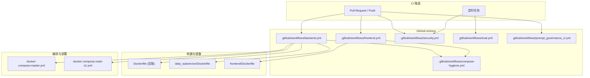
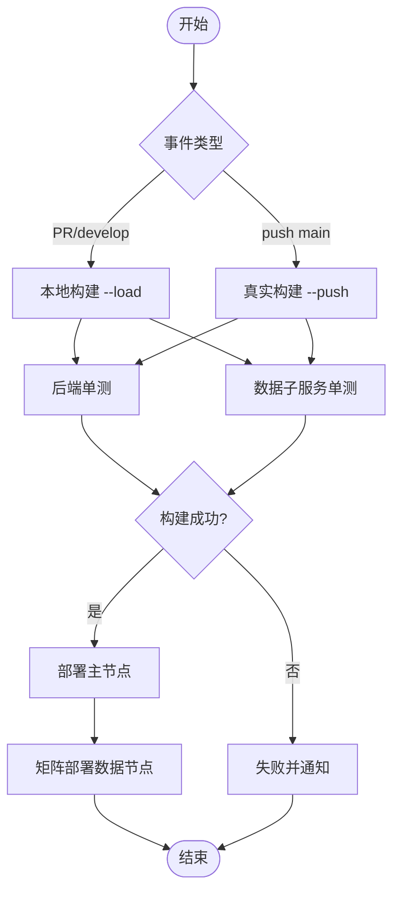
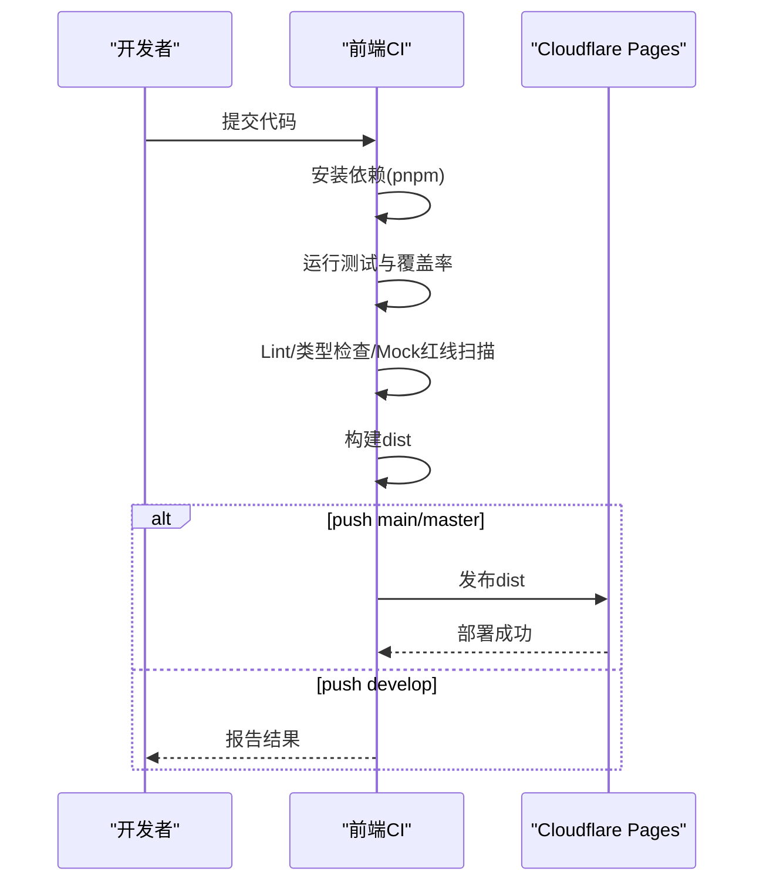
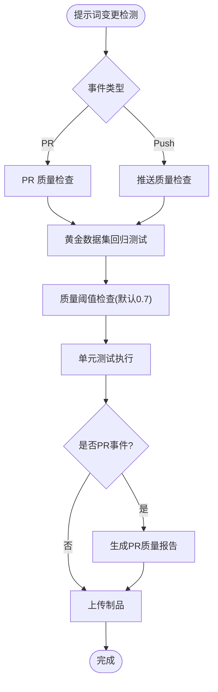
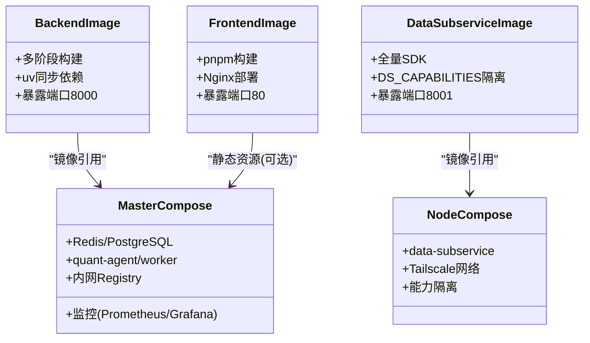
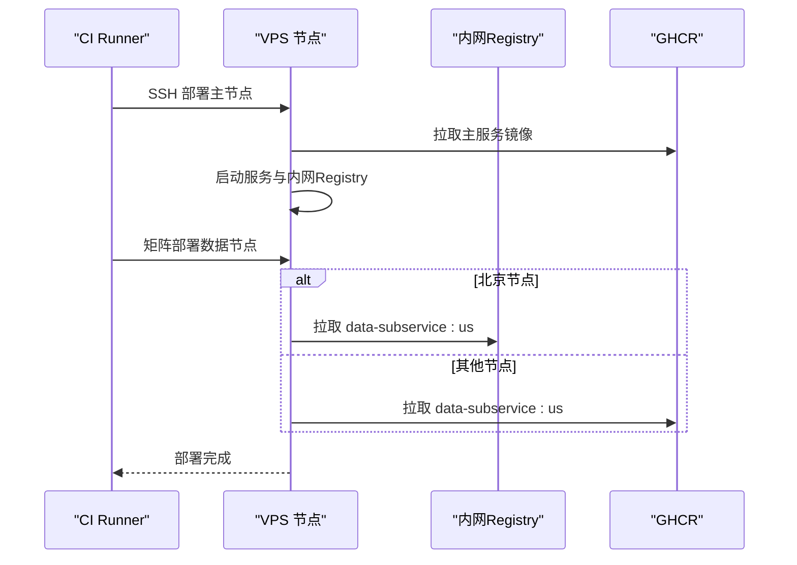
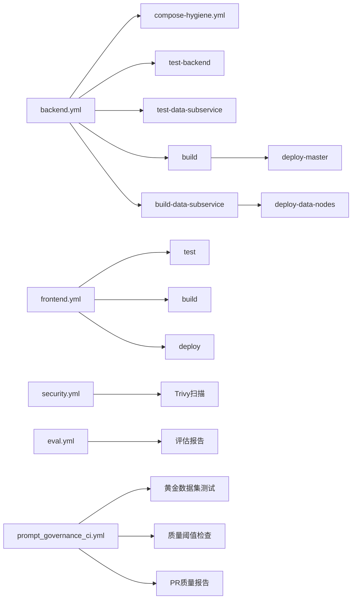

# 持续集成流程

<cite>
**本文引用的文件**
- [backend.yml](file://.github/workflows/backend.yml)
- [frontend.yml](file://.github/workflows/frontend.yml)
- [security.yml](file://.github/workflows/security.yml)
- [eval.yml](file://.github/workflows/eval.yml)
- [compose-hygiene.yml](file://.github/workflows/compose-hygiene.yml)
- [prompt_governance_ci.yml](file://.github/workflows/prompt_governance_ci.yml)
- [Dockerfile](file://Dockerfile)
- [data_subservice/Dockerfile](file://data_subservice/Dockerfile)
- [frontend/Dockerfile](file://frontend/Dockerfile)
- [docker-compose.master.yml](file://docker-compose.master.yml)
- [docker-compose.node-s1.yml](file://docker-compose.node-s1.yml)
- [Makefile](file://Makefile)
- [pyproject.toml](file://pyproject.toml)
- [codecov.yml](file://codecov.yml)
</cite>

## 更新摘要
**变更内容**
- 新增提示词治理 CI/CD 流水线，实现黄金数据集回归测试和质量阈值强制（默认 0.7）
- 添加单元测试执行与覆盖率报告功能
- 实现 PR 质量报告自动生成和制品管理
- 增强提示词版本控制和质量评估体系

## 目录
1. [简介](#简介)
2. [项目结构](#项目结构)
3. [核心组件](#核心组件)
4. [架构总览](#架构总览)
5. [详细组件分析](#详细组件分析)
6. [依赖关系分析](#依赖关系分析)
7. [性能与可观测性](#性能与可观测性)
8. [故障排查指南](#故障排查指南)
9. [结论](#结论)
10. [附录](#附录)

## 简介
本文件面向 Quant Agent 项目的持续集成与持续交付（CI/CD）实践，系统化说明 GitHub Actions 工作流、自动化测试策略、代码质量门禁、镜像构建与容器编排、部署流水线、监控告警以及常见问题的排查方法。目标是让开发团队在本地与 CI 环境中拥有一致的体验，确保代码变更快速、安全地进入生产环境。

**更新** 新增了提示词治理 CI/CD 流水线，专门处理提示词版本管理和质量保证，包括黄金数据集回归测试、质量阈值检查和 PR 质量报告生成。

## 项目结构
仓库采用多语言、多服务架构：后端 Python FastAPI 主服务与数据子服务、前端静态站点、分布式节点编排与监控。CI 围绕以下关键工件展开：
- 后端镜像与数据子服务镜像：基于 Docker 多阶段构建，使用 uv 加速依赖安装。
- 前端构建产物：通过 pnpm 构建并部署到 Cloudflare Pages。
- 编排配置：docker-compose 管理主节点与多个数据节点，包含 Redis、PostgreSQL、Prometheus、Grafana 等基础设施。
- 质量与安全：Ruff 检查、pytest 单测、覆盖率门禁、Trivy 安全扫描。
- **新增** 提示词治理流水线：专门的 CI/CD 流程处理提示词版本控制和质量管理。



**图表来源**
- [backend.yml:1-12](file://.github/workflows/backend.yml#L1-L12)
- [frontend.yml:1-12](file://.github/workflows/frontend.yml#L1-L12)
- [security.yml:1-16](file://.github/workflows/security.yml#L1-L16)
- [eval.yml:1-12](file://.github/workflows/eval.yml#L1-L12)
- [compose-hygiene.yml:1-27](file://.github/workflows/compose-hygiene.yml#L1-L27)
- [prompt_governance_ci.yml:1-25](file://.github/workflows/prompt_governance_ci.yml#L1-L25)

**章节来源**
- [backend.yml:1-12](file://.github/workflows/backend.yml#L1-L12)
- [frontend.yml:1-12](file://.github/workflows/frontend.yml#L1-L12)
- [security.yml:1-16](file://.github/workflows/security.yml#L1-L16)
- [eval.yml:1-12](file://.github/workflows/eval.yml#L1-L12)
- [compose-hygiene.yml:1-27](file://.github/workflows/compose-hygiene.yml#L1-L27)
- [prompt_governance_ci.yml:1-25](file://.github/workflows/prompt_governance_ci.yml#L1-L25)

## 核心组件
- 后端 CI（backend.yml）
  - 触发：PR to main、push main/develop。
  - 门禁：Compose 卫生校验、后端单测、数据子服务单测。
  - 构建：后端镜像与数据子服务镜像（PR/develop 仅本地编译；push main 推送 GHCR）。
  - 部署：仅 push main 时部署主节点与数据节点矩阵。
- 前端 CI（frontend.yml）
  - 触发：push develop/main、workflow_dispatch。
  - 门禁：单元测试+覆盖率、Lint/类型检查、Mock 红线扫描、安全审计。
  - 构建：pnpm 构建静态资源。
  - 部署：main/master 推送到 Cloudflare Pages。
- 安全扫描（security.yml）
  - 触发：push main/develop、每周定时。
  - 工具：Trivy 文件系统扫描，输出 SARIF 并上传制品。
- 评估任务（eval.yml）
  - 触发：每周一 UTC 02:00、手动触发。
  - 内容：运行评估框架与黄金数据集评估，产出报告制品。
- Compose 卫生校验（compose-hygiene.yml）
  - 规则：拒绝连字符版仓库名、强制显式 name 字段隔离项目名。
- **新增** 提示词治理 CI（prompt_governance_ci.yml）
  - 触发：prompts/**、backend/services/prompt/**、hermes_agent/prompt_versioning.py 的变更。
  - 功能：黄金数据集回归测试、质量阈值检查（默认 0.7）、单元测试执行、PR 质量报告生成。
  - 制品：质量结果 JSON 文件保留 30 天。

**章节来源**
- [backend.yml:1-12](file://.github/workflows/backend.yml#L1-L12)
- [backend.yml:24-27](file://.github/workflows/backend.yml#L24-L27)
- [backend.yml:119-193](file://.github/workflows/backend.yml#L119-L193)
- [backend.yml:203-275](file://.github/workflows/backend.yml#L203-L275)
- [backend.yml:278-533](file://.github/workflows/backend.yml#L278-L533)
- [backend.yml:535-800](file://.github/workflows/backend.yml#L535-L800)
- [frontend.yml:1-12](file://.github/workflows/frontend.yml#L1-L12)
- [frontend.yml:14-44](file://.github/workflows/frontend.yml#L14-L44)
- [frontend.yml:56-111](file://.github/workflows/frontend.yml#L56-L111)
- [frontend.yml:113-187](file://.github/workflows/frontend.yml#L113-L187)
- [security.yml:1-49](file://.github/workflows/security.yml#L1-L49)
- [eval.yml:1-71](file://.github/workflows/eval.yml#L1-L71)
- [compose-hygiene.yml:1-68](file://.github/workflows/compose-hygiene.yml#L1-L68)
- [prompt_governance_ci.yml:1-272](file://.github/workflows/prompt_governance_ci.yml#L1-L272)

## 架构总览
下图展示从代码提交到部署的端到端流程，包括分支策略、门禁、构建、镜像分发与多节点部署。

```mermaid
sequenceDiagram
participant Dev as "开发者"
participant GH as "GitHub"
participant WF as "Actions 工作流"
participant Build as "构建器"
participant Reg as "GHCR/内网Registry"
participant Node as "VPS 节点"
Dev->>GH : 提交代码/创建PR
GH->>WF : 触发 backend.yml/frontend.yml/security.yml/prompt_governance_ci.yml
WF->>WF : 执行 Compose 卫生校验
WF->>WF : 运行后端/前端单测与覆盖率
WF->>WF : 执行提示词治理测试与质量检查
WF->>Build : 构建镜像 (PR/develop : --load; main : --push)
Build-->>Reg : 推送镜像标签 ( : DEPLOY_SHA, : latest/ : us)
alt push main
WF->>Node : SSH 部署主节点 (docker compose up)
Node->>Reg : 拉取镜像并启动服务
Node->>Node : 启动内网 Registry 并中转镜像
WF->>Node : 矩阵部署数据节点 (bj/s2/s3/s4)
Node->>Reg : 从内网或 GHCR 拉取镜像
else PR/develop
WF-->>Dev : 报告测试结果与构建状态
end
```

**图表来源**
- [backend.yml:1-12](file://.github/workflows/backend.yml#L1-L12)
- [backend.yml:81-110](file://.github/workflows/backend.yml#L81-L110)
- [backend.yml:244-275](file://.github/workflows/backend.yml#L244-L275)
- [backend.yml:278-533](file://.github/workflows/backend.yml#L278-L533)
- [backend.yml:535-800](file://.github/workflows/backend.yml#L535-L800)
- [prompt_governance_ci.yml:26-272](file://.github/workflows/prompt_governance_ci.yml#L26-L272)

## 详细组件分析

### 后端 CI 流水线（backend.yml）
- 触发与分支策略
  - PR to main：仅本地编译验证（--load），不推送镜像、不部署。
  - push develop：仅本地编译验证。
  - push main：真实构建并推送镜像（主服务打 :DEPLOY_SHA 与 :latest；数据子服务打 :DEPLOY_SHA 与 :us），随后部署主节点与数据节点矩阵。
- 门禁与测试
  - Compose 卫生校验：统一仓库命名规范、强制 name 字段隔离项目名。
  - 后端单测：自包含 SQLite + Mock Redis，无需外部服务。
  - 数据子服务单测：独立 pytest.ini，需安装重型 SDK 的环境。
- 构建与缓存
  - 使用 Docker Buildx 与 GHA Cache 加速构建。
  - 环境变量禁用 OTel 导出以避免无 collector 时的重试阻塞。
- 部署逻辑
  - 主节点：拉取 compose 模板与环境变量，替换镜像标签，启动 quant-agent、quant-worker、Redis、Postgres、Prometheus、Grafana、内网 Registry。
  - 数据节点：矩阵部署 bj/s2/s3/s4，按节点能力 DS_CAPABILITIES 运行时隔离，北京节点经内网 Registry 拉取镜像。



**图表来源**
- [backend.yml:1-12](file://.github/workflows/backend.yml#L1-L12)
- [backend.yml:119-193](file://.github/workflows/backend.yml#L119-L193)
- [backend.yml:203-275](file://.github/workflows/backend.yml#L203-L275)
- [backend.yml:278-533](file://.github/workflows/backend.yml#L278-L533)
- [backend.yml:535-800](file://.github/workflows/backend.yml#L535-L800)

**章节来源**
- [backend.yml:1-12](file://.github/workflows/backend.yml#L1-L12)
- [backend.yml:24-27](file://.github/workflows/backend.yml#L24-L27)
- [backend.yml:81-110](file://.github/workflows/backend.yml#L81-L110)
- [backend.yml:119-193](file://.github/workflows/backend.yml#L119-L193)
- [backend.yml:203-275](file://.github/workflows/backend.yml#L203-L275)
- [backend.yml:278-533](file://.github/workflows/backend.yml#L278-L533)
- [backend.yml:535-800](file://.github/workflows/backend.yml#L535-L800)

### 前端 CI 流水线（frontend.yml）
- 触发与门禁
  - push develop：运行测试与覆盖率、Lint/类型检查、Mock 红线扫描、安全审计。
  - push main/master：构建并通过 Cloudflare Pages 发布。
- 构建产物
  - pnpm 构建静态资源，上传制品供后续步骤使用。
- 部署
  - 使用 Cloudflare Pages Action 将 dist 目录发布到指定项目与分支。



**图表来源**
- [frontend.yml:14-44](file://.github/workflows/frontend.yml#L14-L44)
- [frontend.yml:56-111](file://.github/workflows/frontend.yml#L56-L111)
- [frontend.yml:113-187](file://.github/workflows/frontend.yml#L113-L187)

**章节来源**
- [frontend.yml:1-12](file://.github/workflows/frontend.yml#L1-L12)
- [frontend.yml:14-44](file://.github/workflows/frontend.yml#L14-L44)
- [frontend.yml:56-111](file://.github/workflows/frontend.yml#L56-L111)
- [frontend.yml:113-187](file://.github/workflows/frontend.yml#L113-L187)

### 安全扫描（security.yml）
- 触发：push main/develop、每周定时。
- 工具：Trivy 文件系统扫描，忽略未修复漏洞，输出表格与 SARIF。
- 制品：SARIF 结果作为制品保留 30 天，便于后续集成到代码平台的安全面板。

**章节来源**
- [security.yml:1-49](file://.github/workflows/security.yml#L1-L49)

### 评估任务（eval.yml）
- 触发：每周一 UTC 02:00、手动触发。
- 内容：运行评估框架与黄金数据集评估，生成报告与结果 JSON。
- 制品：评估报告与结果上传至制品库，保留 30 天。

**章节来源**
- [eval.yml:1-71](file://.github/workflows/eval.yml#L1-L71)

### 提示词治理 CI 流水线（prompt_governance_ci.yml）
- 触发条件
  - 监听 prompts/**、backend/services/prompt/**、hermes_agent/prompt_versioning.py 的变更。
  - 支持 PR（develop 分支）和 push（develop/main 分支）事件。
- 核心功能
  - **黄金数据集回归测试**：执行 test_prompt_governance.py::test_golden_dataset_runner_create_sample 测试用例。
  - **质量阈值检查**：使用 PromptQualityEvaluator 评估所有提示词，默认阈值为 0.7。
  - **单元测试执行**：运行 pre-commit hooks 和后端单元测试。
  - **PR 质量报告**：自动生成 Markdown 格式的 PR 评论，包含质量评分详情。
  - **制品管理**：保存质量结果 JSON 文件，保留 30 天。
- 执行流程
  - Job 1: Golden Dataset Regression Testing - 执行黄金数据集回归测试和质量检查。
  - Job 2: Unit Tests & Linter - 运行预提交钩子和单元测试。
  - Job 3: PR Comment - 生成并发布 PR 质量报告。
  - Job 4: Upload Artifacts - 上传质量结果制品。



**图表来源**
- [prompt_governance_ci.yml:26-272](file://.github/workflows/prompt_governance_ci.yml#L26-L272)

**章节来源**
- [prompt_governance_ci.yml:1-272](file://.github/workflows/prompt_governance_ci.yml#L1-L272)

### 镜像构建与容器编排
- 后端镜像（Dockerfile）
  - 多阶段构建：builder 安装依赖，运行镜像只复制 .venv 与源码。
  - 优化：国内镜像源、uv 加速、最小化系统库。
- 数据子服务镜像（data_subservice/Dockerfile）
  - 全量 datasource-all extra，运行时通过 DS_CAPABILITIES 隔离能力。
  - 清理字节码与构建残留以缩小镜像。
- 前端镜像（frontend/Dockerfile）
  - Node 构建阶段与 Nginx 部署阶段分离，增大堆内存避免 OOM。
- 编排（docker-compose）
  - 主节点：Redis、PostgreSQL、quant-agent、quant-worker、内网 Registry、Prometheus、Grafana。
  - 数据节点：data-subservice，绑定 Tailscale IP，能力由环境变量控制。



**图表来源**
- [Dockerfile:1-60](file://Dockerfile#L1-L60)
- [data_subservice/Dockerfile:1-72](file://data_subservice/Dockerfile#L1-L72)
- [frontend/Dockerfile:1-22](file://frontend/Dockerfile#L1-L22)
- [docker-compose.master.yml:16-276](file://docker-compose.master.yml#L16-L276)
- [docker-compose.node-s1.yml:25-143](file://docker-compose.node-s1.yml#L25-L143)

**章节来源**
- [Dockerfile:1-60](file://Dockerfile#L1-L60)
- [data_subservice/Dockerfile:1-72](file://data_subservice/Dockerfile#L1-L72)
- [frontend/Dockerfile:1-22](file://frontend/Dockerfile#L1-L22)
- [docker-compose.master.yml:16-276](file://docker-compose.master.yml#L16-L276)
- [docker-compose.node-s1.yml:25-143](file://docker-compose.node-s1.yml#L25-L143)

### 测试环境与依赖管理
- 后端测试
  - 使用 Makefile 统一命令：test、coverage、dev-infra、dev-api、dev-worker。
  - 单测自包含 SQLite + Mock Redis，无需外部服务。
  - 覆盖率配置：并行合并、排除迁移与外部 SDK 封装。
- 数据子服务测试
  - 独立 pytest.ini，需安装 requirements.txt 中的重型 SDK。
- 前端测试
  - Vitest 运行测试与覆盖率，上传 Codecov。
- **新增** 提示词治理测试
  - 使用 pytest 执行提示词治理相关测试。
  - 支持黄金数据集回归测试和质量评估。
  - 集成 pre-commit hooks 进行代码质量检查。

**章节来源**
- [Makefile:31-64](file://Makefile#L31-L64)
- [pyproject.toml:125-199](file://pyproject.toml#L125-L199)
- [codecov.yml:1-65](file://codecov.yml#L1-L65)
- [prompt_governance_ci.yml:142-170](file://.github/workflows/prompt_governance_ci.yml#L142-L170)

### 质量门禁与安全
- 代码质量
  - Ruff 格式化与检查（pyproject.toml 配置）。
  - 前端 Lint/类型检查与 Mock 红线扫描。
- 覆盖率门禁
  - Codecov 配置：项目级目标与阈值、补丁覆盖率要求、趋势禁止倒退。
- 安全扫描
  - Trivy 文件系统扫描，忽略未修复漏洞，输出 SARIF 制品。
- **新增** 提示词质量门禁
  - 默认质量阈值 0.7，可通过环境变量 QUALITY_THRESHOLD 调整。
  - 综合评分包含连贯性、清晰度、相关性等多个维度。
  - 自动检查所有提示词版本的质量指标。

**章节来源**
- [pyproject.toml:104-124](file://pyproject.toml#L104-L124)
- [pyproject.toml:167-210](file://pyproject.toml#L167-L210)
- [codecov.yml:1-65](file://codecov.yml#L1-L65)
- [security.yml:1-49](file://.github/workflows/security.yml#L1-L49)
- [prompt_governance_ci.yml:69-136](file://.github/workflows/prompt_governance_ci.yml#L69-L136)

### 部署流程与编排
- 主节点部署
  - 拉取 compose 模板与环境变量，替换镜像标签，启动服务与内网 Registry。
  - 磁盘空间与健康检查，registry 就绪后中转镜像。
- 数据节点部署
  - 矩阵部署 bj/s2/s3/s4，按节点能力隔离，北京节点经内网 Registry 拉取。
  - 自动注入 Secrets 到 .env.data-node，校验 Tailscale IP 与端口绑定。



**图表来源**
- [backend.yml:278-533](file://.github/workflows/backend.yml#L278-L533)
- [backend.yml:535-800](file://.github/workflows/backend.yml#L535-L800)
- [docker-compose.master.yml:16-276](file://docker-compose.master.yml#L16-L276)
- [docker-compose.node-s1.yml:25-143](file://docker-compose.node-s1.yml#L25-L143)

**章节来源**
- [backend.yml:278-533](file://.github/workflows/backend.yml#L278-L533)
- [backend.yml:535-800](file://.github/workflows/backend.yml#L535-L800)
- [docker-compose.master.yml:16-276](file://docker-compose.master.yml#L16-L276)
- [docker-compose.node-s1.yml:25-143](file://docker-compose.node-s1.yml#L25-L143)

## 依赖关系分析
- 工作流依赖
  - backend.yml 依赖 compose-hygiene、test-backend、test-data-subservice、build、build-data-subservice。
  - frontend.yml 依赖 test、build、deploy。
  - security.yml 独立运行，定期扫描。
  - eval.yml 独立运行，周期性评估。
  - **新增** prompt_governance_ci.yml 独立运行，专门处理提示词相关变更。
- 镜像与服务依赖
  - 主节点依赖 Redis、PostgreSQL、内网 Registry、监控栈。
  - 数据节点依赖主节点 Tailscale IP 与内网 Registry（北京节点）。



**图表来源**
- [backend.yml:1-12](file://.github/workflows/backend.yml#L1-L12)
- [backend.yml:24-27](file://.github/workflows/backend.yml#L24-L27)
- [backend.yml:119-193](file://.github/workflows/backend.yml#L119-L193)
- [backend.yml:203-275](file://.github/workflows/backend.yml#L203-L275)
- [backend.yml:278-533](file://.github/workflows/backend.yml#L278-L533)
- [backend.yml:535-800](file://.github/workflows/backend.yml#L535-L800)
- [frontend.yml:14-44](file://.github/workflows/frontend.yml#L14-L44)
- [frontend.yml:56-111](file://.github/workflows/frontend.yml#L56-L111)
- [frontend.yml:113-187](file://.github/workflows/frontend.yml#L113-L187)
- [security.yml:1-49](file://.github/workflows/security.yml#L1-L49)
- [eval.yml:1-71](file://.github/workflows/eval.yml#L1-L71)
- [prompt_governance_ci.yml:26-272](file://.github/workflows/prompt_governance_ci.yml#L26-L272)

**章节来源**
- [backend.yml:1-12](file://.github/workflows/backend.yml#L1-L12)
- [frontend.yml:1-12](file://.github/workflows/frontend.yml#L1-L12)
- [security.yml:1-49](file://.github/workflows/security.yml#L1-L49)
- [eval.yml:1-71](file://.github/workflows/eval.yml#L1-L71)
- [prompt_governance_ci.yml:1-272](file://.github/workflows/prompt_governance_ci.yml#L1-L272)

## 性能与可观测性
- 构建性能
  - 使用 Docker Buildx 与 GHA Cache 加速镜像构建。
  - 前端构建增加 Node.js 堆内存限制避免 OOM。
- 运行时性能
  - 主节点设置并发限制与优雅重启防止内存泄漏。
  - 数据节点支持指数退避与熔断自愈。
- 可观测性
  - Prometheus + Grafana 监控栈随主节点部署。
  - 健康检查与日志输出便于问题定位。
- **新增** 提示词治理可观测性
  - 质量评分趋势追踪和历史记录。
  - 提示词版本变更的审计日志。
  - 用户反馈收集和统计分析。

**章节来源**
- [Dockerfile:1-60](file://Dockerfile#L1-L60)
- [frontend/Dockerfile:1-22](file://frontend/Dockerfile#L1-L22)
- [docker-compose.master.yml:76-130](file://docker-compose.master.yml#L76-L130)
- [docker-compose.master.yml:197-251](file://docker-compose.master.yml#L197-L251)
- [docker-compose.node-s1.yml:79-87](file://docker-compose.node-s1.yml#L79-L87)
- [prompt_governance_ci.yml:69-136](file://.github/workflows/prompt_governance_ci.yml#L69-L136)

## 故障排查指南
- 构建失败
  - 检查依赖安装与缓存是否有效。
  - 确认 Docker Buildx 与镜像源配置正确。
- 测试失败
  - 后端单测需确保 SQLite 与 Mock Redis 可用。
  - 数据子服务单测需安装重型 SDK 并配置环境变量。
  - **新增** 提示词治理测试失败需检查黄金数据集格式和质量阈值配置。
- 部署失败
  - 主节点磁盘空间不足会中止部署，需清理无用资源。
  - 内网 Registry 未就绪会导致北京节点无法拉取镜像，需检查端口绑定与 Tailscale IP。
- 安全扫描
  - Trivy 扫描结果以 SARIF 形式上传，可在代码平台查看漏洞详情。
- **新增** 提示词治理故障排查
  - 质量阈值检查失败：检查提示词内容质量和阈值配置。
  - 黄金数据集测试失败：验证数据集格式和测试用例。
  - PR 质量报告生成失败：检查 GitHub API 权限和脚本执行。

**章节来源**
- [backend.yml:81-110](file://.github/workflows/backend.yml#L81-L110)
- [backend.yml:244-275](file://.github/workflows/backend.yml#L244-L275)
- [backend.yml:278-533](file://.github/workflows/backend.yml#L278-L533)
- [backend.yml:535-800](file://.github/workflows/backend.yml#L535-L800)
- [security.yml:1-49](file://.github/workflows/security.yml#L1-L49)
- [prompt_governance_ci.yml:69-136](file://.github/workflows/prompt_governance_ci.yml#L69-L136)

## 结论
Quant Agent 的 CI/CD 体系通过 GitHub Actions 实现了从代码提交到生产部署的全链路自动化。后端与前端分别具备独立的门禁与构建流程，结合 Compose 卫生校验、覆盖率门禁与安全扫描，确保代码质量与安全性。**新增的提示词治理流水线**专门处理提示词版本控制和质量管理，包括黄金数据集回归测试、质量阈值检查和 PR 质量报告生成。镜像构建与容器编排支持多节点部署，内网 Registry 提升跨地域拉取效率。建议团队遵循现有最佳实践，持续完善测试覆盖与监控告警，保障系统稳定演进。

## 附录
- 本地开发命令参考 Makefile。
- 覆盖率目标与爬坡计划参考 codecov.yml。
- 编排配置参考 docker-compose.* 文件。
- **新增** 提示词治理配置参考 prompt_governance_ci.yml 和环境变量配置。

**章节来源**
- [Makefile:1-112](file://Makefile#L1-L112)
- [codecov.yml:1-65](file://codecov.yml#L1-L65)
- [docker-compose.master.yml:1-276](file://docker-compose.master.yml#L1-L276)
- [docker-compose.node-s1.yml:1-143](file://docker-compose.node-s1.yml#L1-L143)
- [prompt_governance_ci.yml:1-272](file://.github/workflows/prompt_governance_ci.yml#L1-L272)