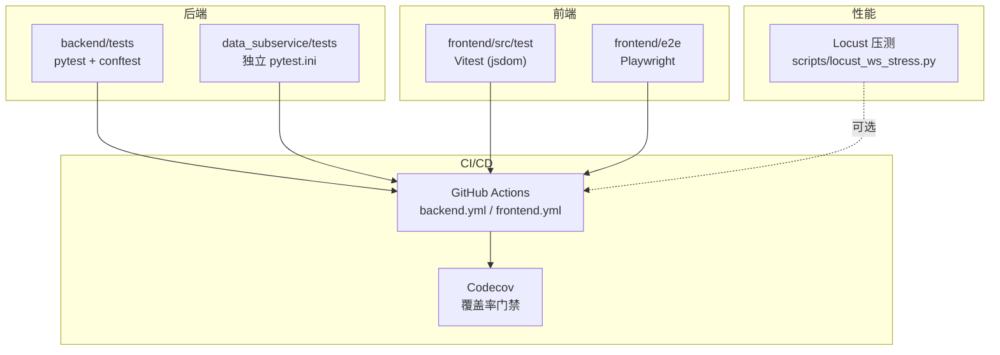
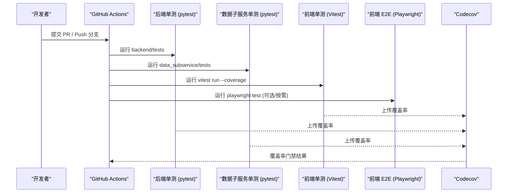
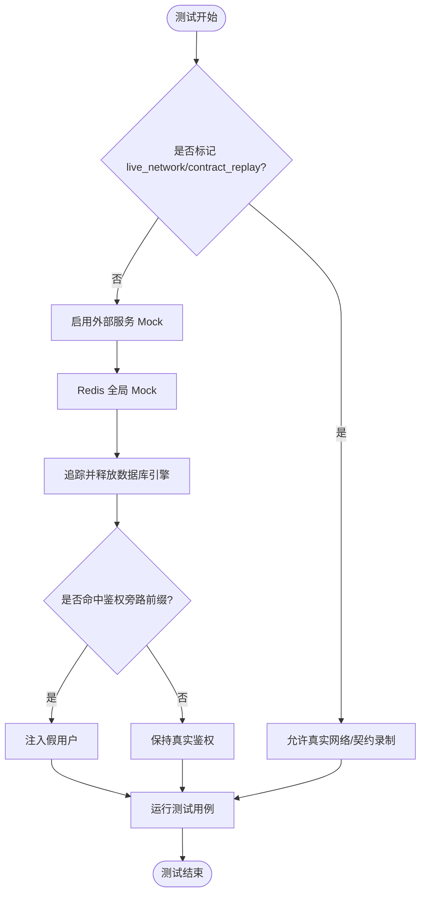
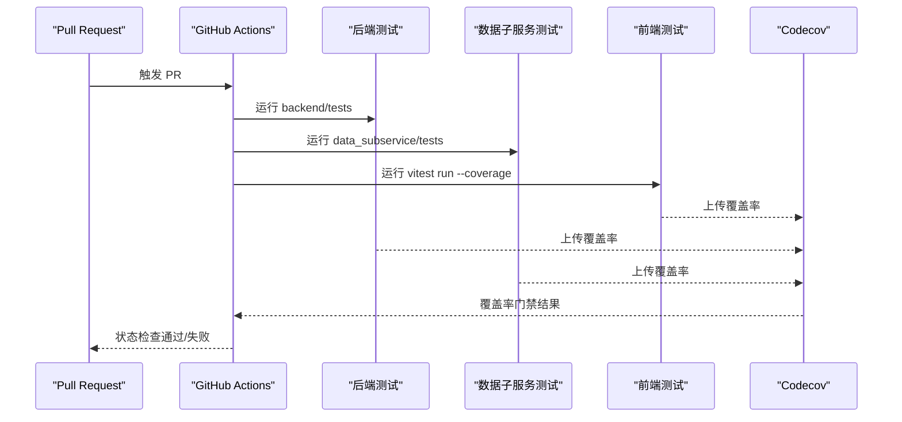
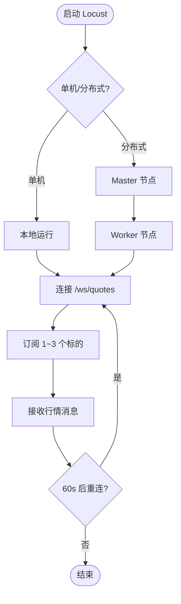
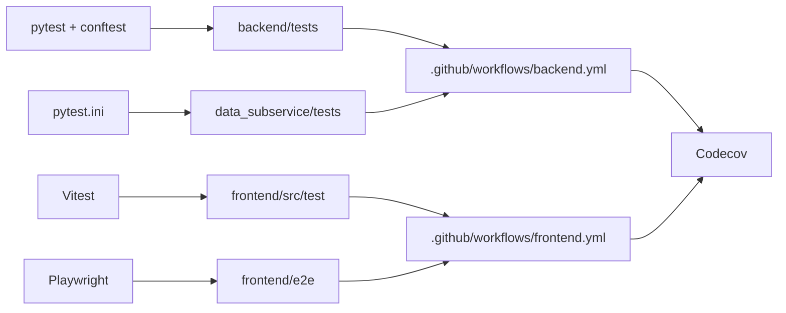

# 测试与质量保证

<cite>
**本文引用的文件**
- [backend/tests/conftest.py](file://backend/tests/conftest.py)
- [data_subservice/pytest.ini](file://data_subservice/pytest.ini)
- [frontend/vitest.config.ts](file://frontend/vitest.config.ts)
- [frontend/playwright.config.ts](file://frontend/playwright.config.ts)
- [.github/workflows/backend.yml](file://.github/workflows/backend.yml)
- [.github/workflows/frontend.yml](file://.github/workflows/frontend.yml)
- [codecov.yml](file://codecov.yml)
- [Makefile](file://Makefile)
- [scripts/locust_ws_stress.py](file://scripts/locust_ws_stress.py)
- [frontend/e2e/flows.spec.ts](file://frontend/e2e/flows.spec.ts)
</cite>

## 目录
1. [简介](#简介)
2. [项目结构](#项目结构)
3. [核心组件](#核心组件)
4. [架构总览](#架构总览)
5. [详细组件分析](#详细组件分析)
6. [依赖关系分析](#依赖关系分析)
7. [性能考虑](#性能考虑)
8. [故障排查指南](#故障排查指南)
9. [结论](#结论)
10. [附录](#附录)

## 简介
本文件为 Quant Agent 项目的测试与质量保证体系文档，覆盖后端（Python）、数据子服务、前端（React/Vite）的测试策略、框架配置、质量门禁与持续集成流程。内容包含：
- 单元测试、集成测试、端到端测试的组织方式与执行流程
- pytest、Vitest、Playwright 的配置与最佳实践
- 代码质量检查方案：静态分析、类型检查、格式化、安全扫描
- 高质量测试用例编写、外部依赖模拟、业务逻辑验证方法
- CI/CD 流水线配置、自动化测试执行、质量门禁
- 性能测试与负载测试方法（Locust WebSocket/HTTP 压测）

## 项目结构
仓库采用多语言、多模块工程组织，测试相关的关键位置如下：
- 后端单测：backend/tests（基于 pytest，conftest 提供全局 fixtures、环境隔离、外部依赖 Mock）
- 数据子服务单测：data_subservice/tests（独立 pytest.ini 入口，避免重型 SDK 污染主工程）
- 前端单测：frontend/src/test（基于 Vitest，jsdom 环境，覆盖率阈值配置）
- 前端 E2E：frontend/e2e（基于 Playwright，浏览器级关键用户流验证）
- CI/CD：.github/workflows（后端、前端流水线，含构建、测试、部署）
- 覆盖率门禁：codecov.yml（项目与补丁覆盖率目标与阈值）
- 本地开发工具：Makefile（统一测试、格式化、lint、覆盖率命令）
- 性能压测：scripts/locust_ws_stress.py（WebSocket 与 HTTP 压力测试脚本）

**图表来源**
- [.github/workflows/backend.yml:119-192](file://.github/workflows/backend.yml#L119-L192)
- [.github/workflows/frontend.yml:14-43](file://.github/workflows/frontend.yml#L14-L43)
- [frontend/vitest.config.ts:12-39](file://frontend/vitest.config.ts#L12-L39)
- [frontend/playwright.config.ts:23-61](file://frontend/playwright.config.ts#L23-L61)
- [codecov.yml:18-45](file://codecov.yml#L18-L45)

**章节来源**
- [backend/tests/conftest.py:24-33](file://backend/tests/conftest.py#L24-L33)
- [data_subservice/pytest.ini:17-36](file://data_subservice/pytest.ini#L17-L36)
- [frontend/vitest.config.ts:12-39](file://frontend/vitest.config.ts#L12-L39)
- [frontend/playwright.config.ts:23-61](file://frontend/playwright.config.ts#L23-L61)
- [.github/workflows/backend.yml:119-192](file://.github/workflows/backend.yml#L119-L192)
- [.github/workflows/frontend.yml:14-43](file://.github/workflows/frontend.yml#L14-L43)
- [codecov.yml:18-45](file://codecov.yml#L18-L45)

## 核心组件
- 后端测试基础设施（conftest）
  - 自定义标记：live_network、contract_replay，用于控制网络与契约回放测试
  - 数据库引擎追踪与释放：防止资源泄漏与警告
  - Redis 全局 Mock：自动 patch 已知模块中的 redis_client/l1_cached_redis/redis_batch_writer
  - 外部服务 Mock：默认禁用真实网络请求，支持 no_mock_external 标记跳过
  - FastAPI TestClient：同步与异步客户端 fixture
  - 鉴权旁路：针对新增鉴权路由前缀在测试中注入假用户，避免大量 401
- 数据子服务测试入口
  - 独立 pytest.ini，定义 markers、asyncio_mode、env、filterwarnings
  - 运行方式：cd data_subservice && python -m pytest -c pytest.ini
- 前端测试配置
  - Vitest：jsdom 环境、全局 API、覆盖率 v8 报告、阈值 60%
  - Playwright：串行执行、重试、截图/视频/trace 保留失败场景、webServer 自动启动
- CI/CD 质量门禁
  - 后端：PR 阶段运行 backend/tests 与 data_subservice/tests；main push 时跳过重复测试
  - 前端：develop push 运行 vitest run --coverage，上传 Codecov；build 阶段 lint/type-check/build
  - 覆盖率：项目级与补丁级目标，逐步爬坡计划

**章节来源**
- [backend/tests/conftest.py:24-33](file://backend/tests/conftest.py#L24-L33)
- [backend/tests/conftest.py:36-97](file://backend/tests/conftest.py#L36-L97)
- [backend/tests/conftest.py:100-268](file://backend/tests/conftest.py#L100-L268)
- [backend/tests/conftest.py:271-295](file://backend/tests/conftest.py#L271-L295)
- [backend/tests/conftest.py:355-375](file://backend/tests/conftest.py#L355-L375)
- [backend/tests/conftest.py:585-678](file://backend/tests/conftest.py#L585-L678)
- [data_subservice/pytest.ini:17-36](file://data_subservice/pytest.ini#L17-L36)
- [frontend/vitest.config.ts:12-39](file://frontend/vitest.config.ts#L12-L39)
- [frontend/playwright.config.ts:23-61](file://frontend/playwright.config.ts#L23-L61)
- [.github/workflows/backend.yml:119-192](file://.github/workflows/backend.yml#L119-L192)
- [.github/workflows/frontend.yml:14-43](file://.github/workflows/frontend.yml#L14-L43)
- [codecov.yml:18-45](file://codecov.yml#L18-L45)

## 架构总览
下图展示测试与质量保障的整体架构：后端与数据子服务的单测通过 GitHub Actions 触发，前端单测与 E2E 在 CI 中执行，覆盖率上报至 Codecov，形成质量门禁。

**图表来源**
- [.github/workflows/backend.yml:119-192](file://.github/workflows/backend.yml#L119-L192)
- [.github/workflows/frontend.yml:14-43](file://.github/workflows/frontend.yml#L14-L43)
- [codecov.yml:18-45](file://codecov.yml#L18-L45)

## 详细组件分析

### 后端测试基础设施（pytest + conftest）
- 自定义标记与环境
  - live_network：需要真实网络或外部 API Key 的集成测试，默认跳过
  - contract_replay：三方数据源契约录制/回放测试，QUANT_RECORD=1 时可补录
- 资源管理
  - 跟踪并释放 SQLAlchemy 引擎，消除未关闭连接警告
  - 会话结束时统一 dispose，确保 SQLite 连接优雅关闭
- 外部依赖隔离
  - Redis 全局 Mock：动态 patch 多个模块中的 redis 引用，提供 AsyncMock 行为
  - 外部服务 Mock：默认禁用真实网络请求，可通过 no_mock_external 标记绕过
- FastAPI 测试客户端
  - 同步 TestClient 与异步 httpx.AsyncClient fixture
- 鉴权旁路
  - 对特定路由前缀注入假用户，避免鉴权导致的 401 干扰测试

**图表来源**
- [backend/tests/conftest.py:24-33](file://backend/tests/conftest.py#L24-L33)
- [backend/tests/conftest.py:36-97](file://backend/tests/conftest.py#L36-L97)
- [backend/tests/conftest.py:100-268](file://backend/tests/conftest.py#L100-L268)
- [backend/tests/conftest.py:271-295](file://backend/tests/conftest.py#L271-L295)
- [backend/tests/conftest.py:585-678](file://backend/tests/conftest.py#L585-L678)

**章节来源**
- [backend/tests/conftest.py:24-33](file://backend/tests/conftest.py#L24-L33)
- [backend/tests/conftest.py:36-97](file://backend/tests/conftest.py#L36-L97)
- [backend/tests/conftest.py:100-268](file://backend/tests/conftest.py#L100-L268)
- [backend/tests/conftest.py:271-295](file://backend/tests/conftest.py#L271-L295)
- [backend/tests/conftest.py:355-375](file://backend/tests/conftest.py#L355-L375)
- [backend/tests/conftest.py:585-678](file://backend/tests/conftest.py#L585-L678)

### 数据子服务测试入口（独立 pytest.ini）
- 独立入口原因：数据子服务依赖 tushare/futu/akshare/yfinance 等重型 SDK，按架构禁止装在主服务环境
- 配置要点：markers（slow/integration/e2e/no_mock_external/asyncio）、asyncio_mode=auto、环境变量、过滤警告
- 运行方式：必须在安装 data_subservice/requirements.txt 的环境中执行 pytest -c pytest.ini

**章节来源**
- [data_subservice/pytest.ini:1-15](file://data_subservice/pytest.ini#L1-L15)
- [data_subservice/pytest.ini:17-36](file://data_subservice/pytest.ini#L17-L36)

### 前端测试配置（Vitest + Playwright）
- Vitest
  - jsdom 环境、全局 API、setupFiles、排除 e2e 与 dist
  - 覆盖率：v8 provider，text/json/html 报告，阈值 60%（branches/functions/lines/statements）
  - 忽略：types、App.tsx、d.ts、stories、test/spec 文件
- Playwright
  - 串行执行、重试次数、超时 30s
  - 报告：HTML 与 list，失败截图/视频/trace
  - webServer：非 CI 环境下自动启动 pnpm dev
  - 基础 URL：E2E_BASE_URL 或默认 localhost:5173

**章节来源**
- [frontend/vitest.config.ts:12-39](file://frontend/vitest.config.ts#L12-L39)
- [frontend/playwright.config.ts:23-61](file://frontend/playwright.config.ts#L23-L61)

### 端到端测试示例（Playwright flows）
- 覆盖关键路径：登录页渲染与路由守卫、导航到行情/告警/回测工坊、命令面板
- 前置条件：前后端服务运行中或通过 E2E_BASE_URL 指定目标
- 健康检查：页面不应白屏、无 JS 错误覆盖层、静态资源加载成功
- 无障碍基础：html lang 属性、图片 alt 属性存在

**章节来源**
- [frontend/e2e/flows.spec.ts:1-183](file://frontend/e2e/flows.spec.ts#L1-L183)

### 持续集成流程（GitHub Actions）
- 后端
  - compose-hygiene：校验 compose 文件规范
  - test-backend：运行 backend/tests（PR 阶段），main push 时跳过
  - test-data-subservice：运行 data_subservice/tests（PR 阶段），main push 时跳过
  - build：PR/develop 仅本地编译验证；push main 构建并推送镜像
  - deploy-master/deploy-data-nodes：仅在 push main 时部署
- 前端
  - test：develop push 运行 vitest run --coverage，上传 Codecov
  - build：lint/type-check/build，Mock 红线扫描，安全审计
  - deploy：main/master 推送时部署到 Cloudflare Pages

**图表来源**
- [.github/workflows/backend.yml:119-192](file://.github/workflows/backend.yml#L119-L192)
- [.github/workflows/frontend.yml:14-43](file://.github/workflows/frontend.yml#L14-L43)
- [codecov.yml:18-45](file://codecov.yml#L18-L45)

**章节来源**
- [.github/workflows/backend.yml:119-192](file://.github/workflows/backend.yml#L119-L192)
- [.github/workflows/frontend.yml:14-43](file://.github/workflows/frontend.yml#L14-L43)
- [codecov.yml:18-45](file://codecov.yml#L18-L45)

### 代码质量检查方案
- 静态分析与格式化
  - 后端：Ruff（format/check），Makefile 提供 format/lint 命令
  - 前端：ESLint（eslint.config.js）、Prettier（.prettierrc），CI 中 lint/type-check
- 类型检查
  - 前端：TypeScript 类型检查（pnpm run type-check）
- 安全扫描
  - 前端：pnpm audit（CI 中 continue-on-error）
- 覆盖率门禁
  - Codecov：项目级与补丁级目标，逐步爬坡计划（后端 39%→70%，前端 15%→60%）

**章节来源**
- [Makefile:37-44](file://Makefile#L37-L44)
- [.github/workflows/frontend.yml:78-105](file://.github/workflows/frontend.yml#L78-L105)
- [codecov.yml:1-16](file://codecov.yml#L1-L16)
- [codecov.yml:18-45](file://codecov.yml#L18-L45)

### 性能测试与负载测试
- Locust WebSocket 压测
  - 目标：/ws/quotes 1000 并发连接，P95 延迟 < 100ms
  - 用法：单机/分布式 master/worker，headless 模式输出 CSV 报告
  - 行为：连接、订阅热门标的、接收消息、定时重连
- REST API 压测
  - 健康检查、行情查询、K线查询、选股筛选等端点

**图表来源**
- [scripts/locust_ws_stress.py:1-262](file://scripts/locust_ws_stress.py#L1-L262)

**章节来源**
- [scripts/locust_ws_stress.py:1-262](file://scripts/locust_ws_stress.py#L1-L262)

## 依赖关系分析
- 后端测试依赖
  - pytest、pytest-asyncio、fastapi.testclient、httpx、unittest.mock
  - 外部依赖 Mock：redis.asyncio、Futu OpenD、yfinance
- 数据子服务测试依赖
  - pytest、pytest-asyncio、pytest-mock、pytest-env
  - 运行时依赖：tushare/futu-api/akshare/yfinance（独立 requirements）
- 前端测试依赖
  - Vitest、jsdom、@vitejs/plugin-react
  - Playwright、@playwright/test
- CI 依赖
  - GitHub Actions、Codecov、Cloudflare Pages

**图表来源**
- [backend/tests/conftest.py:24-33](file://backend/tests/conftest.py#L24-L33)
- [data_subservice/pytest.ini:17-36](file://data_subservice/pytest.ini#L17-L36)
- [frontend/vitest.config.ts:12-39](file://frontend/vitest.config.ts#L12-L39)
- [frontend/playwright.config.ts:23-61](file://frontend/playwright.config.ts#L23-L61)
- [.github/workflows/backend.yml:119-192](file://.github/workflows/backend.yml#L119-L192)
- [.github/workflows/frontend.yml:14-43](file://.github/workflows/frontend.yml#L14-L43)
- [codecov.yml:18-45](file://codecov.yml#L18-L45)

**章节来源**
- [backend/tests/conftest.py:24-33](file://backend/tests/conftest.py#L24-L33)
- [data_subservice/pytest.ini:17-36](file://data_subservice/pytest.ini#L17-L36)
- [frontend/vitest.config.ts:12-39](file://frontend/vitest.config.ts#L12-L39)
- [frontend/playwright.config.ts:23-61](file://frontend/playwright.config.ts#L23-L61)
- [.github/workflows/backend.yml:119-192](file://.github/workflows/backend.yml#L119-L192)
- [.github/workflows/frontend.yml:14-43](file://.github/workflows/frontend.yml#L14-L43)
- [codecov.yml:18-45](file://codecov.yml#L18-L45)

## 性能考虑
- 后端测试加速
  - bcrypt 成本因子降低（BCRYPT_ROUNDS=4）
  - 聊天路由模拟延迟取消（CHAT_MOCK_DELAY=0）
  - OTel SDK 禁用（OTEL_SDK_DISABLED=true）避免 CI 中无限重试
- 前端测试优化
  - Vitest 覆盖率阈值 60%，避免过严导致阻塞
  - Playwright 串行执行与重试提升稳定性
- 压测指标
  - WebSocket 连接建立与消息接收延迟
  - REST API 吞吐量与错误率

[本节提供通用指导，不直接分析具体文件]

## 故障排查指南
- 后端测试常见问题
  - 数据库连接未关闭：使用 conftest 的引擎追踪与释放机制
  - Redis 连接超时：全局 Mock 已屏蔽真实 Redis，如需真实连接可设置 DISABLE_EXTERNAL_MOCK=1
  - 权限问题（macOS TCC/sandbox）：TimedRotatingFileHandler 降级为 StreamHandler
- 前端 E2E 问题
  - 页面白屏：检查路由守卫与静态资源加载
  - 认证失败：通过 storageState 或 Mock Token 绕过登录
- CI 失败定位
  - 查看 GitHub Actions 日志，确认测试命令与覆盖率阈值
  - Codecov 报告关注补丁覆盖率与项目覆盖率变化

**章节来源**
- [backend/tests/conftest.py:36-97](file://backend/tests/conftest.py#L36-L97)
- [backend/tests/conftest.py:100-268](file://backend/tests/conftest.py#L100-L268)
- [frontend/playwright.config.ts:23-61](file://frontend/playwright.config.ts#L23-L61)
- [.github/workflows/backend.yml:119-192](file://.github/workflows/backend.yml#L119-L192)
- [.github/workflows/frontend.yml:14-43](file://.github/workflows/frontend.yml#L14-L43)

## 结论
Quant Agent 项目建立了完善的测试与质量保证体系：
- 后端与数据子服务通过 pytest 实现高隔离度的单测，conftest 提供强大的 Mock 与环境管理能力
- 前端通过 Vitest 与 Playwright 覆盖单元与端到端场景，结合 CI 进行质量门禁
- CI/CD 流水线将测试、构建、部署串联，CodeCov 提供覆盖率门槛
- 性能测试通过 Locust 覆盖 WebSocket 与 REST API，确保系统在高并发下的稳定性

建议团队遵循以下最佳实践：
- 新增功能必须配套单测与 E2E 用例
- 外部依赖一律 Mock，避免真实网络请求
- 保持覆盖率稳步提升，遵循爬坡计划
- 压测纳入发布前验证，关注 P95 延迟与错误率

[本节总结性内容，不直接分析具体文件]

## 附录
- 本地开发命令
  - make install：安装依赖并初始化 pre-commit
  - make format/lint：Ruff 格式化与静态检查
  - make test：运行全部后端单元测试
  - make coverage：生成覆盖率报告
- 数据子服务测试
  - cd data_subservice && pip install -r requirements.txt && python -m pytest -c pytest.ini
- 前端测试
  - pnpm exec vitest run --coverage
  - npx playwright test
- 性能压测
  - locust -f scripts/locust_ws_stress.py --host ws://localhost:8000

**章节来源**
- [Makefile:31-64](file://Makefile#L31-L64)
- [data_subservice/pytest.ini:1-15](file://data_subservice/pytest.ini#L1-L15)
- [frontend/vitest.config.ts:12-39](file://frontend/vitest.config.ts#L12-L39)
- [frontend/playwright.config.ts:23-61](file://frontend/playwright.config.ts#L23-L61)
- [scripts/locust_ws_stress.py:1-262](file://scripts/locust_ws_stress.py#L1-L262)
