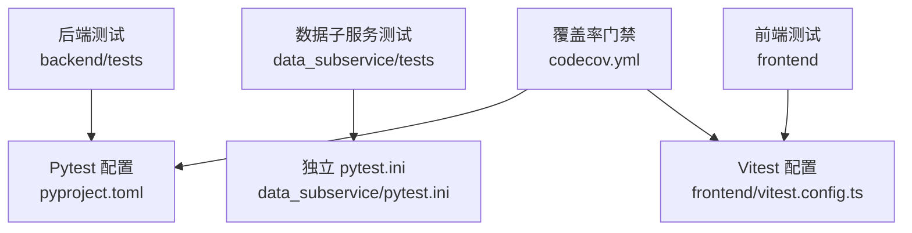
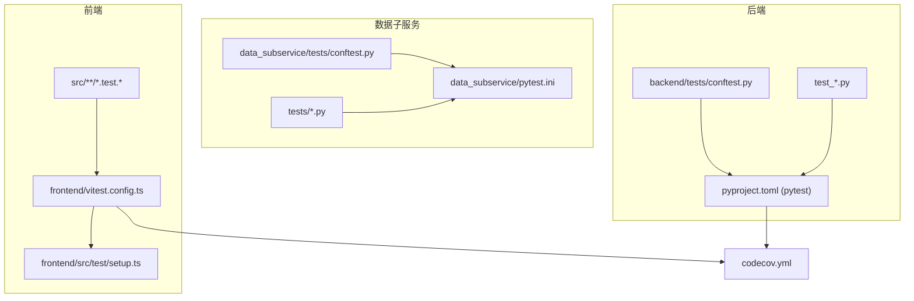
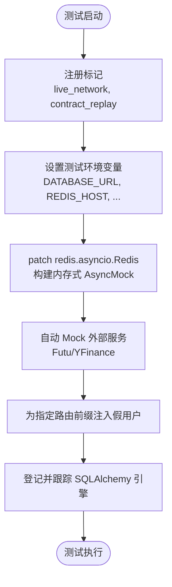
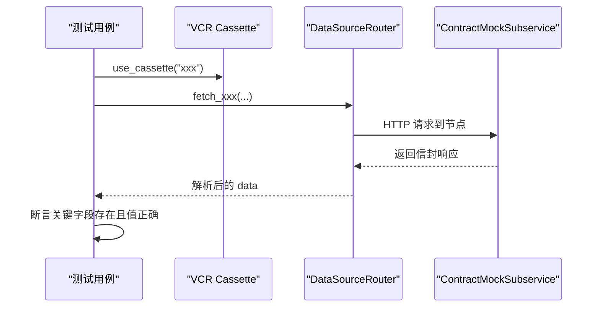
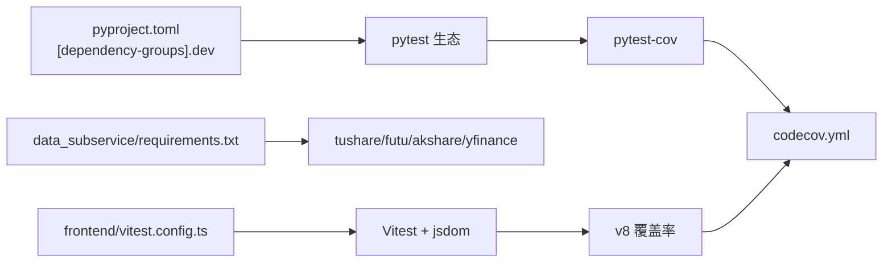

# 测试策略与框架

<cite>
**本文引用的文件**
- [backend/tests/conftest.py](file://backend/tests/conftest.py)
- [pyproject.toml](file://pyproject.toml)
- [data_subservice/pytest.ini](file://data_subservice/pytest.ini)
- [data_subservice/tests/conftest.py](file://data_subservice/tests/conftest.py)
- [backend/tests/test_backtest/conftest.py](file://backend/tests/test_backtest/conftest.py)
- [backend/tests/test_contract_replay.py](file://backend/tests/test_contract_replay.py)
- [backend/tests/test_redis_client.py](file://backend/tests/test_redis_client.py)
- [backend/tests/test_database.py](file://backend/tests/test_database.py)
- [frontend/vitest.config.ts](file://frontend/vitest.config.ts)
- [frontend/src/test/setup.ts](file://frontend/src/test/setup.ts)
- [codecov.yml](file://codecov.yml)
</cite>

## 目录
1. [简介](#简介)
2. [项目结构](#项目结构)
3. [核心组件](#核心组件)
4. [架构总览](#架构总览)
5. [详细组件分析](#详细组件分析)
6. [依赖关系分析](#依赖关系分析)
7. [性能考量](#性能考量)
8. [故障排查指南](#故障排查指南)
9. [结论](#结论)
10. [附录](#附录)

## 简介
本文件为 Quant Agent 项目的测试策略与框架配置文档，覆盖后端 pytest、数据子服务独立 pytest、前端 Vitest 的测试架构、环境搭建、Fixtures 设计模式、Mock 策略、异步测试处理、数据库隔离、Redis Mock、契约录制回放（contract_replay）、自定义标记（markers）使用、测试数据工厂、断言策略、覆盖率要求与门禁，以及面向开发团队的统一使用指南。

## 项目结构
- 后端单测：位于 backend/tests，由 pyproject.toml 中的 pytest 配置驱动，启用严格标记、自动异步模式、警告过滤等。
- 数据子服务单测：位于 data_subservice/tests，通过独立的 pytest.ini 运行，避免重型 SDK 污染主工程环境。
- 前端单测：位于 frontend，基于 Vitest + jsdom，配置全局设置与覆盖率阈值。
- 覆盖率门禁：根目录 codecov.yml 定义前后端爬坡目标与补丁覆盖率门槛。

**图表来源**
- [pyproject.toml:125-165](file://pyproject.toml#L125-L165)
- [data_subservice/pytest.ini:17-36](file://data_subservice/pytest.ini#L17-L36)
- [frontend/vitest.config.ts:12-40](file://frontend/vitest.config.ts#L12-L40)
- [codecov.yml:18-45](file://codecov.yml#L18-L45)

**章节来源**
- [pyproject.toml:125-165](file://pyproject.toml#L125-L165)
- [data_subservice/pytest.ini:17-36](file://data_subservice/pytest.ini#L17-L36)
- [frontend/vitest.config.ts:12-40](file://frontend/vitest.config.ts#L12-L40)
- [codecov.yml:18-45](file://codecov.yml#L18-L45)

## 核心组件
- Pytest 环境与插件
  - 自动异步模式、严格标记、忽略部分警告、禁用 unraisableexception 插件以避免误报。
  - 环境变量注入（如 NUMBA_CACHE_DIR），避免缓存写入触发 IDE 守卫导致崩溃。
- 数据子服务独立 pytest
  - 独立入口与路径注入，确保可导入 data_subservice 与 _internal 模块。
- Vitest 前端测试
  - jsdom 环境、全局 setup、覆盖率报告与阈值。
- 覆盖率门禁
  - 前后端目标与补丁覆盖率门槛，趋势禁止倒退。

**章节来源**
- [pyproject.toml:125-165](file://pyproject.toml#L125-L165)
- [data_subservice/pytest.ini:17-36](file://data_subservice/pytest.ini#L17-L36)
- [frontend/vitest.config.ts:12-40](file://frontend/vitest.config.ts#L12-L40)
- [codecov.yml:18-45](file://codecov.yml#L18-L45)

## 架构总览
后端测试以 conftest 为中心，集中管理 Fixtures、Mock、标记与环境；数据子服务测试独立运行；前端测试通过 Vitest 提供 UI 与状态相关用例；覆盖率由 pytest-cov 与 v8 收集并上报 Codecov。

**图表来源**
- [backend/tests/conftest.py:24-33](file://backend/tests/conftest.py#L24-L33)
- [pyproject.toml:125-165](file://pyproject.toml#L125-L165)
- [data_subservice/tests/conftest.py:13-21](file://data_subservice/tests/conftest.py#L13-L21)
- [data_subservice/pytest.ini:17-36](file://data_subservice/pytest.ini#L17-L36)
- [frontend/vitest.config.ts:12-40](file://frontend/vitest.config.ts#L12-L40)
- [frontend/src/test/setup.ts:1-90](file://frontend/src/test/setup.ts#L1-L90)
- [codecov.yml:18-45](file://codecov.yml#L18-L45)

## 详细组件分析

### 后端 Pytest 配置与 Fixtures
- 自定义标记注册
  - live_network：需要真实网络或外部 API Key 的集成测试，默认跳过。
  - contract_replay：三方数据源契约录制/回放测试，默认离线回放预置 cassette；QUANT_RECORD=1 时补录。
- 资源与连接管理
  - 包装 create_engine / create_async_engine 登记引擎，会话结束统一 dispose，消除未关闭连接告警。
  - 全局熔断器重置 fixture，保证测试隔离。
- Redis Mock 机制
  - 在导入任何模块前 patch redis.asyncio.Redis，防止真实连接。
  - autouse fixture 动态 patch 已知模块中的 redis_client/l1_cached_redis/redis_batch_writer，提供内存式 AsyncMock 行为（get/set/delete/exists/expire/incr/pipeline/pubsub）。
- 外部服务 Mock
  - 自动 mock 外部数据服务（如 Futu/yfinance），可通过 no_mock_external 标记跳过。
- FastAPI 测试客户端
  - 同步 TestClient 与异步 httpx.AsyncClient 客户端。
- 鉴权旁路
  - 对特定路由前缀在测试中注入假用户，避免 401 干扰。
- 测试数据工厂
  - TestDataFactory 提供 make_quote/make_kline/make_order/make_position/make_user 等方法，便于构造一致测试数据。

**图表来源**
- [backend/tests/conftest.py:24-33](file://backend/tests/conftest.py#L24-L33)
- [backend/tests/conftest.py:100-175](file://backend/tests/conftest.py#L100-L175)
- [backend/tests/conftest.py:177-268](file://backend/tests/conftest.py#L177-L268)
- [backend/tests/conftest.py:271-295](file://backend/tests/conftest.py#L271-L295)
- [backend/tests/conftest.py:585-679](file://backend/tests/conftest.py#L585-L679)
- [backend/tests/conftest.py:36-98](file://backend/tests/conftest.py#L36-L98)

**章节来源**
- [backend/tests/conftest.py:24-33](file://backend/tests/conftest.py#L24-L33)
- [backend/tests/conftest.py:36-98](file://backend/tests/conftest.py#L36-L98)
- [backend/tests/conftest.py:100-175](file://backend/tests/conftest.py#L100-L175)
- [backend/tests/conftest.py:177-268](file://backend/tests/conftest.py#L177-L268)
- [backend/tests/conftest.py:271-295](file://backend/tests/conftest.py#L271-L295)
- [backend/tests/conftest.py:355-375](file://backend/tests/conftest.py#L355-L375)
- [backend/tests/conftest.py:585-679](file://backend/tests/conftest.py#L585-L679)
- [backend/tests/conftest.py:499-583](file://backend/tests/conftest.py#L499-L583)

### 数据子服务独立 pytest
- 独立入口与路径注入
  - 将仓库根与 data_subservice 目录加入 sys.path，兼容两种导入风格。
- 配置与主工程保持一致
  - asyncio_mode=auto、markers、env、filterwarnings。
- 运行方式
  - 必须在安装 data_subservice/requirements.txt 的环境中运行。

**章节来源**
- [data_subservice/tests/conftest.py:13-21](file://data_subservice/tests/conftest.py#L13-L21)
- [data_subservice/pytest.ini:17-36](file://data_subservice/pytest.ini#L17-L36)

### 回测共享 Fixtures
- 预加载 vectorbt 减少初始化开销。
- 生成 OHLCV 数据与确定性 DataFrame，用于事件驱动引擎精确断言。

**章节来源**
- [backend/tests/test_backtest/conftest.py:12-74](file://backend/tests/test_backtest/conftest.py#L12-L74)

### 契约录制回放（contract_replay）
- 工作流
  - 默认 CI/本地：record_mode='none'，回放预置 cassettes。
  - 三方字段变更需更新契约：启动 ContractMockSubservice + QUANT_RECORD=1 跑测试，生成/刷新 cassettes。
- 断言策略
  - 校验各 fetch_* 回放响应的 data 字段包含约定关键键，任一字段变更将导致断言失败。

**图表来源**
- [backend/tests/test_contract_replay.py:1-157](file://backend/tests/test_contract_replay.py#L1-L157)

**章节来源**
- [backend/tests/test_contract_replay.py:1-157](file://backend/tests/test_contract_replay.py#L1-L157)

### Redis 客户端测试与隔离
- 测试覆盖
  - RedisAsyncBatchWriter 异步批量写入、队列满刷新、超时刷新、异常处理。
- 隔离策略
  - 通过 conftest 的全局 Redis Mock，所有测试不依赖真实 Redis。
  - 测试内可创建局部 mock_redis fixture 进行更细粒度验证。

**章节来源**
- [backend/tests/test_redis_client.py:1-200](file://backend/tests/test_redis_client.py#L1-L200)
- [backend/tests/conftest.py:177-268](file://backend/tests/conftest.py#L177-L268)

### 数据库测试隔离
- 引擎生命周期管理
  - 包装 create_engine/create_async_engine 登记引擎，会话结束时统一 dispose，避免资源泄漏。
- 内存库与 URL 转换
  - 测试环境强制 SQLite 内存库，URL 转换为 aiosqlite/asyncpg 形式。
- 会话工厂与生成器
  - 验证 sessionmaker/async_sessionmaker 配置与 get_db/get_async_db 行为。

**章节来源**
- [backend/tests/conftest.py:36-98](file://backend/tests/conftest.py#L36-L98)
- [backend/tests/test_database.py:1-172](file://backend/tests/test_database.py#L1-L172)

### 前端 Vitest 配置与 Setup
- 环境
  - jsdom 环境，globals 开启，setupFiles 指向 src/test/setup.ts。
- 覆盖率
  - v8 provider，text/json/html 报告，阈值 60%（分支/函数/行/语句）。
- 浏览器 API Mock
  - matchMedia、IntersectionObserver、ResizeObserver、indexedDB 等。

**章节来源**
- [frontend/vitest.config.ts:12-40](file://frontend/vitest.config.ts#L12-L40)
- [frontend/src/test/setup.ts:1-90](file://frontend/src/test/setup.ts#L1-L90)

### 覆盖率门禁与要求
- 后端
  - 目标爬坡至 70%，当前阶段目标按月份递增；fail_under=80（pytest-cov）。
- 前端
  - 目标爬坡至 60%，Vitest 阈值 60%。
- 补丁覆盖率
  - 新增代码至少 60% 覆盖率，趋势禁止倒退。

**章节来源**
- [codecov.yml:18-45](file://codecov.yml#L18-L45)
- [pyproject.toml:167-210](file://pyproject.toml#L167-L210)
- [frontend/vitest.config.ts:17-38](file://frontend/vitest.config.ts#L17-L38)

## 依赖关系分析
- 后端测试依赖
  - pytest、pytest-asyncio、pytest-cov、pytest-xdist、pytest-env、httpx、vcrpy。
- 数据子服务测试依赖
  - 独立 requirements，包含 tushare/futu/akshare/yfinance 等重型 SDK。
- 前端测试依赖
  - Vitest、jsdom、testing-library/jest-dom。

**图表来源**
- [pyproject.toml:212-231](file://pyproject.toml#L212-L231)
- [data_subservice/pytest.ini:1-15](file://data_subservice/pytest.ini#L1-L15)
- [frontend/vitest.config.ts:12-40](file://frontend/vitest.config.ts#L12-L40)
- [codecov.yml:18-45](file://codecov.yml#L18-L45)

**章节来源**
- [pyproject.toml:212-231](file://pyproject.toml#L212-L231)
- [data_subservice/pytest.ini:1-15](file://data_subservice/pytest.ini#L1-L15)
- [frontend/vitest.config.ts:12-40](file://frontend/vitest.config.ts#L12-L40)
- [codecov.yml:18-45](file://codecov.yml#L18-L45)

## 性能考量
- 预加载重型模块
  - 回测测试中预加载 vectorbt，减少每个测试初始化开销。
- 并行执行与覆盖率合并
  - pytest-xdist 并行执行，coverage.parallel=true 合并 worker 数据，避免低估。
- 警告与噪声抑制
  - 禁用 unraisableexception 插件，忽略 DeprecationWarning/UserWarning/RuntimeWarning，提升稳定性。
- 环境变量优化
  - BCRYPT_ROUNDS 降低成本因子加速认证相关测试；CHAT_MOCK_DELAY 取消模拟延迟。

**章节来源**
- [backend/tests/test_backtest/conftest.py:12-18](file://backend/tests/test_backtest/conftest.py#L12-L18)
- [pyproject.toml:167-210](file://pyproject.toml#L167-L210)
- [pyproject.toml:125-165](file://pyproject.toml#L125-L165)
- [backend/tests/conftest.py:155-175](file://backend/tests/conftest.py#L155-L175)

## 故障排查指南
- Redis 连接问题
  - 确认 conftest 已 patch redis.asyncio.Redis；若健康检查失败，检查 mock_rc.ping 返回值。
- 数据库资源泄漏
  - 确认引擎被登记并在会话结束时 dispose；出现 ResourceWarning 时检查是否遗漏关闭。
- 外部服务阻塞
  - 若测试耗时过长，检查是否意外启用了 live_network 或禁用了外部服务 Mock。
- 权限与日志目录
  - macOS TCC/sandbox 限制写入日志目录时，TimedRotatingFileHandler 降级为 StreamHandler；并行测试目录竞态已兜底。
- 覆盖率不达标
  - 检查 coverage 排除列表与 fail_under 阈值；确认 xdist 下 parallel 模式启用。

**章节来源**
- [backend/tests/conftest.py:100-175](file://backend/tests/conftest.py#L100-L175)
- [backend/tests/conftest.py:36-98](file://backend/tests/conftest.py#L36-L98)
- [backend/tests/conftest.py:271-295](file://backend/tests/conftest.py#L271-L295)
- [pyproject.toml:167-210](file://pyproject.toml#L167-L210)

## 结论
本项目采用分层、隔离、可复现的测试策略：后端以 pytest 为核心，集中化 Fixtures 与 Mock，保障异步、数据库与 Redis 的稳定隔离；数据子服务独立运行避免重型依赖污染；前端使用 Vitest 提供 UI 与状态测试；覆盖率门禁推动质量持续提升。团队应遵循标记规范、数据工厂与断言策略，确保测试套件的可维护性与可靠性。

## 附录

### 测试标记使用指南
- live_network
  - 用途：需要真实网络或外部 API Key 的集成测试。
  - 行为：默认跳过，仅在显式启用时运行。
- contract_replay
  - 用途：三方数据源契约录制/回放测试。
  - 行为：默认离线回放；QUANT_RECORD=1 时补录 cassettes。
- no_mock_external
  - 用途：跳过自动外部服务 Mock，允许真实调用（谨慎使用）。
- slow/integration/e2e/asyncio
  - 用途：分类与筛选测试集。

**章节来源**
- [backend/tests/conftest.py:24-33](file://backend/tests/conftest.py#L24-L33)
- [pyproject.toml:147-154](file://pyproject.toml#L147-L154)
- [data_subservice/pytest.ini:23-29](file://data_subservice/pytest.ini#L23-L29)

### 测试数据工厂与夹具最佳实践
- 使用 TestDataFactory 统一构造行情、K线、订单、持仓、用户等数据，便于扩展与维护。
- 优先使用 conftest 提供的通用 Fixtures（mock_db、mock_redis、test_client 等），减少重复代码。
- 对复杂场景使用局部 fixture 覆盖，保持测试聚焦与高内聚。

**章节来源**
- [backend/tests/conftest.py:499-583](file://backend/tests/conftest.py#L499-L583)
- [backend/tests/conftest.py:297-353](file://backend/tests/conftest.py#L297-L353)

### 异步测试与数据库隔离要点
- 异步测试
  - 使用 @pytest.mark.asyncio 或自动模式；确保事件循环可用。
- 数据库隔离
  - 使用内存 SQLite 或临时引擎；会话结束后统一 dispose；避免跨测试数据污染。

**章节来源**
- [backend/tests/conftest.py:140-150](file://backend/tests/conftest.py#L140-L150)
- [backend/tests/conftest.py:36-98](file://backend/tests/conftest.py#L36-L98)
- [backend/tests/test_database.py:69-128](file://backend/tests/test_database.py#L69-L128)

### 覆盖率要求与门禁
- 后端
  - pytest-cov fail_under=80；Codecov 目标按月爬坡至 70%。
- 前端
  - Vitest 阈值 60%；Codecov 目标按月爬坡至 60%。
- 补丁覆盖率
  - 新增代码至少 60% 覆盖率，趋势禁止倒退。

**章节来源**
- [pyproject.toml:167-210](file://pyproject.toml#L167-L210)
- [frontend/vitest.config.ts:17-38](file://frontend/vitest.config.ts#L17-L38)
- [codecov.yml:18-45](file://codecov.yml#L18-L45)
