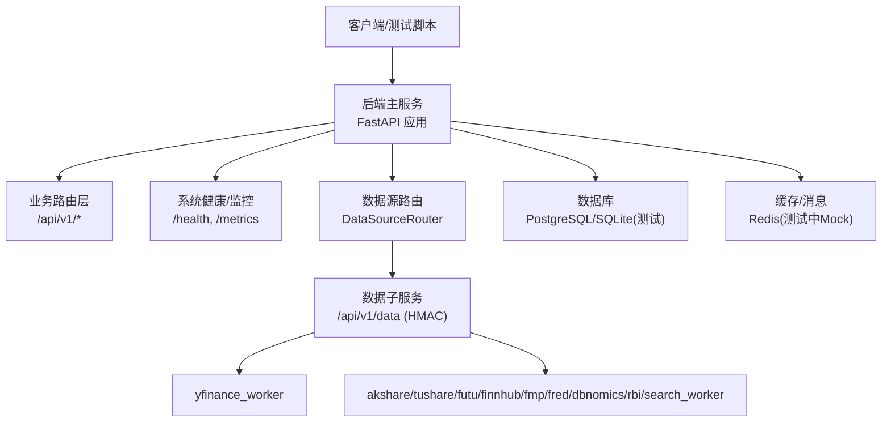
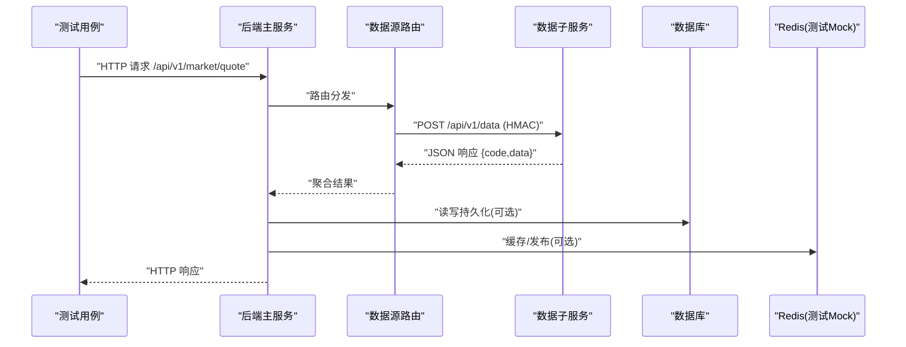
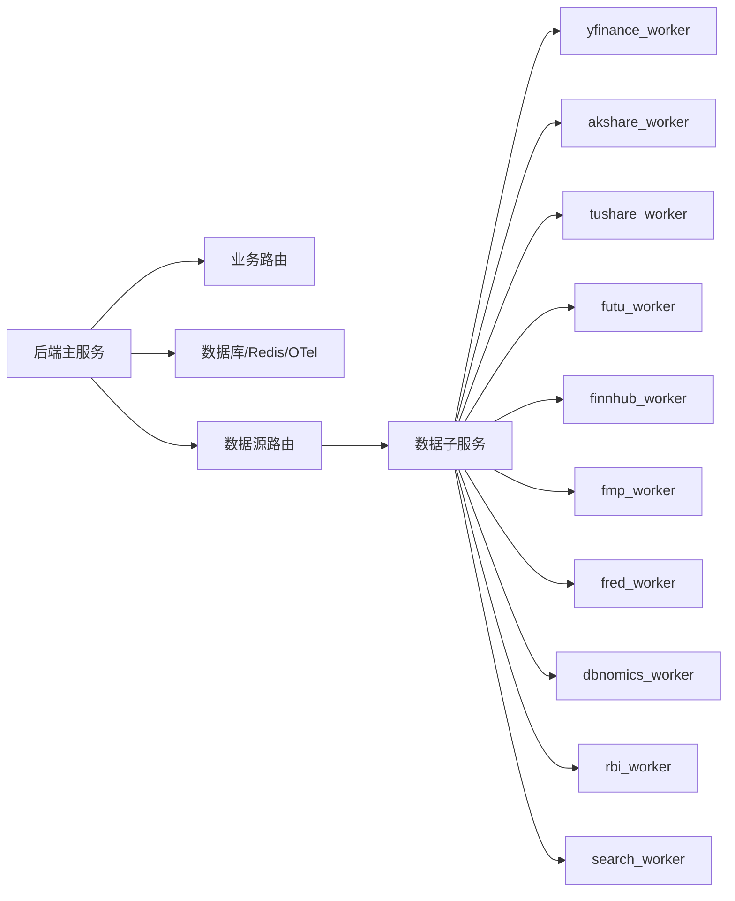

# 集成测试方案

<cite>
**本文引用的文件**
- [backend/tests/conftest.py](file://backend/tests/conftest.py)
- [backend/main.py](file://backend/main.py)
- [data_subservice/main.py](file://data_subservice/main.py)
- [scripts/locust_ws_stress.py](file://scripts/locust_ws_stress.py)
- [scripts/final_integration_test_real_data.py](file://scripts/final_integration_test_real_data.py)
- [data_subservice/pytest.ini](file://data_subservice/pytest.ini)
</cite>

## 目录
1. [引言](#引言)
2. [项目结构](#项目结构)
3. [核心组件](#核心组件)
4. [架构总览](#架构总览)
5. [详细组件分析](#详细组件分析)
6. [依赖关系分析](#依赖关系分析)
7. [性能考量](#性能考量)
8. [故障排查指南](#故障排查指南)
9. [结论](#结论)
10. [附录](#附录)

## 引言
本方案面向 Quant Agent 项目的端到端集成测试，覆盖 API 集成、数据库集成、消息队列（Redis）集成、微服务间通信（数据源子服务、OMS、AI 代理），并提供契约测试、性能基准与负载测试方法。文档基于仓库现有代码与测试基础设施，给出可执行的流程与环境搭建建议，确保在隔离环境中稳定复现问题并验证接口兼容性。

## 项目结构
Quant Agent 采用主服务 + 数据子服务的解耦架构：
- 主服务 backend：FastAPI 网关，挂载业务路由、中间件、异常处理、OpenAPI、OTel、CORS 等，统一对外暴露 /api/v1/* 接口。
- 数据子服务 data_subservice：独立 HTTP 服务，提供 /api/v1/data 统一入口，按能力门控（DS_CAPABILITIES）调度各数据源 worker，支持 HMAC 签名校验、Prometheus 指标与健康检查。
- 测试基础设施：backend/tests 下集中 pytest fixtures，自动 Mock Redis、外部数据源、鉴权旁路；data_subservice 有独立 pytest 配置以隔离重型 SDK。

图表来源
- [backend/main.py:125-218](file://backend/main.py#L125-L218)
- [data_subservice/main.py:189-234](file://data_subservice/main.py#L189-L234)

章节来源
- [backend/main.py:1-222](file://backend/main.py#L1-L222)
- [data_subservice/main.py:1-354](file://data_subservice/main.py#L1-L354)

## 核心组件
- 应用工厂与路由装配：create_app 组装 FastAPI 实例、注册中间件、挂载所有业务路由，统一 API 前缀。
- 数据子服务：/api/v1/data 通过 HMAC 校验请求头，按 DS_CAPABILITIES 门控能力，延迟导入重型 worker，返回统一 JSON 响应。
- 测试夹具：conftest.py 提供全局 Redis Mock、外部服务 Mock、数据库引擎释放、认证旁路、示例数据工厂、TestClient 等。
- 压力测试：Locust 脚本对 WebSocket 行情订阅与 REST API 进行并发压测，记录延迟与吞吐。
- 真实数据集成验证：脚本加载或生成市场数据，验证技术指标准确性、并发性能与流式计算稳定性。

章节来源
- [backend/main.py:125-218](file://backend/main.py#L125-L218)
- [data_subservice/main.py:70-234](file://data_subservice/main.py#L70-L234)
- [backend/tests/conftest.py:24-175](file://backend/tests/conftest.py#L24-L175)
- [scripts/locust_ws_stress.py:1-262](file://scripts/locust_ws_stress.py#L1-L262)
- [scripts/final_integration_test_real_data.py:1-412](file://scripts/final_integration_test_real_data.py#L1-L412)

## 架构总览
下图展示从测试到主服务再到数据子服务的调用链，以及数据库与缓存的交互路径。

图表来源
- [backend/main.py:162-210](file://backend/main.py#L162-L210)
- [data_subservice/main.py:189-234](file://data_subservice/main.py#L189-L234)

## 详细组件分析

### API 集成测试
- 目标：验证主服务对外暴露的 /api/v1/* 接口行为正确性，包括鉴权旁路、参数校验、错误码、跨域、日志。
- 实现要点：
  - 使用 TestClient/AsyncClient 直接调用 create_app() 构建的应用实例，避免启动真实进程。
  - 利用 conftest 中的 _auth_bypass_for_tests 对特定前缀绕过鉴权，保证测试聚焦业务逻辑。
  - 通过 mock_db、mock_httpx、mock_redis 等夹具隔离外部依赖。
- 关键路径参考：
  - 应用创建与路由挂载：[backend/main.py:125-218](file://backend/main.py#L125-L218)
  - 测试客户端夹具：[backend/tests/conftest.py:355-375](file://backend/tests/conftest.py#L355-L375)
  - 鉴权旁路机制：[backend/tests/conftest.py:585-678](file://backend/tests/conftest.py#L585-L678)

章节来源
- [backend/main.py:125-218](file://backend/main.py#L125-L218)
- [backend/tests/conftest.py:355-375](file://backend/tests/conftest.py#L355-L375)
- [backend/tests/conftest.py:585-678](file://backend/tests/conftest.py#L585-L678)

### 数据库集成测试
- 目标：验证 ORM 模型、迁移、查询与事务在测试环境下的正确性与隔离性。
- 实现要点：
  - 强制 SQLite 内存库用于测试，避免 CI 中 PostgreSQL 依赖导致的类型编译失败。
  - 包装 create_engine/create_async_engine 跟踪并释放引擎，消除资源警告。
  - 会话级隔离：每个测试使用独立 session，结束后统一 dispose。
- 关键路径参考：
  - 测试环境变量与 SQLite 强制：[backend/tests/conftest.py:155-175](file://backend/tests/conftest.py#L155-L175)
  - 引擎跟踪与释放：[backend/tests/conftest.py:36-98](file://backend/tests/conftest.py#L36-L98)

章节来源
- [backend/tests/conftest.py:36-98](file://backend/tests/conftest.py#L36-L98)
- [backend/tests/conftest.py:155-175](file://backend/tests/conftest.py#L155-L175)

### 消息队列集成测试（Redis）
- 目标：验证缓存、发布/订阅、流水线操作在测试环境的行为一致性。
- 实现要点：
  - 在模块导入前 patch redis.asyncio.Redis，防止真实连接。
  - 全局 autouse fixture 动态 patch 已知模块中的 redis_client/l1_cached_redis/redis_batch_writer，注入 AsyncMock 行为（get/set/delete/exists/expire/pipeline/pubsub）。
  - 保持 ping 正常返回，确保健康检查不受影响。
- 关键路径参考：
  - Redis 全局 Mock 与补丁列表：[backend/tests/conftest.py:100-268](file://backend/tests/conftest.py#L100-L268)

章节来源
- [backend/tests/conftest.py:100-268](file://backend/tests/conftest.py#L100-L268)

### 微服务间通信（数据源子服务、OMS、AI 代理）
- 数据源子服务：
  - HMAC 签名校验：要求 X-Timestamp 与 X-Signature，时间戳有效期限制，防重放。
  - 能力门控：DS_CAPABILITIES 控制可用数据源，未声明能力返回 503。
  - 延迟导入：重型 SDK 仅在请求时 import，缺失返回 503。
- OMS/AI 代理：
  - 通过主服务路由转发至对应服务或内部处理器；测试中可通过依赖注入替换为 Mock。
- 关键路径参考：
  - HMAC 校验与 /api/v1/data：[data_subservice/main.py:70-234](file://data_subservice/main.py#L70-L234)
  - 能力门控与 worker 路由：[data_subservice/main.py:175-234](file://data_subservice/main.py#L175-L234)

章节来源
- [data_subservice/main.py:70-234](file://data_subservice/main.py#L70-L234)

### 契约测试（接口兼容性）
- 目标：确保主服务与数据子服务之间的接口契约稳定，避免上游变更导致下游失败。
- 实现要点：
  - 针对 /api/v1/data 的请求体结构（source/action/params）与响应结构（{code,data}）编写断言。
  - 对 HMAC 校验失败、时间戳过期、能力未启用等边界场景进行覆盖。
  - 结合 OpenAPI 描述与测试用例，形成契约基线。
- 关键路径参考：
  - 统一数据端点与响应格式：[data_subservice/main.py:189-234](file://data_subservice/main.py#L189-L234)

章节来源
- [data_subservice/main.py:189-234](file://data_subservice/main.py#L189-L234)

### 性能基准测试与负载测试
- WebSocket 行情订阅：
  - 使用 Locust 模拟多用户连接 /ws/quotes，订阅多个标的，持续接收消息并统计延迟。
  - 支持分布式 master/worker 模式与无头运行，输出 CSV 报告。
- REST API 压测：
  - 对 /api/v1/health、/api/v1/market/quote、/api/v1/market/kline、/api/v1/screener/screen 进行并发访问。
- 关键路径参考：
  - WebSocket 压测脚本：[scripts/locust_ws_stress.py:1-262](file://scripts/locust_ws_stress.py#L1-L262)

章节来源
- [scripts/locust_ws_stress.py:1-262](file://scripts/locust_ws_stress.py#L1-L262)

### 真实数据集成验证
- 目标：使用本地 K 线仓库或合成数据，验证技术指标准确性、并发性能与流式计算稳定性。
- 实现要点：
  - 加载或生成历史数据，计算 RSI/MACD/Bollinger/ATR/ADX/CCI/VWMA/Elder-Ray 等指标。
  - 并发场景：多 ticker 并行计算，统计平均/最小/最大耗时。
  - 实时流式：滚动窗口增量计算，评估延迟与稳定性。
- 关键路径参考：
  - 真实数据加载与合成：[scripts/final_integration_test_real_data.py:17-83](file://scripts/final_integration_test_real_data.py#L17-L83)
  - 指标准确性验证：[scripts/final_integration_test_real_data.py:86-213](file://scripts/final_integration_test_real_data.py#L86-L213)
  - 并发与流式性能：[scripts/final_integration_test_real_data.py:216-317](file://scripts/final_integration_test_real_data.py#L216-L317)

章节来源
- [scripts/final_integration_test_real_data.py:17-317](file://scripts/final_integration_test_real_data.py#L17-L317)

## 依赖关系分析
- 主服务依赖：
  - 路由层：大量业务路由（market、oms、trade、screener、strategy、risk、paper、eval 等）。
  - 基础设施：数据库、Redis、OTel、Structlog、CORS、异常处理。
- 数据子服务依赖：
  - 内部模块：circuit_breaker、logger、metrics、redis_client、service_registry。
  - Worker：yfinance、akshare、tushare、futu、finnhub、fmp、fred、dbnomics、rbi、search_worker。
- 测试依赖：
  - pytest、httpx、websockets、locust、numpy、pandas。
  - 夹具提供数据库、Redis、HTTP、认证、外部服务 Mock。

图表来源
- [backend/main.py:162-210](file://backend/main.py#L162-L210)
- [data_subservice/main.py:35-47](file://data_subservice/main.py#L35-L47)

章节来源
- [backend/main.py:162-210](file://backend/main.py#L162-L210)
- [data_subservice/main.py:35-47](file://data_subservice/main.py#L35-L47)

## 性能考量
- WebSocket 订阅：
  - 目标：P95 延迟 < 100ms，支持高并发连接与消息吞吐。
  - 方法：Locust 模拟 1000 用户，随机订阅热门标的，记录连接与接收延迟。
- REST API：
  - 目标：健康检查、行情查询、K 线查询、筛选器接口在高并发下的稳定性。
  - 方法：Locust HttpUser 对关键端点进行加权任务执行，捕获响应状态与耗时。
- 指标采集：
  - 数据子服务暴露 /metrics 供 Prometheus 抓取，包含线程水位等进程级指标。

章节来源
- [scripts/locust_ws_stress.py:1-262](file://scripts/locust_ws_stress.py#L1-L262)
- [data_subservice/main.py:242-256](file://data_subservice/main.py#L242-L256)

## 故障排查指南
- 鉴权失败：
  - 确认测试环境已启用鉴权旁路前缀，避免 401 阻断业务测试。
  - 参考：[backend/tests/conftest.py:585-678](file://backend/tests/conftest.py#L585-L678)
- Redis 连接问题：
  - 测试中已全局 Mock Redis，若出现健康检查异常，检查 ping 返回值与 pipeline 行为。
  - 参考：[backend/tests/conftest.py:100-268](file://backend/tests/conftest.py#L100-L268)
- 数据子服务能力未启用：
  - 检查 DS_CAPABILITIES 是否包含所需 source，否则返回 503。
  - 参考：[data_subservice/main.py:175-208](file://data_subservice/main.py#L175-L208)
- HMAC 校验失败：
  - 确认 X-Timestamp 与 X-Signature 正确，时间戳在有效期内。
  - 参考：[data_subservice/main.py:70-88](file://data_subservice/main.py#L70-L88)
- 数据库资源泄漏：
  - 使用引擎跟踪与释放夹具，避免 ResourceWarning 干扰测试结果。
  - 参考：[backend/tests/conftest.py:36-98](file://backend/tests/conftest.py#L36-L98)

章节来源
- [backend/tests/conftest.py:36-98](file://backend/tests/conftest.py#L36-L98)
- [backend/tests/conftest.py:100-268](file://backend/tests/conftest.py#L100-L268)
- [backend/tests/conftest.py:585-678](file://backend/tests/conftest.py#L585-L678)
- [data_subservice/main.py:70-88](file://data_subservice/main.py#L70-L88)
- [data_subservice/main.py:175-208](file://data_subservice/main.py#L175-L208)

## 结论
本集成测试方案基于仓库现有基础设施，覆盖了 API、数据库、Redis、微服务通信、契约与性能测试的关键环节。通过集中化的测试夹具与独立的子服务测试配置，能够在隔离环境中稳定执行端到端验证。建议将契约测试纳入 CI 门禁，结合性能基准与负载测试，持续提升系统的可靠性与可观测性。

## 附录

### 测试环境搭建指南
- 数据库：
  - 测试环境强制 SQLite 内存库，避免 PG 扩展依赖；生产环境使用 PostgreSQL 并启用 pgvector/pg_trgm。
  - 参考：[backend/tests/conftest.py:155-175](file://backend/tests/conftest.py#L155-L175)、[backend/main.py:32-56](file://backend/main.py#L32-L56)
- Redis：
  - 测试中全局 Mock，无需真实实例；生产环境需配置 host/port/password。
  - 参考：[backend/tests/conftest.py:100-268](file://backend/tests/conftest.py#L100-L268)
- 外部服务：
  - 默认 Mock Futu/yfinance 等外部数据源；可通过标记 no_mock_external 或环境变量禁用 Mock 进行真实网络测试。
  - 参考：[backend/tests/conftest.py:271-295](file://backend/tests/conftest.py#L271-L295)
- 数据子服务：
  - 独立部署，设置 DS_CAPABILITIES 声明能力；启用 ENABLE_REDIS_HEARTBEAT 向主 Redis 注册心跳。
  - 参考：[data_subservice/main.py:51-58](file://data_subservice/main.py#L51-L58)、[data_subservice/main.py:290-300](file://data_subservice/main.py#L290-L300)

章节来源
- [backend/tests/conftest.py:155-175](file://backend/tests/conftest.py#L155-L175)
- [backend/main.py:32-56](file://backend/main.py#L32-L56)
- [backend/tests/conftest.py:271-295](file://backend/tests/conftest.py#L271-L295)
- [data_subservice/main.py:51-58](file://data_subservice/main.py#L51-L58)
- [data_subservice/main.py:290-300](file://data_subservice/main.py#L290-L300)

### 测试数据管理
- 示例数据工厂：提供 quote/kline/order/position/user 等样例数据生成器。
- 真实数据：优先从 K 线仓库加载，若无则生成合成数据用于指标验证。
- 参考：
  - 工厂类：[backend/tests/conftest.py:499-582](file://backend/tests/conftest.py#L499-L582)
  - 真实数据加载与合成：[scripts/final_integration_test_real_data.py:17-83](file://scripts/final_integration_test_real_data.py#L17-L83)

章节来源
- [backend/tests/conftest.py:499-582](file://backend/tests/conftest.py#L499-L582)
- [scripts/final_integration_test_real_data.py:17-83](file://scripts/final_integration_test_real_data.py#L17-L83)

### 测试环境隔离
- 数据库隔离：每个测试使用独立 session，结束后统一释放引擎。
- Redis 隔离：全局 Mock 提供内存字典存储，避免跨测试污染。
- 外部服务隔离：默认 Mock，可按需切换为真实网络。
- 参考：
  - 引擎释放：[backend/tests/conftest.py:36-98](file://backend/tests/conftest.py#L36-L98)
  - Redis Mock：[backend/tests/conftest.py:100-268](file://backend/tests/conftest.py#L100-L268)
  - 外部服务 Mock：[backend/tests/conftest.py:271-295](file://backend/tests/conftest.py#L271-L295)

章节来源
- [backend/tests/conftest.py:36-98](file://backend/tests/conftest.py#L36-L98)
- [backend/tests/conftest.py:100-268](file://backend/tests/conftest.py#L100-L268)
- [backend/tests/conftest.py:271-295](file://backend/tests/conftest.py#L271-L295)

### 测试结果分析
- 指标准确性：RSI/MACD/Bollinger/ATR/ADX/CCI/VWMA/Elder-Ray 的范围与公式校验。
- 并发性能：多 ticker 并行计算的平均/最小/最大耗时统计。
- 流式稳定性：滚动窗口计算的延迟均值与标准差。
- 参考：
  - 准确性验证：[scripts/final_integration_test_real_data.py:86-213](file://scripts/final_integration_test_real_data.py#L86-L213)
  - 并发与流式：[scripts/final_integration_test_real_data.py:216-317](file://scripts/final_integration_test_real_data.py#L216-L317)

章节来源
- [scripts/final_integration_test_real_data.py:86-317](file://scripts/final_integration_test_real_data.py#L86-L317)

### 完整执行流程
- 单元测试与集成测试：
  - 在主工程运行 pytest，自动应用 conftest 夹具与标记。
  - 数据子服务独立运行 pytest，使用其 pytest.ini 配置。
  - 参考：[data_subservice/pytest.ini:17-36](file://data_subservice/pytest.ini#L17-L36)
- 端到端验证：
  - 启动主服务与数据子服务，执行真实数据集成脚本，验证指标与性能。
  - 参考：[scripts/final_integration_test_real_data.py:320-412](file://scripts/final_integration_test_real_data.py#L320-L412)
- 负载测试：
  - 使用 Locust 对 WebSocket 与 REST API 进行压测，收集报告。
  - 参考：[scripts/locust_ws_stress.py:1-262](file://scripts/locust_ws_stress.py#L1-L262)

章节来源
- [data_subservice/pytest.ini:17-36](file://data_subservice/pytest.ini#L17-L36)
- [scripts/final_integration_test_real_data.py:320-412](file://scripts/final_integration_test_real_data.py#L320-L412)
- [scripts/locust_ws_stress.py:1-262](file://scripts/locust_ws_stress.py#L1-L262)
