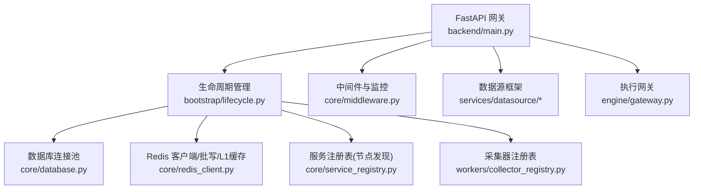
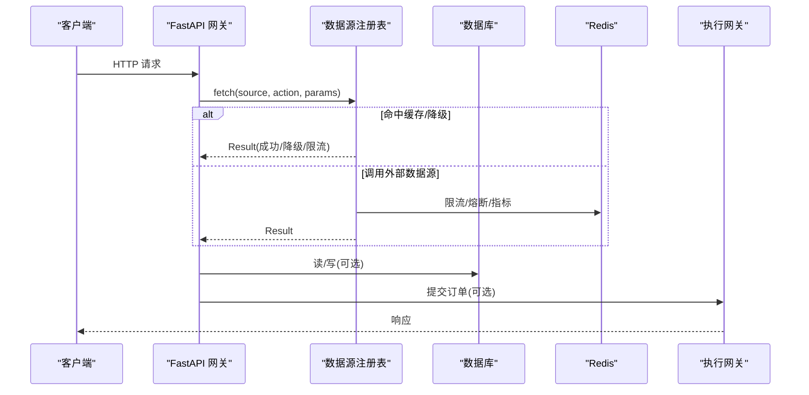
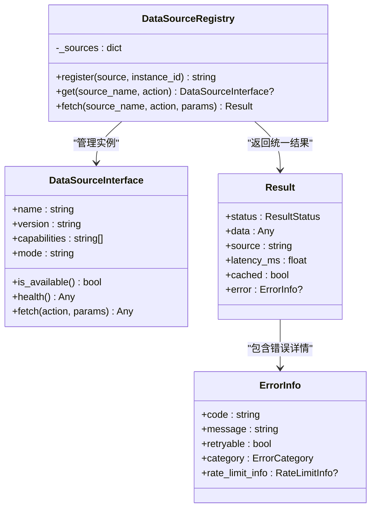
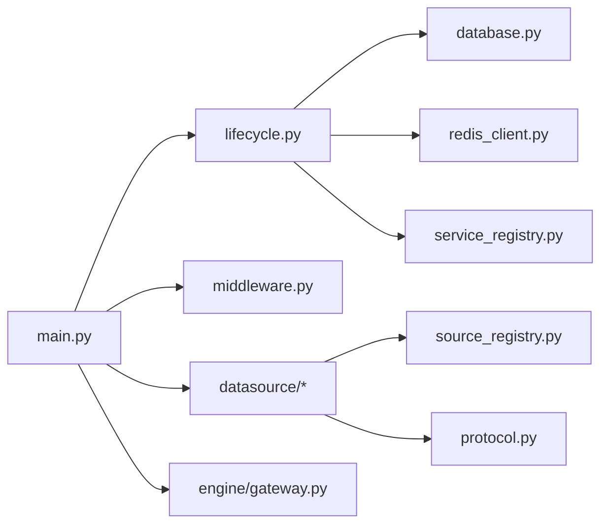

# 扩展性设计

<cite>
**本文引用的文件**
- [backend/main.py](file://backend/main.py)
- [backend/core/config.py](file://backend/core/config.py)
- [backend/core/database.py](file://backend/core/database.py)
- [backend/core/redis_client.py](file://backend/core/redis_client.py)
- [backend/core/middleware.py](file://backend/core/middleware.py)
- [backend/bootstrap/lifecycle.py](file://backend/bootstrap/lifecycle.py)
- [backend/workers/collector_registry.py](file://backend/workers/collector_registry.py)
- [backend/services/datasource/__init__.py](file://backend/services/datasource/__init__.py)
- [backend/services/datasource/protocol.py](file://backend/services/datasource/protocol.py)
- [backend/services/datasource/source_registry.py](file://backend/services/datasource/source_registry.py)
- [backend/engine/gateway.py](file://backend/engine/gateway.py)
- [backend/core/service_registry.py](file://backend/core/service_registry.py)
</cite>

## 目录
1. [引言](#引言)
2. [项目结构](#项目结构)
3. [核心组件](#核心组件)
4. [架构总览](#架构总览)
5. [详细组件分析](#详细组件分析)
6. [依赖关系分析](#依赖关系分析)
7. [性能与扩展策略](#性能与扩展策略)
8. [故障排查指南](#故障排查指南)
9. [结论](#结论)
10. [附录：扩展点清单与最佳实践](#附录：扩展点清单与最佳实践)

## 引言
本文件面向“Quant Agent”系统的扩展性设计，聚焦水平扩展与垂直扩展能力、无状态服务设计、数据库读写分离、缓存集群、插件化架构（数据源适配器、交易接口、通知渠道等）、微服务解耦（边界划分、接口标准化、版本兼容）、横向扩展实现（负载均衡、会话共享、分布式锁）、性能扩展（异步处理、消息队列、连接池优化），以及扩展点的识别与测试验证方法。文档基于仓库中的后端主入口、配置、数据库、Redis、中间件、生命周期管理、采集器注册表、数据源协议与注册表、执行网关与服务注册表等源码进行系统化梳理。

## 项目结构
系统采用 FastAPI 作为 API 网关，通过路由模块化组织业务；核心基础设施集中在 core 层；数据源抽象与注册在 services/datasource 下；执行引擎与订单出口在 engine 层；后台任务与采集器在 workers 层；应用启动/销毁由 bootstrap/lifecycle 统一管理；配置集中由 core/config 提供强校验。

图表来源
- [backend/main.py:125-218](file://backend/main.py#L125-L218)
- [backend/bootstrap/lifecycle.py:42-151](file://backend/bootstrap/lifecycle.py#L42-L151)
- [backend/core/middleware.py:90-133](file://backend/core/middleware.py#L90-L133)
- [backend/core/database.py:1-67](file://backend/core/database.py#L1-L67)
- [backend/core/redis_client.py:1-252](file://backend/core/redis_client.py#L1-L252)
- [backend/core/service_registry.py:1-417](file://backend/core/service_registry.py#L1-L417)
- [backend/workers/collector_registry.py:1-124](file://backend/workers/collector_registry.py#L1-L124)

章节来源
- [backend/main.py:125-218](file://backend/main.py#L125-L218)
- [backend/bootstrap/lifecycle.py:42-151](file://backend/bootstrap/lifecycle.py#L42-L151)

## 核心组件
- 配置中心：统一环境变量加载与强校验，确保关键配置缺失时 fail-fast。
- 数据库层：同步/异步双引擎，连接池参数可配置，支持 SQLite/PostgreSQL。
- Redis 层：全局连接池、异步批量写入队列、进程内 L1 短效缓存，支撑高吞吐写入与热点读取。
- 服务注册表：基于 Redis Hash/ZSet/Set 的跨节点服务注册与心跳、优雅下线、统计指标。
- 数据源框架：统一 Protocol、错误分类、限流与熔断、源实例注册表与能力匹配。
- 执行网关：统一订单出口，回测/纸面/实盘模式路由，三级安全锁与幂等去重。
- 采集器注册表：插件式采集器工厂，按需启动守护进程。
- 中间件：请求访问日志、Prometheus 指标、外部 API 出站监控。

章节来源
- [backend/core/config.py:20-134](file://backend/core/config.py#L20-L134)
- [backend/core/database.py:1-67](file://backend/core/database.py#L1-L67)
- [backend/core/redis_client.py:1-252](file://backend/core/redis_client.py#L1-L252)
- [backend/core/service_registry.py:1-417](file://backend/core/service_registry.py#L1-L417)
- [backend/services/datasource/__init__.py:23-468](file://backend/services/datasource/__init__.py#L23-L468)
- [backend/services/datasource/protocol.py:1-47](file://backend/services/datasource/protocol.py#L1-L47)
- [backend/services/datasource/source_registry.py:1-259](file://backend/services/datasource/source_registry.py#L1-L259)
- [backend/engine/gateway.py:1-359](file://backend/engine/gateway.py#L1-L359)
- [backend/workers/collector_registry.py:1-124](file://backend/workers/collector_registry.py#L1-L124)
- [backend/core/middleware.py:1-133](file://backend/core/middleware.py#L1-L133)

## 架构总览
系统以 FastAPI 为无状态网关，所有业务逻辑下沉至服务与子服务；通过 Redis 实现跨进程/跨节点的共享状态（缓存、队列、注册表、心跳）；数据库提供持久化存储；采集器与后台任务通过生命周期管理器统一启停；数据源通过统一协议与注册表接入，屏蔽差异；执行网关将订单路由到回测/纸面/实盘执行器，保障安全与幂等。

图表来源
- [backend/main.py:125-218](file://backend/main.py#L125-L218)
- [backend/services/datasource/source_registry.py:140-259](file://backend/services/datasource/source_registry.py#L140-L259)
- [backend/engine/gateway.py:98-207](file://backend/engine/gateway.py#L98-L207)
- [backend/core/database.py:1-67](file://backend/core/database.py#L1-L67)
- [backend/core/redis_client.py:1-252](file://backend/core/redis_client.py#L1-L252)

## 详细组件分析

### 无状态服务设计与微服务解耦
- 网关无状态：所有状态外置到 Redis/DB，便于水平扩展与滚动升级。
- 路由模块化：每个业务域独立 router，统一前缀与 OpenAPI 标签，便于拆分微服务。
- 生命周期管理：启动阶段完成数据源适配器注册、默认管理员初始化、后台任务拉起；关闭阶段有序取消任务、释放连接。
- 中间件与可观测性：统一访问日志、Prometheus 指标、外部 API 出站监控，便于多实例观测与排障。

章节来源
- [backend/main.py:125-218](file://backend/main.py#L125-L218)
- [backend/bootstrap/lifecycle.py:42-151](file://backend/bootstrap/lifecycle.py#L42-L151)
- [backend/core/middleware.py:90-133](file://backend/core/middleware.py#L90-L133)

### 数据库读写分离与连接池优化
- 同步/异步双引擎：根据 URL 自动切换驱动，异步引擎用于高并发场景。
- 连接池参数可配置：pool_size、max_overflow、pool_timeout、pool_recycle、pool_pre_ping，避免连接泄漏与资源耗尽。
- SQLite 专用优化：单文件数据库无需复杂池化；PG/MySQL 启用预检查与回收。

章节来源
- [backend/core/database.py:1-67](file://backend/core/database.py#L1-L67)

### 缓存集群与共享状态
- Redis 连接池：统一 host/port/password 配置，限制最大连接数，防止打满。
- 异步批量写入：队列+Pipeline 批量落盘，降低 RTT 与带宽占用，支持优雅停机。
- 进程内 L1 缓存：热点配置/开关的本地短效缓存，减少远端 IO；容量保护与安全熔断。
- 服务注册表：基于 Redis 的节点注册、心跳、优雅下线、统计指标与集群总览。

章节来源
- [backend/core/redis_client.py:1-252](file://backend/core/redis_client.py#L1-L252)
- [backend/core/service_registry.py:1-417](file://backend/core/service_registry.py#L1-L417)

### 插件化架构：数据源适配器、交易接口、通知渠道
- 数据源协议：统一 DataSourceInterface，强制 name/version/capabilities/fetch/health/is_available，屏蔽实现差异。
- 源实例注册表：按名称维护多个实例，支持能力严格匹配与限流退避；失败不污染全局熔断（部分动作豁免）。
- 错误分类与限流：ErrorCategory 区分普通错误与限流类错误；RateLimitInfo/Status 提供细粒度限流信息；Throttler/Analyzer 协同工作。
- 采集器注册表：CollectorDef + factory 模式，新增采集器只需注册并实现工厂函数，零侵入启动。
- 交易接口：ExecutionGateway 统一订单出口，SimBrokerExecutor/OmsExecutionAdapter 分别承载回测/纸面与实盘路径，支持安全锁与降级。

图表来源
- [backend/services/datasource/protocol.py:1-47](file://backend/services/datasource/protocol.py#L1-L47)
- [backend/services/datasource/source_registry.py:1-259](file://backend/services/datasource/source_registry.py#L1-L259)
- [backend/services/datasource/__init__.py:23-468](file://backend/services/datasource/__init__.py#L23-L468)

章节来源
- [backend/services/datasource/protocol.py:1-47](file://backend/services/datasource/protocol.py#L1-L47)
- [backend/services/datasource/source_registry.py:1-259](file://backend/services/datasource/source_registry.py#L1-L259)
- [backend/services/datasource/__init__.py:23-468](file://backend/services/datasource/__init__.py#L23-L468)
- [backend/workers/collector_registry.py:1-124](file://backend/workers/collector_registry.py#L1-L124)
- [backend/engine/gateway.py:1-359](file://backend/engine/gateway.py#L1-L359)

### 横向扩展实现：负载均衡、会话共享、分布式锁
- 负载均衡：ServiceRegistry 支持按权重排序与能力/区域过滤，结合上游负载均衡器可实现多节点分发。
- 会话共享：所有状态外置 Redis，网关无状态，天然支持多实例部署。
- 分布式锁：可通过 Redis 原子操作实现（如采集器 HA daemon 使用），配合优雅下线与心跳检测保证一致性。

章节来源
- [backend/core/service_registry.py:188-229](file://backend/core/service_registry.py#L188-L229)
- [backend/core/redis_client.py:1-252](file://backend/core/redis_client.py#L1-L252)

### 性能扩展策略：异步处理、消息队列、连接池优化
- 异步优先：AsyncSession、asyncio 任务、后台协程（NAV 快照、OMS 持仓同步、WS 订阅回灌等）。
- 消息队列：Redis 作为轻量队列/总线，批量写入与 Pub/Sub 支撑高吞吐。
- 连接池优化：数据库连接池参数可调；Redis 连接池上限可控；外部 API 出站监控与慢请求告警。

章节来源
- [backend/bootstrap/lifecycle.py:153-231](file://backend/bootstrap/lifecycle.py#L153-L231)
- [backend/core/redis_client.py:46-177](file://backend/core/redis_client.py#L46-L177)
- [backend/core/middleware.py:26-88](file://backend/core/middleware.py#L26-L88)

## 依赖关系分析
- main.py 负责挂载路由与中间件，依赖 lifecycle 完成启动/销毁流程。
- lifecycle 依赖 database、redis、各服务模块，统一拉起后台任务。
- datasource 框架通过 protocol 与 registry 解耦具体实现，source_registry 集成限流与熔断。
- gateway 依赖 oms_service 与 futu_service（通过路由或注入），实现订单路由与安全锁。
- service_registry 依赖 redis_client，提供跨节点注册与心跳。

图表来源
- [backend/main.py:125-218](file://backend/main.py#L125-L218)
- [backend/bootstrap/lifecycle.py:42-151](file://backend/bootstrap/lifecycle.py#L42-L151)
- [backend/core/middleware.py:90-133](file://backend/core/middleware.py#L90-L133)
- [backend/core/database.py:1-67](file://backend/core/database.py#L1-L67)
- [backend/core/redis_client.py:1-252](file://backend/core/redis_client.py#L1-L252)
- [backend/core/service_registry.py:1-417](file://backend/core/service_registry.py#L1-L417)
- [backend/services/datasource/source_registry.py:1-259](file://backend/services/datasource/source_registry.py#L1-L259)
- [backend/services/datasource/protocol.py:1-47](file://backend/services/datasource/protocol.py#L1-L47)
- [backend/engine/gateway.py:1-359](file://backend/engine/gateway.py#L1-L359)

章节来源
- [backend/main.py:125-218](file://backend/main.py#L125-L218)
- [backend/bootstrap/lifecycle.py:42-151](file://backend/bootstrap/lifecycle.py#L42-L151)
- [backend/services/datasource/source_registry.py:1-259](file://backend/services/datasource/source_registry.py#L1-L259)
- [backend/engine/gateway.py:1-359](file://backend/engine/gateway.py#L1-L359)

## 性能与扩展策略
- 水平扩展：无状态网关 + Redis 共享状态 + ServiceRegistry 节点发现，支持多实例横向扩容。
- 垂直扩展：连接池调优、异步 IO、批量写入、L1 缓存，提升单机吞吐与延迟。
- 弹性与韧性：限流退避、熔断豁免、健康探针、优雅下线，增强系统鲁棒性。
- 可观测性：Prometheus 指标、结构化日志、外部 API 出站监控，便于容量规划与瓶颈定位。

[本节为通用指导，不直接分析具体文件]

## 故障排查指南
- 启动失败：检查配置必填项（DATABASE_URL、EMBEDDING_API_KEY 等），确认数据库/Redis 连通性。
- 数据源异常：查看 ErrorCategory 与 RateLimitStatus，区分限流/配额耗尽/IP 封禁；关注 source_registry 的指标与降级路径。
- 订单异常：检查 ExecutionGateway 的安全锁状态（REAL_TRADE_EXECUTE、trading_mode、kill_switch），确认幂等去重与降级行为。
- 性能问题：通过中间件 Prometheus 指标与外部 API 监控定位慢请求；调整连接池与批量写入参数。

章节来源
- [backend/core/config.py:94-134](file://backend/core/config.py#L94-L134)
- [backend/services/datasource/__init__.py:23-468](file://backend/services/datasource/__init__.py#L23-L468)
- [backend/engine/gateway.py:43-65](file://backend/engine/gateway.py#L43-L65)
- [backend/core/middleware.py:90-133](file://backend/core/middleware.py#L90-L133)

## 结论
Quant Agent 通过无状态网关、Redis 共享状态、统一数据源协议与注册表、执行网关安全锁与降级、插件化采集器与后台任务，构建了高可扩展、高可用、易演进的架构。水平扩展依赖服务注册与缓存集群，垂直扩展依赖异步 IO 与连接池优化。扩展点清晰、接口标准化、版本兼容性强，便于快速添加新功能模块并进行测试验证。

[本节为总结，不直接分析具体文件]

## 附录：扩展点清单与最佳实践
- 新增数据源适配器
  - 实现 DataSourceInterface（name/version/capabilities/fetch/health/is_available）。
  - 通过 DataSourceRegistry.register 注册实例，声明 capabilities 以便能力匹配。
  - 遵循错误分类与限流规范，返回 Result。
  - 参考路径：[backend/services/datasource/protocol.py:1-47](file://backend/services/datasource/protocol.py#L1-L47)、[backend/services/datasource/source_registry.py:55-73](file://backend/services/datasource/source_registry.py#L55-L73)。

- 新增采集器
  - 在 workers/collectors 下实现 start 工厂函数，返回协程序列。
  - 在 collector_registry.COLLECTORS 中注册 CollectorDef。
  - 参考路径：[backend/workers/collector_registry.py:35-85](file://backend/workers/collector_registry.py#L35-L85)。

- 新增通知渠道
  - 在 alert_adapters 下实现通知适配器，遵循统一接口。
  - 通过通知服务注册与路由。
  - 参考路径：[backend/bootstrap/lifecycle.py:151-151](file://backend/bootstrap/lifecycle.py#L151-L151)（通知服务初始化）。

- 扩展交易接口
  - 实现 OrderExecutor 协议（submit/cancel），通过 ExecutionGateway 路由到 SimBroker 或 OMS 适配器。
  - 遵守安全锁与幂等去重机制。
  - 参考路径：[backend/engine/gateway.py:67-96](file://backend/engine/gateway.py#L67-L96)、[backend/engine/gateway.py:98-207](file://backend/engine/gateway.py#L98-L207)。

- 水平扩展与负载均衡
  - 利用 ServiceRegistry 的能力/区域/权重过滤，结合上游 LB 实现多节点分发。
  - 保持网关无状态，状态外置 Redis。
  - 参考路径：[backend/core/service_registry.py:188-229](file://backend/core/service_registry.py#L188-L229)。

- 性能优化建议
  - 调整数据库连接池参数（pool_size、max_overflow、pool_timeout）。
  - 使用 Redis 异步批量写入与 L1 缓存降低 RTT。
  - 开启外部 API 出站监控，定位慢请求。
  - 参考路径：[backend/core/database.py:14-25](file://backend/core/database.py#L14-L25)、[backend/core/redis_client.py:46-177](file://backend/core/redis_client.py#L46-L177)、[backend/core/middleware.py:26-88](file://backend/core/middleware.py#L26-L88)。

- 测试与验证方法
  - 单元测试：针对数据源适配器、采集器工厂、执行网关安全锁与幂等去重。
  - 集成测试：验证数据源注册、限流退避、熔断豁免、Redis 批写与 L1 缓存一致性。
  - 压测：通过 Prometheus 指标与外部 API 监控评估吞吐与延迟。
  - 参考路径：[backend/services/datasource/source_registry.py:140-259](file://backend/services/datasource/source_registry.py#L140-L259)、[backend/core/redis_client.py:176-177](file://backend/core/redis_client.py#L176-L177)。