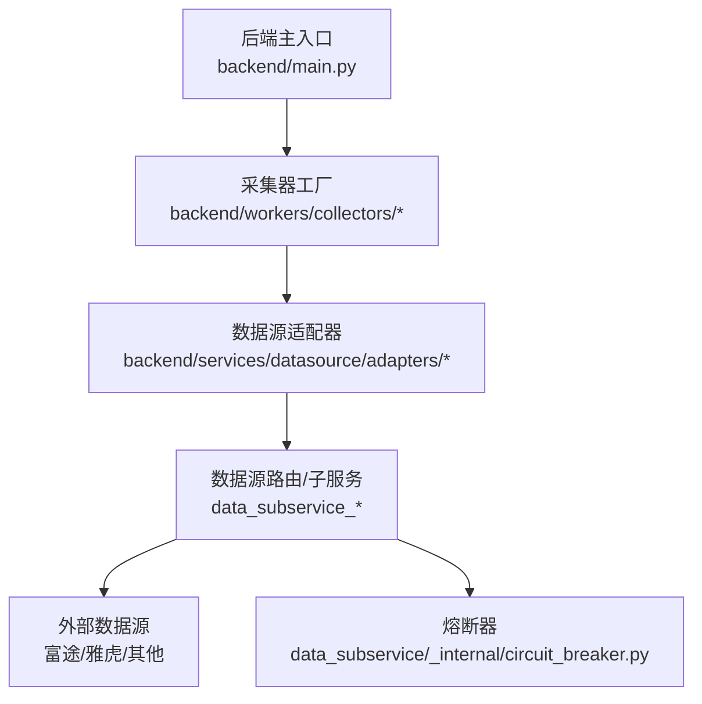
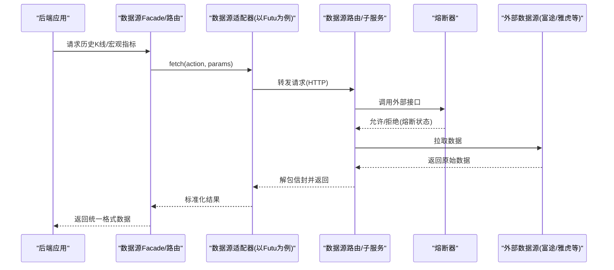
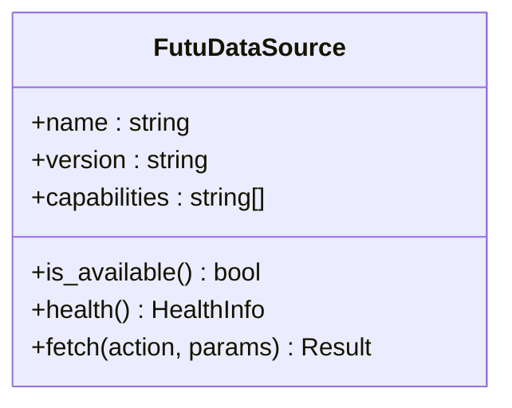
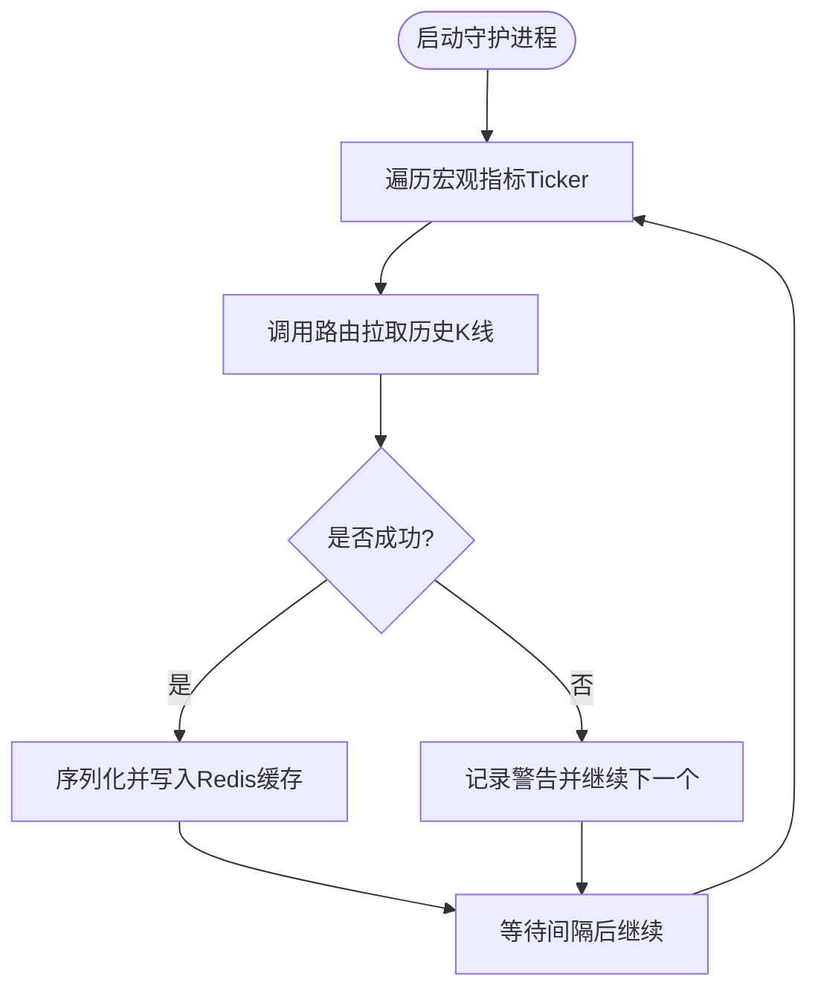
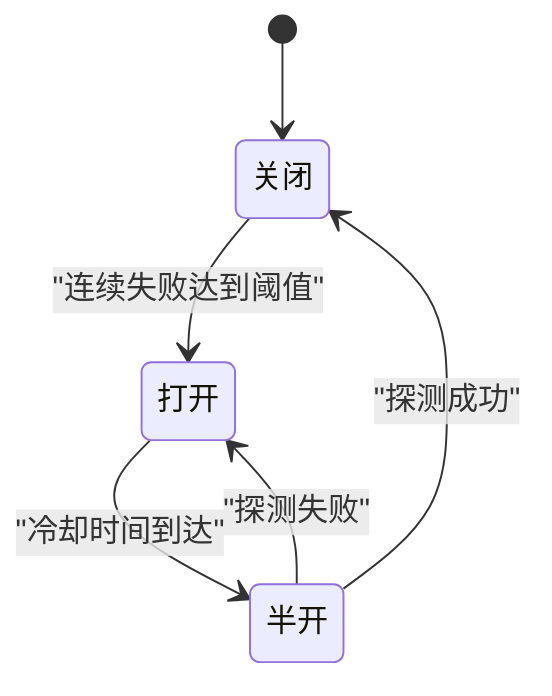
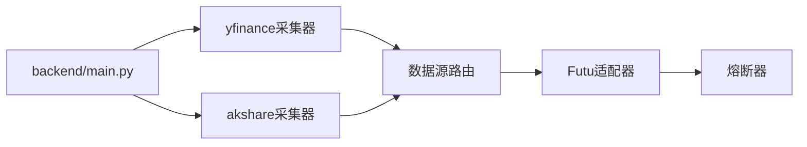

# ETL流水线

<cite>
**本文引用的文件**
- [backend/main.py](file://backend/main.py)
- [backend/workers/collectors/yfinance.py](file://backend/workers/collectors/yfinance.py)
- [backend/workers/collectors/akshare.py](file://backend/workers/collectors/akshare.py)
- [backend/services/datasource/adapters/futu.py](file://backend/services/datasource/adapters/futu.py)
- [data_subservice/_internal/circuit_breaker.py](file://data_subservice/_internal/circuit_breaker.py)
</cite>

## 目录
1. [简介](#简介)
2. [项目结构](#项目结构)
3. [核心组件](#核心组件)
4. [架构总览](#架构总览)
5. [详细组件分析](#详细组件分析)
6. [依赖关系分析](#依赖关系分析)
7. [性能考虑](#性能考虑)
8. [故障排查指南](#故障排查指南)
9. [结论](#结论)
10. [附录](#附录)

## 简介
本文件面向Quant Agent系统的ETL流水线，聚焦历史数据的采集、清洗、转换与入库流程。系统通过多数据源（富途、雅虎财经等）接入行情与宏观指标，经统一适配器与路由层进行标准化处理，并以增量更新策略写入存储；同时提供降级机制、质量检查点与错误恢复策略，保障高可用与数据一致性。

## 项目结构
- 后端主入口负责应用装配、中间件与路由挂载，为ETL相关API与工作进程提供运行环境。
- 采集器工厂按数据源组织，启动对应daemon或中继任务。
- 数据源适配器将外部服务封装为统一接口，供上层Facade与业务调用。
- 子服务内部熔断器用于保护外部依赖，实现快速失败与自动恢复。

图表来源
- [backend/main.py:125-218](file://backend/main.py#L125-L218)
- [backend/workers/collectors/yfinance.py:1-95](file://backend/workers/collectors/yfinance.py#L1-L95)
- [backend/services/datasource/adapters/futu.py:1-199](file://backend/services/datasource/adapters/futu.py#L1-L199)
- [data_subservice/_internal/circuit_breaker.py:1-296](file://data_subservice/_internal/circuit_breaker.py#L1-L296)

章节来源
- [backend/main.py:125-218](file://backend/main.py#L125-L218)

## 核心组件
- 数据源适配器：对外暴露统一能力集（如HISTORY、QUOTE、基本面等），屏蔽不同数据源的差异。
- 采集器工厂：按数据源启动守护进程或中继任务，周期性拉取并缓存数据。
- 熔断器：对下游外部服务进行限流与故障隔离，支持半开探测与自动恢复。
- 路由与注册：将各适配器注册到统一注册表，由Facade根据动作选择合适的数据源。

章节来源
- [backend/services/datasource/adapters/futu.py:34-199](file://backend/services/datasource/adapters/futu.py#L34-L199)
- [backend/workers/collectors/yfinance.py:1-95](file://backend/workers/collectors/yfinance.py#L1-L95)
- [backend/workers/collectors/akshare.py:1-14](file://backend/workers/collectors/akshare.py#L1-L14)
- [data_subservice/_internal/circuit_breaker.py:45-296](file://data_subservice/_internal/circuit_breaker.py#L45-L296)

## 架构总览
ETL流水线从多数据源采集原始数据，经适配器标准化后，通过路由层调度至目标存储或缓存；采集侧采用守护进程周期刷新，配合熔断器保障稳定性。

图表来源
- [backend/services/datasource/adapters/futu.py:130-180](file://backend/services/datasource/adapters/futu.py#L130-L180)
- [data_subservice/_internal/circuit_breaker.py:111-171](file://data_subservice/_internal/circuit_breaker.py#L111-L171)

## 详细组件分析

### 富途数据源适配器（FutuDataSource）
- 职责：将富途数据能力抽象为统一接口，声明支持的action集合，并通过路由层远程访问富途OpenD。
- 关键行为：
  - 能力声明：包含HISTORY、QUOTE、基本面、期权链等能力，确保Facade能正确路由。
  - 健康检测：返回远程节点状态、错误计数与能力列表。
  - 数据获取：调用路由层fetch_futu，循环剥离嵌套信封，最终返回标准化数据。
  - 限流与错误：识别限流错误并标记rate limited；部分非关键能力失败不触发熔断。

图表来源
- [backend/services/datasource/adapters/futu.py:34-199](file://backend/services/datasource/adapters/futu.py#L34-L199)

章节来源
- [backend/services/datasource/adapters/futu.py:34-199](file://backend/services/datasource/adapters/futu.py#L34-L199)

### 雅虎财经宏观指标采集器（yfinance collector）
- 职责：周期性拉取宏观指标历史K线，写入Redis缓存供读侧消费。
- 关键行为：
  - 资产清单：维护覆盖大类资产与情绪风向标的ticker列表。
  - 拉取逻辑：通过数据源路由调用history接口，解析K线记录并缓存。
  - 容错：单次失败仅记录警告，不影响整体循环。

图表来源
- [backend/workers/collectors/yfinance.py:55-90](file://backend/workers/collectors/yfinance.py#L55-L90)

章节来源
- [backend/workers/collectors/yfinance.py:1-95](file://backend/workers/collectors/yfinance.py#L1-L95)

### AKShare采集器工厂（akshare collector）
- 职责：启动AKShare采集的Redis中继daemon，将采集任务交由独立工作进程执行。
- 关键行为：
  - 启动时打印日志标识模式。
  - 返回协程列表供事件循环调度。

章节来源
- [backend/workers/collectors/akshare.py:1-14](file://backend/workers/collectors/akshare.py#L1-L14)

### 熔断器（Circuit Breaker）
- 职责：保护外部依赖，避免雪崩；支持关闭、打开、半开三种状态与自动恢复。
- 关键行为：
  - 状态机：基于失败次数与冷却时间切换状态。
  - 限流识别：跳过限流类错误的失败计数，避免误熔断。
  - 探测恢复：半开状态下允许试探性调用，成功后恢复关闭。
  - 配置：最大失败次数与冷却时间可通过环境变量调整。

图表来源
- [data_subservice/_internal/circuit_breaker.py:45-171](file://data_subservice/_internal/circuit_breaker.py#L45-L171)

章节来源
- [data_subservice/_internal/circuit_breaker.py:45-296](file://data_subservice/_internal/circuit_breaker.py#L45-L296)

## 依赖关系分析
- 后端主入口依赖采集器工厂与数据源适配器，完成应用生命周期与路由装配。
- 采集器工厂依赖数据源路由，间接调用外部数据源。
- 数据源适配器依赖路由层与熔断器，保证调用的健壮性。
- 熔断器作为通用基础设施，被多个外部调用点复用。

图表来源
- [backend/main.py:125-218](file://backend/main.py#L125-L218)
- [backend/workers/collectors/yfinance.py:55-90](file://backend/workers/collectors/yfinance.py#L55-L90)
- [backend/workers/collectors/akshare.py:9-13](file://backend/workers/collectors/akshare.py#L9-L13)
- [backend/services/datasource/adapters/futu.py:130-180](file://backend/services/datasource/adapters/futu.py#L130-L180)
- [data_subservice/_internal/circuit_breaker.py:111-171](file://data_subservice/_internal/circuit_breaker.py#L111-L171)

章节来源
- [backend/main.py:125-218](file://backend/main.py#L125-L218)
- [backend/services/datasource/adapters/futu.py:130-180](file://backend/services/datasource/adapters/futu.py#L130-L180)

## 性能考虑
- 批量与缓存：宏观指标按ticker批量拉取并缓存至Redis，降低重复请求压力。
- 异步与并发：采集器使用异步协程，提升吞吐；熔断器减少无效调用。
- 限流识别：跳过限流错误计数，避免误判导致频繁熔断。
- 建议：
  - 合理设置缓存过期时间与刷新频率，平衡实时性与资源消耗。
  - 针对高频数据源实施请求合并与去重，减少网络开销。
  - 监控熔断状态与错误率，动态调整阈值与冷却时间。

[本节为通用指导，无需特定文件引用]

## 故障排查指南
- 富途适配器失败：
  - 检查路由层返回信封是否已正确解包。
  - 关注限流错误码与消息，确认是否触发rate limited分支。
- 熔断器触发：
  - 查看连续失败次数与冷却时间配置，评估是否需要调整阈值。
  - 在半开状态下观察探测结果，判断下游是否恢复。
- 宏观指标为空：
  - 确认ticker清单与读侧缓存键一致，避免大小写或后缀不一致导致读取失败。
  - 检查单次拉取失败时的警告日志，定位具体ticker问题。

章节来源
- [backend/services/datasource/adapters/futu.py:152-180](file://backend/services/datasource/adapters/futu.py#L152-L180)
- [data_subservice/_internal/circuit_breaker.py:111-171](file://data_subservice/_internal/circuit_breaker.py#L111-L171)
- [backend/workers/collectors/yfinance.py:60-82](file://backend/workers/collectors/yfinance.py#L60-L82)

## 结论
本ETL流水线通过统一的适配器与路由层整合多数据源，结合熔断器与缓存机制，实现了稳定、可扩展的历史数据采集与标准化流程。未来可进一步增强增量更新算法、复权数据处理与更细粒度的数据质量检查点，以提升数据一致性与可用性。

[本节为总结，无需特定文件引用]

## 附录
- 数据源能力对照：适配器中声明的能力应与实际子服务能力保持一致，确保Facade按action正确路由。
- 配置项参考：熔断器的最大失败次数与冷却时间可通过环境变量调整，以适应不同部署环境。
- 监控与观测：建议接入日志与指标，持续跟踪采集成功率、延迟与熔断状态变化。

[本节为补充说明，无需特定文件引用]
