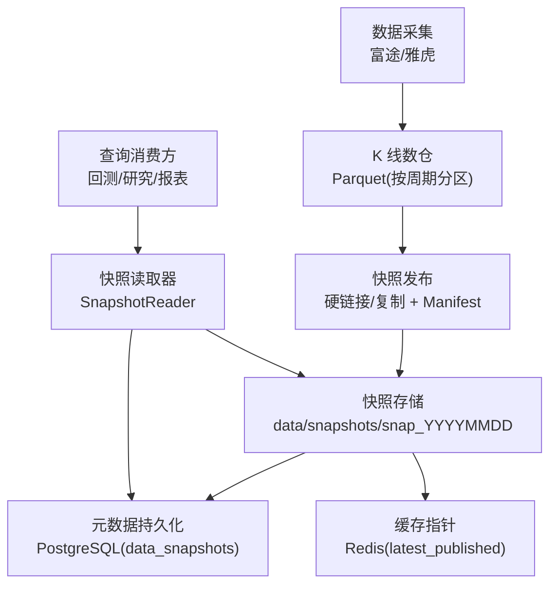
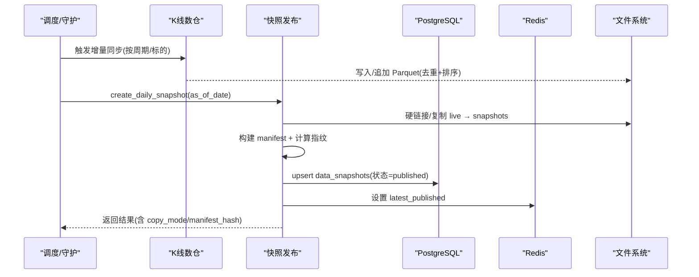
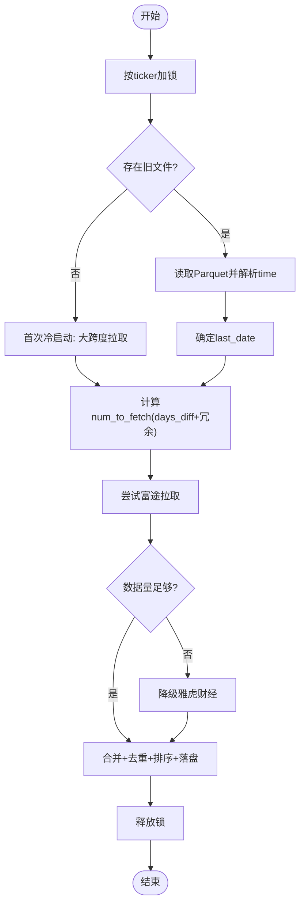
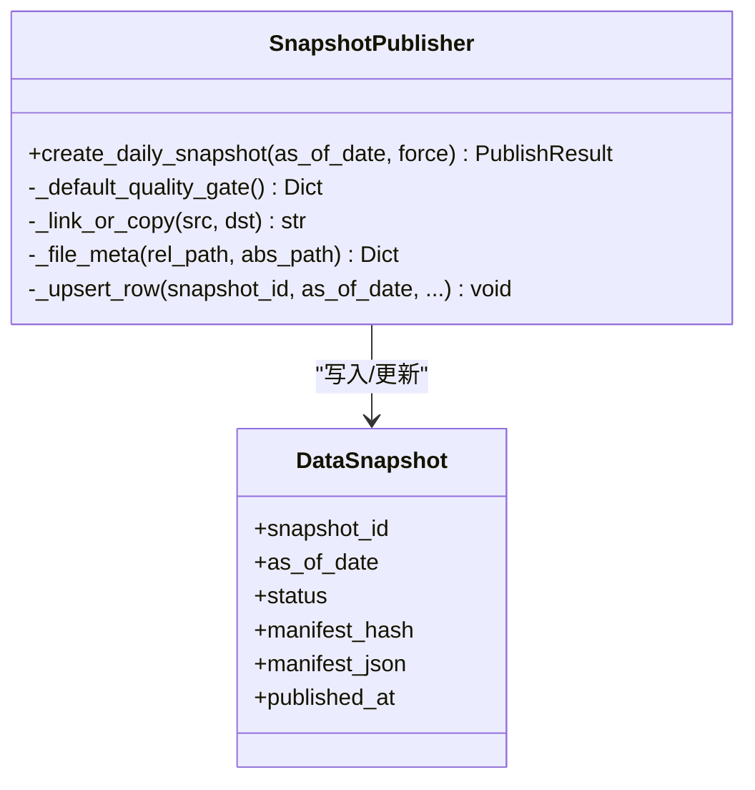
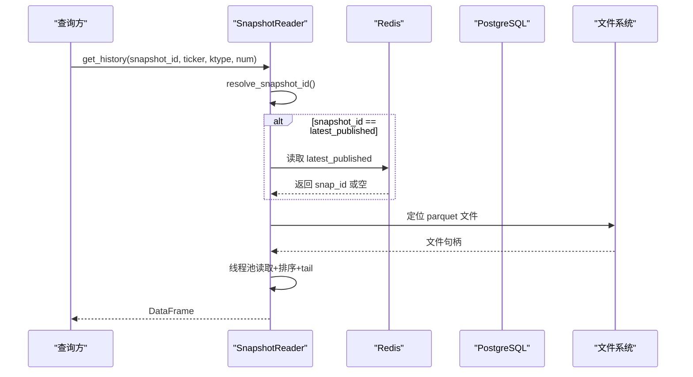
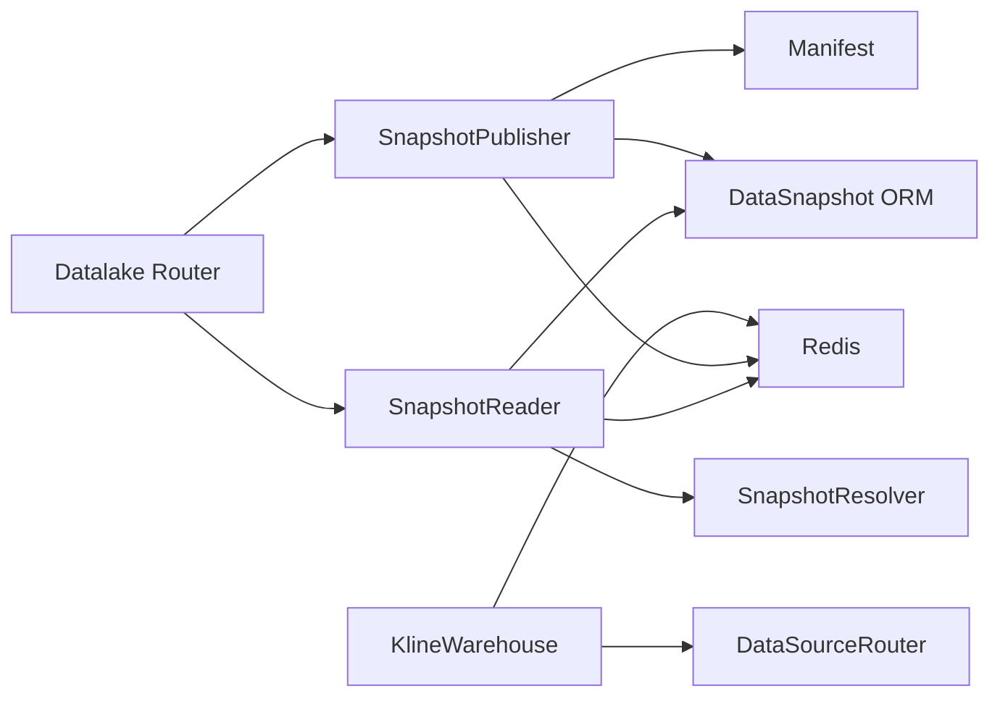
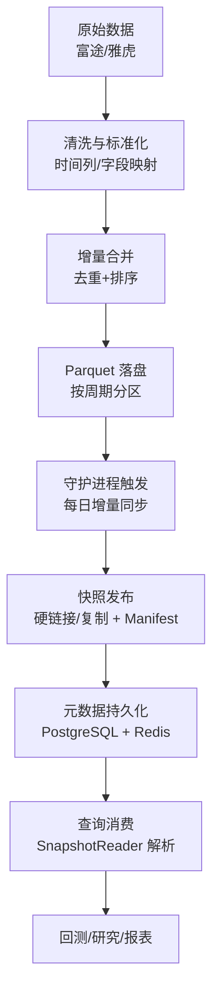
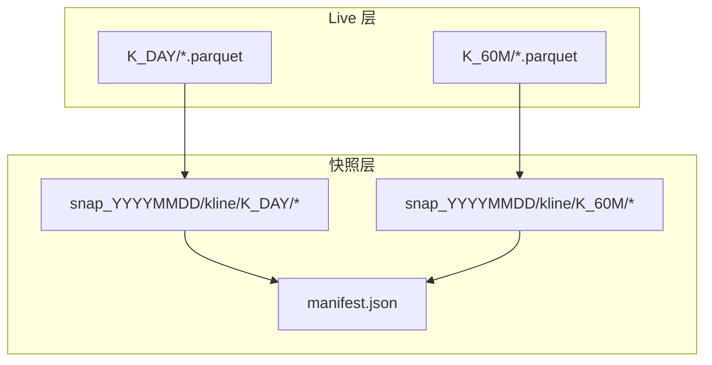

# 历史数据处理

<cite>
**本文引用的文件**
- [backend/services/datalake/kline_warehouse.py](file://backend/services/datalake/kline_warehouse.py)
- [backend/services/datalake/snapshot_publisher.py](file://backend/services/datalake/snapshot_publisher.py)
- [backend/services/datalake/snapshot_reader.py](file://backend/services/datalake/snapshot_reader.py)
- [backend/services/datalake/manifest.py](file://backend/services/datalake/manifest.py)
- [backend/core/datalake_models.py](file://backend/core/datalake_models.py)
- [backend/routers/datalake.py](file://backend/routers/datalake.py)
</cite>

## 目录
1. [简介](#简介)
2. [项目结构](#项目结构)
3. [核心组件](#核心组件)
4. [架构总览](#架构总览)
5. [详细组件分析](#详细组件分析)
6. [依赖关系分析](#依赖关系分析)
7. [性能考虑](#性能考虑)
8. [故障排查指南](#故障排查指南)
9. [结论](#结论)
10. [附录](#附录)

## 简介
本文件面向 Quant Agent 系统的历史数据处理能力，围绕“采集—清洗—转换—入库—快照—查询”的完整链路进行系统化说明。重点覆盖：
- K 线数据仓库的存储架构（Parquet、分区策略、索引与只读保护）
- 数据版本控制与快照机制（增量更新、全量备份、回滚策略）
- 数据质量监控与验证（完整性检查、异常检测、修复建议）
- 历史数据查询优化（时间范围、多周期聚合、技术指标计算）
- 数据处理流程图与数据流向图
- 性能优化建议与故障恢复方案

## 项目结构
历史数据处理相关代码集中在后端服务的数据湖模块中，关键路径如下：
- 本地 K 线数仓：按周期分目录存储 Parquet 文件，提供增量同步与守护进程
- 快照发布：从 live 层生成不可变快照，写入 manifest 并持久化元数据
- 快照读取：解析 latest_published/live/unbound 等语义，定位具体快照并读取数据
- 元数据模型：快照与回测报告的数据库表定义
- API 路由：暴露快照列表、最新快照、重建与保留策略执行接口

图表来源
- [backend/services/datalake/kline_warehouse.py:16-258](file://backend/services/datalake/kline_warehouse.py#L16-L258)
- [backend/services/datalake/snapshot_publisher.py:91-250](file://backend/services/datalake/snapshot_publisher.py#L91-L250)
- [backend/services/datalake/snapshot_reader.py:30-121](file://backend/services/datalake/snapshot_reader.py#L30-L121)
- [backend/core/datalake_models.py:31-82](file://backend/core/datalake_models.py#L31-L82)

章节来源
- [backend/services/datalake/kline_warehouse.py:16-258](file://backend/services/datalake/kline_warehouse.py#L16-L258)
- [backend/services/datalake/snapshot_publisher.py:91-250](file://backend/services/datalake/snapshot_publisher.py#L91-L250)
- [backend/services/datalake/snapshot_reader.py:30-121](file://backend/services/datalake/snapshot_reader.py#L30-L121)
- [backend/core/datalake_models.py:31-82](file://backend/core/datalake_models.py#L31-L82)

## 核心组件
- K 线数仓（KlineWarehouse）
  - 职责：增量拉取、去重合并、落盘为 Parquet；守护进程定时同步；分布式锁防重复
  - 关键点：按周期分区、时间列排序、去重策略、降级到备用数据源
- 快照发布（SnapshotPublisher）
  - 职责：从 live 层生成不可变快照；构建 manifest；写库与 Redis 指针；质量门控
  - 关键点：硬链接优先、copy2 回退、只读保护、幂等重建
- 快照读取（SnapshotReader）
  - 职责：解析 snapshot_id（latest_published/live/unbound），定位文件并读取 K 线
  - 关键点：Redis 指针优先、回退到 DB 解析、线程池非阻塞读取
- Manifest（manifest.py）
  - 职责：构造可校验的 manifest，计算指纹；支持校验一致性
- 元数据模型（datalake_models.py）
  - 职责：定义 data_snapshots 与 backtest_reports 表结构
- API 路由（routers/datalake.py）
  - 职责：提供快照管理 REST 接口（列表、最新、详情、重建、保留策略）

章节来源
- [backend/services/datalake/kline_warehouse.py:16-258](file://backend/services/datalake/kline_warehouse.py#L16-L258)
- [backend/services/datalake/snapshot_publisher.py:91-250](file://backend/services/datalake/snapshot_publisher.py#L91-L250)
- [backend/services/datalake/snapshot_reader.py:30-121](file://backend/services/datalake/snapshot_reader.py#L30-L121)
- [backend/services/datalake/manifest.py:16-78](file://backend/services/datalake/manifest.py#L16-L78)
- [backend/core/datalake_models.py:31-82](file://backend/core/datalake_models.py#L31-L82)
- [backend/routers/datalake.py:61-138](file://backend/routers/datalake.py#L61-L138)

## 架构总览
历史数据处理采用“live 层 + 快照层”的分层设计：
- Live 层：持续更新的 Parquet 文件，按 K 线周期分区存放，支撑高频回测读取
- 快照层：每日生成的不可变快照，包含所有参与标的的 K 线文件副本与 manifest，用于回测复现与审计
- 元数据层：PostgreSQL 记录快照状态、manifest 与统计信息；Redis 维护 latest_published 指针
- 访问层：统一通过 SnapshotReader 解析语义化 snapshot_id 并读取数据

图表来源
- [backend/services/datalake/kline_warehouse.py:175-258](file://backend/services/datalake/kline_warehouse.py#L175-L258)
- [backend/services/datalake/snapshot_publisher.py:119-250](file://backend/services/datalake/snapshot_publisher.py#L119-L250)
- [backend/core/datalake_models.py:31-50](file://backend/core/datalake_models.py#L31-L50)

## 详细组件分析

### K 线数仓（KlineWarehouse）
- 存储架构
  - 根目录：data/kline_warehouse
  - 分区策略：按 K 线周期子目录（如 K_DAY、K_60M），每个标的一个 parquet 文件
  - 文件格式：Parquet，列式存储，使用 pyarrow 引擎读取
  - 索引策略：基于 time 列排序；无额外索引，依赖列存压缩与顺序扫描
- 增量更新流程
  - 并发控制：按 ticker 加 asyncio.Lock，避免同一标的并发写入
  - 增量判断：读取 last_date，计算 days_diff，动态决定拉取条数
  - 数据源优先级：富途优先，不足时降级到雅虎财经兜底
  - 合并策略：concat + drop_duplicates(subset=["time"], keep="last") 保证最新复权覆盖
  - 落盘：to_parquet(index=False)，确保可被其他进程安全读取
- 守护进程
  - 定时任务：每天凌晨 3:00 执行，使用 Redis 分布式锁防止集群重复
  - 标的集合：从 Redis 获取监控标的 + 默认标的
  - 周期循环：依次对 K_DAY、K_60M 执行增量同步，带间隔防限流
  - 后续动作：成功后发布日快照；周末或月初执行保留策略

图表来源
- [backend/services/datalake/kline_warehouse.py:55-173](file://backend/services/datalake/kline_warehouse.py#L55-L173)

章节来源
- [backend/services/datalake/kline_warehouse.py:16-258](file://backend/services/datalake/kline_warehouse.py#L16-L258)

### 快照发布（SnapshotPublisher）
- 目标：将 live 层数据以不可变快照形式固化，便于回测复现与审计
- 核心步骤
  - 幂等性：若已 published 且未强制重建，直接跳过
  - 并发控制：Redis 分布式锁，避免同一天重复构建
  - 质量门控：可注入自定义质量检查函数，失败则标记 failed
  - 文件拷贝：优先硬链接，失败回退 copy2；记录 copy_mode
  - Manifest 构建：收集文件元信息（sha256、bytes、rows、time_min/max），计算 manifest_hash
  - 只读保护：尽力将快照文件设为只读，防止误改
  - 元数据持久化：upsert data_snapshots，记录 status、manifest、统计字段
  - 指针更新：Redis 设置 latest_published，删除 building 标志
- 侧车文件：可选导出 universe.json 等 sidecar，纳入 manifest

图表来源
- [backend/services/datalake/snapshot_publisher.py:91-250](file://backend/services/datalake/snapshot_publisher.py#L91-L250)
- [backend/core/datalake_models.py:31-50](file://backend/core/datalake_models.py#L31-L50)

章节来源
- [backend/services/datalake/snapshot_publisher.py:91-250](file://backend/services/datalake/snapshot_publisher.py#L91-L250)
- [backend/core/datalake_models.py:31-50](file://backend/core/datalake_models.py#L31-L50)

### 快照读取（SnapshotReader）
- 语义解析
  - live：返回 None（由调用方走 live 层）
  - latest_published：优先查 Redis，否则回退到 DB 解析
  - unbound：视为无绑定快照，返回 None
- 文件定位
  - 路径规则：snapshots_root/snapshot_id/kline/{ktype}/{ticker}.parquet
  - 兼容文件名：若安全名不存在，尝试原始 ticker 名
- 读取优化
  - 线程池异步读取：避免阻塞事件循环
  - 排序与切片：按 time 排序后取 tail(num)
- 清单读取
  - 优先读取 manifest.json，缺失时回退到 DB 中的 manifest_json

图表来源
- [backend/services/datalake/snapshot_reader.py:30-121](file://backend/services/datalake/snapshot_reader.py#L30-L121)

章节来源
- [backend/services/datalake/snapshot_reader.py:30-121](file://backend/services/datalake/snapshot_reader.py#L30-L121)

### Manifest 与数据指纹
- 确定性 JSON：sort_keys + 紧凑分隔符，日期转 ISO
- 指纹计算：排除 manifest_hash 字段本身，对剩余内容计算 sha256
- 校验：支持去除前缀后的比对，确保 manifest 未被篡改

章节来源
- [backend/services/datalake/manifest.py:16-78](file://backend/services/datalake/manifest.py#L16-L78)

### 元数据模型与 API
- 数据模型
  - data_snapshots：快照主键、as_of_date、status、manifest_hash、manifest_json、统计字段、时间戳
  - backtest_reports：回测报告绑定数据快照、参数、指标、可复现键
- API 路由
  - GET /api/v1/datalake/snapshots：按状态/存储层过滤，分页
  - GET /api/v1/datalake/snapshots/latest：返回最新 published 快照及年龄告警
  - GET /api/v1/datalake/snapshots/{snapshot_id}：返回快照详情与 manifest
  - POST /api/v1/datalake/snapshots/rebuild：按日期重建快照（支持强制）
  - POST /api/v1/datalake/snapshots/retention/run：执行保留策略

章节来源
- [backend/core/datalake_models.py:31-82](file://backend/core/datalake_models.py#L31-L82)
- [backend/routers/datalake.py:61-138](file://backend/routers/datalake.py#L61-L138)

## 依赖关系分析
- 组件耦合
  - KlineWarehouse 依赖数据源路由（富途/雅虎）、Redis 分布式锁
  - SnapshotPublisher 依赖 paths、manifest、DataSnapshot ORM、Redis
  - SnapshotReader 依赖 SnapshotResolver、paths、ORM、Redis
  - API 路由依赖上述服务与 ORM
- 外部依赖
  - PostgreSQL：快照元数据与回测报告
  - Redis：分布式锁与 latest_published 指针
  - 文件系统：Parquet 文件与 manifest 存储

图表来源
- [backend/services/datalake/kline_warehouse.py:86-120](file://backend/services/datalake/kline_warehouse.py#L86-L120)
- [backend/services/datalake/snapshot_publisher.py:22-33](file://backend/services/datalake/snapshot_publisher.py#L22-L33)
- [backend/services/datalake/snapshot_reader.py:19-25](file://backend/services/datalake/snapshot_reader.py#L19-L25)
- [backend/routers/datalake.py:19-27](file://backend/routers/datalake.py#L19-L27)

章节来源
- [backend/services/datalake/kline_warehouse.py:86-120](file://backend/services/datalake/kline_warehouse.py#L86-L120)
- [backend/services/datalake/snapshot_publisher.py:22-33](file://backend/services/datalake/snapshot_publisher.py#L22-L33)
- [backend/services/datalake/snapshot_reader.py:19-25](file://backend/services/datalake/snapshot_reader.py#L19-L25)
- [backend/routers/datalake.py:19-27](file://backend/routers/datalake.py#L19-L27)

## 性能考虑
- 读取性能
  - 使用 Parquet 列式存储与 pyarrow 引擎，配合 to_thread 避免阻塞事件循环
  - 按 time 排序后仅取尾部 num 行，减少内存与 CPU 开销
- 写入性能
  - 增量合并时先 concat 再一次性去重排序，减少多次 I/O
  - 硬链接优先，降低快照创建时的磁盘占用与 I/O
- 并发与限流
  - 按 ticker 加锁避免并发写冲突
  - 守护进程内对数据源请求加 sleep，避免触发频控
- 存储与索引
  - 无额外索引，依赖 Parquet 内部统计与顺序扫描
  - 建议：对频繁查询的 time 列保持有序，必要时在应用层建立时间范围索引（如按天分片）

[本节为通用性能建议，不直接分析具体文件]

## 故障排查指南
- 常见问题
  - 数据源不可用：富途配额耗尽或网络异常，系统自动降级到雅虎财经；若均失败，update_ticker 返回 False
  - 快照构建失败：质量门控未通过或 Redis 不可用，状态标记为 failed；可通过 API 重建
  - 读取不到数据：snapshot_id 解析失败或文件缺失，get_history_sync 返回 None
- 诊断建议
  - 查看守护进程日志：确认是否成功执行增量同步与快照发布
  - 检查 Redis 锁与指针：确认 lock_key 与 latest_published 是否正确设置
  - 校验 manifest：validate_manifest 确保 manifest_hash 一致
  - 使用 API 查询：/snapshots/latest 与 /snapshots/{id} 获取状态与 manifest
- 修复策略
  - 增量失败：重试 update_ticker，必要时强制全量刷新
  - 快照损坏：使用 rebuild 接口按日期重建，或回滚到上一个 published 快照
  - 数据不一致：重新运行保留策略，清理过期快照

章节来源
- [backend/services/datalake/kline_warehouse.py:147-173](file://backend/services/datalake/kline_warehouse.py#L147-L173)
- [backend/services/datalake/snapshot_publisher.py:147-156](file://backend/services/datalake/snapshot_publisher.py#L147-L156)
- [backend/services/datalake/snapshot_reader.py:66-77](file://backend/services/datalake/snapshot_reader.py#L66-L77)
- [backend/services/datalake/manifest.py:69-78](file://backend/services/datalake/manifest.py#L69-L78)
- [backend/routers/datalake.py:77-138](file://backend/routers/datalake.py#L77-L138)

## 结论
Quant Agent 的历史数据处理通过“live 层 + 快照层”的分层架构，实现了高可靠、可复现、高性能的 K 线数据管理。K 线数仓负责增量同步与高效读取，快照发布保障数据不可变与审计，元数据与 API 提供统一的版本管理与查询入口。结合质量门控、分布式锁与只读保护，系统在稳定性与可维护性方面具备良好基础。

[本节为总结性内容，不直接分析具体文件]

## 附录

### 数据处理流程图（从原始数据到可用数据）

[此图为概念性流程，不直接映射具体文件]

### 数据流向图（Live 层与快照层）

图表来源
- [backend/services/datalake/snapshot_publisher.py:163-205](file://backend/services/datalake/snapshot_publisher.py#L163-L205)

### 查询优化策略
- 时间范围查询：在应用层根据 time 列进行范围过滤，利用 Parquet 谓词下推（若引擎支持）
- 多周期聚合：分别读取不同周期的 Parquet 文件，在内存中按时间对齐后进行聚合
- 技术指标计算：在读取后按需计算，避免在存储层预计算导致写入复杂化
- 缓存策略：对热点标的与常用时间窗口增加内存缓存，减少重复读取

[本节为通用优化建议，不直接分析具体文件]
