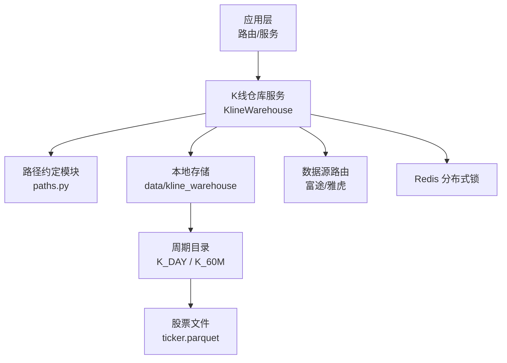
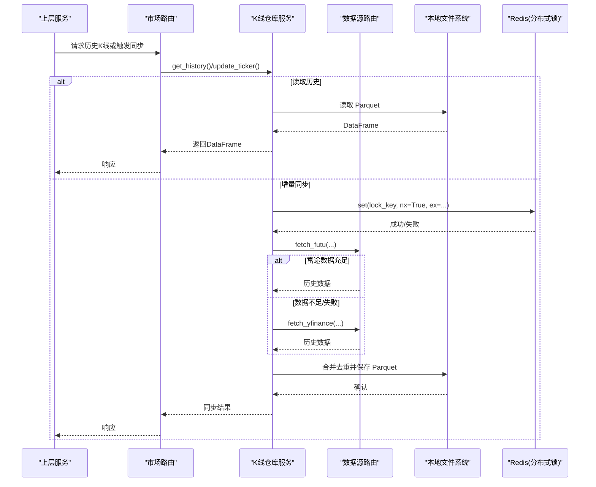
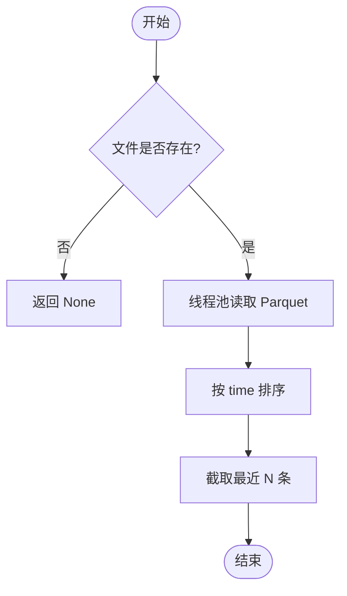
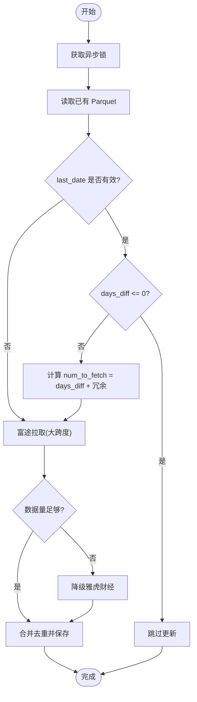
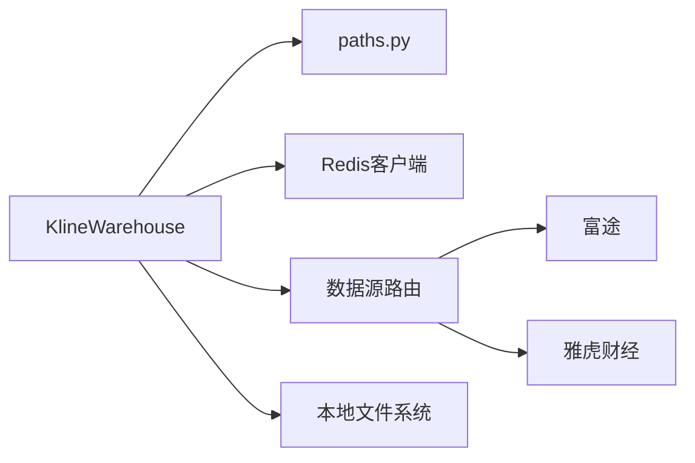

# 存储架构

<cite>
**本文引用的文件**
- [backend/services/datalake/kline_warehouse.py](file://backend/services/datalake/kline_warehouse.py)
- [backend/services/datalake/paths.py](file://backend/services/datalake/paths.py)
- [backend/routers/market.py](file://backend/routers/market.py)
- [backend/app/screener_app.py](file://backend/app/screener_app.py)
- [backend/routers/portfolio.py](file://backend/routers/portfolio.py)
- [backend/routers/risk.py](file://backend/routers/risk.py)
- [backend/services/market_engine.py](file://backend/services/market_engine.py)
- [backend/tests/test_kline_warehouse.py](file://backend/tests/test_kline_warehouse.py)
</cite>

## 目录
1. [简介](#简介)
2. [项目结构](#项目结构)
3. [核心组件](#核心组件)
4. [架构总览](#架构总览)
5. [详细组件分析](#详细组件分析)
6. [依赖关系分析](#依赖关系分析)
7. [性能考量](#性能考量)
8. [故障排查指南](#故障排查指南)
9. [结论](#结论)
10. [附录](#附录)

## 简介
本章节面向Quant Agent系统的历史数据存储架构，聚焦K线数据仓库的设计与实现。系统以本地Parquet列式文件作为K线主存储，结合增量同步、并发控制、降级拉取、守护进程定时任务等机制，为回测、风控、选股等上层服务提供稳定、高效的历史数据访问能力。文档将覆盖文件格式选择原因、存储组织、并发与分布式锁、读取优化、容量管理与清理策略，并给出架构图、数据流图、性能调优建议与故障排查指引。

## 项目结构
K线数据仓库位于后端服务的“data/kline_warehouse”根目录下，按K线周期划分子目录（如K_DAY、K_60M），每个股票代码对应一个Parquet文件。路径生成规则对股票代码中的特殊字符进行安全替换，确保文件系统兼容性与可预测性。同时，系统通过配置化路径模块统一管理“在线数据根目录”和“快照根目录”，便于环境隔离与扩展。

图表来源
- [backend/services/datalake/kline_warehouse.py:11-33](file://backend/services/datalake/kline_warehouse.py#L11-L33)
- [backend/services/datalake/paths.py:8-18](file://backend/services/datalake/paths.py#L8-L18)

章节来源
- [backend/services/datalake/kline_warehouse.py:11-33](file://backend/services/datalake/kline_warehouse.py#L11-L33)
- [backend/services/datalake/paths.py:8-18](file://backend/services/datalake/paths.py#L8-L18)

## 核心组件
- K线仓库服务：封装本地Parquet文件的读写、增量更新、并发控制与守护进程任务。
- 路径约定模块：定义在线数据与快照的根目录、Ticker到文件名的映射、以及若干Redis键前缀。
- 数据源路由：优先从富途拉取高质量历史K线，不足时自动降级至雅虎财经兜底。
- 上层调用方：市场路由、组合分析、风险引擎、选股服务等通过统一接口获取历史K线。

章节来源
- [backend/services/datalake/kline_warehouse.py:16-258](file://backend/services/datalake/kline_warehouse.py#L16-L258)
- [backend/services/datalake/paths.py:1-43](file://backend/services/datalake/paths.py#L1-L43)
- [backend/routers/market.py:16-479](file://backend/routers/market.py#L16-L479)
- [backend/app/screener_app.py:758-814](file://backend/app/screener_app.py#L758-L814)
- [backend/routers/portfolio.py:58-87](file://backend/routers/portfolio.py#L58-L87)
- [backend/routers/risk.py:11-200](file://backend/routers/risk.py#L11-L200)

## 架构总览
下图展示存储层与上层组件的交互关系，包括数据写入（增量同步）、数据读取（历史查询）以及守护进程的定时任务。

图表来源
- [backend/routers/market.py:464-479](file://backend/routers/market.py#L464-L479)
- [backend/services/datalake/kline_warehouse.py:34-173](file://backend/services/datalake/kline_warehouse.py#L34-L173)
- [backend/services/datalake/kline_warehouse.py:175-254](file://backend/services/datalake/kline_warehouse.py#L175-L254)

## 详细组件分析

### K线仓库服务（KlineWarehouse）
- 设计要点
  - 使用Parquet列式格式存储K线，提升读取性能与压缩效率；显式指定pyarrow引擎，配合线程池避免阻塞事件循环。
  - 增量更新：首次冷启动拉取大量历史数据；后续根据最后时间戳计算差异天数并追加新数据；按时间去重保留最新复权值。
  - 并发控制：基于异步锁保证同一股票在同一时刻仅有一个写操作；守护进程中使用Redis分布式锁防止集群重复拉取。
  - 降级策略：富途配额不足或返回数据过少时，自动切换至雅虎财经兜底，保障长跨度回测的数据完整性。
  - 守护进程：每日凌晨执行全量资产增量同步，并在成功后发布日快照与执行保留策略。

- 关键流程
  - 读取历史：检查文件存在→线程池内读取Parquet→排序并截取尾部N条。
  - 增量更新：加锁→读取已有数据→计算拉取数量→优先富途→不足则降级雅虎→合并去重→保存Parquet。
  - 守护任务：定时检查→分布式锁→遍历监控标的与默认标的→按周期同步→错峰防限流→发布快照→执行保留策略。

图表来源
- [backend/services/datalake/kline_warehouse.py:34-53](file://backend/services/datalake/kline_warehouse.py#L34-L53)

图表来源
- [backend/services/datalake/kline_warehouse.py:55-173](file://backend/services/datalake/kline_warehouse.py#L55-L173)

章节来源
- [backend/services/datalake/kline_warehouse.py:16-258](file://backend/services/datalake/kline_warehouse.py#L16-L258)

### 路径约定模块（paths.py）
- 职责
  - 定义在线数据根目录与快照根目录，支持环境变量覆盖。
  - 提供Ticker到文件名转换函数，确保文件名合法且可逆。
  - 定义若干Redis键前缀用于构建与保留任务的分布式协调。

- 关键点
  - LIVE_ROOT/SNAPSHOTS_ROOT：通过环境变量灵活切换存储位置。
  - ticker_to_filename/filename_to_ticker：处理市场分隔符与下划线转换。
  - REDIS_*：用于快照构建与保留的分布式锁键。

章节来源
- [backend/services/datalake/paths.py:1-43](file://backend/services/datalake/paths.py#L1-L43)

### 上层调用与集成点
- 市场路由：提供同步K线数仓的API入口，支持强制全量更新。
- 选股应用：按需获取历史K线用于筛选逻辑。
- 组合分析：从K线数仓读取真实历史收益率矩阵。
- 风险引擎：获取基准指数历史K线进行风险评估。
- 市场引擎：在启动时创建守护任务，确保后台增量同步持续运行。

章节来源
- [backend/routers/market.py:464-479](file://backend/routers/market.py#L464-L479)
- [backend/app/screener_app.py:758-814](file://backend/app/screener_app.py#L758-L814)
- [backend/routers/portfolio.py:58-87](file://backend/routers/portfolio.py#L58-L87)
- [backend/routers/risk.py:11-200](file://backend/routers/risk.py#L11-L200)
- [backend/services/market_engine.py:169-171](file://backend/services/market_engine.py#L169-L171)

## 依赖关系分析
- 内部依赖
  - K线仓库服务依赖路径约定模块进行文件定位与命名。
  - 守护进程依赖Redis客户端进行分布式锁与监控标的集合读取。
  - 数据源路由负责富途与雅虎财经的拉取与降级。
- 外部依赖
  - PyArrow/Parquet：高性能列式存储与读取。
  - Redis：分布式锁与键值存储。
  - 数据源：富途（优先）、雅虎财经（兜底）。

图表来源
- [backend/services/datalake/kline_warehouse.py:8-12](file://backend/services/datalake/kline_warehouse.py#L8-L12)
- [backend/services/datalake/kline_warehouse.py:175-254](file://backend/services/datalake/kline_warehouse.py#L175-L254)
- [backend/services/datalake/paths.py:8-18](file://backend/services/datalake/paths.py#L8-L18)

章节来源
- [backend/services/datalake/kline_warehouse.py:8-12](file://backend/services/datalake/kline_warehouse.py#L8-L12)
- [backend/services/datalake/kline_warehouse.py:175-254](file://backend/services/datalake/kline_warehouse.py#L175-L254)
- [backend/services/datalake/paths.py:8-18](file://backend/services/datalake/paths.py#L8-L18)

## 性能考量
- 文件格式选择
  - Parquet列式存储具备高压缩比与快速列投影读取优势，适合K线这种宽表、顺序读为主的场景。
  - 显式使用pyarrow引擎，充分利用C层释放GIL的优势，降低对事件循环的影响。
- 读取优化
  - 线程池执行I/O密集操作，避免阻塞异步事件循环。
  - 读取后按time排序并截取尾部N条，减少内存占用与传输开销。
- 写入优化
  - 增量合并+按时间去重（keep='last'），确保最新复权覆盖旧值，避免重复累积。
  - 守护进程错峰拉取（sleep间隔），缓解富途接口频控压力。
- 缓存与索引
  - 当前未引入额外缓存层；若需进一步降低延迟，可在应用层增加短期内存缓存（如LRU）以减少重复读取。
  - Parquet自带列级元数据，无需额外索引即可高效过滤与扫描。
- 容量管理
  - 通过守护进程触发快照发布与保留策略，定期清理过期快照，控制存储空间增长。
  - 建议在监控中统计各周期目录大小与文件数量，设置阈值告警。

[本节为通用性能指导，不直接分析具体文件]

## 故障排查指南
- 常见问题
  - 读取失败：Parquet文件损坏或权限问题导致读取异常。应检查文件完整性与进程权限。
  - 增量同步失败：富途与雅虎均无法拉取数据。检查网络连通性、配额限制与数据源状态。
  - 重复拉取：集群环境下多个实例同时执行守护任务。确认Redis分布式锁是否生效。
  - 数据不一致：复权修正导致历史值变化。确认合并去重策略是否正确覆盖旧值。
- 诊断步骤
  - 查看日志输出：关注仓库服务打印的警告与错误信息。
  - 验证文件路径：确认ticker到文件名的转换是否符合预期。
  - 检查Redis锁键：确认锁键是否被正确设置与过期。
  - 回放测试用例：参考单元测试覆盖的场景，构造最小复现用例。

章节来源
- [backend/tests/test_kline_warehouse.py:59-90](file://backend/tests/test_kline_warehouse.py#L59-L90)
- [backend/tests/test_kline_warehouse.py:176-228](file://backend/tests/test_kline_warehouse.py#L176-L228)
- [backend/services/datalake/kline_warehouse.py:51-53](file://backend/services/datalake/kline_warehouse.py#L51-L53)
- [backend/services/datalake/kline_warehouse.py:147-173](file://backend/services/datalake/kline_warehouse.py#L147-L173)
- [backend/services/datalake/kline_warehouse.py:183-207](file://backend/services/datalake/kline_warehouse.py#L183-L207)

## 结论
K线数据仓库以Parquet为核心存储介质，结合增量同步、并发控制与降级拉取机制，为上层业务提供了稳定高效的历史数据访问能力。通过守护进程与保留策略，系统在容量管理与数据一致性方面具备良好实践。未来可考虑引入应用层缓存与更细粒度的监控指标，进一步提升性能与可观测性。

[本节为总结性内容，不直接分析具体文件]

## 附录
- 存储目录规范
  - 根目录：data/kline_warehouse
  - 周期子目录：K_DAY、K_60M
  - 文件命名：ticker.parquet（ticker中的“.”和“/”替换为“_”）
- 路径与环境变量
  - DATALAKE_LIVE_ROOT：在线数据根目录
  - DATALAKE_SNAPSHOTS_ROOT：快照根目录
- 分布式锁键
  - quant:lock:kline_sync:{日期}：守护进程同步锁
  - quant:lock:snapshot_create:*：快照创建锁
  - quant:lock:snapshot_retention：保留策略锁

章节来源
- [backend/services/datalake/kline_warehouse.py:11-33](file://backend/services/datalake/kline_warehouse.py#L11-L33)
- [backend/services/datalake/paths.py:8-18](file://backend/services/datalake/paths.py#L8-L18)
- [backend/services/datalake/paths.py:32-42](file://backend/services/datalake/paths.py#L32-L42)
