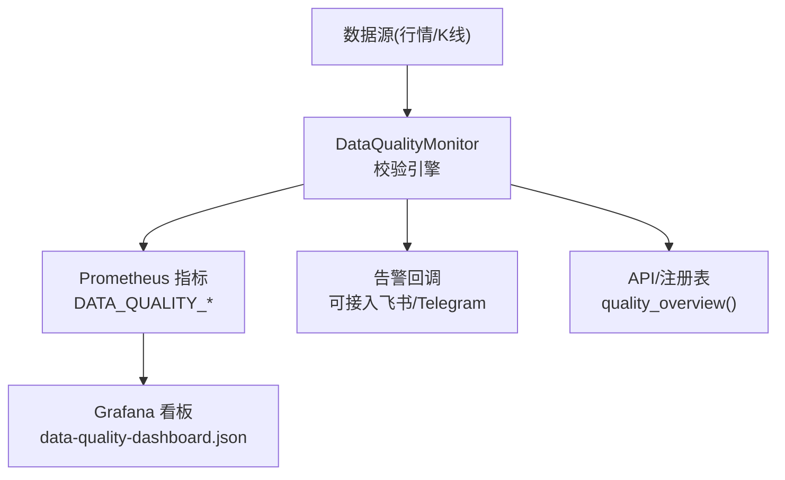
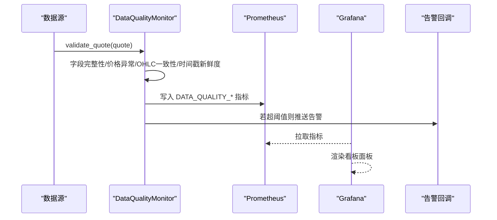
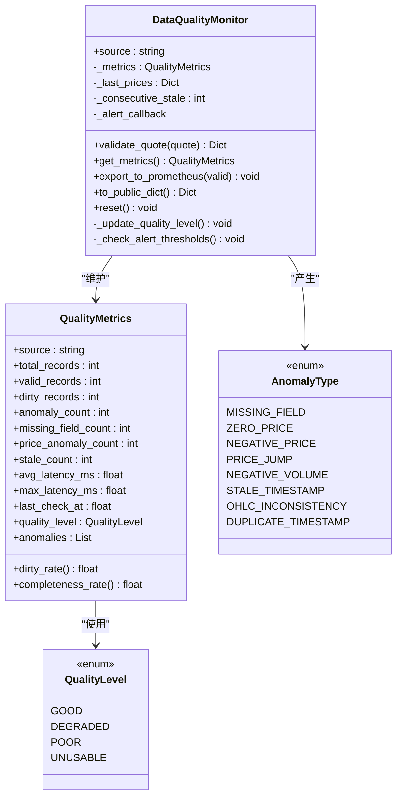
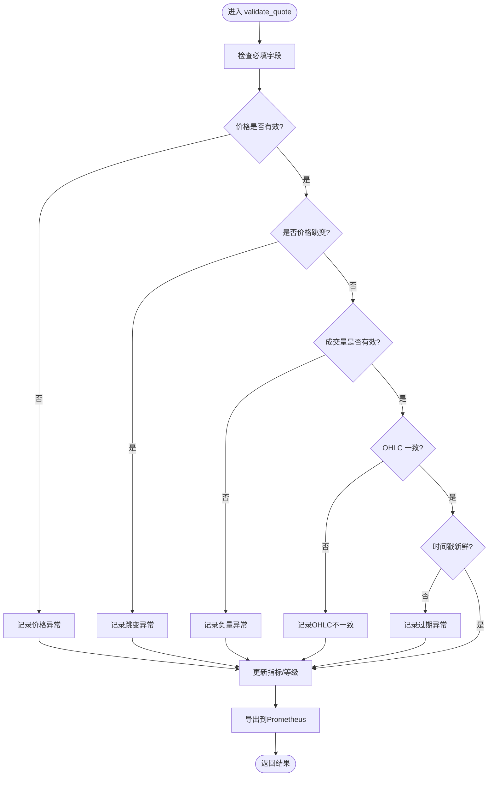
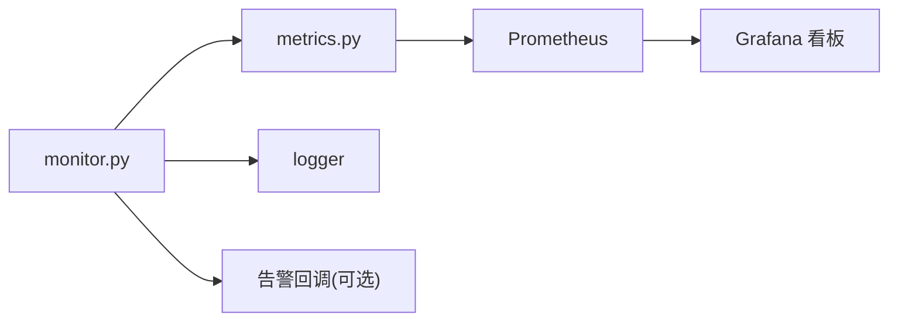

# 数据质量控制

<cite>
**本文引用的文件**
- [monitor.py](file://backend/services/data_quality/monitor.py)
- [metrics.py](file://backend/core/metrics.py)
- [data-quality-dashboard.json](file://grafana/provisioning/dashboards/data-quality-dashboard.json)
- [test_data_quality_monitor_svc04.py](file://backend/tests/test_data_quality_monitor_svc04.py)
- [test_data_quality_dashboard_dq04.py](file://backend/tests/test_data_quality_dashboard_dq04.py)
- [test_data_quality_dirtyrate_fix.py](file://backend/tests/test_data_quality_dirtyrate_fix.py)
</cite>

## 目录
1. [简介](#简介)
2. [项目结构](#项目结构)
3. [核心组件](#核心组件)
4. [架构总览](#架构总览)
5. [详细组件分析](#详细组件分析)
6. [依赖关系分析](#依赖关系分析)
7. [性能考量](#性能考量)
8. [故障排查指南](#故障排查指南)
9. [结论](#结论)
10. [附录](#附录)

## 简介
本文件面向 Quant Agent 系统的数据质量监控与治理，聚焦历史与实时行情数据的质量控制。内容覆盖：
- 完整性检查、准确性验证、一致性校验等监控指标
- 异常检测模型、数据漂移检测、质量评分计算
- 数据修复机制（自动修复策略、人工干预流程、修复记录追踪）
- 质量报告生成（指标统计、问题定位、改进建议）
- 数据治理规范（标准定义、规则配置、合规性检查）
- 监控仪表盘与告警机制（Prometheus + Grafana）
- 质量提升策略与最佳实践

## 项目结构
数据质量能力集中在后端服务层，通过 Prometheus 指标暴露并由 Grafana 可视化展示；测试用例覆盖核心逻辑与看板埋点。

图表来源
- [monitor.py:91-377](file://backend/services/data_quality/monitor.py#L91-L377)
- [metrics.py:382-444](file://backend/core/metrics.py#L382-L444)
- [data-quality-dashboard.json:1-253](file://grafana/provisioning/dashboards/data-quality-dashboard.json#L1-L253)

章节来源
- [monitor.py:1-408](file://backend/services/data_quality/monitor.py#L1-L408)
- [metrics.py:304-444](file://backend/core/metrics.py#L304-L444)
- [data-quality-dashboard.json:1-253](file://grafana/provisioning/dashboards/data-quality-dashboard.json#L1-L253)

## 核心组件
- DataQualityMonitor：单条行情数据的校验入口，维护按数据源维度的质量指标，输出质量等级并触发告警。
- QualityMetrics：聚合脏数据率、完整率、延迟、异常计数等指标。
- AnomalyType / QualityLevel：异常类型枚举与质量等级枚举。
- Prometheus 指标集合：DATA_QUALITY_DIRTY_RATE、COMPLETENESS、LEVEL、LATENCY_MS、CHECKS 等。
- Grafana 看板：基于上述指标的多面板可视化。

章节来源
- [monitor.py:26-89](file://backend/services/data_quality/monitor.py#L26-L89)
- [monitor.py:91-377](file://backend/services/data_quality/monitor.py#L91-L377)
- [metrics.py:382-444](file://backend/core/metrics.py#L382-L444)

## 架构总览
数据从数据源进入后，由 DataQualityMonitor 进行多维度校验，更新内部指标并导出到 Prometheus；Grafana 读取指标形成看板；当指标越限时，通过回调触发告警。

图表来源
- [monitor.py:112-256](file://backend/services/data_quality/monitor.py#L112-L256)
- [monitor.py:315-350](file://backend/services/data_quality/monitor.py#L315-L350)
- [metrics.py:382-444](file://backend/core/metrics.py#L382-L444)
- [data-quality-dashboard.json:1-253](file://grafana/provisioning/dashboards/data-quality-dashboard.json#L1-L253)

## 详细组件分析

### 数据质量监控器（DataQualityMonitor）
- 职责：对每条行情数据进行完整性、准确性、一致性、时效性检查；累计指标；评估质量等级；导出指标；触发告警。
- 关键方法：
  - validate_quote：单条校验主流程
  - _update_quality_level：根据脏数据率与过期次数更新质量等级
  - _check_alert_thresholds：阈值判断与告警回调
  - export_to_prometheus：将指标写入 Prometheus
  - to_public_dict / get_metrics：对外暴露摘要与快照
- 状态管理：
  - 每数据源独立实例（通过全局注册表获取）
  - 维护最近价格用于跳变检测
  - 连续过期计数用于告警

图表来源
- [monitor.py:26-89](file://backend/services/data_quality/monitor.py#L26-L89)
- [monitor.py:91-377](file://backend/services/data_quality/monitor.py#L91-L377)

章节来源
- [monitor.py:91-377](file://backend/services/data_quality/monitor.py#L91-L377)

### 校验算法与指标计算
- 完整性检查：必填字段缺失（open/high/low/close/volume）
- 准确性验证：零价、负价、负成交量
- 一致性校验：OHLC 逻辑错误（high < low）、重复时间戳
- 时效性检查：时间戳新鲜度（延迟超过阈值）
- 质量评分：
  - 脏数据率 = 含异常记录数 / 总记录数（语义口径，恒 ≤ 1.0）
  - 完整率 = 有效记录数 / 总记录数
  - 质量等级映射：GOOD → DEGRADED → POOR → UNUSABLE
- 异常检测模型：
  - 价格跳变：相对上次收盘价变化超过阈值
  - 时间戳过期：当前时间与数据时间差超过阈值
- 数据漂移检测：
  - 通过脏数据率趋势、异常分类计数、平均延迟变化进行观测
  - 结合 Grafana 面板的阈值与多指标联动识别漂移

图表来源
- [monitor.py:112-256](file://backend/services/data_quality/monitor.py#L112-L256)

章节来源
- [monitor.py:112-256](file://backend/services/data_quality/monitor.py#L112-L256)

### 告警机制与阈值
- 脏数据率阈值：超过阈值即触发告警
- 连续过期阈值：连续多条数据过期触发告警
- 告警回调：支持注入外部通知渠道（如飞书/Telegram），失败时记录日志

章节来源
- [monitor.py:270-295](file://backend/services/data_quality/monitor.py#L270-L295)

### 监控仪表盘与可视化
- 面板包括：
  - 脏数据率趋势（按数据源）
  - 字段完整率（按数据源）
  - 质量等级（0=GOOD … 3=UNUSABLE）
  - 异常分类：价格跳变 / 时间戳过期 / 字段缺失
  - 数据延迟（时间戳新鲜度）
  - 校验吞吐（ok vs anomaly · rate 5m）
- 数据来源：Prometheus 指标 quant_data_quality_*

章节来源
- [data-quality-dashboard.json:1-253](file://grafana/provisioning/dashboards/data-quality-dashboard.json#L1-L253)
- [metrics.py:382-444](file://backend/core/metrics.py#L382-L444)

### 单元测试与回归保障
- 覆盖完整性、价格异常、OHLC 一致性、时间戳新鲜度、质量等级、告警回调、Prometheus 指标输出、重置行为
- 脏数据率语义修复回归：确保 dirty_rate ≤ 1.0，避免污染看板

章节来源
- [test_data_quality_monitor_svc04.py:1-311](file://backend/tests/test_data_quality_monitor_svc04.py#L1-L311)
- [test_data_quality_dashboard_dq04.py:1-137](file://backend/tests/test_data_quality_dashboard_dq04.py#L1-L137)
- [test_data_quality_dirtyrate_fix.py:1-57](file://backend/tests/test_data_quality_dirtyrate_fix.py#L1-L57)

## 依赖关系分析
- DataQualityMonitor 依赖：
  - 日志模块：记录告警与异常
  - Prometheus 指标：DATA_QUALITY_* 系列
  - 可选告警回调：外部通知通道
- Grafana 看板依赖：
  - Prometheus 查询表达式引用 quant_data_quality_* 指标
- 测试依赖：
  - prometheus_client 用于断言指标存在性与值正确性

图表来源
- [monitor.py:315-350](file://backend/services/data_quality/monitor.py#L315-L350)
- [metrics.py:382-444](file://backend/core/metrics.py#L382-L444)
- [data-quality-dashboard.json:1-253](file://grafana/provisioning/dashboards/data-quality-dashboard.json#L1-L253)

章节来源
- [monitor.py:315-350](file://backend/services/data_quality/monitor.py#L315-L350)
- [metrics.py:382-444](file://backend/core/metrics.py#L382-L444)

## 性能考量
- 校验路径为 O(1) 单次处理，指标更新为常数级操作
- 平均延迟采用增量均值公式，避免全量求和溢出
- 异常列表仅保留最近 N 条，控制内存占用
- Prometheus 指标写入在异常情况下降级为 debug 日志，不影响主流程

[本节提供通用指导，无需特定文件分析]

## 故障排查指南
- 脏数据率异常升高：
  - 检查价格异常与字段缺失计数是否突增
  - 核对数据源连接与限流情况
- 时间戳过期增多：
  - 检查采集链路延迟与网络抖动
  - 确认阈值配置是否合理
- 看板无数据：
  - 确认 Prometheus 已采集到 quant_data_quality_* 指标
  - 检查 Grafana 数据源与查询表达式
- 告警未触发：
  - 确认已设置 alert_callback
  - 检查阈值是否达到

章节来源
- [monitor.py:270-295](file://backend/services/data_quality/monitor.py#L270-L295)
- [data-quality-dashboard.json:1-253](file://grafana/provisioning/dashboards/data-quality-dashboard.json#L1-L253)

## 结论
Quant Agent 的数据质量控制体系以 DataQualityMonitor 为核心，围绕完整性、准确性、一致性、时效性四大维度实现实时校验与指标化；通过 Prometheus 与 Grafana 形成闭环监控与可视化；配合阈值告警与测试保障，确保数据质量稳定可控。后续可在数据修复、漂移检测与治理规范方面持续增强。

[本节总结性内容，无需特定文件分析]

## 附录

### 数据修复机制（建议与实践）
- 自动修复策略：
  - 字段缺失：尝试从其他数据源或缓存回填
  - 价格异常：回退至上一有效价格或标记不可用
  - 时间戳过期：丢弃或降级为“陈旧”标签
- 人工干预流程：
  - 通过 API 或工单系统提交修复请求
  - 记录修复前后差异与责任人
- 修复记录追踪：
  - 将修复事件写入审计日志或数据库
  - 关联原始异常与最终处理结果

[本节为概念性说明，不直接分析具体文件]

### 数据质量报告生成（建议与实践）
- 指标统计：
  - 脏数据率、完整率、异常分类占比、平均延迟
- 问题定位分析：
  - 按数据源、标的、时间段下钻
  - 关联采集链路延迟与限流事件
- 改进建议输出：
  - 阈值调优、数据源切换、采集频率调整

[本节为概念性说明，不直接分析具体文件]

### 数据治理规范（建议与实践）
- 数据标准定义：
  - 统一字段命名、单位、时区、精度
- 质量规则配置：
  - 阈值可配置化（跳变比例、过期阈值、脏数据率阈值）
- 合规性检查：
  - 定期审计异常与修复记录
  - 建立数据质量基线与变更审批流程

[本节为概念性说明，不直接分析具体文件]

### 监控仪表盘与告警机制（现状）
- 仪表盘：
  - 脏数据率、完整率、质量等级、异常分类、延迟、校验吞吐
- 告警：
  - 基于脏数据率与连续过期阈值的回调机制
  - 可扩展对接多种通知渠道

章节来源
- [data-quality-dashboard.json:1-253](file://grafana/provisioning/dashboards/data-quality-dashboard.json#L1-L253)
- [monitor.py:270-295](file://backend/services/data_quality/monitor.py#L270-L295)

### 数据质量提升策略与最佳实践
- 阈值动态调优：依据业务时段与数据源稳定性调整
- 多源融合与降级：主备数据源切换与偏差告警
- 采样与窗口：按分钟/小时窗口聚合异常率，平滑波动
- 回归测试：持续集成中运行数据质量用例，防止退化

[本节为概念性说明，不直接分析具体文件]