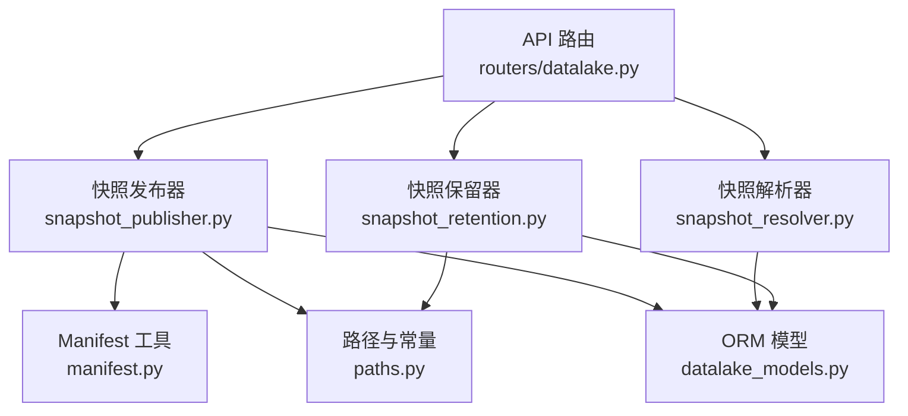
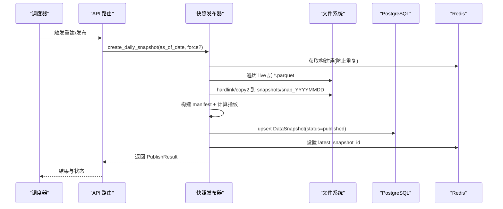
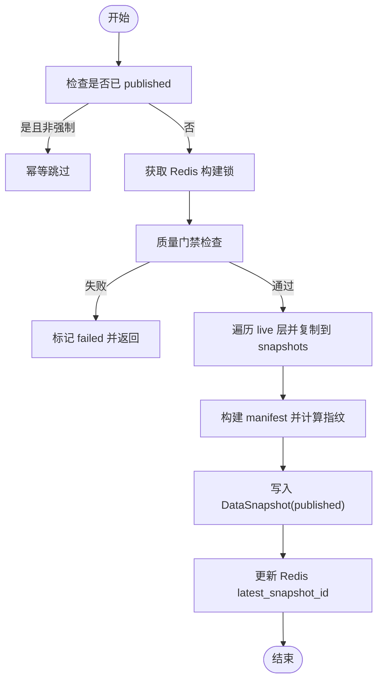
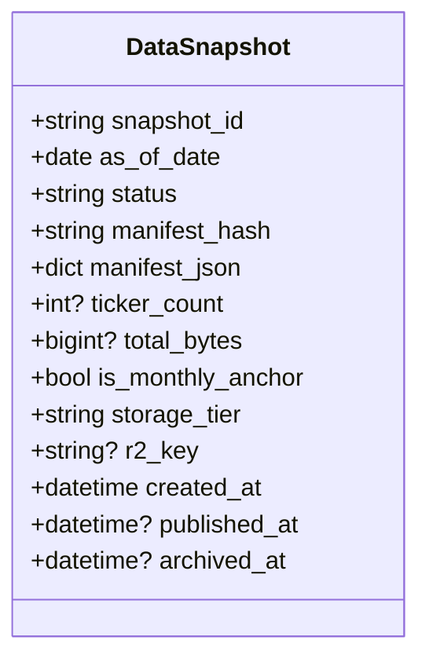
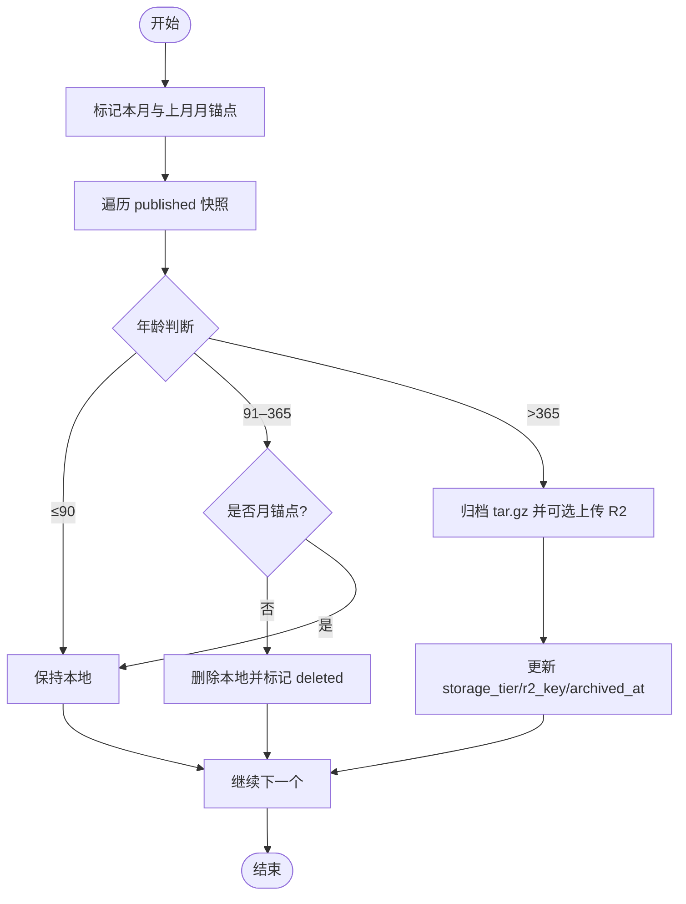
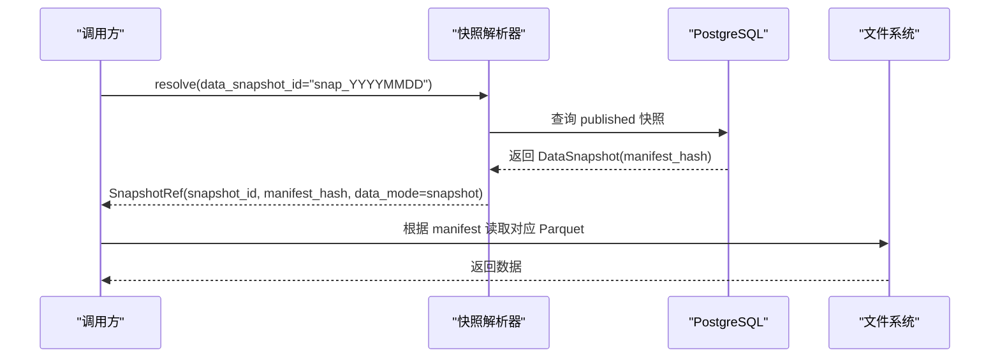
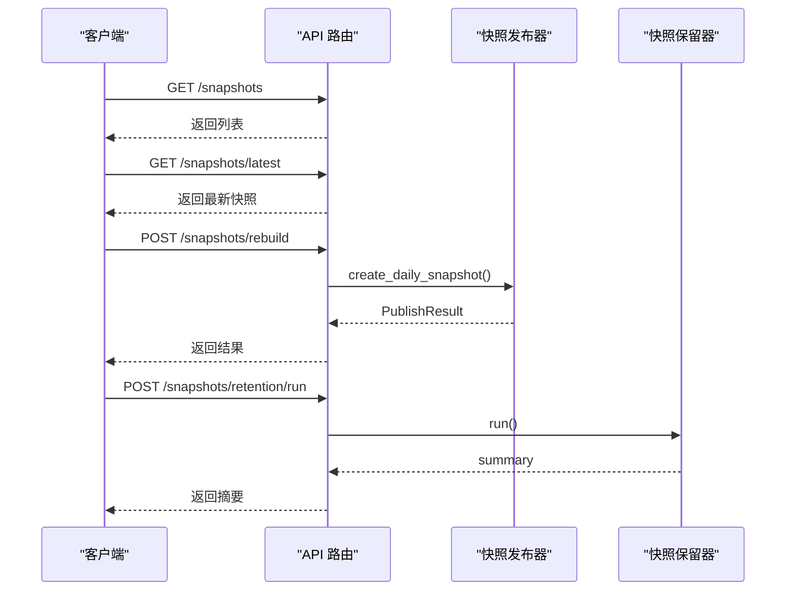
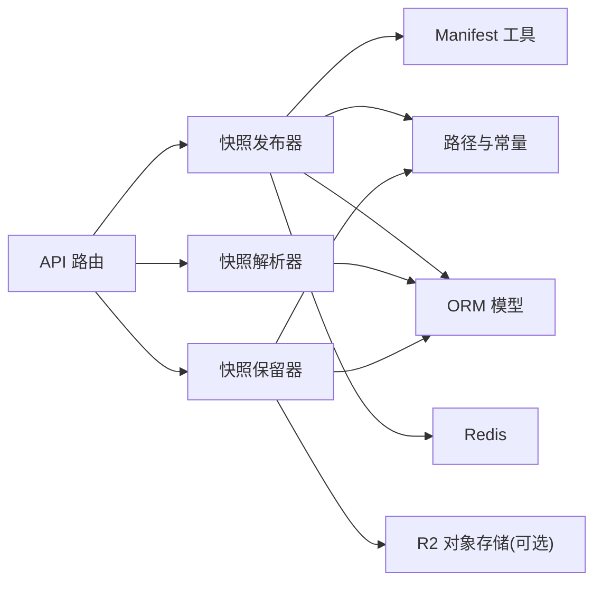
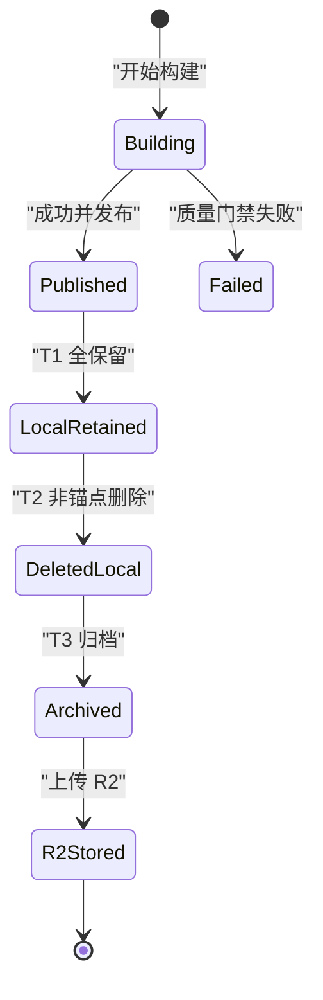

# 版本管理

<cite>
**本文引用的文件**
- [backend/services/datalake/snapshot_publisher.py](file://backend/services/datalake/snapshot_publisher.py)
- [backend/services/datalake/snapshot_retention.py](file://backend/services/datalake/snapshot_retention.py)
- [backend/services/datalake/snapshot_resolver.py](file://backend/services/datalake/snapshot_resolver.py)
- [backend/services/datalake/manifest.py](file://backend/services/datalake/manifest.py)
- [backend/core/datalake_models.py](file://backend/core/datalake_models.py)
- [backend/services/datalake/paths.py](file://backend/services/datalake/paths.py)
- [backend/routers/datalake.py](file://backend/routers/datalake.py)
</cite>

## 目录
1. [简介](#简介)
2. [项目结构](#项目结构)
3. [核心组件](#核心组件)
4. [架构总览](#架构总览)
5. [详细组件分析](#详细组件分析)
6. [依赖关系分析](#依赖关系分析)
7. [性能考虑](#性能考虑)
8. [故障排查指南](#故障排查指南)
9. [结论](#结论)
10. [附录](#附录)

## 简介
本文件面向 Quant Agent 系统的历史数据版本管理，围绕“快照创建、版本标记、元数据管理、日快照发布流程、数据保留策略、回滚与恢复、版本查询接口、备份与灾难恢复”等主题进行系统化说明。系统以 Parquet 数据湖为基础，通过“live 层 → snapshots 层”的不可变快照机制实现可复现的回测与稳定的生产数据消费；使用 manifest 作为数据指纹，结合 PostgreSQL 元数据表与 Redis 分布式锁，保障并发安全与一致性。

## 项目结构
版本管理相关代码集中在 backend/services/datalake 与 backend/core、backend/routers 中：
- 快照发布：snapshot_publisher.py
- 快照解析：snapshot_resolver.py
- 快照保留：snapshot_retention.py
- Manifest 构建与校验：manifest.py
- 路径与常量：paths.py
- ORM 模型：datalake_models.py
- API 路由：routers/datalake.py

**图示来源**
- [backend/routers/datalake.py:1-138](file://backend/routers/datalake.py#L1-L138)
- [backend/services/datalake/snapshot_publisher.py:1-302](file://backend/services/datalake/snapshot_publisher.py#L1-L302)
- [backend/services/datalake/snapshot_resolver.py:1-103](file://backend/services/datalake/snapshot_resolver.py#L1-L103)
- [backend/services/datalake/snapshot_retention.py:1-143](file://backend/services/datalake/snapshot_retention.py#L1-L143)
- [backend/services/datalake/manifest.py:1-78](file://backend/services/datalake/manifest.py#L1-L78)
- [backend/services/datalake/paths.py:1-43](file://backend/services/datalake/paths.py#L1-L43)
- [backend/core/datalake_models.py:1-82](file://backend/core/datalake_models.py#L1-L82)

**章节来源**
- [backend/routers/datalake.py:1-138](file://backend/routers/datalake.py#L1-L138)
- [backend/services/datalake/paths.py:1-43](file://backend/services/datalake/paths.py#L1-L43)

## 核心组件
- 快照发布器（SnapshotPublisher）：从 live 层生成 snapshots 日快照，写入 manifest.json，持久化元数据到数据库，并更新 Redis 最新快照键。
- 快照解析器（SnapshotResolver）：将 data_snapshot_id 或 manifest_hash 解析为 SnapshotRef，支持 latest_published/live/unbound 模式。
- 快照保留器（SnapshotRetention）：执行 T1/T2/T3 生命周期策略，打月锚点、删除本地非锚点、归档至 R2 或本地 tar.gz。
- Manifest 工具（manifest.py）：构建、计算与校验 manifest 数据指纹，保证不可变性与一致性。
- ORM 模型（DataSnapshot/BacktestReport）：存储快照元数据与回测报告的可复现绑定。
- 路径与常量（paths.py）：定义 live/snapshots 根路径、K 线类型、Redis 键名、脏读阈值等。
- API 路由（routers/datalake.py）：提供快照列表、最新快照、详情、重建与保留策略执行接口。

**章节来源**
- [backend/services/datalake/snapshot_publisher.py:91-250](file://backend/services/datalake/snapshot_publisher.py#L91-L250)
- [backend/services/datalake/snapshot_resolver.py:31-103](file://backend/services/datalake/snapshot_resolver.py#L31-L103)
- [backend/services/datalake/snapshot_retention.py:29-143](file://backend/services/datalake/snapshot_retention.py#L29-L143)
- [backend/services/datalake/manifest.py:16-78](file://backend/services/datalake/manifest.py#L16-L78)
- [backend/core/datalake_models.py:31-82](file://backend/core/datalake_models.py#L31-L82)
- [backend/services/datalake/paths.py:1-43](file://backend/services/datalake/paths.py#L1-L43)
- [backend/routers/datalake.py:61-138](file://backend/routers/datalake.py#L61-L138)

## 架构总览
系统采用“不可变快照 + 元数据索引 + 分布式锁”的架构：
- 数据源持续写入 live 层（Parquet）。
- 定时任务触发快照发布，按天生成 snapshots/snap_YYYYMMDD，包含 K 线文件与 manifest.json。
- 元数据写入 PostgreSQL（data_snapshots），并通过 Redis 维护 latest_snapshot_id 与构建锁。
- 保留策略周期性运行，按 T1/T2/T3 策略清理与归档，降低本地存储压力。
- 上层服务通过 SnapshotResolver 解析数据引用，确保回测与生产读取的一致性。

**图示来源**
- [backend/routers/datalake.py:112-131](file://backend/routers/datalake.py#L112-L131)
- [backend/services/datalake/snapshot_publisher.py:119-250](file://backend/services/datalake/snapshot_publisher.py#L119-L250)
- [backend/services/datalake/paths.py:15-18](file://backend/services/datalake/paths.py#L15-L18)

## 详细组件分析

### 快照发布流程（日快照）
- 幂等与并发控制：基于 Redis 锁 key 防止同一天重复构建；若已 published 且未强制重建则跳过。
- 质量门禁：默认放行，可通过注入 quality_gate_fn 检查脏读率等指标，失败时记录 failed 状态。
- 文件复制策略：优先硬链接，失败回退 copy2，记录 copy_mode（hardlink/copy2/mixed）。
- Manifest 构建：收集每个 parquet 的 sha256、行数、时间范围，汇总 ticker_count、total_bytes，并写入 sidecars（如 universe.json）。
- 元数据持久化：写入 DataSnapshot，status=published，记录 manifest_hash、published_at、storage_tier=local。
- 最新快照标记：更新 Redis latest_snapshot_id，清理 building 键，上报指标。

**图示来源**
- [backend/services/datalake/snapshot_publisher.py:119-250](file://backend/services/datalake/snapshot_publisher.py#L119-L250)
- [backend/services/datalake/manifest.py:34-66](file://backend/services/datalake/manifest.py#L34-L66)

**章节来源**
- [backend/services/datalake/snapshot_publisher.py:119-250](file://backend/services/datalake/snapshot_publisher.py#L119-L250)
- [backend/services/datalake/manifest.py:34-66](file://backend/services/datalake/manifest.py#L34-L66)

### 版本标记与元数据管理
- 快照 ID：snap_YYYYMMDD，唯一标识每日快照。
- 元数据字段：as_of_date、status、manifest_hash、manifest_json、ticker_count、total_bytes、is_monthly_anchor、storage_tier、r2_key、published_at、archived_at。
- 数据指纹：manifest_hash 由 manifest 内容（不含自身）经确定性 JSON 序列化后计算，用于不可变性与一致性校验。
- 月锚点：每月最后一个 published 快照标记为 is_monthly_anchor=true，供长期保留策略使用。

**图示来源**
- [backend/core/datalake_models.py:31-50](file://backend/core/datalake_models.py#L31-L50)

**章节来源**
- [backend/core/datalake_models.py:31-50](file://backend/core/datalake_models.py#L31-L50)
- [backend/services/datalake/manifest.py:27-31](file://backend/services/datalake/manifest.py#L27-L31)

### 数据保留策略（生命周期管理）
- T1（0–90 天）：全量保留本地。
- T2（91–365 天）：仅保留月锚点，删除本地非锚点快照。
- T3（>365 天）：打包为 tar.gz 归档，可选上传至 R2；成功后删除本地目录，更新 storage_tier 与 r2_key。
- 月锚点打标：对当月与上月分别标记最后一个 published 快照为月锚点。
- 分布式锁：run_retention_with_lock 使用 Redis 锁避免重复执行。

**图示来源**
- [backend/services/datalake/snapshot_retention.py:41-143](file://backend/services/datalake/snapshot_retention.py#L41-L143)

**章节来源**
- [backend/services/datalake/snapshot_retention.py:41-143](file://backend/services/datalake/snapshot_retention.py#L41-L143)

### 回滚与恢复机制
- 版本切换：通过 SnapshotResolver 指定 data_snapshot_id（如 snap_YYYYMMDD）或 latest_published，将回测或消费指向特定快照。
- 数据还原：T3 归档后可从 R2 或本地 tar.gz 解压恢复；恢复后重新发布快照以重建元数据与索引。
- 一致性保证：所有读取基于 manifest_hash 指纹，确保数据与元数据一致；发布流程中强制只读保护（尽力而为）。

**图示来源**
- [backend/services/datalake/snapshot_resolver.py:44-103](file://backend/services/datalake/snapshot_resolver.py#L44-L103)
- [backend/core/datalake_models.py:31-50](file://backend/core/datalake_models.py#L31-L50)

**章节来源**
- [backend/services/datalake/snapshot_resolver.py:44-103](file://backend/services/datalake/snapshot_resolver.py#L44-L103)

### 版本查询接口
- 列表查询：GET /api/v1/datalake/snapshots，支持按 status、storage_tier 过滤，分页 limit。
- 最新快照：GET /api/v1/datalake/snapshots/latest，返回最近 published 快照及 stale 警告。
- 快照详情：GET /api/v1/datalake/snapshots/{snapshot_id}，返回元数据与 manifest。
- 重建快照：POST /api/v1/datalake/snapshots/rebuild，传入 as_of_date 与 force。
- 执行保留策略：POST /api/v1/datalake/snapshots/retention/run。

**图示来源**
- [backend/routers/datalake.py:61-138](file://backend/routers/datalake.py#L61-L138)

**章节来源**
- [backend/routers/datalake.py:61-138](file://backend/routers/datalake.py#L61-L138)

### 版本对比与差异分析
- 当前实现以 manifest_hash 作为数据指纹，可用于快速判定两个快照是否一致。
- 差异分析需扩展读取 manifest.files 中的 parquet 元信息（rows、time_min、time_max）并进行逐文件比对；可在后续迭代中增加 diff 接口。

[本节为概念性说明，不直接分析具体文件]

## 依赖关系分析
- 组件耦合：
  - 发布器依赖 Manifest 工具与路径常量，持久化到 ORM 模型，使用 Redis 锁。
  - 解析器依赖 ORM 模型与环境变量控制 live 数据开关。
  - 保留器依赖 ORM 模型与路径常量，可选 R2 上传。
  - API 路由聚合上述服务，提供统一入口。
- 外部依赖：
  - PostgreSQL：存储快照元数据与回测报告。
  - Redis：分布式锁与最新快照键。
  - 对象存储（R2）：可选归档长期快照。

**图示来源**
- [backend/routers/datalake.py:1-138](file://backend/routers/datalake.py#L1-L138)
- [backend/services/datalake/snapshot_publisher.py:1-302](file://backend/services/datalake/snapshot_publisher.py#L1-L302)
- [backend/services/datalake/snapshot_resolver.py:1-103](file://backend/services/datalake/snapshot_resolver.py#L1-L103)
- [backend/services/datalake/snapshot_retention.py:1-143](file://backend/services/datalake/snapshot_retention.py#L1-L143)
- [backend/services/datalake/manifest.py:1-78](file://backend/services/datalake/manifest.py#L1-L78)
- [backend/services/datalake/paths.py:1-43](file://backend/services/datalake/paths.py#L1-L43)
- [backend/core/datalake_models.py:1-82](file://backend/core/datalake_models.py#L1-L82)

**章节来源**
- [backend/routers/datalake.py:1-138](file://backend/routers/datalake.py#L1-L138)
- [backend/services/datalake/paths.py:1-43](file://backend/services/datalake/paths.py#L1-L43)

## 性能考虑
- 硬链接优先：减少磁盘 I/O 与空间占用，提升快照创建速度；失败自动回退 copy2。
- 只读保护：发布完成后对文件设置只读权限，防止误写。
- 元数据索引：PostgreSQL 索引优化 published 状态与日期排序查询。
- 分布式锁：Redis 锁避免重复构建与保留任务竞争。
- 归档压缩：T3 阶段使用 tar.gz 压缩，降低长期存储成本。

[本节为通用性能建议，不直接分析具体文件]

## 故障排查指南
- 构建锁冲突：若返回“lock_held”，等待锁释放或强制重建（force=true）。
- 质量门禁失败：检查脏读率等指标，调整阈值或修复数据源问题。
- 无 published 快照：latest 接口返回 404，需先执行重建或等待定时任务。
- 保留策略未生效：确认 Redis 锁可用，检查 T1/T2/T3 条件与月锚点标记。
- 归档上传失败：查看日志中的 r2_upload_failed，重试或检查凭证。

**章节来源**
- [backend/services/datalake/snapshot_publisher.py:136-156](file://backend/services/datalake/snapshot_publisher.py#L136-L156)
- [backend/routers/datalake.py:77-97](file://backend/routers/datalake.py#L77-L97)
- [backend/services/datalake/snapshot_retention.py:105-129](file://backend/services/datalake/snapshot_retention.py#L105-L129)

## 结论
Quant Agent 的数据版本管理通过不可变快照、manifest 指纹、分布式锁与分层保留策略，实现了高可靠、可复现的历史数据管理。API 提供了便捷的查询与重建能力，配合回测报告的指纹绑定，保障了研究到生产的端到端一致性。未来可扩展差异分析、更细粒度的保留策略与多区域归档以提升运维弹性。

[本节为总结性内容，不直接分析具体文件]

## 附录

### 版本生命周期状态机

**图示来源**
- [backend/services/datalake/snapshot_publisher.py:119-250](file://backend/services/datalake/snapshot_publisher.py#L119-L250)
- [backend/services/datalake/snapshot_retention.py:61-143](file://backend/services/datalake/snapshot_retention.py#L61-L143)

### 备份恢复方案与灾难恢复策略
- 日常备份：T3 归档至 R2，定期校验归档完整性。
- 灾难恢复：从 R2 下载 tar.gz 解压至 snapshots 根目录，重建 manifest 与元数据，重新发布快照。
- 一致性验证：使用 manifest.validate_manifest 校验指纹，确保数据未被篡改。
- 多活部署：在多个节点共享同一 snapshots 根目录或使用对象存储直读，结合 Redis 锁协调发布与保留任务。

[本节为概念性说明，不直接分析具体文件]
