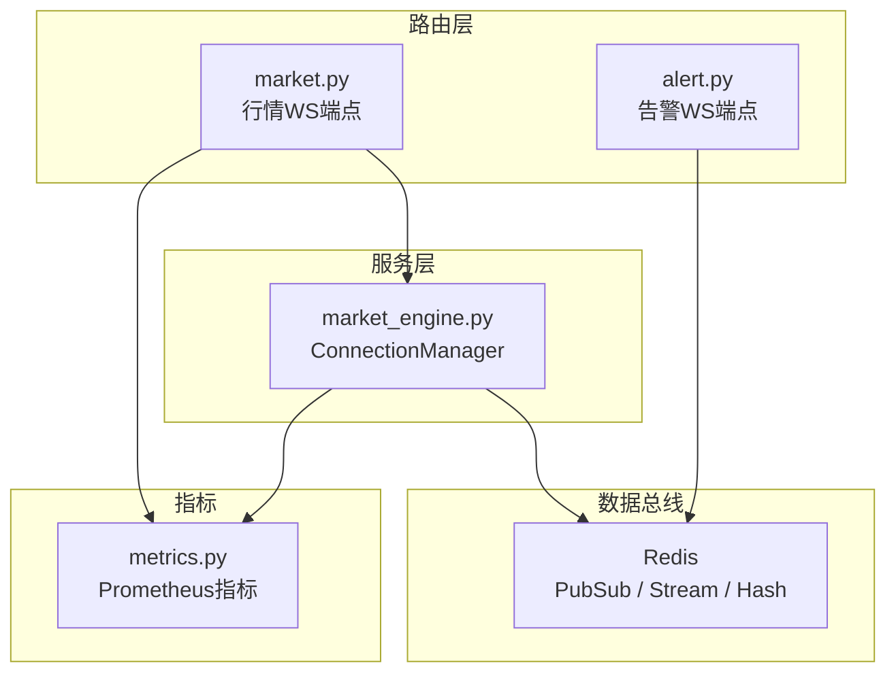
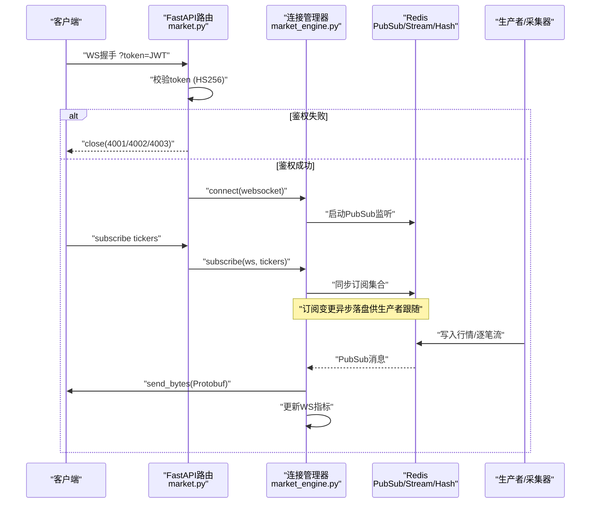
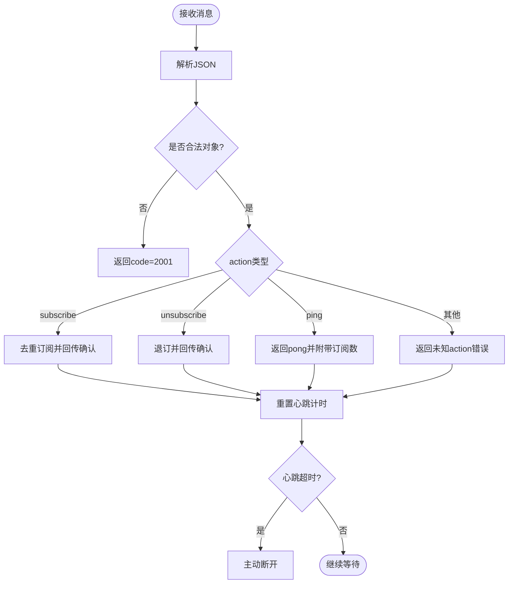
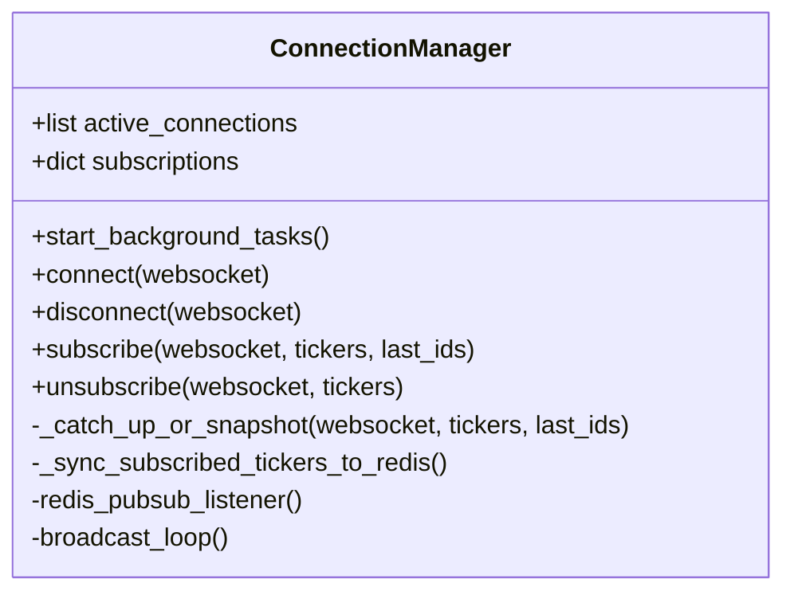
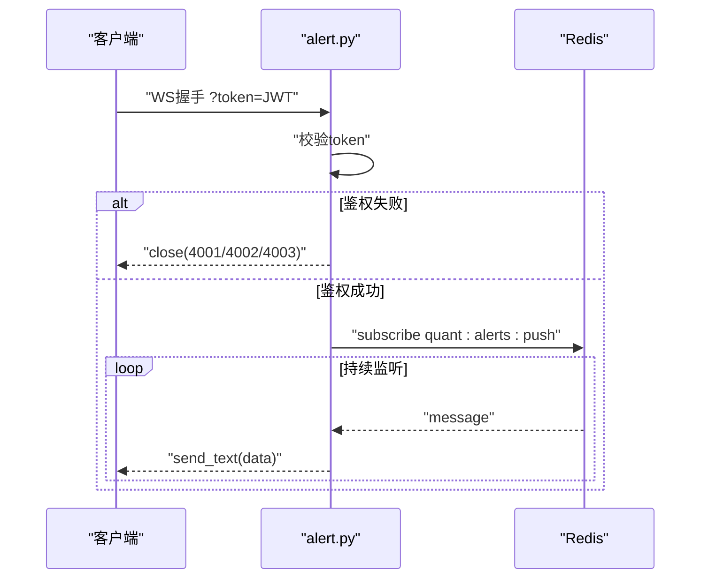
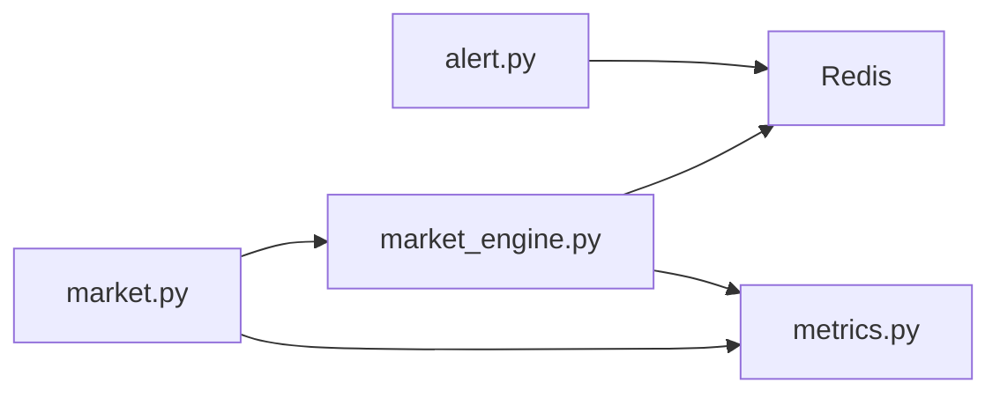

# WebSocket连接管理

<cite>
**本文引用的文件**
- [backend/routers/market.py](file://backend/routers/market.py)
- [backend/services/market_engine.py](file://backend/services/market_engine.py)
- [backend/core/metrics.py](file://backend/core/metrics.py)
- [backend/routers/alert.py](file://backend/routers/alert.py)
- [backend/tests/test_market_websocket_auth.py](file://backend/tests/test_market_websocket_auth.py)
</cite>

## 目录
1. [简介](#简介)
2. [项目结构](#项目结构)
3. [核心组件](#核心组件)
4. [架构总览](#架构总览)
5. [详细组件分析](#详细组件分析)
6. [依赖关系分析](#依赖关系分析)
7. [性能考量](#性能考量)
8. [故障排查指南](#故障排查指南)
9. [结论](#结论)
10. [附录](#附录)

## 简介
本文件面向Quant Agent系统的WebSocket连接管理，聚焦以下目标：
- 连接建立、维护与断开的完整生命周期管理
- 连接池管理、心跳检测与重连策略（客户端侧）
- 多客户端连接的生命周期、鉴权与权限控制、资源隔离
- WebSocket消息的编解码格式、协议版本兼容与错误处理机制
- 连接状态监控、性能指标收集与内存使用优化
- 常见故障排查与性能调优建议

系统包含两类WebSocket能力：
- 行情实时推送：/market/quotes/ws，基于订阅模型，结合Redis Pub/Sub与Protobuf二进制帧，提供低延迟、高吞吐的行情广播
- 告警实时推送：/alert/ws，基于Redis Pub/Sub的消息转发，支持鉴权与简单心跳

## 项目结构
与WebSocket相关的后端实现主要分布在以下模块：
- 路由层：负责HTTP/WebSocket端点注册、请求校验、鉴权与基础流程编排
- 服务层：ConnectionManager负责连接池、订阅管理、Redis监听与广播、追补与快照
- 指标层：Prometheus指标定义，覆盖连接数、消息发送量、订阅数等
- 测试：针对鉴权分支与消息处理的单元测试

图表来源
- [backend/routers/market.py:73-226](file://backend/routers/market.py#L73-L226)
- [backend/services/market_engine.py:115-331](file://backend/services/market_engine.py#L115-L331)
- [backend/core/metrics.py:53-72](file://backend/core/metrics.py#L53-L72)

章节来源
- [backend/routers/market.py:73-226](file://backend/routers/market.py#L73-L226)
- [backend/services/market_engine.py:115-331](file://backend/services/market_engine.py#L115-L331)
- [backend/core/metrics.py:53-72](file://backend/core/metrics.py#L53-L72)

## 核心组件
- 行情WebSocket端点（/market/quotes/ws）
  - 功能：连接鉴权、心跳保活、订阅/退订、ping/pong增强心跳、背压保护提示
  - 关键逻辑：从Query String解析JWT token；调用manager.connect/disconnect/subscribe/unsubscribe；根据action分发处理
- 连接管理器（ConnectionManager）
  - 功能：连接池、订阅表、Redis Pub/Sub监听、广播循环、追补与快照、后台任务启动
  - 关键逻辑：active_connections、subscriptions字典；redis_pubsub_listener；broadcast_loop；_catch_up_or_snapshot
- 告警WebSocket端点（/alert/ws）
  - 功能：连接鉴权、Redis Pub/Sub订阅转发、简单心跳（ping/pong）
- 指标体系
  - WS_ACTIVE_CONNECTIONS、WS_MESSAGES_SENT、WS_SUBSCRIPTIONS等用于观测连接与消息

章节来源
- [backend/routers/market.py:73-226](file://backend/routers/market.py#L73-L226)
- [backend/services/market_engine.py:115-331](file://backend/services/market_engine.py#L115-L331)
- [backend/routers/alert.py:148-211](file://backend/routers/alert.py#L148-L211)
- [backend/core/metrics.py:53-72](file://backend/core/metrics.py#L53-L72)

## 架构总览
下图展示从客户端到服务端再到Redis数据总线的端到端流程，包括鉴权、订阅、广播与指标上报。

图表来源
- [backend/routers/market.py:73-226](file://backend/routers/market.py#L73-L226)
- [backend/services/market_engine.py:174-331](file://backend/services/market_engine.py#L174-L331)
- [backend/core/metrics.py:53-72](file://backend/core/metrics.py#L53-L72)

## 详细组件分析

### 行情WebSocket端点（/market/quotes/ws）
- 连接鉴权
  - 从query参数获取token，使用HS256解码，要求payload包含sub字段
  - 鉴权失败返回不同关闭码：缺token、无效token、无效payload
- 心跳与超时
  - 每次收到消息重置last_heartbeat
  - 超过阈值（默认60秒）无心跳则主动断开
- 消息协议
  - action: subscribe/unsubscribe/ping
  - tickers: 字符串或逗号分隔字符串，自动格式化为统一前缀
  - last_ids: 可选，用于断线后追补
- 响应信封
  - code/msg/data/ts 标准信封；系统消息与业务消息共用
- 指标上报
  - 发送消息时按type分类计数

图表来源
- [backend/routers/market.py:104-226](file://backend/routers/market.py#L104-L226)

章节来源
- [backend/routers/market.py:73-226](file://backend/routers/market.py#L73-L226)

### 连接管理器（ConnectionManager）
- 连接池与订阅表
  - active_connections: 活跃连接列表
  - subscriptions: 连接到标的集合的映射
- 背景任务
  - redis_pubsub_listener: 监听quant:quotes:stream，按订阅过滤后send_bytes
  - broadcast_loop: 定时拉取技术指标、资金流、账户信息，写Redis并触发广播
- 追补与快照
  - _catch_up_or_snapshot: 通过XRANGE按last_id追补，批量压缩发送；若无last_id则发送最新快照
- 订阅同步
  - _sync_subscribed_tickers_to_redis: 将当前所有前端订阅汇总写入Redis集合，供生产者动态跟随
- 指标与内存
  - 更新WS_ACTIVE_CONNECTIONS、WS_SUBSCRIPTIONS、WS_MESSAGES_SENT
  - 清理不再需要的缓存项，防止内存泄漏

图表来源
- [backend/services/market_engine.py:115-331](file://backend/services/market_engine.py#L115-L331)

章节来源
- [backend/services/market_engine.py:115-331](file://backend/services/market_engine.py#L115-L331)

### 告警WebSocket端点（/alert/ws）
- 鉴权：从query参数读取token，使用HS256解码，要求payload包含sub
- 连接管理：维护全局连接池，记录活跃连接数量
- 消息转发：订阅Redis频道quant:alerts:push，将消息转发给客户端
- 心跳：支持ping/pong

图表来源
- [backend/routers/alert.py:148-211](file://backend/routers/alert.py#L148-L211)

章节来源
- [backend/routers/alert.py:148-211](file://backend/routers/alert.py#L148-L211)

### 鉴权与权限控制
- 鉴权方式：JWT HS256，token在query参数中传递
- 权限控制：当前实现以用户标识（sub）进行连接级鉴权；订阅粒度未做细粒度权限校验，需结合业务扩展
- 安全建议：
  - 对敏感场景可引入短期会话令牌或二次校验
  - 订阅维度可增加用户-标的白名单校验

章节来源
- [backend/routers/market.py:82-97](file://backend/routers/market.py#L82-L97)
- [backend/routers/alert.py:154-166](file://backend/routers/alert.py#L154-L166)
- [backend/tests/test_market_websocket_auth.py:57-110](file://backend/tests/test_market_websocket_auth.py#L57-L110)

### 心跳检测与重连策略
- 服务端心跳
  - market端点：收到任何消息即重置心跳计时；超过阈值（默认60秒）主动断开
  - alert端点：支持ping/pong，但未见超时强制断开逻辑
- 客户端重连策略（建议）
  - 指数退避重连：初始间隔1s，最大间隔30s，抖动±20%
  - 心跳失败判定：连续N次ping无响应视为断线
  - 断线恢复：重新鉴权并subscribe上次订阅集，携带last_ids进行追补

章节来源
- [backend/routers/market.py:104-226](file://backend/routers/market.py#L104-L226)
- [backend/routers/alert.py:193-211](file://backend/routers/alert.py#L193-L211)

### 消息编解码与协议兼容
- 编解码格式
  - 文本消息：JSON信封 {code,msg,data,ts}，action为subscribe/unsubscribe/ping
  - 二进制消息：Protobuf序列化后的QuoteData/Order等，直接send_bytes
- 协议兼容
  - ticker自动格式化，兼容多种输入形式
  - 支持last_ids断线追补，兼容历史包与快照
- 错误处理
  - JSON解析失败返回code=2001
  - 未知action返回code=2001
  - 鉴权失败返回不同关闭码

章节来源
- [backend/routers/market.py:104-226](file://backend/routers/market.py#L104-L226)
- [backend/services/market_engine.py:39-113](file://backend/services/market_engine.py#L39-L113)
- [backend/tests/test_market_websocket_auth.py:116-234](file://backend/tests/test_market_websocket_auth.py#L116-L234)

### 连接状态监控与性能指标
- 指标定义
  - WS_ACTIVE_CONNECTIONS：当前活跃连接数
  - WS_MESSAGES_SENT：按type分类的消息发送总数
  - WS_SUBSCRIPTIONS：当前订阅总数
- 指标埋点位置
  - 连接建立/断开、订阅变更、消息发送时更新
- 监控建议
  - 设置连接数与消息丢弃告警
  - 关注订阅增长趋势与慢客户端导致的背压

章节来源
- [backend/core/metrics.py:53-72](file://backend/core/metrics.py#L53-L72)
- [backend/services/market_engine.py:174-196](file://backend/services/market_engine.py#L174-L196)
- [backend/services/market_engine.py:315-320](file://backend/services/market_engine.py#L315-L320)

## 依赖关系分析
- 路由与服务耦合
  - market.py依赖ConnectionManager进行连接与订阅管理
  - alert.py依赖Redis Pub/Sub进行消息转发
- Redis依赖
  - 行情：quant:quotes:stream（PubSub）、quant:trades:stream:{ticker}（Stream）、quant:quotes:latest（Hash）
  - 订阅同步：quant:ws:subscribed_tickers（Set）
- 指标依赖
  - Prometheus指标库，用于连接与消息统计

图表来源
- [backend/routers/market.py:73-226](file://backend/routers/market.py#L73-L226)
- [backend/services/market_engine.py:115-331](file://backend/services/market_engine.py#L115-L331)
- [backend/routers/alert.py:148-211](file://backend/routers/alert.py#L148-L211)
- [backend/core/metrics.py:53-72](file://backend/core/metrics.py#L53-L72)

章节来源
- [backend/routers/market.py:73-226](file://backend/routers/market.py#L73-L226)
- [backend/services/market_engine.py:115-331](file://backend/services/market_engine.py#L115-L331)
- [backend/routers/alert.py:148-211](file://backend/routers/alert.py#L148-L211)
- [backend/core/metrics.py:53-72](file://backend/core/metrics.py#L53-L72)

## 性能考量
- 背压与缓冲
  - 慢客户端可能导致缓冲区堆积；建议在客户端侧实现队列限流与丢弃策略
- 批量与压缩
  - 追补超过100条时采用批量+压缩发送，降低网络开销
- 订阅去重
  - 重复订阅同一ticker不会重复注册，减少冗余负载
- 后台任务节流
  - 技术指标与资金流刷新采用时间窗口与退避策略，避免请求风暴
- 指标与可观测性
  - 通过Prometheus指标观察连接数、消息量与订阅数，定位瓶颈

章节来源
- [backend/services/market_engine.py:201-244](file://backend/services/market_engine.py#L201-L244)
- [backend/services/market_engine.py:332-601](file://backend/services/market_engine.py#L332-L601)
- [backend/core/metrics.py:53-72](file://backend/core/metrics.py#L53-L72)

## 故障排查指南
- 鉴权失败
  - 现象：连接立即关闭，返回4001/4002/4003
  - 排查：检查token是否存在、是否过期、payload是否包含sub
  - 参考：[backend/routers/market.py:82-97](file://backend/routers/market.py#L82-L97)、[backend/routers/alert.py:154-166](file://backend/routers/alert.py#L154-L166)
- 心跳超时
  - 现象：长时间无消息导致断开
  - 排查：确保客户端定期发送消息或ping；调整超时阈值
  - 参考：[backend/routers/market.py:216-226](file://backend/routers/market.py#L216-L226)
- 订阅无效
  - 现象：未收到行情推送
  - 排查：确认tickers格式是否正确；检查订阅是否成功；查看Redis订阅集合
  - 参考：[backend/services/market_engine.py:253-268](file://backend/services/market_engine.py#L253-L268)
- 断线后数据缺失
  - 现象：重连后缺少部分数据
  - 排查：客户端应携带last_ids进行追补；服务端通过XRANGE补发
  - 参考：[backend/services/market_engine.py:201-244](file://backend/services/market_engine.py#L201-L244)
- 性能问题
  - 现象：高并发下延迟升高或丢包
  - 排查：关注WS_MESSAGES_DROPPED指标；检查客户端背压；优化订阅粒度
  - 参考：[backend/core/metrics.py:53-72](file://backend/core/metrics.py#L53-L72)

章节来源
- [backend/routers/market.py:82-97](file://backend/routers/market.py#L82-L97)
- [backend/routers/market.py:216-226](file://backend/routers/market.py#L216-L226)
- [backend/services/market_engine.py:201-268](file://backend/services/market_engine.py#L201-L268)
- [backend/core/metrics.py:53-72](file://backend/core/metrics.py#L53-L72)

## 结论
Quant Agent的WebSocket连接管理围绕“鉴权—订阅—广播—指标”的主线构建，具备：
- 清晰的连接生命周期与心跳机制
- 基于Redis的高效广播与追补能力
- 完善的指标体系与可观测性
- 良好的可扩展性与容错设计

建议在生产环境中：
- 强化客户端重连与心跳策略
- 细化订阅权限控制
- 持续优化背压与内存占用
- 完善监控告警与故障自愈

## 附录
- 常用端点
  - 行情WS：/market/quotes/ws
  - 告警WS：/alert/ws
- 关键配置
  - JWT密钥：SECRET_KEY
  - 心跳超时：_WS_HEARTBEAT_TIMEOUT（默认60秒）
- 测试用例
  - 鉴权分支与消息处理覆盖见测试文件

章节来源
- [backend/routers/market.py:73-226](file://backend/routers/market.py#L73-L226)
- [backend/routers/alert.py:148-211](file://backend/routers/alert.py#L148-L211)
- [backend/tests/test_market_websocket_auth.py:57-234](file://backend/tests/test_market_websocket_auth.py#L57-L234)
