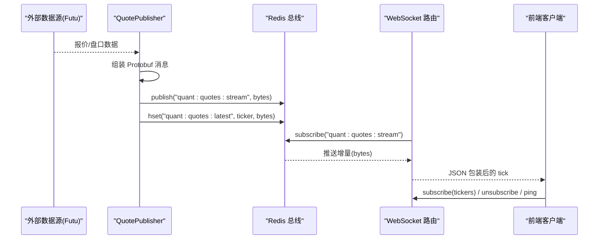
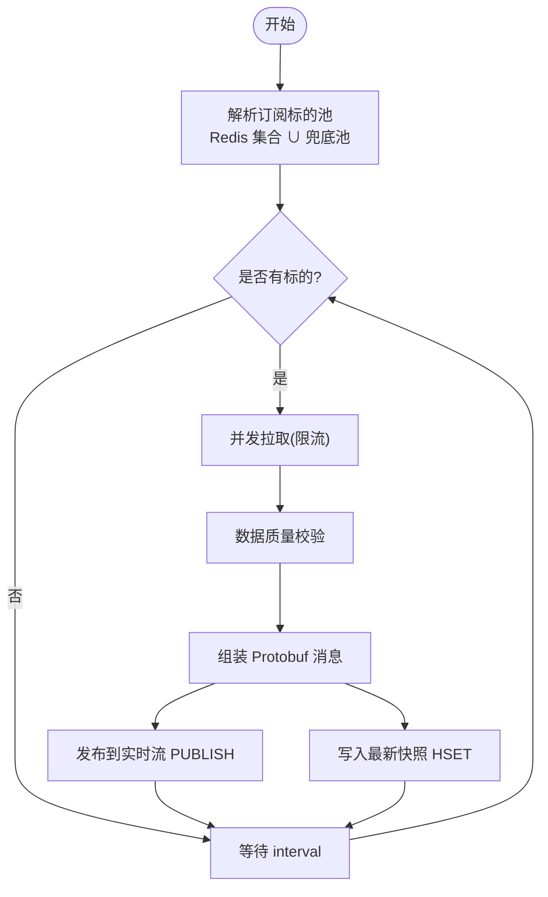
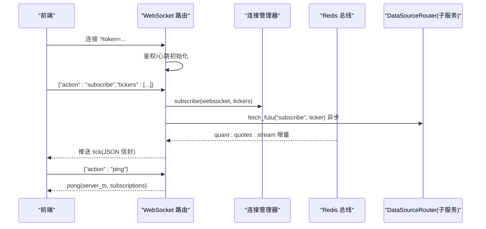
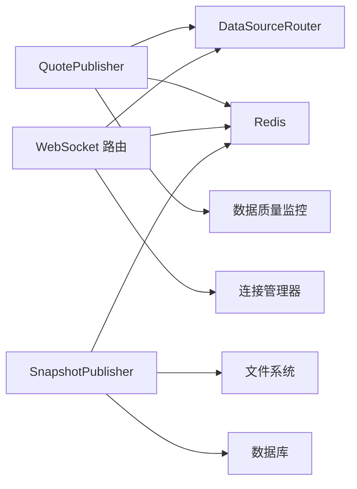

# 实时数据推送

<cite>
**本文引用的文件**
- [backend/workers/quote_publisher.py](file://backend/workers/quote_publisher.py)
- [backend/workers/collectors/quote_publisher.py](file://backend/workers/collectors/quote_publisher.py)
- [backend/routers/market.py](file://backend/routers/market.py)
- [backend/app/market_data.py](file://backend/app/market_data.py)
- [backend/services/datalake/snapshot_publisher.py](file://backend/services/datalake/snapshot_publisher.py)
- [shared/proto/market.proto](file://shared/proto/market.proto)
- [backend/core/proto/market_pb2.py](file://backend/core/proto/market_pb2.py)
</cite>

## 目录
1. [引言](#引言)
2. [项目结构](#项目结构)
3. [核心组件](#核心组件)
4. [架构总览](#架构总览)
5. [详细组件分析](#详细组件分析)
6. [依赖关系分析](#依赖关系分析)
7. [性能与优化](#性能与优化)
8. [监控、延迟分析与故障诊断](#监控延迟分析与故障诊断)
9. [补偿机制与一致性保证](#补偿机制与一致性保证)
10. [结论](#结论)

## 引言
本文件面向 Quant Agent 系统的“实时数据推送”能力，围绕 Level 2 盘口、订单簿深度、价格变动通知等高频数据的采集、处理、分发进行系统化说明。重点覆盖：
- 实时数据从外部数据源到 Redis 总线再到前端 WebSocket 的端到端流程
- 优先级调度、批量推送、增量更新机制
- WebSocket 广播、点对点推送、订阅模式
- 数据格式标准化（Protobuf）、压缩传输、限流控制
- 推送性能监控、延迟分析、故障诊断方法
- 推送失败补偿与数据一致性保障方案

## 项目结构
实时推送相关代码主要分布在以下模块：
- 生产者侧：后台轮询并推送行情至 Redis 消息总线（Redis Pub/Sub + Hash 快照）
- 接入侧：WebSocket 路由负责鉴权、心跳、订阅管理、背压保护
- 协议层：使用 Protobuf 定义统一行情消息结构，二进制序列化后在总线上传输
- 快照侧：定时将 live 层数据发布为只读快照，便于回溯与一致性校验

```mermaid
graph TB
A["外部数据源<br/>Futu/OpenD"] --> B["QuotePublisher<br/>生产者任务"]
B --> C["Redis 消息总线<br/>quant:quotes:stream"]
B --> D["Redis 最新快照<br/>quant:quotes:latest"]
E["前端客户端"] < --> F["FastAPI WebSocket<br/>/market/quotes/ws"]
C --> F
D --> E
```

图表来源
- [backend/workers/quote_publisher.py:22-164](file://backend/workers/quote_publisher.py#L22-L164)
- [backend/routers/market.py:73-226](file://backend/routers/market.py#L73-L226)

章节来源
- [backend/workers/quote_publisher.py:22-234](file://backend/workers/quote_publisher.py#L22-L234)
- [backend/routers/market.py:73-226](file://backend/routers/market.py#L73-L226)

## 核心组件
- QuotePublisher（行情生产者）
  - 职责：周期拉取报价与 Level 2 盘口，组装 Protobuf 消息，双写 Redis（最新快照 + 实时流），支持并发限流与容错
  - 关键路径：轮询标的池 → 并发拉取 → 质量校验 → Protobuf 序列化 → Redis 双写
- WebSocket 路由（/market/quotes/ws）
  - 职责：连接鉴权、心跳保活、订阅去重、背压保护、回传子服务以建立真实订阅
  - 关键路径：接收 subscribe/unsubscribe/ping → 维护订阅集合 → 触发底层订阅 → 消费 Redis 流推送
- 快照发布器（SnapshotPublisher）
  - 职责：将 live 层数据打包为只读快照，生成清单与元信息，写入数据库与 Redis 索引
  - 关键路径：锁定 → 质量门控 → 硬链接/复制 → 清单构建 → 持久化与索引

章节来源
- [backend/workers/quote_publisher.py:22-234](file://backend/workers/quote_publisher.py#L22-L234)
- [backend/routers/market.py:73-226](file://backend/routers/market.py#L73-L226)
- [backend/services/datalake/snapshot_publisher.py:91-250](file://backend/services/datalake/snapshot_publisher.py#L91-L250)

## 架构总览
系统采用“生产者-总线-消费者”的解耦架构：
- 生产者：独立进程/任务，专注数据采集与编码，避免阻塞前端连接
- 总线：Redis Pub/Sub 承载高频增量；Hash 承载最新快照，供冷启动快速补齐
- 消费者：WebSocket 连接按订阅维度消费增量，同时可从快照获取初始状态



图表来源
- [backend/workers/quote_publisher.py:90-164](file://backend/workers/quote_publisher.py#L90-L164)
- [backend/routers/market.py:73-226](file://backend/routers/market.py#L73-L226)

## 详细组件分析

### 行情生产者（QuotePublisher）
- 数据采集
  - 通过 DataSourceRouter 并发拉取 QUOTE 与 ORDER_BOOK，兼容不同字段命名
  - 超时与异常捕获，不注入假数据，确保总线数据可信
- 数据处理
  - 数据质量校验（基于数据源维度的质量监控）
  - 组装 Protobuf 消息（包含 status、ticker、last_price、change_pct、volume_str、source、bids、asks）
- 分发策略
  - 双写：最新快照（HSET）用于冷启动快速读取；实时流（PUBLISH）用于已连接用户即时跳动
  - 并发限流：全局信号量限制并发拉取，防止打满连接池或触发外部限流
  - 动态标的池：结合前端订阅集合与兜底常驻池，保证推送与自选一致
- 守护循环
  - 周期性解析订阅标的，批量并发拉取，严格控制间隔，避免被外部 API 封禁



图表来源
- [backend/workers/quote_publisher.py:166-222](file://backend/workers/quote_publisher.py#L166-L222)
- [backend/workers/quote_publisher.py:90-164](file://backend/workers/quote_publisher.py#L90-L164)

章节来源
- [backend/workers/quote_publisher.py:22-234](file://backend/workers/quote_publisher.py#L22-L234)

### WebSocket 接入与订阅管理
- 连接鉴权：从 QueryString 提取 JWT 并解码，拒绝无效/过期 token
- 心跳保活：记录最后心跳时间，超过阈值自动断开
- 订阅去重：重复 subscribe 同一 ticker 不会重复注册
- 背压保护：慢客户端缓冲区超过阈值时丢弃最旧消息（由管理器实现）
- 真实订阅：对非不支持的 Futu 标的，异步回传子服务建立真实订阅，减少轮询延迟
- 消息协议：action=subscribe/unsubscribe/ping，返回确认与当前订阅数量



图表来源
- [backend/routers/market.py:73-226](file://backend/routers/market.py#L73-L226)

章节来源
- [backend/routers/market.py:73-226](file://backend/routers/market.py#L73-L226)

### 快照发布（SnapshotPublisher）
- 目的：将 live 层数据发布为只读快照，便于回溯、审计与一致性校验
- 流程：分布式锁 → 质量门控 → 硬链接/复制 → 清单构建 → 持久化 → Redis 索引最新快照
- 输出：manifest.json、sidecars（如 universe）、数据库记录、Redis 键指向最新快照 ID

章节来源
- [backend/services/datalake/snapshot_publisher.py:91-250](file://backend/services/datalake/snapshot_publisher.py#L91-L250)

### 数据模型与协议
- Protobuf 消息：Order、QuoteData 等，用于二进制序列化，降低带宽与解析开销
- 字段语义：status、ticker、last_price、change_pct、volume_str、source、bids、asks
- 优势：跨语言、紧凑、高效，适合高频场景

章节来源
- [shared/proto/market.proto](file://shared/proto/market.proto)
- [backend/core/proto/market_pb2.py](file://backend/core/proto/market_pb2.py)

## 依赖关系分析
- QuotePublisher 依赖：
  - DataSourceRouter：拉取 QUOTE/ORDER_BOOK 及 subscribe/unsubscribe
  - Redis：消息总线与快照存储
  - 数据质量监控：按数据源维度校验报价
- WebSocket 路由依赖：
  - 连接管理器：维护连接与订阅集合
  - DataSourceRouter：回传子服务建立真实订阅
  - Redis：消费实时流
- SnapshotPublisher 依赖：
  - 文件系统：live 层 Parquet 文件
  - 数据库：快照元信息
  - Redis：最新快照索引



图表来源
- [backend/workers/quote_publisher.py:22-164](file://backend/workers/quote_publisher.py#L22-L164)
- [backend/routers/market.py:73-226](file://backend/routers/market.py#L73-L226)
- [backend/services/datalake/snapshot_publisher.py:91-250](file://backend/services/datalake/snapshot_publisher.py#L91-L250)

章节来源
- [backend/workers/quote_publisher.py:22-234](file://backend/workers/quote_publisher.py#L22-L234)
- [backend/routers/market.py:73-226](file://backend/routers/market.py#L73-L226)
- [backend/services/datalake/snapshot_publisher.py:91-250](file://backend/services/datalake/snapshot_publisher.py#L91-L250)

## 性能与优化
- 数据格式标准化
  - 使用 Protobuf 序列化行情消息，显著降低体积与解析成本
  - 参考：[backend/workers/quote_publisher.py:133-150](file://backend/workers/quote_publisher.py#L133-L150)
- 压缩传输
  - 生产环境可在 Redis 与 WebSocket 链路启用 gzip/snappy 压缩，进一步降低带宽
  - 注意：CPU 与网络权衡，需根据峰值流量评估
- 限流控制
  - 生产者侧使用信号量限制并发拉取，避免打满外部连接池或触发 IP 封禁
  - 参考：[backend/workers/quote_publisher.py:176-187](file://backend/workers/quote_publisher.py#L176-L187)
- 批量推送与增量更新
  - 增量：Redis Pub/Sub 仅推送变化，适合高频 tick
  - 批量：按标的池批量并发拉取，提升吞吐
  - 参考：[backend/workers/quote_publisher.py:189-217](file://backend/workers/quote_publisher.py#L189-L217)
- 背压保护
  - WebSocket 慢客户端缓冲超限时丢弃最旧消息，避免内存膨胀
  - 参考：[backend/routers/market.py:73-81](file://backend/routers/market.py#L73-L81)

章节来源
- [backend/workers/quote_publisher.py:133-217](file://backend/workers/quote_publisher.py#L133-L217)
- [backend/routers/market.py:73-81](file://backend/routers/market.py#L73-L81)

## 监控、延迟分析与故障诊断
- 指标与日志
  - 发送消息计数：WS_MESSAGES_SENT（按类型标记 system/error）
  - 数据质量监控：按数据源维度上报报价质量
  - 快照创建指标：DATALAKE_SNAPSHOT_CREATED
  - 参考：
    - [backend/routers/market.py:9-11](file://backend/routers/market.py#L9-L11)
    - [backend/workers/quote_publisher.py:108-131](file://backend/workers/quote_publisher.py#L108-L131)
    - [backend/services/datalake/snapshot_publisher.py:225-237](file://backend/services/datalake/snapshot_publisher.py#L225-L237)
- 延迟分析
  - 接口级：/quote、/history 等返回 latency_ms
  - 订阅级：pong 响应携带 server_ts，可计算端到端 RTT
  - 参考：
    - [backend/routers/market.py:342-401](file://backend/routers/market.py#L342-L401)
    - [backend/routers/market.py:173-190](file://backend/routers/market.py#L173-L190)
- 故障诊断
  - 健康检查：/health/services 聚合各数据源与网关状态
  - Futu 状态：/futu/status 探测远程节点可达性与 OpenD 连接
  - 参考：
    - [backend/routers/market.py:228-327](file://backend/routers/market.py#L228-L327)

章节来源
- [backend/routers/market.py:9-11](file://backend/routers/market.py#L9-L11)
- [backend/routers/market.py:173-190](file://backend/routers/market.py#L173-L190)
- [backend/routers/market.py:228-327](file://backend/routers/market.py#L228-L327)
- [backend/routers/market.py:342-401](file://backend/routers/market.py#L342-L401)
- [backend/workers/quote_publisher.py:108-131](file://backend/workers/quote_publisher.py#L108-L131)
- [backend/services/datalake/snapshot_publisher.py:225-237](file://backend/services/datalake/snapshot_publisher.py#L225-L237)

## 补偿机制与一致性保证
- 推送失败补偿
  - 生产者侧异常捕获：超时/异常不注入假数据，避免污染总线
  - 快照作为冷启动补偿：新连接可从 quant:quotes:latest 获取最近快照，再消费增量补齐
  - 参考：
    - [backend/workers/quote_publisher.py:90-106](file://backend/workers/quote_publisher.py#L90-L106)
    - [backend/workers/quote_publisher.py:152-157](file://backend/workers/quote_publisher.py#L152-L157)
- 数据一致性
  - 快照幂等：按日期生成唯一 snapshot_id，重复执行跳过已发布快照
  - 分布式锁：Redis NX 锁防止并发重复构建快照
  - 质量门控：未通过质量检查则标记失败并记录 manifest
  - 参考：
    - [backend/services/datalake/snapshot_publisher.py:119-156](file://backend/services/datalake/snapshot_publisher.py#L119-L156)
    - [backend/services/datalake/snapshot_publisher.py:158-205](file://backend/services/datalake/snapshot_publisher.py#L158-L205)
- 订阅一致性
  - 动态标的池：前端订阅集合与兜底池并集，保证推送范围与用户意图一致
  - 真实订阅：对支持的标的异步回传子服务建立真实订阅，减少轮询延迟
  - 参考：
    - [backend/workers/quote_publisher.py:189-198](file://backend/workers/quote_publisher.py#L189-L198)
    - [backend/routers/market.py:129-161](file://backend/routers/market.py#L129-L161)

章节来源
- [backend/workers/quote_publisher.py:90-198](file://backend/workers/quote_publisher.py#L90-L198)
- [backend/routers/market.py:129-161](file://backend/routers/market.py#L129-L161)
- [backend/services/datalake/snapshot_publisher.py:119-205](file://backend/services/datalake/snapshot_publisher.py#L119-L205)

## 结论
Quant Agent 的实时数据推送采用“生产者-总线-消费者”的解耦架构，通过 Protobuf 标准化数据、Redis 双写（快照+流）实现高吞吐与低延迟，结合 WebSocket 鉴权、心跳、订阅管理与背压保护，提供稳定的前端体验。配合质量门控、快照幂等与分布式锁，系统在一致性与可靠性方面具备良好保障。建议在生产环境中引入压缩传输、细粒度限流与更丰富的延迟指标，以进一步提升性能与可观测性。
