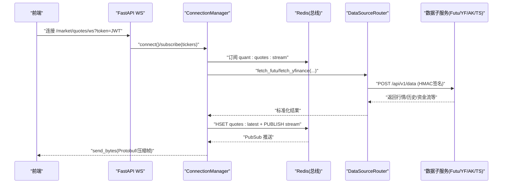
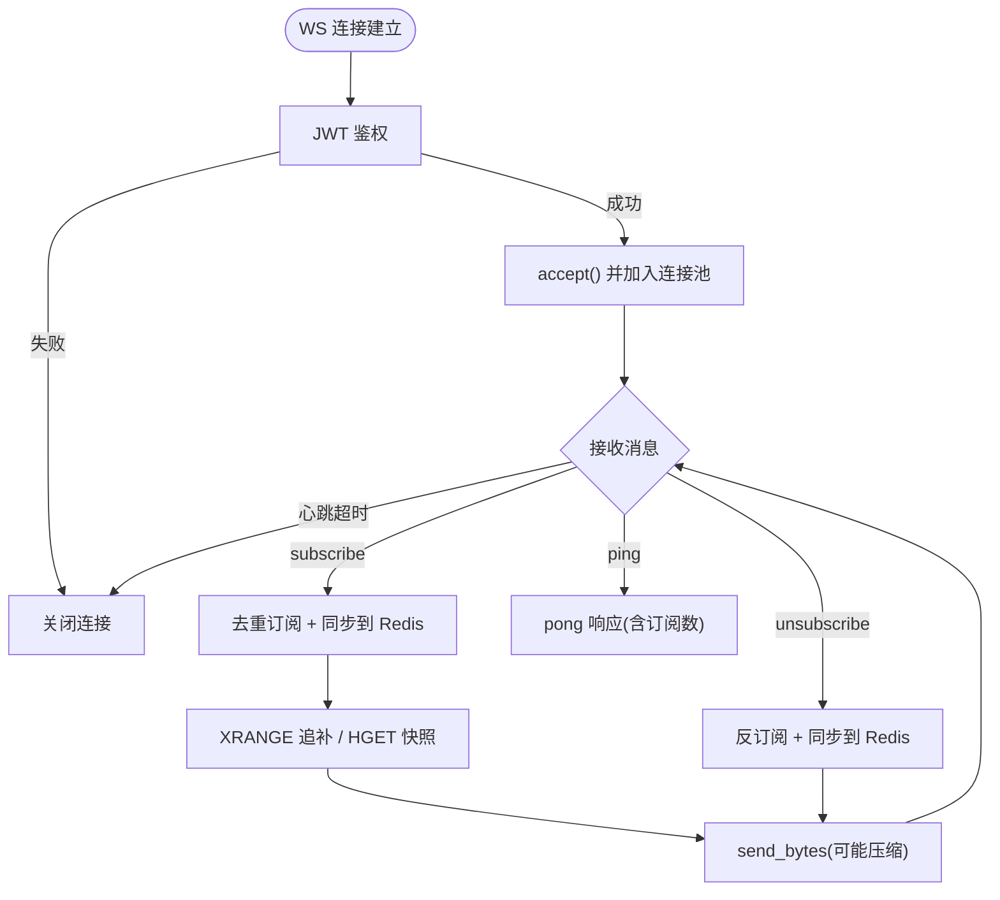
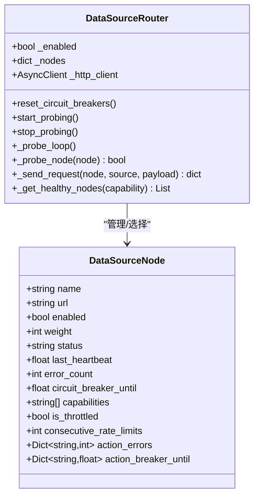
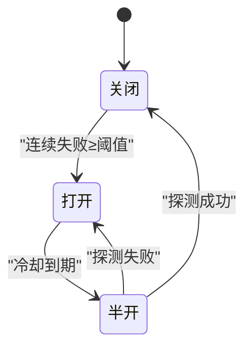
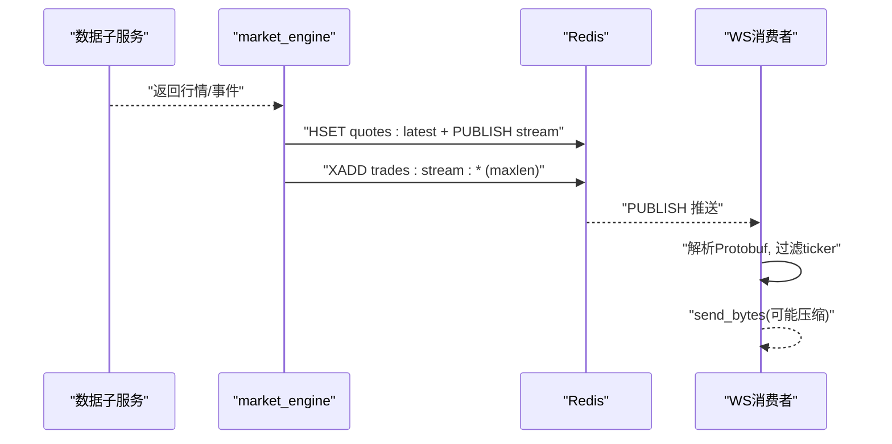
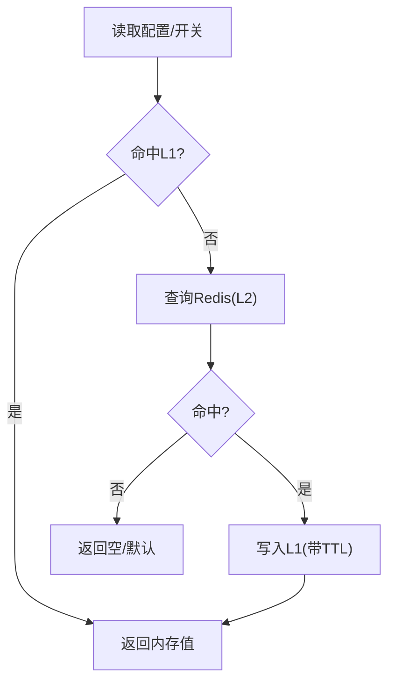
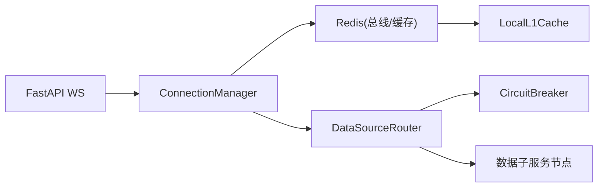

# 实时数据流处理

<cite>
**本文引用的文件**
- [backend/services/market_engine.py](file://backend/services/market_engine.py)
- [backend/routers/market.py](file://backend/routers/market.py)
- [backend/core/redis_client.py](file://backend/core/redis_client.py)
- [backend/core/circuit_breaker.py](file://backend/core/circuit_breaker.py)
- [backend/services/datasource/router.py](file://backend/services/datasource/router.py)
- [data_subservice/futu_src/source_router.py](file://data_subservice/futu_src/source_router.py)
- [backend/core/cache_manager.py](file://backend/core/cache_manager.py)
</cite>

## 目录
1. [简介](#简介)
2. [项目结构](#项目结构)
3. [核心组件](#核心组件)
4. [架构总览](#架构总览)
5. [详细组件分析](#详细组件分析)
6. [依赖关系分析](#依赖关系分析)
7. [性能考量](#性能考量)
8. [故障排查指南](#故障排查指南)
9. [结论](#结论)
10. [附录](#附录)

## 简介
本文件面向 Quant Agent 系统的实时数据流处理，聚焦以下目标：
- WebSocket 连接管理与心跳保活、订阅/退订机制
- 实时行情推送与数据分发策略（Redis Pub/Sub + WS 广播）
- 数据采集、处理、缓存更新流程（含 Level 2 盘口、订单簿深度、价格变动通知）
- 数据源路由器的负载均衡、健康检查、熔断保护与限流控制
- 实时数据的缓存策略（内存 L1、Redis 持久化、过期策略）
- 端到端时序图与架构图（从数据源到前端展示）
- 性能优化建议（批量处理、异步 IO、连接池管理）
- 常见问题定位与调优建议

## 项目结构
实时数据流涉及“接入层（WebSocket）— 分发层（Redis 总线）— 采集层（数据源路由器/子服务）— 缓存层（L1/L2）— 前端”的完整链路。关键模块职责如下：
- 接入层：FastAPI 路由提供 WebSocket 接口，负责鉴权、心跳、订阅/退订、消息回包
- 分发层：ConnectionManager 维护活跃连接与订阅集合，监听 Redis 频道并定向推送
- 采集层：DataSourceRouter 将请求路由至多节点子服务（Futu/YFinance/AKShare/Tushare 等），内置熔断与自愈探针
- 缓存层：Redis 作为数据总线与持久缓存；进程内 L1 缓存用于高频配置读取
- 前端：通过 WebSocket 接收二进制 Protobuf 帧或 JSON 指令，渲染实时盘口与指标

```mermaid
graph TB
Client["前端客户端"] --> WS["FastAPI WebSocket /market/quotes/ws"]
WS --> CM["ConnectionManager<br/>连接/订阅/广播"]
CM --> RPUB["Redis PubSub<br/>quant:quotes:stream"]
CM --> RSTREAM["Redis Stream<br/>quant:trades:stream:*"]
CM --> ROUTER["DataSourceRouter<br/>跨节点路由"]
ROUTER --> YF["YFinance 子服务"]
ROUTER --> AK["AKShare 子服务"]
ROUTER --> TS["Tushare 子服务"]
ROUTER --> FUTU["Futu 子服务"]
CM --> REDIS["Redis 缓存<br/>HGET/HSET/PUBLISH"]
Client <-- WS
```

图表来源
- [backend/routers/market.py:73-226](file://backend/routers/market.py#L73-L226)
- [backend/services/market_engine.py:115-331](file://backend/services/market_engine.py#L115-L331)
- [backend/services/datasource/router.py:249-800](file://backend/services/datasource/router.py#L249-L800)
- [backend/core/redis_client.py:1-252](file://backend/core/redis_client.py#L1-L252)

章节来源
- [backend/routers/market.py:73-226](file://backend/routers/market.py#L73-L226)
- [backend/services/market_engine.py:115-331](file://backend/services/market_engine.py#L115-L331)
- [backend/services/datasource/router.py:249-800](file://backend/services/datasource/router.py#L249-L800)
- [backend/core/redis_client.py:1-252](file://backend/core/redis_client.py#L1-L252)

## 核心组件
- WebSocket 接入与鉴权：支持 JWT 校验、心跳超时断开、动作协议（subscribe/unsubscribe/ping）
- 连接管理器：维护活跃连接、订阅集合、背景任务（广播循环、Redis PubSub 监听）、追补与快照
- 数据源路由器：统一封装多节点 HTTP 调用、HMAC 签名、错误分类、限流识别、熔断与半开自愈探针
- 缓存与总线：Redis 作为数据总线（Pub/Sub 与 Stream）、最新报价 Hash、L1 本地短效缓存
- 熔断器：按服务维度状态机（CLOSED/OPEN/HALF_OPEN），支持限流类错误不计入失败计数

章节来源
- [backend/routers/market.py:73-226](file://backend/routers/market.py#L73-L226)
- [backend/services/market_engine.py:115-331](file://backend/services/market_engine.py#L115-L331)
- [backend/services/datasource/router.py:249-800](file://backend/services/datasource/router.py#L249-L800)
- [backend/core/redis_client.py:1-252](file://backend/core/redis_client.py#L1-L252)
- [backend/core/circuit_breaker.py:1-379](file://backend/core/circuit_breaker.py#L1-L379)

## 架构总览
下图展示了从数据源到前端的完整链路：数据源经 DataSourceRouter 路由到对应子服务，子服务返回数据后由 market_engine 写入 Redis（最新报价与交易流），并通过 Pub/Sub 广播；WS 消费者根据订阅过滤后推送到前端。



图表来源
- [backend/routers/market.py:73-226](file://backend/routers/market.py#L73-L226)
- [backend/services/market_engine.py:39-113](file://backend/services/market_engine.py#L39-L113)
- [backend/services/datasource/router.py:669-748](file://backend/services/datasource/router.py#L669-L748)

## 详细组件分析

### WebSocket 连接管理与实时推送
- 连接鉴权：从 QueryString 提取 JWT 并解码，校验失败直接关闭连接
- 心跳保活：记录 last_heartbeat，超过阈值自动断开，防止僵尸连接
- 订阅/退订：去重注册，同步到 Redis 供生产者 daemon 动态跟随前端自选列表
- 追补与快照：新订阅时通过 XRANGE 获取错过消息，若数量大则组合为压缩批次帧发送；否则逐条发送；无 last_id 时从 Redis 拉取最新快照
- 广播与过滤：后台监听 Redis 频道，解析 Protobuf 获取 ticker，仅向关注该标的的连接推送



图表来源
- [backend/routers/market.py:73-226](file://backend/routers/market.py#L73-L226)
- [backend/services/market_engine.py:174-243](file://backend/services/market_engine.py#L174-L243)
- [backend/services/market_engine.py:296-331](file://backend/services/market_engine.py#L296-L331)

章节来源
- [backend/routers/market.py:73-226](file://backend/routers/market.py#L73-L226)
- [backend/services/market_engine.py:174-243](file://backend/services/market_engine.py#L174-L243)
- [backend/services/market_engine.py:296-331](file://backend/services/market_engine.py#L296-L331)

### 数据源路由器：负载均衡、健康检查、熔断与限流
- 节点拓扑：YFinance 主备、AKShare/Tushare 北京单节点、Futu/FMP/Finnhub/宏观/搜索等远程节点
- 负载均衡：按能力集选择健康节点，支持权重与限流压力感知（被限流节点降低优先级）
- 健康检查：启动期 URL 校验，运行期后台半开探针周期性探测 /health，恢复后复位状态
- 熔断保护：按 action 级隔离熔断，避免单 action 失败误杀整节点；支持环境配置最大失败次数与冷却时间
- 限流识别：HTTP 头与文本兜底识别限流，标记为 RATE_LIMIT，不计入熔断失败计数
- HMAC 安全：对请求体做标准签名，子服务验签失败返回 403



图表来源
- [backend/services/datasource/router.py:222-247](file://backend/services/datasource/router.py#L222-L247)
- [backend/services/datasource/router.py:249-800](file://backend/services/datasource/router.py#L249-L800)

章节来源
- [backend/services/datasource/router.py:249-800](file://backend/services/datasource/router.py#L249-L800)

### 熔断器：状态机与限流解耦
- 状态机：CLOSED → OPEN（连续失败达到阈值）→ HALF_OPEN（冷却到期）→ CLOSED（探测成功）
- 限流解耦：支持 error_classifier 钩子或全局 is_rate_limit_error，限流类错误不计入失败计数
- 可观测性：暴露状态与转换指标，便于监控告警
- 使用方式：装饰器或 call/call_sync 包装外部调用



图表来源
- [backend/core/circuit_breaker.py:45-98](file://backend/core/circuit_breaker.py#L45-L98)
- [backend/core/circuit_breaker.py:147-218](file://backend/core/circuit_breaker.py#L147-L218)

章节来源
- [backend/core/circuit_breaker.py:1-379](file://backend/core/circuit_breaker.py#L1-L379)

### 实时数据写入与分发（Level 2 盘口、订单簿深度、价格变动通知）
- 最新报价写入：将行情数据序列化为 Protobuf，写入 Redis Hash（quant:quotes:latest），并发布到频道（quant:quotes:stream）
- 事件流双写：逐笔成交等事件写入 Redis Stream（带 maxlen 防膨胀），同时发布到频道供在线用户即时消费
- 订阅过滤：消费者解析 Protobuf 获取 ticker，仅推送给本机订阅了该标的的 WS 连接
- 价格变动报警：基于最新价与涨跌幅触发用户自定义阈值报警，并异步发送通知



图表来源
- [backend/services/market_engine.py:39-113](file://backend/services/market_engine.py#L39-L113)
- [backend/services/market_engine.py:296-331](file://backend/services/market_engine.py#L296-L331)

章节来源
- [backend/services/market_engine.py:39-113](file://backend/services/market_engine.py#L39-L113)
- [backend/services/market_engine.py:296-331](file://backend/services/market_engine.py#L296-L331)

### 缓存策略：内存 L1、Redis 持久化、过期策略
- 内存 L1：LocalL1Cache 提供毫秒级读取，默认 TTL 10s，容量上限触发安全清空，后台定时清理过期键
- Redis 持久化：最新报价 Hash、交易流 Stream、订阅集合 Set、设置项 Key（如 yfinance 开关）
- 过期策略：L1 默认 TTL；业务 Key 可按需设置 ex；Stream 通过 maxlen 限制长度
- 缓存清理：统一工具按白名单前缀扫描删除，保护交易态 key（OMS 相关）不被误删



图表来源
- [backend/core/redis_client.py:180-252](file://backend/core/redis_client.py#L180-L252)
- [backend/core/cache_manager.py:1-75](file://backend/core/cache_manager.py#L1-L75)

章节来源
- [backend/core/redis_client.py:1-252](file://backend/core/redis_client.py#L1-L252)
- [backend/core/cache_manager.py:1-75](file://backend/core/cache_manager.py#L1-L75)

## 依赖关系分析
- 接入层依赖 ConnectionManager 进行连接与订阅管理
- ConnectionManager 依赖 Redis 进行数据总线与缓存，依赖 DataSourceRouter 拉取数据
- DataSourceRouter 依赖 httpx 与多个数据子服务节点，内部包含熔断器与半开探针
- 熔断器依赖异常分类与指标埋点，限流错误不计入失败计数
- 缓存层提供 L1/L2 读写与批量写入队列，支撑高吞吐场景



图表来源
- [backend/routers/market.py:73-226](file://backend/routers/market.py#L73-L226)
- [backend/services/market_engine.py:115-331](file://backend/services/market_engine.py#L115-L331)
- [backend/services/datasource/router.py:249-800](file://backend/services/datasource/router.py#L249-L800)
- [backend/core/redis_client.py:1-252](file://backend/core/redis_client.py#L1-L252)
- [backend/core/circuit_breaker.py:1-379](file://backend/core/circuit_breaker.py#L1-L379)

章节来源
- [backend/routers/market.py:73-226](file://backend/routers/market.py#L73-L226)
- [backend/services/market_engine.py:115-331](file://backend/services/market_engine.py#L115-L331)
- [backend/services/datasource/router.py:249-800](file://backend/services/datasource/router.py#L249-L800)
- [backend/core/redis_client.py:1-252](file://backend/core/redis_client.py#L1-L252)
- [backend/core/circuit_breaker.py:1-379](file://backend/core/circuit_breaker.py#L1-L379)

## 性能考量
- 批量与压缩：追补消息超过阈值时，组合为单一二进制帧并使用 zlib 压缩，减少网络往返与带宽占用
- 异步 IO：全链路采用 asyncio，WS 接收/发送、Redis 操作、HTTP 请求均非阻塞
- 连接池：Redis 使用连接池，httpx 使用 AsyncClient 并限制最大连接数，避免资源耗尽
- 限流与退避：数据源侧识别限流并降权，熔断器在连续失败后进入冷却，避免雪崩
- 缓存分层：L1 内存缓存消除极高频读的网络开销；Redis 作为持久化与广播介质
- 背景任务：技术指标与资金流低频数据定时刷新，避免每 3 秒全量并发导致线程池退化

[本节为通用性能指导，不直接分析具体文件]

## 故障排查指南
- WebSocket 断连与鉴权失败
  - 现象：连接立即关闭或心跳超时断开
  - 排查：检查 token 是否有效、服务端是否启用鉴权、心跳间隔是否合理
  - 参考路径：[backend/routers/market.py:73-226](file://backend/routers/market.py#L73-L226)
- 订阅未收到推送
  - 现象：subscribe 成功但无数据
  - 排查：确认 Redis 频道是否正常发布、消费者是否正确解析 Protobuf 并按 ticker 过滤
  - 参考路径：[backend/services/market_engine.py:296-331](file://backend/services/market_engine.py#L296-L331)
- 数据源不可用或频繁报错
  - 现象：行情接口返回错误或降级
  - 排查：查看 DataSourceRouter 健康状态、熔断状态、半开探针是否恢复；检查 HMAC 密钥配置
  - 参考路径：[backend/services/datasource/router.py:249-800](file://backend/services/datasource/router.py#L249-L800)
- 熔断器持续打开
  - 现象：外部 API 调用被拒绝
  - 排查：确认连续失败次数与冷却时间；检查限流类错误是否被正确识别并跳过计数
  - 参考路径：[backend/core/circuit_breaker.py:147-218](file://backend/core/circuit_breaker.py#L147-L218)
- 缓存不一致或丢失
  - 现象：最新报价未更新或旧数据残留
  - 排查：检查 Redis Hash 写入与过期策略；L1 缓存容量是否触发清空；清理工具是否误删受保护 key
  - 参考路径：[backend/core/redis_client.py:180-252](file://backend/core/redis_client.py#L180-L252), [backend/core/cache_manager.py:1-75](file://backend/core/cache_manager.py#L1-L75)

章节来源
- [backend/routers/market.py:73-226](file://backend/routers/market.py#L73-L226)
- [backend/services/market_engine.py:296-331](file://backend/services/market_engine.py#L296-L331)
- [backend/services/datasource/router.py:249-800](file://backend/services/datasource/router.py#L249-L800)
- [backend/core/circuit_breaker.py:147-218](file://backend/core/circuit_breaker.py#L147-L218)
- [backend/core/redis_client.py:180-252](file://backend/core/redis_client.py#L180-L252)
- [backend/core/cache_manager.py:1-75](file://backend/core/cache_manager.py#L1-L75)

## 结论
Quant Agent 的实时数据流以 WebSocket 为入口、Redis 为总线、DataSourceRouter 为路由中枢，结合熔断与半开自愈探针保障高可用。通过 L1/L2 缓存分层与批量压缩传输，系统在低延迟与高吞吐之间取得平衡。针对 Level 2 盘口、订单簿深度与价格变动通知，系统实现了可靠的双写与精准分发。运维层面可通过健康检查、熔断状态与指标监控快速定位问题并进行调优。

[本节为总结性内容，不直接分析具体文件]

## 附录
- 关键环境变量
  - DATA_SOURCE_ROUTER_ENABLED：是否启用数据源路由
  - *_REMOTE_URL：各数据源子服务地址（逗号分隔多活）
  - DATA_SOURCE_HMAC_SECRET：节点间通信签名密钥
  - CIRCUIT_BREAKER_MAX_FAILURES / CIRCUIT_BREAKER_COOLDOWN_S：熔断参数
  - REDIS_HOST/PORT/PASSWORD/MAX_CONNECTIONS：Redis 连接池配置
  - L1_CACHE_MAX_SIZE：L1 缓存容量上限
- 常用 Redis Key
  - quant:quotes:latest：最新报价（Protobuf 序列化）
  - quant:trades:stream:*：逐笔成交事件流（带 maxlen）
  - quant:ws:subscribed_tickers：当前前端订阅标的集合
  - quant:alerts:by_ticker:{ticker}：用户价格报警规则
  - quant:settings:yfinance_enabled：YFinance 开关

[本节为补充信息，不直接分析具体文件]
