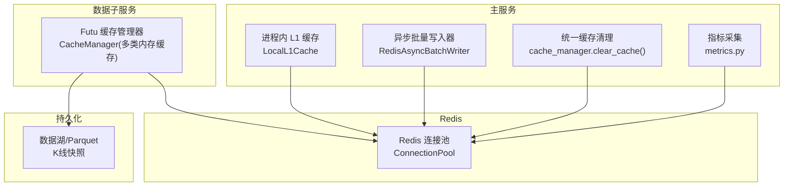
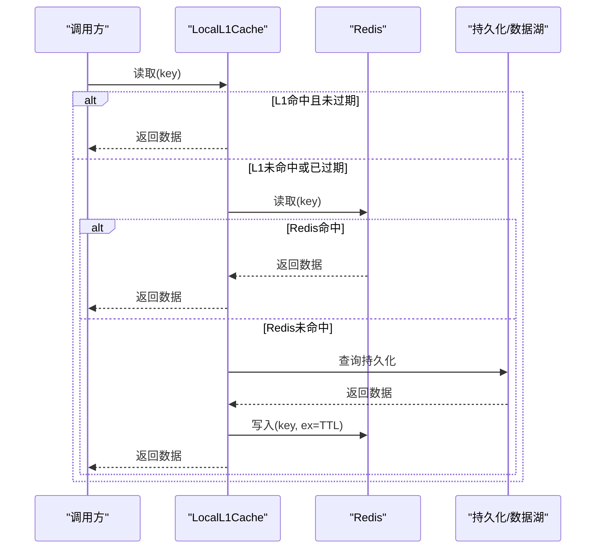
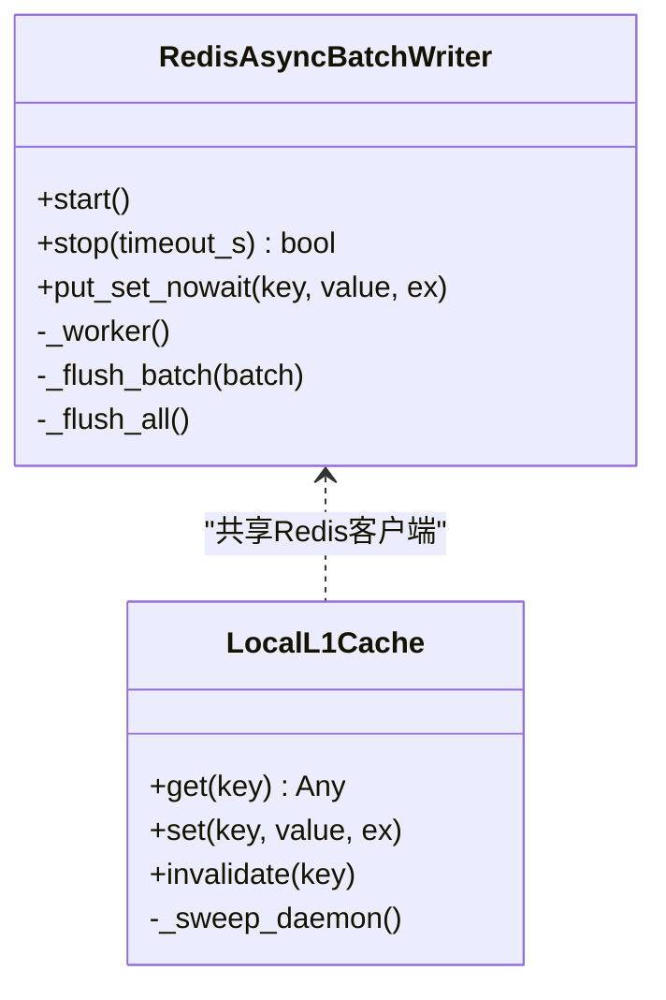
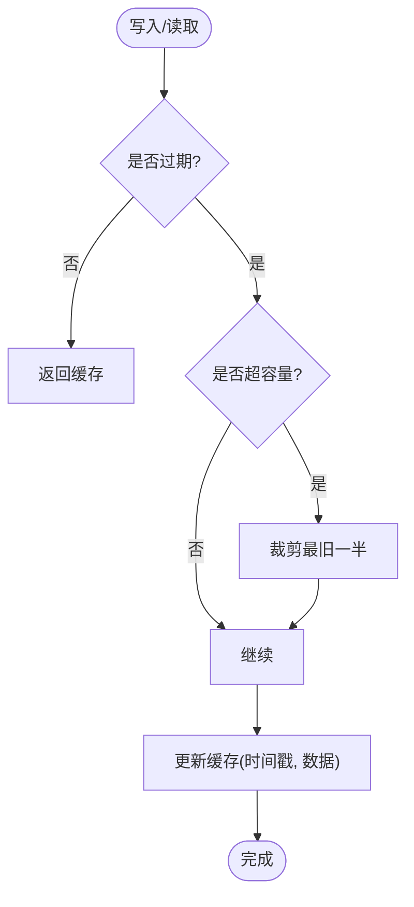
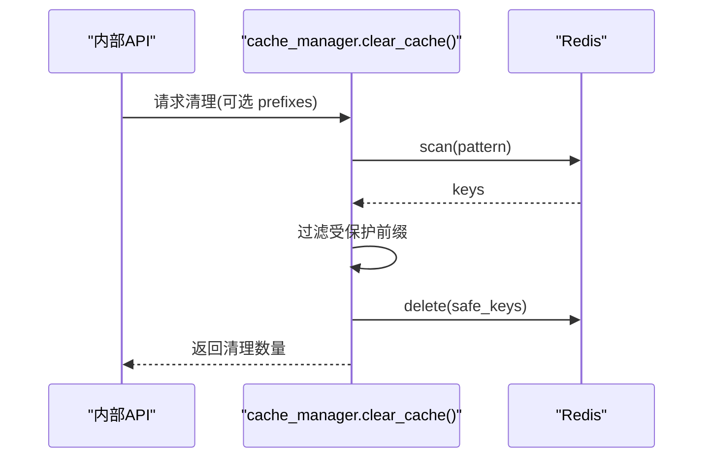
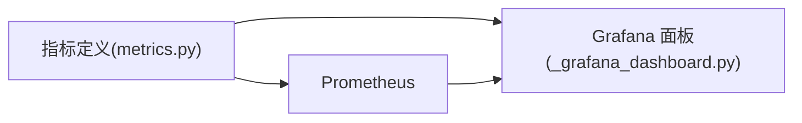
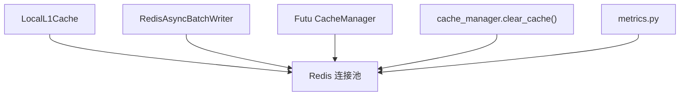

# 缓存策略

<cite>
**本文引用的文件**
- [backend/core/redis_client.py](file://backend/core/redis_client.py)
- [backend/core/cache_manager.py](file://backend/core/cache_manager.py)
- [data_subservice/futu_src/cache_manager.py](file://data_subservice/futu_src/cache_manager.py)
- [backend/core/metrics.py](file://backend/core/metrics.py)
- [backend/routers/_grafana_dashboard.py](file://backend/routers/_grafana_dashboard.py)
- [backend/app/macro_app.py](file://backend/app/macro_app.py)
- [backend/tests/test_cache_manager.py](file://backend/tests/test_cache_manager.py)
</cite>

## 目录
1. [简介](#简介)
2. [项目结构](#项目结构)
3. [核心组件](#核心组件)
4. [架构总览](#架构总览)
5. [详细组件分析](#详细组件分析)
6. [依赖关系分析](#依赖关系分析)
7. [性能考量](#性能考量)
8. [故障排查指南](#故障排查指南)
9. [结论](#结论)
10. [附录](#附录)

## 简介
本文件系统性阐述 Quant Agent 的多级缓存策略与实现，覆盖内存缓存（L1）、Redis 缓存（L2）与持久化存储（数据湖/Parquet）的层次设计；针对不同数据类型（行情、历史K线、基本面等）给出 TTL、过期与更新机制；说明热点识别、预加载与预热；涵盖一致性、并发控制、内存管理优化；并提供命中率监控、性能分析与故障排查方法，以及失效策略、数据同步与分布式一致性方案。

## 项目结构
Quant Agent 的缓存体系由以下关键模块构成：
- Redis 连接池与异步批量写入器：统一接入 Redis，提供高吞吐写路径与连接池上限保护
- 进程内 L1 本地缓存：对极高频读取进行零网络开销命中
- Futu 子服务缓存管理器：按数据类型划分内存缓存，内置 TTL 与容量熔断
- 统一缓存清理工具：安全清理业务缓存并保护交易态键空间
- 指标与可视化：K线缓存命中、实时价 tick 缓存命中率等指标及 Grafana 面板

图表来源
- [backend/core/redis_client.py:25-34](file://backend/core/redis_client.py#L25-L34)
- [backend/core/redis_client.py:46-177](file://backend/core/redis_client.py#L46-L177)
- [backend/core/redis_client.py:184-251](file://backend/core/redis_client.py#L184-L251)
- [data_subservice/futu_src/cache_manager.py:30-149](file://data_subservice/futu_src/cache_manager.py#L30-L149)
- [backend/core/cache_manager.py:47-74](file://backend/core/cache_manager.py#L47-L74)
- [backend/core/metrics.py:290-301](file://backend/core/metrics.py#L290-L301)

章节来源
- [backend/core/redis_client.py:25-34](file://backend/core/redis_client.py#L25-L34)
- [backend/core/redis_client.py:46-177](file://backend/core/redis_client.py#L46-L177)
- [backend/core/redis_client.py:184-251](file://backend/core/redis_client.py#L184-L251)
- [data_subservice/futu_src/cache_manager.py:30-149](file://data_subservice/futu_src/cache_manager.py#L30-L149)
- [backend/core/cache_manager.py:47-74](file://backend/core/cache_manager.py#L47-L74)
- [backend/core/metrics.py:290-301](file://backend/core/metrics.py#L290-L301)

## 核心组件
- Redis 连接池与批量写入器
  - 连接池：集中配置 host/port/password/max_connections，统一承载 Pub/Sub、缓存与限流
  - 异步批量写入：队列聚合 + Pipeline 批量执行，降低 RTT 与带宽占用；支持优雅停机 flush
- 进程内 L1 缓存
  - 默认短 TTL（如 10s），后台定时清理过期项；容量超限触发安全熔断清空
  - get/set 语义：get 未命中穿透到 Redis；set 同时回写 L1 保证强一致
- Futu 子服务缓存管理器
  - 按数据类型维护独立内存缓存字典，带各自 TTL（行情 30s、K线 1h、期权链 5m、资金流向 2m、盘口 30s、基本面 24h 等）
  - 定期清理过期条目并按容量阈值裁剪最旧一半，防止无界增长
- 统一缓存清理
  - 基于 scan 模式匹配前缀删除，受保护前缀（OMS 交易态）强制跳过
  - 异常隔离：scan/delete 失败不中断整体流程

章节来源
- [backend/core/redis_client.py:25-34](file://backend/core/redis_client.py#L25-L34)
- [backend/core/redis_client.py:46-177](file://backend/core/redis_client.py#L46-L177)
- [backend/core/redis_client.py:184-251](file://backend/core/redis_client.py#L184-L251)
- [data_subservice/futu_src/cache_manager.py:12-20](file://data_subservice/futu_src/cache_manager.py#L12-L20)
- [data_subservice/futu_src/cache_manager.py:125-149](file://data_subservice/futu_src/cache_manager.py#L125-L149)
- [backend/core/cache_manager.py:19-34](file://backend/core/cache_manager.py#L19-L34)
- [backend/core/cache_manager.py:47-74](file://backend/core/cache_manager.py#L47-L74)

## 架构总览
多级缓存从“最快”到“最慢”依次为：
- L1 内存缓存：进程内 dict，零网络延迟，适合极高频读（如系统开关、配置、热点 key）
- L2 Redis 缓存：共享缓存，跨进程/节点可见，用于 K线、新闻、宏观、insider 等业务数据
- 持久化层：数据湖/Parquet 快照，作为离线回溯与冷数据源

图表来源
- [backend/core/redis_client.py:184-251](file://backend/core/redis_client.py#L184-L251)
- [backend/core/metrics.py:290-301](file://backend/core/metrics.py#L290-L301)

## 详细组件分析

### 组件A：Redis 连接池与异步批量写入器
- 设计要点
  - 连接池上限可配置，避免无界连接导致资源耗尽
  - 异步批量写入通过队列+Pipeline 合并 set 操作，显著降低 RTT
  - 优雅停机：取消任务后强制 flush 剩余队列，确保数据不丢失
- 并发与一致性
  - 写路径为 Fire-and-Forget 入队，实际写入在后台协程串行执行，避免竞争
  - 配合 L1 缓存的 set 语义：先写 Redis，再更新 L1，保证强一致

图表来源
- [backend/core/redis_client.py:46-177](file://backend/core/redis_client.py#L46-L177)
- [backend/core/redis_client.py:184-251](file://backend/core/redis_client.py#L184-L251)

章节来源
- [backend/core/redis_client.py:25-34](file://backend/core/redis_client.py#L25-L34)
- [backend/core/redis_client.py:46-177](file://backend/core/redis_client.py#L46-L177)
- [backend/core/redis_client.py:184-251](file://backend/core/redis_client.py#L184-L251)

### 组件B：Futu 子服务缓存管理器（多类型内存缓存）
- 数据类型与 TTL
  - 行情快照：30s
  - K线历史：1h
  - 期权链：5m
  - 资金流向：2m
  - 盘口：30s
  - 基本面：24h
  - 主力筹码分层：5m
- 容量与过期
  - 每类缓存最大条目数限制，超过阈值裁剪最旧一半
  - 定期扫描并清理过期条目，防止内存泄漏
- 压缩与标准化
  - 期权链与行情数据压缩提取关键字段，减少序列化体积与传输成本

图表来源
- [data_subservice/futu_src/cache_manager.py:12-20](file://data_subservice/futu_src/cache_manager.py#L12-L20)
- [data_subservice/futu_src/cache_manager.py:125-149](file://data_subservice/futu_src/cache_manager.py#L125-L149)

章节来源
- [data_subservice/futu_src/cache_manager.py:30-149](file://data_subservice/futu_src/cache_manager.py#L30-L149)
- [data_subservice/futu_src/cache_manager.py:224-373](file://data_subservice/futu_src/cache_manager.py#L224-L373)

### 组件C：统一缓存清理（安全边界）
- 功能
  - 按前缀模式扫描并删除业务缓存键
  - 受保护前缀（OMS 交易态）绝对跳过，杜绝误删
- 健壮性
  - scan/delete 异常捕获并记录日志，不影响其他前缀处理
  - 单元测试覆盖默认前缀、自定义前缀、保护前缀与异常场景

图表来源
- [backend/core/cache_manager.py:47-74](file://backend/core/cache_manager.py#L47-L74)
- [backend/tests/test_cache_manager.py:33-91](file://backend/tests/test_cache_manager.py#L33-L91)

章节来源
- [backend/core/cache_manager.py:19-34](file://backend/core/cache_manager.py#L19-L34)
- [backend/core/cache_manager.py:47-74](file://backend/core/cache_manager.py#L47-L74)
- [backend/tests/test_cache_manager.py:33-91](file://backend/tests/test_cache_manager.py#L33-L91)

### 组件D：指标与可视化（命中率与降级）
- K线缓存命中指标
  - 计数器 quant_kline_cache_hit_total（维度：tier=redis|parquet|miss）
  - 直方图 quant_kline_cache_query_seconds（维度：tier）
- 实时价 tick 缓存指标
  - 计数器 quant_tick_cache_hits_total / quant_tick_cache_misses_total
  - 仪表盘 quant_tick_cache_hit_rate（Gauge）
- Grafana 面板
  - 提供 tick_cache 命中率、命中速率、降级速率等可视化

图表来源
- [backend/core/metrics.py:290-301](file://backend/core/metrics.py#L290-L301)
- [backend/core/metrics.py:496-509](file://backend/core/metrics.py#L496-L509)
- [backend/routers/_grafana_dashboard.py:13-33](file://backend/routers/_grafana_dashboard.py#L13-L33)
- [backend/routers/_grafana_dashboard.py:91-115](file://backend/routers/_grafana_dashboard.py#L91-L115)

章节来源
- [backend/core/metrics.py:290-301](file://backend/core/metrics.py#L290-L301)
- [backend/core/metrics.py:496-509](file://backend/core/metrics.py#L496-L509)
- [backend/routers/_grafana_dashboard.py:13-33](file://backend/routers/_grafana_dashboard.py#L13-L33)
- [backend/routers/_grafana_dashboard.py:91-115](file://backend/routers/_grafana_dashboard.py#L91-L115)

## 依赖关系分析
- 组件耦合
  - LocalL1Cache 依赖 Redis 客户端，写路径与批量写入器共享同一连接池
  - Futu CacheManager 独立于主服务，但通过 Redis 与主服务共享缓存键空间
  - cache_manager.clear_cache 直接操作 Redis，具备安全边界
- 外部依赖
  - Redis 连接池参数来自环境变量，便于部署期调优
  - 指标通过 Prometheus/Grafana 暴露与可视化

图表来源
- [backend/core/redis_client.py:25-34](file://backend/core/redis_client.py#L25-L34)
- [backend/core/redis_client.py:46-177](file://backend/core/redis_client.py#L46-L177)
- [backend/core/redis_client.py:184-251](file://backend/core/redis_client.py#L184-L251)
- [data_subservice/futu_src/cache_manager.py:30-149](file://data_subservice/futu_src/cache_manager.py#L30-L149)
- [backend/core/cache_manager.py:47-74](file://backend/core/cache_manager.py#L47-L74)
- [backend/core/metrics.py:290-301](file://backend/core/metrics.py#L290-L301)

章节来源
- [backend/core/redis_client.py:25-34](file://backend/core/redis_client.py#L25-L34)
- [backend/core/redis_client.py:46-177](file://backend/core/redis_client.py#L46-L177)
- [backend/core/redis_client.py:184-251](file://backend/core/redis_client.py#L184-L251)
- [data_subservice/futu_src/cache_manager.py:30-149](file://data_subservice/futu_src/cache_manager.py#L30-L149)
- [backend/core/cache_manager.py:47-74](file://backend/core/cache_manager.py#L47-L74)
- [backend/core/metrics.py:290-301](file://backend/core/metrics.py#L290-L301)

## 性能考量
- 高吞吐写路径
  - 使用异步批量写入器将多次 set 合并为 Pipeline 批量执行，降低 RTT 与带宽压力
  - 队列深度与批大小可调，平衡延迟与吞吐
- 内存管理
  - L1 缓存默认短 TTL 与后台清扫，容量超限触发安全熔断清空，避免内存泄漏
  - Futu 子服务各缓存类别设置 TTL 与最大条目数，定期裁剪最旧一半
- 连接池上限
  - REDIS_MAX_CONNECTIONS 可配置，避免连接泄漏与资源耗尽
- 热点数据
  - L1 缓存对热点 key 提供零网络延迟命中；tick 缓存命中率指标用于评估热点访问效果

[本节为通用性能指导，无需特定文件引用]

## 故障排查指南
- 缓存清理异常
  - 现象：scan/delete 抛错
  - 处理：清理逻辑捕获异常并记录日志，不影响其他前缀；检查 Redis 连通性与权限
  - 参考：[backend/core/cache_manager.py:57-71](file://backend/core/cache_manager.py#L57-L71)
- 交易态数据保护
  - 现象：误删 OMS 状态
  - 处理：确认受保护前缀未被删除；测试用例验证保护逻辑
  - 参考：[backend/core/cache_manager.py:19-34](file://backend/core/cache_manager.py#L19-L34)、[backend/tests/test_cache_manager.py:72-81](file://backend/tests/test_cache_manager.py#L72-L81)
- 实时价降级
  - 现象：WS 断流导致 tick_cache miss 升高
  - 处理：观察 Grafana 面板中 quant_tick_cache_hit_rate 与 rate(quant_tick_cache_misses_total[5m])；必要时切换 REST 快照
  - 参考：[backend/routers/_grafana_dashboard.py:91-115](file://backend/routers/_grafana_dashboard.py#L91-L115)
- 并发冲突与锁
  - 现象：同 key 并发写入导致竞态
  - 处理：使用 asyncio.Lock 对关键区域加锁（例如宏观数据获取）
  - 参考：[backend/app/macro_app.py:67-70](file://backend/app/macro_app.py#L67-L70)、[backend/app/macro_app.py:211-214](file://backend/app/macro_app.py#L211-L214)、[backend/app/macro_app.py:530-532](file://backend/app/macro_app.py#L530-L532)

章节来源
- [backend/core/cache_manager.py:57-71](file://backend/core/cache_manager.py#L57-L71)
- [backend/core/cache_manager.py:19-34](file://backend/core/cache_manager.py#L19-L34)
- [backend/tests/test_cache_manager.py:72-81](file://backend/tests/test_cache_manager.py#L72-L81)
- [backend/routers/_grafana_dashboard.py:91-115](file://backend/routers/_grafana_dashboard.py#L91-L115)
- [backend/app/macro_app.py:67-70](file://backend/app/macro_app.py#L67-L70)
- [backend/app/macro_app.py:211-214](file://backend/app/macro_app.py#L211-L214)
- [backend/app/macro_app.py:530-532](file://backend/app/macro_app.py#L530-L532)

## 结论
Quant Agent 采用“L1 内存 + L2 Redis + 持久化”的多级缓存架构，结合严格的 TTL、容量熔断与安全清理边界，兼顾高性能与稳定性。通过完善的指标与可视化，能够实时监控命中率与降级情况，快速定位问题。未来可进一步引入分布式锁与版本化键以增强一致性，并结合数据湖快照提升离线回溯能力。

[本节为总结性内容，无需特定文件引用]

## 附录
- 不同数据类型的缓存策略建议
  - 行情快照：L1 短 TTL（秒级），L2 短期缓存；热点标的可启用 L1 常驻
  - K线历史：L2 中长期缓存（小时级），配合数据湖快照做冷数据读取
  - 基本面数据：L2 长期缓存（天级），变更时主动失效
- 热点识别与预热
  - 基于指标 quant_tick_cache_hit_rate 与 K线缓存命中统计识别热点
  - 启动阶段对热门标的进行预加载，降低首访延迟
- 一致性方案
  - 写路径：先写 Redis，再更新 L1，保证强一致
  - 失效策略：业务事件触发键失效；定期清理过期条目
  - 分布式一致性：通过 Redis 共享键空间与有序清理，避免副本间不一致
- 监控与告警
  - 关注 quant_kline_cache_hit_total、quant_tick_cache_hit_rate、quant_tick_cache_misses_total
  - 配置 Grafana 告警：当 miss 速率持续高于阈值时触发

[本节为通用指导，无需特定文件引用]
