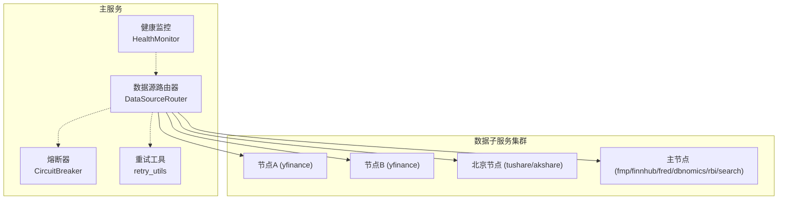
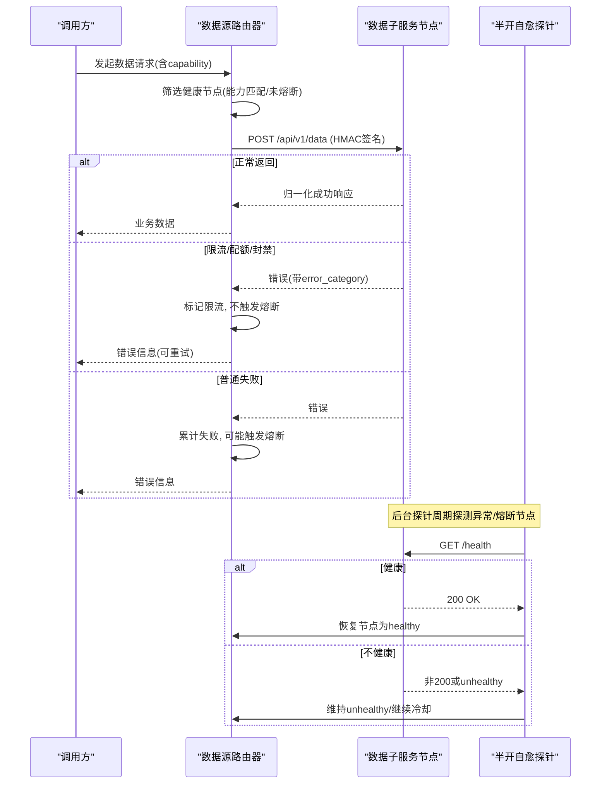
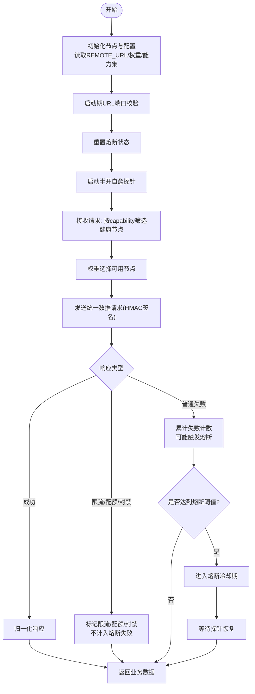
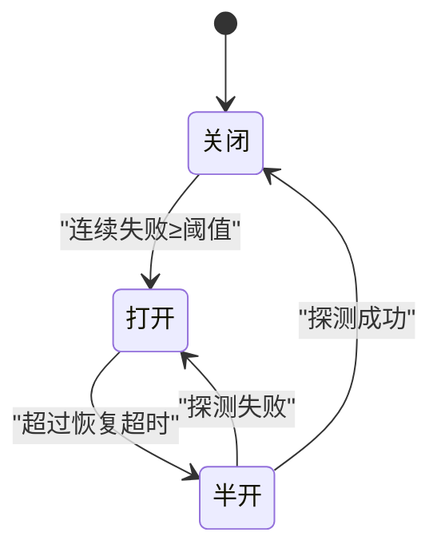
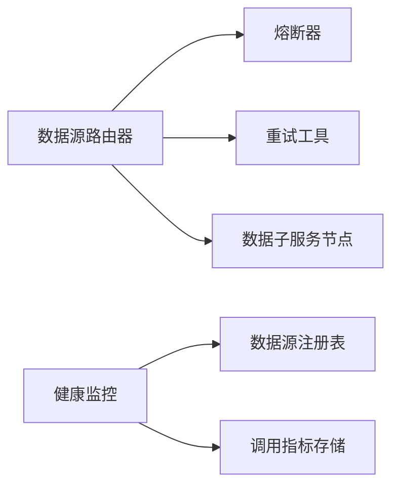

# 负载均衡与容灾

<cite>
**本文引用的文件**
- [backend/services/datasource/router.py](file://backend/services/datasource/router.py)
- [backend/core/circuit_breaker.py](file://backend/core/circuit_breaker.py)
- [backend/core/retry_utils.py](file://backend/core/retry_utils.py)
- [backend/services/datasource/health_monitor.py](file://backend/services/datasource/health_monitor.py)
</cite>

## 目录
1. [简介](#简介)
2. [项目结构](#项目结构)
3. [核心组件](#核心组件)
4. [架构总览](#架构总览)
5. [详细组件分析](#详细组件分析)
6. [依赖关系分析](#依赖关系分析)
7. [性能考量](#性能考量)
8. [故障排查指南](#故障排查指南)
9. [结论](#结论)
10. [附录](#附录)

## 简介
本文件聚焦 Quant Agent 系统的数据源路由、负载均衡与容灾能力，覆盖以下关键主题：
- 数据源路由器（DataSourceRouter）的负载均衡算法、权重分配、健康检查与故障转移机制
- 熔断保护（Circuit Breaker）、限流控制、重试策略的实现原理与联动
- 多节点拓扑、节点发现、动态配置更新
- 半开自愈探针、自动恢复机制、降级策略
- 监控指标、性能分析与故障诊断方法
- 常见故障场景处理方案与应急预案

## 项目结构
Quant Agent 在“主服务 + 数据子服务”的分布式拓扑中运行。主服务通过统一的数据端点将请求路由到不同数据子服务节点，实现跨节点的负载均衡与容灾。核心文件职责如下：
- 数据源路由器：负责节点管理、权重选择、健康检查、熔断隔离、重试与限流识别、半开自愈探针等
- 熔断器：提供通用熔断状态机与度量上报
- 重试工具：提供可重试错误的判定与指数退避重试装饰器
- 健康监控：周期性扫描数据源成功率与可达性，触发告警

**图表来源**
- [backend/services/datasource/router.py:222-579](file://backend/services/datasource/router.py#L222-L579)
- [backend/core/circuit_breaker.py:45-118](file://backend/core/circuit_breaker.py#L45-L118)
- [backend/core/retry_utils.py:10-57](file://backend/core/retry_utils.py#L10-L57)
- [backend/services/datasource/health_monitor.py:55-157](file://backend/services/datasource/health_monitor.py#L55-L157)

**章节来源**
- [backend/services/datasource/router.py:1-30](file://backend/services/datasource/router.py#L1-L30)
- [backend/services/datasource/router.py:222-579](file://backend/services/datasource/router.py#L222-L579)

## 核心组件
- 数据源路由器（DataSourceRouter）
  - 维护节点集合（名称、URL、权重、能力集、健康状态、熔断冷却时间戳、action 级熔断计数等）
  - 提供健康节点筛选、权重选择、错误分类、重试/限流识别、半开自愈探针
  - 启动期校验 URL 端口，防止误指向主服务自身
- 熔断器（CircuitBreaker）
  - 支持 CLOSED/OPEN/HALF_OPEN 状态机
  - 限流类错误不计入失败计数，避免误熔断
  - 暴露状态快照与手动重置接口
- 重试工具（retry_utils）
  - 定义可重试的错误类型（限流、封禁、网络异常、服务端错误码）
  - 提供指数退避+随机抖动的重试装饰器
- 健康监控（HealthMonitor）
  - 周期扫描各数据源成功率与可达性
  - 低于阈值或失联时推送告警（去重冷却）

**章节来源**
- [backend/services/datasource/router.py:222-579](file://backend/services/datasource/router.py#L222-L579)
- [backend/core/circuit_breaker.py:45-118](file://backend/core/circuit_breaker.py#L45-L118)
- [backend/core/retry_utils.py:10-57](file://backend/core/retry_utils.py#L10-L57)
- [backend/services/datasource/health_monitor.py:55-157](file://backend/services/datasource/health_monitor.py#L55-L157)

## 架构总览
数据源路由器的整体流程包括：
- 初始化阶段：加载环境变量中的远程节点 URL（支持逗号分隔多活），构建节点列表；启动期校验 URL 端口；重置熔断状态；启动半开自愈探针
- 请求阶段：根据 capability 筛选健康节点，结合权重进行负载选择；发送统一数据请求；对响应进行归一化；记录错误并触发熔断/限流/重试逻辑
- 健康探测阶段：后台任务定期探测处于异常或熔断冷却期的节点，成功则恢复为 healthy

**图表来源**
- [backend/services/datasource/router.py:669-748](file://backend/services/datasource/router.py#L669-L748)
- [backend/services/datasource/router.py:343-409](file://backend/services/datasource/router.py#L343-L409)
- [backend/core/circuit_breaker.py:88-118](file://backend/core/circuit_breaker.py#L88-L118)

## 详细组件分析

### 数据源路由器（DataSourceRouter）
- 节点模型（DataSourceNode）
  - 字段包含：名称、URL、启用标志、权重、健康状态、心跳时间、错误计数、熔断冷却截止时间、能力集、限流压力感知、半开自愈探针状态、action 级熔断计数与冷却时间
- 节点初始化与拓扑
  - 支持 YFinance 主备节点（逗号分隔多活）、AKShare/Tushare 远程（北京单节点）、Futu/FMP/Finnhub/宏观源/搜索抓取源（主节点 data_subservice）
  - 每个节点声明其 capabilities，用于按能力路由
- 负载均衡与权重选择
  - 仅选择 enabled、具备所需 capability、健康且不在熔断冷却期的节点
  - 权重用于加权选择（当前代码片段展示健康节点筛选，后续选择逻辑基于权重与可用性）
- 错误分类与限流识别
  - HTTP 状态码与响应头推断错误类别（限流、配额耗尽、IP封禁、普通错误）
  - 文本兜底识别限流关键词，避免子服务未携带 error_category 导致误判
- 重试与熔断联动
  - 限流类错误不计入熔断失败计数，避免误杀
  - action 级熔断隔离：同一节点承载多个 action 时，单个 action 连续失败不会整节点熔断；节点级兜底阈值由 capabilities 规模与比例决定
- 半开自愈探针
  - 后台任务周期探测 unhealthy 或熔断冷却中的节点，成功则恢复为 healthy
  - 探针使用 /health 端点，失败回退轻量 PING
- 启动期自检
  - 校验 URL 端口是否误指向主服务自身，提前暴露配置错误

**图表来源**
- [backend/services/datasource/router.py:222-579](file://backend/services/datasource/router.py#L222-L579)
- [backend/services/datasource/router.py:669-748](file://backend/services/datasource/router.py#L669-L748)
- [backend/services/datasource/router.py:343-409](file://backend/services/datasource/router.py#L343-L409)

**章节来源**
- [backend/services/datasource/router.py:222-579](file://backend/services/datasource/router.py#L222-L579)
- [backend/services/datasource/router.py:669-748](file://backend/services/datasource/router.py#L669-L748)
- [backend/services/datasource/router.py:343-409](file://backend/services/datasource/router.py#L343-L409)

### 熔断器（CircuitBreaker）
- 状态机
  - CLOSED → OPEN：连续失败次数达到阈值
  - OPEN → HALF_OPEN：超过恢复超时时间
  - HALF_OPEN → CLOSED：探测成功
  - HALF_OPEN → OPEN：探测失败
- 限流错误过滤
  - 通过 error_classifier 或 is_rate_limit_error 钩子判断是否为限流类错误，不计入失败计数
- 度量与日志
  - 上报熔断状态与状态转换指标，便于监控面板展示
- 外部集成
  - 提供 record_failure/record_success/reset/status_snapshot 等方法供上层使用

**图表来源**
- [backend/core/circuit_breaker.py:45-118](file://backend/core/circuit_breaker.py#L45-L118)
- [backend/core/circuit_breaker.py:147-218](file://backend/core/circuit_breaker.py#L147-L218)

**章节来源**
- [backend/core/circuit_breaker.py:45-118](file://backend/core/circuit_breaker.py#L45-L118)
- [backend/core/circuit_breaker.py:147-218](file://backend/core/circuit_breaker.py#L147-L218)

### 重试工具（retry_utils）
- 可重试错误判定
  - 限流/封禁（429/403/Too Many Requests/Forbidden）
  - Futu 频率限制与底层连接异常
  - 网络请求异常（httpx.RequestError）
  - 服务端错误码（500/502/503/504）
- 指数退避+随机抖动
  - 使用 tenacity 的 wait_random_exponential 与 stop_after_attempt
- 日志钩子
  - 记录每次重试尝试，便于定位问题

**章节来源**
- [backend/core/retry_utils.py:10-57](file://backend/core/retry_utils.py#L10-L57)

### 健康监控（HealthMonitor）
- 周期扫描
  - 每 N 秒扫描各数据源的成功率与可达性
  - 低于阈值或失联时生成告警事件
- 告警推送
  - 通过 NotificationService 推送飞书 Webhook
  - 内置去重冷却，防止告警风暴
- 状态查询
  - 暴露 is_healthy/get_status 用于调试与可观测性

**章节来源**
- [backend/services/datasource/health_monitor.py:55-157](file://backend/services/datasource/health_monitor.py#L55-L157)
- [backend/services/datasource/health_monitor.py:187-236](file://backend/services/datasource/health_monitor.py#L187-L236)

## 依赖关系分析
- 数据源路由器依赖熔断器与重试工具，以实现对失败的快速隔离与可控重试
- 健康监控依赖数据源注册表与调用指标存储，用于评估数据源健康度
- 节点间通信采用 HMAC-SHA256 签名，确保主服务与子服务之间的安全通信

**图表来源**
- [backend/services/datasource/router.py:222-579](file://backend/services/datasource/router.py#L222-L579)
- [backend/core/circuit_breaker.py:45-118](file://backend/core/circuit_breaker.py#L45-L118)
- [backend/core/retry_utils.py:10-57](file://backend/core/retry_utils.py#L10-L57)
- [backend/services/datasource/health_monitor.py:90-98](file://backend/services/datasource/health_monitor.py#L90-L98)

**章节来源**
- [backend/services/datasource/router.py:222-579](file://backend/services/datasource/router.py#L222-L579)
- [backend/core/circuit_breaker.py:45-118](file://backend/core/circuit_breaker.py#L45-L118)
- [backend/core/retry_utils.py:10-57](file://backend/core/retry_utils.py#L10-L57)
- [backend/services/datasource/health_monitor.py:90-98](file://backend/services/datasource/health_monitor.py#L90-L98)

## 性能考量
- 权重与容量规划
  - 合理设置节点权重，避免热点节点过载；YFinance 主备节点可按流量分布调整权重
- 限流与退避
  - 利用重试工具的指数退避与随机抖动，降低瞬时拥塞；结合限流识别避免误熔断
- 熔断阈值与冷却时间
  - 根据业务容忍度调整连续失败阈值与恢复超时时间，平衡稳定性与可用性
- 探针间隔
  - 调整探针间隔以平衡恢复速度与探测开销；过短会增加额外请求压力
- 资源限制
  - 使用 httpx 的连接限制与超时配置，防止资源耗尽

[本节为通用指导，无需特定文件引用]

## 故障排查指南
- 常见问题
  - URL 配置错误：启动期会检测端口误指向主服务自身的情况，检查 *_REMOTE_URL 环境变量
  - HMAC 密钥不一致：若启用路由但未配置密钥，启动时会报错；确认主服务与子服务密钥一致
  - 限流误判：检查响应 message/error 文本是否命中限流关键词；必要时调整识别规则
  - 熔断频繁触发：查看连续失败计数与错误分类，确认是否为真实故障而非限流
- 诊断步骤
  - 查看健康监控告警，确认数据源成功率与可达性
  - 检查熔断器状态快照，定位处于 OPEN 的服务
  - 分析重试日志，确认重试次数与退避策略效果
  - 使用探针结果验证节点恢复情况

**章节来源**
- [backend/services/datasource/router.py:250-288](file://backend/services/datasource/router.py#L250-L288)
- [backend/services/datasource/router.py:411-445](file://backend/services/datasource/router.py#L411-L445)
- [backend/core/circuit_breaker.py:341-352](file://backend/core/circuit_breaker.py#L341-L352)
- [backend/services/datasource/health_monitor.py:187-236](file://backend/services/datasource/health_monitor.py#L187-L236)

## 结论
Quant Agent 的数据源路由与容灾体系通过权重负载均衡、健康检查、熔断保护、限流识别、重试策略与半开自愈探针，实现了高可用与弹性伸缩。配合健康监控与告警机制，能够在复杂网络与第三方服务波动环境下保持系统稳定。建议在生产环境中持续优化权重与阈值参数，并结合监控面板进行性能分析与故障诊断。

[本节为总结，无需特定文件引用]

## 附录
- 环境变量参考
  - DATA_SOURCE_ROUTER_ENABLED：是否启用路由
  - YF_PRIMARY_NODE_URL/YF_BACKUP_NODE_URL：YFinance 主备节点（支持逗号分隔多活）
  - TUSHARE_REMOTE_URL/AKSHARE_REMOTE_URL：北京远程节点
  - FUTU_REMOTE_URL/FMP_REMOTE_URL/FINNHUB_REMOTE_URL/FRED_REMOTE_URL/DBNOMICS_REMOTE_URL/RBI_REMOTE_URL：主节点远程源
  - DATA_SOURCE_HMAC_SECRET：节点间通信签名密钥
  - DATASOURCE_ACTION_MAX_FAILURES/DATASOURCE_ACTION_NODE_MIN_THRESHOLD/DATASOURCE_ACTION_NODE_RATIO：action 级熔断隔离配置
  - CIRCUIT_BREAKER_MAX_FAILURES/CIRCUIT_BREAKER_COOLDOWN_S：熔断器阈值与冷却时间
  - DATASOURCE_PROBE_INTERVAL：探针间隔

[本节为配置参考，无需特定文件引用]