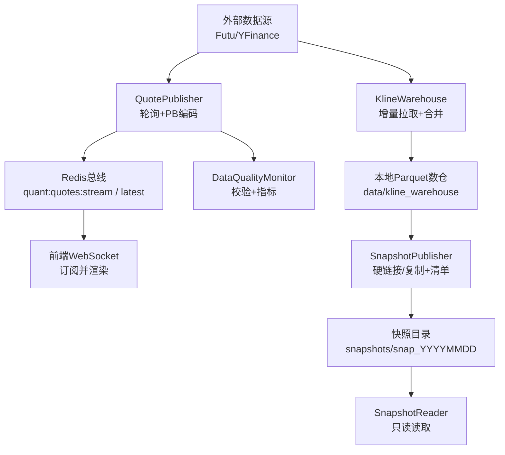
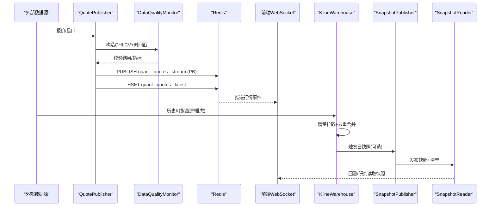
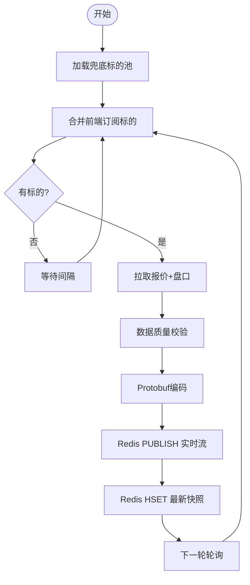
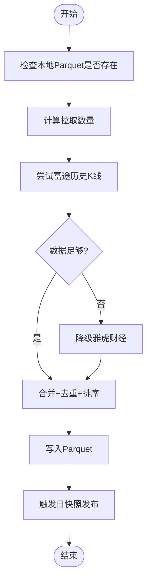
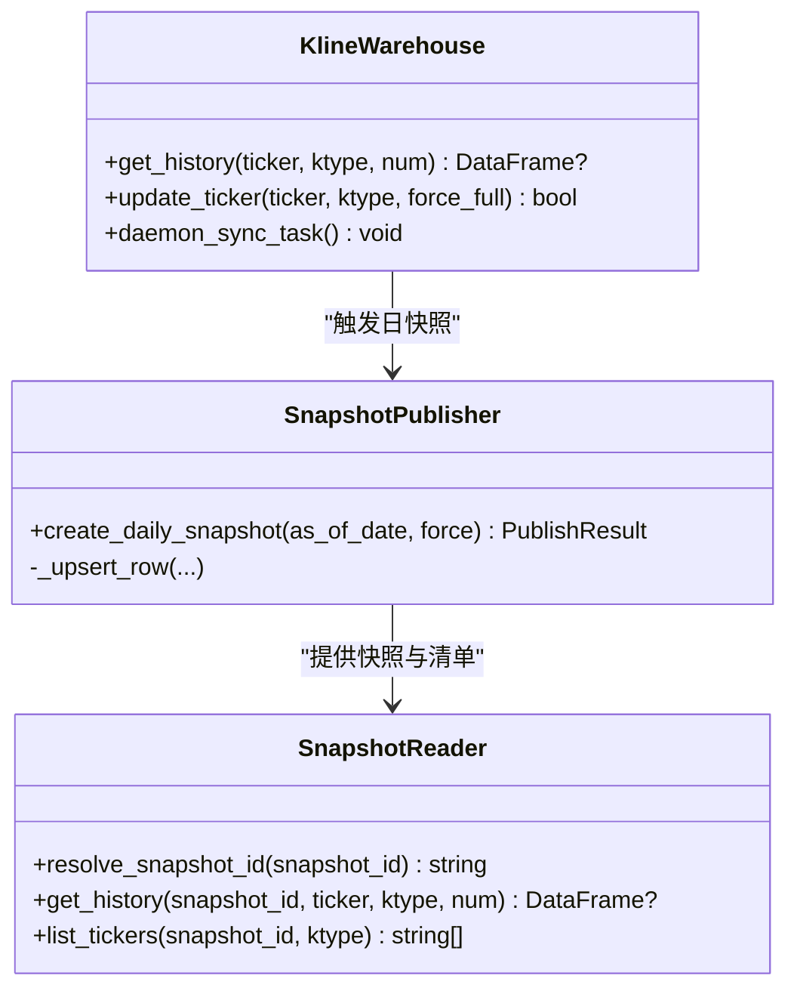
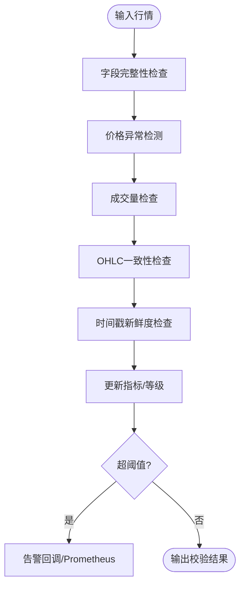
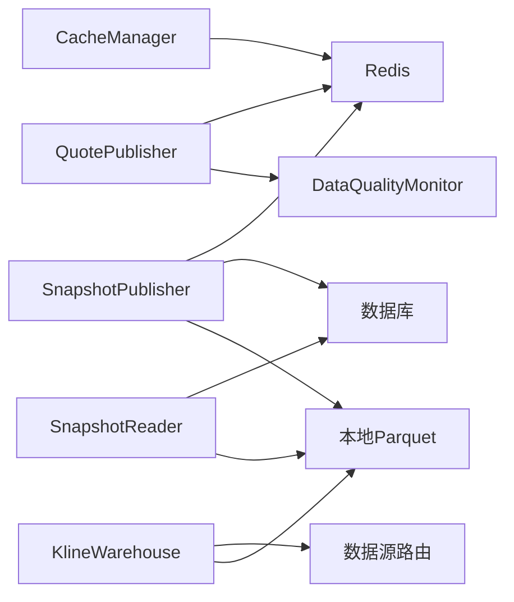

# 数据流设计

<cite>
**本文引用的文件**
- [kline_warehouse.py](file://backend/services/datalake/kline_warehouse.py)
- [snapshot_publisher.py](file://backend/services/datalake/snapshot_publisher.py)
- [snapshot_reader.py](file://backend/services/datalake/snapshot_reader.py)
- [monitor.py](file://backend/services/data_quality/monitor.py)
- [quote_publisher.py](file://backend/workers/quote_publisher.py)
- [quote_publisher_factory.py](file://backend/workers/collectors/quote_publisher.py)
- [cache_manager.py](file://backend/core/cache_manager.py)
</cite>

## 目录
1. [引言](#引言)
2. [项目结构](#项目结构)
3. [核心组件](#核心组件)
4. [架构总览](#架构总览)
5. [详细组件分析](#详细组件分析)
6. [依赖关系分析](#依赖关系分析)
7. [性能考虑](#性能考虑)
8. [故障排查指南](#故障排查指南)
9. [结论](#结论)
10. [附录](#附录)

## 引言
本文件面向Quant Agent系统的数据流设计，覆盖数据采集、处理、存储、分发全流程；重点说明实时数据流（WebSocket连接管理、推送策略、缓存更新）与历史数据ETL（清洗、转换、入库、索引/快照构建）；解释数据湖的Parquet存储、分区策略、版本控制与快照管理；给出数据质量监控与异常处理机制；并提供数据流向图与时序图，帮助读者理解不同类型数据在系统中的流转过程。最后总结性能优化策略（批量处理、异步IO、内存管理等）。

## 项目结构
围绕数据流的关键模块分布如下：
- 实时行情采集与发布：workers/quote_publisher.py、workers/collectors/quote_publisher.py
- 历史K线数仓与增量同步：services/datalake/kline_warehouse.py
- 数据湖快照发布与只读访问：services/datalake/snapshot_publisher.py、services/datalake/snapshot_reader.py
- 数据质量监控：services/data_quality/monitor.py
- 缓存清理工具：core/cache_manager.py

图表来源
- [quote_publisher.py:22-164](file://backend/workers/quote_publisher.py#L22-L164)
- [kline_warehouse.py:16-173](file://backend/services/datalake/kline_warehouse.py#L16-L173)
- [snapshot_publisher.py:91-250](file://backend/services/datalake/snapshot_publisher.py#L91-L250)
- [snapshot_reader.py:30-121](file://backend/services/datalake/snapshot_reader.py#L30-L121)
- [monitor.py:91-350](file://backend/services/data_quality/monitor.py#L91-L350)

章节来源
- [quote_publisher.py:22-164](file://backend/workers/quote_publisher.py#L22-L164)
- [kline_warehouse.py:16-173](file://backend/services/datalake/kline_warehouse.py#L16-L173)
- [snapshot_publisher.py:91-250](file://backend/services/datalake/snapshot_publisher.py#L91-L250)
- [snapshot_reader.py:30-121](file://backend/services/datalake/snapshot_reader.py#L30-L121)
- [monitor.py:91-350](file://backend/services/data_quality/monitor.py#L91-L350)

## 核心组件
- 实时行情生产者（QuotePublisher）：从首选数据源拉取报价与盘口，组装Protobuf消息，双写Redis最新快照与实时流，供前端WebSocket消费。
- K线数仓（KlineWarehouse）：按周期分目录存储Parquet，支持增量拉取、去重合并、线程池非阻塞读取，守护进程定时全量资产增量同步。
- 数据湖快照（SnapshotPublisher/SnapshotReader）：将live层Parquet以硬链接或复制方式发布为只读快照，生成manifest清单，提供latest解析与只读读取。
- 数据质量监控（DataQualityMonitor）：对单条行情进行字段完整性、价格异常、时间戳新鲜度等检查，输出脏数据率、延迟等指标并暴露Prometheus。
- 缓存清理（CacheManager）：集中清理业务缓存，保护交易态键不被误删。

章节来源
- [quote_publisher.py:22-164](file://backend/workers/quote_publisher.py#L22-L164)
- [kline_warehouse.py:16-173](file://backend/services/datalake/kline_warehouse.py#L16-L173)
- [snapshot_publisher.py:91-250](file://backend/services/datalake/snapshot_publisher.py#L91-L250)
- [snapshot_reader.py:30-121](file://backend/services/datalake/snapshot_reader.py#L30-L121)
- [monitor.py:91-350](file://backend/services/data_quality/monitor.py#L91-L350)
- [cache_manager.py:19-75](file://backend/core/cache_manager.py#L19-L75)

## 架构总览
系统采用“采集-处理-存储-分发”分层架构：
- 采集层：QuotePublisher轮询外部数据源，产出标准化行情消息。
- 处理层：数据质量监控对每条数据进行校验与度量；KlineWarehouse负责历史数据的增量拉取与合并。
- 存储层：本地Parquet数仓持久化K线；SnapshotPublisher将live层发布为不可变快照，附带manifest元数据。
- 分发层：Redis作为实时总线，前端通过WebSocket订阅并渲染；回测/研究通过SnapshotReader只读访问快照。

图表来源
- [quote_publisher.py:90-164](file://backend/workers/quote_publisher.py#L90-L164)
- [monitor.py:112-250](file://backend/services/data_quality/monitor.py#L112-L250)
- [kline_warehouse.py:55-173](file://backend/services/datalake/kline_warehouse.py#L55-L173)
- [snapshot_publisher.py:119-250](file://backend/services/datalake/snapshot_publisher.py#L119-L250)
- [snapshot_reader.py:42-121](file://backend/services/datalake/snapshot_reader.py#L42-L121)

## 详细组件分析

### 实时行情流：采集、校验、推送与缓存更新
- 采集与编排：工厂加载兜底标的池，启动QuotePublisher守护进程，动态合并前端订阅标的集合，限流并发拉取。
- 数据校验：对每条行情执行字段完整性、价格异常、成交量负值、OHLC一致性、时间戳新鲜度检查，累计脏数据率与延迟指标，必要时触发告警。
- 推送策略：使用Protobuf序列化消息，双写Redis最新快照与实时流，确保新连接可立即获取当前状态，已连接用户获得实时跳动。
- 缓存更新：最新快照以HSET维护，便于前端冷启动快速填充；同时通过流式发布实现增量更新。

图表来源
- [quote_publisher_factory.py:32-77](file://backend/workers/collectors/quote_publisher.py#L32-L77)
- [quote_publisher.py:166-222](file://backend/workers/quote_publisher.py#L166-L222)
- [monitor.py:112-250](file://backend/services/data_quality/monitor.py#L112-L250)

章节来源
- [quote_publisher_factory.py:32-77](file://backend/workers/collectors/quote_publisher.py#L32-L77)
- [quote_publisher.py:90-222](file://backend/workers/quote_publisher.py#L90-L222)
- [monitor.py:112-250](file://backend/services/data_quality/monitor.py#L112-L250)

### 历史数据ETL：清洗、转换、入库与索引/快照
- 增量拉取：优先富途高质量前复权数据，不足时降级至雅虎财经；根据上次时间与阈值计算拉取数量，避免重复与越界。
- 清洗与转换：统一列名（time/open/high/low/close/volume），时间列规范化，去重保留最新复权记录。
- 入库与索引：写入本地Parquet文件，按K线周期分目录组织；读取时使用pyarrow引擎并在线程池中执行，避免阻塞事件循环。
- 快照发布：每日凌晨触发全量资产增量同步后，发布日快照到只读目录，生成manifest清单，记录文件哈希、行数、时间范围等元数据。

图表来源
- [kline_warehouse.py:55-173](file://backend/services/datalake/kline_warehouse.py#L55-L173)
- [snapshot_publisher.py:119-250](file://backend/services/datalake/snapshot_publisher.py#L119-L250)

章节来源
- [kline_warehouse.py:55-173](file://backend/services/datalake/kline_warehouse.py#L55-L173)
- [snapshot_publisher.py:119-250](file://backend/services/datalake/snapshot_publisher.py#L119-L250)

### 数据湖存储架构：Parquet、分区、版本与快照
- 文件格式：使用Parquet列式存储，配合pyarrow引擎高效读取；快照内文件包含行计数、时间范围等元数据。
- 分区策略：按K线周期（如K_DAY、K_60M）分目录组织，文件名映射标的符号，便于快速定位与遍历。
- 版本控制：通过快照ID（snap_YYYYMMDD）标识时间点；manifest.json记录文件清单、哈希、拷贝模式、质量门控结果等。
- 快照管理：发布流程先创建目标目录，逐文件硬链接或复制，生成清单并落库；支持latest指针与只读访问。

图表来源
- [kline_warehouse.py:16-258](file://backend/services/datalake/kline_warehouse.py#L16-L258)
- [snapshot_publisher.py:91-302](file://backend/services/datalake/snapshot_publisher.py#L91-L302)
- [snapshot_reader.py:30-121](file://backend/services/datalake/snapshot_reader.py#L30-L121)

章节来源
- [kline_warehouse.py:16-258](file://backend/services/datalake/kline_warehouse.py#L16-L258)
- [snapshot_publisher.py:91-302](file://backend/services/datalake/snapshot_publisher.py#L91-L302)
- [snapshot_reader.py:30-121](file://backend/services/datalake/snapshot_reader.py#L30-L121)

### 数据质量监控与异常处理
- 校验规则：必填字段缺失、零价/负价、价格跳变、负成交量、OHLC不一致、时间戳过期、重复时间戳。
- 指标与告警：累计脏数据率、完整率、平均/最大延迟、异常计数；超过阈值触发告警回调并暴露Prometheus指标。
- 恢复策略：对异常数据不污染总线（不推送假价格），前端展示空/错误态；质量门控失败则快照标记为failed。

图表来源
- [monitor.py:112-350](file://backend/services/data_quality/monitor.py#L112-L350)

章节来源
- [monitor.py:112-350](file://backend/services/data_quality/monitor.py#L112-L350)

### WebSocket连接管理与数据推送策略
- 连接管理：前端通过WebSocket订阅市场数据；后端通过Redis集合维护订阅标的，动态决定推送范围。
- 推送策略：每轮动态解析订阅标的集合并限流并发拉取；对每个标的并行拉取报价与盘口，完成后序列化为PB消息，双写Redis最新快照与实时流。
- 容错与降级：超时或异常时不注入假数据，交由前端展示空/错误态；对第三方接口限制进行速率控制与错峰。

章节来源
- [quote_publisher.py:166-222](file://backend/workers/quote_publisher.py#L166-L222)
- [quote_publisher_factory.py:32-77](file://backend/workers/collectors/quote_publisher.py#L32-L77)

## 依赖关系分析
- QuotePublisher依赖数据源路由与Protobuf编解码，依赖Redis进行消息总线与快照存储。
- KlineWarehouse依赖数据源路由进行历史K线拉取，依赖本地文件系统与PyArrow进行Parquet读写。
- SnapshotPublisher依赖文件系统、数据库（快照元数据）、Redis（锁与latest指针），生成manifest清单。
- SnapshotReader依赖SnapshotResolver与Redis/PG解析latest，提供只读访问。
- DataQualityMonitor独立运行，输出Prometheus指标，被QuotePublisher在推送前调用。
- CacheManager提供安全的缓存清理能力，保护交易态键。

图表来源
- [quote_publisher.py:90-164](file://backend/workers/quote_publisher.py#L90-L164)
- [kline_warehouse.py:55-173](file://backend/services/datalake/kline_warehouse.py#L55-L173)
- [snapshot_publisher.py:119-250](file://backend/services/datalake/snapshot_publisher.py#L119-L250)
- [snapshot_reader.py:42-121](file://backend/services/datalake/snapshot_reader.py#L42-L121)
- [monitor.py:112-350](file://backend/services/data_quality/monitor.py#L112-L350)
- [cache_manager.py:19-75](file://backend/core/cache_manager.py#L19-L75)

章节来源
- [quote_publisher.py:90-164](file://backend/workers/quote_publisher.py#L90-L164)
- [kline_warehouse.py:55-173](file://backend/services/datalake/kline_warehouse.py#L55-L173)
- [snapshot_publisher.py:119-250](file://backend/services/datalake/snapshot_publisher.py#L119-L250)
- [snapshot_reader.py:42-121](file://backend/services/datalake/snapshot_reader.py#L42-L121)
- [monitor.py:112-350](file://backend/services/data_quality/monitor.py#L112-L350)
- [cache_manager.py:19-75](file://backend/core/cache_manager.py#L19-L75)

## 性能考虑
- 批量与并发：QuotePublisher对多标的采用并发拉取与信号量限流，减少外部接口压力；KlineWarehouse守护进程按周期顺序同步，错峰防限流。
- 异步IO：所有I/O操作（Redis、文件读取）均使用异步或线程池包装，避免阻塞事件循环；Parquet读取使用pyarrow引擎提升吞吐。
- 内存管理：任务组结束后及时释放引用，防止大对象滞留；快照发布采用硬链接优先，降低磁盘占用与复制开销。
- 缓存策略：Redis双写最新快照与实时流，缩短冷启动延迟；缓存清理工具保护交易态键，避免误删导致的状态丢失。

[本节为通用性能建议，不直接分析具体文件]

## 故障排查指南
- 行情推送为空：检查QuotePublisher是否成功拉取数据；确认Redis流与最新快照键存在；查看数据质量监控是否标记异常或延迟过高。
- 历史K线缺失：确认KlineWarehouse增量拉取逻辑是否触发；检查富途/雅虎数据源返回长度与降级路径；验证Parquet文件是否写入成功。
- 快照未发布：检查SnapshotPublisher质量门控结果与Redis锁状态；确认manifest生成与数据库落库；查看日志中的copy_mode与文件数量。
- 缓存清理风险：使用CacheManager清理业务缓存，注意受保护前缀不会被删除；若出现误删，需恢复交易态数据。

章节来源
- [quote_publisher.py:90-164](file://backend/workers/quote_publisher.py#L90-L164)
- [kline_warehouse.py:55-173](file://backend/services/datalake/kline_warehouse.py#L55-L173)
- [snapshot_publisher.py:119-250](file://backend/services/datalake/snapshot_publisher.py#L119-L250)
- [monitor.py:112-350](file://backend/services/data_quality/monitor.py#L112-L350)
- [cache_manager.py:19-75](file://backend/core/cache_manager.py#L19-L75)

## 结论
Quant Agent的数据流设计以高可靠与高性能为目标：实时行情通过QuotePublisher与Redis总线实现低延迟推送，历史K线通过KlineWarehouse进行增量同步与Parquet存储，数据湖快照提供不可变、带清单的版本化访问；数据质量监控贯穿采集与入库环节，保障数据可用性与可观测性。整体架构清晰分层、职责明确，具备良好的扩展性与运维友好性。

[本节为总结性内容，不直接分析具体文件]

## 附录
- 关键路径参考：
  - 实时行情生产与推送：[quote_publisher.py:90-164](file://backend/workers/quote_publisher.py#L90-L164)
  - 历史K线增量同步：[kline_warehouse.py:55-173](file://backend/services/datalake/kline_warehouse.py#L55-L173)
  - 快照发布与只读访问：[snapshot_publisher.py:119-250](file://backend/services/datalake/snapshot_publisher.py#L119-L250)、[snapshot_reader.py:42-121](file://backend/services/datalake/snapshot_reader.py#L42-L121)
  - 数据质量监控：[monitor.py:112-350](file://backend/services/data_quality/monitor.py#L112-L350)
  - 缓存清理：[cache_manager.py:19-75](file://backend/core/cache_manager.py#L19-L75)

[本节为参考信息，不直接分析具体文件]
